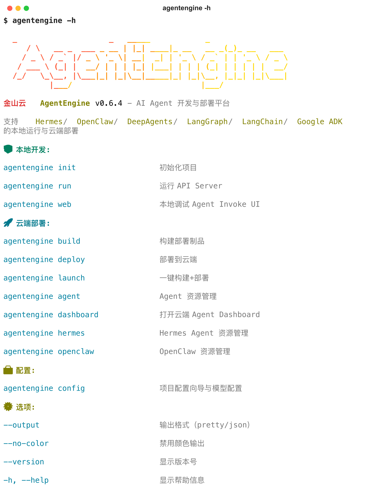

# KsADK

[简体中文](README.md) | [English](README.en.md)

[![zread](https://img.shields.io/badge/Ask_Zread-_.svg?style=flat&color=00b0aa&labelColor=000000&logo=data%3Aimage%2Fsvg%2Bxml%3Bbase64%2CPHN2ZyB3aWR0aD0iMTYiIGhlaWdodD0iMTYiIHZpZXdCb3g9IjAgMCAxNiAxNiIgZmlsbD0ibm9uZSIgeG1sbnM9Imh0dHA6Ly93d3cudzMub3JnLzIwMDAvc3ZnIj4KPHBhdGggZD0iTTQuOTYxNTYgMS42MDAxSDIuMjQxNTZDMS44ODgxIDEuNjAwMSAxLjYwMTU2IDEuODg2NjQgMS42MDE1NiAyLjI0MDFWNC45NjAxQzEuNjAxNTYgNS4zMTM1NiAxLjg4ODEgNS42MDAxIDIuMjQxNTYgNS42MDAxSDQuOTYxNTZDNS4zMTUwMiA1LjYwMDEgNS42MDE1NiA1LjMxMzU2IDUuNjAxNTYgNC45NjAxVjIuMjQwMUM1LjYwMTU2IDEuODg2NjQgNS4zMTUwMiAxLjYwMDEgNC45NjE1NiAxLjYwMDFaIiBmaWxsPSIjZmZmIi8%2BCjxwYXRoIGQ9Ik00Ljk2MTU2IDEwLjM5OTlIMi4yNDE1NkMxLjg4ODEgMTAuMzk5OSAxLjYwMTU2IDEwLjY4NjQgMS42MDE1NiAxMS4wMzk5VjEzLjc1OTlDMS42MDE1NiAxNC4xMTM0IDEuODg4MSAxNC4zOTk5IDIuMjQxNTYgMTQuMzk5OUg0Ljk2MTU2QzUuMzE1MDIgMTQuMzk5OSA1LjYwMTU2IDE0LjExMzQgNS42MDE1NiAxMy43NTk5VjExLjAzOTlDNS42MDE1NiAxMC42ODY0IDUuMzE1MDIgMTAuMzk5OSA0Ljk2MTU2IDEwLjM5OTlaIiBmaWxsPSIjZmZmIi8%2BCjxwYXRoIGQ9Ik0xMy43NTg0IDEuNjAwMUgxMS4wMzg0QzEwLjY4NSAxLjYwMDEgMTAuMzk4NCAxLjg4NjY0IDEwLjM5ODQgMi4yNDAxVjQuOTYwMUMxMC4zOTg0IDUuMzEzNTYgMTAuNjg1IDUuNjAwMSAxMS4wMzg0IDUuNjAwMUgxMy43NTg0QzE0LjExMTkgNS42MDAxIDE0LjM5ODQgNS4zMTM1NiAxNC4zOTg0IDQuOTYwMVYyLjI0MDFDMTQuMzk4NCAxLjg4NjY0IDE0LjExMTkgMS42MDAxIDEzLjc1ODQgMS42MDAxWiIgZmlsbD0iI2ZmZiIvPgo8cGF0aCBkPSJNNCAxMkwxMiA0TDQgMTJaIiBmaWxsPSIjZmZmIi8%2BCjxwYXRoIGQ9Ik00IDEyTDEyIDQiIHN0cm9rZT0iI2ZmZiIgc3Ryb2tlLXdpZHRoPSIxLjUiIHN0cm9rZS1saW5lY2FwPSJyb3VuZCIvPgo8L3N2Zz4K&logoColor=ffffff)](https://zread.ai/kingsoftcloud/ksadk-python)

Build agents once. Run them anywhere.

KsADK is the Agent Runtime Platform for AI agents. Keep building with Google ADK, LangGraph, LangChain, or DeepAgents, then run, debug, expose, sandbox, deploy, and observe those agents through one runtime experience.



## 30 Seconds Quick Start

```bash
python -m venv .venv
source .venv/bin/activate
pip install -U "ksadk[all]"

agentengine init demo-agent -f langgraph
cd demo-agent
agentengine config set OPENAI_API_KEY=your-api-key OPENAI_MODEL_NAME=gpt-4o-mini
agentengine run -i
```

Start the local debugging Web UI:

```bash
agentengine web . --no-open
```


## Why KsADK

Most agent frameworks solve how to build agents. KsADK solves how to run, debug, deploy, and observe them.

- Local development: `agentengine init`, `agentengine run`, `agentengine web`.
- Unified debugging: browser Web UI, streaming, attachments, workspace files, tool calls, and sessions.
- Unified protocol: local `/v1/responses` and `/v1/chat/completions`.
- Tool boundaries: Skill Runtime, Workspace, Sandbox, Memory, Knowledge.
- Engineering workflow: packaging, deployment, OpenTelemetry observability.

## Architecture


## Docs And Examples

- Documentation: <https://kingsoftcloud.github.io/ksadk-python/>
- Quick Start: <https://kingsoftcloud.github.io/ksadk-python/en/getting-started/quickstart/>
- Why KsADK: <https://kingsoftcloud.github.io/ksadk-python/en/getting-started/why-ksadk/>
- Architecture: <https://kingsoftcloud.github.io/ksadk-python/en/getting-started/architecture/>
- Ecosystem Positioning: <https://kingsoftcloud.github.io/ksadk-python/en/getting-started/comparison/>
- Observability: <https://kingsoftcloud.github.io/ksadk-python/en/guides/observability-tracing/>
- Samples: <https://github.com/kingsoftcloud/ksadk-samples>

## Related Projects

- KsADK repository: <https://github.com/kingsoftcloud/ksadk-python>
- Web UI repository: <https://github.com/kingsoftcloud/ksadk-web>
- Wiki: <https://zread.ai/kingsoftcloud/ksadk-python>
- PyPI: <https://pypi.org/project/ksadk/>
- Changelog: [CHANGELOG.md](CHANGELOG.md)
- GitHub Releases: <https://github.com/kingsoftcloud/ksadk-python/releases>

## Contributing

Issues, pull requests, samples, and documentation improvements are welcome. Before submitting, run:

```bash
make public-preflight
```

License: Apache-2.0.
