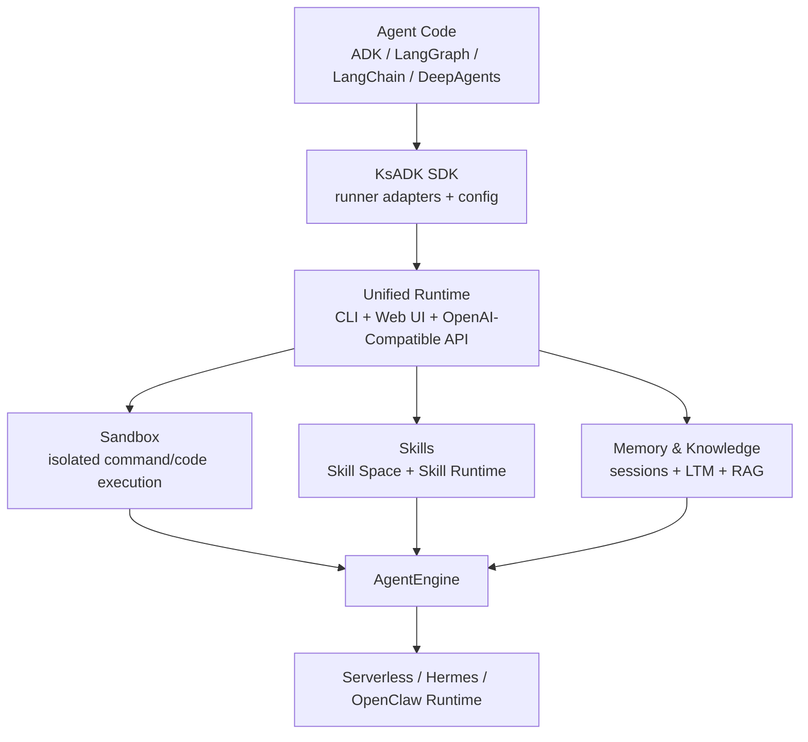

# KsADK

[简体中文](README.md) | [English](README.en.md)

[![zread](https://img.shields.io/badge/Ask_Zread-_.svg?style=flat&color=00b0aa&labelColor=000000&logo=data%3Aimage%2Fsvg%2Bxml%3Bbase64%2CPHN2ZyB3aWR0aD0iMTYiIGhlaWdodD0iMTYiIHZpZXdCb3g9IjAgMCAxNiAxNiIgZmlsbD0ibm9uZSIgeG1sbnM9Imh0dHA6Ly93d3cudzMub3JnLzIwMDAvc3ZnIj4KPHBhdGggZD0iTTQuOTYxNTYgMS42MDAxSDIuMjQxNTZDMS44ODgxIDEuNjAwMSAxLjYwMTU2IDEuODg2NjQgMS42MDE1NiAyLjI0MDFWNC45NjAxQzEuNjAxNTYgNS4zMTM1NiAxLjg4ODEgNS42MDAxIDIuMjQxNTYgNS42MDAxSDQuOTYxNTZDNS4zMTUwMiA1LjYwMDEgNS42MDE1NiA1LjMxMzU2IDUuNjAxNTYgNC45NjAxVjIuMjQwMUM1LjYwMTU2IDEuODg2NjQgNS4zMTUwMiAxLjYwMDEgNC45NjE1NiAxLjYwMDFaIiBmaWxsPSIjZmZmIi8%2BCjxwYXRoIGQ9Ik00Ljk2MTU2IDEwLjM5OTlIMi4yNDE1NkMxLjg4ODEgMTAuMzk5OSAxLjYwMTU2IDEwLjY4NjQgMS42MDE1NiAxMS4wMzk5VjEzLjc1OTlDMS42MDE1NiAxNC4xMTM0IDEuODg4MSAxNC4zOTk5IDIuMjQxNTYgMTQuMzk5OUg0Ljk2MTU2QzUuMzE1MDIgMTQuMzk5OSA1LjYwMTU2IDE0LjExMzQgNS42MDE1NiAxMy43NTk5VjExLjAzOTlDNS42MDE1NiAxMC42ODY0IDUuMzE1MDIgMTAuMzk5OSA0Ljk2MTU2IDEwLjM5OTlaIiBmaWxsPSIjZmZmIi8%2BCjxwYXRoIGQ9Ik0xMy43NTg0IDEuNjAwMUgxMS4wMzg0QzEwLjY4NSAxLjYwMDEgMTAuMzk4NCAxLjg4NjY0IDEwLjM5ODQgMi4yNDAxVjQuOTYwMUMxMC4zOTg0IDUuMzEzNTYgMTAuNjg1IDUuNjAwMSAxMS4wMzg0IDUuNjAwMUgxMy43NTg0QzE0LjExMTkgNS42MDAxIDE0LjM5ODQgNS4zMTM1NiAxNC4zOTg0IDQuOTYwMVYyLjI0MDFDMTQuMzk4NCAxLjg4NjY0IDE0LjExMTkgMS42MDAxIDEzLjc1ODQgMS42MDAxWiIgZmlsbD0iI2ZmZiIvPgo8cGF0aCBkPSJNNCAxMkwxMiA0TDQgMTJaIiBmaWxsPSIjZmZmIi8%2BCjxwYXRoIGQ9Ik00IDEyTDEyIDQiIHN0cm9rZT0iI2ZmZiIgc3Ryb2tlLXdpZHRoPSIxLjUiIHN0cm9rZS1saW5lY2FwPSJyb3VuZCIvPgo8L3N2Zz4K&logoColor=ffffff)](https://zread.ai/kingsoftcloud/ksadk-python)

Build agents once. Run them anywhere.

KsADK is the Agent Runtime Platform for AI agents. Build with Google ADK, LangGraph, LangChain, or DeepAgents, then run, debug, expose, observe, and deploy those agents through one runtime experience.

Current version: `0.6.4`.

- Local Development
- Browser Debugging UI
- OpenAI-Compatible API
- Unified Runtime
- Sandbox Execution
- Serverless Deployment
- Hermes & OpenClaw Runtime

## Why KsADK

Most agent frameworks solve agent development.

KsADK solves agent runtime.

It does not replace your framework. It provides the unified platform layer for:

- Development: one CLI for project creation, configuration, and local runs.
- Debugging: browser UI, sessions, attachments, workspace files, and streaming output.
- Runtime: framework runners, OpenAI-Compatible APIs, and consistent invocation.
- Sandbox: Skill Runtime, Workspace, and isolated sandbox backend boundaries.
- Deployment: Serverless, Hermes, OpenClaw, and remote AgentEngine entrypoints.
- Observability: OpenTelemetry-first tracing for multiple backends.

Keep using your preferred framework. Get a complete runtime platform.

## 30 Seconds Quick Start

```bash
python -m venv .venv
source .venv/bin/activate
pip install -U "ksadk[all]"

agentengine init demo-agent -f langgraph
cd demo-agent
agentengine config set OPENAI_API_KEY=your-api-key OPENAI_MODEL_NAME=gpt-4o-mini
agentengine run -i
```

Open the local browser debugging UI:

```bash
agentengine web . --no-open
```

If your model provider is not the default OpenAI endpoint, also set:

```bash
agentengine config set OPENAI_BASE_URL=https://api.example.com/v1
```

## Architecture



## Supported Frameworks

| Framework | What KsADK adds |
| --- | --- |
| Google ADK | Templates, runner adapter, local runtime, Web UI debugging, and deployment entrypoints. |
| LangGraph | Graph-state entrypoint, tool calling, streaming, Skill Runtime, and workspace toolsets. |
| LangChain | Runnable/chain adaptation, local OpenAI-Compatible APIs, and tracing. |
| DeepAgents | Project entrypoint, runtime wrapping, browser debugging, and deployment artifacts. |

## Comparison

| Capability | ADK | LangGraph | OpenAI Agents SDK | KsADK |
| --- | --- | --- | --- | --- |
| Agent Development | Yes | Yes | Yes | Yes |
| Browser Debugging UI | No | No | No | Yes |
| Unified CLI | No | No | No | Yes |
| OpenAI Compatible API | No | No | Partial | Yes |
| Sandbox Runtime | No | No | No | Yes |
| Deployment Workflow | No | No | No | Yes |
| Multi Runtime Backend | No | No | No | Yes |

This table compares unified runtime-platform capabilities provided by the project itself. KsADK is designed to complement agent frameworks, not replace them.

## Core Capabilities

- `agentengine init`: create or import an agent project.
- `agentengine config`: manage `.env` and `agentengine.yaml`.
- `agentengine run`: run and debug locally from the terminal.
- `agentengine web`: start the local Web UI for streaming, attachments, workspace files, tools, and sessions.
- `/v1/responses` and `/v1/chat/completions`: expose OpenAI-Compatible APIs.
- `ksadk.toolsets`: built-in Skill, Workspace, Platform, and Sandbox tools.
- Skill Runtime: discover, download, verify, load, and execute Skill workflows.
- Sandbox Runtime: execute commands or code through a configured isolated backend.
- Hermes & OpenClaw: runtime backends for fuller deployment scenarios.

## Examples

The samples repository is organized by scenario, not only by framework:

- [KSADK Samples](https://github.com/kingsoftcloud/ksadk-samples)
- Knowledge Assistant: RAG and knowledge-base QA.
- Workflow Agent: LangGraph plus AgentEngine toolsets.
- Tool-Using Agent: custom business tools.
- Memory-aware Agent: short-term and long-term memory patterns.

Every public demo should include a Chinese-first README, run commands, environment-variable guidance, fallback behavior, and verification prompts.

## Deployment

KsADK is local-first, with reviewed deployment entrypoints when you are ready:

```bash
agentengine build .
agentengine launch . --target serverless
agentengine dashboard open
```

When updating existing Hermes or OpenClaw instances, KsADK preserves server-side env, storage, network, and memory configuration by default. Those groups are overwritten only when matching CLI options are provided explicitly.

## Observability

KsADK is OpenTelemetry-native.

Prefer standard OTLP environment variables:

```bash
OTEL_EXPORTER_OTLP_ENDPOINT=https://otel.example.com
OTEL_EXPORTER_OTLP_HEADERS=Authorization=Bearer%20token
```

Compatible with:

- Langfuse
- Arize
- Datadog
- Grafana
- Phoenix

Export once. Observe anywhere.

## 0.6.4 Highlights

- Reposition public messaging from a generic SDK to an Agent Runtime Platform, with Why KsADK, a 30-second quick start, architecture, comparison, deployment, observability, and community sections.
- Rework the docs homepage and MkDocs navigation around Getting Started / Build / Run / Deploy / Observe / Extend / Reference.
- Remove environment-specific wording from README, CHANGELOG, docs, and future PyPI metadata so public pages do not expose internal environment names or internal headers.
- Add public-positioning and sensitive-word regressions to `public-preflight`.

## 0.6.3 Highlights

- Hosted UI links align with the latest gateway / server contract, including `/hosted-ui/chat/`, share links, SSE subscription, and native terminal proxying.
- LangGraph runner emits a final answer after tool calls even when the model does not stream text chunks.
- Skill Service routing can be configured through environment variables for service URL, region, and required request-header mapping.
- OpenClaw and Hermes updates preserve existing server-side env, storage, network, and memory configuration by default.
- `ksadk.toolsets`, Tool Gateway, Skill Runtime, and Skill Service files are included in the package so the recommended LangGraph demo works after a clean install.

## Documentation

- Documentation: <https://kingsoftcloud.github.io/ksadk-python/>
- 中文文档: <https://kingsoftcloud.github.io/ksadk-python/zh/>
- English documentation: <https://kingsoftcloud.github.io/ksadk-python/en/>
- CLI reference: <https://kingsoftcloud.github.io/ksadk-python/reference/cli/>
- OpenAI-Compatible API: <https://kingsoftcloud.github.io/ksadk-python/reference/openai-compatible-api/>

## Community

- Repository: <https://github.com/kingsoftcloud/ksadk-python>
- Wiki: <https://zread.ai/kingsoftcloud/ksadk-python>
- Samples repository: <https://github.com/kingsoftcloud/ksadk-samples>
- Web UI repository: <https://github.com/kingsoftcloud/ksadk-web>
- PyPI: <https://pypi.org/project/ksadk/>
- License: Apache-2.0
