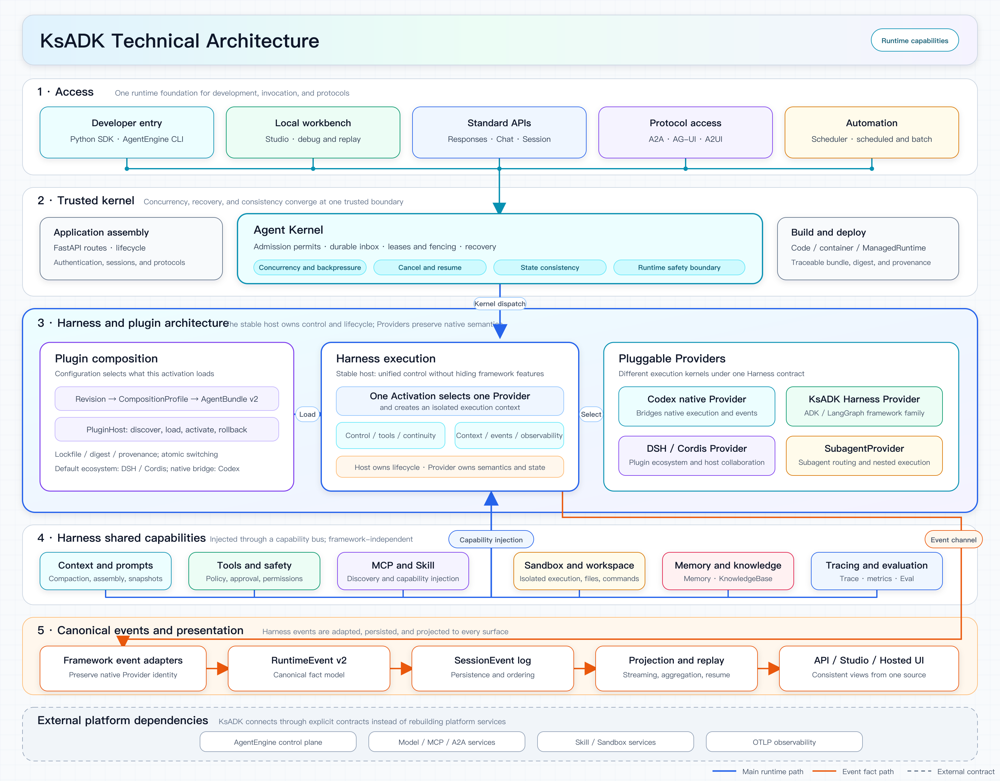

<h1 align="center">Kingsoft Cloud Agent Development Kit</h1>

<p align="center"><strong>Agent development kit for Kingsoft Cloud</strong></p>

<p align="center">
  A cloud-native framework to build, deploy, debug, and observe enterprise AI agents.
  It works with Google ADK, LangGraph, LangChain, and DeepAgents, with one-command OpenClaw and Hermes runtime launch paths.
</p>

<p align="center"><a href="README.md">简体中文</a> · <a href="README.en.md">English</a></p>

<p align="center">
  <a href="https://kingsoftcloud.github.io/ksadk-python/"></a>
  <a href="https://pypi.org/project/ksadk/"></a>
  <a href="LICENSE"></a>
</p>

<p align="center"><a href="docs-site/public/assets/ksadk-runtime-platform-hero.png"></a></p>

## 30 Seconds Quick Start

```bash
python -m venv .venv
source .venv/bin/activate
pip install -U "ksadk[all]"

agentengine init demo-agent -f langgraph
cd demo-agent
agentengine config set OPENAI_API_KEY=your-api-key OPENAI_MODEL_NAME=gpt-4o-mini
agentengine run -i
```

Start the local debugging Web UI:

```bash
agentengine web . --no-open
```

## 0.8.3 Runtime Architecture

KsADK 0.8.3 converges framework adaptation into stable runtime layers while preserving each framework's native execution semantics:

- **Trusted kernel**: owns concurrency, cancellation, recovery, state consistency, and runtime safety boundaries.
- **Harness execution layer**: owns composition, Activation, lifecycle, and shared-capability injection; each Activation selects exactly one Provider.
- **Pluggable Providers**: Codex, KsADK Harness, DSH/Cordis, and Subagent run behind one Harness contract while retaining native thread, checkpoint, and event semantics.
- **Unified events**: `RuntimeEvent(schema_version=2)` is the event source of truth for storage, replay, APIs, Studio, and hosted surfaces; v1 is read-only compatibility projection only.
- **Controlled plugins**: DSH Bundle/Profile uses a pinned toolchain, immutable source digests, and rollback on failed upgrades; official Codex plugins remain owned by Codex App Server.
- **Local development loop**: Studio covers authoring, builds, debugging, evaluation, and Scheduler Lite; the bundled UI is pinned to `@kingsoftcloud/ksadk-web@0.3.4`.

Start with the [0.8.3 runtime architecture](https://kingsoftcloud.github.io/ksadk-python/en/docs/framework/guides/runtime-architecture/), [AgentKit Local Studio](https://kingsoftcloud.github.io/ksadk-python/en/docs/framework/guides/agentkit-local-studio/), and [plugins and automations](https://kingsoftcloud.github.io/ksadk-python/en/docs/framework/guides/plugins-and-automations/). See the [changelog](CHANGELOG.md) and PyPI badge for version history and publication status.

### RuntimeEvent Schema v2 Contract

The event path is canonical `RuntimeEvent(schema_version=2)`. Its capability descriptor is `RuntimeEventVersions=[1,2]`, `RuntimeEventDefault=2`, `RuntimeEventV1ProjectionModes=["snapshot_only","identity_replace"]`, and `RuntimeEventV1ProjectionDefault="snapshot_only"`. Version 1 is a read-only compatibility projection.

<p align="center"></p>

<p align="center"></p>

## Why KsADK

Most agent frameworks solve how to build agents. KsADK solves how to run, debug, deploy, and observe them.

- Local development: `agentengine init`, `agentengine run`, `agentengine web`.
- Unified debugging: browser Web UI, streaming, attachments, workspace files, tool calls, and sessions.
- Unified protocol: local `/v1/responses` and `/v1/chat/completions`.
- Tool boundaries: Skill Runtime, Workspace, Sandbox, Memory, Knowledge.
- Engineering workflow: packaging, deployment, OpenClaw / Hermes runtimes, OpenTelemetry observability.

## Architecture

<p align="center"></p>

Agent Kernel centralizes trusted control, Harness owns composition and lifecycle, and pluggable Providers preserve native execution semantics. RuntimeEvent v2 supplies one event fact chain for APIs, Studio, and hosted surfaces.

## Docs And Examples

- Documentation: <https://kingsoftcloud.github.io/ksadk-python/>
- Quick Start: <https://kingsoftcloud.github.io/ksadk-python/en/docs/framework/getting-started/quickstart/>
- Why KsADK: <https://kingsoftcloud.github.io/ksadk-python/en/docs/framework/getting-started/why-ksadk/>
- Architecture: <https://kingsoftcloud.github.io/ksadk-python/en/docs/framework/getting-started/architecture/>
- Ecosystem Positioning: <https://kingsoftcloud.github.io/ksadk-python/en/docs/framework/getting-started/comparison/>
- Observability: <https://kingsoftcloud.github.io/ksadk-python/en/docs/framework/guides/observability-tracing/>
- Cloud Deployment: <https://kingsoftcloud.github.io/ksadk-python/en/docs/framework/guides/cloud-deployment/>
- Hosted UI and Event Replay: <https://kingsoftcloud.github.io/ksadk-python/en/docs/framework/guides/hosted-ui-events/>
- Environment Variables: <https://kingsoftcloud.github.io/ksadk-python/en/docs/references/environment-variables/>
- Samples: <https://github.com/kingsoftcloud/ksadk-samples>

## Related Projects

- KsADK repository: <https://github.com/kingsoftcloud/ksadk-python>
- Web UI repository: <https://github.com/kingsoftcloud/ksadk-web>
- PyPI: <https://pypi.org/project/ksadk/>

## Contributing

Issues, pull requests, samples, and documentation improvements are welcome. Before submitting, run:

```bash
make public-preflight
```

License: Apache-2.0.
