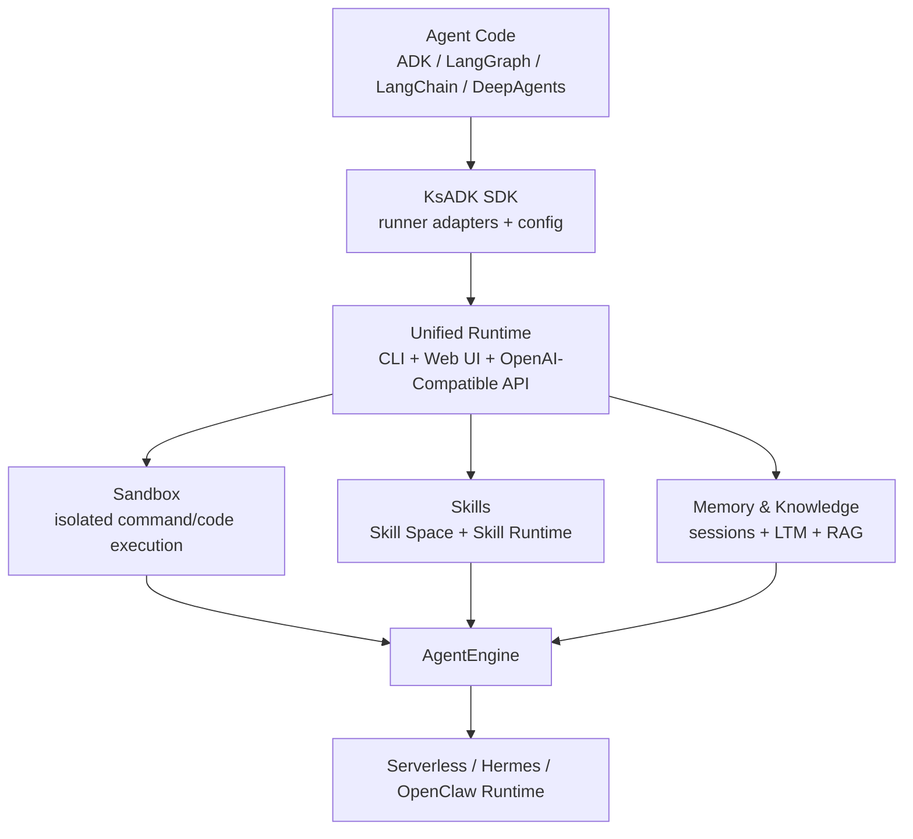

# KsADK

[简体中文](README.md) | [English](README.en.md)

[![zread](https://img.shields.io/badge/Ask_Zread-_.svg?style=flat&color=00b0aa&labelColor=000000&logo=data%3Aimage%2Fsvg%2Bxml%3Bbase64%2CPHN2ZyB3aWR0aD0iMTYiIGhlaWdodD0iMTYiIHZpZXdCb3g9IjAgMCAxNiAxNiIgZmlsbD0ibm9uZSIgeG1sbnM9Imh0dHA6Ly93d3cudzMub3JnLzIwMDAvc3ZnIj4KPHBhdGggZD0iTTQuOTYxNTYgMS42MDAxSDIuMjQxNTZDMS44ODgxIDEuNjAwMSAxLjYwMTU2IDEuODg2NjQgMS42MDE1NiAyLjI0MDFWNC45NjAxQzEuNjAxNTYgNS4zMTM1NiAxLjg4ODEgNS42MDAxIDIuMjQxNTYgNS42MDAxSDQuOTYxNTZDNS4zMTUwMiA1LjYwMDEgNS42MDE1NiA1LjMxMzU2IDUuNjAxNTYgNC45NjAxVjIuMjQwMUM1LjYwMTU2IDEuODg2NjQgNS4zMTUwMiAxLjYwMDEgNC45NjE1NiAxLjYwMDFaIiBmaWxsPSIjZmZmIi8%2BCjxwYXRoIGQ9Ik00Ljk2MTU2IDEwLjM5OTlIMi4yNDE1NkMxLjg4ODEgMTAuMzk5OSAxLjYwMTU2IDEwLjY4NjQgMS42MDE1NiAxMS4wMzk5VjEzLjc1OTlDMS42MDE1NiAxNC4xMTM0IDEuODg4MSAxNC4zOTk5IDIuMjQxNTYgMTQuMzk5OUg0Ljk2MTU2QzUuMzE1MDIgMTQuMzk5OSA1LjYwMTU2IDE0LjExMzQgNS42MDE1NiAxMy43NTk5VjExLjAzOTlDNS42MDE1NiAxMC42ODY0IDUuMzE1MDIgMTAuMzk5OSA0Ljk2MTU2IDEwLjM5OTlaIiBmaWxsPSIjZmZmIi8%2BCjxwYXRoIGQ9Ik0xMy43NTg0IDEuNjAwMUgxMS4wMzg0QzEwLjY4NSAxLjYwMDEgMTAuMzk4NCAxLjg4NjY0IDEwLjM5ODQgMi4yNDAxVjQuOTYwMUMxMC4zOTg0IDUuMzEzNTYgMTAuNjg1IDUuNjAwMSAxMS4wMzg0IDUuNjAwMUgxMy43NTg0QzE0LjExMTkgNS42MDAxIDE0LjM5ODQgNS4zMTM1NiAxNC4zOTg0IDQuOTYwMVYyLjI0MDFDMTQuMzk4NCAxLjg4NjY0IDE0LjExMTkgMS42MDAxIDEzLjc1ODQgMS42MDAxWiIgZmlsbD0iI2ZmZiIvPgo8cGF0aCBkPSJNNCAxMkwxMiA0TDQgMTJaIiBmaWxsPSIjZmZmIi8%2BCjxwYXRoIGQ9Ik00IDEyTDEyIDQiIHN0cm9rZT0iI2ZmZiIgc3Ryb2tlLXdpZHRoPSIxLjUiIHN0cm9rZS1saW5lY2FwPSJyb3VuZCIvPgo8L3N2Zz4K&logoColor=ffffff)](https://zread.ai/kingsoftcloud/ksadk-python)

Build agents once. Run them anywhere.

KsADK is the Agent Runtime Platform for AI agents. 你可以继续使用 Google ADK、LangGraph、LangChain 或 DeepAgents 编写业务 Agent，再用 KsADK 获得统一的本地运行、浏览器调试、OpenAI-Compatible API、沙箱执行、部署和可观测体验。

当前版本：`0.6.4`。

- Local Development
- Browser Debugging UI
- OpenAI-Compatible API
- Unified Runtime
- Sandbox Execution
- Serverless Deployment
- Hermes & OpenClaw Runtime

## Why KsADK

Most agent frameworks solve agent development.

KsADK solves agent runtime.

它不替换你的框架，而是在框架之上补齐运行时平台层：

- Development：统一 `agentengine init`、`agentengine config`、`agentengine run`。
- Debugging：本地 Web UI、会话、附件、workspace 文件和流式输出。
- Runtime：统一 Runner、OpenAI-Compatible API 和多框架入口。
- Sandbox：Skill Runtime、Workspace 和 sandbox backend 的隔离执行边界。
- Deployment：Serverless、Hermes、OpenClaw 和远端 AgentEngine 入口。
- Observability：OpenTelemetry-first tracing，可对接多种观测后端。

Keep using your preferred framework. Get a complete runtime platform.

## 30 秒快速体验

```bash
python -m venv .venv
source .venv/bin/activate
pip install -U "ksadk[all]"

agentengine init demo-agent -f langgraph
cd demo-agent
agentengine config set OPENAI_API_KEY=your-api-key OPENAI_MODEL_NAME=gpt-4o-mini
agentengine run -i
```

打开本地浏览器调试界面：

```bash
agentengine web . --no-open
```

如果你的模型服务不是默认 OpenAI endpoint，再额外配置：

```bash
agentengine config set OPENAI_BASE_URL=https://api.example.com/v1
```

如果需要调用金山云 AgentEngine、Skill Service、知识库或长期记忆等线上能力，建议显式设置线上默认地域：

```bash
agentengine config set KSYUN_REGION=cn-beijing-6
```

## Architecture



## Supported Frameworks

| Framework | KsADK 负责什么 |
| --- | --- |
| Google ADK | 项目模板、Runner 适配、本地运行、Web UI 调试和部署入口。 |
| LangGraph | 图状态入口、工具调用、streaming、Skill Runtime 和 workspace toolsets。 |
| LangChain | Runnable/chain 适配、本地 OpenAI-Compatible API 和 tracing。 |
| DeepAgents | 项目入口、运行时包装、浏览器调试和部署制品。 |

## Comparison

| Capability | ADK | LangGraph | OpenAI Agents SDK | KsADK |
| --- | --- | --- | --- | --- |
| Agent Development | Yes | Yes | Yes | Yes |
| Browser Debugging UI | No | No | No | Yes |
| Unified CLI | No | No | No | Yes |
| OpenAI Compatible API | No | No | Partial | Yes |
| Sandbox Runtime | No | No | No | Yes |
| Deployment Workflow | No | No | No | Yes |
| Multi Runtime Backend | No | No | No | Yes |

这张表只比较“项目自带的统一运行时平台能力”。KsADK 的设计目标不是替代这些框架，而是把它们放进同一套运行、调试、部署和观测体验里。

## Core Capabilities

- `agentengine init`：创建或导入 Agent 项目。
- `agentengine config`：管理 `.env` 和 `agentengine.yaml`。
- `agentengine run`：本地终端运行和交互调试。
- `agentengine web`：启动本地 Web UI，验证 streaming、附件、workspace、工具调用和会话。
- `/v1/responses` 与 `/v1/chat/completions`：提供 OpenAI-Compatible API。
- `ksadk.toolsets`：提供 Skill、Workspace、Platform、Sandbox 内置工具。
- Skill Runtime：发现、下载、校验、加载并隔离执行 Skill workflow。
- Sandbox Runtime：通过可配置后端隔离执行命令或代码。
- Hermes & OpenClaw：面向更完整 runtime 后端的部署和更新路径。

## Examples

样例仓库按场景组织，而不是只按技术框架分类：

- [KSADK Samples](https://github.com/kingsoftcloud/ksadk-samples)
- Knowledge Assistant：知识库问答和 RAG。
- Workflow Agent：LangGraph + AgentEngine toolsets。
- Tool-Using Agent：自定义工具调用。
- Memory-aware Agent：短期记忆和长期记忆接入。

每个公开 demo 都应包含中文 README、运行命令、环境变量说明、降级行为和验证问题。

## Deployment

KsADK 支持本地优先的开发路径，也提供经过审核后可使用的部署入口：

```bash
agentengine build .
agentengine launch . --target serverless
agentengine dashboard open
```

Hermes 和 OpenClaw 更新已有实例时默认保留服务端已有 env、storage、network、memory 配置，只在显式传入对应 CLI 参数时覆盖，避免升级镜像时误改用户配置。

## Observability

KsADK is OpenTelemetry-native.

你可以优先使用标准 OTLP 环境变量：

```bash
OTEL_EXPORTER_OTLP_ENDPOINT=https://otel.example.com
OTEL_EXPORTER_OTLP_HEADERS=Authorization=Bearer%20token
```

Compatible with:

- Langfuse
- Arize
- Datadog
- Grafana
- Phoenix

Export once. Observe anywhere.

## 0.6.4 重点

- 将公开定位从普通 SDK 调整为 Agent Runtime Platform，首页补齐 Why KsADK、30 秒体验、架构图、对比表、Deployment、Observability 和 Community。
- 重构文档首页和 MkDocs 导航为 Getting Started / Build / Run / Deploy / Observe / Extend / Reference。
- 清理 README、CHANGELOG、文档和后续 PyPI 元数据中的环境特定表述，避免公开页面出现内部环境名或内部 header。
- 将公开定位和敏感词扫描纳入 `public-preflight`，防止后续回退。

## 0.6.3 重点

- Hosted UI 与最新 gateway / server 契约对齐，覆盖 `/hosted-ui/chat/`、分享链接、SSE 订阅和 native terminal 代理。
- LangGraph runner 在工具调用后即使没有文本流式 chunk，也会输出最终 answer，避免本地 Web UI 出现空 assistant message。
- Skill Service 增强环境化路由能力，支持通过环境变量配置服务地址、region 与必要请求头映射。
- OpenClaw / Hermes 更新已有实例时默认保留服务端已有 env、storage、network、memory 配置。
- `ksadk.toolsets`、Tool Gateway、Skill Runtime 与 Skill Service 相关文件纳入发布包，LangGraph demo 可在干净安装后绑定 AgentEngine 内置工具。

## Documentation

- 文档：<https://kingsoftcloud.github.io/ksadk-python/>
- 中文文档：<https://kingsoftcloud.github.io/ksadk-python/zh/>
- English documentation：<https://kingsoftcloud.github.io/ksadk-python/en/>
- 命令行参考：<https://kingsoftcloud.github.io/ksadk-python/reference/cli/>
- OpenAI-Compatible API：<https://kingsoftcloud.github.io/ksadk-python/reference/openai-compatible-api/>

## Community

- 仓库：<https://github.com/kingsoftcloud/ksadk-python>
- Wiki：<https://zread.ai/kingsoftcloud/ksadk-python>
- 示例仓库：<https://github.com/kingsoftcloud/ksadk-samples>
- Web UI 仓库：<https://github.com/kingsoftcloud/ksadk-web>
- PyPI：<https://pypi.org/project/ksadk/>
- 开源协议：Apache-2.0
