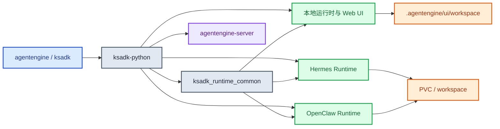

# ksadk-python

`ksadk-python` 是 `agentengine` / `ksadk` 的 Python 实现仓库，负责本地开发入口、Agent CLI、部分本地运行时能力，以及 Hermes / OpenClaw 共享运行时资产。

当前代码主线版本：`0.5.4`。

## 仓库定位

- 本地开发：`init / config / run / web`
- 构建部署：`build / deploy / launch`
- 远端调用：`agent invoke`、`files`、`dashboard`
- 运行时资产：`deploy/hermes`、`deploy/openclaw`
- 共享源码：`ksadk_runtime_common`


```mermaid
flowchart LR
  classDef client fill:#dbeafe,stroke:#1d4ed8,stroke-width:2px,color:#1e3a8a;
  classDef control fill:#ede9fe,stroke:#7c3aed,stroke-width:2px,color:#581c87;
  classDef data fill:#dcfce7,stroke:#16a34a,stroke-width:2px,color:#166534;
  classDef storage fill:#ffedd5,stroke:#ea580c,stroke-width:2px,color:#9a3412;
  classDef runtime fill:#e2e8f0,stroke:#475569,stroke-width:2px,color:#1e293b;

  CLI["agentengine / ksadk"]:::client --> Repo["ksadk-python"]:::runtime
  Repo --> Local["本地运行时与 Web UI"]:::data
  Repo --> Common["ksadk_runtime_common"]:::runtime
  Repo --> Hermes["Hermes Runtime"]:::data
  Repo --> OpenClaw["OpenClaw Runtime"]:::data
  Repo --> Control["agentengine-server"]:::control
  Hermes --> PVC["PVC / workspace"]:::storage
  OpenClaw --> PVC
  Local --> Workspace[".agentengine/ui/workspace"]:::storage
  Common --> Hermes
  Common --> OpenClaw
  Common --> Local
```

## 快速开始

```bash
pip install -U ksadk

agentengine init my-agent -f langgraph
cd my-agent
agentengine config
agentengine run -i
```

云端部署最短路径：

```bash
agentengine launch . --target serverless
```

## 文档导航

### 主文档

- [ksadk使用文档](./docs/ksadk使用文档.md)
- [ksadk技术设计](./docs/ksadk技术设计.md)
- [工作区文件技术设计](./docs/工作区文件技术设计.md)

### 专题文档

- [记忆使用指南](./docs/记忆使用指南.md)
- [知识库与记忆示例](./docs/知识库与记忆示例.md)
- [OpenClaw一键部署指南](./docs/openclaw一键部署指南.md)
- [DeepAgents说明](./docs/DeepAgents说明.md)
- [Hermes 运行时说明](./deploy/hermes/README.md)
- [OpenClaw 用户镜像模板说明](./deploy/openclaw-user-template/README.md)

### 内部与历史资料

- `docs/archive/`：历史方案稿、阶段性实施说明、版本文档
- `docs/internal/`：内部 runbook、分析稿、协作说明

查看云端面板：

```bash
agentengine dashboard open
# 或显式指定 Agent
agentengine dashboard open --agent ar-xxxx
```

## 说明

- `README` 只保留仓库定位、入口和导航。
- 命令说明、默认值、限制和示例统一收口到 [ksadk使用文档](./docs/ksadk使用文档.md)。
- 设计分层、运行时链路、共享源码和 Docker 集成统一收口到 [ksadk技术设计](./docs/ksadk技术设计.md)。
- Workspace Files 的协议、路径、安全模型和跨 runtime 数据面统一收口到 [工作区文件技术设计](./docs/工作区文件技术设计.md)。
