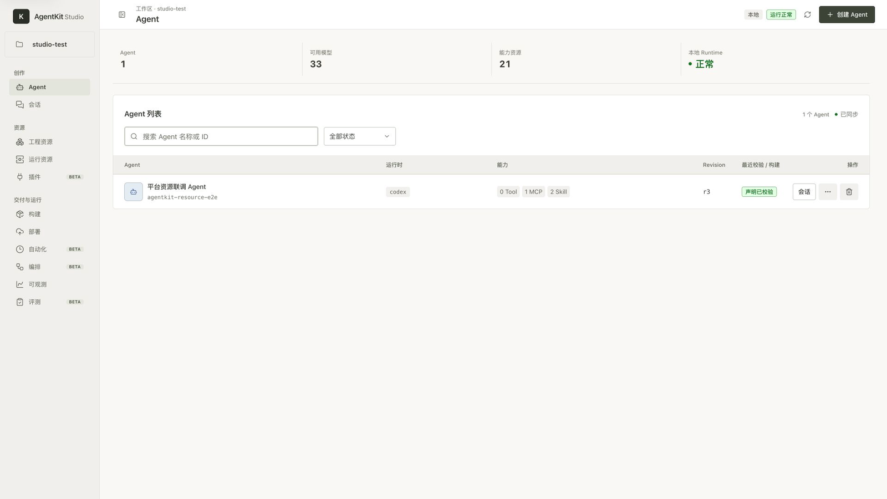
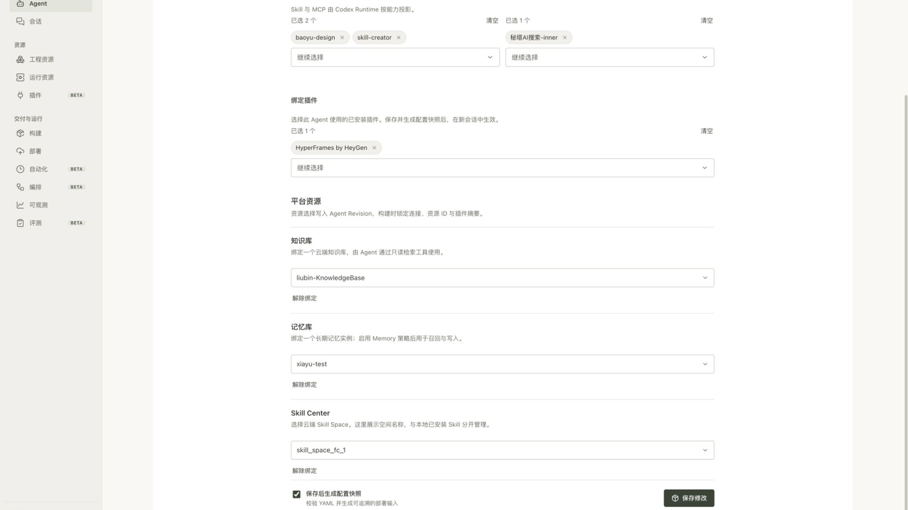
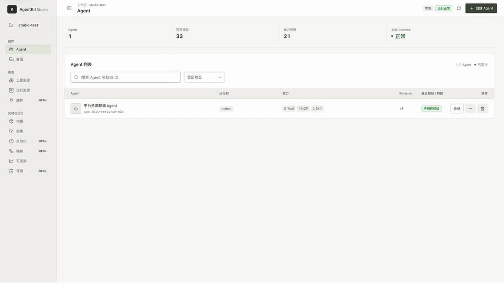
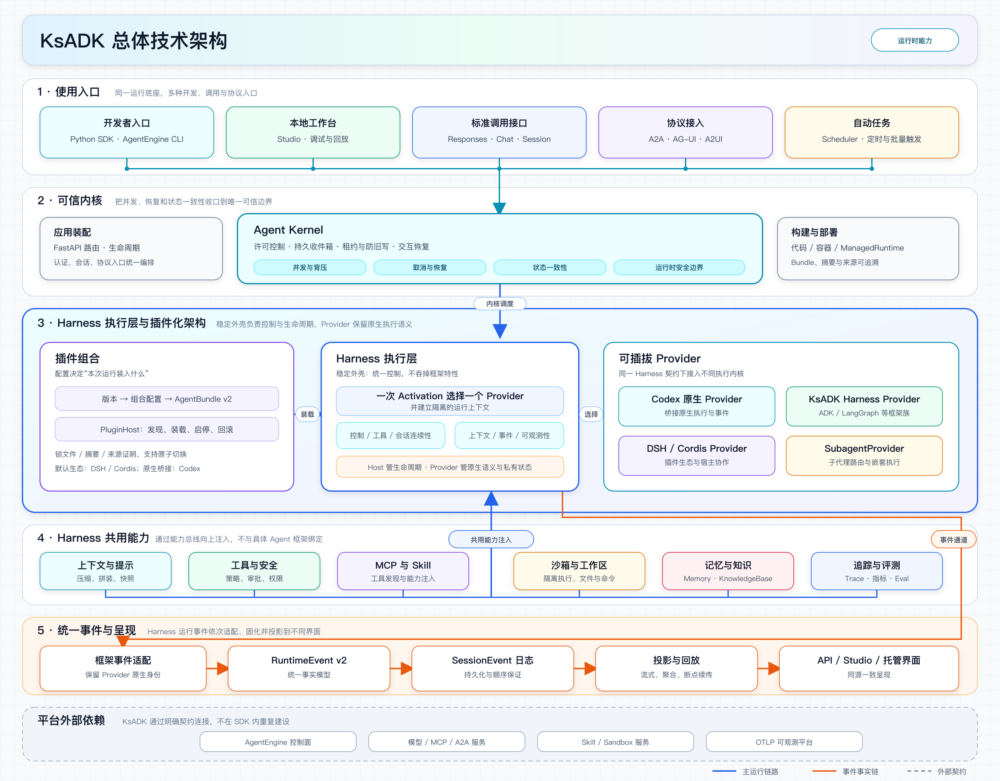

<h1 align="center">Kingsoft Cloud Agent Development Kit</h1>

<p align="center"><strong>金山云智能体开发套件</strong></p>

<p align="center">
  构建、部署、调试、观测企业级 AI 智能体的一站式云原生框架。
  兼容 Google ADK、LangGraph、LangChain 与 DeepAgents，并支持一键拉起 OpenClaw 和 Hermes 运行时。
</p>

<p align="center"><a href="README.md">简体中文（默认）</a> · <a href="README.en.md">English</a></p>

<p align="center">
  <a href="https://kingsoftcloud.github.io/ksadk-python/"></a>
  <a href="https://pypi.org/project/ksadk/"></a>
  <a href="https://zread.ai/kingsoftcloud/ksadk-python"></a>
  <a href="LICENSE"></a>
</p>

<p align="center"><a href="docs-site/public/assets/ksadk-runtime-platform-hero.png"></a></p>

## 30 秒快速体验

```bash
python -m venv .venv
source .venv/bin/activate
pip install -U "ksadk[all]"

agentengine init demo-agent -f langgraph
cd demo-agent
agentengine config set OPENAI_API_KEY=your-api-key OPENAI_MODEL_NAME=gpt-4o-mini
agentengine run -i
```

启动本地调试 Web UI：

```bash
agentengine web . --no-open
```

<p align="center"></p>

<p align="center"></p>

## 0.8.0 评审候选

`0.8.0` 是正在评审的候选分支，不是已发布的 PyPI/npm 版本。它把 RuntimeEvent、AG-UI/A2UI、A2A、Harness 和 CodexRuntime 统一到同一运行时边界，同时保持 `/v1/responses` 和 `/v1/chat/completions` 兼容入口可用。

- **Hosted UI**：AG-UI/A2UI 通过能力协商启用；不能协商时继续使用既有 Responses transport。
- **事件诊断**：`ksadk replay <session-id>` 只读回放新 RuntimeEvent 历史，可用 `--after-seq-id` / `--before-seq-id` 缩小排查窗口，不会再次执行模型、工具或审批副作用。
- **托管 A2A（实验性）**：AgentEngine 通过 Gateway 装配可信入站和 Space-scoped 出站 client。首期 external Agent 仅支持 `external_public`；它受 `Network.EnablePublicAccess` 控制并使用受限 NAT transport，`external_vpc` 尚不可用。
- **框架迁移**：新接入优先使用 LangGraph、Google ADK 或 `RuntimeAdapter`。旧 LangChain 连续性 / HITL 路径不属于 `0.8` 兼容性承诺。

详见[Hosted UI 与事件回放指南](https://kingsoftcloud.github.io/ksadk-python/cn/docs/framework/guides/hosted-ui-events/)、[托管 A2A Runtime 指南](https://kingsoftcloud.github.io/ksadk-python/cn/docs/framework/guides/a2a-runtime/)和 [0.8.0 更新日志](CHANGELOG.md)。

## 为什么需要 KsADK

大多数 Agent 框架解决“如何开发 Agent”。KsADK 解决“如何运行、调试、部署和观测 Agent”。

- 本地开发：`agentengine init`、`agentengine run`、`agentengine web`。
- 统一调试：浏览器 Web UI、streaming、附件、workspace 文件、工具调用和会话。
- 统一协议：本地 `/v1/responses` 与 `/v1/chat/completions`。
- 工具边界：Skill Runtime、Workspace、Sandbox、Memory、Knowledge。
- 工程链路：打包、部署、OpenClaw / Hermes 运行时、OpenTelemetry 可观测。

## 架构

<p align="center"></p>

## 文档与样例

- 文档：<https://kingsoftcloud.github.io/ksadk-python/>
- 快速开始：<https://kingsoftcloud.github.io/ksadk-python/cn/docs/framework/getting-started/quickstart/>
- 为什么需要 KsADK：<https://kingsoftcloud.github.io/ksadk-python/cn/docs/framework/getting-started/why-ksadk/>
- 架构：<https://kingsoftcloud.github.io/ksadk-python/cn/docs/framework/getting-started/architecture/>
- 生态定位对比：<https://kingsoftcloud.github.io/ksadk-python/cn/docs/framework/getting-started/comparison/>
- 可观测：<https://kingsoftcloud.github.io/ksadk-python/cn/docs/framework/guides/observability-tracing/>
- 云端部署：<https://kingsoftcloud.github.io/ksadk-python/cn/docs/framework/guides/cloud-deployment/>
- Hosted UI 与事件回放：<https://kingsoftcloud.github.io/ksadk-python/cn/docs/framework/guides/hosted-ui-events/>
- 样例仓库：<https://github.com/kingsoftcloud/ksadk-samples>

## 相关项目

- KsADK 仓库：<https://github.com/kingsoftcloud/ksadk-python>
- Web UI 仓库：<https://github.com/kingsoftcloud/ksadk-web>
- Wiki：<https://zread.ai/kingsoftcloud/ksadk-python>
- PyPI：<https://pypi.org/project/ksadk/>

## 参与贡献

欢迎通过 issue、PR、样例和文档改进参与贡献。提交前建议运行：

```bash
make public-preflight
```

开源协议：Apache-2.0。
