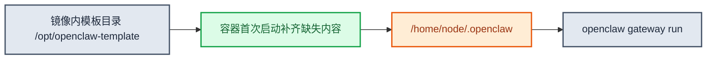

# OpenClaw用户镜像模板说明

`deploy/openclaw-user-template/` 是面向用户交付的极简镜像模板。它的目标不是复刻平台版 bootstrap，而是提供一套“直接构建、直接运行、兼容平台接入”的最小模板。

## 1. 设计目标

- 用户不改构建逻辑，直接 `docker build` 就能产出镜像
- 用户不修改任何文件，也可以用默认内容先 `docker run` 本地验证
- 用户可以替换自己的插件、skills 和默认配置
- 用户创建实例时传入的额外环境变量，容器内可直接读取
- 兼容平台默认约束：只持久化 `/home/node/.openclaw`，默认端口 `8080`

## 2. 目录结构

```text
openclaw-user-template/
├── Dockerfile
├── Makefile
├── README.md
└── custom/
    ├── config/
    │   └── openclaw.json
    ├── extensions/
    └── skills/
```

## 3. 启动模型



模板只做三件事：

1. 如果状态目录缺文件，就补默认配置
2. 如果缺插件或 skill，就从镜像模板目录复制
3. 校验鉴权模式后直接启动 gateway

## 4. 为什么默认只持久化一个目录

运行时真正建议持久化的只有：

```text
/home/node/.openclaw
```

这样做的好处：

- 镜像升级不会覆盖已持久化的用户状态
- 配置、插件、skills 和 workspace 归在同一棵状态树
- 平台默认 PVC 挂载目录与模板目录约定一致

## 5. 鉴权模式限制

模板当前只允许：

- `trusted-proxy`
- `none`

不允许：

- `token`

原因是平台默认网关接入链路要求用户侧实例使用 `trusted-proxy` 或 `none`。

## 6. 端口与默认环境

模板默认：

- 端口：`8080`
- bind：`lan`
- auth：`trusted-proxy`

兼容环境变量：

- `OPENCLAW_GATEWAY_PORT`
- `PORT`
- `OPENCLAW_GATEWAY_BIND`
- `OPENCLAW_GATEWAY_AUTH_MODE`
- `CLAWHUB_SITE=https://cn.clawhub-mirror.com`
- `CLAWHUB_REGISTRY=https://cn.clawhub-mirror.com`

额外兼容规则：

- 若 `auth=none` 且 `bind=lan`，模板会自动降为 `loopback`

## 7. 基础镜像与 Makefile 默认值

当前模板 Makefile 默认值：

- 平台：`linux/amd64`
- 基础镜像：`ghcr.io/openclaw/openclaw:2026.4.21@sha256:70e0ab07deb72f4b3ee7bb701c5437fdc27b85d6705cc67f104aa8042ba52e00`
- 默认运行端口：`8080`

## 8. 常用命令

构建：

```bash
make build IMAGE=hub-vpc-cn-beijing-6.kce.ksyun.com/your-ns/openclaw-user-custom TAG=demo
docker build -t openclaw-user-custom:demo .
```

运行：

```bash
make run IMAGE=hub-vpc-cn-beijing-6.kce.ksyun.com/your-ns/openclaw-user-custom TAG=demo
docker run --rm -it -p 8080:8080 -e OPENCLAW_GATEWAY_AUTH_MODE=none openclaw-user-custom:demo
```

推送：

```bash
make push IMAGE=hub-vpc-cn-beijing-6.kce.ksyun.com/your-ns/openclaw-user-custom TAG=demo
```

## 9. `custom/` 目录如何使用

### 9.1 插件

放到：

```text
custom/extensions/<plugin-id>/
```

### 9.2 skills

放到：

```text
custom/skills/<skill-name>/
```

### 9.3 默认配置

编辑：

```text
custom/config/openclaw.json
```

## 10. 这份模板刻意不做的事

- 不带平台版复杂 bootstrap
- 不做环境变量到 `openclaw.json` 的自动映射
- 自定义环境变量不会自动写进 openclaw.json
- 不代替用户业务代码读取自定义环境变量
- 不做 mem0 这类平台增强的一键接入

如果你需要平台版 OpenClaw runtime 的全部能力，应直接参考主仓的 `deploy/openclaw/`。

## 11. 相关文档

- examples/bundled-feishu-plugin-skills/：内置飞书 plugin 与 skills 的二次封装示例
- examples/minimal-skill-plugin-deps/：自定义 plugin + skill + npm 依赖示例
- [OpenClaw一键部署指南](../../docs/openclaw一键部署指南.md)
- [ksadk技术设计](../../docs/ksadk技术设计.md)
