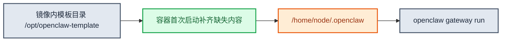

# OpenClaw用户镜像模板说明

`deploy/openclaw-user-template/` 是面向用户交付的轻量镜像模板。它的目标不是复刻平台版 bootstrap，而是提供一套“直接构建、直接运行、兼容平台接入、可安全定制”的最小模板。

## 1. 设计目标

- 用户不改构建逻辑，直接 `docker build` 就能产出镜像
- 用户不修改任何文件，也可以用默认内容先 `docker run` 本地验证
- 用户可以替换自己的插件、skills 和默认配置
- 用户创建实例时传入的额外环境变量，容器内可直接读取
- `custom/config/openclaw.json` 首次初始化时支持 `${VAR}` 占位符渲染
- 兼容平台默认约束：只持久化 `/home/node/.openclaw`，默认端口 `8080`

## 2. 目录结构

```text
openclaw-user-template/
├── Dockerfile
├── Makefile
├── README.md
├── openclaw-user-bootstrap.sh
└── custom/
    ├── config/
    │   └── openclaw.json
    ├── extensions/
    └── skills/
```

## 3. 启动模型



模板只做五件事：

1. 如果状态目录缺文件，就补默认配置、插件和 skill
2. 首次生成 `openclaw.json` 时渲染 `${VAR}` 占位符
3. 如果传入 `OPENCLAW_CONFIG_PATCH_JSON`，就把 JSON patch 合并到当前配置
4. 校验鉴权模式，并写入 gateway 运行所需配置
5. 直接启动 gateway

### 3.1 初始化与覆盖规则

启动时会从镜像内的 `/opt/openclaw-template` 初始化到运行时状态目录 `/home/node/.openclaw`，但只做“缺什么补什么”：

- `openclaw.json`：只有 `/home/node/.openclaw/openclaw.json` 不存在时才从模板渲染生成。
- `extensions/<plugin-id>`：只有目标 plugin 目录不存在时才复制。
- `skills/<skill-name>`：只有目标 skill 目录不存在时才复制。

这意味着镜像升级不会覆盖用户已经在 PVC 中修改过的配置、plugins 或 skills。反过来，如果你想让新镜像里的同名 plugin/skill/config 在已有实例中生效，需要手动删除 PVC 中对应文件或目录后再重启，或者创建新实例验证。

例外：

- gateway 鉴权相关字段会按当前环境变量校准，因为这是启动 gateway 的必要配置。
- `OPENCLAW_CONFIG_PATCH_JSON` 会在每次启动时合并到当前 `openclaw.json`，适合作为部署时 runtime override，不适合作为长期人工编辑入口。

## 4. 为什么默认只持久化一个目录

运行时真正建议持久化的只有：

```text
/home/node/.openclaw
```

这样做的好处：

- 镜像升级不会覆盖已持久化的用户状态
- 配置、插件、skills 和 workspace 归在同一棵状态树
- 平台默认 PVC 挂载目录与模板目录约定一致

## 5. 鉴权模式限制

模板当前支持：

- `trusted-proxy`
- `token`
- `none`

默认仍建议使用 `trusted-proxy`。如果你要本地或自管环境直接用 shared secret，也可以显式设置：

- `OPENCLAW_GATEWAY_AUTH_MODE=token`
- `OPENCLAW_GATEWAY_TOKEN=<your-shared-secret>`

兼容别名：

- `OPENCLAW_GATEWAY_PASSWORD=<your-shared-secret>`

## 6. 端口与默认环境

模板默认：

- 端口：`8080`
- bind：`lan`
- auth：`trusted-proxy`

兼容环境变量：

- `OPENCLAW_GATEWAY_PORT`
- `PORT`
- `OPENCLAW_GATEWAY_BIND`
- `OPENCLAW_GATEWAY_AUTH_MODE`
- `OPENCLAW_GATEWAY_TOKEN`
- `OPENCLAW_GATEWAY_PASSWORD`
- `CLAWHUB_SITE=https://cn.clawhub-mirror.com`
- `CLAWHUB_REGISTRY=https://cn.clawhub-mirror.com`

额外兼容规则：

- 若 `auth=none` 且 `bind=lan`，模板会自动降为 `loopback`

## 7. 占位符与配置 patch

轻量 bootstrap 只支持一种占位符格式：

```json
{
  "channels": {
    "demo": {
      "datasetId": "${DS_ID}",
      "apiKey": "${PLUGIN_API_KEY}"
    }
  }
}
```

运行时通过环境变量传入：

```bash
docker run --rm -it -p 8080:8080 \
  -e OPENCLAW_GATEWAY_AUTH_MODE=none \
  -e DS_ID=dataset-001 \
  -e PLUGIN_API_KEY=secret-value \
  openclaw-user-custom:demo
```

规则：

- 写真实值占位符时使用 `${DS_ID}`，不要写 `$DS_ID`。
- 裸字符串 `DS_ID` 不会被替换；只有某个 OpenClaw 字段语义本身就是“环境变量名”时，才写裸 `DS_ID`。
- `${VAR}` 按 JSON 字符串内容渲染，适合写在 `"${VAR}"` 这种字符串字段里；渲染后会校验 `openclaw.json` 是否仍是合法 JSON。
- 默认严格模式下，`${DS_ID}` 找不到对应环境变量会启动失败。
- 如果你希望缺失变量时保留原文，可设置 `OPENCLAW_TEMPLATE_ENV_STRICT=0`。
- 占位符只在首次生成 `/home/node/.openclaw/openclaw.json` 时渲染；已有配置不会被反复渲染或覆盖。

部署时还可以传一个轻量 JSON patch：

```bash
docker run --rm -it -p 8080:8080 \
  -e OPENCLAW_GATEWAY_AUTH_MODE=none \
  -e OPENCLAW_CONFIG_PATCH_JSON='{"plugins":{"entries":{"demo-now":{"enabled":true}}}}' \
  openclaw-user-custom:demo
```

`OPENCLAW_CONFIG_PATCH_JSON` 必须是 JSON object，会 deep merge 到当前 `openclaw.json`。它适合少量 runtime override；如果配置很大，仍建议直接维护 `custom/config/openclaw.json`。

## 8. 基础镜像与 Makefile 默认值

当前模板 Makefile 默认值：

- 平台：`linux/amd64`
- 基础镜像：`ghcr.io/openclaw/openclaw:2026.5.20-slim@sha256:db199be23add581ef18ca8c8a866af84db13586d5bfcd566c8ac73d8d106eebb`
- 默认运行端口：`8080`

## 9. 常用命令

构建：

```bash
make build IMAGE=hub-vpc-cn-beijing-6.kce.ksyun.com/your-ns/openclaw-user-custom TAG=demo
docker build -t openclaw-user-custom:demo .
```

指定基础镜像：

```bash
make build \
  OPENCLAW_BASE_IMAGE=ghcr.io/openclaw/openclaw:2026.5.20-slim@sha256:db199be23add581ef18ca8c8a866af84db13586d5bfcd566c8ac73d8d106eebb \
  IMAGE=hub-vpc-cn-beijing-6.kce.ksyun.com/your-ns/openclaw-user-custom \
  TAG=demo
```

如果你改了 Dockerfile 里的 `ARG OPENCLAW_BASE_IMAGE`，但仍然使用 `make build`，还要同步修改 `Makefile` 里的 `OPENCLAW_BASE_IMAGE` 默认值；否则 Makefile 会通过 `--build-arg` 覆盖 Dockerfile 的默认值。

查看 Makefile 支持的快捷命令：

```bash
make help
```

运行：

```bash
make run IMAGE=hub-vpc-cn-beijing-6.kce.ksyun.com/your-ns/openclaw-user-custom TAG=demo
docker run --rm -it -p 8080:8080 -e OPENCLAW_GATEWAY_AUTH_MODE=none openclaw-user-custom:demo
```

token 模式示例：

```bash
docker run --rm -it -p 8080:8080 \
  -e OPENCLAW_GATEWAY_AUTH_MODE=token \
  -e OPENCLAW_GATEWAY_TOKEN=gateway-token-demo \
  openclaw-user-custom:demo
```

推送：

```bash
make push IMAGE=hub-vpc-cn-beijing-6.kce.ksyun.com/your-ns/openclaw-user-custom TAG=demo
```

## 10. `custom/` 目录如何使用

### 10.1 插件

放到：

```text
custom/extensions/<plugin-id>/
```

最小结构参考：

```text
custom/extensions/demo-now-plugin/
├── index.ts
├── openclaw.plugin.json
└── package.json
```

`openclaw.plugin.json` 里的 `id` 要和 `openclaw.json` 里启用的 plugin id 对齐。例如 plugin id 是 `demo-now`，需要在 `custom/config/openclaw.json` 中启用：

```json
{
  "plugins": {
    "entries": {
      "demo-now": {
        "enabled": true
      }
    }
  }
}
```

如果 plugin 有 npm 依赖，主模板不会自动安装依赖；请参考 `examples/minimal-skill-plugin-deps/`，它会在构建阶段扫描带 `package.json` 的 plugin 目录并执行 `npm install --omit=dev`。

### 10.2 skills

放到：

```text
custom/skills/<skill-name>/
```

最小结构参考：

```text
custom/skills/demo-plugin-now/
└── SKILL.md
```

`SKILL.md` 负责告诉模型什么时候使用这个 skill、应该调用哪些 tools、必要时执行哪些脚本。skill 本身不等于运行时能力；真正的工具能力通常来自 plugin 注册的 tool。

### 10.3 默认配置

编辑：

```text
custom/config/openclaw.json
```

模板自带的最小初始配置如下，可以直接作为用户配置起点：

```json
{
  "gateway": {
    "auth": {
      "mode": "trusted-proxy",
      "trustedProxy": {
        "userHeader": "x-forwarded-user"
      }
    },
    "trustedProxies": [
      "127.0.0.1",
      "::1",
      "10.0.0.0/8",
      "172.16.0.0/12",
      "192.168.0.0/16",
      "35.0.0.0/8"
    ]
  },
  "plugins": {
    "entries": {}
  },
  "channels": {}
}
```

字段含义：

- `gateway.auth.mode`：默认 `trusted-proxy`，平台短链/托管访问的主路径；也可由环境变量切到 `token` 或 `none`。
- `gateway.auth.trustedProxy.userHeader`：平台网关注入用户身份时使用的 header，默认 `x-forwarded-user`。
- `gateway.trustedProxies`：允许作为 trusted proxy 的来源网段，模板默认覆盖本地、Docker/K8s 常见内网和平台 VPC 网段。
- `plugins.entries`：启用或配置 plugin 的入口。
- `channels`：预置 channel 配置的入口。

常见用途与写法：

- 开启自定义 plugin：`plugins.entries.<plugin-id>.enabled=true`
- 设置默认 gateway auth：`gateway.auth.mode`
- 设置 trusted-proxy 用户头：`gateway.auth.trustedProxy.userHeader`
- 预置 OpenClaw 自身支持的 channels / provider / UI 配置

#### 场景 A：只启用一个自定义 plugin

```json
{
  "gateway": {
    "auth": {
      "mode": "trusted-proxy",
      "trustedProxy": {
        "userHeader": "x-forwarded-user"
      }
    },
    "trustedProxies": [
      "127.0.0.1",
      "::1",
      "10.0.0.0/8",
      "172.16.0.0/12",
      "192.168.0.0/16",
      "35.0.0.0/8"
    ]
  },
  "plugins": {
    "entries": {
      "demo-now": {
        "enabled": true
      }
    }
  },
  "channels": {}
}
```

这里的 `demo-now` 必须和 `custom/extensions/<plugin-dir>/openclaw.plugin.json` 里的 `id` 一致。

#### 场景 B：用占位符预置 channel

如果 channel 配置里有部署时才知道的值，可以在 `openclaw.json` 里写 `${VAR}`：

```json
{
  "gateway": {
    "auth": {
      "mode": "trusted-proxy",
      "trustedProxy": {
        "userHeader": "x-forwarded-user"
      }
    },
    "trustedProxies": [
      "127.0.0.1",
      "::1",
      "10.0.0.0/8",
      "172.16.0.0/12",
      "192.168.0.0/16",
      "35.0.0.0/8"
    ]
  },
  "plugins": {
    "entries": {
      "demo-channel": {
        "enabled": true
      }
    }
  },
  "channels": {
    "demo": {
      "enabled": true,
      "datasetId": "${DS_ID}",
      "apiKey": "${DEMO_CHANNEL_API_KEY}"
    }
  }
}
```

启动时传入：

```bash
docker run --rm -it -p 8080:8080 \
  -e OPENCLAW_GATEWAY_AUTH_MODE=none \
  -e DS_ID=dataset-001 \
  -e DEMO_CHANNEL_API_KEY=secret-value \
  openclaw-user-custom:demo
```

不建议把真实 secret 固化进公共镜像。通用模板不提供平台版 `OPENCLAW_CHANNEL_BOOTSTRAP_JSON` reconcile；如果你需要平台增强 channel bootstrap，请使用 `examples/bundled-feishu-plugin-skills/` 这类基于平台 runtime 镜像的示例。

#### 场景 C：token 模式

不要在 `openclaw.json` 里手写 shared secret。镜像启动时会根据环境变量自动写入：

```bash
OPENCLAW_GATEWAY_AUTH_MODE=token
OPENCLAW_GATEWAY_TOKEN=<your-shared-secret>
```

启动后实际写入状态目录中的配置会包含：

```json
{
  "gateway": {
    "auth": {
      "mode": "token",
      "password": "<your-shared-secret>"
    }
  }
}
```

注意：`openclaw.json` 只在首次初始化时复制。已有实例的 `/home/node/.openclaw/openclaw.json` 不会被新镜像覆盖。

### 10.4 channel 预配置

通用模板推荐两种方式：

- 配置较稳定：写进 `custom/config/openclaw.json`，敏感字段用 `${VAR}`。
- 部署时临时覆盖：用 `OPENCLAW_CONFIG_PATCH_JSON` 传少量 patch。

示例：

```bash
docker run --rm -it -p 8080:8080 \
  -e OPENCLAW_GATEWAY_AUTH_MODE=none \
  -e OPENCLAW_CONFIG_PATCH_JSON='{"channels":{"demo":{"enabled":true,"datasetId":"dataset-001"}}}' \
  openclaw-user-custom:demo
```

平台部署时用 `agentengine openclaw deploy --env` 透传：

```bash
agentengine openclaw deploy \
  --image hub-vpc-cn-beijing-6.kce.ksyun.com/your-ns/openclaw-user-custom:demo \
  --env OPENCLAW_CONFIG_PATCH_JSON='{"channels":{"demo":{"enabled":true,"datasetId":"dataset-001"}}}'
```

如果 channel 是用户自定义 plugin 提供的，仍然需要同时满足两点：

- plugin 已放入 `custom/extensions/<plugin-id>/`
- `custom/config/openclaw.json` 已启用该 plugin 或 channel 所需配置

如果你不是用这份轻量模板，而是直接基于平台版 OpenClaw runtime 镜像创建实例，WPS 协作可以用平台增强的 channel bootstrap：

```bash
agentengine openclaw deploy \
  --env OPENCLAW_CHANNEL_BOOTSTRAP_JSON='{"wps-xiezuo":{"appId":"<appId>","appSecret":"<appSecret>"}}'
```

这里 `appId/appSecret` 是让 WPS 协作 channel 可连接可用所需的凭证，也兼容 `app_id/app_secret`；不传凭证不会影响平台 runtime 的 pod bootstrap，只是 WPS 协作无法完成认证。`baseUrl`、`sdk`、`dmPolicy`、`groupPolicy`、`instantAck`、`mcp` 和默认路由都会由平台 runtime 自动补齐。实例创建后也可以改用：

```bash
agentengine openclaw channel connect <agent_id_or_name> \
  --channel wps-xiezuo \
  --app-id <appId> \
  --app-secret <appSecret>
```

`channel connect` 会写入凭证并配置成可用；`channel enable` 只会重新打开已有配置，不能替代首次传入 `appId/appSecret`。

## 11. 调试方式

### 11.1 本地启动并保留状态

```bash
docker volume create openclaw-debug-state
docker run --rm -it \
  --name openclaw-debug \
  -p 8080:8080 \
  -v openclaw-debug-state:/home/node/.openclaw \
  -e OPENCLAW_GATEWAY_AUTH_MODE=none \
  openclaw-user-custom:demo
```

如果要模拟 token 模式：

```bash
docker run --rm -it \
  --name openclaw-debug \
  -p 8080:8080 \
  -v openclaw-debug-state:/home/node/.openclaw \
  -e OPENCLAW_GATEWAY_AUTH_MODE=token \
  -e OPENCLAW_GATEWAY_TOKEN=gateway-token-demo \
  openclaw-user-custom:demo
```

### 11.2 进入容器检查状态

```bash
docker exec -it openclaw-debug sh
ls -la /home/node/.openclaw
ls -la /home/node/.openclaw/extensions
ls -la /home/node/.openclaw/skills
sed -n '1,200p' /home/node/.openclaw/openclaw.json
```

重点检查：

- `openclaw.json` 是否存在，且 `gateway.auth.mode` 是否符合预期
- 自定义 plugin 是否出现在 `/home/node/.openclaw/extensions/<plugin-id>`
- 自定义 skill 是否出现在 `/home/node/.openclaw/skills/<skill-name>`
- token 模式下是否已写入 `gateway.auth.password`

### 11.3 只跑初始化，不启动 gateway

如果只想验证模板渲染、patch 和最终配置：

```bash
docker run --rm -it \
  -e OPENCLAW_BOOTSTRAP_ONLY=1 \
  -e OPENCLAW_BOOTSTRAP_PRINT_CONFIG=1 \
  -e OPENCLAW_GATEWAY_AUTH_MODE=none \
  -e DS_ID=dataset-001 \
  openclaw-user-custom:demo
```

`OPENCLAW_BOOTSTRAP_PRINT_CONFIG=1` 会打印脱敏后的 `openclaw.json`，`password`、`token`、`secret`、`apiKey` 这类字段会显示为 `***REDACTED***`。

### 11.4 常见问题

- 改了镜像里的同名 plugin/skill，但已有实例没变化：这是“只补缺不覆盖”的预期行为，删除 PVC 中对应目录或创建新实例验证。
- 本地 `make build` 没用上你改的基础镜像：检查 `Makefile` 的 `OPENCLAW_BASE_IMAGE`，它会覆盖 Dockerfile 的默认 ARG。
- plugin 文件存在但工具不可用：检查 `custom/config/openclaw.json` 是否启用了对应 `plugins.entries.<plugin-id>.enabled=true`。
- 环境变量读不到：确认是通过 `docker run -e` 或 `agentengine openclaw deploy --env` 注入到容器里，而不是只在宿主机里 `export`。
- `${DS_ID}` 启动时报 unresolved：说明容器环境里没有 `DS_ID`。要么注入该变量，要么设置 `OPENCLAW_TEMPLATE_ENV_STRICT=0` 保留原文。
- 写了 `$DS_ID` 但没替换：通用模板只支持 `${DS_ID}`，`$DS_ID` 会按普通字符串保留。

## 12. 这份模板刻意不做的事

- 不带平台版复杂 bootstrap。
- 不复刻 `OPENCLAW_CHANNEL_BOOTSTRAP_JSON`、workspace files sidecar、safe-bin、mem0、模型目录自动生成等平台增强逻辑。
- 不做环境变量到任意 `openclaw.json` 字段的自动映射；只支持首次初始化时显式 `${VAR}` 渲染。
- 不代替用户业务代码读取自定义环境变量

如果你需要平台版 OpenClaw runtime 的全部能力，应直接参考主仓的 `deploy/openclaw/`。

## 13. 相关文档

- examples/bundled-feishu-plugin-skills/：内置飞书 plugin 与 skills 的二次封装示例
- examples/minimal-skill-plugin-deps/：自定义 plugin + skill + npm 依赖示例
- [OpenClaw一键部署指南](../../docs/openclaw一键部署指南.md)
- [ksadk技术设计](../../docs/ksadk技术设计.md)
