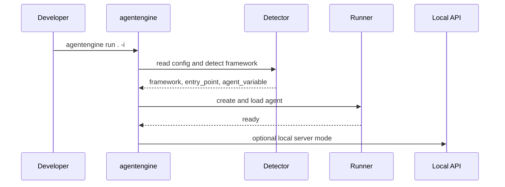

KsADK 有四个公开基础块：项目模板、框架适配器、本地运行时和本地调试 UI。

<Callout type="info">
  理解这四块，就能判断某个问题应该放在 Agent 代码、项目配置、Runner、协议层还是 Web UI 里处理。
</Callout>

## KsADK 与 Agent 生命周期

KsADK 聚焦 Agent 项目的本地开发闭环：创建或导入 Agent，配置模型 provider，本地运行，检查执行路径，然后在部署路径获批后打包经过审核的制品。

<Callout type="info">
  公开 SDK 刻意保持 local-first。Hosted AgentEngine 部署和云端打包是可选能力，不是学习开源运行时的前置条件。
</Callout>

## 项目

一个 KsADK 项目首先是普通 Python 项目，有 Agent 入口点和可选配置文件。默认约定：

<Files>
  <Folder name="my_agent" defaultOpen>
    <File name="agent.py" />
    <File name="agentengine.yaml" />
    <File name=".env" />
  </Folder>
</Files>

- `agent.py` 或包级 Agent 模块导出 `root_agent`。
- `agentengine.yaml`、`ksadk.yaml` 或 `ksadk.yml` 描述框架与入口。
- `.env` 保存本地凭证和模型设置。

<Callout type="info">
  检测器也可以从常见文件推断项目，例如 `agent.py`、`main.py`、`app.py`、包目录和 `langgraph.json`。
</Callout>

## 框架适配器

KsADK 不替换框架 API，把常见框架输出包进统一运行时，让不同框架可以用同一套本地命令、Web UI 和 OpenAI 兼容协议调用。

| 框架 | 典型导出对象 |
| --- | --- |
| Google ADK | `root_agent = Agent(...)` |
| LangGraph | `root_agent = graph.compile()` |
| LangChain | runnable chain 或 agent 赋值给 `root_agent` |
| DeepAgents | `root_agent = create_deep_agent(...)` |

<Callout type="info">
  Runner 契约是公开文档中最重要的抽象：框架细节留在 adapter 内，服务器和对话运行时只关心 `invoke`、`stream`、模型覆盖、session 以及上下文。
</Callout>

## 本地运行时

`agentengine run` 负责加载项目、检测框架并启动本地运行时。交互模式进入终端对话；服务模式暴露 HTTP endpoint，供 Web UI 或 API 客户端调用。

<Callout type="info">
  本地运行时是公开示例的安全默认选择，因为它不要求内部 Kingsoft Cloud 基础设施。
</Callout>

## 本地 Web UI

`agentengine web` 启动面向本地项目的浏览器调试体验。普通用户只需安装 Python 包，不需要 Node.js。

<Callout type="info" title="仓库边界">
  Python SDK 仓库 `kingsoftcloud/ksadk-python` 与 Web UI 仓库 `kingsoftcloud/ksadk-web` 分离。Python 包内置生成后的静态资源；未来 UI 源码变更应在 `ksadk-web` 中完成，再被 Python SDK 和 hosted UI 消费。
</Callout>

## 公开能力与 Hosted 能力

有些 CLI 命令支持云端打包或 hosted AgentEngine 操作，可能需要金山云凭证，在公开文档中应标记为可选能力。

本地优先文档应优先使用：

- OpenAI 兼容 provider 配置。
- 假凭证或用户自有 API Key。
- 本地文件、SQLite 或内存存储。
- 解释部署形态命令时使用 `--dry-run`。

<Callout type="warning">
  公开示例不能依赖内部 kubeconfig、私有 registry、私有网关、私有对象存储或客户数据。
</Callout>

## 文档层级

| 层级 | 目的 |
| --- | --- |
| 快速开始 | 解释概念并完成第一次本地运行 |
| 教程 | 提供完整可运行文件 |
| 指南 | 解释任务流程和设计取舍 |
| 参考 | 定义命令、配置和 API 契约 |
| 贡献 | 解释发布和治理 gate |

教程可以说「复制这个文件」；参考页应该说明字段含义和可接受值，这样公开文档更容易维护。

## 仓库边界

Python SDK 行为由 Python 仓库维护。可编辑 UI 行为由计划中的 `ksadk-web` 仓库维护。Python 包应该消费经过审核的 UI 构建产物或固定 source ref，不应长期携带一份分叉的可编辑 UI 实现。
