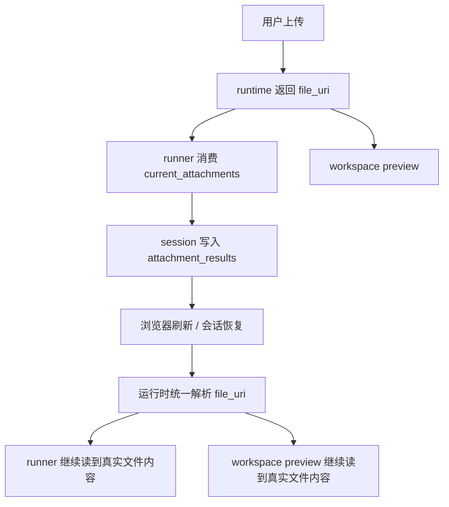

# 附件与多模态输入

KsADK 支持文本、图片和文件输入。运行时会把上传内容归一化到当前 turn 的消息和附件
metadata 中，再交给框架 runner。本地 UI 上传、Hosted 托管上传、Responses / Chat
Completions / ADK 风格 part 都会收敛到同一条 attachment 解析路径。

## 推荐做法

- 图片分析优先交给支持视觉的模型（见 默认多模态模型）。
- 大文件不要直接塞进 prompt；先抽取摘要或结构化内容。
- 工具需要文件时使用 workspace 或附件引用，不猜测浏览器上传路径。
- 不把附件二进制写入长期记忆。
- 业务 Agent 应消费 runner payload 里的 `current_attachments` /
  `current_attachment_results`，而不是猜测上传路径或自行解析 URI（见
  业务 Agent 消费建议）。

## 输入类型

常见协议形态包括：

- `input_text`
- `input_image`
- `input_file`
- 文件 metadata 和 workspace 引用

业务 Agent 应处理缺失、过期或不支持的附件引用，并给出明确错误。

## URI Scheme 与统一解析

<Callout type="info" title="0.6.6 新增">
运行时对本地 `ksadk-upload://` 与 Hosted `ae-upload://` 两类 URI 做统一解析，
业务代码不再需要按前缀分流。
</Callout>


| URI scheme | 来源 | 解析行为 |
| --- | --- | --- |
| `ksadk-upload://<file_id>` | 本地 Web UI 上传，由本地 runtime 写入 `files/` 目录并落 KS3 | 优先读本地 cache，缺失时按 metadata 回退到 KS3 |
| `ae-upload://<file_id>` | Hosted 托管 runtime 上传，对象存储在平台侧 | 调用 KOP Action `AttachmentContent` 下载字节流，再写回本地 cache（`.meta.json`） |
| 非 `ae-upload://` 前缀路径 | workspace 相对路径 | 按 workspace root 解析 |

统一解析的收益：

- 会话切换或浏览器刷新后，runner 与 workspace preview 仍能通过 `file_uri` 读到真实文件内容。
- Hosted 附件首次解析后会被物化到本地 `files/` 目录，后续读取走本地 cache，不再重复远端下载。
- 业务代码不需要区分本地与 Hosted：拿到 `file_uri` 后交给运行时解析即可。

<Callout type="info" title="公开口径">
`ksadk-upload://` 与 `ae-upload://` 都不是公开可寻址 URL，只在创建它的 runtime
内有效。公开文档与示例不要把它们当持久链接使用。
</Callout>


## AttachmentContent 端点

Hosted 托管 runtime 通过 KOP Action 端点下载 `ae-upload://` 附件字节流：

```text
GET /agentengine/api/v1/AttachmentContent?FileUri=<uri>
```

| 参数 | 含义 |
| --- | --- |
| `FileUri` | 附件 URI，通常为 `ae-upload://<file_id>`；非 `ae-upload://` 前缀的路径按 workspace 相对路径解析 |

响应为字节流，`Content-Type` 反映真实 MIME，`Content-Disposition` 携带原始文件名。

<Callout type="info" title="本地 cache 写回">
运行时在解析 `ae-upload://` 时，会把下载到的字节流物化到本地 `files/` 目录，
并写入 `<file_id>.meta.json` 记录 `backend=hosted`、`display_name`、
`mime_type`、`size_bytes`、`local_path` 等 metadata。后续会话/浏览器刷新后，
runner 与 workspace preview 直接从本地 cache 读取真实文件内容，无需再次下载。
</Callout>


## 业务 Agent 消费建议

业务 Agent 不应猜测上传路径或自行解析 `file_uri`，应直接消费 runner payload 里的
结构化附件字段：

| 字段 | 适用场景 |
| --- | --- |
| `current_attachments` | 仅处理当前用户 turn 上传的文件/图片 |
| `current_attachment_results` | 仅处理当前 turn 的抽取结果（文本/OCR/metadata） |
| `attachments` | 本 turn 有效附件上下文（含会话回填） |
| `attachment_results` | follow-up 问题需要继续引用上一轮文件时使用 |

```python
def ksadk_prepare_state(payload: dict, session_context: dict) -> dict:
    return {
        "messages": payload.get("input_messages", []),
        # 仅当前 turn 新上传的文件
        "files": payload.get("current_attachment_results", []),
        # follow-up 仍可引用的历史附件上下文
        "file_context": payload.get("attachment_results", []),
    }
```

- 「处理我刚上传的文件」这类工作流用 `current_attachment_results`。
- 「现在总结第二段」这类 follow-up 用 `attachment_results`，文本后续轮次
  `current_attachment_results` 预期为空。
- 工具需要文件句柄时，从 `current_attachments` / `attachments` 拿 `file_uri` 交给
  运行时统一解析，不要拼接本地绝对路径。

## 默认多模态模型

<Callout type="info" title="0.6.6+">
托管部署通过 `AGENTENGINE_MODEL_POLICY_JSON` 注入统一模型策略，默认策略 v1 使用
`glm-5.2` 作为主模型、`kimi-k2.7-code` 作为多模态模型、`deepseek-v4-pro` 作为
fallback。多模态能力（视觉/图片）默认路由到 `kimi-k2.7-code`。
</Callout>


| 配置 | 用途 |
| --- | --- |
| `AGENTENGINE_MODEL_POLICY_JSON` | 平台注入统一模型策略，声明 primary / multimodal / fallback |
| `OPENCLAW_IMAGE_MODEL` | OpenClaw 显式多模态 / 图像模型覆盖，优先于策略默认值 |
| `HERMES_DEFAULT_MODEL` / `OPENCLAW_FALLBACK_MODEL` | 显式环境变量覆盖仍优先于策略默认 |

显式请求级模型参数 > 显式环境变量 > 策略默认值。需要切换图像/视觉模型时，优先在
请求 `model_options` 中显式指定，或设置 `OPENCLAW_IMAGE_MODEL` 覆盖默认多模态模型。

## 会话与刷新后继续读取



只要 `file_uri` 仍有效（本地 cache 或 Hosted `ae-upload://` 可解析），刷新或会话恢复后
runner 与 workspace preview 都能继续读到真实文件内容，业务代码无需特殊处理。
