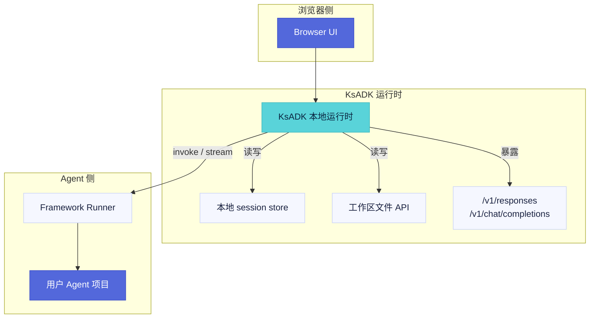

# 本地 Web UI

`agentengine web` 为 Agent 项目启动本地浏览器 UI，用于调用与调试。它是本地开发 UI，不是 hosted AgentEngine dashboard。

<Callout type="info">
  通过 pip 安装 KsADK wheel 后已内置静态 UI 资源，终端用户无需 Node.js。仅当开发 UI 源码时才需要 Node.js。
</Callout>

## 启动 UI

在项目目录中执行：

<Steps>

1. 默认启动（自动打开浏览器）：
   ```bash
   agentengine web .
   ```
2. 不自动打开浏览器：
   ```bash
   agentengine web . --no-open
   ```
3. 指定端口：
   ```bash
   agentengine web . --port 7860
   ```
4. 为本次调试覆盖模型：
   ```bash
   agentengine web . --model my-model
   ```

</Steps>

## UI 用来做什么

本地 Web UI 适合：

- 给当前 Agent 发送消息。
- 测试 streaming 和 non-streaming 行为。
- 在 Runner 支持时检查文件和图片输入流程。
- 编辑项目时保持浏览器调试循环。
- 验证本地运行时如何把请求序列化为 OpenAI 兼容形态。
- 在启用相关本地能力时检查 sessions、run events、feedback 状态和工作区文件预览。

## 与运行时的关系

UI 调用本地 KsADK 运行时，运行时再调用配置好的框架 Runner。UI 不直接调用模型 provider。



## 本地状态

本地 UI 在项目目录下创建状态：

<Files>
  <Folder name=".agentengine" defaultOpen>
    <Folder name="ui" defaultOpen>
      <File name="sessions.sqlite" />
    </Folder>
  </Folder>
</Files>

<Callout type="warning">
  `.agentengine/` 下的状态对开发有用，但不是源代码，不应提交到仓库。想重置本地 UI sessions 时删除 `.agentengine/`。
</Callout>

## 独立 UI 仓库

可编辑 Web UI 源码计划放在独立仓库 `kingsoftcloud/ksadk-web`，同时服务：

- `ksadk-python` 消费的本地静态 UI。
- 内部 hosted deployment 消费的 hosted UI build。

<Callout type="warning">
  Python SDK 应内置生成后的静态资源并记录消费的 source version。Hosted-only 部署文件、私有路由、Helm values 和生成后的 hosted bundle 不应进入 SDK wheel。
</Callout>

见 [Web UI 仓库](web-ui-source) 了解仓库拆分和发布契约。

## 开发模式

UI contributor 需要使用 Node.js。源码仓库应提供：

```bash title="构建本地 SDK 消费的静态 bundle"
npm run build:ksadk
```

```bash title="构建 hosted 路由假设的 bundle"
npm run build:hosted
```

## 自定义 UI bundle

<Callout type="info" title="0.6.7 新增">
</Callout>

`agentengine web` 自动探测项目根下的 `research-ui/dist/index.html`。探测到时以 custom profile 启动并加载该目录作为自定义 UI bundle；未探测到时仍使用内置静态 UI。

也可以在 `agentengine.yaml` 显式声明 custom profile，覆盖自动探测结果：

```yaml title="agentengine.yaml"
ui_profile: custom
ui_bundle_path: research-ui/dist
ui_path: /
```

<Callout type="info" title="路径修正">
  custom profile 下，UI 的 `/chat` 路径会被自动修正为 `/`，无需在 bundle 内手动改路由。
</Callout>

远端 serverless 部署会自动注入以下环境变量到 pod env，供自定义 UI bundle 读取：

- `KSADK_UI_PROFILE`
- `KSADK_UI_PATH`
- `KSADK_UI_URL`
- `KSADK_UI_BUNDLE_PATH`

## 流式修复（0.6.6）

<Callout type="info" title="0.6.7 新增">
</Callout>

0.6.6 修复了以下流式相关问题：

- 连续问答时流式消息消失。
- 快速切换会话或新建会话时，旧流仍被回写到新会话。
- 流式 Markdown 表格渲染失败。

## 常见失败

| 现象 | 检查项 |
| --- | --- |
| 浏览器没有打开 | 用 `--no-open` 运行，并手动打开打印的 URL。 |
| 端口占用 | 传入 `--port <free-port>`。 |
| Agent 加载失败 | 先运行 `agentengine run . -i`，隔离项目检测和模型配置问题。 |
| 模型调用失败 | 检查 `.env`、`OPENAI_BASE_URL`、`OPENAI_MODEL_NAME` 和 provider 兼容性。 |
| 出现旧 session 数据 | 删除 `.agentengine/ui/`，获得干净本地状态。 |
| 自定义 UI bundle 不生效 | 确认 `research-ui/dist/index.html` 存在；或检查 `agentengine.yaml` 中 `ui_profile`/`ui_bundle_path`/`ui_path` 是否正确，且 bundle 已构建。 |
