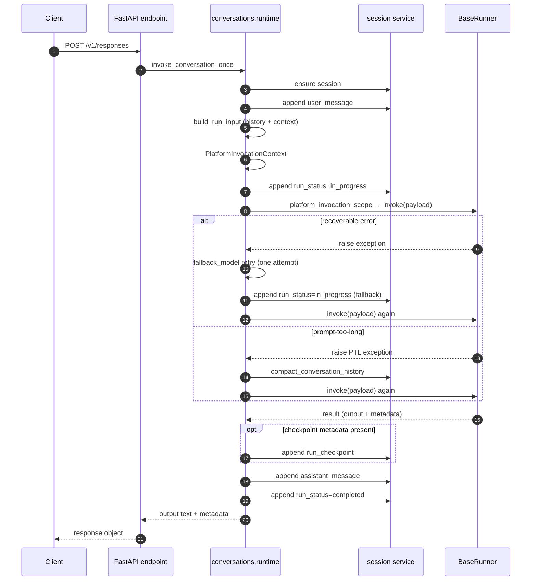

KsADK 本地运行时的核心职责是：加载用户 Agent 项目，把所选框架适配到统一 Runner
接口，并为终端、浏览器和 API 客户端暴露可预测的本地协议。

## 分层模型


入口 → 启动 → HTTP/UI → 对话运行时 → Runner / RuntimeAdapter → Session 与 RuntimeEvent 持久化。关键边界是：HTTP server 和对话运行时不需要知道用户项目是 ADK、LangGraph、LangChain、DeepAgents 还是 Codex；代码项目经 `BaseRunner`，跨 Runtime 控制面经 `RuntimeAdapter`。

## 核心包

| Package | 职责 |
| --- | --- |
| `ksadk.cli` | 命令入口、本地进程准备、用户可读错误 |
| `ksadk.detection` | 项目配置、入口文件、框架和 Agent 变量检测 |
| `ksadk.runners` | 统一 Runner 契约和框架适配器 |
| `ksadk.runtime` | 0.8 RuntimeAdapter、RuntimeEvent、取消 / 恢复 / checkpoint 边界 |
| `ksadk.harness` | 最小 YAML composition root，复用 Runtime 数据面 |
| `ksadk.server` | FastAPI app、本地 Web UI API、OpenAI 兼容 endpoint |
| `ksadk.conversations` | 消息规范化、session turn 编排、协议 payload |
| `ksadk.sessions` | 本地和可插拔 session 存储 |
| `ksadk_runtime_common.workspace_files` | 可复用工作区文件路由和预览安全 |

## 启动生命周期

`agentengine run` 和 `agentengine web` 大体路径一致：

<Steps>
  1. 解析项目目录。
  2. 必要时重新进入项目虚拟环境执行。
  3. 加载环境变量和项目设置。
  4. 检测框架和入口点，或读取 Codex 声明式 manifest。
  5. 创建匹配的 Runner / RuntimeAdapter。
  6. 加载用户 Agent，或验证本机托管 Runtime。
  7. 进入终端模式或启动本地 HTTP server。
</Steps>

<Callout type="warning">
如果框架检测结果是 `unknown`，CLI 会在导入用户代码作为 Runner 之前停止，避免把不可识别的项目当成 Runner 加载。
</Callout>


## 启动边界

本地运行时有严格启动边界：

<Steps>
  1. CLI 代码解析路径、配置、环境变量和项目虚拟环境。
  2. detection 代码决定使用哪个框架适配器。
  3. runner factory 创建框架特定 Runner。
  4. runner 加载用户代码。
  5. server 层暴露 HTTP 协议并委托给 runner。
</Steps>

<Callout type="info">
检测发生在导入用户代码之前。这个区别对安全和调试很重要：模块导入失败应报告为 Agent 加载问题；缺少 `agentengine.yaml`、入口点无效或框架不受支持，应报告为项目检测问题。
</Callout>

公开示例应保持项目配置明确：

```yaml title="agentengine.yaml"
name: support-agent
framework: langgraph
entry_point: agent.py
agent_variable: root_agent
```

## 框架检测

检测优先使用显式配置，再使用约定：


<Callout type="info">
公开 sample 推荐包含 `agentengine.yaml`，因为显式配置更容易审核，也较少依赖源码启发式。
</Callout>

约定检测仍适合快速实验。它会检查：

- 根目录 `agent.py`、`main.py` 或 `app.py`。
- 包目录中的 `agent.py`、`main.py`、`app.py` 或 `__init__.py`。
- `src/<package>` 布局。
- `langgraph.json` graph target。

<Callout type="warning">
当使用约定检测时，运行时仍然需要两个事实：导入哪个文件，以及该文件里的哪个变量是 Agent 对象。如果任一值不明确，就添加 `agentengine.yaml`。
</Callout>

## Runner 契约

每个 Runner 都实现同一组概念契约：

| 方法 | 含义 |
| --- | --- |
| `load_agent()` | 导入并准备用户 Agent 对象 |
| `invoke(input_data)` | 执行一次非流式 turn |
| `stream(input_data)` | 执行一次流式 turn |
| `prepare_for_request(model)` | 在支持时应用单请求模型覆盖 |
| `close()` | server shutdown 时释放资源 |

这个契约刻意保持窄。框架特定行为留在 adapter 中，而不是塞进 FastAPI endpoint。

| 需求 | 推荐位置 |
| --- | --- |
| LangGraph 自定义 state mapping | 用户模块中的 `ksadk_prepare_state` |
| LangChain 自定义 input mapping | 用户模块中的 `ksadk_prepare_input` |
| 模型覆盖处理 | Runner 的 `prepare_for_request()` |
| 框架原生 session continuity | Runner session adapter |
| 协议 JSON/SSE 格式化 | server 和对话运行时 |

<Callout type="info">
新增框架 adapter 时，先从 `BaseRunner` 开始实现 `load_agent()`、`invoke()` 和 `stream()`。session continuity、动态模型覆盖或协议事件映射应在基础路径稳定后再加。
</Callout>

## RuntimeAdapter（0.8）

`RuntimeAdapter` 是跨 Runner、Harness、Codex 和 A2A 的平台运行接口。普通项目不需要
直接实现它；只有接入一个新的 Runtime 或把 Runtime 交给平台控制面时才应使用。它把原生
差异收敛为以下固定语义：

| 动词 | 语义 |
| --- | --- |
| `start(request)` | 以用户、session、可选模型和配置启动 run，返回不透明 `RunHandle`。 |
| `stream(handle)` | 输出规范化 `RuntimeEvent` 异步事件流；它不是双工通道。 |
| `cancel(handle)` | 返回明确的取消状态（已中断、记录 pending、未运行或失败），而非模糊布尔值。 |
| `resume(handle, target, payload)` | 将恢复目标与审批/工具/人工回包分开表达。 |
| `checkpoint(handle)` | 返回真实声明的 checkpoint 粒度与持久化能力，不假设所有 Runtime 都能回滚。 |
| `close(handle)` | 释放 run 占用的运行期资源。 |

`stream` 只传事件；审批决定、工具结果和 HITL 输入走 `resume`。这使 AG-UI/A2UI、A2A 和
会话回放共享同一事件边界，也避免把某个框架的私有 SSE 语义泄露给调用方。`attach(handle)`
是可选的跨进程恢复接口，默认 fail-closed；不能因为持久化了一个 handle 就假设原生
Runtime 已在当前进程恢复。

新 Runtime 应先用 `RunnerRuntimeAdapter` 覆盖标准 `BaseRunner` 路径，再逐项声明 cancel、
resume 和 checkpoint 能力；不要用伪造的“全支持” capability 掩盖框架差异。

## 请求生命周期

普通非流式 `/v1/responses` 请求路径：



Streaming 使用同样的准备路径，再把内部语义事件序列化为 server-sent events。文本
delta、reasoning、tool call、tool result、approval interrupt、final output 和
error 会先成为运行时事件，再成为协议特定 SSE payload。

## Streaming 事件模型

框架 adapter 可能发出很不同的原生事件，但对话运行时期待一小组语义 chunk：

| Chunk type | 含义 | 常见来源 |
| --- | --- | --- |
| `text` | assistant 文本 delta | 模型 token stream |
| `thinking` | provider 或 ADK 可用时的 reasoning delta | provider 或 ADK event |
| `tool_call` | tool call 开始或参数更新 | LangGraph、ADK、MCP 或自定义 tool event |
| `tool_result` | tool 输出可用 | 框架 tool result event |
| `interrupt` | 运行暂停，等待审批或外部输入 | graph interrupt 或 approval flow |
| `final` | 最终权威输出 | 框架最终状态 |
| `error` | 执行失败 | Runner 或协议异常 |

协议层随后把这些语义事件映射到 `/v1/responses`、`/v1/chat/completions`、
`/run_sse` 或本地 Web UI action 格式。

### 模型策略与 thinking 语义

`thinking` chunk 是否出现、以及 reasoning 内容如何注入，由运行时的统一模型策略和
thinking disable 注入语义共同决定（0.6.6 起统一，0.6.7 补全 disable 注入）：

- **统一模型策略**：托管部署通过 `AGENTENGINE_MODEL_POLICY_JSON` 注入 primary /
  multimodal / fallback 默认值，Hermes、OpenClaw 和通用 Agent 共用同一套语义；显式
  请求参数或显式环境变量仍优先于策略默认值。
- **fallback 重试**：conversation runtime 对超时、限流、5xx、模型不可用、权限/配额等
  可恢复错误自动 fallback 重试一次；400 参数错误、业务错误和 tool 错误不会被吞掉。
  fallback 触发时，下一轮 streaming 可能切换到 fallback backend，`thinking` chunk
  是否出现以目标模型能力为准。
- **thinking disable 注入**：当 `model_options.thinking` 为 disabled
  （`reasoning.effort=none`、`thinking.type=disabled` 或 `max_reasoning_tokens<=0`）
  时，runtime 自动向 `extra_body` 注入 `enable_thinking=false` 和
  `chat_template_kwargs.enable_thinking=false`（DeepSeek 等模型兼容），并在流式输出
  中过滤 reasoning 类 output item，因此 `thinking` chunk 不会出现在 SSE 流中。

具体的策略 JSON 结构、catalog 字段和注入细节见
[环境变量参考](../../references/environment-variables)。

## Session 与上下文边界

每个 turn 在调用 Runner 前都会构造 `PlatformInvocationContext`。它包含框架 adapter
可能需要的稳定标识和运行时事实：

- `agent_id`、`user_id`、`session_id` 和 invocation metadata。
- 规范化输入内容和消息历史。
- 当前 turn 附件和最近有效附件。
- model、model metadata 和 model options。
- 启用时的知识库和记忆上下文。

Runner 会把这个 context 作为准备后输入的一部分收到。业务逻辑应优先读取公开文档中的
runner payload 字段和框架 hook，而不是读取私有 server globals。

## Checkpoint、Resume 与协作式取消

<Callout type="info" title="0.6.7 新增">
KsADK 在运行时引入框架级 checkpoint/resume 能力层，并补全 `CancelRun` 协作式取消。
</Callout>


Run 级 checkpoint、resume 和取消建立在 session store 与框架 checkpoint backend 之上，
是独立于 streaming chunk 的能力层。conversation runtime 在每个 turn 写入
`run_status` 事件，并以 checkpoint 为边界暴露恢复与取消入口：

| 能力 | 含义 | 触发位置 |
| --- | --- | --- |
| checkpoint 写入 | 在 turn 边界持久化可恢复快照 | runner 在 turn 完成或 interrupt 处写入 |
| resume | 从 checkpoint 恢复 run 执行 | `POST /agentengine/api/v1/ResumeRun` |
| preview | 预览 resume 内容与影响面 | `POST /agentengine/api/v1/GetCheckpointResumePreview` |
| list | 列出 session 下可用 checkpoint | `POST /agentengine/api/v1/ListSessionCheckpoints` |
| 协作式取消 | 请求正在进行的 run 停止 | `POST /agentengine/api/v1/CancelRun` |

`CancelRun` 是**协作式取消**：runtime 在下一个 runner 协作点（如下一个 streaming
chunk、tool call 边界或 interrupt 检查点）观测到取消请求后停止 run，写入
`run_status=cancelled`，并尽可能保留已产出的 checkpoint 与事件供后续 resume。它不会
强杀进程或丢弃已持久化的 turn。

resume 能力受 `GetAgentUiBootstrap` 返回的 `RuntimeCapabilities.ResumeRun.ResumeMode`
与 `RunLifecycle` 双重门控（`time_travel` / `forward_only` / `none`）；前端入口必须
同时满足 `RunLifecycle.Checkpoints` 与 `RunLifecycle.CheckpointResume` 才能展示。

完整的 action 路径、ResumeMode 语义、`SubscribeRunEvents` 续订与 5 分钟服务端保护
超时见 [会话与文件](../../references/runtime-sessions-files)。

## 本地协议入口

| Endpoint | 目的 |
| --- | --- |
| `POST /v1/responses` | 首选 OpenAI 兼容本地协议 |
| `POST /v1/chat/completions` | 兼容 Chat Completions 客户端 |
| `POST /agentengine/api/v1/RunAgent` | 本地 Web UI action 风格协议 |
| `POST /run_sse` | ADK Web 兼容本地执行路径 |
| `POST /agentengine/api/v1/UploadFile` | UI 流程的本地文件上传 |
| `/_ksadk/workspace/v1/*` | 工作区文件 list/read/write/delete 路由 |

<Callout type="info">
外部客户端应优先使用 `/v1/responses`，除非它正在集成本地 Web UI 本身。
</Callout>

## 公开文档边界

<Callout type="warning">
本页描述公开本地运行时架构。它不会发布私有网关行为、内部集群部署细节、内部 kubeconfig 路径、私有 registry 名称或客户特定 runbook。
</Callout>
