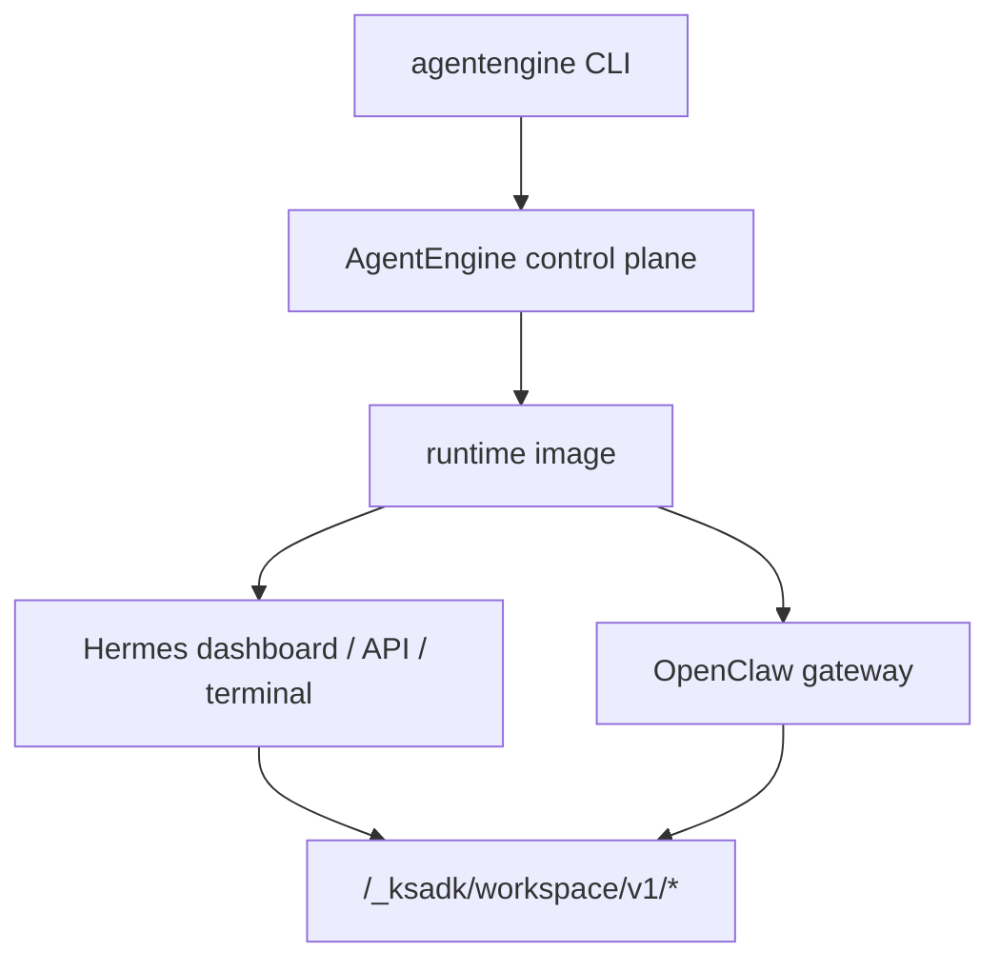

# 运行时产品：Hermes 与 OpenClaw

除了代码框架型 Agent，KsADK 还支持两类镜像型运行时产品：

- **Hermes**：托管 coding-agent runtime，包含 dashboard、API proxy、终端
  WebSocket 和 workspace files。
- **OpenClaw**：托管 OpenClaw gateway runtime，KsADK 负责部署、workspace
  files、memory backend wiring 和 CLI 生命周期管理。

它们是运行时产品，不是普通本地框架项目。LangGraph 或 ADK 项目打包的是用户
代码；Hermes 和 OpenClaw 部署的是平台维护的 runtime image 加公开配置。



## 什么时候用哪种运行时

| 需求 | 推荐路径 |
| --- | --- |
| LangGraph、ADK、LangChain、DeepAgents Python 代码 | 普通代码框架项目 |
| 带终端和 workspace 的 hosted coding assistant | Hermes |
| OpenClaw gateway、channels 或 OpenClaw 原生 UI | OpenClaw |
| 必须无云凭证运行的公开 quickstart | 普通本地框架项目 |

不要把 Hermes 或 OpenClaw 写成另一个 `StateGraph` 或 `Agent` wrapper。它们有
独立生命周期命令和部署 contract。

## Hermes 生命周期

Hermes 资源使用专用命令组：

```bash
```

典型流程：

1. 在本地 `.env` 或 shell 中配置模型占位值。
2. 支持时先审查 dry run。
3. 部署 Hermes runtime。
4. 打开 dashboard 或连接终端。
5. 用 workspace files 管理生成产物。

公开示例只使用占位模型配置：

```bash
OPENAI_BASE_URL=https://api.example.com/v1
OPENAI_MODEL_NAME=my-model
```

Hermes 终端访问使用 WebSocket 子协议：

```text
Sec-WebSocket-Protocol: ks-terminal.v1
```

普通用户由 CLI 处理；API 客户端需要把它视为远程运行时 contract 的一部分。

## OpenClaw 生命周期

OpenClaw 资源使用专用命令组：

```bash
```

典型流程：

1. 创建或进入 OpenClaw 项目。
2. 配置模型占位值和可选运行时策略。
3. 通过 `agentengine openclaw deploy` 部署。
4. 使用 `status`、`tui`、`gateway open` 或 channel 命令运维。
5. 生成产物保持在运行时 workspace 内。

公开示例只展示参数形态，不写内部值：

```bash
agentengine openclaw deploy \
  --model-base-url https://api.example.com/v1 \
  --model-api-key sk-test \
  --default-model my-model
```

## Workspace 与文件

Hermes 和 OpenClaw 都通过 `/_ksadk/workspace/v1/*` 暴露 KsADK workspace files。
生成文件应留在运行时 workspace 内，让 hosted UI 和 CLI 文件命令看到同一批产物。

公开文档不要描述任意宿主机路径访问。公开模型是：

- 列出 workspace 文件。
- 读取或下载 workspace 文件。
- 新增或更新 workspace 文件。
- 在允许时删除 workspace 文件。
- hosted surface 支持时导出 workspace 压缩包。

## 模型配置边界

<Callout type="info" title="0.6.7 新增">
</Callout>


Hermes 与 OpenClaw deploy 会注入统一模型策略 env，运行时据此选择 primary、
multimodal 与 fallback 模型。统一策略由 `AGENTENGINE_MODEL_POLICY_JSON`
承载，各 runtime 再暴露自己的 DEFAULT/FALLBACK/IMAGE/CATALOG 变量做细粒度
覆盖：

| 变量 | 说明 |
| --- | --- |
| `AGENTENGINE_MODEL_POLICY_JSON` | 统一模型策略，primary/multimodal/fallback 与可选 catalog |
| `HERMES_DEFAULT_MODEL` | Hermes 默认（primary）模型覆盖 |
| `HERMES_FALLBACK_MODEL` | Hermes fallback 模型覆盖 |
| `HERMES_MODEL_CATALOG_JSON` | Hermes 可选模型 catalog 覆盖 |
| `OPENCLAW_DEFAULT_MODEL` | OpenClaw 默认（primary）模型覆盖 |
| `OPENCLAW_FALLBACK_MODEL` | OpenClaw fallback 模型覆盖 |
| `OPENCLAW_IMAGE_MODEL` | OpenClaw 图像场景模型覆盖 |
| `OPENCLAW_MODEL_CATALOG_JSON` | OpenClaw 可选模型 catalog 覆盖 |

默认策略为：

- primary = `glm-5.2`
- multimodal = `kimi-k2.7-code`
- fallback = `deepseek-v4-pro`

```bash
# 统一策略示例（占位值）
AGENTENGINE_MODEL_POLICY_JSON='{"primary":"glm-5.2","multimodal":"kimi-k2.7-code","fallback":"deepseek-v4-pro"}'
```

<Callout type="info" title="覆盖优先级">
显式 env 优先。只要设置 `HERMES_DEFAULT_MODEL` /
`OPENCLAW_DEFAULT_MODEL` 等变量，对应 runtime 就用该值覆盖统一策略中的
同名字段；未设置则回退到 `AGENTENGINE_MODEL_POLICY_JSON` 的默认值。
</Callout>


<Callout type="info" title="OpenClaw 图像场景默认">
OpenClaw 图像场景默认走 `kimi-k2.7-code`（即统一策略的 multimodal 字段）。
若需固定为其他模型，设置 `OPENCLAW_IMAGE_MODEL` 覆盖。
</Callout>


公开示例只展示占位形态，不暴露真实 endpoint 或 token：

```bash
OPENAI_BASE_URL=https://api.example.com/v1
```

## 记忆与工具边界

Hermes 和 OpenClaw 可能从环境变量读取模型、记忆、channel 或工具配置。公开文档
只保留变量名和占位值，不保留真实值。

| 类别 | 公开安全示例 |
| --- | --- |
| 模型 | `OPENAI_API_KEY`、`OPENAI_BASE_URL`、`OPENAI_MODEL_NAME` |
| 记忆 | `KSADK_LTM_BACKEND`、`KSADK_LTM_NAMESPACE`、`KSADK_LTM_SCENE_ID` |
| workspace | `KSADK_WORKSPACE_FILES_ENABLED`、运行时 workspace 路径标签 |
| OpenClaw 策略 | strict mode、workspace-only 文件策略、approval mode |
| secrets | 只写变量名，不提交 token 明文 |

### Memory backend wiring

<Callout type="info" title="0.6.7 新增">
</Callout>


`KSADK_LTM_BACKEND` 选择记忆后端，三者对应不同的存储与检索能力：

| backend_type | 说明 |
| --- | --- |
| `openclaw_default` | OpenClaw 默认记忆后端，集成进 OpenClaw gateway 生命周期 |
| `mem0` | Mem0 记忆后端，需额外配置 `KSADK_LTM_NAMESPACE` 与 scene |
| `lancedb` | 本地 LanceDB 记忆后端，适合无外部依赖的快速验证 |

```bash
# 占位示例：选择 backend 并配 namespace / scene
KSADK_LTM_BACKEND=openclaw_default
KSADK_LTM_NAMESPACE=my-agent
KSADK_LTM_SCENE_ID=default
```

<Callout type="warning" title="backend 切换">
不同 backend 的持久化与检索语义不同。切换 `KSADK_LTM_BACKEND` 后，
既有记忆不会自动迁移；如需保留历史，先在原 backend 导出再导入新 backend。
</Callout>


## 仍然留在内部文档的内容

不要发布：

- 私有 runtime 镜像名或 registry。
- 私有环境 endpoint。
- kubeconfig 文件或集群名称。
- 真实 channel token、模型 key 或 kdocs token。
- 客户 workspace 路径或对象存储 bucket。
- 绑定内部平台的事故 runbook。

公开文档解释 contract 和生命周期。具体私有环境的运维细节留在内部文档。
