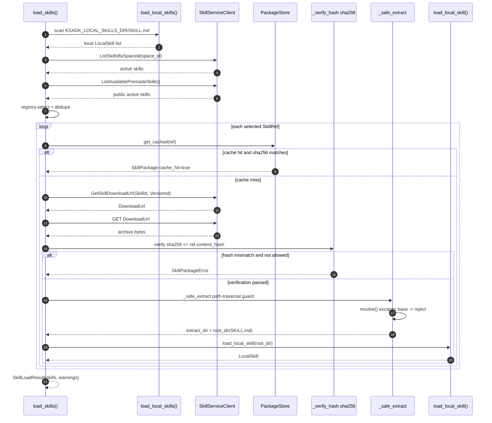
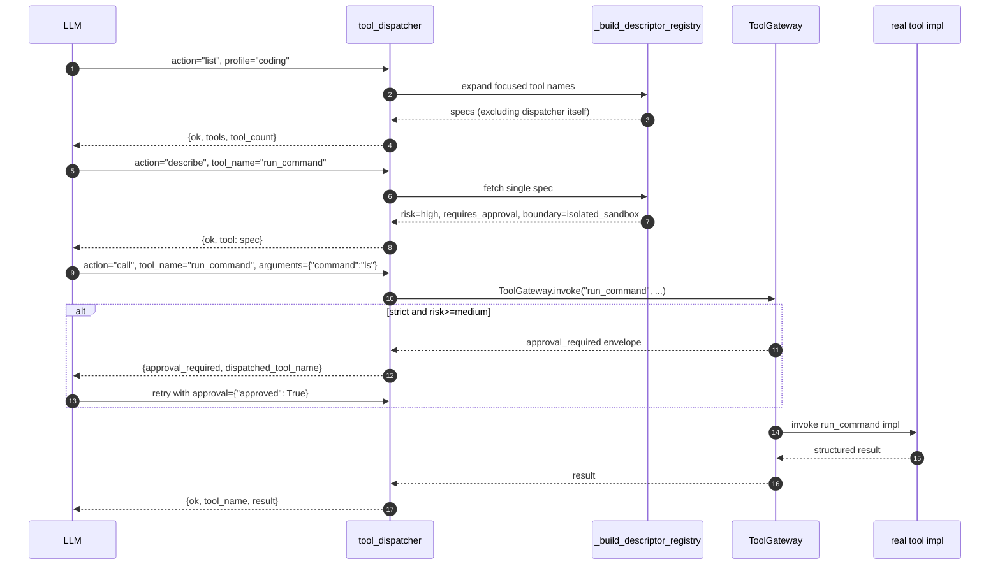

KsADK can expose tools to an agent through framework-native tools, MCP/A2A
integrations, and the optional Skill Runtime. The public rule is simple: tools
should be declared explicitly, validated at runtime, and isolated from secrets
or local files the agent does not need.

## Tool Layers


The framework adapter normalizes tool definitions before an agent run. The agent
receives a stable tool description, a narrow input schema, and a structured
result that can be rendered in the local Web UI or projected back into session
history. Before the real implementation is called, `ToolGateway.invoke()`
checks the `ToolPolicy`: in strict mode, medium / high / critical risk tools
return `approval_required` and only proceed down the `execute` branch after a
human confirms.

## When To Use Each Tool Path

| Need | Recommended path |
| --- | --- |
| Simple Python helper inside the agent project | framework-native function tool |
| External tool server with its own lifecycle | MCP toolset |
| Agent-to-agent protocol integration | A2A client or adapter |
| Reusable executable skill with optional sandboxing | Skill Runtime |
| Local development only | local backend with explicit paths and test data |
| Untrusted or expensive execution | reviewed sandbox backend and limits |
| Common AgentEngine built-ins | the `ksadk.toolsets` focused profile |
| Infrequent or higher-risk built-ins | `agentengine_tool_dispatcher` list/describe/call |

<Callout type="info">
Use the simplest path that gives the agent enough capability. Do not route a plain deterministic helper through a remote runtime just to make it look like a tool.
</Callout>

## AgentEngine Built-In Tools


`ksadk.toolsets` provides SDK built-in tool entry points. Calling
`get_agentengine_tools()` with no arguments still returns the full built-in
tool list for compatibility. New projects should choose an explicit set:

```python title="agent.py"
from ksadk.toolsets import describe_agentengine_tools, get_agentengine_tools

tools = get_agentengine_tools(include=["focused", "agentengine_tool_dispatcher"])
tool_descriptions = describe_agentengine_tools(include=["focused", "agentengine_tool_dispatcher"])
```

`include` can mix groups, profiles, and concrete tool names:

| include | Meaning |
| --- | --- |
| `skill` / `workspace` / `platform` / `sandbox` | bind a built-in tool group |
| `focused` / `core` | bind the common low-risk tool set |
| concrete names such as `run_code` | explicitly add one tool |

`focused/core` directly exposes:

- `list_skills`, `search_skills`, `load_skill`
- `workspace_status`, `search_workspace_files`
- `edit_workspace_file`, `lint_workspace_file`
- `component_status`, `sandbox_status`

`execute_skills`, `run_command`, `run_code`, `delete_workspace_file`, and
whole-file write tools are not part of the focused profile by default.

<Callout type="info">
Bind these tools explicitly, or call them through the dispatcher when needed.
</Callout>

## Dispatcher And Progressive Disclosure

`tool_dispatcher(action, tool_name=None, arguments=None, include=None, profile="default")`
is the low-risk index tool in `ksadk/toolsets/__init__.py`. It lets the model
list, describe, and call KsADK local built-in tools by name only when needed,
keeping the model context smaller. It invokes the real tool object, so it still
goes through Tool Gateway approval policy.


| action | Behavior |
| --- | --- |
| `list` | list dispatchable tools, excluding the dispatcher itself; returns `tools` + `tool_count` |
| `describe` | return one tool description, `risk_level`, `requires_approval`, and `boundary` |
| `call` | call a KsADK local built-in tool by name; returns `ok` + `tool_name` + `result` |

The three actions share the same built-in tool registry and all exclude
`tool_dispatcher` / `agentengine_tool_dispatcher` itself to avoid recursion. The
`call` branch ultimately goes through `ToolGateway.invoke`, so in strict mode
`run_command`, `run_code`, `execute_skills`, and workspace write/delete tools
still return an `approval_required` envelope that the caller (UI or outer
runtime) must pass back with the approval result.

<Callout type="warning">
The dispatcher only schedules KsADK local built-in tools. It does not connect to a console Tool Space database or perform remote dynamic tool binding. It calls the real tool object, so it does not bypass Tool Gateway approval policies. For example, in strict mode `run_command`, `run_code`, `execute_skills`, and workspace write/delete calls still return an `approval_required` envelope.
</Callout>

## Platform Tool Reference

`component_status` is the only low-risk read-only tool in the platform group. It
lets an agent inspect, at runtime, whether AgentEngine has bound a model,
knowledge base, long-term memory, skill space, sandbox, and workspace. It reads
environment variables and bound state and has no side effects.

### `component_status`

```python title="signature"
from ksadk.toolsets.platform import component_status

component_status() -> dict
```

| Field | Value |
| --- | --- |
| Risk level | `low` |
| Requires approval | No |
| Side effects | None (read-only) |
| Group | `platform` |
| Entry | `get_agentengine_tools(include=["platform"])` |

**Return shape**

```python title="example return"
{
  "ok": True,
  "summary": {
    "model": "glm-5.1",
    "knowledge_base_bound": True,
    "long_term_memory_bound": False,
    "skill_space_bound": True,
    "isolated_execution": "enabled",
    "sandbox_direct_tools": "enabled",
  },
  "skill_space": {"space_ids": [...], "tools": [...]},
  "skill_runtime": {"backend": "e2b", "enabled": True, "template_bound": True},
  "sandbox": {"backend": "e2b", "enabled": True, "tools": ["sandbox_status", "run_command", "run_code"]},
  "workspace": {"root": "/.../workspace", "tools": [...]},
}
```

**Related environment variables**

| Variable | Purpose |
| --- | --- |
| `OPENAI_MODEL_NAME` / `MODEL_NAME` | reflected in `summary.model` |
| `KSADK_KB_DATASET_ID` | whether a knowledge base is bound |
| `KSADK_LTM_NAMESPACE` | whether long-term memory is bound |
| `KSADK_SANDBOX_TEMPLATE_ID` / `KSADK_SKILL_RUNTIME_TEMPLATE_ID` | sandbox template binding |
| `KSADK_SKILL_RUNTIME_BACKEND` | Skill Runtime backend type |

## Workspace Tool Reference

Workspace tools are confined to the AgentEngine UI workspace directory
(`resolve_local_session_dir() / workspace`). All paths are normalized and
out-of-bound access is rejected. Write operations are rated `medium` risk and
`delete_workspace_file` is rated `high`; both require approval in strict mode.

<Callout type="info" title="0.6.7 session-scoped read_state">
`read_workspace_file` records a `WorkspaceReadState` (mtime, size, line range).
`edit_workspace_file` / `multi_edit_workspace_file` must validate that state
before writing: an unread file returns `file_not_read` and a file changed since
the last read returns `file_modified_since_read`. The state is keyed by
`session_id` — `workspace_state.py` uses `(session_id, path)` as the key and
defaults to the current session from `ToolExecutionContext`, so read_state does
not leak across sessions or accounts.
</Callout>

### `workspace_status`

```python title="signature"
workspace_status() -> dict
```

| Field | Value |
| --- | --- |
| Risk level | `low` |
| Requires approval | No |
| Side effects | None (read-only; will `mkdir` the root) |
| Group | `workspace` / `focused` |

Returns the workspace root, a sample of up to 50 files, and `file_count_sampled`.

### `list_workspace_files`

```python title="signature"
list_workspace_files(
    path: str = ".",
    glob: str | None = None,
    recursive: bool = False,
    include_dirs: bool = True,
    max_results: int = 500,
    sort_by: str = "name",  # name | mtime | size
) -> dict
```

| Field | Value |
| --- | --- |
| Risk level | `low` |
| Requires approval | No |
| Side effects | None (read-only) |
| Group | `workspace` / `focused` |

Returns `entries` (`name` / `path` / `type` / `size` / `mtime_ns`) and a
`truncated` flag. `max_results` is capped at 5000; a missing `path` returns
`ok=False` + `error_message`.

### `read_workspace_file`

```python title="signature"
read_workspace_file(
    path: str,
    start_line: int | None = None,
    end_line: int | None = None,
    max_chars: int | None = None,
    include_line_numbers: bool = True,
) -> dict
```

| Field | Value |
| --- | --- |
| Risk level | `low` |
| Requires approval | No |
| Side effects | None (read-only, but writes read_state) |
| Group | `workspace` / `focused` |

Reads UTF-8 text (rejects files >2MB). Supports line ranges, line numbers, and a
character budget (1000–100000). Returns `content` / `read_range` /
`total_lines` / `partial`; output beyond the budget is persisted as a preview.
Also records `WorkspaceReadState` for subsequent edit validation.

### `write_workspace_file`

```python title="signature"
write_workspace_file(
    path: str,
    content: str,
    overwrite: bool = True,
    approval: dict | None = None,  # [!code highlight]
) -> dict
```

| Field | Value |
| --- | --- |
| Risk level | `medium` |
| Requires approval | Yes in strict mode |
| Side effects | `workspace_write` |
| Group | `workspace` (not in focused by default) |

Whole-file write. With `overwrite=False`, an existing file returns `ok=False`.
In strict mode, calling without `approval` returns an `approval_required`
envelope.

### `write_workspace_files`

```python title="signature"
write_workspace_files(
    files: list[dict],  # [{path, content}, ...]
    overwrite: bool = True,
    approval: dict | None = None,  # [!code highlight]
) -> dict
```

| Field | Value |
| --- | --- |
| Risk level | `medium` |
| Requires approval | Yes in strict mode |
| Side effects | `workspace_write` |
| Group | `workspace` (not in focused by default) |

Batch whole-file write. Up to 100 files per call. Returns `written` and
`truncated`.

### `edit_workspace_file`

```python title="signature"
edit_workspace_file(
    path: str,
    old_text: str,
    new_text: str,
    expected_replacements: int = 1,
    replace_all: bool = False,
    approval: dict | None = None,  # [!code highlight]
) -> dict
```

| Field | Value |
| --- | --- |
| Risk level | `medium` |
| Requires approval | Yes in strict mode |
| Side effects | `workspace_edit` |
| Group | `workspace` / `focused` |

Exact snippet replacement. Requires a prior `read_workspace_file`, otherwise
returns `file_not_read`. A missing `old_text` returns `snippet_not_found` (with
`nearby_candidates`), and a match count that disagrees with
`expected_replacements` returns `ambiguous_edit`. Returns a unified diff
(persisted under budget). Supports quote-normalized matching (straight and
curly quotes are interchangeable).

### `multi_edit_workspace_file`

```python title="signature"
multi_edit_workspace_file(
    path: str,
    edits: list[dict],  # [{old_text, new_text, expected_replacements?, replace_all?}, ...]
    replace_all: bool = False,
    approval: dict | None = None,  # [!code highlight]
) -> dict
```

| Field | Value |
| --- | --- |
| Risk level | `medium` |
| Requires approval | Yes in strict mode |
| Side effects | `workspace_edit` |
| Group | `workspace` |

Atomic multi-snippet edit. If any edit fails, nothing is written and
`failed_edit_index` is returned. On success returns `edit_count` /
`replacements` and per-edit `diagnostics`.

### `lint_workspace_file`

```python title="signature"
lint_workspace_file(
    path: str,
    language: str = "auto",  # auto | python | json | markdown | text
) -> dict
```

| Field | Value |
| --- | --- |
| Risk level | `low` |
| Requires approval | No |
| Side effects | None (read-only) |
| Group | `workspace` / `focused` |

Lightweight built-in checks: Python uses `ast.parse`, JSON uses `json.loads`,
others scan for NUL bytes and trailing whitespace. `ok` is true only when no
error-level issue is found. `lint_model` is fixed to `built_in_lightweight` —
this is not a project formatter or a full lint pipeline.

### `search_workspace_files`

```python title="signature"
search_workspace_files(
    query: str,
    path: str = ".",
    is_regex: bool = False,
    glob: str | None = None,
    case_sensitive: bool = False,
    context_lines: int = 0,
    max_results: int = 100,
) -> dict
```

| Field | Value |
| --- | --- |
| Risk level | `low` |
| Requires approval | No |
| Side effects | None (read-only) |
| Group | `workspace` / `focused` |

Uses `rg` (ripgrep) when available for speed, otherwise falls back to pure
Python. Returns `results` (`path` / `line` / `text` / `context_before` /
`context_after`), `match_count`, `truncated`, and `search_backend` (`rg` or
`python`). Files >1MB are skipped; `context_lines` is capped at 20;
`max_results` is capped at 5000.

### `delete_workspace_file`

```python title="signature"
delete_workspace_file(
    path: str,
    approval: dict | None = None,  # [!code highlight]
) -> dict
```

| Field | Value |
| --- | --- |
| Risk level | `high` |
| Requires approval | Yes in strict mode |
| Side effects | `workspace_delete` |
| Group | `workspace` (not in focused by default) |

Deletes a file or empty directory. Refuses to delete the workspace root.
Non-empty directories must be cleared first.

### Multi-Framework Integration Examples

<Tabs>
<Tab value="LangGraph">

```python title="agent.py (LangGraph)"
from langgraph.prebuilt import create_react_agent
from ksadk.toolsets import get_agentengine_tools

# focused includes workspace read/search/edit/lint + component_status by default
tools = get_agentengine_tools(include=["focused"])

# explicitly add the high-risk delete capability (approval required in strict mode)
tools += get_agentengine_tools(include=["delete_workspace_file"])

agent = create_react_agent(model="openai/glm-5.1", tools=tools)
```

</Tab>
<Tab value="LangChain">

```python title="agent.py (LangChain)"
from langchain.agents import create_tool_calling_agent
from ksadk.toolsets import get_agentengine_tools

# as_tool() already wraps workspace functions as LangChain Tools
tools = get_agentengine_tools(include=["workspace"])

# a single tool can also be imported directly
from ksadk.toolsets.workspace import edit_workspace_file
tools.append(edit_workspace_file)
```

</Tab>
<Tab value="ADK">

```python title="agent.py (Google ADK)"
from google.adk.agents import LlmAgent
from ksadk.toolsets import get_agentengine_tools

# an ADK Agent accepts a tool list directly
agent = LlmAgent(
    name="workspace_agent",
    model="openai/glm-5.1",
    instruction="Use workspace tools to read and edit files.",
    tools=get_agentengine_tools(include=["focused"]),
)
```

</Tab>
</Tabs>

<Callout type="warning" title="Write operations require approval">
In strict mode, `write_workspace_file` / `write_workspace_files` /
`edit_workspace_file` / `multi_edit_workspace_file` (medium) and
`delete_workspace_file` (high) return an `approval_required` envelope first.
The caller (local Web UI or outer runtime) must pass the user's confirmation
back through the `approval` parameter before the real execution branch runs.
</Callout>

## Tool Gateway And Human Approval

Tool Gateway owns tool risk, approval, and execution boundaries. It does not
perform context compression. Enable strict approval with:

```bash
```

<Callout type="warning" title="Strict mode approval">
In strict mode, medium / high / critical risk tools return a structured `approval_required` result before execution. A UI or outer runtime can show the approval request, then pass the approval result back into the tool call after the user confirms.
</Callout>

| Tool type | Default risk | Behavior |
| --- | --- | --- |
| workspace read/search/status | low | execute directly |
| `edit_workspace_file` / write file | medium | approval required in strict mode |
| `delete_workspace_file` | high | approval required in strict mode |
| `execute_skills` | high | approval required in strict mode |
| `run_command` / `run_code` | high | approval required in strict mode, sandbox backend only |

<Callout type="info">
`edit_workspace_file` performs exact snippet replacement. It returns `snippet_not_found` when `old_text` is absent, and `ambiguous_edit` when the match count does not equal `expected_replacements`. `lint_workspace_file` is a lightweight built-in check for Python AST parsing, JSON parsing, and generic text issues; it is not a project formatter or a full lint pipeline.
</Callout>

## Skill Loading Sequence

`load_skills()` in `ksadk/skills/runtime/loader.py` merges local skills with
remote skill manifests at agent load time. Remote skills are first listed
through the Skill Service, then their download URL is fetched, the archive is
sha256-verified and safely extracted, and finally handed to
`load_local_skill()` to become a `LocalSkill`.


The mermaid sequence below is the text version of the same flow:



This sequence defines the Skill Runtime security boundary: a remote zip must
pass both the sha256 check and a path-traversal guard before it is extracted,
and a skill only becomes a `LocalSkill` once `SKILL.md` is located.
`KSADK_SKILL_ALLOW_HASH_MISMATCH` skips hash failures only when explicitly set,
and even then the warning is written back to `SkillLoadResult.warnings`.

This also explains the boundary: Skill Runtime and MCP are ADK agent load-time
extensions; A2A is an outer runner protocol adapter. A runner exposed through
A2A can still use the injected tools, but the A2A Server itself does not parse
MCP and does not run the sandbox.

## Skill Tool Reference

`ksadk.toolsets.skills` exposes four Skill tools. The first three (`list_skills`,
`search_skills`, `load_skill`) are low risk and read Skill Spaces directly;
`execute_skills` is high risk and runs through the isolated Skill Runtime.

### `list_skills`

List remote skill manifests discoverable for the current account (user Skill
Spaces plus public premade spaces, deduplicated).

```python title="signature"
list_skills() -> dict[str, Any]
```

| Field | Value |
| --- | --- |
| Risk level | `low` |
| Approval required | No |
| Side effects | None |
| Group | `skill` / `focused` |
| env var | `KSADK_SKILL_SPACE_IDS` / `KSADK_PUBLIC_SKILL_SPACE_IDS` / `KSADK_SKILL_SERVICE_URL` |

Returns `ok`, `skills` (manifest list with name/description/version/space_id),
and `skill_space_ids`. Returns `ok=False` with an error structure when the
Skill Service is not configured.

```python title="agent.py" {3}
from ksadk.toolsets.skills import list_skills

result = list_skills()
# {"ok": True, "skills": [...], "skill_space_ids": ["space_xxx"]}
```

### `search_skills`

Fuzzy-match skills by name, aliases, tags, description, and examples.

```python title="signature"
search_skills(query: str, max_results: int = 10) -> dict[str, Any]
```

| Field | Value |
| --- | --- |
| Risk level | `low` |
| Approval required | No |
| Side effects | None |
| Group | `skill` / `focused` |
| env var | same as `list_skills` |

Returns `ok`, `query`, and `results` (each with name/score/description). An
empty `query` returns `ok=False`.

```python title="agent.py" {3}
from ksadk.toolsets.skills import search_skills

hits = search_skills("diagram", max_results=5)
# {"ok": True, "query": "diagram", "results": [...]}
```

### `load_skill`

Download and load a skill's `SKILL.md` instructions into the outer agent
context (does not run the isolated runtime).

```python title="signature"
load_skill(skill_name: str) -> dict[str, Any]
```

| Field | Value |
| --- | --- |
| Risk level | `low` |
| Approval required | No |
| Side effects | `skill_cache_write` (writes to the local cache dir) |
| Group | `skill` / `focused` |
| env var | `KSADK_SKILL_SERVICE_URL` / `KSADK_SKILL_CACHE_DIR` |

Returns `ok`, `instructions`, `name`, `version`, `root_dir`, `has_scripts_dir`,
`script_files`, `cache_hit`, and `usage`. Returns `ok=False` with
`available_skills` when the skill is not found.

<Callout type="info">
The `usage` field tells the model to complete the task in the outer agent unless the skill explicitly requires isolated execution. Use `execute_skills` for isolated execution.
</Callout>

```python title="agent.py" {3}
from ksadk.toolsets.skills import load_skill

skill = load_skill("baoyu-diagram")
# skill["instructions"] is the SKILL.md body, ready to feed into agent context
```

### `execute_skills`

Hand a workflow prompt to the Skill Runtime for isolated execution, optionally
pre-binding skill names.

```python title="signature"
execute_skills(
    workflow_prompt: str,
    skill_names: list[str] | str | None = None,
    approval: dict[str, Any] | None = None,  # [!code highlight]
) -> dict[str, Any]
```

| Field | Value |
| --- | --- |
| Risk level | `high` |
| Approval required | Yes in strict mode |
| Side effects | `isolated_runtime_execution` |
| Group | `skill` (not in focused by default) |
| env var | `KSADK_SKILL_RUNTIME_BACKEND` / `KSADK_SANDBOX_TEMPLATE_ID` / `KSADK_SKILL_RUNTIME_TIMEOUT` |

Returns a runtime result (`ok`, `exit_code`, `stdout`, `stderr`,
`duration_ms`, `timed_out`, `output_files`, ...) plus
`execution_context=f"skill-runtime/{backend}"`. Returns `skill_runtime_disabled`
with a hint when no runtime backend is configured.

<Callout type="warning" title="execute_skills needs approval and an isolated runtime">
`execute_skills` is high risk with the `isolated_runtime_execution` side effect. Under `KSADK_TOOL_APPROVAL_MODE=strict` the call first returns an `approval_required` envelope; the UI or outer runtime must pass `approval={"approved": True}` back before execution. When no runtime is configured it returns a `skill_runtime_disabled` error suggesting `KSADK_SKILL_RUNTIME_BACKEND=local_process|e2b` or a sandbox template id.
</Callout>

### execute_skills Orchestration

After `ToolGateway.invoke` approves the call, `execute_skills` enters
`_execute_skills_impl` and finally reaches the runtime tool built by
`build_execute_skills_tool`. The flow:


<Callout type="info">
The runtime-internal "discover -> download -> sha256 -> extract -> loader -> agent" mirrors the Skill Loading Sequence above: `SkillServiceClient` lists skills, `download_skill_archive` fetches the zip, `PackageStore.store_archive` verifies sha256 and guards against path traversal, then `load_local_skill` loads it into the agent running inside the runtime subprocess.
</Callout>

### Skill Tools Multi-Framework Integration

<Tabs>
<Tab value="LangChain / OpenAI Tools">

```python title="agent.py"
from ksadk.toolsets.skills import get_skill_tools

# as_tool auto-converts Python functions to framework tools
tools = get_skill_tools()  # [list_skills, search_skills, load_skill, execute_skills]
```

</Tab>
<Tab value="Google ADK">

```python title="agent.py"
from google.adk.agents import LlmAgent
from ksadk.toolsets import get_agentengine_tools

# focused profile already includes list_skills / search_skills / load_skill
tools = get_agentengine_tools(include=["focused"])
root_agent = LlmAgent(name="skill_agent", model=model, tools=tools)
```

</Tab>
<Tab value="Explicit execute_skills">

```python title="agent.py"
from ksadk.toolsets import get_agentengine_tools

# focused does not include execute_skills by default; extend explicitly
tools = get_agentengine_tools(include=["focused", "execute_skills"])
```

</Tab>
</Tabs>

## Dispatcher Tool Reference

`tool_dispatcher` and its compatibility alias `agentengine_tool_dispatcher`
are low-risk index tools that let the model list, describe, and call KsADK local
built-in tools by name, instead of loading every tool description into context.
`tool_search` is a read-only search tool that returns matched tool descriptions,
risk levels, and boundaries.

### `tool_dispatcher`

```python title="signature"
tool_dispatcher(
    action: str,  # list | describe | call
    tool_name: str | None = None,
    arguments: dict[str, Any] | str | None = None,
    include: str | Iterable[str] | None = None,
    profile: str = "default",  # default | coding
) -> dict[str, Any]
```

| Field | Value |
| --- | --- |
| Risk level | `low` (itself); `call` inherits the target tool policy |
| Approval required | Not for the dispatcher itself; `call` goes through `ToolGateway.invoke` |
| Boundary | `local_ksadk_builtin_tools` |
| Group | `dispatcher` |

| Param | Type | Notes |
| --- | --- | --- |
| `action` | str | `list` / `describe` / `call` |
| `tool_name` | str | required for `describe` / `call`; cannot be the dispatcher itself |
| `arguments` | dict / JSON string | passed to the target tool on `call`; JSON strings are `json.loads`-ed |
| `include` | str / list[str] | restrict the `list` tool set |
| `profile` | str | `default` (all groups) or `coding` (focused) |

### Progressive Disclosure (list -> describe -> call)



All three actions share one registry and exclude `tool_dispatcher` /
`agentengine_tool_dispatcher` itself to avoid recursion. The `call` branch
ultimately goes through `ToolGateway.invoke`, so in strict mode `run_command`,
`run_code`, `execute_skills`, and workspace write/delete tools still return an
`approval_required` envelope.

| action | Behavior |
| --- | --- |
| `list` | list dispatchable tools excluding the dispatcher; returns `tools` + `tool_count` |
| `describe` | return one tool's `risk_level` / `requires_approval` / `boundary` |
| `call` | call a tool by name; returns `ok` + `tool_name` + `result`; `approval_required` is forwarded with `dispatched_tool_name` |

```python title="agent.py" {3,7}
from ksadk.toolsets import tool_dispatcher

# 1. list which tools are dispatchable
tools = tool_dispatcher(action="list", profile="coding")
# 2. describe run_command risk and boundary
spec = tool_dispatcher(action="describe", tool_name="run_command")
# 3. call for real (may return approval_required under strict)
out = tool_dispatcher(action="call", tool_name="run_command",
                     arguments={"command": "ls -la"})
```

### `tool_search`

```python title="signature"
tool_search(
    query: str,
    profile: str = "coding",
    max_results: int = 8,
    include_disabled: bool = False,
) -> dict[str, Any]
```

| Field | Value |
| --- | --- |
| Risk level | `low` |
| Approval required | No |
| Side effects | None (read-only) |
| Boundary | `local_ksadk_builtin_tool_registry` |
| Group | `tools` |

Returns `ok`, `query`, `results` (each with name/score/group/risk_level/
boundary/execution) and `deferred_tool_names`. `tool_search` searches both
built-in tool descriptions and framework-managed tools registered via
`register_external_tools`, but never executes any tool; it only returns
`deferred_tool_names` so the caller can later `tool_dispatcher(action="call")`.

```python title="agent.py" {3}
from ksadk.toolsets import tool_search

hits = tool_search("read file", profile="coding", max_results=5)
# {"ok": True, "results": [{"name": "read_workspace_file", "score": 4.0, ...}], ...}
```

## Built-In Tool Mode And Profile

Two environment variables control how many built-in tools KsADK exposes to the
runtime:

| Variable | Value | Behavior |
| --- | --- | --- |
| `KSADK_BUILTIN_TOOLS_MODE` | `off` | no built-in tools injected |
| | `direct` (default) | inject all tool objects per profile |
| | `focused` | inject the focused tool set (includes `tool_search`) |
| | `dispatcher` / `deferred` | inject only `tool_dispatcher` / `tool_search`, expand on demand |

| Variable | Value | Behavior |
| --- | --- | --- |
| `KSADK_BUILTIN_TOOLS_PROFILE` | `default` | all built-in groups (skill/workspace/platform/sandbox/web) |
| | `coding` | focused subset (workspace read/write, search, sandbox status, web, ...) |


```python title="agent.py"
from ksadk.toolsets import builtin_tools_for_runtime

# reads KSADK_BUILTIN_TOOLS_MODE + KSADK_BUILTIN_TOOLS_PROFILE
tools = builtin_tools_for_runtime()  # returns [] when mode=off
```

<Callout type="info">
`mode=deferred` suits context-budget-tight hosted scenarios: the runtime only sees `tool_search` and `tool_dispatcher`; the model searches first, then calls on demand, keeping full tool descriptions out of context.
</Callout>

| mode | Exposed tools | Use case |
| --- | --- | --- |
| `off` | none | pure framework agent with its own tool set |
| `direct` + `default` | all built-in tools | local development / debugging |
| `direct` + `coding` | focused tool set | general coding agent |
| `focused` | focused + `tool_search` | budget-constrained coding agent |
| `dispatcher` / `deferred` | `tool_dispatcher` / `tool_search` | hosted / multi-tenant, on-demand disclosure |

## Skill Service Integration

Skill tools reach the Skill Service through `SkillServiceClient`. Public docs
only need variable names, never real tokens or control-plane addresses.

| Variable | Purpose | Default / fallback |
| --- | --- | --- |
| `KSADK_SKILL_SERVICE_URL` | Skill Service base URL | inferred from AICP connection |
| `KSADK_SKILL_SERVICE_ENDPOINT` / `_SCHEME` | explicit endpoint / scheme | AICP mode inference |
| `KSADK_SKILL_SERVICE_TOKEN` | Bearer token | empty |
| `KSADK_SKILL_SERVICE_ACCESS_KEY` | access key | `KSYUN_ACCESS_KEY` / `KS3_ACCESS_KEY` |
| `KSADK_SKILL_SERVICE_SECRET_KEY` | secret key | `KSYUN_SECRET_KEY` / `KS3_SECRET_KEY` |
| `KSADK_SKILL_SERVICE_ACCOUNT_ID` | account id | `KSYUN_ACCOUNT_ID` |
| `KSADK_SKILL_SERVICE_REGION` | logical region | `KSYUN_REGION` / `cn-beijing-6` |
| `KSADK_SKILL_SERVICE_API_VERSION` | API version | `2024-06-12` |
| `KSADK_SKILL_SERVICE_SIGN_SERVICE` | signing service name | `aicp` |
| `KSADK_SKILL_SPACE_IDS` | user Skill Spaces (comma-separated) | `SKILL_SPACE_ID` fallback |
| `KSADK_PUBLIC_SKILL_SPACE_IDS` | public premade spaces | empty |
| `KSADK_PUBLIC_SKILL_ALLOWLIST` | public skill allowlist | empty (allow all) |
| `KSADK_SKILL_CACHE_DIR` | skill package cache dir | system temp dir |
| `KSADK_SKILL_MANIFEST_LIMIT` | max manifest entries | `30` |
| `KSADK_SKILL_MANIFEST_TIMEOUT` | manifest fetch timeout (s) | `10` |

<Callout type="warning">
Once `KSADK_SKILL_SPACE_IDS` is set, `runtime_agent_env_from_process` injects the variables above into the subprocess / sandbox environment so Skill tools inside the runtime can reach the same Skill Service. When `should_resolve_child_skill_service_url()` is true it also writes the inferred service URL into the subprocess, so the child does not re-run AICP inference.
</Callout>

```bash title=".env"
# variable names only; never commit real values
export KSADK_SKILL_SPACE_IDS=space_xxx
export KSADK_SKILL_SERVICE_URL=https://skill-service.example.com
export KSADK_SKILL_SERVICE_TOKEN=$SKILL_SERVICE_TOKEN
```

## Tool Gateway Approval

`ToolGateway.invoke` reads the `ToolPolicy` before calling the real
implementation and decides whether to intercept based on
`KSADK_TOOL_APPROVAL_MODE`:

| mode | Behavior |
| --- | --- |
| `off` (default) | no interception; execute directly |
| `strict` | medium / high / critical risk tools first return an `approval_required` envelope |

Skill tool policies:

| Tool | risk_level | side_effects | strict approval |
| --- | --- | --- | --- |
| `list_skills` | low | — | no |
| `search_skills` | low | — | no |
| `load_skill` | low | `skill_cache_write` | no |
| `execute_skills` | high | `isolated_runtime_execution` | yes |

Approval envelope (`approval_required`):

```python title="approval envelope"
{
  "ok": False,
  "type": "approval_required",
  "approval_required": True,
  "approval_request": {
    "id": "appr_xxx",
    "tool_name": "execute_skills",
    "risk_level": "high",
    "side_effects": ["isolated_runtime_execution"],
  },
}
```

The caller passes `approval={"approved": True}` to release the call; `approved=False`
returns `approval_rejected`. The dispatcher `call` branch attaches
`dispatched_tool_name` to the returned envelope so the UI can correlate the
real dispatched tool.

## Public Skill Runtime Contract

A public Skill Runtime integration should document:

- the skill name and purpose.
- input schema and required fields.
- output schema and error shape.
- required optional dependencies or extras.
- whether the skill runs locally or through a sandbox backend.
- which environment variables are needed.
- file, network, and execution limits.

<Callout type="warning">
The tool description should be precise enough for an LLM to decide when not to call it. Avoid descriptions that imply broad filesystem, shell, network, or credential access.
</Callout>

## Environment Configuration

<Callout type="warning">
Keep secrets out of source control. Store local development values in `.env` or your shell environment, and publish only placeholder names in examples.
</Callout>

Common public examples:

```bash
```

If a backend requires credentials, document the variable names and setup steps
without publishing actual values:

```bash title=".env"
export EXAMPLE_SANDBOX_API_KEY=...
```

<Callout type="warning">
Do not commit `.env`, `.pypirc`, PyPI tokens, kubeconfig files, private registry credentials, cloud access keys, or generated runtime state.
</Callout>

## Local Backend

The local backend is useful for development, tests, and examples that operate on
known input. It should be treated as trusted local execution:

- use temporary directories in tests.
- pass explicit input files instead of scanning the whole repository.
- keep timeouts short.
- return structured failures rather than raw tracebacks when possible.
- avoid examples that execute arbitrary user-provided shell.

Local backend examples are acceptable in public docs when they are deterministic
and do not require internal infrastructure.

## Sandbox Backend

A sandbox backend is appropriate when the skill needs stronger isolation,
network policy, or dependency control. Public docs should describe the contract,
not private provider wiring:

| Topic | Public documentation should say |
| --- | --- |
| authentication | required variable names, not token values |
| limits | timeout, memory, file size, and network policy |
| files | allowed upload/download paths and retention behavior |
| errors | stable error codes or categories |
| cleanup | whether the sandbox is disposable per run |

<Callout type="warning">
Internal account IDs, private images, registry hosts, hosted control-plane URLs, and provider-specific support runbooks should stay out of the public repository.
</Callout>

## Sandbox Tool Reference

`ksadk.toolsets.sandbox` exposes three tools, all routed through `ToolGateway`.
The backend is selected by `KSADK_SANDBOX_BACKEND`, and `sandbox_status` reports
the effective boundary.

### `sandbox_status`

Reports AgentEngine sandbox status and boundary. It runs no command.

```python title="Signature"
sandbox_status() -> dict
```

| Item | Value |
| --- | --- |
| Risk level | `low` |
| Approval required | No |
| Side effects | None (read-only) |
| Group | `sandbox` / `focused` |

Returns `ok` / `backend` / `enabled` / `isolated` / `template_bound` / `template_id` /
`timeout_seconds` / `ttl_seconds` / `idle_ttl_seconds` / `max_sessions` /
`sandbox_id` / `created_at` / `last_used_at` / `expires_at` / `idle_seconds` / `boundary`.
The `boundary` field describes the execution scope: isolated backends state
"executes only through the sandbox backend; never exposes the host shell", while
`local_process` / `pod_process` note shared local/pod filesystem and network.

| Env var | Purpose | Default |
| --- | --- | --- |
| `KSADK_SANDBOX_BACKEND` | backend (`e2b` / `local_process` / `pod_process` / `none`) | auto: `e2b` if template id set, else `none` |
| `KSADK_SANDBOX_TEMPLATE_ID` | E2B template id | — |
| `KSADK_SANDBOX_TIMEOUT` | per-command timeout seconds | 600 |
| `KSADK_SANDBOX_TTL_SECONDS` | sandbox lifetime TTL | 600 |
| `KSADK_SANDBOX_IDLE_TTL_SECONDS` | idle reclamation seconds | 300 |
| `KSADK_SANDBOX_MAX_SESSIONS` | max reused sessions (0 = unlimited) | 0 |

```python title="agent.py"
from ksadk.toolsets.sandbox import sandbox_status

info = sandbox_status()
if not info["enabled"]:
    raise RuntimeError(f"sandbox disabled: {info['boundary']}")
```

### `run_command`

Runs a shell command inside the isolated sandbox.

```python title="Signature"
run_command(
    command: str,
    cwd: str | None = None,
    timeout: int | None = None,
    env: dict[str, str] | None = None,
    background: bool = False,
    approval: dict | None = None,  # [!code highlight]
) -> dict
```

| Item | Value |
| --- | --- |
| Risk level | `high` |
| Approval required | Yes in strict mode |
| Side effects | `sandbox_command_execution` |
| Group | `sandbox` |

<Callout type="warning" title="High risk + explicit approval">
- Under `KSADK_TOOL_APPROVAL_MODE=strict` it returns `approval_required`; pass back `approval={"approved": True}` to execute.
- The command policy (`check_command_policy`) rejects by default: recursive `rm`,
  `sudo`/`kubectl`/`docker`, `git reset`/`clean`/`push`/`checkout`, and cloud
  metadata endpoints (`169.254.169.254`, `metadata.google.internal`).
- The `pod_process` backend requires `KSADK_ALLOW_POD_PROCESS_TOOLS=true`, otherwise `create_sandbox_backend` raises `SandboxError`.
- `background=True` returns `background_not_supported` in P0.
</Callout>

Returns `ok` / `backend` (e.g. `sandbox/e2b`) / `sandbox_id` / `command` / `stdout` /
`stderr` / `exit_code`, plus budget fields `stdout_truncated` /
`stdout_original_chars` / `stdout_preview_chars` (same for `stderr`), and
`persisted_outputs` when over threshold.

```python title="agent.py"
from ksadk.toolsets.sandbox import run_command

result = run_command(
    "python -c 'print(2+2)'",
    timeout=30,
    approval={"approved": True},
)
assert result["ok"]
print(result["stdout"], result["exit_code"])
```

### `run_code`

Runs a code snippet through the sandbox. It is not a shell replacement. The
source is written to `/tmp/ksadk-run-code-*` and the matching interpreter is invoked.

```python title="Signature"
run_code(
    code: str,
    language: str = "python",  # python | javascript | bash
    timeout: int | None = None,
    env: dict[str, str] | None = None,
    approval: dict | None = None,  # [!code highlight]
) -> dict
```

| Item | Value |
| --- | --- |
| Risk level | `high` |
| Approval required | Yes in strict mode |
| Side effects | `sandbox_code_execution` |
| Group | `sandbox` |

<Callout type="warning" title="High risk + isolated backend only">
- Only isolated backends (`e2b`) are accepted; `local_process` / `pod_process`
  return `isolated_sandbox_required` — snippet execution must not land on the
  shared pod filesystem.
- Supports `python` (aliases `py`/`python3`), `javascript` (`js`/`node`/`nodejs`),
  and `bash` (`sh`/`shell`). Other languages return `unsupported language`.
</Callout>

Returns `ok` / `backend` / `sandbox_id` / `execution_model="snippet_runner"` /
`boundary` / `language` / `path` / `command` / `stdout` / `stderr` / `exit_code`.

```python title="agent.py"
from ksadk.toolsets.sandbox import run_code

result = run_code(
    "import math; print(math.sqrt(16))",
    language="python",
    approval={"approved": True},
)
assert result["ok"]
```

### E2B Sandbox Backend


When `KSADK_SANDBOX_BACKEND=e2b` (or a template id is configured, which auto-selects
`e2b`), `create_sandbox_backend()` returns an `E2BSandboxBackend` that boots an
isolated sandbox via `e2b.Sandbox.create(template=..., envs=..., allow_internet_access=...)`.
Startup retries the `true` command and a readiness probe up to
`KSADK_SANDBOX_STARTUP_RETRY_ATTEMPTS` (default 6) times with exponential backoff
of `KSADK_SANDBOX_STARTUP_RETRY_DELAY` (default 0.2s).

| Env var | Purpose | Default |
| --- | --- | --- |
| `KSADK_SANDBOX_TEMPLATE_ID` / `KSADK_SKILL_RUNTIME_TEMPLATE_ID` | E2B template id (required; missing raises `SandboxError`) | — |
| `KSADK_SANDBOX_TIMEOUT` | sandbox lifetime seconds | 900 |
| `KSADK_SANDBOX_TYPE` | `aio` / `thread` (`SandboxType`) | `aio` |
| `KSADK_SANDBOX_ALLOW_INTERNET_ACCESS` | allow outbound internet | true |
| `KSADK_SANDBOX_STARTUP_RETRY_ATTEMPTS` | startup retry count | 6 |
| `KSADK_SANDBOX_STARTUP_RETRY_DELAY` | startup retry backoff base (seconds) | 0.2 |
| `KSADK_SANDBOX_SESSION_ID` | pinned reuse session key | derived from `ToolExecutionContext.session_id` |

<Callout type="info">
E2B requires `e2b>=2.0.0`. When not installed, `create_session` raises
`SandboxError("e2b>=2.0.0 is required for KSADK_SANDBOX_BACKEND=e2b")`.
</Callout>

Session reuse is managed by `GLOBAL_SANDBOX_REGISTRY`: `run_command`/`run_code`
with the same session key share a sandbox, reclaimed after
`KSADK_SANDBOX_IDLE_TTL_SECONDS` of idle time. Isolated backends also sync the
workspace root into `/workspace/`, bounded by `KSADK_SANDBOX_SYNC_MAX_FILES` /
`KSADK_SANDBOX_SYNC_MAX_FILE_BYTES` / `KSADK_SANDBOX_SYNC_MAX_TOTAL_BYTES`, and
skip `.git` / `__pycache__` / `.venv` / `node_modules` / `.pytest_cache`.

## Web Tool Reference

`ksadk.toolsets.web` exposes `web_fetch` and `web_search`. Both are `low` risk
but still go through the Tool Gateway, so strict mode can intercept them.

### `web_fetch`

Fetches a public HTTP(S) URL and returns sanitized text with script/style/noscript stripped.

```python title="Signature"
web_fetch(
    url: str,
    max_chars: int | None = None,
    timeout: int = 30,
) -> dict
```

| Item | Value |
| --- | --- |
| Risk level | `low` |
| Approval required | No (but constrained by SSRF policy) |
| Side effects | None (read-only HTTP GET) |
| Group | `web` |

<Callout type="warning" title="SSRF protection">
`_validate_public_http_url` applies three checks before the request:

1. The scheme must be `http`/`https` and the host is required.
2. `socket.getaddrinfo` resolves every A/AAAA record.
3. Each IP is checked with `ipaddress.ip_address` for `is_loopback` / `is_private` /
   `is_link_local` / `is_multicast` / `is_reserved`; a match returns
   `blocked_by_ssrf_policy`.

Redirects are re-validated hop by hop, up to 5 hops; beyond that it returns
`too_many_redirects`. `KSADK_WEB_SSRF_POLICY_JSON` (or
`OPENCLAW_BROWSER_SSRF_POLICY_JSON`) can pass `{"allow_private": true}` to
disable private-network blocking — only use this in a trusted internal network.
</Callout>

Returns `ok` / `url` / `final_url` / `status_code` / `content_type` /
`text` / `truncated` / `original_chars` / `preview_chars`, plus
`persisted={"path": ..., "mime_type": ...}` when over threshold.

```python title="agent.py"
from ksadk.toolsets.web import web_fetch

doc = web_fetch("https://example.com/docs", max_chars=20000)
if doc["ok"]:
    print(doc["final_url"], doc["content_type"])
    if doc.get("truncated"):
        print("persisted at", doc["persisted"]["path"])
```

### `web_search`

Returns `title`/`url`/`snippet` results without fetching full pages. The provider
is selected by `KSADK_WEB_SEARCH_PROVIDER` (or `OPENCLAW_WEB_SEARCH_PROVIDER`);
if unset, it returns `provider_not_configured`.

```python title="Signature"
web_search(
    query: str,
    max_results: int = 5,
    recency_days: int | None = None,  # http provider only
) -> dict
```

| Item | Value |
| --- | --- |
| Risk level | `low` |
| Approval required | No |
| Side effects | None (read-only search API) |
| Group | `web` |

| provider | Description | Credential vars |
| --- | --- | --- |
| `fake` | Test provider returning fixed fake results; no credential needed | — |
| `http` | Generic HTTP search API (GET, Bearer auth, supports `recency_days`) | `KSADK_WEB_SEARCH_API_KEY` |
| `ksyun` | Kingsoft Cloud AI Search (POST, scope=`webpage`/`document`/`scholar`/`podcast`/`video`) | `KSADK_WEB_SEARCH_API_KEY` / `KSADK_MCP_KEY` / `KSC_AIPRO_API_KEY` |

Returns `ok` / `query` / `provider` / `results[]` (each with
`title` / `url` / `snippet` / `rank` / `provider`; `ksyun` also includes `date`).

| Env var | Purpose |
| --- | --- |
| `KSADK_WEB_SEARCH_PROVIDER` | `fake` / `http` / `ksyun` |
| `KSADK_WEB_SEARCH_BASE_URL` | `http`/`ksyun` endpoint (`ksyun` defaults to `https://search.aipro.ksyun.com/v1/aisearch/search`) |
| `KSADK_WEB_SEARCH_API_KEY` | Bearer token |
| `KSADK_WEB_SEARCH_SCOPE` | `ksyun` scope, defaults to `webpage` |

<Tabs>
<Tab value="ksyun">

```python title="agent.py (ksyun)"
import os
os.environ["KSADK_WEB_SEARCH_PROVIDER"] = "ksyun"
os.environ["KSADK_WEB_SEARCH_API_KEY"] = "..."

from ksadk.toolsets.web import web_search

res = web_search("ksadk agent runtime", max_results=5)
for item in res["results"]:
    print(item["rank"], item["title"], item["url"])
```

</Tab>
<Tab value="http">

```python title="agent.py (http)"
import os
os.environ["KSADK_WEB_SEARCH_PROVIDER"] = "http"
os.environ["KSADK_WEB_SEARCH_BASE_URL"] = "https://search.example.com/v1/search"
os.environ["KSADK_WEB_SEARCH_API_KEY"] = "..."

from ksadk.toolsets.web import web_search

res = web_search("agent sdk", max_results=3, recency_days=7)
```

</Tab>
<Tab value="fake">

```python title="agent.py (fake)"
import os
os.environ["KSADK_WEB_SEARCH_PROVIDER"] = "fake"

from ksadk.toolsets.web import web_search

res = web_search("anything")  # test only, no real request
```

</Tab>
</Tabs>

## ToolResultBudget

`ksadk.tools.result_budget` truncates and persists large outputs so huge
stdout/text is not pushed into the model context. `run_command` / `run_code`
call `budget_text_fields` on `stdout`/`stderr`; `web_fetch` calls
`budget_tool_output` on `text`.


| Env var | Purpose | Default |
| --- | --- | --- |
| `KSADK_TOOL_RESULT_MAX_CHARS` | max chars per field | 50000 |
| `KSADK_TOOL_RESULT_PREVIEW_CHARS` | preview length when persisted | 8000 |
| `KSADK_TOOL_RESULT_PERSIST_THRESHOLD_CHARS` | threshold above which output is persisted | same as `max_chars` |
| `KSADK_TOOL_RESULT_DIR` | persist directory | `<session_dir>/tool-results` |

The return structure adds `<field>_truncated` / `<field>_original_chars` /
`<field>_preview_chars` alongside the original field, and the persisted file is
placed in `persisted_outputs[<field>] = {"path", "mime_type"}`. Paths always stay
inside `persist_dir`; escaping raises `ValueError`.

## Runner Payload

Framework adapters should pass tool and skill results as structured data. A
typical result includes:

| Field | Meaning |
| --- | --- |
| `name` | tool or skill name |
| `status` | `ok`, `failed`, `timeout`, or `cancelled` |
| `content` | user-visible result text or content blocks |
| `metadata` | execution metadata safe for logs and UI |
| `artifacts` | file references created by the tool, when supported |
| `error` | stable error summary for failed runs |

<Callout type="warning">
Business code should read structured fields instead of parsing local UI text.
</Callout>

## ADK Integration

For Google ADK projects, Skill Runtime tools can be injected during runner
loading when optional dependencies and configuration are available. Keep a
minimal ADK example free of optional runtime variables first, then add tools in
a separate example:

```python title="agent.py"
from google.adk.agents import Agent

root_agent = Agent(
    name="tool_ready_agent",
    instruction="Use tools only when they are relevant to the user request.",
)
```

Then document the runtime setup beside the example:

```bash title="bash"
pip install -U "ksadk[adk,skills]"
agentengine web . --no-open
```

<Callout type="info">
If the tool is not available, the agent project should still fail with a clear setup error instead of silently running with a different capability set.
</Callout>

## Testing Tool Integrations

Public tests should cover the boundary, not a private service account:

- tool schema conversion.
- successful local execution with deterministic input.
- timeout and failure handling.
- runner payload fields.
- Web UI request shape when the tool result is displayed.
- audit checks that no credentials or private endpoints appear in fixtures.

<Callout type="info">
Prefer fake clients, temporary files, and local HTTP servers for public tests. Only run provider-backed tests behind explicit environment gates.
</Callout>

## Security Checklist

Before publishing a tool or skill example:

- verify the example runs without internal accounts.
- remove private endpoints and customer data.
- check that generated files are ignored.
- document required optional extras.
- cap execution time and file sizes.
- avoid broad shell, network, or filesystem access.
- run the open-source audit before committing.

```bash
```

## Account Boundary And invocation_id

<Callout type="info" title="New in 0.6.7">
The runtime writes a single `PlatformInvocationContext`. Memory, sandbox,
workspace, and skill all read context scoped to the current account.
</Callout>


Requests entering the runner can carry an account identifier. The OpenAI
compatible endpoints `/v1/responses` and `/v1/chat/completions`, and the
internal `RunAgentAction`, all accept `account_id` (`AccountId` on the
A2A / gRPC side). The runtime writes it into `PlatformInvocationContext` so
downstream components isolate data by account boundary.

| Endpoint | Field | Notes |
| --- | --- | --- |
| `/v1/responses` | `account_id` | OpenAI compatible Responses API |
| `/v1/chat/completions` | `account_id` | OpenAI compatible Chat Completions API |
| `RunAgentAction` | `AccountId` | internal runner / A2A / gRPC action |

Downstream modules read the current account through the runtime-provided
context accessors instead of parsing request headers themselves:

```python title="agent.py"
from ksadk.runtime_context import get_current_account_id, get_current_invocation_context

account_id = get_current_account_id()
ctx = get_current_invocation_context()
```

`PlatformInvocationContext` at minimum carries:

- `account_id`: the current account boundary.
- `agent_id` / `user_id` / `session_id`: the related invocation identifiers.
- optional attachment, memory, and knowledge context fields.

The single-run `invocation_id` is carried by `ToolExecutionContext` and threads
through the execution alongside the context above.

When memory, sandbox, workspace, and skill execute tools or read and write
state, they read the current `PlatformInvocationContext` so that data, files,
and skill execution do not leak across accounts.

`invocation_id` is the stable identifier for a single run and threads through
the whole path:


- The runner payload carries `invocation_id` so local and remote views line up.
- `SubscribeRunEvents` and `CancelRun` locate the run instance by
  `invocation_id`.
- Trace and observability data use the same `invocation_id` to correlate
  stalls and failures.

<Callout type="info" title="Prefer context accessors for account boundary">
Tools and business code should call `get_current_account_id()` /
`get_current_invocation_context()` instead of parsing request headers or
caching `account_id` manually. This avoids picking up the wrong account
inside a sandbox or an async branch.
</Callout>


See [Agent Context](./agent-context.mdx) for the full context fields and
accessors, and [OpenAI Compatible API](../../references/openai-compatible-api.mdx)
for the HTTP endpoint fields.

## Relationship To Other Guides

Read this page with:

- [Frameworks](./frameworks.mdx) for runner loading behavior.
- [Agent Context](./agent-context.mdx) for the structured invocation context.
- [Attachments And Multimodal Input](./attachments-multimodal.mdx) for file input
  normalization.
- [Runtime Sessions And Files](../../references/runtime-sessions-files.mdx) for how
  tool events and file references are stored in local sessions.
