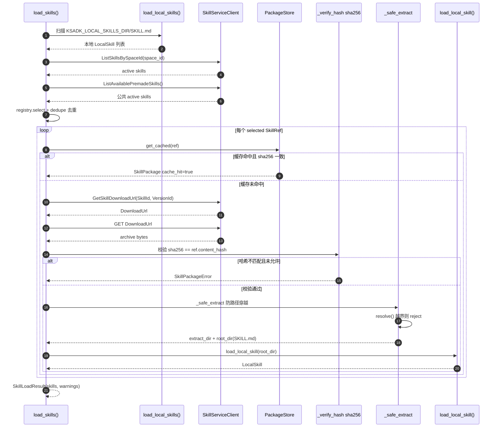
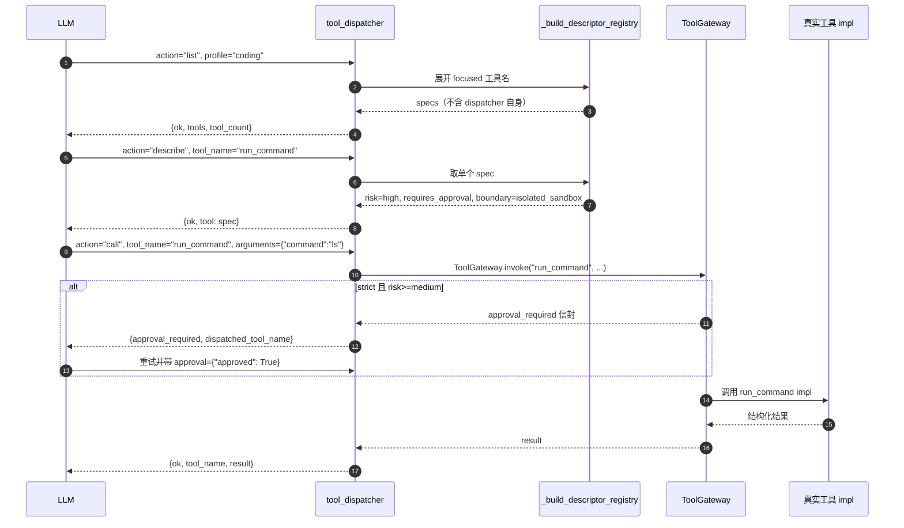

KsADK 可以通过框架原生工具、MCP/A2A 集成和可选的 Skill Runtime 向 Agent
暴露工具。公开规则是：工具必须显式声明，在运行时可验证，并且和 Agent 不
需要的密钥或本地文件隔离。

## 工具层次


框架适配器在 Agent 执行前归一化工具定义。Agent 拿到的是稳定工具描述、收窄的
输入 schema 和可在本地 Web UI 渲染或写回会话历史的结构化结果；而 `ToolGateway.invoke()`
在调用真实实现前先校验 `ToolPolicy`，strict 模式下 medium/high/critical 风险工具会返回
`approval_required`，等待人工确认后再走 `execute` 分支。

<Callout type="info">
优先使用能满足需求的最简单路径。不要把一个确定性的本地 helper 包成远端 runtime，只为了让它看起来像工具。
</Callout>

## 什么时候使用哪条路径

| 需求 | 推荐路径 |
| --- | --- |
| Agent 项目内的简单 Python helper | 框架原生 function tool |
| 自带生命周期的外部工具服务 | MCP toolset |
| Agent-to-Agent 协议集成 | A2A client 或 adapter |
| 可复用、可沙箱执行的技能 | Skill Runtime |
| 仅本地开发 | local backend，使用显式路径和测试数据 |
| 不可信或成本较高的执行 | 受审查的 sandbox backend 和限制 |
| AgentEngine 常用内置能力 | `ksadk.toolsets` 的 focused profile |
| 低频或高风险内置能力 | `agentengine_tool_dispatcher` 按需列出、描述和调用 |

## AgentEngine 内置工具


`ksadk.toolsets` 提供 SDK 内置工具入口。`get_agentengine_tools()` 无参时仍返回
全量内置工具，保持历史兼容；新项目推荐显式选择工具集合：

```python title="agent.py"
from ksadk.toolsets import describe_agentengine_tools, get_agentengine_tools

tools = get_agentengine_tools(include=["focused", "agentengine_tool_dispatcher"])
tool_descriptions = describe_agentengine_tools(include=["focused", "agentengine_tool_dispatcher"])
```

`include` 可以混用工具组、profile 和具体工具名：

| include | 含义 |
| --- | --- |
| `skill` / `workspace` / `platform` / `sandbox` | 绑定对应内置工具组 |
| `focused` / `core` | 绑定常用低风险工具集合 |
| `run_code` 等具体工具名 | 显式扩展单个工具 |

`focused/core` 默认直接暴露：

- `list_skills`、`search_skills`、`load_skill`
- `workspace_status`、`search_workspace_files`
- `edit_workspace_file`、`lint_workspace_file`
- `component_status`、`sandbox_status`

`execute_skills`、`run_command`、`run_code`、`delete_workspace_file` 和整文件写入类
工具不会默认进入 focused profile。

<Callout type="info">
需要这些能力时，可以显式绑定工具名，或通过 dispatcher 渐进式披露。
</Callout>

## 工具分发与渐进式披露

`tool_dispatcher(action, tool_name=None, arguments=None, include=None, profile="default")`
是 `ksadk/toolsets/__init__.py` 里的低风险索引工具，让模型只在需要时按名称列出、描述并调用
KsADK 本地内置工具，从而压缩上下文里的工具描述数量。它调用真实工具对象，因此仍受 Tool Gateway
审批策略约束。


三种 action 共享同一份内置工具注册表，且都排除了 `tool_dispatcher` /
`agentengine_tool_dispatcher` 自身，避免递归调用。`call` 分支最终走的是
`ToolGateway.invoke`，所以 strict 模式下 `run_command`、`run_code`、`execute_skills`
和 workspace 写入/删除工具依旧会返回 `approval_required` envelope，由调用方
（UI 或外层 runtime）将 approval 结果回传。

| action | 行为 |
| --- | --- |
| `list` | 列出可调度工具，不包含 dispatcher 自身，返回 `tools` + `tool_count` |
| `describe` | 返回单个工具的描述、`risk_level`、`requires_approval` 和 `boundary` |
| `call` | 按名称调用 KsADK 本地内置工具，结果回包 `ok` + `tool_name` + `result` |

<Callout type="warning">
dispatcher 只调度 KsADK 本地内置工具，不连接控制台 Tool Space 数据库，也不做远端动态工具绑定。它调用真实工具对象，因此不会绕过 Tool Gateway 审批策略；例如 strict 模式下调用 `run_command`、`run_code`、`execute_skills` 或 workspace 写入/删除工具时，仍会返回 `approval_required` envelope。
</Callout>

## Platform 工具参考

`component_status` 是 platform 组唯一的低风险只读工具，用于让 Agent 在运行时
快速了解 AgentEngine 绑定的模型、知识库、长期记忆、Skill Space、沙箱和 workspace
是否就绪。它读取环境变量与已绑定状态，不产生任何副作用。

### `component_status`

```python title="签名"
from ksadk.toolsets.platform import component_status

component_status() -> dict
```

| 项 | 值 |
| --- | --- |
| 风险等级 | `low` |
| 是否需要审批 | 否 |
| 副作用 | 无（只读） |
| 所属组 | `platform` |
| 入口 | `get_agentengine_tools(include=["platform"])` |

**返回结构**

```python title="返回示例"
{
  "ok": True,
  "summary": {
    "model": "glm-5.1",
    "knowledge_base_bound": True,
    "long_term_memory_bound": False,
    "skill_space_bound": True,
    "isolated_execution": "enabled",
    "sandbox_direct_tools": "enabled",
  },
  "skill_space": {"space_ids": [...], "tools": [...]},
  "skill_runtime": {"backend": "e2b", "enabled": True, "template_bound": True},
  "sandbox": {"backend": "e2b", "enabled": True, "tools": ["sandbox_status", "run_command", "run_code"]},
  "workspace": {"root": "/.../workspace", "tools": [...]},
}
```

**相关环境变量**

| 变量 | 作用 |
| --- | --- |
| `OPENAI_MODEL_NAME` / `MODEL_NAME` | 体现在 `summary.model` |
| `KSADK_KB_DATASET_ID` | 知识库是否绑定 |
| `KSADK_LTM_NAMESPACE` | 长期记忆是否绑定 |
| `KSADK_SANDBOX_TEMPLATE_ID` / `KSADK_SKILL_RUNTIME_TEMPLATE_ID` | 沙箱模板是否绑定 |
| `KSADK_SKILL_RUNTIME_BACKEND` | Skill Runtime 后端类型 |

## Workspace 工具参考

Workspace 工具被限制在 AgentEngine UI workspace 目录内（`resolve_local_session_dir()
/ workspace`）。所有路径都被归一化并拒绝越界访问。写操作按 `medium` 风险处理，
`delete_workspace_file` 按 `high` 风险处理；strict 模式下需要 approval。

<Callout type="info" title="0.6.7 会话级 read_state 隔离">
`read_workspace_file` 会记录 `WorkspaceReadState`（mtime、size、行范围）。
`edit_workspace_file` / `multi_edit_workspace_file` 在写入前必须校验该状态：
未读返回 `file_not_read`，文件被外部修改返回 `file_modified_since_read`。
状态按 `session_id` 隔离——`workspace_state.py` 用 `(session_id, path)` 作为键，
默认从 `ToolExecutionContext` 取当前会话 ID，因此不同会话/账号的 read_state
互不串扰。
</Callout>

### `workspace_status`

```python title="签名"
workspace_status() -> dict
```

| 项 | 值 |
| --- | --- |
| 风险等级 | `low` |
| 是否需要审批 | 否 |
| 副作用 | 无（只读，会 `mkdir` 根目录） |
| 所属组 | `workspace` / `focused` |

返回 workspace root、最多 50 个文件的采样列表与 `file_count_sampled`。

### `list_workspace_files`

```python title="签名"
list_workspace_files(
    path: str = ".",
    glob: str | None = None,
    recursive: bool = False,
    include_dirs: bool = True,
    max_results: int = 500,
    sort_by: str = "name",  # name | mtime | size
) -> dict
```

| 项 | 值 |
| --- | --- |
| 风险等级 | `low` |
| 是否需要审批 | 否 |
| 副作用 | 无（只读） |
| 所属组 | `workspace` / `focused` |

返回 `entries`（`name` / `path` / `type` / `size` / `mtime_ns`）和 `truncated` 标志；
`max_results` 上限 5000，`path` 不存在返回 `ok=False` + `error_message`。

### `read_workspace_file`

```python title="签名"
read_workspace_file(
    path: str,
    start_line: int | None = None,
    end_line: int | None = None,
    max_chars: int | None = None,
    include_line_numbers: bool = True,
) -> dict
```

| 项 | 值 |
| --- | --- |
| 风险等级 | `low` |
| 是否需要审批 | 否 |
| 副作用 | 无（只读，但会写入 read_state） |
| 所属组 | `workspace` / `focused` |

读取 UTF-8 文本（>2MB 拒绝），支持行范围、行号、字符预算（1000–100000）。
返回 `content` / `read_range` / `total_lines` / `partial`，超出预算会持久化为
preview。同时记录 `WorkspaceReadState` 供后续 edit 校验。

### `write_workspace_file`

```python title="签名"
write_workspace_file(
    path: str,
    content: str,
    overwrite: bool = True,
    approval: dict | None = None,  # [!code highlight]
) -> dict
```

| 项 | 值 |
| --- | --- |
| 风险等级 | `medium` |
| 是否需要审批 | strict 模式下需要 |
| 副作用 | `workspace_write` |
| 所属组 | `workspace`（默认不进 focused） |

整文件写入。`overwrite=False` 时文件已存在则返回 `ok=False`。strict 模式下未带
approval 返回 `approval_required` envelope。

### `write_workspace_files`

```python title="签名"
write_workspace_files(
    files: list[dict],  # [{path, content}, ...]
    overwrite: bool = True,
    approval: dict | None = None,  # [!code highlight]
) -> dict
```

| 项 | 值 |
| --- | --- |
| 风险等级 | `medium` |
| 是否需要审批 | strict 模式下需要 |
| 副作用 | `workspace_write` |
| 所属组 | `workspace`（默认不进 focused） |

批量整文件写入，单次最多 100 个文件，返回 `written` 列表与 `truncated`。

### `edit_workspace_file`

```python title="签名"
edit_workspace_file(
    path: str,
    old_text: str,
    new_text: str,
    expected_replacements: int = 1,
    replace_all: bool = False,
    approval: dict | None = None,  # [!code highlight]
) -> dict
```

| 项 | 值 |
| --- | --- |
| 风险等级 | `medium` |
| 是否需要审批 | strict 模式下需要 |
| 副作用 | `workspace_edit` |
| 所属组 | `workspace` / `focused` |

精确片段替换。需先 `read_workspace_file`，否则返回 `file_not_read`。`old_text`
未命中返回 `snippet_not_found`（附带 `nearby_candidates`），匹配次数与
`expected_replacements` 不一致返回 `ambiguous_edit`。返回 unified diff（按预算
持久化）。支持引号归一化匹配（直引号/弯引号互通）。

### `multi_edit_workspace_file`

```python title="签名"
multi_edit_workspace_file(
    path: str,
    edits: list[dict],  # [{old_text, new_text, expected_replacements?, replace_all?}, ...]
    replace_all: bool = False,
    approval: dict | None = None,  # [!code highlight]
) -> dict
```

| 项 | 值 |
| --- | --- |
| 风险等级 | `medium` |
| 是否需要审批 | strict 模式下需要 |
| 副作用 | `workspace_edit` |
| 所属组 | `workspace` |

原子化多片段编辑。任一 edit 失败整体不写入，返回 `failed_edit_index`。
成功返回 `edit_count` / `replacements` / 每条 edit 的 `diagnostics`。

### `lint_workspace_file`

```python title="签名"
lint_workspace_file(
    path: str,
    language: str = "auto",  # auto | python | json | markdown | text
) -> dict
```

| 项 | 值 |
| --- | --- |
| 风险等级 | `low` |
| 是否需要审批 | 否 |
| 副作用 | 无（只读） |
| 所属组 | `workspace` / `focused` |

轻量内置检查：Python 用 `ast.parse`、JSON 用 `json.loads`、其余扫描 NUL 字节
和尾部空白。`ok` 仅在无 error 级 issue 时为真。`lint_model` 固定为
`built_in_lightweight`——这不是项目级 formatter 或完整 lint 工具链。

### `search_workspace_files`

```python title="签名"
search_workspace_files(
    query: str,
    path: str = ".",
    is_regex: bool = False,
    glob: str | None = None,
    case_sensitive: bool = False,
    context_lines: int = 0,
    max_results: int = 100,
) -> dict
```

| 项 | 值 |
| --- | --- |
| 风险等级 | `low` |
| 是否需要审批 | 否 |
| 副作用 | 无（只读） |
| 所属组 | `workspace` / `focused` |

若环境装了 `rg`（ripgrep）优先走 rg（更快），否则回退纯 Python。返回
`results`（`path` / `line` / `text` / `context_before` / `context_after`）、
`match_count`、`truncated`、`search_backend`（`rg` 或 `python`）。
单文件 >1MB 跳过；`context_lines` 上限 20；`max_results` 上限 5000。

### `delete_workspace_file`

```python title="签名"
delete_workspace_file(
    path: str,
    approval: dict | None = None,  # [!code highlight]
) -> dict
```

| 项 | 值 |
| --- | --- |
| 风险等级 | `high` |
| 是否需要审批 | strict 模式下需要 |
| 副作用 | `workspace_delete` |
| 所属组 | `workspace`（默认不进 focused） |

删除文件或空目录。拒绝删除 workspace root。非空目录需先清空子项。

### 多框架接入示例

<Tabs>
<Tab value="LangGraph">

```python title="agent.py (LangGraph)"
from langgraph.prebuilt import create_react_agent
from ksadk.toolsets import get_agentengine_tools

# focused 默认含 workspace 读/search/edit/lint + component_status
tools = get_agentengine_tools(include=["focused"])

# 显式加上高风险删除能力（strict 模式下需 approval）
tools += get_agentengine_tools(include=["delete_workspace_file"])

agent = create_react_agent(model="openai/glm-5.1", tools=tools)
```

</Tab>
<Tab value="LangChain">

```python title="agent.py (LangChain)"
from langchain.agents import create_tool_calling_agent
from ksadk.toolsets import get_agentengine_tools

# as_tool() 已把 workspace 函数包成 LangChain Tool
tools = get_agentengine_tools(include=["workspace"])

# 可单独取某个工具
from ksadk.toolsets.workspace import edit_workspace_file
tools.append(edit_workspace_file)
```

</Tab>
<Tab value="ADK">

```python title="agent.py (Google ADK)"
from google.adk.agents import LlmAgent
from ksadk.toolsets import get_agentengine_tools

# ADK Agent 直接接收工具列表
agent = LlmAgent(
    name="workspace_agent",
    model="openai/glm-5.1",
    instruction="Use workspace tools to read and edit files.",
    tools=get_agentengine_tools(include=["focused"]),
)
```

</Tab>
</Tabs>

<Callout type="warning" title="写操作需要 approval">
strict 模式下，`write_workspace_file` / `write_workspace_files` /
`edit_workspace_file` / `multi_edit_workspace_file`（medium）和
`delete_workspace_file`（high）会先返回 `approval_required` envelope。
调用方（本地 Web UI 或外层 runtime）需把用户确认结果通过 `approval` 参数回传，
才会进入真实执行分支。
</Callout>

## Tool Gateway 与人工确认

Tool Gateway 负责工具风险、审批和执行边界，不负责上下文压缩。公开 SDK 支持
用环境变量启用严格审批：

```bash
```

<Callout type="warning" title="strict 模式审批">
strict 模式下，medium / high / critical 风险工具会先返回结构化 `approval_required`，而不是直接执行。UI 或外层 runtime 可以展示审批请求，并在用户确认后把 approval 结果传回工具调用。
</Callout>

| 工具类型 | 默认风险 | 行为 |
| --- | --- | --- |
| workspace read/search/status | low | 直接执行 |
| `edit_workspace_file` / 写文件 | medium | strict 模式需要审批 |
| `delete_workspace_file` | high | strict 模式需要审批 |
| `execute_skills` | high | strict 模式需要审批 |
| `run_command` / `run_code` | high | strict 模式需要审批，且只进 sandbox backend |

<Callout type="info">
`edit_workspace_file` 是 exact snippet replacement：`old_text` 未命中时返回 `snippet_not_found`，匹配次数与 `expected_replacements` 不一致时返回 `ambiguous_edit`。`lint_workspace_file` 是 SDK 内置轻量检查，支持 Python AST、JSON parse 和通用文本检查；它不是项目级 formatter 或完整 lint 工具链。
</Callout>

## Skill 加载时序

`ksadk/skills/runtime/loader.py` 的 `load_skills()` 在 Agent 装载期把本地技能与
远程技能 manifest 合并。远程技能先经 Skill Service 列举、获取下载地址，再做 sha256
校验与安全解压，最后交给 `load_local_skill()` 装入 `LocalSkill`。


下面的时序图给出同一流程的 mermaid 文本版本：



这条链路解释了 Skill Runtime 的安全边界：远程 zip 必须通过 sha256 校验和
路径穿越检查才会被解压；只有 `SKILL.md` 被定位到时，技能才会进入 `LocalSkill`。
`KSADK_SKILL_ALLOW_HASH_MISMATCH` 仅在显式开启时跳过哈希失败，但仍会把警告
写回 `SkillLoadResult.warnings`。

这个顺序也说明了边界：Skill Runtime 与 MCP 是 ADK Agent 装载期扩展；A2A
是 runner 外层协议适配。通过 A2A 暴露的 runner 可以间接使用已注入的工具，
但 A2A Server 自身不负责解析 MCP，也不负责执行沙箱。

## Skill 工具参考

`ksadk.toolsets.skills` 暴露四个 Skill 工具。前三个 (`list_skills` /
`search_skills` / `load_skill`) 风险等级 low，直接读 Skill Space；`execute_skills`
风险等级 high，走隔离 runtime。所有工具的签名、参数、返回结构和风险都遵循下表。

### `list_skills`

列出当前账号可发现的远程技能 manifest（用户 Skill Space + 公共预置空间，去重后）。

```python title="签名"
list_skills() -> dict[str, Any]
```

| 项 | 值 |
| --- | --- |
| 风险等级 | `low` |
| 是否需要审批 | 否 |
| 副作用 | 无 |
| 所属组 | `skill` / `focused` |
| env var | `KSADK_SKILL_SPACE_IDS` / `KSADK_PUBLIC_SKILL_SPACE_IDS` / `KSADK_SKILL_SERVICE_URL` |

返回 `ok`、`skills`（manifest 列表，含 name/description/version/space_id）和
`skill_space_ids`；Skill Service 未配置时返回 `ok=False` + 错误结构。

```python title="agent.py" {3}
from ksadk.toolsets.skills import list_skills

result = list_skills()
# {"ok": True, "skills": [...], "skill_space_ids": ["space_xxx"]}
```

### `search_skills`

按名称、别名、标签、描述和 examples 模糊匹配技能。

```python title="签名"
search_skills(query: str, max_results: int = 10) -> dict[str, Any]
```

| 项 | 值 |
| --- | --- |
| 风险等级 | `low` |
| 是否需要审批 | 否 |
| 副作用 | 无 |
| 所属组 | `skill` / `focused` |
| env var | 同 `list_skills` |

返回 `ok`、`query` 和 `results`（每条含 name/score/description）；`query` 为空
返回 `ok=False`。

```python title="agent.py" {3}
from ksadk.toolsets.skills import search_skills

hits = search_skills("diagram", max_results=5)
# {"ok": True, "query": "diagram", "results": [...]}
```

### `load_skill`

下载并加载某个技能的 `SKILL.md` 指令到外层 Agent 上下文（不走隔离 runtime）。

```python title="签名"
load_skill(skill_name: str) -> dict[str, Any]
```

| 项 | 值 |
| --- | --- |
| 风险等级 | `low` |
| 是否需要审批 | 否 |
| 副作用 | `skill_cache_write`（写入本地缓存目录） |
| 所属组 | `skill` / `focused` |
| env var | `KSADK_SKILL_SERVICE_URL` / `KSADK_SKILL_CACHE_DIR` |

返回 `ok`、`instructions`、`name`、`version`、`root_dir`、`has_scripts_dir`、
`script_files`、`cache_hit`、`usage`。技能不存在时返回 `ok=False` + `available_skills`。

<Callout type="info">
`usage` 字段提示模型：在外层 Agent 中直接完成任务，除非技能显式要求隔离执行。需要隔离执行时应改用 `execute_skills`。
</Callout>

```python title="agent.py" {3}
from ksadk.toolsets.skills import load_skill

skill = load_skill("baoyu-diagram")
# skill["instructions"] 是 SKILL.md 正文，可直接读入 Agent 上下文
```

### `execute_skills`

把一段 workflow prompt 交给 Skill Runtime 隔离执行，可选预绑定技能名。

```python title="签名"
execute_skills(
    workflow_prompt: str,
    skill_names: list[str] | str | None = None,
    approval: dict[str, Any] | None = None,  # [!code highlight]
) -> dict[str, Any]
```

| 项 | 值 |
| --- | --- |
| 风险等级 | `high` |
| 是否需要审批 | strict 模式下需要 |
| 副作用 | `isolated_runtime_execution` |
| 所属组 | `skill`（默认不进 focused） |
| env var | `KSADK_SKILL_RUNTIME_BACKEND` / `KSADK_SANDBOX_TEMPLATE_ID` / `KSADK_SKILL_RUNTIME_TIMEOUT` |

返回 runtime 结果（`ok`、`exit_code`、`stdout`、`stderr`、`duration_ms`、
`timed_out`、`output_files` 等），并附 `execution_context=f"skill-runtime/{backend}"`。
runtime 未配置时返回 `skill_runtime_disabled` + hint。

<Callout type="warning" title="execute_skills 需要审批与隔离 runtime">
`execute_skills` 风险等级为 high，side effect 是隔离 runtime 执行。在 `KSADK_TOOL_APPROVAL_MODE=strict` 下，调用会先返回 `approval_required` 信封，由 UI 或外层 runtime 把 `approval={"approved": True}` 回传后再执行。runtime 未配置时返回 `skill_runtime_disabled` 错误，提示设置 `KSADK_SKILL_RUNTIME_BACKEND=local_process|e2b` 或 sandbox template id。
</Callout>

### execute_skills 编排流

`execute_skills` 经 `ToolGateway.invoke` 审批后进入 `_execute_skills_impl`，
最终落到 `build_execute_skills_tool` 构造的 runtime tool。链路如下：


<Callout type="info">
runtime 内部的「发现 → 下载 → sha256 → 解压 → loader → agent」与上面 Skill 加载时序同构：`SkillServiceClient` 列举技能、`download_skill_archive` 拉取 zip、`PackageStore.store_archive` 做 sha256 校验和路径穿越保护，再交给 `load_local_skill` 装入 runtime 子进程内的 Agent。
</Callout>

### Skill 工具多框架接入

<Tabs>
<Tab value="LangChain / OpenAI Tools">

```python title="agent.py"
from ksadk.toolsets.skills import get_skill_tools

# as_tool 自动把 Python 函数转成框架工具
tools = get_skill_tools()  # [list_skills, search_skills, load_skill, execute_skills]
```

</Tab>
<Tab value="Google ADK">

```python title="agent.py"
from google.adk.agents import LlmAgent
from ksadk.toolsets import get_agentengine_tools

# focused profile 已含 list_skills / search_skills / load_skill
tools = get_agentengine_tools(include=["focused"])
root_agent = LlmAgent(name="skill_agent", model=model, tools=tools)
```

</Tab>
<Tab value="显式绑定 execute_skills">

```python title="agent.py"
from ksadk.toolsets import get_agentengine_tools

# focused 默认不含 execute_skills，需显式扩展
tools = get_agentengine_tools(include=["focused", "execute_skills"])
```

</Tab>
</Tabs>

## Dispatcher 工具参考

`tool_dispatcher` 和兼容别名 `agentengine_tool_dispatcher` 是低风险索引工具，
让模型按名称 list / describe / call KsADK 本地内置工具，避免一次性把全量工具
描述塞进上下文。`tool_search` 是只读搜索工具，返回匹配工具的描述、风险等级和边界。

### `tool_dispatcher`

```python title="签名"
tool_dispatcher(
    action: str,  # list | describe | call
    tool_name: str | None = None,
    arguments: dict[str, Any] | str | None = None,
    include: str | Iterable[str] | None = None,
    profile: str = "default",  # default | coding
) -> dict[str, Any]
```

| 项 | 值 |
| --- | --- |
| 风险等级 | `low`（自身）；`call` 分支继承目标工具策略 |
| 是否需要审批 | dispatcher 自身不需要；`call` 走 `ToolGateway.invoke` |
| 边界 | `local_ksadk_builtin_tools` |
| 所属组 | `dispatcher` |

| 参数 | 类型 | 说明 |
| --- | --- | --- |
| `action` | str | `list` / `describe` / `call` |
| `tool_name` | str | `describe` / `call` 时必填；不能是 dispatcher 自身 |
| `arguments` | dict / JSON 字符串 | `call` 时传给目标工具；JSON 字符串会自动 `json.loads` |
| `include` | str / list[str] | 限定 `list` 的工具集 |
| `profile` | str | `default`（全组）或 `coding`（focused） |

### 渐进式披露（list → describe → call）



三种 action 都共享同一份注册表，并都排除 `tool_dispatcher` /
`agentengine_tool_dispatcher` 自身以避免递归。`call` 分支最终走
`ToolGateway.invoke`，所以 strict 模式下 `run_command`、`run_code`、
`execute_skills` 和 workspace 写入/删除工具依旧会返回 `approval_required` 信封。

| action | 行为 |
| --- | --- |
| `list` | 列出可调度工具，排除 dispatcher 自身，返回 `tools` + `tool_count` |
| `describe` | 返回单个工具的 `risk_level` / `requires_approval` / `boundary` |
| `call` | 按名称调用工具，结果回包 `ok` + `tool_name` + `result`；`approval_required` 透传并附 `dispatched_tool_name` |

```python title="agent.py" {3,7}
from ksadk.toolsets import tool_dispatcher

# 1. list 看有哪些工具可调度
tools = tool_dispatcher(action="list", profile="coding")
# 2. describe 查 run_command 的风险与边界
spec = tool_dispatcher(action="describe", tool_name="run_command")
# 3. call 真正执行（strict 下可能先返回 approval_required）
out = tool_dispatcher(action="call", tool_name="run_command",
                     arguments={"command": "ls -la"})
```

### `tool_search`

```python title="签名"
tool_search(
    query: str,
    profile: str = "coding",
    max_results: int = 8,
    include_disabled: bool = False,
) -> dict[str, Any]
```

| 项 | 值 |
| --- | --- |
| 风险等级 | `low` |
| 是否需要审批 | 否 |
| 副作用 | 无（只读） |
| 边界 | `local_ksadk_builtin_tool_registry` |
| 所属组 | `tools` |

返回 `ok`、`query`、`results`（每条含 name/score/group/risk_level/boundary/
execution）和 `deferred_tool_names`。`tool_search` 同时搜索内置工具描述和
`register_external_tools` 注册的框架管理工具描述，但不会执行任何工具——它只返回
`deferred_tool_names`，让调用方按需再走 `tool_dispatcher(action="call")`。

```python title="agent.py" {3}
from ksadk.toolsets import tool_search

hits = tool_search("read file", profile="coding", max_results=5)
# {"ok": True, "results": [{"name": "read_workspace_file", "score": 4.0, ...}], ...}
```

## 内置工具模式与 Profile

通过两个环境变量控制 KsADK 向 runtime 暴露多少内置工具：

| 变量 | 取值 | 行为 |
| --- | --- | --- |
| `KSADK_BUILTIN_TOOLS_MODE` | `off` | 不注入任何内置工具 |
| | `direct`（默认） | 按 profile 全量注入工具对象 |
| | `focused` | 注入 focused 工具集（含 `tool_search`） |
| | `dispatcher` / `deferred` | 只注入 `tool_dispatcher` / `tool_search`，按需展开 |

| 变量 | 取值 | 行为 |
| --- | --- | --- |
| `KSADK_BUILTIN_TOOLS_PROFILE` | `default` | 全部内置工具组（skill/workspace/platform/sandbox/web） |
| | `coding` | focused 子集（workspace 读写、search、sandbox status、web 等） |


```python title="agent.py"
from ksadk.toolsets import builtin_tools_for_runtime

# 读 KSADK_BUILTIN_TOOLS_MODE + KSADK_BUILTIN_TOOLS_PROFILE
tools = builtin_tools_for_runtime()  # mode=off 时返回 []
```

<Callout type="info">
`mode=deferred` 适合上下文预算紧张的 hosted 场景：runtime 只看到 `tool_search` 与 `tool_dispatcher`，模型先搜索再按需 call，把全量工具描述挡在 context 之外。
</Callout>

| mode | 暴露工具 | 适用场景 |
| --- | --- | --- |
| `off` | 无 | 自带工具集的纯框架 Agent |
| `direct` + `default` | 全量内置工具 | 本地开发 / 调试 |
| `direct` + `coding` | focused 工具集 | 通用 coding agent |
| `focused` | focused + `tool_search` | 预算有限的 coding agent |
| `dispatcher` / `deferred` | `tool_dispatcher` / `tool_search` | hosted / 多租户，按需披露 |

## Skill Service 集成

Skill 工具通过 `SkillServiceClient` 访问 Skill Service。公开配置只需变量名，
不需要在文档里写真实 token 或控制面地址。

| 变量 | 作用 | 默认 / 回退 |
| --- | --- | --- |
| `KSADK_SKILL_SERVICE_URL` | Skill Service 基址 | 由 AICP 连接推断 |
| `KSADK_SKILL_SERVICE_ENDPOINT` / `_SCHEME` | 显式 endpoint / scheme | AICP 模式推断 |
| `KSADK_SKILL_SERVICE_TOKEN` | Bearer token | 空 |
| `KSADK_SKILL_SERVICE_ACCESS_KEY` | 访问密钥 | `KSYUN_ACCESS_KEY` / `KS3_ACCESS_KEY` |
| `KSADK_SKILL_SERVICE_SECRET_KEY` | 私有密钥 | `KSYUN_SECRET_KEY` / `KS3_SECRET_KEY` |
| `KSADK_SKILL_SERVICE_ACCOUNT_ID` | 账号 ID | `KSYUN_ACCOUNT_ID` |
| `KSADK_SKILL_SERVICE_REGION` | 逻辑 region | `KSYUN_REGION` / `cn-beijing-6` |
| `KSADK_SKILL_SERVICE_API_VERSION` | API 版本 | `2024-06-12` |
| `KSADK_SKILL_SERVICE_SIGN_SERVICE` | 签名服务名 | `aicp` |
| `KSADK_SKILL_SPACE_IDS` | 用户 Skill Space（逗号分隔） | `SKILL_SPACE_ID` 回退 |
| `KSADK_PUBLIC_SKILL_SPACE_IDS` | 公共预置空间 | 空 |
| `KSADK_PUBLIC_SKILL_ALLOWLIST` | 公共技能白名单 | 空（全放行） |
| `KSADK_SKILL_CACHE_DIR` | 技能包缓存目录 | 系统临时目录 |
| `KSADK_SKILL_MANIFEST_LIMIT` | manifest 最大条数 | `30` |
| `KSADK_SKILL_MANIFEST_TIMEOUT` | manifest 拉取超时（秒） | `10` |

<Callout type="warning">
配置 `KSADK_SKILL_SPACE_IDS` 后，`runtime_agent_env_from_process` 会把上述变量注入子进程 / sandbox 环境，使 runtime 内的 Skill 工具能访问同一个 Skill Service。`should_resolve_child_skill_service_url()` 为真时还会把推断出的 service URL 写入子进程，避免子进程再次走 AICP 推断。
</Callout>

```bash title=".env"
# 只写变量名，不要提交真实值
export KSADK_SKILL_SPACE_IDS=space_xxx
export KSADK_SKILL_SERVICE_URL=https://skill-service.example.com
export KSADK_SKILL_SERVICE_TOKEN=$SKILL_SERVICE_TOKEN
```

## Tool Gateway 审批

`ToolGateway.invoke` 在调用真实实现前读取 `ToolPolicy`，按
`KSADK_TOOL_APPROVAL_MODE` 决定是否拦截：

| mode | 行为 |
| --- | --- |
| `off`（默认） | 不拦截，直接执行 |
| `strict` | `risk_level` 为 medium / high / critical 的工具先返回 `approval_required` 信封 |

Skill 工具的策略：

| 工具 | risk_level | side_effects | strict 下审批 |
| --- | --- | --- | --- |
| `list_skills` | low | — | 否 |
| `search_skills` | low | — | 否 |
| `load_skill` | low | `skill_cache_write` | 否 |
| `execute_skills` | high | `isolated_runtime_execution` | 是 |

审批信封结构（`approval_required`）：

```python title="approval envelope"
{
  "ok": False,
  "type": "approval_required",
  "approval_required": True,
  "approval_request": {
    "id": "appr_xxx",
    "tool_name": "execute_skills",
    "risk_level": "high",
    "side_effects": ["isolated_runtime_execution"],
  },
}
```

调用方把 `approval={"approved": True}` 回传即可放行；`approved=False` 则返回
`approval_rejected`。dispatcher 的 `call` 分支会把 `dispatched_tool_name` 附在
返回信封上，方便 UI 关联被调度的真实工具。

## 公开 Skill Runtime 契约

一个公开的 Skill Runtime 集成应记录：

- skill 名称和用途。
- 输入 schema 和必填字段。
- 输出 schema 和错误形态。
- 必需的 optional dependencies 或 extras。
- skill 在本地执行还是在 sandbox backend 中执行。
- 需要的环境变量名称。
- 文件、网络和执行时间限制。

<Callout type="warning">
工具描述应足够精确，让 LLM 知道什么时候不该调用它。避免暗示工具拥有宽泛的文件系统、shell、网络或凭证访问能力。
</Callout>

## Skills Mode 判定

ADK runner 会先解析 skills mode。显式设置 `KSADK_SKILLS_MODE` 时直接生效；
`auto` 模式下按环境与本地目录推断。


## Skill Runtime Backend

Skill Runtime Backend 是一个协议接口。核心方法 `run_workflow()` 接收
workflow prompt、技能空间、session id、可选技能名、环境变量、输入文件和
timeout，返回 `SkillRuntimeResult`。

| 字段 | 含义 |
| --- | --- |
| `runtime_id` | 后端运行实例标识 |
| `exit_code` | 子进程或 sandbox 命令退出码 |
| `stdout` / `stderr` | 公开安全的输出摘要 |
| `duration_ms` | 执行耗时 |
| `timed_out` | 是否超时 |
| `error_type` / `error_message` | 稳定错误分类和摘要 |
| `output_files` | 工具生成的输出文件引用 |

`ok` 只在 `exit_code == 0`、没有 `error_type` 且未超时时为真。

<Callout type="warning">
业务代码应读结构化字段，不要解析本地 UI 文本。
</Callout>

## Backend 选择

| Backend | 选择条件 | 执行位置 | Prompt 传递方式 |
| --- | --- | --- | --- |
| `disabled` | 默认无 sandbox 配置或显式 disabled | 不执行 | 调用即抛出 setup 错误 |
| `local_process` | `KSADK_SKILL_RUNTIME_BACKEND=local_process` | 本地 Python 子进程 | 写入临时 prompt 文件 |
| `e2b` | 显式 e2b、sandbox backend 或 template id | E2B 沙箱 | 写入 sandbox 内 prompt 文件 |

<Callout type="warning">
公开文档可以描述这些 backend 的契约，但不应发布私有镜像、私有 registry、内部控制面地址或团队运行手册。
</Callout>

## 远程技能 manifest

当配置了 `KSADK_SKILL_SERVICE_URL` 且存在 skill space id 时，KsADK 会加载
远程技能 manifest。只保留 active skills，并按技能名去重；如果某个公共技能
空间配置了 allowlist，则只暴露 allowlist 内的技能。

manifest instruction 会提醒模型：

- 只有任务匹配时才调用 `execute_skills`。
- 调用时使用原始 `workflow_prompt`。
- `skill_names` 必须使用精确技能名。
- 不要假设完整技能说明已经加载；`execute_skills` 会按需加载。

## MCP 配置边界

MCP Runtime 以 `KSADK_MCP_SERVERS` 为入口，默认启用。只有
`KSADK_ENABLE_MCP_TOOLS` 为 `0`、`false`、`no` 或 `off` 时禁用。

| 配置项 | 作用 | 校验或默认行为 |
| --- | --- | --- |
| `KSADK_ENABLE_MCP_TOOLS` | MCP 工具注入开关 | 默认启用 |
| `KSADK_MCP_SERVERS` | JSON 数组形式的 MCP Server 配置 | 必须是 JSON array |
| `name` | MCP Server 名称 | 必须是非空字符串 |
| `url` | Streamable HTTP MCP Endpoint | 必须是绝对 `http(s)` URL 且 path 以 `/mcp` 结尾 |
| `api_key` | Bearer Token | 可选字符串，生成 Authorization header |
| `tool_filter` | 限制暴露工具名 | 可选非空字符串列表 |
| `tool_name_prefix` | 工具名前缀与去重键组成部分 | 可选字符串 |

示例可以展示变量名，但不能包含真实 token、私有 endpoint 或内部服务地址。

## 环境配置

<Callout type="warning">
密钥不要进源码。把本地开发值放在 `.env` 或 shell 环境中，公开文档只展示占位变量名。
</Callout>

```bash
```

如果后端需要凭证，文档只写变量名和配置步骤：

```bash title=".env"
export EXAMPLE_SANDBOX_API_KEY=...
```

<Callout type="warning">
不要提交 `.env`、`.pypirc`、PyPI token、kubeconfig、私有 registry 凭证、云访问密钥或生成的运行状态文件。
</Callout>

## 本地 Backend

local backend 适合开发、测试和只操作已知输入的示例。应按可信本地执行处理：

- 测试里使用临时目录。
- 传入显式输入文件，不扫描整个仓库。
- 使用较短 timeout。
- 尽量返回结构化失败，而不是原始 traceback。
- 避免执行任意用户提供 shell 的示例。

公开文档中的 local backend 示例应可复现，不依赖内部基础设施。

## Sandbox Backend

sandbox backend 适合需要更强隔离、网络策略或依赖控制的场景。公开文档应描述
契约，而不是私有 provider wiring：

| 主题 | 公开文档应说明 |
| --- | --- |
| authentication | 需要的变量名，不写 token 值 |
| limits | timeout、内存、文件大小和网络策略 |
| files | 允许上传/下载路径和保留行为 |
| errors | 稳定错误码或错误类别 |
| cleanup | sandbox 是否每次调用后销毁 |

<Callout type="warning">
内部账号 ID、私有镜像、registry host、托管控制面 URL 和支持 runbook 都应留在内部文档中。
</Callout>

## Sandbox 工具参考

`ksadk.toolsets.sandbox` 暴露三个工具，全部经 `ToolGateway`。backend 由
`KSADK_SANDBOX_BACKEND` 决定，`sandbox_status` 报告实际生效的边界。


### `sandbox_status`

报告 AgentEngine sandbox 状态和边界，不执行任何命令。

```python title="签名"
sandbox_status() -> dict
```

| 项 | 值 |
| --- | --- |
| 风险等级 | `low` |
| 是否需要审批 | 否 |
| 副作用 | 无（只读） |
| 所属组 | `sandbox` / `focused` |

返回 `ok` / `backend` / `enabled` / `isolated` / `template_bound` / `template_id` /
`timeout_seconds` / `ttl_seconds` / `idle_ttl_seconds` / `max_sessions` /
`sandbox_id` / `created_at` / `last_used_at` / `expires_at` / `idle_seconds` / `boundary`。
`boundary` 字段说明执行边界：隔离 backend 标注「只通过 sandbox backend 执行，不暴露主机 shell」，
`local_process` / `pod_process` 标注共享本地/pod 文件系统与网络。

| 环境变量 | 作用 | 默认 |
| --- | --- | --- |
| `KSADK_SANDBOX_BACKEND` | backend（`e2b` / `local_process` / `pod_process` / `none`） | 自动推断：有 template id 用 `e2b`，否则 `none` |
| `KSADK_SANDBOX_TEMPLATE_ID` | E2B 模板 id | — |
| `KSADK_SANDBOX_TIMEOUT` | 单次命令超时秒数 | 600 |
| `KSADK_SANDBOX_TTL_SECONDS` | sandbox 存活 TTL | 600 |
| `KSADK_SANDBOX_IDLE_TTL_SECONDS` | 空闲回收秒数 | 300 |
| `KSADK_SANDBOX_MAX_SESSIONS` | 最大复用会话数（0 = 不限） | 0 |

```python title="agent.py"
from ksadk.toolsets.sandbox import sandbox_status

info = sandbox_status()
if not info["enabled"]:
    raise RuntimeError(f"sandbox disabled: {info['boundary']}")
```

### `run_command`

在隔离 sandbox 内执行 shell 命令。

```python title="签名"
run_command(
    command: str,
    cwd: str | None = None,
    timeout: int | None = None,
    env: dict[str, str] | None = None,
    background: bool = False,
    approval: dict | None = None,  # [!code highlight]
) -> dict
```

| 项 | 值 |
| --- | --- |
| 风险等级 | `high` |
| 是否需要审批 | strict 模式下是 |
| 副作用 | `sandbox_command_execution` |
| 所属组 | `sandbox` |

<Callout type="warning" title="高风险 + 显式审批">
- `KSADK_TOOL_APPROVAL_MODE=strict` 下返回 `approval_required`，需回传 `approval={"approved": True}`。
- 命令策略 (`check_command_policy`) 默认拦截：递归 `rm`、`sudo`/`kubectl`/`docker`、
  `git reset`/`clean`/`push`/`checkout`、云元数据端点（`169.254.169.254`、`metadata.google.internal`）。
- `pod_process` backend 必须显式 `KSADK_ALLOW_POD_PROCESS_TOOLS=true` 才会创建，否则 `create_sandbox_backend` 抛 `SandboxError`。
- `background=True` 在 P0 直接返回 `background_not_supported`。
</Callout>

返回 `ok` / `backend`（形如 `sandbox/e2b`）/ `sandbox_id` / `command` / `stdout` /
`stderr` / `exit_code`，以及预算字段 `stdout_truncated` / `stdout_original_chars` /
`stdout_preview_chars`（`stderr` 同），超阈值时附 `persisted_outputs`。

```python title="agent.py"
from ksadk.toolsets.sandbox import run_command

result = run_command(
    "python -c 'print(2+2)'",
    timeout=30,
    approval={"approved": True},
)
assert result["ok"]
print(result["stdout"], result["exit_code"])
```

### `run_code`

在 sandbox 内执行代码片段，不是 shell 替代。写入 `/tmp/ksadk-run-code-*` 后调用对应解释器。

```python title="签名"
run_code(
    code: str,
    language: str = "python",  # python | javascript | bash
    timeout: int | None = None,
    env: dict[str, str] | None = None,
    approval: dict | None = None,  # [!code highlight]
) -> dict
```

| 项 | 值 |
| --- | --- |
| 风险等级 | `high` |
| 是否需要审批 | strict 模式下是 |
| 副作用 | `sandbox_code_execution` |
| 所属组 | `sandbox` |

<Callout type="warning" title="高风险 + 仅隔离 backend">
- 只接受隔离 backend（`e2b`）；`local_process` / `pod_process` 直接返回
  `isolated_sandbox_required`——snippet 执行不允许落在共享 pod 文件系统上。
- 支持 `python`（别名 `py`/`python3`）、`javascript`（`js`/`node`/`nodejs`）、`bash`（`sh`/`shell`），
  其它返回 `unsupported language`。
</Callout>

返回 `ok` / `backend` / `sandbox_id` / `execution_model="snippet_runner"` /
`boundary` / `language` / `path` / `command` / `stdout` / `stderr` / `exit_code`。

```python title="agent.py"
from ksadk.toolsets.sandbox import run_code

result = run_code(
    "import math; print(math.sqrt(16))",
    language="python",
    approval={"approved": True},
)
assert result["ok"]
```

### E2B Sandbox Backend


`KSADK_SANDBOX_BACKEND=e2b`（或配置了 template id 自动选 `e2b`）时，
`create_sandbox_backend()` 返回 `E2BSandboxBackend`，通过
`e2b.Sandbox.create(template=..., envs=..., allow_internet_access=...)` 拉起隔离沙箱。
启动期重试 `true` 命令与就绪探测，最多 `KSADK_SANDBOX_STARTUP_RETRY_ATTEMPTS`
（默认 6）次，指数退避 `KSADK_SANDBOX_STARTUP_RETRY_DELAY`（默认 0.2s）。

| 环境变量 | 作用 | 默认 |
| --- | --- | --- |
| `KSADK_SANDBOX_TEMPLATE_ID` / `KSADK_SKILL_RUNTIME_TEMPLATE_ID` | E2B 模板 id（必填，缺失抛 `SandboxError`） | — |
| `KSADK_SANDBOX_TIMEOUT` | sandbox 存活秒数 | 900 |
| `KSADK_SANDBOX_TYPE` | `aio` / `thread`（`SandboxType`） | `aio` |
| `KSADK_SANDBOX_ALLOW_INTERNET_ACCESS` | 是否允许出网 | true |
| `KSADK_SANDBOX_STARTUP_RETRY_ATTEMPTS` | 启动重试次数 | 6 |
| `KSADK_SANDBOX_STARTUP_RETRY_DELAY` | 启动重试退避基数（秒） | 0.2 |
| `KSADK_SANDBOX_SESSION_ID` | 固定复用 session key | 按 `ToolExecutionContext.session_id` 推断 |

<Callout type="info">
E2B 需要 `e2b>=2.0.0`。未安装时 `create_session` 抛
`SandboxError("e2b>=2.0.0 is required for KSADK_SANDBOX_BACKEND=e2b")`。
</Callout>

会话复用由 `GLOBAL_SANDBOX_REGISTRY` 管理：同一 session key 的 `run_command`/`run_code`
共享 sandbox，空闲超过 `KSADK_SANDBOX_IDLE_TTL_SECONDS` 回收。隔离 backend 还会把
workspace 根目录文件同步进 `/workspace/`，受 `KSADK_SANDBOX_SYNC_MAX_FILES` /
`KSADK_SANDBOX_SYNC_MAX_FILE_BYTES` / `KSADK_SANDBOX_SYNC_MAX_TOTAL_BYTES` 限制，并跳过
`.git` / `__pycache__` / `.venv` / `node_modules` / `.pytest_cache`。

## Web 工具参考

`ksadk.toolsets.web` 暴露 `web_fetch` 和 `web_search`，风险等级均为 `low`，
但仍走 Tool Gateway，可被 strict 模式统一拦截。

### `web_fetch`

抓取公开 HTTP(S) URL，返回剥离 script/style/noscript 后的纯文本。

```python title="签名"
web_fetch(
    url: str,
    max_chars: int | None = None,
    timeout: int = 30,
) -> dict
```

| 项 | 值 |
| --- | --- |
| 风险等级 | `low` |
| 是否需要审批 | 否（但受 SSRF 策略约束） |
| 副作用 | 无（只读 HTTP GET） |
| 所属组 | `web` |

<Callout type="warning" title="SSRF 防护">
`_validate_public_http_url` 在请求前做三层校验：

1. scheme 必须是 `http`/`https`，host 必填。
2. `socket.getaddrinfo` 解析所有 A/AAAA 记录。
3. 每个 IP 用 `ipaddress.ip_address` 检查 `is_loopback` / `is_private` /
   `is_link_local` / `is_multicast` / `is_reserved`，命中即返回
   `blocked_by_ssrf_policy`。

重定向逐跳重新校验，最多 5 跳，超出返回 `too_many_redirects`。
`KSADK_WEB_SSRF_POLICY_JSON`（或 `OPENCLAW_BROWSER_SSRF_POLICY_JSON`）可传
`{"allow_private": true}` 关闭私网拦截——仅在受信内网环境使用。
</Callout>

返回 `ok` / `url` / `final_url` / `status_code` / `content_type` /
`text` / `truncated` / `original_chars` / `preview_chars`，
超阈值时附 `persisted={"path": ..., "mime_type": ...}`。

```python title="agent.py"
from ksadk.toolsets.web import web_fetch

doc = web_fetch("https://example.com/docs", max_chars=20000)
if doc["ok"]:
    print(doc["final_url"], doc["content_type"])
    if doc.get("truncated"):
        print("persisted at", doc["persisted"]["path"])
```

### `web_search`

返回 `title`/`url`/`snippet` 搜索结果，不抓取整页。provider 由
`KSADK_WEB_SEARCH_PROVIDER`（或 `OPENCLAW_WEB_SEARCH_PROVIDER`）选择，
未配置时返回 `provider_not_configured`。

```python title="签名"
web_search(
    query: str,
    max_results: int = 5,
    recency_days: int | None = None,  # 仅 http provider
) -> dict
```

| 项 | 值 |
| --- | --- |
| 风险等级 | `low` |
| 是否需要审批 | 否 |
| 副作用 | 无（只读搜索 API） |
| 所属组 | `web` |

| provider | 说明 | 凭证变量 |
| --- | --- | --- |
| `fake` | 测试 provider，返回固定假结果，无需凭证 | — |
| `http` | 通用 HTTP 搜索 API（GET，Bearer 鉴权，支持 `recency_days`） | `KSADK_WEB_SEARCH_API_KEY` |
| `ksyun` | 金山云 AI 搜索（POST，scope=`webpage`/`document`/`scholar`/`podcast`/`video`） | `KSADK_WEB_SEARCH_API_KEY` / `KSADK_MCP_KEY` / `KSC_AIPRO_API_KEY` |

返回 `ok` / `query` / `provider` / `results[]`（每项含
`title` / `url` / `snippet` / `rank` / `provider`，`ksyun` 额外有 `date`）。

| 环境变量 | 作用 |
| --- | --- |
| `KSADK_WEB_SEARCH_PROVIDER` | `fake` / `http` / `ksyun` |
| `KSADK_WEB_SEARCH_BASE_URL` | `http`/`ksyun` endpoint（`ksyun` 默认 `https://search.aipro.ksyun.com/v1/aisearch/search`） |
| `KSADK_WEB_SEARCH_API_KEY` | Bearer token |
| `KSADK_WEB_SEARCH_SCOPE` | `ksyun` scope，默认 `webpage` |

<Tabs>
<Tab value="ksyun">

```python title="agent.py (ksyun)"
import os
os.environ["KSADK_WEB_SEARCH_PROVIDER"] = "ksyun"
os.environ["KSADK_WEB_SEARCH_API_KEY"] = "..."

from ksadk.toolsets.web import web_search

res = web_search("ksadk agent runtime", max_results=5)
for item in res["results"]:
    print(item["rank"], item["title"], item["url"])
```

</Tab>
<Tab value="http">

```python title="agent.py (http)"
import os
os.environ["KSADK_WEB_SEARCH_PROVIDER"] = "http"
os.environ["KSADK_WEB_SEARCH_BASE_URL"] = "https://search.example.com/v1/search"
os.environ["KSADK_WEB_SEARCH_API_KEY"] = "..."

from ksadk.toolsets.web import web_search

res = web_search("agent sdk", max_results=3, recency_days=7)
```

</Tab>
<Tab value="fake">

```python title="agent.py (fake)"
import os
os.environ["KSADK_WEB_SEARCH_PROVIDER"] = "fake"

from ksadk.toolsets.web import web_search

res = web_search("anything")  # 测试用，不发起真实请求
```

</Tab>
</Tabs>

## ToolResultBudget

`ksadk.tools.result_budget` 对长输出做截断 + 持久化，避免把超大 stdout/text 灌进模型上下文。
`run_command` / `run_code` 对 `stdout`/`stderr` 调用 `budget_text_fields`，`web_fetch` 对
`text` 调用 `budget_tool_output`。


| 环境变量 | 作用 | 默认 |
| --- | --- | --- |
| `KSADK_TOOL_RESULT_MAX_CHARS` | 单字段最大字符数 | 50000 |
| `KSADK_TOOL_RESULT_PREVIEW_CHARS` | 持久化时返回的预览长度 | 8000 |
| `KSADK_TOOL_RESULT_PERSIST_THRESHOLD_CHARS` | 超过此长度则落盘 | 同 `max_chars` |
| `KSADK_TOOL_RESULT_DIR` | 持久化目录 | `<session_dir>/tool-results` |

返回结构在原字段旁追加 `<field>_truncated` / `<field>_original_chars` /
`<field>_preview_chars`，落盘字段放在 `persisted_outputs[<field>] = {"path", "mime_type"}`。
路径始终在 `persist_dir` 内，越界会抛 `ValueError`。

## 测试工具集成

公开测试应覆盖边界，而不是私有服务账号：

- 工具 schema 转换。
- 使用确定性输入的本地成功执行。
- timeout 和失败处理。
- runner payload 字段。
- Web UI 展示工具结果时的请求形态。
- audit 检查 fixture 中没有凭证或私有 endpoint。

<Callout type="info">
优先使用 fake client、临时文件和本地 HTTP server。provider-backed 测试必须放在显式环境变量开关之后。
</Callout>

## 发布前安全检查

发布工具或 skill 示例前，至少检查：

- 示例不依赖内部账号。
- 私有 endpoint 和客户数据已移除。
- 生成文件已加入 ignore 或不在仓库内。
- 必需 optional extras 已记录。
- 执行时间和文件大小有限制。
- 没有宽泛 shell、网络或文件系统访问。
- 已运行开源审计。

```bash
```

## 账号边界与 invocation_id

<Callout type="info" title="0.6.7 新增">
运行时统一写入 `PlatformInvocationContext`，memory、sandbox、workspace 和
skill 都按账号边界读取上下文。
</Callout>


进入 runner 的请求可以携带账号标识。OpenAI 兼容入口 `/v1/responses`、
`/v1/chat/completions` 和内部 `RunAgentAction` 都接受 `account_id`（A2A/gRPC
侧为 `AccountId`），运行时把它写入 `PlatformInvocationContext`，供下游按账号
边界隔离数据。

| 入口 | 字段 | 说明 |
| --- | --- | --- |
| `/v1/responses` | `account_id` | OpenAI 兼容 Responses API |
| `/v1/chat/completions` | `account_id` | OpenAI 兼容 Chat Completions API |
| `RunAgentAction` | `AccountId` | runner / A2A / gRPC 内部动作 |

下游模块通过运行时提供的上下文读取器拿当前账号，而不是各自从请求头解析：

```python title="agent.py"
from ksadk.runtime_context import get_current_account_id, get_current_invocation_context

account_id = get_current_account_id()
ctx = get_current_invocation_context()
```

`PlatformInvocationContext` 至少包含：

- `account_id`：当前账号边界。
- `agent_id` / `user_id` / `session_id`：调用关联标识。
- 可选的 attachment、memory、knowledge 等上下文字段。

单次运行的 `invocation_id` 由 `ToolExecutionContext` 携带，与上面上下文一起贯穿一次执行。

memory、sandbox、workspace 和 skill 在执行工具或读写状态时，会读取当前
`PlatformInvocationContext`，确保不同账号之间的数据、文件和技能执行互不
串扰。

`invocation_id` 作为单次运行的稳定 ID，贯穿整条链路：


- runner payload 带上 `invocation_id`，便于本地与远端对齐。
- `SubscribeRunEvents`、`CancelRun` 以 `invocation_id` 定位运行实例。
- trace 与观测数据用同一个 `invocation_id` 串联，便于排查卡顿和失败。

<Callout type="info" title="账号边界优先用上下文读取器">
工具和业务代码应调用 `get_current_account_id()` /
`get_current_invocation_context()`，而不是手动解析请求头或自行缓存
`account_id`，避免在沙箱或异步分支里拿到错误的账号。
</Callout>


更多上下文字段和读取方式见 [智能体上下文](agent-context)，HTTP 入口字段
见 [OpenAI 兼容 API](../reference/openai-compatible-api)。

## 相关指南

建议结合这些页面阅读：

- [框架接入](frameworks)：runner 加载和多框架适配。
- [智能体上下文](agent-context)：结构化调用上下文。
- [附件与多模态输入](attachments-multimodal)：文件输入归一化。
- [会话与文件](../reference/runtime-sessions-files)：工具事件和文件引用如何进入本地会话。
