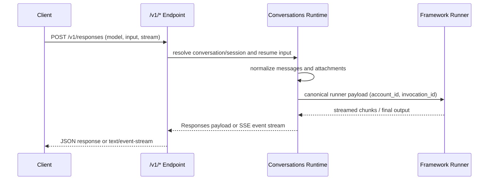

The local KsADK runtime exposes three OpenAI-compatible endpoints for development and
debugging. Use the term OpenAI-compatible only for public protocol shapes. Mark
SDK-specific fields as KsADK extensions.

<Callout type="warning" title="Auth: Bearer Token">
  The hosted runtime requires `Authorization: Bearer <token>`. The local dev server does
  not enforce auth by default, but the gateway injects and validates Bearer in production.
  Clients should always send it so local and hosted behavior stay consistent.
</Callout>

Start a local server before calling these endpoints:

```bash title="terminal"
agentengine run . --port 8080
```

## Endpoint Summary

| Endpoint | Method | Use |
| --- | --- | --- |
| `/v1/responses` | `POST` | Responses-style local agent calls (preferred) |
| `/v1/chat/completions` | `POST` | Chat Completions compatibility clients |
| `/v1/models` | `GET` | List the available model catalog |

`/v1/responses` is the recommended local runtime protocol; `/v1/chat/completions` targets
existing Chat clients; `/v1/models` returns the current model catalog (with `current` /
`source` local extensions).

## Request Lifecycle



## POST /v1/responses

`POST /v1/responses` is the preferred local runtime protocol. It supports non-streaming
JSON, streaming SSE, checkpoint resume, and approval payloads.

<Tabs>
<Tab value="Request">

Request body fields (based on the `ResponsesRequest` schema):

| Field | Type | Required | Notes |
| --- | --- | --- | --- |
| `input` | string \| object \| array | yes | string, message object, or input item list |
| `model` | string | no | model or agent name override; falls back to runtime default |
| `stream` | boolean | no | `true` returns SSE, default `false` |
| `instructions` | string | no | additional system-level instruction |
| `metadata` | object | no | caller metadata, preserved and passed through |
| `conversation` | string \| `{id}` | no | conversation id or object with `id` (preferred over `session_id`) |
| `previous_response_id` | string | no | previous response reference; mutually exclusive with `conversation` |
| `session_id` | string | no | legacy local session id; prefer `conversation` |
| `user` | string | no | caller/user identifier, default `user` |
| `safety_identifier` | string | no | safety identifier, falls back to user_id |
| `prompt_cache_key` | string | no | prompt cache key, written into metadata |
| `store` | boolean | no | whether to persist, written into metadata |
| `model_metadata` | object | no | KsADK extension: model capability hints |
| `model_options` | object | no | KsADK extension: provider-specific options passthrough |
| `account_id` | string | no | KsADK extension (0.6.5+): isolates Skill/Workspace/Sandbox/Memory by account |

<Callout type="warning" title="Field exclusivity">
  `conversation` and `session_id` must not disagree; `conversation` and
  `previous_response_id` are mutually exclusive. If both appear and target different
  sessions, the runtime returns `400`.
</Callout>

Minimal request:

```json title="request.json"
{
  "model": "my-agent",
  "input": "Explain what this agent can do.",
  "stream": false
}
```

With conversation and account_id:

```json title="request.json"
{
  "model": "my-agent",
  "conversation": {"id": "local-demo-session"},
  "input": "Continue from the previous answer.",
  "account_id": "acct_42",
  "stream": false
}
```

</Tab>
<Tab value="Response">

The non-streaming response returns OpenAI-compatible top-level fields plus a small number
of KsADK extensions:

| Field | Status | Notes |
| --- | --- | --- |
| `id` | compatible | response id generated by the runtime, e.g. `resp_<hex>` |
| `object` | compatible | `response` |
| `created_at` | compatible | creation timestamp |
| `status` | compatible | `completed` / `failed` / `incomplete` |
| `model` | compatible | model or agent used for the request |
| `output` | compatible | output item, usually an assistant message |
| `metadata` | compatible | caller metadata |
| `usage` | compatible-shaped | usage info when available |
| `output_text` | KsADK extension | convenient concatenated text |
| `session_id` | KsADK extension | local session id |

```json title="response.json"
{
  "id": "resp_a1b2c3",
  "object": "response",
  "created_at": 1719900000,
  "status": "completed",
  "model": "my-agent",
  "output": [
    {
      "type": "message",
      "role": "assistant",
      "content": [
        {"type": "output_text", "text": "This agent can..."}
      ]
    }
  ],
  "output_text": "This agent can...",
  "session_id": "local-demo-session"
}
```

Consumers aiming for broad compatibility should read `output` first and treat
`output_text` as a convenience field.

</Tab>
<Tab value="Stream">

With `stream: true` the runtime returns `text/event-stream`, serializing streamed chunks
as Responses-style SSE events.

```bash title="sse"
curl -N http://127.0.0.1:8080/v1/responses \
  -H 'Content-Type: application/json' \
  -d '{"model":"my-agent","input":"count to three","stream":true}'
```

Example SSE output (each `data:` line is one JSON object, blank line separates events):

```text title="responses.sse"
event: response.created
data: {"type":"response.created","response":{"id":"resp_a1b2c3","status":"in_progress"}}

event: response.output_text.delta
data: {"type":"response.output_text.delta","delta":"one"}

event: response.output_text.delta
data: {"type":"response.output_text.delta","delta":"two"}

event: response.completed
data: {"type":"response.completed","response":{"id":"resp_a1b2c3","status":"completed"}}
```

<Callout type="info" title="invocation_id passthrough (0.6.5+)">
  Pass a custom invocation id in `metadata.agentengine.invocation_id`; the runtime passes
  it through to the runner for transcript grouping and event resume. If omitted, the
  runtime generates one automatically.
</Callout>

</Tab>
<Tab value="Error">

Errors use standard HTTP status codes plus a JSON `detail`:

| Status | Scenario | detail example |
| --- | --- | --- |
| `400` | `conversation` conflicts with `session_id` | `Responses field 'conversation' conflicts with ksadk legacy field 'session_id'.` |
| `400` | `conversation` used with `previous_response_id` | `Responses fields 'conversation' and 'previous_response_id' cannot be used together.` |
| `400` | invalid `conversation` type | `Responses field 'conversation' must be a string or an object with an 'id'.` |
| `404` | checkpoint resume cannot find session/checkpoint | `Checkpoint not found` |
| `409` | checkpoint resume already running | `{"code":"resume_already_running",...}` |
| `500` | Runner not initialized or failed to load | `Runner 未初始化` |

```json title="error.json"
{
  "detail": "Responses field 'conversation' conflicts with ksadk legacy field 'session_id'. Use 'conversation' for OpenAI-compatible calls."
}
```

</Tab>
</Tabs>

### Input Items Shapes

`input` can be a string, a message object, or an array of input items. Multimodal examples
use OpenAI-compatible content block names:

```json title="multimodal.json"
{
  "model": "my-agent",
  "input": [
    {
      "role": "user",
      "content": [
        {"type": "input_text", "text": "Describe this image."},
        {"type": "input_image", "image_url": "data:image/png;base64,..."}
      ]
    }
  ]
}
```

File example:

```json title="file-input.json"
{
  "model": "my-agent",
  "input": [
    {
      "role": "user",
      "content": [
        {"type": "input_text", "text": "Summarize this file."},
        {
          "type": "input_file",
          "filename": "notes.txt",
          "file_data": "data:text/plain;base64,..."
        }
      ]
    }
  ]
}
```

Remote `file_url` values are preserved as references. KsADK does not document a public
guarantee that the local runtime will fetch arbitrary remote files for extraction. Use
`file_data` or a local upload reference when you need local attachment processing.

### Resume and Approval Inputs

The runtime recognizes common resume payloads in `input`, including function call output
and MCP approval:

```json title="function-call-output.json"
{
  "type": "function_call_output",
  "call_id": "call_123",
  "output": "approved result"
}
```

```json title="mcp-approval.json"
{
  "type": "mcp_approval_response",
  "approval_request_id": "approval_123",
  "approve": true,
  "reason": "Approved by local user"
}
```

These payloads are passed to framework adapters as resume input. Application code still
owns business-specific approval semantics.

<Steps>
  1. Put a resume payload (e.g. `function_call_output`) into the `input` of `/v1/responses`.
  2. The runtime calls `extract_responses_resume_input` to identify the resume type.
  3. For checkpoint resume, it locates by `session_id` + `run_id` + `checkpoint_id`.
  4. When found, it is converted to a runner resume input, skipping new-message normalization.
  5. The runner continues from the original checkpoint instead of restarting.
</Steps>

## POST /v1/chat/completions

`POST /v1/chat/completions` is the compatibility protocol for Chat Completions clients. It
supports streaming and non-streaming.

<Tabs>
<Tab value="Request">

Request body fields (based on the `ChatCompletionRequest` schema):

| Field | Type | Required | Notes |
| --- | --- | --- | --- |
| `messages` | array | yes | chat message list |
| `model` | string | no | model or agent name override |
| `stream` | boolean | no | `true` returns SSE, default `false` |
| `user` | string | no | caller/user identifier, default `user` |
| `temperature` | number | no | provider option, default `0.7` |
| `max_tokens` | integer | no | provider option |
| `session_id` | string | no | KsADK extension: local session id |
| `model_metadata` | object | no | KsADK extension: model capability hints |
| `model_options` | object | no | KsADK extension: provider-specific runtime options |
| `account_id` | string | no | KsADK extension (0.6.5+): isolates by account |

```json title="request.json"
{
  "model": "my-agent",
  "messages": [
    {"role": "user", "content": "Say hello from KsADK."}
  ],
  "stream": false,
  "account_id": "acct_42"
}
```

Multimodal Chat-style content blocks:

```json title="multimodal.json"
{
  "model": "my-agent",
  "messages": [
    {
      "role": "user",
      "content": [
        {"type": "text", "text": "What is in this image?"},
        {"type": "image_url", "image_url": {"url": "data:image/png;base64,..."}}
      ]
    }
  ]
}
```

</Tab>
<Tab value="Response">

The non-streaming response returns a Chat Completions-compatible shape:

```json title="response.json"
{
  "id": "chatcmpl-<uuid>",
  "object": "chat.completion",
  "created": 1719900000,
  "model": "my-agent",
  "choices": [
    {
      "index": 0,
      "message": {
        "role": "assistant",
        "content": "Hello from KsADK!"
      },
      "finish_reason": "stop"
    }
  ],
  "session_id": "<resolved-session-id>"
}
```

The runtime converts supported Chat Completions requests into the KsADK canonical runner
input.

</Tab>
<Tab value="Stream">

With `stream: true` the runtime returns `text/event-stream` using Chat Completions-style
chunks:

```bash title="sse"
curl -N http://127.0.0.1:8080/v1/chat/completions \
  -H 'Content-Type: application/json' \
  -d '{
    "model": "my-agent",
    "messages": [{"role": "user", "content": "count to three"}],
    "stream": true
  }'
```

```text title="chat.sse"
data: {"id":"chatcmpl-abc","object":"chat.completion.chunk","created":1719900000,"model":"my-agent","choices":[{"index":0,"delta":{"role":"assistant"},"finish_reason":null}]}

data: {"id":"chatcmpl-abc","object":"chat.completion.chunk","created":1719900000,"model":"my-agent","choices":[{"index":0,"delta":{"content":"one"},"finish_reason":null}]}

data: {"id":"chatcmpl-abc","object":"chat.completion.chunk","created":1719900000,"model":"my-agent","choices":[{"index":0,"delta":{"content":"two"},"finish_reason":null}]}

data: {"id":"chatcmpl-abc","object":"chat.completion.chunk","created":1719900000,"model":"my-agent","choices":[{"index":0,"delta":{},"finish_reason":"stop"}]}

data: [DONE]
```

</Tab>
<Tab value="Error">

| Status | Scenario | Notes |
| --- | --- | --- |
| `400` | `messages` missing or invalid | Pydantic validation failure |
| `500` | Runner not initialized or failed to load | `Runner 未初始化` |

```json title="error.json"
{
  "detail": "Runner 未初始化"
}
```

</Tab>
</Tabs>

## GET /v1/models

Lists the current available model catalog. The local runtime first fetches upstream
`/v1/models` from `OPENAI_BASE_URL` / `OPENAI_API_BASE`; on failure it falls back to a
single-item catalog from the local `MODEL_NAME`.

```bash title="terminal"
curl http://127.0.0.1:8080/v1/models
```

```json title="response.json"
{
  "object": "list",
  "data": [
    {"id": "deepseek-v3.2", "object": "model", "owned_by": "kspmas"}
  ],
  "current": "deepseek-v3.2",
  "source": "MODEL_NAME"
}
```

| Field | Notes |
| --- | --- |
| `object` | `list` |
| `data` | array of models, each with `id`, `object`, `owned_by` and other canonical metadata |
| `current` | KsADK extension: the currently effective model id |
| `source` | KsADK extension: source env var name (`OPENAI_MODEL_NAME` / `MODEL_NAME` / `COZE_MODEL_NAME`) |

## Streaming Event Reference

`/v1/responses` streaming event names follow the OpenAI Responses style:

| Event | Meaning |
| --- | --- |
| `response.created` | response object allocated |
| `response.in_progress` | model or agent execution started |
| `response.output_item.added` | output item started |
| `response.content_part.added` | message content part started |
| `response.output_text.delta` | text delta |
| `response.output_text.done` | text content completed |
| `response.reasoning.delta` | reasoning delta; not emitted when thinking is disabled |
| `response.function_call_arguments.delta` | function-call arguments delta |
| `response.function_call_arguments.done` | function-call arguments completed |
| `response.ksadk.tool_result` | KsADK tool result extension |
| `response.incomplete` | interrupted or waiting for approval/resume |
| `response.completed` | final successful response |
| `response.failed` | terminal error |

Clients should ignore unknown events they do not support, to remain forward-compatible
with new runner event types.

## KsADK Extension Fields

`model_metadata`, `model_options`, `account_id`, `session_id`, and `output_text` are
KsADK extensions and must not be described as official OpenAI fields.

<Callout type="info" title="account_id passthrough (0.6.5+)">
  `account_id` isolates Skill / Workspace / Sandbox / Memory by account boundary, written
  into the runtime `PlatformInvocationContext`. Supported by both `/v1/responses` and
  `/v1/chat/completions`.
</Callout>

<Callout type="info" title="invocation_id passthrough (0.6.5+)">
  Pass a custom invocation id in `metadata.agentengine.invocation_id`; the runtime passes
  it through to the runner for transcript grouping and event resume. If omitted, the
  runtime generates one automatically.
</Callout>

<Callout type="info" title="thinking-disable injection (0.6.7)">
  `model_options` passes provider-specific options through to supported runners. As of
  0.6.7, when thinking is disabled (`reasoning.effort=none`, `thinking.type=disabled`, or
  `max_reasoning_tokens<=0`), the runtime automatically injects `enable_thinking=false`
  and `chat_template_kwargs.enable_thinking=false` into `extra_body` (DeepSeek
  compatibility) and filters streaming reasoning output items.

  - CHAT-style `reasoning.effort` values: `low` / `medium` / `high` / `none`
  - Responses-style values: `none` / `minimal` / `low` / `medium` / `high` / `xhigh`

  The `response.reasoning.delta` event is not emitted when thinking is disabled (filtered
  by the runtime).
</Callout>

## Implementation Boundary

At runtime, protocol handlers normalize incoming requests into a common runner payload,
then call the active framework runner through a narrow interface:


The public contract is the endpoint behavior. Internal event names, session storage
details, and runner payload extensions may evolve across releases.
