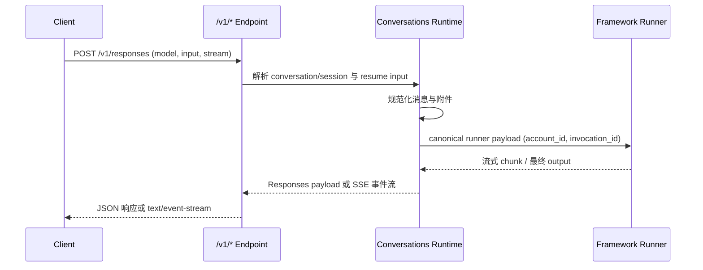

KsADK 本地运行时暴露三个 OpenAI 兼容 endpoint，供开发和调试使用。公开文档中只有
协议形态可以称为 OpenAI 兼容；SDK 特定字段要标记为 KsADK 扩展。

<Callout type="warning" title="鉴权:Bearer Token">
  托管运行时要求 `Authorization: Bearer <token>`。本地开发 server 默认不强制鉴权，但
  上线时由 gateway 注入并校验 Bearer。客户端应始终携带，避免本地与托管行为不一致。
</Callout>

调用前先启动本地 server：

```bash title="terminal"
agentengine run . --port 8080
```

## Endpoint 摘要

| Endpoint | 方法 | 用途 |
| --- | --- | --- |
| `/v1/responses` | `POST` | Responses 风格本地 Agent 调用（首选） |
| `/v1/chat/completions` | `POST` | Chat Completions 兼容客户端 |
| `/v1/models` | `GET` | 列出可用模型目录 |

`/v1/responses` 是推荐的本地运行时协议；`/v1/chat/completions` 面向既有 Chat 客户端；
`/v1/models` 返回当前 model catalog（含 `current`/`source` 本地扩展）。

## 请求生命周期



## POST /v1/responses

`POST /v1/responses` 是推荐的本地运行时协议。支持非流式 JSON、流式 SSE，以及
checkpoint resume 与 approval payload。

<Tabs>
<Tab value="Request">

请求体字段（基于 `ResponsesRequest` schema）：

| 字段 | 类型 | 必填 | 说明 |
| --- | --- | --- | --- |
| `input` | string \| object \| array | 是 | 字符串、message object 或 input item list |
| `model` | string | 否 | 模型或 Agent 名称覆盖；缺省取运行时默认 |
| `stream` | boolean | 否 | `true` 返回 SSE，默认 `false` |
| `instructions` | string | 否 | 附加系统级 instruction |
| `metadata` | object | 否 | 调用方 metadata，运行时会保留并透传 |
| `conversation` | string \| `{id}` | 否 | conversation id 或带 `id` 的对象（优先于 `session_id`） |
| `previous_response_id` | string | 否 | 上一响应引用；与 `conversation` 互斥 |
| `session_id` | string | 否 | 旧本地 session id；优先使用 `conversation` |
| `user` | string | 否 | 调用方/user 标识，缺省 `user` |
| `safety_identifier` | string | 否 | 安全标识，回退为 user_id |
| `prompt_cache_key` | string | 否 | prompt cache key，写入 metadata |
| `store` | boolean | 否 | 是否持久化，写入 metadata |
| `model_metadata` | object | 否 | KsADK 扩展：模型能力提示 |
| `model_options` | object | 否 | KsADK 扩展：provider 特定选项透传 |
| `account_id` | string | 否 | KsADK 扩展（0.6.5+）：按账号隔离 Skill/Workspace/Sandbox/Memory |

<Callout type="warning" title="字段互斥">
  `conversation` 与 `session_id` 不能冲突；`conversation` 与 `previous_response_id`
  互斥。同时出现且指向不同 session 时，运行时返回 `400`。
</Callout>

最小请求：

```json title="request.json"
{
  "model": "my-agent",
  "input": "Explain what this agent can do.",
  "stream": false
}
```

带 conversation 与 account_id：

```json title="request.json"
{
  "model": "my-agent",
  "conversation": {"id": "local-demo-session"},
  "input": "Continue from the previous answer.",
  "account_id": "acct_42",
  "stream": false
}
```

</Tab>
<Tab value="Response">

非流式响应返回 OpenAI 兼容顶层字段，加少量 KsADK 扩展：

| 字段 | 状态 | 说明 |
| --- | --- | --- |
| `id` | compatible | 运行时生成的 response id，形如 `resp_<hex>` |
| `object` | compatible | `response` |
| `created_at` | compatible | 创建时间 |
| `status` | compatible | `completed` / `failed` / `incomplete` |
| `model` | compatible | 本次请求使用的模型或 Agent |
| `output` | compatible | output item，通常是 assistant message |
| `metadata` | compatible | 调用方 metadata |
| `usage` | compatible-shaped | 可用时的 usage 信息 |
| `output_text` | KsADK 扩展 | 拼接后的便捷文本 |
| `session_id` | KsADK 扩展 | 本地 session id |

```json title="response.json"
{
  "id": "resp_a1b2c3",
  "object": "response",
  "created_at": 1719900000,
  "status": "completed",
  "model": "my-agent",
  "output": [
    {
      "type": "message",
      "role": "assistant",
      "content": [
        {"type": "output_text", "text": "This agent can..."}
      ]
    }
  ],
  "output_text": "This agent can...",
  "session_id": "local-demo-session"
}
```

追求广泛兼容的消费者应优先读取 `output`，把 `output_text` 视为便捷字段。

</Tab>
<Tab value="Stream">

`stream: true` 时返回 `text/event-stream`。运行时把流式 chunk 序列化为
Responses 风格 SSE 事件。

```bash title="sse"
curl -N http://127.0.0.1:8080/v1/responses \
  -H 'Content-Type: application/json' \
  -d '{"model":"my-agent","input":"count to three","stream":true}'
```

SSE 输出示例（每个 `data:` 一行 JSON，空行分隔）：

```text title="responses.sse"
event: response.created
data: {"type":"response.created","response":{"id":"resp_a1b2c3","status":"in_progress"}}

event: response.output_text.delta
data: {"type":"response.output_text.delta","delta":"one"}

event: response.output_text.delta
data: {"type":"response.output_text.delta","delta":"two"}

event: response.completed
data: {"type":"response.completed","response":{"id":"resp_a1b2c3","status":"completed"}}
```

<Callout type="info" title="invocation_id 透传(0.6.5+)">
  在 `metadata.agentengine.invocation_id` 中传入自定义 invocation id，运行时会原样
  透传给 runner，用于 transcript 分组与事件续订。未提供时运行时自动生成。
</Callout>

</Tab>
<Tab value="Error">

错误响应使用标准 HTTP 状态码 + JSON `detail`：

| 状态码 | 场景 | detail 示例 |
| --- | --- | --- |
| `400` | `conversation` 与 `session_id` 冲突 | `Responses field 'conversation' conflicts with ksadk legacy field 'session_id'.` |
| `400` | `conversation` 与 `previous_response_id` 同用 | `Responses fields 'conversation' and 'previous_response_id' cannot be used together.` |
| `400` | `conversation` 类型非法 | `Responses field 'conversation' must be a string or an object with an 'id'.` |
| `404` | checkpoint resume 找不到 session/checkpoint | `Checkpoint not found` |
| `409` | checkpoint resume 已在运行 | `{"code":"resume_already_running",...}` |
| `500` | Runner 未初始化或加载失败 | `Runner 未初始化` |

```json title="error.json"
{
  "detail": "Responses field 'conversation' conflicts with ksadk legacy field 'session_id'. Use 'conversation' for OpenAI-compatible calls."
}
```

</Tab>
</Tabs>

### Input Items 形态

`input` 可以是字符串、message object 或 input item 数组。多模态示例使用
OpenAI 兼容 content block：

```json title="multimodal.json"
{
  "model": "my-agent",
  "input": [
    {
      "role": "user",
      "content": [
        {"type": "input_text", "text": "Describe this image."},
        {"type": "input_image", "image_url": "data:image/png;base64,..."}
      ]
    }
  ]
}
```

文件示例：

```json title="file-input.json"
{
  "model": "my-agent",
  "input": [
    {
      "role": "user",
      "content": [
        {"type": "input_text", "text": "Summarize this file."},
        {
          "type": "input_file",
          "filename": "notes.txt",
          "file_data": "data:text/plain;base64,..."
        }
      ]
    }
  ]
}
```

远程 `file_url` 保留为引用。KsADK 不在公开文档中承诺本地运行时会为附件处理任意抓取
远程文件；需要本地附件处理时使用 `file_data` 或本地 upload reference。

### Resume 与审批输入

运行时识别 `input` 中常见 resume payload，包括 function call output 与 MCP 审批：

```json title="function-call-output.json"
{
  "type": "function_call_output",
  "call_id": "call_123",
  "output": "approved result"
}
```

```json title="mcp-approval.json"
{
  "type": "mcp_approval_response",
  "approval_request_id": "approval_123",
  "approve": true,
  "reason": "Approved by local user"
}
```

这些 payload 作为 resume input 传给框架 adapter。业务特定审批语义仍由应用代码负责。

<Steps>
  1. 在 `/v1/responses` 的 `input` 中放入 resume payload（如 `function_call_output`）。
  2. 运行时调用 `extract_responses_resume_input` 识别 resume 类型。
  3. 若为 checkpoint resume，运行时按 `session_id` + `run_id` + `checkpoint_id` 定位。
  4. 找到后转为 runner resume input，跳过新消息规范化。
  5. Runner 在原 checkpoint 上续跑，而非重新开始。
</Steps>

## POST /v1/chat/completions

`POST /v1/chat/completions` 兼容使用 Chat Completions 的客户端。支持流式与非流式。

<Tabs>
<Tab value="Request">

请求体字段（基于 `ChatCompletionRequest` schema）：

| 字段 | 类型 | 必填 | 说明 |
| --- | --- | --- | --- |
| `messages` | array | 是 | chat message list |
| `model` | string | 否 | 模型或 Agent 名称覆盖 |
| `stream` | boolean | 否 | `true` 返回 SSE，默认 `false` |
| `user` | string | 否 | 调用方/user 标识，缺省 `user` |
| `temperature` | number | 否 | provider 选项，默认 `0.7` |
| `max_tokens` | integer | 否 | provider 选项 |
| `session_id` | string | 否 | KsADK 扩展：本地 session id |
| `model_metadata` | object | 否 | KsADK 扩展：模型能力提示 |
| `model_options` | object | 否 | KsADK 扩展：provider 特定运行时选项 |
| `account_id` | string | 否 | KsADK 扩展（0.6.5+）：按账号隔离 |

```json title="request.json"
{
  "model": "my-agent",
  "messages": [
    {"role": "user", "content": "Say hello from KsADK."}
  ],
  "stream": false,
  "account_id": "acct_42"
}
```

多模态 Chat 风格 content block：

```json title="multimodal.json"
{
  "model": "my-agent",
  "messages": [
    {
      "role": "user",
      "content": [
        {"type": "text", "text": "What is in this image?"},
        {"type": "image_url", "image_url": {"url": "data:image/png;base64,..."}}
      ]
    }
  ]
}
```

</Tab>
<Tab value="Response">

非流式响应返回 Chat Completions 兼容形态：

```json title="response.json"
{
  "id": "chatcmpl-<uuid>",
  "object": "chat.completion",
  "created": 1719900000,
  "model": "my-agent",
  "choices": [
    {
      "index": 0,
      "message": {
        "role": "assistant",
        "content": "Hello from KsADK!"
      },
      "finish_reason": "stop"
    }
  ],
  "session_id": "<resolved-session-id>"
}
```

运行时把支持的 Chat Completions 请求转换为 KsADK canonical runner input。

</Tab>
<Tab value="Stream">

`stream: true` 时返回 `text/event-stream`，使用 Chat Completions 风格 chunk：

```bash title="sse"
curl -N http://127.0.0.1:8080/v1/chat/completions \
  -H 'Content-Type: application/json' \
  -d '{
    "model": "my-agent",
    "messages": [{"role": "user", "content": "count to three"}],
    "stream": true
  }'
```

```text title="chat.sse"
data: {"id":"chatcmpl-abc","object":"chat.completion.chunk","created":1719900000,"model":"my-agent","choices":[{"index":0,"delta":{"role":"assistant"},"finish_reason":null}]}

data: {"id":"chatcmpl-abc","object":"chat.completion.chunk","created":1719900000,"model":"my-agent","choices":[{"index":0,"delta":{"content":"one"},"finish_reason":null}]}

data: {"id":"chatcmpl-abc","object":"chat.completion.chunk","created":1719900000,"model":"my-agent","choices":[{"index":0,"delta":{"content":"two"},"finish_reason":null}]}

data: {"id":"chatcmpl-abc","object":"chat.completion.chunk","created":1719900000,"model":"my-agent","choices":[{"index":0,"delta":{},"finish_reason":"stop"}]}

data: [DONE]
```

</Tab>
<Tab value="Error">

| 状态码 | 场景 | 说明 |
| --- | --- | --- |
| `400` | `messages` 缺失或非法 | Pydantic 校验失败 |
| `500` | Runner 未初始化或加载失败 | `Runner 未初始化` |

```json title="error.json"
{
  "detail": "Runner 未初始化"
}
```

</Tab>
</Tabs>

## GET /v1/models

列出当前可用模型目录。本地运行时会优先从 `OPENAI_BASE_URL`/`OPENAI_API_BASE` 拉取上游
`/v1/models`，失败时回退到本地 `MODEL_NAME` 单项 catalog。

```bash title="terminal"
curl http://127.0.0.1:8080/v1/models
```

```json title="response.json"
{
  "object": "list",
  "data": [
    {"id": "deepseek-v3.2", "object": "model", "owned_by": "kspmas"}
  ],
  "current": "deepseek-v3.2",
  "source": "MODEL_NAME"
}
```

| 字段 | 说明 |
| --- | --- |
| `object` | `list` |
| `data` | 模型数组，每项含 `id`、`object`、`owned_by` 等 canonical metadata |
| `current` | KsADK 扩展：当前生效模型 id |
| `source` | KsADK 扩展：来源环境变量名（`OPENAI_MODEL_NAME` / `MODEL_NAME` / `COZE_MODEL_NAME`） |

## Streaming 事件参考

`/v1/responses` 流式事件名遵循 OpenAI Responses 风格：

| Event | 含义 |
| --- | --- |
| `response.created` | response object 已分配 |
| `response.in_progress` | 模型或 Agent 执行开始 |
| `response.output_item.added` | output item 开始 |
| `response.content_part.added` | message content part 开始 |
| `response.output_text.delta` | 文本 delta |
| `response.output_text.done` | 文本内容完成 |
| `response.reasoning.delta` | reasoning delta；thinking 禁用时不发出 |
| `response.function_call_arguments.delta` | function-call 参数 delta |
| `response.function_call_arguments.done` | function-call 参数完成 |
| `response.ksadk.tool_result` | KsADK tool result 扩展 |
| `response.incomplete` | 中断或等待审批/resume |
| `response.completed` | 最终成功响应 |
| `response.failed` | 终态错误 |

客户端应忽略自己不支持的未知事件，以便兼容未来 Runner 事件类型。

## KsADK 扩展字段

`model_metadata`、`model_options`、`account_id`、`session_id`、`output_text` 等是
KsADK 扩展，不应描述成 OpenAI 官方字段。

<Callout type="info" title="account_id 透传(0.6.5+)">
  `account_id` 按账号边界隔离 Skill / Workspace / Sandbox / Memory，写入运行时
  `PlatformInvocationContext`。`/v1/responses` 与 `/v1/chat/completions` 均支持。
</Callout>

<Callout type="info" title="invocation_id 透传(0.6.5+)">
  在 `metadata.agentengine.invocation_id` 中传入自定义 invocation id，运行时原样透传给
  runner，用于 transcript 分组与事件续订。未提供时运行时自动生成。
</Callout>

<Callout type="info" title="thinking 禁用注入(0.6.7)">
  `model_options` 透传 provider 特定选项。0.6.7 起，当 thinking 被禁用
  （`reasoning.effort=none`、`thinking.type=disabled` 或 `max_reasoning_tokens<=0`）时，
  runtime 自动向 `extra_body` 注入 `enable_thinking=false` 与
  `chat_template_kwargs.enable_thinking=false`（DeepSeek 兼容），并过滤流式 reasoning
  output item。

  - CHAT 风格 `reasoning.effort` 取值：`low` / `medium` / `high` / `none`
  - Responses 风格取值：`none` / `minimal` / `low` / `medium` / `high` / `xhigh`

  `response.reasoning.delta` 事件在 thinking 禁用时不发出（被运行时过滤）。
</Callout>

## 实现边界

运行时把协议处理器收到的请求规范化为统一 runner payload，再通过窄接口调用当前框架
Runner：


公开契约是 endpoint 行为。内部事件名、session 存储细节和 runner payload 扩展可能在
不同 release 中演进。
