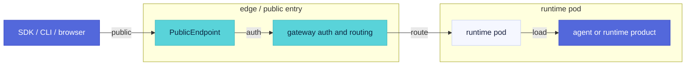

This reference describes the public-safe runtime API shape after an agent or
runtime product is deployed. The externally visible base URL is the hosted
`PublicEndpoint` returned by the control plane.

Use placeholders in public examples:

```text
https://<public-endpoint>
```

## Entry Model



The runtime pod may implement local routes, but public callers should treat the
gateway-facing `PublicEndpoint` routes as the contract.

## Authentication

| Client | Recommended authentication |
| --- | --- |
| SDK, CLI, automation | `Authorization: Bearer <api_key>` |
| Hosted browser session | `ae_ui_session` cookie created by the hosted link flow |
| Hermes terminal WebSocket | bearer auth plus `Sec-WebSocket-Protocol: ks-terminal.v1` |

External callers should not manufacture internal gateway headers such as
`X-Auth-Agent-Id`, `X-Auth-Account-Id`, or runtime-specific forwarded headers.

<Callout type="warning" title="Bearer Token Enforcement">
  The hosted runtime requires `Authorization: Bearer <token>`. The local dev
  server does not enforce auth by default, but in production the gateway injects
  and validates the Bearer token. Clients should always send it to keep local
  and hosted behavior consistent.
</Callout>

## Common Headers

| Header | Use |
| --- | --- |
| `Authorization: Bearer <api_key>` | API calls through the public endpoint |
| `Content-Type: application/json` | JSON requests |
| `Accept: application/json` | Non-streaming responses |
| `Accept: text/event-stream` | Streaming responses |

The `multipart/form-data` boundary for upload routes should be generated by the
HTTP client.

## Runtime Types

| Runtime | Primary public surface |
| --- | --- |
| Code-framework Agent | `/v1/responses`, `/v1/chat/completions`, workspace files, hosted UI actions |
| Hermes | dashboard, `/v1/*` proxy, terminal WebSocket, workspace files |
| OpenClaw | OpenClaw gateway plus KsADK workspace files |

## OpenAI-Compatible Routes

### `POST /v1/responses`

The entry point for Responses-compatible clients.

| Field | Meaning |
| --- | --- |
| `input` | User input string, or message/content array |
| `model` | Optional model override |
| `instructions` | Request-level system/developer instructions |
| `conversation` | Stable conversation id or `{ "id": "..." }` |
| `previous_response_id` | Continuation handle for compatible clients |
| `safety_identifier` | Stable end-user id, hash before sending |
| `stream` | `true` returns SSE |
| `metadata` | Runtime-reserved request metadata |

```bash
curl -sS https://<public-endpoint>/v1/responses \
  -H "Authorization: Bearer <api_key>" \
  -H "Content-Type: application/json" \
  -d '{"input":"hello","stream":false}'
```

### `POST /v1/chat/completions`

The entry point for Chat Completions-compatible clients.

```bash
curl -sS https://<public-endpoint>/v1/chat/completions \
  -H "Authorization: Bearer <api_key>" \
  -H "Content-Type: application/json" \
  -d '{"model":"my-model","messages":[{"role":"user","content":"hello"}]}'
```

Responses and Chat Completions keep their own protocol semantics at the public
boundary. KsADK normalizes both into runner input before invoking framework code.

## Hosted UI Actions

The hosted UI uses action-style routes to manage sessions, events, uploads,
workspace files, cancellation, and model listing. Public API clients should
prefer the OpenAI-compatible `/v1/*` routes and only target action routes when
integrating the hosted UI surface directly.

All action paths live under `POST /agentengine/api/v1/*` (download surfaces are
`GET`) and return a unified action envelope:

```json title="envelope.json"
{
  "Code": 0,
  "Message": "Success",
  "RequestId": "req_abc123",
  "Action": "RunAgent",
  "Data": { /* action-specific payload */ }
}
```

| Group | Purpose | Actions |
| --- | --- | --- |
| Sessions | Create, get, list, delete sessions | `CreateSession`, `GetSession`, `ListSessions`, `DeleteSession` |
| Runs | Invoke or cancel a run, subscribe to events | `RunAgent`, `SubscribeRunEvents`, `CancelRun` |
| Events | List historical session events | `ListSessionEvents` |
| Files | Upload, download attachments, workspace files, export archive | `UploadFile`, `AttachmentContent`, `ListWorkspaceFiles`, `AddWorkspaceFile`, `DeleteWorkspaceFile`, `GetWorkspaceFileContent`, `ExportWorkspaceZip` |
| Models | List the available model catalog | `ListAgentModels` |
| UI Bootstrap | Bootstrap metadata for UI rendering and capability discovery | `GetAgentUiBootstrap` |

<Callout type="info" title="New in 0.6.7">
  checkpoint/resume and `GetAgentUiBootstrap` capability visibility are governed
  by the `RuntimeCapabilities` and `RunLifecycle` returned by bootstrap. Public
  API clients usually do not target these action routes directly; prefer the
  OpenAI-compatible `/v1/*`.
</Callout>

### Sessions

<Steps>
1. **Probe capabilities**: call `GetAgentUiBootstrap` first to check `Capabilities.WorkspaceFiles`, `Capabilities.ResumeRun`, etc.
2. **Create a session**: `CreateSession`, take `Session.SessionId`.
3. **Pull history**: `ListSessions` / `ListSessionEvents` to render the sidebar and timeline.
4. **Start a run**: `RunAgent` (foreground or background), subscribe to progress via `SubscribeRunEvents`.
5. **Reclaim a session**: `DeleteSession` to release persisted records.
</Steps>

#### CreateSession

Creates (or reuses) a session. When `SessionId` is omitted, the runtime generates one.

<Tabs>
<Tab value="Request">

`POST /agentengine/api/v1/CreateSession`, JSON body:

| Field | Type | Required | Notes |
| --- | --- | --- | --- |
| `AgentId` | string | yes | Target agent id |
| `UserId` | string | no | Defaults to `user` |
| `SessionId` | string | no | Reuse an existing session; runtime generates one when omitted |

```json title="request.json"
{
  "AgentId": "my-agent",
  "UserId": "user",
  "SessionId": "local-demo-session"
}
```

</Tab>
<Tab value="Response">

```json title="response.json"
{
  "Code": 0,
  "Message": "Success",
  "RequestId": "req_abc123",
  "Action": "CreateSession",
  "Data": {
    "Session": {
      "SessionId": "local-demo-session",
      "AgentId": "my-agent",
      "UserId": "user",
      "Title": "New session",
      "TitleSource": "fallback_first_prompt",
      "Summary": null,
      "FirstPrompt": "",
      "LastPrompt": "",
      "ActiveInvocationId": "",
      "ActiveRunStatus": "",
      "State": {},
      "CreatedAt": 1719900000.0,
      "UpdatedAt": 1719900000.0,
      "Version": 1
    }
  }
}
```

`Session` payload fields:

| Field | Notes |
| --- | --- |
| `SessionId` / `AgentId` / `UserId` | Session primary key triple |
| `Title` / `TitleSource` | Session title and its source (`fallback_first_prompt`, `heuristic`, etc.) |
| `Summary` | Runtime-maintained session summary |
| `FirstPrompt` / `LastPrompt` | Truncated first/last user message preview |
| `ActiveInvocationId` / `ActiveRunStatus` | Active run invocation and status for this session |
| `State` | Session state dict (sanitized) |
| `CreatedAt` / `UpdatedAt` / `Version` | Timestamps and version |
| `Continuity` | Optional: continuity info from the runner adapter |

</Tab>
<Tab value="Error">

| Status | Scenario | detail |
| --- | --- | --- |
| `400` | Missing `AgentId` | Pydantic validation failure |
| `503` | Session backend unavailable | `{"code":"session_backend_unavailable","message":...}` |

</Tab>
</Tabs>

#### ListSessions

Paginated list of sessions for an Agent/User, page-based pagination.

<Tabs>
<Tab value="Request">

`POST /agentengine/api/v1/ListSessions`:

| Field | Type | Required | Notes |
| --- | --- | --- | --- |
| `AgentId` | string | yes | Target agent id |
| `UserId` | string | no | Defaults to `user` |
| `Page` | int | no | 1-based, default `1`, min `1` |
| `PageSize` | int | no | Default `20`, range `1..200` |

```json title="request.json"
{
  "AgentId": "my-agent",
  "UserId": "user",
  "Page": 1,
  "PageSize": 20
}
```

</Tab>
<Tab value="Response">

```json title="response.json"
{
  "Code": 0,
  "Message": "Success",
  "RequestId": "req_abc123",
  "Action": "ListSessions",
  "Data": {
    "Sessions": [ /* Session payload, same as CreateSession */ ],
    "Total": 42,
    "Page": 1,
    "PageSize": 20
  }
}
```

Pagination fields:

| Field | Notes |
| --- | --- |
| `Total` | Total session count for this Agent/User |
| `Page` / `PageSize` | Current page and page size (echoed back) |

The runtime computes offset as `(Page - 1) * PageSize`.

</Tab>
</Tabs>

#### GetSession

Fetch a single session with its latest events.

<Tabs>
<Tab value="Request">

`POST /agentengine/api/v1/GetSession`:

| Field | Type | Required | Notes |
| --- | --- | --- | --- |
| `SessionId` | string | yes | Target session id |

```json title="request.json"
{ "SessionId": "local-demo-session" }
```

</Tab>
<Tab value="Response">

```json title="response.json"
{
  "Code": 0,
  "Message": "Success",
  "RequestId": "req_abc123",
  "Action": "GetSession",
  "Data": {
    "Session": { /* same Session payload as CreateSession */ }
  }
}
```

</Tab>
<Tab value="Error">

| Status | Scenario | detail |
| --- | --- | --- |
| `404` | Session not found | `Session not found` |

</Tab>
</Tabs>

#### DeleteSession

Delete a session and cancel any detached stream still running for it.

<Tabs>
<Tab value="Request">

`POST /agentengine/api/v1/DeleteSession`:

| Field | Type | Required | Notes |
| --- | --- | --- | --- |
| `SessionId` | string | yes | Target session id |

```json title="request.json"
{ "SessionId": "local-demo-session" }
```

</Tab>
<Tab value="Response">

```json title="response.json"
{
  "Code": 0,
  "Message": "Success",
  "RequestId": "req_abc123",
  "Action": "DeleteSession",
  "Data": { "Deleted": true }
}
```

<Callout type="info" title="Side Effect">
  Before deletion, the runtime cancels detached background streams for that
  session to avoid dangling `in_progress` run_status events.
</Callout>

</Tab>
<Tab value="Error">

| Status | Scenario | detail |
| --- | --- | --- |
| `404` | Session not found | `Session not found` |

</Tab>
</Tabs>

### Runs

#### RunAgent

Invoke an agent for one conversation turn. Supports foreground sync, foreground
streaming, and background execution modes.

<Tabs>
<Tab value="Request">

`POST /agentengine/api/v1/RunAgent`, JSON body (based on `RunAgentActionRequest`):

| Field | Type | Required | Notes |
| --- | --- | --- | --- |
| `AgentId` | string | yes | Target agent id |
| `Messages` | array | no | Message array (Chat Completions style); mutually exclusive with `ResponsesInput` |
| `ResponsesInput` | any | no | Responses-style input; mutually exclusive with `Messages` |
| `UserId` | string | no | Defaults to `user` |
| `AccountId` | string | no | 0.6.5+ account-scoped id, passed through to the runner |
| `SessionId` | string | no | Associated session; runtime creates one when omitted |
| `InvocationId` | string | no | Caller-provided invocation id; runtime generates one when omitted |
| `ApiFormat` | string | no | `responses` (default) or `chat_completions` |
| `Stream` | bool | no | `true` returns SSE; default `false` |
| `Background` | bool | no | 0.6.5+ `true` returns a job handle immediately, runs in background, progress via `SubscribeRunEvents`; default `false` |
| `Model` | string | no | Model or agent name override |
| `ModelMetadata` | object | no | Model metadata, including reasoning / multimodal / context_window_tokens |
| `ModelOptions` | object | no | Request-level model options (temperature, max_tokens, etc.) passed through to the runner |
| `PreviousResponseId` | string | no | Responses continuation handle; written into request metadata |

Foreground sync call:

```json title="request.json"
{
  "AgentId": "my-agent",
  "Messages": [{"role": "user", "content": "hello"}],
  "ApiFormat": "responses",
  "Stream": false
}
```

Background execution:

```json title="background.json"
{
  "AgentId": "my-agent",
  "Messages": [{"role": "user", "content": "summarize the workspace"}],
  "Background": true,
  "InvocationId": "inv_demo_001",
  "AccountId": "acct_42",
  "Model": "glm-5.1",
  "ModelMetadata": {"reasoning": true, "multimodal": false, "context_window_tokens": 128000},
  "ModelOptions": {"temperature": 0.2, "max_tokens": 4096}
}
```

<Callout type="warning" title="Background and Stream are mutually exclusive">
  `Background: true` ignores `Stream` and returns a job handle immediately. A
  foreground `Stream: true` returns SSE. The two cannot be enabled together.
</Callout>

</Tab>
<Tab value="Response">

**Foreground sync** (`Background: false`, `Stream: false`) returns a Responses or
Chat Completions payload wrapped in the action envelope:

```json title="response.json"
{
  "Code": 0,
  "Message": "Success",
  "RequestId": "req_abc123",
  "Action": "RunAgent",
  "Data": {
    "id": "resp_a1b2c3",
    "object": "response",
    "status": "completed",
    "model": "glm-5.1",
    "output": [{"type": "message", "role": "assistant", "content": [{"type": "output_text", "text": "..."}]}],
    "output_text": "...",
    "session_id": "local-demo-session"
  }
}
```

**Background execution** (`Background: true`) returns a job handle immediately:

```json title="background-response.json"
{
  "Code": 0,
  "Message": "Success",
  "RequestId": "req_abc123",
  "Action": "RunAgent",
  "Data": {
    "InvocationId": "inv_demo_001",
    "Status": "running",
    "Background": true,
    "SubscribeUrl": "/agentengine/api/v1/SubscribeRunEvents?SessionId=local-demo-session&InvocationId=inv_demo_001"
  }
}
```

Background response fields:

| Field | Notes |
| --- | --- |
| `InvocationId` | Run invocation id, used for subscribe and cancel |
| `Status` | `running` means the background task is ready |
| `Background` | Always `true` |
| `SubscribeUrl` | Relative path; prepend the host to use as the SSE subscribe entry |

</Tab>
<Tab value="Stream">

Foreground `Stream: true` returns `text/event-stream`; events are normalized by
the runtime before delivery:

```bash title="sse"
curl -N https://<public-endpoint>/agentengine/api/v1/RunAgent \
  -H "Authorization: Bearer <api_key>" \
  -H "Content-Type: application/json" \
  -d '{"AgentId":"my-agent","Messages":[{"role":"user","content":"count to three"}],"Stream":true}'
```

Clients should handle text deltas, tool events, errors, and completion events.

</Tab>
<Tab value="Error">

| Status | Scenario | detail |
| --- | --- | --- |
| `400` | Both `Messages` and `ResponsesInput`, or neither | Pydantic / runtime validation failure |
| `409` | A resume for this session is already running | `{"code":"resume_already_running",...}` |
| `500` | Runner not initialized or load failure | `Runner 未初始化` |

</Tab>
</Tabs>

<Callout type="info" title="0.6.5+ pass-through fields">
  `AccountId`, `InvocationId`, `ModelMetadata`, and `ModelOptions` are passed
  through to the runner unchanged, enabling per-account isolation of
  Skill/Workspace/Sandbox/Memory and request-level model overrides. When
  `AccountId` is omitted, the runner falls back to the runtime default account.
</Callout>

#### SubscribeRunEvents

Subscribe to run events for an invocation via SSE. Supports a 5-minute reconnect
window.

<Tabs>
<Tab value="Request">

`GET /agentengine/api/v1/SubscribeRunEvents`, parameters via query string:

| Param | Type | Required | Notes |
| --- | --- | --- | --- |
| `SessionId` | string | yes | Target session id |
| `InvocationId` | string | yes | Target run invocation id |
| `AfterSeqId` | int | no | Only emit events with `SeqId > AfterSeqId`; default `0` |

```text title="subscribe-url"
/agentengine/api/v1/SubscribeRunEvents?SessionId=local-demo-session&InvocationId=inv_demo_001&AfterSeqId=12
```

</Tab>
<Tab value="Stream">

`Accept: text/event-stream`. Each event is `data: <json>\n\n`; on terminal status
the stream emits `data: [DONE]\n\n` and closes:

```text title="events.sse"
data: {"EventId":"evt_1","SessionId":"local-demo-session","InvocationId":"inv_demo_001","EventType":"run_status","Content":{"status":"in_progress"},"SeqId":13,"Timestamp":1719900001.0}

data: {"EventId":"evt_2","EventType":"tool_result","Content":{...},"SeqId":14,...}

data: {"EventId":"evt_3","EventType":"run_status","Content":{"status":"completed"},"SeqId":15,...}

data: [DONE]
```

Event payload fields:

| Field | Notes |
| --- | --- |
| `EventId` / `SessionId` | Event and its session |
| `InvocationId` | Associated run invocation id |
| `Author` | Event author (agent or user) |
| `EventType` | Event type (`run_status`, `tool_result`, `run_checkpoint`, etc.) |
| `Content` | Event content dict |
| `Timestamp` | Event timestamp |
| `SeqId` | Monotonic per-session sequence number, used for resumption |
| `Metadata` | Event metadata |

<Callout type="info" title="5-minute reconnect window">
  A streaming connection has a maximum lifetime of 5 minutes
  (`deadline = now + 5min`). When the deadline is reached the connection closes
  silently and does **not** emit `[DONE]`. Clients should record the largest
  `SeqId` consumed and pass it as `AfterSeqId` on the next reconnect; as long as
  the run has not reached a terminal status, reconnecting continues to deliver
  subsequent events.
</Callout>

Terminal statuses (any one triggers `[DONE]`):

| status | Meaning |
| --- | --- |
| `completed` | Normal completion |
| `failed` / `error` | Failure |
| `cancelled` / `canceled` | Cancelled |
| `aborted` | Aborted |
| `interrupted` | Interrupted |

</Tab>
<Tab value="Error">

| Status | Scenario | detail |
| --- | --- | --- |
| `400` | Missing `SessionId` or `InvocationId` | `SessionId and InvocationId are required` |

</Tab>
</Tabs>

#### CancelRun

Request cancellation of an in-flight run (both detached stream and runner channel).

<Tabs>
<Tab value="Request">

`POST /agentengine/api/v1/CancelRun`:

| Field | Type | Required | Notes |
| --- | --- | --- | --- |
| `AgentId` | string | no | Target agent id (not currently enforced) |
| `InvocationId` | string | yes | Run invocation id to cancel |

```json title="request.json"
{ "AgentId": "my-agent", "InvocationId": "inv_demo_001" }
```

</Tab>
<Tab value="Response">

```json title="response.json"
{
  "Code": 0,
  "Message": "Success",
  "RequestId": "req_abc123",
  "Action": "CancelRun",
  "Data": {
    "Cancelled": true,
    "Found": true,
    "Status": "cancelling",
    "RunnerCancelStatus": "accepted"
  }
}
```

| Field | Notes |
| --- | --- |
| `Cancelled` | Whether cancellation was initiated (true if either detached stream or runner accepted) |
| `Found` | Whether a detached stream was located |
| `Status` | Aggregated status: `cancelling` / `not_found` / `unsupported` / `error` |
| `RunnerCancelStatus` | Runner-side result: `accepted` / `cancelling` / `cancelled` / `not_found` / `unsupported` / `error` |

</Tab>
</Tabs>

### Events

#### ListSessionEvents

Paginated list of historical events for a session, offset-based pagination.

<Tabs>
<Tab value="Request">

`POST /agentengine/api/v1/ListSessionEvents`:

| Field | Type | Required | Notes |
| --- | --- | --- | --- |
| `SessionId` | string | yes | Target session id |
| `Offset` | int | no | 0-based offset, default `0` |
| `Limit` | int | no | Page size, min `1` |

```json title="request.json"
{ "SessionId": "local-demo-session", "Offset": 0, "Limit": 50 }
```

</Tab>
<Tab value="Response">

```json title="response.json"
{
  "Code": 0,
  "Message": "Success",
  "RequestId": "req_abc123",
  "Action": "ListSessionEvents",
  "Data": {
    "Events": [ /* event payload, same as SubscribeRunEvents */ ],
    "Total": 128,
    "Offset": 0,
    "Limit": 50
  }
}
```

Pagination fields:

| Field | Notes |
| --- | --- |
| `Total` | Total event count for this session |
| `Offset` | Current offset (defaults to `0`) |
| `Limit` | Current page size (falls back to the returned count when not sent) |

</Tab>
</Tabs>

### Files

#### UploadFile

Upload an attachment and return an `ae-upload://` handle for use by RunAgent /
AttachmentContent.

<Tabs>
<Tab value="Request">

`POST /agentengine/api/v1/UploadFile`, `multipart/form-data`:

| Field | Type | Required | Notes |
| --- | --- | --- | --- |
| `file` | binary | yes | Upload file content |

```bash title="upload"
curl -sS https://<public-endpoint>/agentengine/api/v1/UploadFile \
  -H "Authorization: Bearer <api_key>" \
  -F "file=@report.pdf"
```

</Tab>
<Tab value="Response">

```json title="response.json"
{
  "Code": 0,
  "Message": "Success",
  "RequestId": "req_abc123",
  "Action": "UploadFile",
  "Data": {
    "FileData": {
      "fileUri": "ae-upload://abc123_report.pdf",
      "displayName": "report.pdf",
      "mimeType": "application/pdf",
      "sizeBytes": 204800
    }
  }
}
```

</Tab>
</Tabs>

#### AttachmentContent

Read the bytes of an uploaded attachment by its `ae-upload://` handle, returning
the original content-type.

<Tabs>
<Tab value="Request">

`GET /agentengine/api/v1/AttachmentContent?FileUri=...`:

| Param | Type | Required | Notes |
| --- | --- | --- | --- |
| `FileUri` | string | yes | `fileUri` returned by `UploadFile` |

```text title="download-url"
/agentengine/api/v1/AttachmentContent?FileUri=ae-upload://abc123_report.pdf
```

</Tab>
<Tab value="Response">

```text title="binary"
HTTP/1.1 200 OK
Content-Type: application/pdf
Content-Disposition: inline; filename="report.pdf"

<binary bytes>
```

<Callout type="info" title="Prefix Resolution">
  Paths with the `ae-upload://` prefix resolve to hosted upload content and return
  its byte stream; paths without that prefix are treated as workspace-relative
  paths.
</Callout>

</Tab>
<Tab value="Error">

| Status | Scenario | detail |
| --- | --- | --- |
| `404` | Attachment not found | `Attachment not found` |

</Tab>
</Tabs>

#### ListWorkspaceFiles

List workspace file entries (proxied to `/_ksadk/workspace/v1/entries`).

<Tabs>
<Tab value="Request">

`POST /agentengine/api/v1/ListWorkspaceFiles`:

| Field | Type | Required | Notes |
| --- | --- | --- | --- |
| `AgentId` | string | no | Target agent id (not currently enforced) |
| `Path` | string | no | Workspace-relative path, default `.` |
| `Recursive` | bool | no | Recurse into subdirectories, default `false` |

```json title="request.json"
{ "Path": ".", "Recursive": true }
```

</Tab>
<Tab value="Response">

```json title="response.json"
{
  "Code": 0,
  "Message": "Success",
  "RequestId": "req_abc123",
  "Action": "ListWorkspaceFiles",
  "Data": {
    "Entries": [
      { "Path": "notes/todo.md", "Type": "file" },
      { "Path": "notes/", "Type": "dir" }
    ]
  }
}
```

</Tab>
</Tabs>

#### AddWorkspaceFile

Add or overwrite a workspace file (proxied to `/_ksadk/workspace/v1/files/<path>`).

<Tabs>
<Tab value="Request">

`POST /agentengine/api/v1/AddWorkspaceFile`, `multipart/form-data`:

| Field | Type | Required | Notes |
| --- | --- | --- | --- |
| `file` | binary | yes | Upload file content |
| `Path` | string | yes | Workspace-relative path |
| `AgentId` | string | no | Target agent id (not currently enforced) |

```bash title="upload"
curl -sS https://<public-endpoint>/agentengine/api/v1/AddWorkspaceFile \
  -H "Authorization: Bearer <api_key>" \
  -F "Path=notes/todo.md" \
  -F "file=@todo.md"
```

</Tab>
<Tab value="Response">

```json title="response.json"
{
  "Code": 0,
  "Message": "Success",
  "RequestId": "req_abc123",
  "Action": "AddWorkspaceFile",
  "Data": { "Path": "notes/todo.md", "Size": 128 }
}
```

</Tab>
</Tabs>

#### DeleteWorkspaceFile

Delete a workspace file (proxied to `/_ksadk/workspace/v1/files/<path>`).

<Tabs>
<Tab value="Request">

`POST /agentengine/api/v1/DeleteWorkspaceFile`:

| Field | Type | Required | Notes |
| --- | --- | --- | --- |
| `AgentId` | string | no | Target agent id (not currently enforced) |
| `Path` | string | yes | Workspace-relative path |

```json title="request.json"
{ "Path": "notes/old.md" }
```

</Tab>
<Tab value="Response">

```json title="response.json"
{
  "Code": 0,
  "Message": "Success",
  "RequestId": "req_abc123",
  "Action": "DeleteWorkspaceFile",
  "Data": { "Deleted": true }
}
```

</Tab>
</Tabs>

#### GetWorkspaceFileContent

Read workspace file content, returning the original content-type and disposition.

<Tabs>
<Tab value="Request">

`GET /agentengine/api/v1/GetWorkspaceFileContent?FilePath=...`:

| Param | Type | Required | Notes |
| --- | --- | --- | --- |
| `FilePath` | string | yes | Workspace-relative path |
| `AgentId` | string | no | Target agent id (not currently enforced) |

```text title="download-url"
/agentengine/api/v1/GetWorkspaceFileContent?FilePath=notes/todo.md
```

</Tab>
<Tab value="Response">

```text title="binary"
HTTP/1.1 200 OK
Content-Type: text/markdown
Content-Disposition: inline; filename="todo.md"

<file bytes>
```

HTML files are returned with an injected preview CSP so they can be embedded in
the hosted UI preview pane.

</Tab>
</Tabs>

#### ExportWorkspaceZip

Package the workspace (or a subdirectory) as a zip download.

<Tabs>
<Tab value="Request">

`GET /agentengine/api/v1/ExportWorkspaceZip`:

| Param | Type | Required | Notes |
| --- | --- | --- | --- |
| `Path` | string | no | Workspace-relative directory, default `.` |
| `AgentId` | string | no | Target agent id (not currently enforced) |

```text title="download-url"
/agentengine/api/v1/ExportWorkspaceZip?Path=.
```

</Tab>
<Tab value="Response">

```text title="binary"
HTTP/1.1 200 OK
Content-Type: application/zip
Content-Disposition: attachment; filename="workspace.zip"

<zip bytes>
```

The filename is derived from `Path`: `workspace.zip` for the root, or
`workspace-<dir-with-dashes>.zip` for a subdirectory. Symlinks and out-of-tree
paths are skipped so the archive only contains regular files under the workspace
root.

</Tab>
</Tabs>

### Models

#### ListAgentModels

List the available model catalog, including the current model and its source.

<Tabs>
<Tab value="Request">

`POST /agentengine/api/v1/ListAgentModels`:

| Field | Type | Required | Notes |
| --- | --- | --- | --- |
| `AgentId` | string | no | Target agent id (not currently used) |
| `Name` | string | no | Model name filter (not currently used) |

```json title="request.json"
{}
```

</Tab>
<Tab value="Response">

```json title="response.json"
{
  "Code": 0,
  "Message": "Success",
  "RequestId": "req_abc123",
  "Action": "ListAgentModels",
  "Data": {
    "Models": [
      {
        "id": "glm-5.1",
        "display_name": "glm-5.1",
        "context_window_tokens": 128000,
        "max_output_tokens": 32000,
        "capabilities": {
          "multimodal_input_image": true,
          "multimodal_input_video": false,
          "multimodal_input_file": false
        },
        "limits": {
          "context_window_tokens": 128000,
          "max_input_tokens": 128000,
          "max_output_tokens": 32000,
          "max_reasoning_tokens": 8192,
          "rpm": 600,
          "tpm": 200000
        },
        "pricing": {},
        "auto_compact_threshold_tokens": 102400,
        "auto_compact_threshold_percentage": 0.8
      }
    ],
    "Current": "glm-5.1",
    "Source": "OPENAI_MODEL_NAME"
  }
}
```

`Models` element fields (normalized by `normalize_model_metadata`):

| Field | Notes |
| --- | --- |
| `id` / `display_name` | Model id and display name |
| `context_window_tokens` / `max_output_tokens` / `max_input_tokens` / `max_reasoning_tokens` | Token context limits |
| `capabilities` | Capability set, including `multimodal_input_image/video/file` |
| `limits` | Normalized limits dict (rpm / tpm, etc.) |
| `pricing` | Pricing dict |
| `auto_compact_threshold_tokens` / `_percentage` | Auto-compact thresholds |

`Current` is the runtime's current model, and `Source` names the source env var
(`OPENAI_MODEL_NAME` / `MODEL_NAME` / `COZE_MODEL_NAME`). The OpenAI-compatible
`GET /v1/models` returns the same data with a different top-level envelope.

</Tab>
</Tabs>

### UI Bootstrap

#### GetAgentUiBootstrap

Returns the bootstrap metadata needed by the hosted UI for rendering and
capability discovery. This is the first call the hosted UI makes on startup.

<Tabs>
<Tab value="Request">

`POST /agentengine/api/v1/GetAgentUiBootstrap`:

| Field | Type | Required | Notes |
| --- | --- | --- | --- |
| `AgentId` | string | no | Target agent id; defaults to the runtime agent name |
| `SessionId` | string | no | Associated session (echoed back in the response) |

```json title="request.json"
{ "AgentId": "my-agent", "SessionId": "local-demo-session" }
```

</Tab>
<Tab value="Response">

```json title="response.json"
{
  "Code": 0,
  "Message": "Success",
  "RequestId": "req_abc123",
  "Action": "GetAgentUiBootstrap",
  "Data": {
    "Agent": {
      "AgentId": "my-agent",
      "Name": "my-agent",
      "Description": "demo agent",
      "Framework": "langgraph"
    },
    "Modules": ["Chat", "Build", "Deploy"],
    "Capabilities": {
      "Attachments": true,
      "WorkspaceFiles": true,
      "Approval": true,
      "Thinking": true,
      "StopRun": true,
      "ResumeRun": true,
      "RuntimeCapabilities": { /* runner.get_runtime_capabilities() echoed verbatim */ },
      "CheckpointResumeCapability": {
        "Supported": true,
        "Checkpoint": {},
        "ResumeRun": {}
      },
      "RunLifecycle": {
        "Enabled": true,
        "Resume": true,
        "Abort": true,
        "Checkpoints": true,
        "CheckpointResume": true,
        "CheckpointResumePreview": true
      },
      "MCP": false,
      "HostedRuntime": false,
      "NativeTerminal": { "Enabled": false, "Mode": null, "Protocol": "ks-terminal.v1", "Path": null },
      "BuiltinTools": []
    },
    "WorkspaceFiles": { "Enabled": true },
    "AccessMode": "Owner",
    "SharePermissions": { "Interactive": true, "DefaultPath": "/chat", "SharePath": "/chat" },
    "CustomUI": {
      "Enabled": false,
      "Profile": null,
      "Path": null,
      "Url": null,
      "BundlePath": null
    },
    "ApiFormats": ["responses", "chat_completions"],
    "Stream": true,
    "SessionId": "local-demo-session",
    "SessionBackend": "memory",
    "HostedRuntime": null,
    "Model": { "id": "glm-5.1", "source": "OPENAI_MODEL_NAME", /* ... */ }
  }
}
```

Top-level `Data` fields:

| Field | Notes |
| --- | --- |
| `Agent` | Agent id / name / description / framework (from detection_result) |
| `Modules` | UI module list |
| `Capabilities` | Runtime capability set, see table below |
| `WorkspaceFiles` | Workspace files bootstrap |
| `AccessMode` | Access mode, always `Owner` |
| `SharePermissions` | Sharing and default paths |
| `CustomUI` | Custom UI resource info (0.6.7 normalized) |
| `ApiFormats` | Supported API shapes: `responses`, `chat_completions` |
| `Stream` | Whether streaming is supported |
| `SessionBackend` | Session backend description (memory / postgres, etc.) |
| `Model` | Current model metadata |

`Capabilities` sub-fields:

| Field | Notes |
| --- | --- |
| `Attachments` / `WorkspaceFiles` | Attachment and workspace files capabilities |
| `Approval` / `Thinking` / `StopRun` / `ResumeRun` | Run-control capabilities |
| `RuntimeCapabilities` | Capability set returned verbatim by the runner (includes `Checkpoint`, `ResumeRun`, etc.) |
| `CheckpointResumeCapability` | 0.6.7 normalized: `Supported` + `Checkpoint` + `ResumeRun` detail |
| `RunLifecycle` | 0.6.7 normalized: run lifecycle semantics (`Resume`, `Abort`, `Checkpoints`, `CheckpointResume`, `CheckpointResumePreview`) |
| `MCP` / `HostedRuntime` | Platform capability flags, currently fixed `false` |
| `NativeTerminal` | Terminal capability (`Enabled` / `Mode` / `Protocol` / `Path`) |
| `BuiltinTools` | Builtin tool descriptions |

`CustomUI` sub-fields (0.6.7):

| Field | Notes |
| --- | --- |
| `Enabled` | Whether custom UI is enabled |
| `Profile` | UI profile name |
| `Path` / `Url` | Custom UI path or external URL |
| `BundlePath` | Custom UI bundle path |

<Callout type="info" title="0.6.7 capability visibility">
  `CheckpointResumeCapability` and `RunLifecycle` are 0.6.7-normalized
  capability descriptors. Callers should use these to decide whether
  checkpoint/resume is available; if `Supported` is `false` or
  `RunLifecycle.CheckpointResume` is `false`, treat checkpoint/resume as
  unsupported.
</Callout>

</Tab>
</Tabs>

## Checkpoint and Resume Actions

<Callout type="info" title="New in 0.6.7">
  The four action paths below are allow-listed by the gateway Hosted UI filter,
  `POST /agentengine/api/v1/*`. Public API clients usually do not target these
  directly; prefer `/v1/*`.
</Callout>

| Action | Method and path | Purpose |
| --- | --- | --- |
| `ListSessionCheckpoints` | `POST /agentengine/api/v1/ListSessionCheckpoints` | List checkpoints under a session for resume selection |
| `GetCheckpointResumePreview` | `POST /agentengine/api/v1/GetCheckpointResumePreview` | Preview the content and impact of resuming from a checkpoint |
| `ResumeRun` | `POST /agentengine/api/v1/ResumeRun` | Resume a run from a checkpoint |
| `CancelRun` | `POST /agentengine/api/v1/CancelRun` | Cancel an in-flight run |

Capability visibility is governed by the `RunLifecycle` and `RuntimeCapabilities`
(including `CheckpointResumeCapability`) returned by `GetAgentUiBootstrap`. If
bootstrap does not declare the capability, callers should treat checkpoint/resume
as unsupported.

### ListSessionCheckpoints

`POST /agentengine/api/v1/ListSessionCheckpoints`:

| Field | Type | Required | Notes |
| --- | --- | --- | --- |
| `AgentId` / `SessionId` | string | yes | Session location |
| `RunId` | string | no | Filter by run |
| `Framework` | string | no | Filter by framework |
| `OnlyResumable` | bool | no | Only return resumable checkpoints, default `false` |
| `Offset` / `Limit` | int | no | Pagination, `Limit` range `1..500` |

Returns a `Checkpoints` array; each element includes `RunId`, `CheckpointId`,
`Framework`, `FrameworkRef`, `IsResumable`, `ResumeStatus`, `IsTerminal`,
`CheckpointStatus`, `Backend`, `Scope`, `Durable`, `ResumeCount`,
`ReplayAllowed`, and `ExpiresAt`.

### GetCheckpointResumePreview

`POST /agentengine/api/v1/GetCheckpointResumePreview`:

| Field | Type | Required | Notes |
| --- | --- | --- | --- |
| `AgentId` / `SessionId` | string | yes | Session location |
| `RunId` / `CheckpointId` | string | yes | Checkpoint location |

Returns `Preview` containing `Checkpoint`, `Capabilities`, `CanResume`, `Reason`,
`NextNode`, `ExpectedAction`, `ToolReceipts`, `Risk` (with `Level` and side-effect
counts), and `Summary`.

### ResumeRun

`POST /agentengine/api/v1/ResumeRun`:

| Field | Type | Required | Notes |
| --- | --- | --- | --- |
| `AgentId` / `SessionId` | string | yes | Session location |
| `RunId` / `CheckpointId` | string | yes | Checkpoint location |
| `ResumeAttemptId` | string | no | Resume attempt id; runtime generates one when omitted |
| `InvocationId` | string | no | Invocation id passed through to the runner |
| `Stream` | bool | no | `true` returns SSE |
| `Model` / `ModelMetadata` / `ModelOptions` | string / object | no | Model parameter pass-through |
| `ResumeInstructionEnabled` | bool | no | 0.6.7 Whether to allow injecting a resume instruction |
| `ResumeInstruction` | string | no | 0.6.7 resume instruction text |

A terminal checkpoint returns `status: "noop"` rather than `409` to avoid
blocking the UI. A non-terminal but non-resumable checkpoint returns `409`.

## GetAgentUiBootstrap

`GetAgentUiBootstrap` returns the bootstrap metadata for hosted UI rendering and
capability discovery; the field table is in the [UI Bootstrap](#getagentuibootstrap)
section above.

## Pagination Fields

`ListSessions` and `ListSessionEvents` support pagination but use different
field names:

| Endpoint | Field group | Fields |
| --- | --- | --- |
| `ListSessions` | page-based | `Page`, `PageSize`, `Total` |
| `ListSessionEvents` | offset-based | `Offset`, `Limit`, `Total` |
| `ListSessionCheckpoints` | offset-based | `Offset`, `Limit`, `Total` |

When resolving an `ae-upload://` attachment, `AttachmentContent` uses the
`ae-upload://` prefix to locate hosted upload content and returns its byte
stream; paths without that prefix are treated as workspace-relative paths.

## RunAgent Pass-through Fields

`RunAgent` (hosted UI action) passes request-level model parameters through to
the runner, just like `/v1/responses` and `/v1/chat/completions`:

| Field | Meaning |
| --- | --- |
| `ModelMetadata` | Model metadata, including `reasoning`, `multimodal`, `context_window_tokens` |
| `ModelOptions` | Request-level model options (temperature, max_tokens, etc.) |

`ModelMetadata.reasoning` flags reasoning mode, `multimodal` flags multimodal
capability, and `context_window_tokens` flags the model context window size.

## Workspace Files

Code-framework runtimes, and runtime products that enable the KsADK workspace
surface, can all use the workspace routes.

- List files.
- Get file content or metadata.
- Add or update a file.
- Delete a file when allowed.
- Export a workspace archive when supported.

The hosted UI download surfaces typically include:

- `GET /agentengine/api/v1/AttachmentContent`
- `GET /agentengine/api/v1/GetWorkspaceFileContent`
- `GET /agentengine/api/v1/ExportWorkspaceZip`

All paths must be relative to the workspace root. Public examples must not
expose host absolute paths.

## Hermes-Specific Boundary

Hermes wraps its own dashboard and API server. The public docs only describe
these surfaces:

| Surface | Purpose |
| --- | --- |
| `/` | Hermes dashboard |
| `/v1/*` | Hermes API proxy surface |
| `/_ksadk/workspace/v1/*` | KsADK workspace files |
| `/_ksadk/terminal/ws` | terminal WebSocket |

Terminal clients must use:

```text
Sec-WebSocket-Protocol: ks-terminal.v1
```

## OpenClaw-Specific Boundary

The upstream OpenClaw gateway owns its native routes. KsADK public docs only
commit to the platform-supplemented contract:

| Surface | Purpose |
| --- | --- |
| OpenClaw gateway root | OpenClaw native UI and API |
| `/_ksadk/workspace/v1/*` | KsADK workspace files |
| health route | Gateway liveness exposed by the runtime product |

Do not write every upstream OpenClaw native endpoint as a KsADK contract unless
it is implemented or stabilized by KsADK.

## Streaming Output

Streaming calls use SSE:

```text
Accept: text/event-stream
```

Clients should handle text deltas, tool events, errors, and completion events.
LangGraph and ADK internal events may differ, but public clients should consume
the runtime-normalized stream.

## Public Doc Rules

Public examples must not include private endpoint hostnames, real API keys,
gateway tokens, cookies, kdocs tokens, internal forwarded headers, kubeconfig
paths, cluster names, private image registries, customer data, session ids, or
workspace paths.
