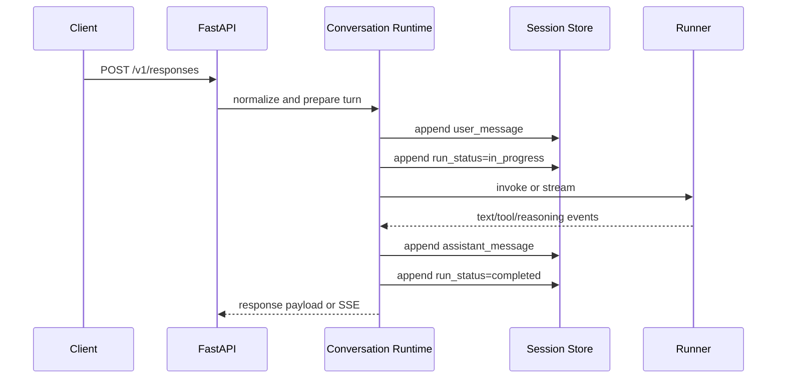
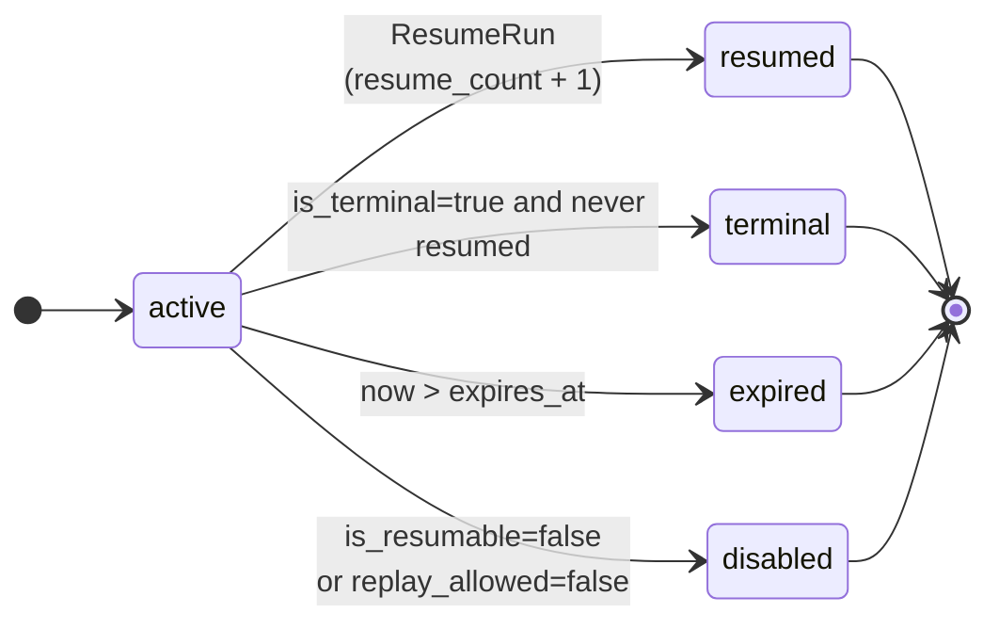
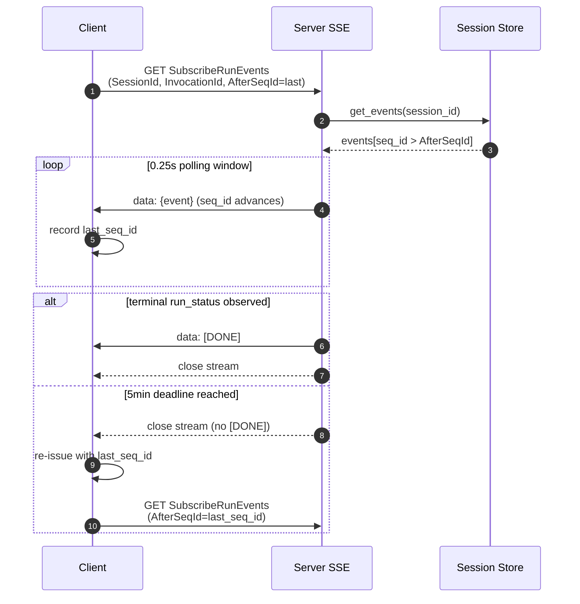

The local KsADK runtime provides more than request forwarding. It also manages
session IDs, run events, feedback records, uploads, and workspace file previews
for the local Web UI.

## Runtime Surfaces

| Surface | Audience | Examples |
| --- | --- | --- |
| OpenAI-compatible API | external clients | `/v1/responses`, `/v1/chat/completions` |
| Local Web UI API | bundled browser UI | `/agentengine/api/v1/RunAgent`, session and file actions |
| ADK Web compatibility | legacy local UI flows | `/run_sse`, `/list-apps` |

Public clients should prefer the OpenAI-compatible API unless they are
integrating directly with the KsADK local UI.

## Request Lifecycle

For local Responses calls, the runtime follows a stable sequence:

1. normalize the input into messages, content blocks, and attachments.
2. create or load the session.
3. append the user message and `run_status=in_progress`.
4. build `PlatformInvocationContext`.
5. call the framework runner.
6. append assistant, tool, reasoning, approval, or error events.
7. append a terminal `run_status`.



The same conversation runtime is shared by `/v1/responses`,
`/v1/chat/completions`, and the local Web UI run action. Protocol endpoints
mainly decide input and output shape; they do not define separate business
execution models.

## Sessions

Responses calls can use `conversation`:

```json
{
  "model": "my-agent",
  "conversation": {"id": "local-session-1"},
  "input": "Continue this conversation",
  "stream": false
}
```

Older local clients may use `session_id`:

```json
{
  "model": "my-agent",
  "session_id": "local-session-1",
  "input": "Continue this conversation",
  "stream": false
}
```

Use one style consistently. If both are present and disagree, the local runtime
rejects the request.

When PostgreSQL is configured, it is a durable session replica rather than an
availability prerequisite for agent execution. If a connection or write fails,
the runtime continues with its in-process live session and emits one structured
error with `session_backend_state=degraded`. A degraded session stays local for
the rest of that process so it cannot jump back to stale PostgreSQL history.
Events that were not persisted during the outage are not guaranteed to survive
a pod restart or relocation.

### Readable PostgreSQL View

KsADK creates `ksadk_session_events_readable` alongside the raw PostgreSQL
tables. The raw `content_json` and `metadata_json` values remain available, while
the view exposes flattened `message_role`, `message_text`, `tool_name`,
`lifecycle_status`, and `created_at` columns for operators:

```sql
SELECT
  session_id,
  seq_id,
  message_role,
  event_type,
  message_text,
  tool_name,
  lifecycle_status,
  created_at
FROM ksadk_session_events_readable
WHERE namespace = 'default' AND session_id = '<session-id>'
ORDER BY seq_id;
```

Reasoning deltas are still streamed to clients in real time, but they are
persisted as one aggregated `reasoning` event per turn. Lifecycle events remain
separate and can be inspected through `lifecycle_status`.

### Account Boundary

Hosted deployments pass `account_id` through the request chain. It is injected by
the gateway, not manufactured by the business agent. Sessions, attachments, and
workspace files are isolated per `account_id`; the local runtime isolates per
owner and never shares session, attachment, or workspace state across
`account_id` boundaries.

## Web UI Sessions

`agentengine web` sets local UI state under the project directory unless another
session backend is configured:

```text
.agentengine/ui/sessions.sqlite
```

That file is local runtime state, not source. Delete it to reset local browser
sessions.

## Run Events

The session store records run facts as events. Typical event types include:

| Event type | Meaning |
| --- | --- |
| `user_message` | normalized user input was accepted |
| `run_status` | lifecycle marker such as `in_progress`, `completed`, `failed`, or `interrupted` |
| `assistant_message` | final assistant output for the turn |
| `tool_call` | tool call emitted by the runner |
| `tool_result` | result returned from a tool |
| `reasoning` | provider or runner reasoning signal when available |
| `approval_request` | run paused for user approval |

Clients should treat terminal `run_status` events as the end of a turn. Text
output alone does not prove the run is complete.

## Session And Event Pagination

<Callout type="info" title="Added in 0.6.7">
  The hosted UI list actions expose explicit pagination fields.
</Callout>

### ListSessions

Request fields:

| Field | Default | Constraint | Meaning |
| --- | --- | --- | --- |
| `AgentId` | — | required | target agent id |
| `UserId` | `user` | optional | user-scoped isolation |
| `Page` | `1` | `>=1` | page number, 1-based |
| `PageSize` | `20` | `1..200` | page size, capped at 200 |

Response `Data` fields:

| Field | Meaning |
| --- | --- |
| `Sessions` | session list on the current page |
| `Total` | total number of matching sessions |
| `Page` | current page number |
| `PageSize` | current page size |

```bash
curl -sS -X POST https://<public-endpoint>/agentengine/api/v1/ListSessions \
  -H "Authorization: Bearer <api_key>" \
  -H "Content-Type: application/json" \
  -d '{"AgentId":"my-agent","UserId":"user","Page":1,"PageSize":20}'
```

### ListSessionEvents

Request fields:

| Field | Default | Constraint | Meaning |
| --- | --- | --- | --- |
| `SessionId` | — | required | target session id |
| `Offset` | `0` | `>=0` | event offset |
| `Limit` | unset | `>=1` | max number of events returned; when unset, all events are returned |

Response `Data` fields:

| Field | Meaning |
| --- | --- |
| `Events` | event list on the current page |
| `Total` | total number of events in the session |
| `Offset` | current offset |
| `Limit` | the limit value in effect |

```bash
curl -sS -X POST https://<public-endpoint>/agentengine/api/v1/ListSessionEvents \
  -H "Authorization: Bearer <api_key>" \
  -H "Content-Type: application/json" \
  -d '{"SessionId":"<sid>","Offset":0,"Limit":50}'
```

Public API clients should still prefer the OpenAI-compatible `/v1/*` routes unless
they integrate the hosted UI list surface directly.

## Event Projection

The runtime does not send every stored event back to the model verbatim. It uses
the event log as the source of truth, then projects a model-facing history from
transcript events:

| Stored event | Enters model history | Projection |
| --- | --- | --- |
| `user_message` | yes | user message text |
| `assistant_message` | yes | assistant/model message text |
| `tool_call` | yes | model-side tool call summary |
| `tool_result` | yes | user-side tool result summary |
| `approval_request` | yes | model-side approval request summary |
| `approval_response` | yes | user-side approval result summary |
| `attachment_ref` | yes | user-side attachment reference |
| `run_status` | no | lifecycle marker only |
| `reasoning` | no | UI/debug signal only |
| `context_checkpoint` | yes | compacted summary checkpoint |

This split is deliberate. The event log remains auditable and replayable, while
the runner sees a compact model history that excludes control events such as
`run_status`.

## Context Compaction

Long conversations can be compacted without overwriting the event log. The
runtime appends a compaction boundary and a context checkpoint that records the
summary and the event sequence range it covers. Later history projection keeps
the checkpoint summary and the uncompressed tail events.


This means deleting local UI state is the right way to reset a development
session, but compaction itself should not be treated as data deletion.

## Session Backends

The session backend is configurable. The public local defaults are designed for
development, while shared hosted deployments should use an explicitly reviewed
shared backend.

| Backend | Typical use | Notes |
| --- | --- | --- |
| `memory` | tests and temporary runs | process-local and lost on exit |
| `local` | local Web UI and CLI development | SQLite file under the project UI directory by default |
| `postgres` | shared or multi-replica deployments | requires DSN and deployment review |

Useful environment variables:

| Variable | Purpose |
| --- | --- |
| `KSADK_SESSION_BACKEND` | selects `memory`, `local`, or `postgres` |
| `AGENTENGINE_SESSION_BACKEND` | compatibility alias for backend selection |
| `KSADK_SESSION_DSN` | shared backend DSN, for example PostgreSQL |
| `KSADK_STM_PATH` | local session database path |
| `KSADK_STM_DB_PATH` | compatibility alias for local session database path |

Do not commit local session databases. They can contain prompts, extracted
attachment text, local paths, tool events, and user feedback.

## File And Image Inputs

The Web UI can upload files and images into the local runtime. Public protocol
examples should prefer Responses-style item names:

```json
{
  "type": "input_image",
  "image_url": "data:image/png;base64,..."
}
```

```json
{
  "type": "input_file",
  "filename": "notes.txt",
  "file_data": "data:text/plain;base64,..."
}
```

Framework adapters receive normalized runner input. Applications should still
validate file type, size, and trust boundaries before processing content.

## Workspace Files

The local UI can expose workspace file operations for preview and debugging.
Treat workspace content as local developer data:

- do not include customer data in public docs.
- do not publish uploaded files from local runs.
- avoid screenshots that reveal private paths, tokens, or code.
- keep generated archives out of Git unless explicitly reviewed.

## Streaming, Disconnects, And Reconnects

The local Web UI run action has a reconnect-oriented design. In Responses stream
mode, the server can continue consuming the runner stream after the browser
disconnects, then persist the final run events to the session store. A client
that reconnects should use the session id, invocation id, and last consumed
sequence id to subscribe to later run events.


Public API clients using `/v1/responses` should still implement normal SSE
error handling and retry behavior. The Web UI reconnect path is a KsADK local UI
capability, not a promise that every HTTP client can resume an original TCP
connection.

## Checkpoint, Resume, Cancel

<Callout type="info" title="Added in 0.6.7">
  KsADK introduces framework-level checkpoint/resume, covering list, preview,
  resume, and cancel actions, with new fields such as `ResumeInstruction` and
  `CheckpointStatus`. The implementation is backed by persisted `run_checkpoint`
  / `run_resume` / `tool_result` events and supports cross-instance recovery.
</Callout>

The runtime exposes five hosted UI actions for run-level checkpoint, resume,
cancel, and tool receipts. Every action is `POST /agentengine/api/v1/<Action>`
with a JSON body, and the response is a uniform
`{ Code, Message, RequestId, Action, Data }` envelope.

| Action | Path | Purpose |
| --- | --- | --- |
| `ListSessionCheckpoints` | `POST /agentengine/api/v1/ListSessionCheckpoints` | list checkpoints under a session for resume selection |
| `GetCheckpointResumePreview` | `POST /agentengine/api/v1/GetCheckpointResumePreview` | preview the content and impact of resuming from a checkpoint |
| `ResumeRun` | `POST /agentengine/api/v1/ResumeRun` | resume run execution from a checkpoint |
| `CancelRun` | `POST /agentengine/api/v1/CancelRun` | cancel an in-progress run (keyed by `InvocationId`) |
| `ListToolReceipts` | `POST /agentengine/api/v1/ListToolReceipts` | list tool-call receipts under a run / checkpoint |

<Callout type="warning" title="Auth and boundaries">
  Local `agentengine web` isolates per owner by default. Hosted deployments must
  send `Authorization: Bearer <api_key>`, and `account_id` is injected by the
  gateway — the business agent must never forge it. Session, checkpoint, and
  tool receipt state is never visible across `account_id` boundaries.
</Callout>

### Checkpoint State Machine

Each checkpoint returned by `ListSessionCheckpoints` or
`GetCheckpointResumePreview` carries a `CheckpointStatus`, derived at read time
from `is_terminal`, `is_resumable`, `resume_count`, `expires_at`, and
`replay_allowed`. The runtime does not persist this field; it is computed on read:



| State | Trigger |
| --- | --- |
| `active` | default; the checkpoint can still be resumed |
| `resumed` | already resumed by `ResumeRun` (`resume_count >= 1`, not terminal) |
| `terminal` | `is_terminal=true` and `resume_count=0`; the run reached a terminal state |
| `expired` | `expires_at` has passed; `IsResumable` forced to false |
| `disabled` | `is_resumable=false`, or `replay_allowed=false` after a prior resume |

<Callout type="info">
  `CheckpointStatus` is derived at read time, not persisted on the event;
  `resume_count` and `last_resumed_at` come from `run_resume` event audit.
  `GetCheckpointResumePreview` is only required before resume when
  `ResumeStatus=unknown`.
</Callout>

### Checkpoint Descriptor Fields

Each checkpoint is a projection of a `run_checkpoint` event. Beyond the common
event fields, it carries the following resume descriptor fields
(all added/aligned in 0.6.7):

| Field | Type | Meaning |
| --- | --- | --- |
| `EventId` | str | checkpoint event id |
| `SessionId` | str | owning session id |
| `InvocationId` | str | invocation that produced the checkpoint |
| `RunId` | str | owning run id |
| `CheckpointId` | str | checkpoint id (referenced when resuming) |
| `Framework` | str | framework that produced the checkpoint, e.g. `langgraph`, `adk` |
| `FrameworkRef` | dict | framework-specific reference, e.g. LangGraph `next_node` |
| `Phase` | str | checkpoint phase label |
| `NextNode` | str | next node to continue from after resume |
| `IsResumable` | bool or null | whether resume is allowed; forced `false` when disabled |
| `ResumeStatus` | str | `resumable` / `disabled` / `unknown` |
| `IsTerminal` | bool | whether this is a terminal checkpoint |
| `ResumeDisabledReason` | str | human-readable reason when not resumable |
| `Backend` | str | checkpoint storage backend, e.g. `memory`, `langgraph_store` |
| `Scope` | str | checkpoint scope, e.g. `process_local` |
| `Durable` | bool | whether it is persisted (recoverable across instances) |
| `ArtifactPreview` | dict | checkpoint artifact preview |
| `StageKey` / `StageName` / `StageIndex` / `TotalStages` | various | multi-stage run information |
| `CreatedAt` | str | checkpoint event timestamp |
| `LastResumedAt` | str or null | timestamp of the most recent resume, from `run_resume` audit |
| `ResumeCount` | int | number of resumes so far, from `run_resume` audit; `0` means never resumed |
| `ReplayAllowed` | bool | policy flag for whether the same checkpoint may be resumed again; defaults to `true` |
| `ExpiresAt` | str or null | checkpoint expiry; once passed, `IsResumable` is forced `false` |
| `CheckpointStatus` | str | read-time-derived state: `active` / `resumed` / `terminal` / `expired` / `disabled` |
| `Metadata` | dict | raw checkpoint event metadata, including the raw values above |

<Callout type="warning" title="In-process checkpoints are not recoverable">
  When `Backend == "memory"` or `Scope == "process_local"`, `IsResumable` is
  forced `false` with the reason "进程内 checkpoint 不能跨实例恢复". Such
  checkpoints are only valid for in-process preview during local development —
  do not treat them as recoverable resume points.
</Callout>

### ListSessionCheckpoints

List checkpoints under a session, optionally filtered by `RunId` or `Framework`,
with pagination.

<Tabs>
<Tab value="Request">

| Field | Default | Constraint | Meaning |
| --- | --- | --- | --- |
| `AgentId` | — | required | target agent id; must match the session's `agent_id` |
| `SessionId` | — | required | target session id |
| `RunId` | — | optional | only return checkpoints for this run |
| `Framework` | — | optional | only return checkpoints for this framework, e.g. `langgraph` |
| `OnlyResumable` | `false` | optional | only return checkpoints with `IsResumable=true` |
| `Offset` | `0` | `>=0` | pagination offset |
| `Limit` | unset | `1..500` | page size, capped at 500 |

```bash title="list_checkpoints.sh"
curl -sS -X POST "https://<public-endpoint>/agentengine/api/v1/ListSessionCheckpoints" \
  -H "Authorization: Bearer <api_key>" \
  -H "Content-Type: application/json" \
  -d '{
    "AgentId": "my-agent",
    "SessionId": "<sid>",
    "OnlyResumable": true,
    "Limit": 50
  }'
```

</Tab>
<Tab value="Response">

```json title="list_checkpoints_response.json"
{
  "Code": 0,
  "Message": "Success",
  "RequestId": "req-abc123",
  "Action": "ListSessionCheckpoints",
  "Data": {
    "Checkpoints": [
      {
        "EventId": "evt_001",
        "SessionId": "<sid>",
        "InvocationId": "inv_xyz",
        "RunId": "run_001",
        "CheckpointId": "ckpt_002",
        "Framework": "langgraph",
        "IsResumable": true,
        "ResumeStatus": "resumable",
        "IsTerminal": false,
        "ResumeDisabledReason": "",
        "NextNode": "research_summarize",
        "Backend": "langgraph_store",
        "Scope": "session",
        "Durable": true,
        "LastResumedAt": null,
        "ResumeCount": 0,
        "ReplayAllowed": true,
        "ExpiresAt": "2026-07-04T12:00:00Z",
        "CheckpointStatus": "active"
      }
    ],
    "Total": 1,
    "Offset": 0,
    "Limit": 50
  }
}
```

</Tab>
<Tab value="Error">

| HTTP | detail.code | Trigger |
| --- | --- | --- |
| `404` | — | session not found, or `AgentId` does not match the session's `agent_id` |

</Tab>
</Tabs>

### GetCheckpointResumePreview

Preview the impact of resuming from a checkpoint: tool receipts, side-effect
risk level, and whether a preview is required before resume.

<Tabs>
<Tab value="Request">

| Field | Constraint | Meaning |
| --- | --- | --- |
| `AgentId` | required | target agent id |
| `SessionId` | required | target session id |
| `RunId` | required | target run id |
| `CheckpointId` | required | checkpoint id to preview |

```bash title="get_resume_preview.sh"
curl -sS -X POST "https://<public-endpoint>/agentengine/api/v1/GetCheckpointResumePreview" \
  -H "Authorization: Bearer <api_key>" \
  -H "Content-Type: application/json" \
  -d '{
    "AgentId": "my-agent",
    "SessionId": "<sid>",
    "RunId": "run_001",
    "CheckpointId": "ckpt_002"
  }'
```

</Tab>
<Tab value="Response">

```json title="resume_preview_response.json"
{
  "Code": 0,
  "Message": "Success",
  "RequestId": "req_def456",
  "Action": "GetCheckpointResumePreview",
  "Data": {
    "Preview": {
      "Checkpoint": { "CheckpointId": "ckpt_002", "IsResumable": true },
      "Capabilities": {
        "Checkpoints": true,
        "CheckpointResume": true,
        "ToolReceipts": true,
        "IdempotentToolReplay": true
      },
      "CanResume": true,
      "Reason": "",
      "NextNode": "research_summarize",
      "ExpectedAction": "resume_from_checkpoint",
      "ToolReceipts": [
        {
          "ReceiptId": "rcpt_001",
          "ToolName": "write_workspace_file",
          "ToolCallId": "call_01",
          "RunId": "run_001",
          "CheckpointId": "ckpt_001",
          "Status": "succeeded",
          "Replayed": false
        }
      ],
      "Risk": {
        "Level": "medium",
        "DuplicateSideEffectRisk": true,
        "SideEffectReceiptCount": 1,
        "FailedReceiptCount": 0
      },
      "Summary": {
        "RunId": "run_001",
        "CheckpointId": "ckpt_002",
        "Phase": "after_research",
        "ToolReceiptCount": 1
      }
    }
  }
}
```

`ExpectedAction` values: `resume_from_checkpoint` (safe to resume directly),
`preview_required` (`ResumeStatus=unknown`, a preview must be fetched first),
`disabled` (not resumable).

`Risk.Level` values:

| Level | Trigger |
| --- | --- |
| `low` | no side-effect tool receipts and no failed receipts |
| `medium` | at least one side-effect tool receipt (`write_workspace_file`, etc.) |
| `high` | at least one receipt with `Status=failed` |

</Tab>
<Tab value="Error">

| HTTP | detail | Trigger |
| --- | --- | --- |
| `404` | `"Session not found"` | session not found or `AgentId` mismatch |
| `404` | `"Checkpoint not found"` | the `RunId` + `CheckpointId` pair does not exist |

</Tab>
</Tabs>

### ResumeRun

Resume run execution from a checkpoint. In 0.6.7 the
`ResumeInstructionEnabled` / `ResumeInstruction` fields were added so an extra
instruction can be injected on resume, and `409` error codes distinguish
non-resumable checkpoints from duplicate resumes.

<Tabs>
<Tab value="Request">

| Field | Default | Constraint | Meaning |
| --- | --- | --- | --- |
| `AgentId` | — | required | target agent id; must match the session's `agent_id` |
| `SessionId` | — | required | target session id |
| `RunId` | — | required | run id to resume |
| `CheckpointId` | — | required | checkpoint id to resume from |
| `ResumeAttemptId` | — | optional | resume attempt id; defaults to `resume_<hex>` generated by the runtime |
| `InvocationId` | — | optional | new invocation id; defaults to `ResumeAttemptId` |
| `Stream` | `false` | optional | `true` returns an SSE stream (same shape as RunAgent stream) |
| `Model` | — | optional | model override for this resume |
| `ModelMetadata` | — | optional | model capability hints (0.6.7) |
| `ModelOptions` | — | optional | provider-specific options |
| `ResumeInstructionEnabled` | `false` | optional | 0.6.7; whether to inject a resume instruction |
| `ResumeInstruction` | — | optional | 0.6.7; extra instruction text to inject on resume |

```bash title="resume_run.sh"
curl -sS -X POST "https://<public-endpoint>/agentengine/api/v1/ResumeRun" \
  -H "Authorization: Bearer <api_key>" \
  -H "Content-Type: application/json" \
  -d '{
    "AgentId": "my-agent",
    "SessionId": "<sid>",
    "RunId": "run_001",
    "CheckpointId": "ckpt_002",
    "ResumeInstructionEnabled": true,
    "ResumeInstruction": "redo the summary in a more concise tone",
    "Stream": false
  }'
```

</Tab>
<Tab value="Response">

In non-stream mode a Responses-style payload is returned:

```json title="resume_run_response.json"
{
  "Code": 0,
  "Message": "Success",
  "RequestId": "req_ghi789",
  "Action": "ResumeRun",
  "Data": {
    "id": "resp_<hex>",
    "object": "response",
    "model": "my-agent",
    "output": [
      { "type": "message", "role": "assistant", "content": [{ "type": "output_text", "text": "..." }] }
    ]
  }
}
```

Resuming a terminal checkpoint is a no-op: the runtime appends a `run_resume`
plus a `run_status=completed` event and returns `status=noop` without executing:

```json title="resume_run_noop.json"
{
  "Code": 0,
  "Action": "ResumeRun",
  "Data": {
    "status": "noop",
    "Reason": "该 checkpoint 已是终态;可选择更早恢复点重跑",
    "CheckpointId": "ckpt_002",
    "RunId": "run_001",
    "ResumeAttemptId": "resume_<hex>"
  }
}
```

</Tab>
<Tab value="Stream">

When `Stream=true`, the response is a `text/event-stream` with the same
semantics as the RunAgent stream. Each event is `data: { ... }\n\n` with the
event body shaped like `_event_to_action_payload`. After a terminal
`run_status`, the server sends `data: [DONE]`.

```bash title="resume_run_stream.sh"
curl -sS -N -X POST "https://<public-endpoint>/agentengine/api/v1/ResumeRun" \
  -H "Authorization: Bearer <api_key>" \
  -H "Content-Type: application/json" \
  -H "Accept: text/event-stream" \
  -d '{
    "AgentId": "my-agent",
    "SessionId": "<sid>",
    "RunId": "run_001",
    "CheckpointId": "ckpt_002",
    "Stream": true
  }'
```

</Tab>
<Tab value="Error">

| HTTP | detail.code | Trigger |
| --- | --- | --- |
| `404` | — | session not found or `AgentId` mismatch |
| `404` | — | `RunId` + `CheckpointId` pair does not exist |
| `409` | `checkpoint_not_resumable` | checkpoint is not resumable (`IsResumable=false`), with a reason |
| `409` | `resume_already_running` | a resume is already running for this session + run |

`checkpoint_not_resumable` body:

```json title="409_checkpoint_not_resumable.json"
{
  "detail": {
    "code": "checkpoint_not_resumable",
    "reason": "该 checkpoint 已恢复过,当前策略不允许重复恢复",
    "checkpoint_id": "ckpt_002",
    "run_id": "run_001",
    "resume_status": "disabled",
    "is_terminal": false
  }
}
```

`resume_already_running` body:

```json title="409_resume_already_running.json"
{
  "detail": {
    "code": "resume_already_running",
    "message": "A checkpoint resume is already running for this session and run.",
    "InvocationId": "inv_existing",
    "SessionId": "<sid>",
    "RunId": "run_001"
  }
}
```

<Callout type="warning" title="Concurrent resume debounce">
  If a resume is already in progress for a given `(session_id, run_id)`, a new
  request is rejected with `409 resume_already_running`. The client should wait
  for the existing resume to reach a terminal state (or be cancelled) before
  retrying, and never fire multiple resumes concurrently against the same run.
</Callout>

</Tab>
</Tabs>

### CancelRun

Cancel an in-progress run. As of 0.6.7, `InvocationId` is the primary key and
`AgentId` is optional (it is only used as runner cancel context and no longer
performs session ownership validation).

<Tabs>
<Tab value="Request">

| Field | Default | Constraint | Meaning |
| --- | --- | --- | --- |
| `InvocationId` | — | required | invocation id to cancel; primary key since 0.6.7 |
| `AgentId` | — | optional | optional in 0.6.7; used as runner cancel context |

```bash title="cancel_run.sh"
curl -sS -X POST "https://<public-endpoint>/agentengine/api/v1/CancelRun" \
  -H "Authorization: Bearer <api_key>" \
  -H "Content-Type: application/json" \
  -d '{
    "InvocationId": "inv_xyz"
  }'
```

</Tab>
<Tab value="Response">

```json title="cancel_run_response.json"
{
  "Code": 0,
  "Message": "Success",
  "RequestId": "req_jkl012",
  "Action": "CancelRun",
  "Data": {
    "Cancelled": true,
    "Found": true,
    "Status": "cancelling",
    "RunnerCancelStatus": "accepted"
  }
}
```

| Field | Meaning |
| --- | --- |
| `Cancelled` | whether cancel was requested (detached stream or runner accepted) |
| `Found` | whether a detached stream was found for the invocation |
| `Status` | `cancelling` / `not_found` / `unsupported` / `error` |
| `RunnerCancelStatus` | runner-side cancel result: `accepted` / `cancelling` / `cancelled` / `not_found` / `unsupported` / `error` |

</Tab>
<Tab value="Error">

`CancelRun` never returns 4xx. Even when the invocation does not exist it
returns `{ Cancelled: false, Found: false, Status: "not_found" }`, which the
client can use to decide next steps.

</Tab>
</Tabs>

### ListToolReceipts

List tool-call receipts under a run / checkpoint, useful for assessing
side-effects before resume or for after-the-fact auditing.

<Tabs>
<Tab value="Request">

| Field | Default | Constraint | Meaning |
| --- | --- | --- | --- |
| `AgentId` | — | required | target agent id; must match the session's `agent_id` |
| `SessionId` | — | required | target session id |
| `RunId` | — | optional | only return receipts for this run |
| `CheckpointId` | — | optional | only return receipts for this checkpoint |

```bash title="list_tool_receipts.sh"
curl -sS -X POST "https://<public-endpoint>/agentengine/api/v1/ListToolReceipts" \
  -H "Authorization: Bearer <api_key>" \
  -H "Content-Type: application/json" \
  -d '{
    "AgentId": "my-agent",
    "SessionId": "<sid>",
    "RunId": "run_001"
  }'
```

</Tab>
<Tab value="Response">

```json title="list_tool_receipts_response.json"
{
  "Code": 0,
  "Message": "Success",
  "RequestId": "req_mno345",
  "Action": "ListToolReceipts",
  "Data": {
    "ToolReceipts": [
      {
        "EventId": "evt_010",
        "SessionId": "<sid>",
        "InvocationId": "inv_xyz",
        "SeqId": 10,
        "Timestamp": "2026-07-03T10:00:00Z",
        "ReceiptId": "rcpt_001",
        "IdempotencyKey": "idem_abc",
        "ToolName": "write_workspace_file",
        "ToolCallId": "call_01",
        "RunId": "run_001",
        "CheckpointId": "ckpt_001",
        "Status": "succeeded",
        "Replayed": false,
        "Metadata": { "tool_name": "write_workspace_file" }
      }
    ]
  }
}
```

| Field | Meaning |
| --- | --- |
| `ReceiptId` | receipt id, keyed by idempotency |
| `IdempotencyKey` | idempotency key, used for deduplication on replay |
| `ToolName` | tool name; side-effect tools (`write_workspace_file`, etc.) flag `DuplicateSideEffectRisk` |
| `ToolCallId` | the corresponding tool call id |
| `RunId` / `CheckpointId` | owning run / checkpoint |
| `Status` | `succeeded` / `failed` |
| `Replayed` | whether this receipt was produced by a replay |

</Tab>
<Tab value="Error">

| HTTP | detail | Trigger |
| --- | --- | --- |
| `404` | `"Session not found"` | session not found or `AgentId` mismatch |

</Tab>
</Tabs>

### ResumeMode

`GetAgentUiBootstrap` returns `RuntimeCapabilities.ResumeRun.ResumeMode`, which
describes the framework-level resume capability:

| ResumeMode | Meaning |
| --- | --- |
| `time_travel` | can rewind to a historical checkpoint (LangGraph runner) |
| `forward_only` | can only continue forward along invocation continuity, cannot rewind (ADK runner) |
| `none` | the framework has no framework-level resume capability |

### RunLifecycle Gating

The frontend resume entry point must not look at `ResumeMode` alone. It must
also check the two `RunLifecycle` flags returned by bootstrap:

- `RunLifecycle.Checkpoints = true`: the session has usable checkpoints.
- `RunLifecycle.CheckpointResume = true`: the runtime supports resuming from a checkpoint.

If either is `false`, treat resume as unsupported and do not surface the
`ResumeRun` entry point. `RunLifecycle.CheckpointResumePreview` indicates
whether `GetCheckpointResumePreview` is available.

### SubscribeRunEvents

The local UI reconnect flow is based on persisted events, not on resuming the
same HTTP stream:

```bash
curl -sS -N "https://<public-endpoint>/agentengine/api/v1/SubscribeRunEvents?SessionId=<sid>&InvocationId=<iid>&AfterSeqId=42" \
  -H "Authorization: Bearer <api_key>" \
  -H "Accept: text/event-stream"
```

| Field | Meaning |
| --- | --- |
| `SessionId` | target session id |
| `InvocationId` | target invocation id |
| `AfterSeqId` | subscription starting `seq_id`; the stream returns events with `seq_id > AfterSeqId`. Defaults to `0`, which subscribes from the beginning |

<Callout type="warning" title="5-minute server-side guard timeout">
  `SubscribeRunEvents` has a **5-minute** (`5 * 60` seconds) server-side guard
  timeout. When the timeout elapses the server closes the SSE stream on its own.
  The client must re-issue the subscription using the last consumed `seq_id` as
  the new `AfterSeqId`, and keep doing so until a terminal `run_status` is observed.
</Callout>



Once a terminal `run_status` (`completed`, `failed`, `cancelled`, `interrupted`)
appears, the server sends `data: [DONE]` and ends the stream; otherwise the
client must re-subscribe with the latest `seq_id` after the 5-minute timeout.

## Upload References

When the local UI uploads a file, the server returns a `ksadk-upload://...`
reference. That reference is accepted only by the local runtime that created it.
Do not store those URIs in source files or public examples as durable external
URLs.

### Upload URI Scheme

<Callout type="info" title="Added in 0.6.7">
  Local and hosted uploads are unified under attachment URI schemes, resolved
  by a single read entry point.
</Callout>

Both schemes are read through the same route:

```bash
curl -sS "https://<public-endpoint>/agentengine/api/v1/AttachmentContent?FileUri=ae-upload://<file_id>" \
  -H "Authorization: Bearer <api_key>"
```

| Scheme | Source | Meaning |
| --- | --- | --- |
| `ksadk-upload://{file_id}` | local `agentengine web` upload | written by the local `AttachmentStorageService`, bound to the running server |
| `ae-upload://{file_id}` | hosted-link upload | hosted-platform attachment reference that the server resolves on read |

When resolving an `ae-upload://` URI, the server locates the hosted upload content
by the `{file_id}` and returns its byte stream, while also writing the content
back to a local cache (`local_path`) so that subsequent reads hit the cache.
Paths without the `ae-upload://` prefix are treated as workspace-relative paths.

`AttachmentContent` returns an attachment represented internally as
`AttachmentBytes`:

| Field | Type | Meaning |
| --- | --- | --- |
| `data` | bytes | raw attachment bytes |
| `display_name` | str | sanitized display filename |
| `mime_type` | str | MIME type; inferred from the filename when missing |
| `local_path` | Path or `None` | absolute local cache path; populated after a hosted attachment is first read and cached |

## Feedback

The local runtime includes feedback endpoints for UI interactions. Feedback
records are useful for debugging and evaluation flows, but public examples should
use fake response IDs and comments.

## Cancellation And Reconnects

Streaming runs may continue after a browser refresh or SSE disconnect. Clients
that implement streaming should support:

- cancellation.
- reconnecting to known invocation/session state.
- displaying partial output safely.
- handling final error events.

## Security Boundary

The local runtime is for development. Do not expose it directly to the public
internet without authentication, request limits, file validation, and review of
the hosted runtime boundary.
