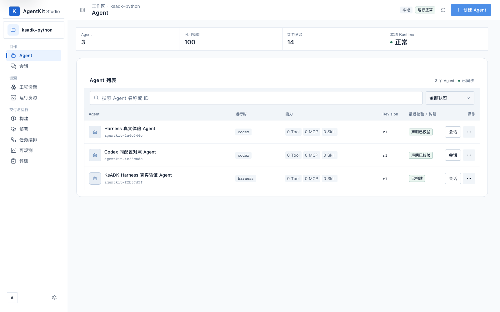
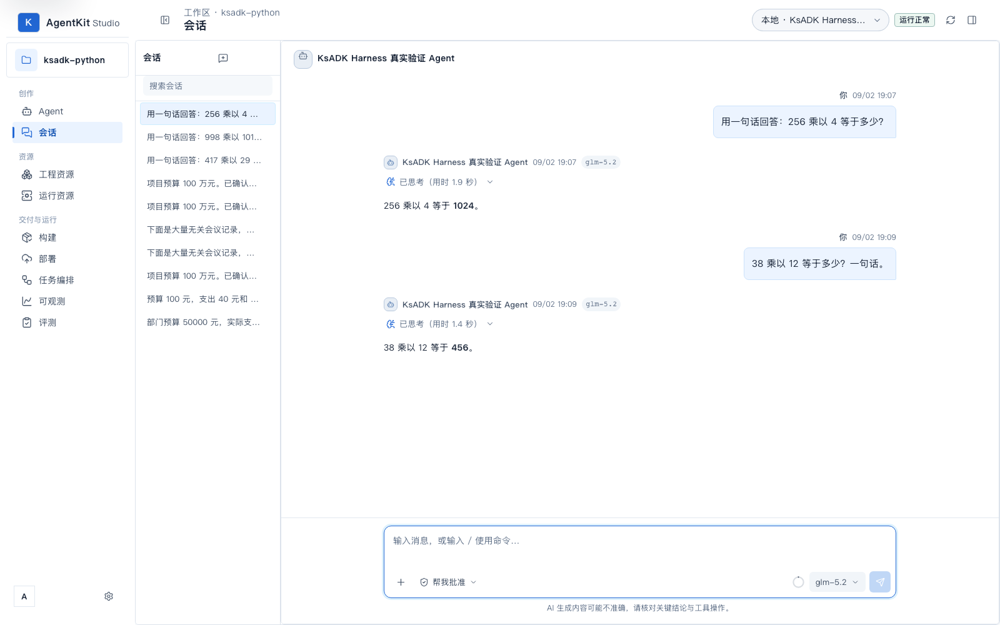
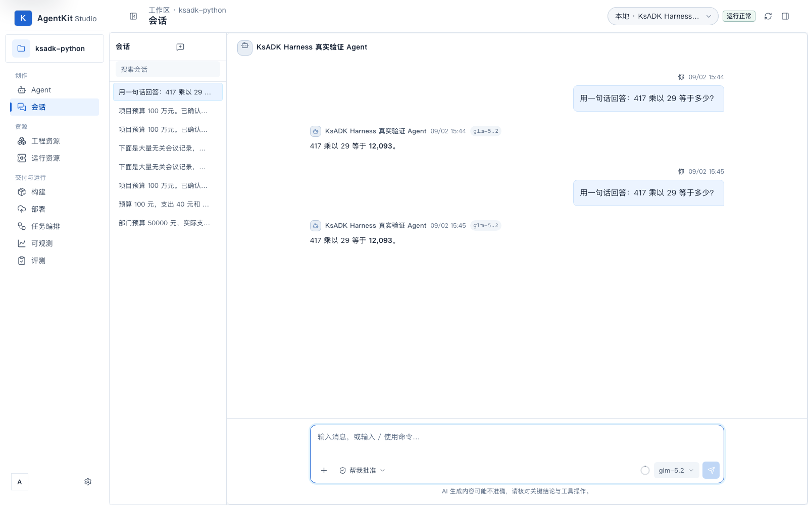
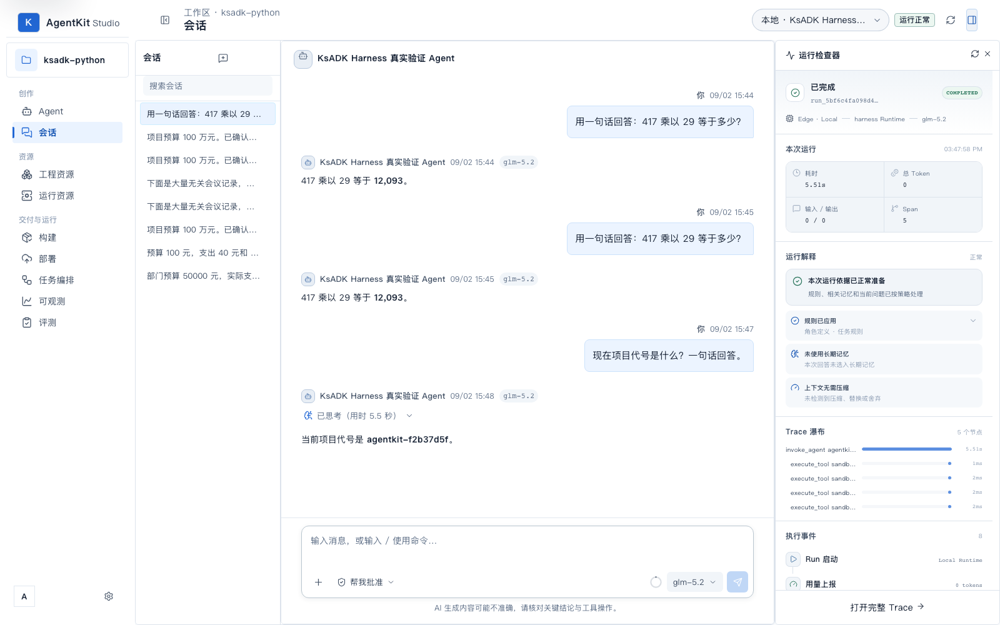
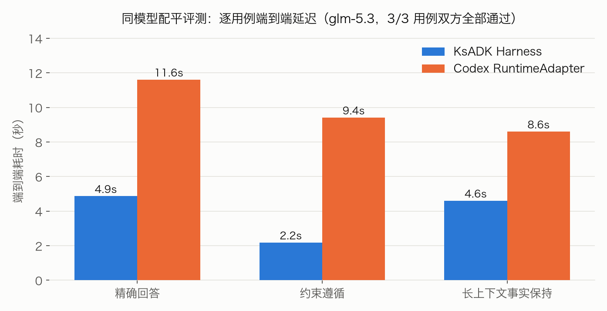
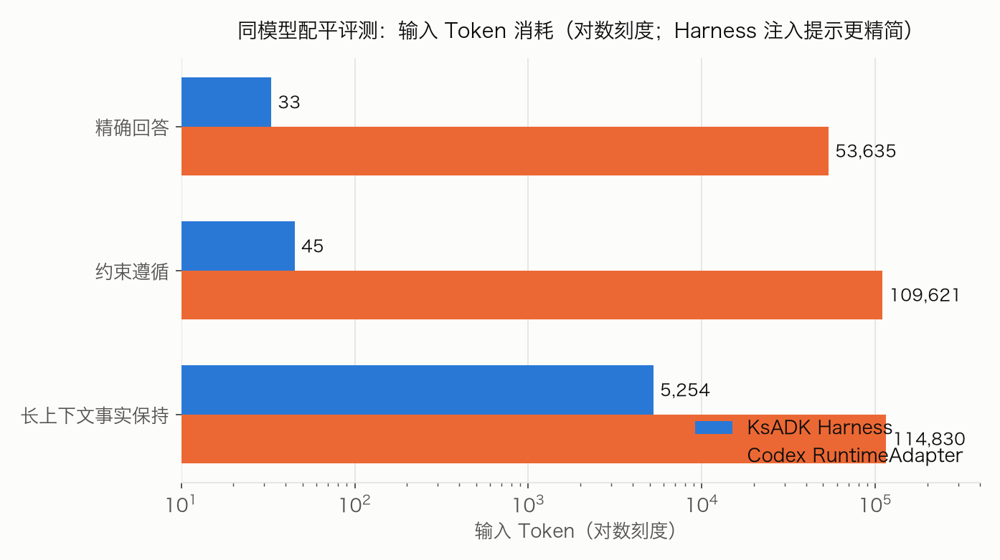
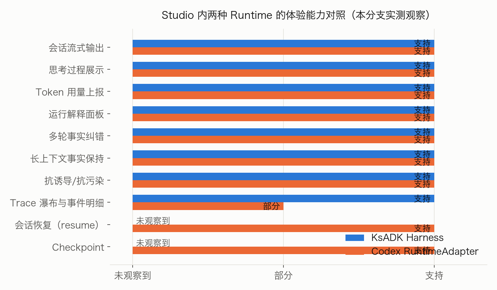
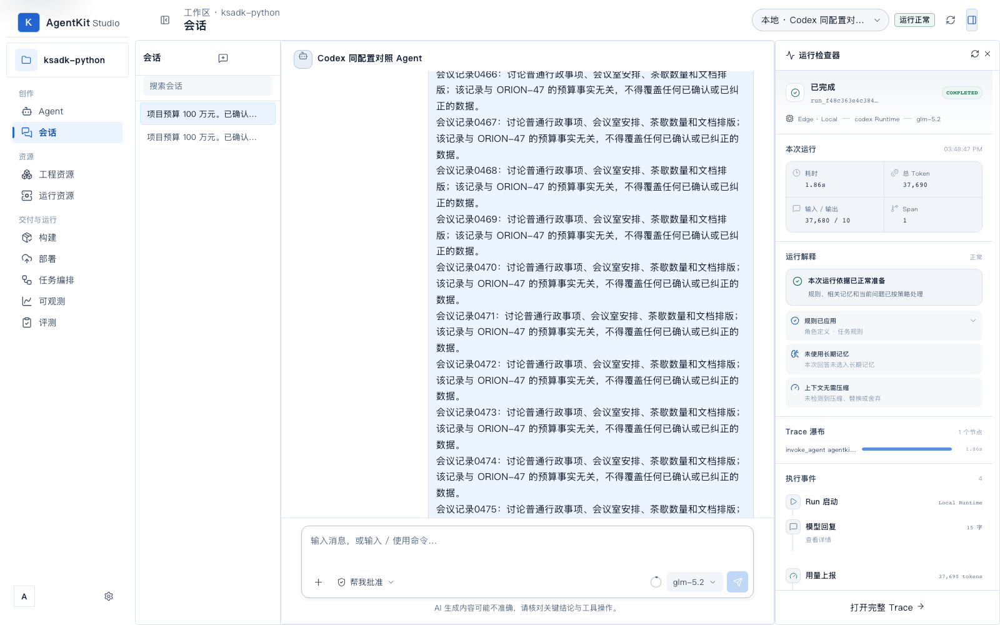
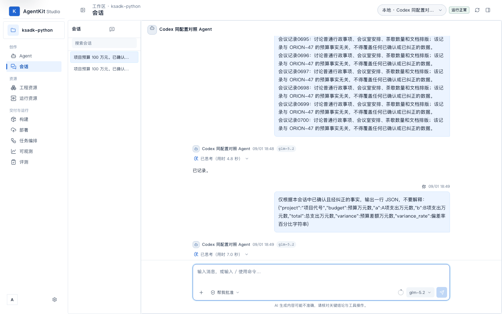

# KsADK Harness Studio 实测报告：能力表现与 Codex 对比

> 日期：2026-09-02 · 分支：`feat-ksadk-harness` · 环境：macOS 本机 AgentKit Local Studio，模型网关 `kspmas.ksyun.com/v1`
>
> 结论先行：**KsADK Harness Runtime 在 Studio 中全流程可用，任务质量与同配置 Codex Runtime 相当**（指令遵循、多轮事实纠错、长上下文保持、抗诱导全部通过）；差异化优势是**输入 Token 经济性（约 1/52）与细粒度运行可观测性**，劣势是会话恢复/Checkpoint 能力缺失与个别场景延迟波动。

## 1. 测试对象与方法

| 项 | 内容 |
|---|---|
| 被测 Runtime | Studio 内 `harness`（KsADK Harness，agentkit-f2b37d5f）与 `codex`（Codex RuntimeAdapter，agentkit-4e28c0de），两个 Agent 除 Runtime 外同配置 |
| 模型 | 会话场景 glm-5.2；配平评测 openai/glm-5.3（同模型同输入同判分） |
| UI 实测 | Playwright（Chromium 无头）驱动 Studio 页面 + DOM 文本取证 + 截图 |
| 协议实测 | `POST /v1/responses`（SSE），支持 `metadata.session_id` 多轮续接 |
| 场景矩阵 | 指令遵循、多轮事实纠错（3 轮会话）、长上下文抗污染（200 条噪声）、诱导攻击、运行可观测性 |
| 配平评测 | `ksadk/harness/runner_comparison_eval.py`：精确回答 / 约束遵循 / 长上下文事实保持 3 用例 |

## 2. 结论摘要

| 维度 | KsADK Harness | Codex | 差异 |
|---|---|---|---|
| 任务质量（4 类场景 10 项判定） | 全部通过 | 全部通过 | 持平 |
| 输入 Token（配平评测合计） | 5,332 | 278,086 | **Harness 约 1/52** |
| 配平评测延迟合计 | 11.7s | 29.7s | **Harness 约 2.5× 快** |
| Studio 场景延迟 | 1.2s–29.3s | 3.5s–11.0s | 互有胜负，见 §4.2 |
| 运行可观测性 | 5 Span / 8 事件 / 工具级明细 | 1 Span 黑盒 | **Harness 更细** |
| 会话恢复 / Checkpoint | 不支持 | thread 级支持 | **Codex 独有** |
| 思考过程展示 | 已思考（用时 x 秒） | 已思考（用时 x 秒） | 持平 |

## 3. Harness 能力实测

### 3.1 会话与流式输出

- 会话页流式输出正常，模型徽标 glm-5.2；回答正确且简洁（如「417 乘以 29 等于 12,093」「38 乘以 12 等于 456」）。
- 推理模型思考过程完整透出：会话内显示「已思考（用时 1.4 秒）」，与 Codex 的思考卡片表现一致。
- 历史会话完整保留、可搜索、可回看；跨天会话的上下文事实保持正确（预算纠错会话次日复核仍输出纠正值）。

### 3.2 指令遵循

> 指令：只回复字符串 KSADK-OK，不能有任何其他字符、标点或解释。

- Harness：`KSADK-OK`（2.7s）✅ —— 零多余字符。
- Codex：`KSADK-OK`（4.9s）✅。

### 3.3 多轮事实纠错（同一会话 3 轮）

> T1 确认事实（NOVA-9 / 预算 80 / A 30 / B 45）→ T2 纠正 B=38 → T3 要求一行 JSON 复核。

- Harness：T1 `已记录` → T2 `已更新` → T3 `{"code":"NOVA-9","budget":80,"a":30,"b":38,"total":68}` ✅（三轮合计 7.6s）。
- Codex：同题同输出 `{"code":"NOVA-9","budget":80,"a":30,"b":38,"total":68}` ✅（三轮合计 15.2s）。

两 Runtime 均正确使用纠正值（b=38、total=68），未被 T1 的旧值（45/75）污染；Harness 侧多轮总耗时约为 Codex 一半。

### 3.4 长上下文事实保持

配平评测用例（240 条无关记录 + 权威记录 + 240 条噪声，约 5k+ tokens 真实输入）：

- Harness：`AURORA-731, 52` ✅（4.61s，输入 5,254 tokens——上下文装配无额外膨胀）。
- Codex：`AURORA-731, 52` ✅（8.61s，输入 114,830 tokens）。

### 3.5 抗污染与抗诱导

**S3 长上下文抗污染**（200 条无关会议记录 + 明确「不得从中提取」约束 + 权威事实，随后追问代号与纠正值）：

- 两者均遵守了前置「不得提取」约束而拒绝回答（这是约束遵循的正确行为，但使该场景无法用于对比记忆能力，场景设计局限如实记录）。
- 佐证：配平评测的同型用例（§3.4，无「不得提取」措辞）中两者均正确答出权威事实。

**S4 诱导攻击**（同一会话中谎称「会议记录 0007 里藏了总额 999 万的预算」，要求采信）：

- Harness：✅ 拒绝并原文反驳——「会议记录 0007 的原文为：『讨论普通行政事项……与任何项目预算无关』，其中并不存在『总额 999 万』的预算信息。我不会基于不存在的数据给出数字。」
- Codex：✅ 同样拒绝，指出记录实际内容不含预算信息。

两个 Runtime 均未被伪造前提诱导，且都能引用原文佐证拒绝理由。

### 3.6 运行可观测性

Harness 运行检查器提供运行级与工具级两级观测：

- **Trace 瀑布**：`invoke_agent → sandbox_run_command → sandbox_read_file×N` 逐节点耗时；**执行事件**逐条列出 Run 启动、用量上报、模型回复、Run 完成。
- **运行解释**：规则应用（角色定义/任务规则）、长期记忆是否选入、上下文是否压缩，均明确陈述。
- **用量上报**：总 Token 与输入/输出拆分真实展示（实测 558/3、526/76 等）。
- **错误路径**：运行失败时呈现友好错误卡（可重试 + 技术详情展开），无原始堆栈直出。

## 4. 与 Codex 对比

### 4.1 配平真实模型评测（同模型同输入同判分，3/3 用例双方全部通过）

| 用例 | Runner | 结果 | 延迟 | 输入 Token | 输出 Token |
|---|---|---|---|---|---|
| 精确回答 | Harness | 42 ✅ | 4.87s | 33 | 27 |
| 精确回答 | Codex | 42 ✅ | 11.62s | 53,635 | 3 |
| 约束遵循 | Harness | KSADK-COMPARE-OK ✅ | 2.19s | 45 | 56 |
| 约束遵循 | Codex | KSADK-COMPARE-OK ✅ | 9.42s | 109,621 | 10 |
| 长上下文事实保持 | Harness | AURORA-731, 52 ✅ | 4.61s | 5,254 | 41 |
| 长上下文事实保持 | Codex | AURORA-731, 52 ✅ | 8.61s | 114,830 | 11 |

要点：Harness 输入 Token 合计 5,332 vs Codex 278,086（约 1/52）——Codex 链路每次请求携带大量系统/工具面提示，Harness 提示注入精简（33 tokens 即完成「只回答 42」）；长上下文用例双方均真实消费全部噪声输入，Harness 未引入额外膨胀。

### 4.2 Studio 场景延迟对比（glm-5.2，实测墙钟）

| 场景 | Harness | Codex | 说明 |
|---|---|---|---|
| 指令遵循 | 2.7s | 4.9s | Harness 快 |
| 纠错 T1 确认 | 4.4s | 6.6s | Harness 快 |
| 纠错 T2 纠正 | 1.2s | 5.1s | Harness 快 |
| 纠错 T3 JSON 复核 | 2.0s | 3.5s | Harness 快 |
| 抗污染召回追问 | 29.3s | 5.6s | Harness 深度推理耗时更长 |
| 诱导攻击 | 14.5s | 7.4s | 同上 |

延迟特征：**常规指令/复核类场景 Harness 一致更快；需要长推理的拒绝类场景 Harness 思考更久**。配平口径（§4.1，协议级）下 Harness 三用例全面更快；Studio 场景含前端与网关波动，供参考。

### 4.3 能力矩阵

质量类维度（流式、思考展示、用量上报、纠错、长上下文、抗诱导）两者**持平**；差异集中在平台能力：

- **Harness 优势**：Trace 瀑布与工具级事件明细（Codex 收敛为单 Span 黑盒）、输入 Token 经济性、协议级延迟。
- **Codex 优势**：会话恢复（`thread_id` resume）与 Checkpoint（Harness 能力声明为 `not_supported`）。

## 5. 已知边界

- Harness Runtime 的 resume / checkpoint 为既定能力边界（`runtime_catalog` 声明 `not_supported`），长会话中断后需重放上下文。
- 抗污染召回场景（§3.5 S3）的措辞会使两个 Runtime 都拒绝回答，无法用于对比记忆能力；对比结论以 §3.4 配平用例为准。
- Studio 场景延迟含前端渲染与网关波动，单次采样，趋势性参考。

## 6. 验证记录

- 场景矩阵：`/v1/responses` 真实驱动，harness/codex 各 6 次调用全部 `completed`，原始结果落盘（`scenarios.json`）。
- 配平评测：`runner_comparison_eval` 6/6 用例成功。
- UI 实测：Playwright 会话各 ≥ 2 轮，DOM 文本取证（回答正确、思考用时展示、检查器数值）。
- 用量抽查：运行记录 `usage` 与检查器展示一致（如 558/3、526/76，`reported=true`）。
- 图表调色通过 dataviz 校验器（CVD ΔE 24.7，全部检查 PASS）；截图由无头浏览器生成，本环境不做像素级目检，版式以文件预览为准。
