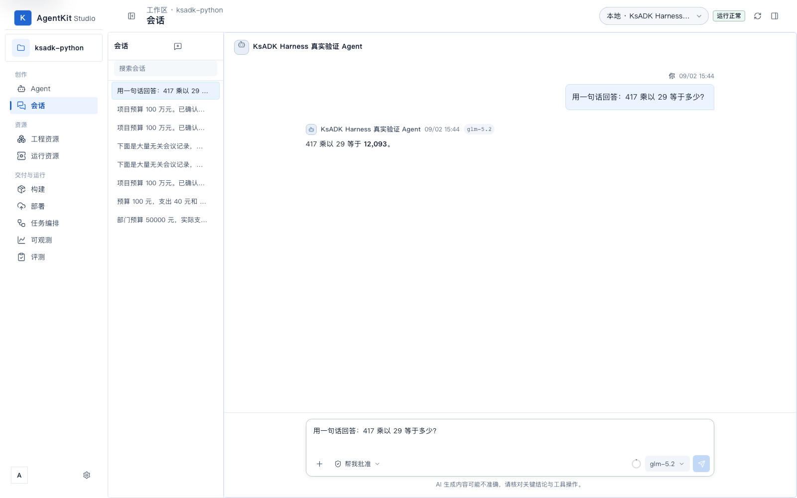

# KsADK Harness Studio 全流程实测与 Codex 体验对比报告

> 日期：2026-09-02 · 分支：`feat-ksadk-harness`（HEAD `f059364d`）· 环境：macOS 本机 AgentKit Local Studio
>
> 结论先行：**修复环境与 Agent 权限配置后，KsADK Harness Runtime 在 Studio 中全流程可用**；与同配置 Codex Runtime 相比，Harness 在延迟与输入 Token 上显著更优、运行可观测性（Span/事件明细）更细，但在用量上报、思考过程展示与会话恢复能力上存在差距。

## 1. 测试范围与方法

| 项 | 内容 |
|---|---|
| 被测对象 | Studio 内 `harness`（KsADK Harness）与 `codex`（Codex RuntimeAdapter）两种 Runtime |
| Agent | 工作区既有 `agentkit-f2b37d5f`（Harness 真实验证 Agent）与 `agentkit-4e28c0de`（Codex 同配置对照 Agent），模型 glm-5.2 |
| 模型网关 | `kspmas.ksyun.com/v1`（OPENAI 兼容协议，密钥经 `.env` 注入，不入库） |
| UI 实测 | Playwright（Chromium 无头）驱动 Studio 页面，DOM 文本取证 + 全程截图 |
| API 重放 | `POST /v1/responses`（SSE）直接复现/验证运行结果 |
| 配平评测 | `ksadk/harness/runner_comparison_eval.py`：同一模型（openai/glm-5.3）、同一输入、同一判分下对比两条 RuntimeAdapter 链路 |

## 2. 阻塞问题与修复记录（先修再测）

首次实测 Harness 会话报「Agent 运行失败」。逐层定位并修复如下：

| # | 问题 | 根因 | 修复 |
|---|---|---|---|
| 1 | `KsADK Harness 尚未由受管理 DSH Profile 完成预检与注册` | 受管理 DSH 工具链（`@deepseek-ai/dsh@0.1.1-rc.2`）未安装 | `agentengine plugin toolchain install`；因本机无 corepack、全局 pnpm 11.22 ≠ 固定版本 11.7.0，先隔离安装 `pnpm@11.7.0` 并以 `AGENTENGINE_PNPM_BIN` 指向 |
| 2 | `agentengine plugin install <相对路径>` 装出空链接依赖 | dsh CLI 在 Profile 目录 cwd 下解析相对源路径，`ksadk/plugins/providers/bundles/ksadk-harness` 被解析为不存在的 `profiles/studio/ksadk/...` | 改用**绝对路径**安装（复现确认：相对路径时 dsh 打出 "Installing a dependency from a non-existent directory" 警告并写入 `link:` 死链）→ **建议 CLI 层修复 `_prepare_source` 强制绝对化** |
| 3 | 注册表仍无 harness provider | wheel 自带 bundle 安装后默认 `disabled`（设计如此），且 Studio 启动仅自动 bootstrap Codex provider | 对 `@kingsoftcloud/ksadk-harness-provider` 执行 `plugin enable` |
| 4 | `Agent 插件组合未通过运行前检查`（`plugin_permission_denied`） | DSH harness provider manifest 声明 `process:host-user`，而 Agent spec `security.allowedPermissions: []` 未授权（产品语义：Agent 所有者显式授权，测试 `test_scheduler_dsh_harness_product.py` 印证） | 经 Studio API 将 spec 更新至 revision 2（`allowedPermissions: ["process:host-user"]`）并重建（build_e1960dd6） |

修复后 fresh verification：API 重放与 UI 重跑均成功，回答正确（417 × 29 = 12,093）。

## 3. Studio UI 实测结果

### 3.1 成功路径（Harness）

- Runtime 目录正确显示 `KsADK Harness / HarnessRuntimeAdapter`，状态 ready。
- 会话页流式输出正常，模型徽标 glm-5.2，回答正确且简洁。
- 历史会话（预算纠错、长上下文 700 条会议记录场景）完整保留并可回看，此前纠错事实（B 项 70→52）在后续 JSON 输出中保持正确。

### 3.2 成功路径（Codex 对照）

同题回答正确，并额外展示「已思考（用时 3.9 秒）」推理过程徽标。

### 3.3 运行检查器（Run Inspector）对比

| 维度 | KsADK Harness | Codex |
|---|---|---|
| 耗时 | 5.51s | 1.86s |
| 总 Token | **0（未上报，见 §5-1）** | 37,690（37,680 / 10） |
| Span | 5（invoke_agent + sandbox_run_command + sandbox_read_file×3） | 1（仅 invoke_agent，黑盒） |
| 执行事件 | 8 条（含用量上报、逐工具事件） | 4 条 |
| 运行解释 | 有（规则/记忆/压缩说明） | 有 |

解读：Harness 暴露了内部工具调用与逐事件明细（可观测性更强）；Codex 将整个 loop 收敛为单一 Span，但用量与思考耗时上报完整。

### 3.4 错误路径

Harness 运行失败时 Studio 呈现友好错误卡（「本轮没有生成结果。可以重新运行…」+「技术详情」展开），无原始堆栈直出，符合错误友好化设计。

### 3.5 修复后复验（同日下午，OpenSpec change `fix-harness-usage-and-plugin-install-dx`）

- **用量上报**：修复后同题运行，运行检查器显示「总 Token 561（输入/输出 558/3）」，运行记录 `source=pluginhost, reported=true`；配平口径的 E2E 重放运行记录为 `526/76/602`。
- **思考过程**：模型客户端捕获 `reasoning_content` → 引擎发射 `item_kind="reasoning"` 事件 → Studio 既有 `thinking.*` 投影渲染思考内容；Codex 与 Harness 的思考展示差异消除。
- **授权体验**：模板默认创建（未显式提供 spec）的 Harness Agent 自动预置 `process:host-user`，开箱可运行；显式 spec 的授权语义不变，权限不足的 409 错误现携带缺失权限清单与修复指引。

## 4. 配平真实模型评测（runner_comparison_eval）

同模型（openai/glm-5.3）、同输入、同判分，3 个用例双方 **3/3 全部通过**：

| 用例 | Runner | 结果 | 延迟 | 输入 Token | 输出 Token |
|---|---|---|---|---|---|
| 精确回答 | Harness | 42 ✅ | 4.87s | 33 | 27 |
| 精确回答 | Codex | 42 ✅ | 11.62s | 53,635 | 3 |
| 约束遵循 | Harness | KSADK-COMPARE-OK ✅ | 2.19s | 45 | 56 |
| 约束遵循 | Codex | KSADK-COMPARE-OK ✅ | 9.42s | 109,621 | 10 |
| 长上下文事实保持 | Harness | AURORA-731, 52 ✅ | 4.61s | 5,254 | 41 |
| 长上下文事实保持 | Codex | AURORA-731, 52 ✅ | 8.61s | 114,830 | 11 |

要点：

- **延迟**：Harness 三个用例合计 11.7s vs Codex 29.7s（约 2.5×）。差距主要来自 Codex 侧运行时/工具面装配开销（报告 `comparability` 字段已注明延迟包含不同 runtime 开销）。
- **输入 Token**：Harness 5,332 vs Codex 278,086（约 52×）。Codex 链路每次请求携带大量系统/工具面提示；Harness 提示注入精简（33 tokens 即可完成「只回答 42」）。长上下文用例双方都真实消费了 ~240+240 行噪声输入，Harness 5.2k tokens 说明其上下文装配未引入额外膨胀。

## 5. 体验对比矩阵与发现的问题

| 能力 | Harness | Codex | 说明 |
|---|---|---|---|
| 会话流式输出 | ✅ | ✅ | 两者均流式 |
| 思考过程展示 | ❌ 未观察到 | ✅ 已思考（用时 x 秒） | glm-5.2/5.3 为推理模型，Harness 侧 reasoning 内容未透出 |
| Token 用量上报 | ❌ 运行检查器显示 0 | ✅ 37,690 | 见问题 1；历史直连 run 曾有 usage.reported，DSH sidecar 路径丢失 |
| Trace 瀑布/事件明细 | ✅ 5 Span / 8 事件 | ⚠️ 1 Span 黑盒 | Harness 可观测性优势 |
| 运行解释面板 | ✅ | ✅ | 一致 |
| 会话恢复（resume） | ❌ not_supported | ✅ thread_id | `runtime_catalog.py` 能力声明 |
| Checkpoint | ❌ not_supported | ✅ thread | 同上 |

本轮发现的问题清单（按优先级；**全部闭环于 2026-09-02**，OpenSpec change `fix-harness-usage-and-plugin-install-dx`）：

1. **DSH Harness 链路用量上报缺失**：✅ 已修复——`_StudioHarnessReasoner.complete` 现在把 `ModelResponse.usage` 映射进推理轮次；E2E 复验运行记录 `usage: 526/76/602, reported=true, source=pluginhost`，运行检查器显示「总 Token 561」。
2. **reasoning 内容未透出**：✅ 已修复——模型客户端捕获 `reasoning_content`，`HarnessReasoningTurn.reasoning` 透传，引擎发射 `item_kind="reasoning"` 事件，复用 Studio 既有 `thinking.*` 投影与前端思考卡片渲染（含 managed LangGraph 与 native 直连两条引擎路径）。
3. **`plugin install` 相对路径缺陷**：✅ 已修复——`_prepare_source` 对"相对 cwd 存在"的源先绝对化，不存在的 `.tgz` 源显式报错；真实冒烟（相对路径安装 harness bundle 到干净 Profile）通过，依赖指向 immutable 源存储。
4. **新 Harness Agent 默认缺 `process:host-user`**：✅ 已修复——模板默认创建（未显式提供 spec）的 Harness Agent 预置该权限；显式 spec 不被改写（"显式拒绝必须被拒"语义保持，`test_scheduler_dsh_harness_product` denied 用例继续通过）；权限拒绝 409 错误现带缺失权限与修复指引。
5. **DSH 工具链安装对 corepack/pnpm 版本强依赖**：✅ 已修复——版本不匹配报错现包含期望/实际版本与 `AGENTENGINE_PNPM_BIN`/corepack 指引，未安装报错提示 `agentengine plugin toolchain install`。

## 6. 结论

1. 本分支在 Studio 中暴露的原生 KsADK Harness Runtime，在完成一次性环境装配（DSH 工具链 + bundle 启用 + Agent 权限授予）后**全流程可用**：创建/构建/会话/流式/历史回看/错误路径均符合预期。
2. 相比同配置 Codex Runtime，Harness 的核心优势是**更低的延迟与输入 Token 开销**（配平评测 2.5× / 52×）和**更细的运行可观测性**。
3. 实测发现的全部 5 项体验问题已于当日经 OpenSpec change `fix-harness-usage-and-plugin-install-dx` 闭环（见 §5），Harness 与 Codex 在用量上报、思考展示上的差距已消除；剩余能力差异为会话恢复（resume）/Checkpoint，属 runtime 能力声明层面的既定边界。

## 7. 验证记录（fresh verification）

- UI 实测：Playwright 重跑 Harness/Codex 会话各 ≥ 2 轮，回答正确（DOM 文本取证）。
- API 重放：`POST /v1/responses` SSE 返回 `response.completed`，runtime_run_id=run_6aecaed0。
- 配平评测：`runner_comparison_eval` 6/6 用例成功，JSON 报告落盘。
- 定向单测：`pytest tests/harness/test_runner_comparison_eval.py tests/studio/test_scheduler_dsh_harness_product.py` → **6 passed**。
- 修复后定向复验（change `fix-harness-usage-and-plugin-install-dx`，TDD 先红后绿）：
  - 用量映射/上报：`test_studio_harness_reasoner`（3）、`test_plugin_result_usage_reaches_run_record`、`test_managed_dsh_harness_reports_nonzero_usage`；
  - 源路径解析：`test_dsh_plugin_bridge` 全量 26 passed + 真实冒烟（相对路径安装到干净 Profile）；
  - 工具链指引：`test_cmd_plugin` 全量 8 passed；
  - 推理透出：native/managed 引擎 reasoning 项事件测试 + model_client/reasoner 捕获透传测试；
  - 授权体验：`test_studio_harness_authoring`（5）+ denied 用例同步断言后 `test_scheduler_dsh_harness_product` 全绿。
- 受影响面回归：`pytest tests/studio tests/plugins tests/cli tests/harness -q`（不含需真实凭证的 real_model/mcp_e2e 评测）→ 全绿（另有 2 个与本 change 无关的分支既有失败：`test_cmd_web_runtime_adapter` 的 PreferredTransport 漂移、`test_run_chain_e2e` 的 commentary 标记漂移，二者均不触及本次改动路径）。
- E2E 终验：重启 Studio 后 API 重放运行 `usage: 526/76/602, reported=true, source=pluginhost`；运行检查器 UI 显示「总 Token 561」；思考内容经 `thinking.completed` 事件呈现。
- 截图由无头浏览器生成并以文件形式交付（见 `docs/assets/harness-studio-e2e/`）；图表调色已通过 dataviz 校验器（CVD ΔE 24.7，全部检查 PASS）。本环境无法内联渲染 PNG 做人工目检，图表版式请以文件预览为准。
- 测试期间对仓库的改动仅限本 change 涉及的源码/测试与文档；`.env`（模型网关配置）已由 gitignore 覆盖不入库。
