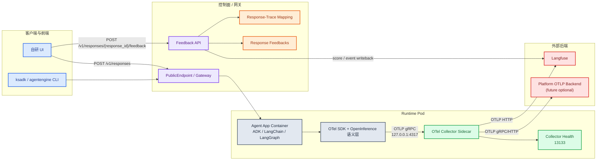
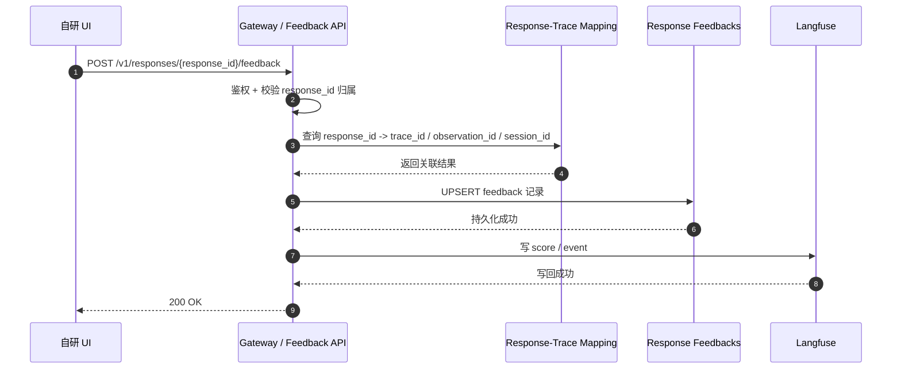
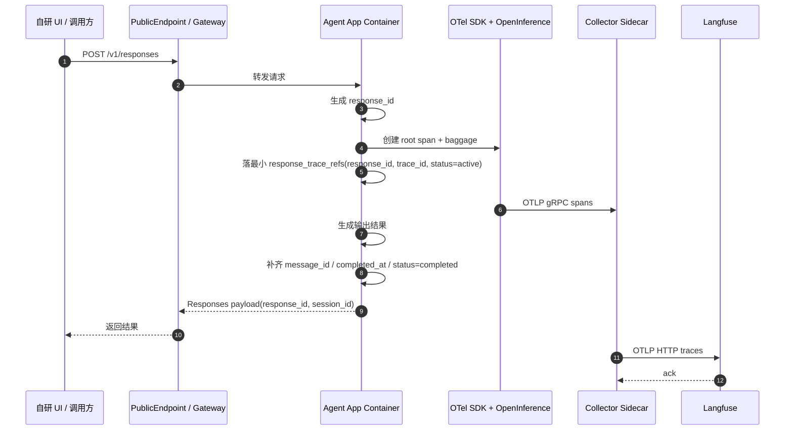
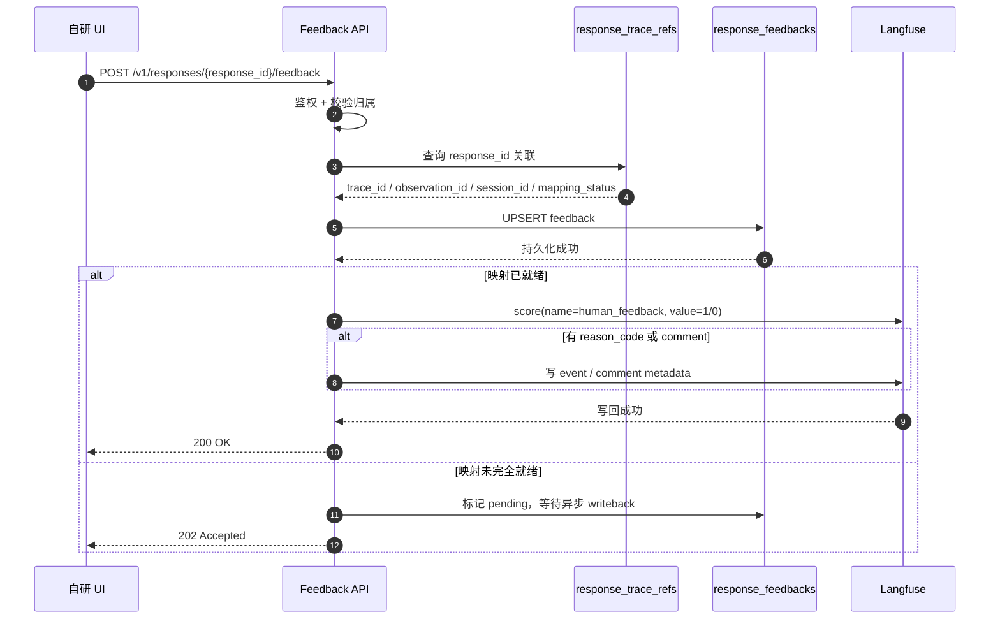
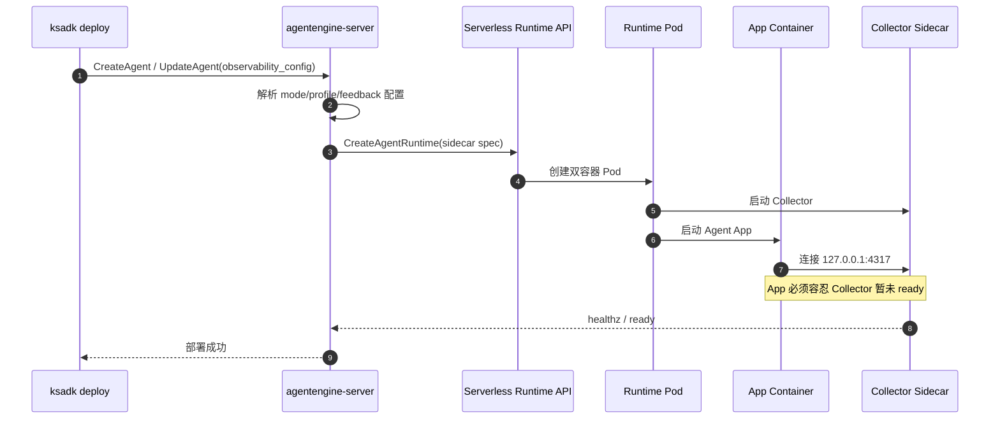
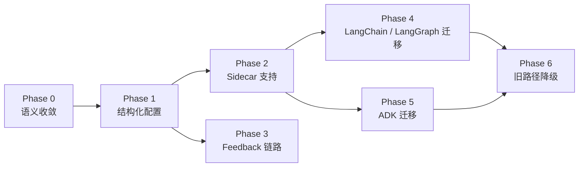

# OTel Collector Sidecar 与用户反馈评估设计方案

本文档是 `ksadk-python` / `agentengine-server` 面向可观测性与用户反馈评估能力的拟落地设计方案。

与 [ksadk技术设计](./ksadk技术设计.md) 不同，本文档描述的是计划引入的正式能力，而不是当前代码已经完全落地的事实。目标是同时解决两类需求：

1. `runtime trace` 统一走 `OTel + OpenInference + OTLP`，并继续兼容当前 Langfuse。
2. 自研 UI 在调用公网 `/v1/responses` 后，可以对整条 Agent 输出做点赞 / 点踩，并让反馈稳定回流到 Langfuse trace。

## 1. 背景

当前仓库里已经存在三类和本方案强相关的能力：

- `ksadk-python/ksadk/tracing/setup.py`
  已有 `InMemory + Langfuse + OTLP` 的 tracing 初始化入口，但主路径仍偏向应用内 exporter 和 callback。
- `ksadk-python/ksadk/server/app.py` 与 `ksadk-python/ksadk/conversations/runtime.py`
  已正式暴露 `/v1/responses`，并返回 `response_id` 与 `session_id`。
- `agentengine-server/app/models/conversation.py`
  已有 `ConversationSession / ConversationEvent` 持久化模型，可作为 response-feedback 关联链路的基础。

当前存在的关键问题有四个：

1. Langfuse 接入方式不统一  
   ADK、LangChain、LangGraph 仍混用自定义 exporter、Langfuse callback 和 OTel span。

2. OTLP 治理能力缺位  
   业务容器直接感知 Langfuse 细节，协议转换、批处理、重试、双写和凭证隔离没有统一治理点。

3. 用户反馈链路缺位  
   自研 UI 虽然能通过公网 `/v1/responses` 调用 Agent，但点赞 / 点踩并不能稳定回写到 trace。

4. 运行时 trace 与 UI feedback 混在一起容易设计失焦  
   runtime pod 内只能稳定采集运行时 telemetry；浏览器侧反馈属于业务事件，不应指望 sidecar 自动捕获。

## 2. 设计目标

### 2.1 目标

- 用一套统一的 tracing 语义覆盖 ADK、LangChain、LangGraph。
- serverless runtime pod 默认支持 OTel Collector sidecar。
- runtime trace 继续上报到 Langfuse，并为未来自研 OTLP backend 预留双写能力。
- 自研 UI 对 `/v1/responses` 的整条输出做点赞 / 点踩时，可以通过 `response_id` 可靠关联回 Langfuse trace。
- 前端不直接感知 Langfuse 的 `trace_id`、`observation_id`、secret 或 score API。
- 保持现有 `--observability/--no-observability` 和 `langfuse_enabled` 向后兼容。

### 2.2 非目标

- 不对单个 tool call、单个 reasoning step 做细粒度评分。
- 不要求前端直接写 Langfuse。
- 不在 `ksadk` SDK 内嵌或自启动 Collector 进程。
- 首版不直接引入平台级共享 gateway collector，先以 sidecar 为正式形态。

## 3. 总体方案

### 3.1 核心原则

本方案把能力拆成两条平行但可关联的链路：

- `Trace Plane`
  runtime 内部的 LLM / agent / tool 调用链，走 `OTel + OpenInference + OTLP + Collector sidecar`。
- `Feedback Plane`
  用户在自研 UI 中对整条 Agent 输出做的点赞 / 点踩，走 `response_id -> feedback API -> Langfuse score writeback`。

这两条链路都汇聚到 Langfuse，但实现方式不同，职责边界必须清楚。

术语约定：

- `collector`
  指应用侧导出模式，强调“业务容器把 spans 发给 OTel Collector”。
- `sidecar`
  指部署侧形态，强调“Collector 以 runtime pod 第二容器存在”。

在本文里：

- `collector mode`
- `sidecar deployment`

首版通常同时出现，但语义并不完全相同。

### 3.2 总体架构



## 4. 方案选择

### 4.1 备选方案

| 方案 | 描述 | 优点 | 缺点 |
| --- | --- | --- | --- |
| A | 应用直连 Langfuse + 单独 feedback API | 上线最快，改动最少 | SDK 持续耦合 Langfuse 细节，不适合作为正式长期方案 |
| B | OTel Collector sidecar + 单独 feedback API | 运行时治理和反馈治理边界清晰，最适合当前 serverless pod 形态 | 每个 pod 增加一个 sidecar，有额外资源开销 |
| C | 平台级 gateway collector + 单独 feedback API | 资源效率更高，集中治理能力最强 | 平台复杂度显著上升，不适合作为首版正式方案 |

### 4.2 结论

首版正式方案选择 `方案 B`：

- runtime trace 走 sidecar
- UI feedback 走独立 API
- Langfuse 作为当前主后端保留
- 同时为未来平台级 collector 演进留好协议边界

## 5. Trace Plane 设计

### 5.1 语义层：OpenInference

`OpenInference` 在本方案中只承担语义规范与插桩库职责，不承担传输职责。

约束如下：

- 应用侧统一以 `OpenTelemetry span` 为最终事实格式。
- LLM / agent / tool 等 AI 语义优先遵循 `OpenInference` 和相关 OTel AI conventions。
- `session / user / tags / trace_name / version` 这类 trace 级字段，不再只依赖 Langfuse callback 侧向注入，而是纳入统一 span / baggage 传播。

### 5.2 传输层：OTLP

应用容器只和本地 sidecar 通信：

- 默认：`OTLP gRPC -> 127.0.0.1:4317`
- 可选：`OTLP HTTP -> 127.0.0.1:4318`

Langfuse 方向由 sidecar 负责转换为：

- `OTLP HTTP -> https://<langfuse-host>/api/public/otel`

这里要明确：

- `4317` 不是网页端口
- `4317` 不是最终暴露给用户的 PublicEndpoint
- 浏览器访问 `http://127.0.0.1:4317/` 不会得到 trace UI 页面

### 5.3 Sidecar Collector 设计

每个 runtime pod 注入一个标准 OTel Collector sidecar。

建议默认规格：

- image: `otel/opentelemetry-collector-contrib`
  实际部署时必须由平台侧固定具体 tag，禁止使用 `latest`
- request:
  - cpu: `100m`
  - memory: `128Mi`
- limit:
  - cpu: `300m`
  - memory: `256Mi`
- ports:
  - `4317` OTLP gRPC
  - `4318` OTLP HTTP
  - `13133` health check

### 5.4 Sidecar Collector 配置模板

```yaml
extensions:
  health_check:
    endpoint: 0.0.0.0:13133

receivers:
  otlp:
    protocols:
      grpc:
        endpoint: 127.0.0.1:4317
      http:
        endpoint: 127.0.0.1:4318

processors:
  memory_limiter:
    check_interval: 5s
    limit_mib: 192
    spike_limit_mib: 64
  batch:
    timeout: 5s
    send_batch_size: 512

exporters:
  otlphttp/langfuse:
    endpoint: ${LANGFUSE_OTLP_ENDPOINT}
    headers:
      Authorization: ${LANGFUSE_AUTHORIZATION}
      x-langfuse-ingestion-version: "4"

  otlp/platform:
    endpoint: ${PLATFORM_OTLP_ENDPOINT}
    tls:
      insecure: false

service:
  extensions: [health_check]
  pipelines:
    traces:
      receivers: [otlp]
      processors: [memory_limiter, batch]
      exporters: [otlphttp/langfuse]
```

首版默认只启用 `otlphttp/langfuse`。当平台后端准备好后，再切成 `dual` profile 双写。

认证约束：

- `LANGFUSE_OTLP_ENDPOINT` 应为：
  - `https://cloud.langfuse.com/api/public/otel`
  - 或私有 Langfuse 部署对应的 `/api/public/otel`
- `LANGFUSE_AUTHORIZATION` 必须渲染为：
  - `Basic <base64(public_key:secret_key)>`
- `x-langfuse-ingestion-version` 固定写 `4`

安全约束：

- `4317/4318` 仅绑定 `127.0.0.1`
- `13133` 作为健康检查端口，允许绑定 `0.0.0.0` 供 pod readiness / liveness 使用
- 不允许把 OTLP receiver 直接暴露成 pod service 对外端口

### 5.5 Collector 启动顺序与容错

首版不要求应用容器等待 sidecar 完全 ready 后再启动，但要求应用侧必须容忍 Collector 暂时不可用。

约束如下：

- App container 启动时允许 `127.0.0.1:4317` 尚未 ready
- OTel SDK exporter 必须启用 retry / backoff
- 初始数秒内若 Collector 未 ready，不能影响主业务请求成功
- Collector sidecar 崩溃时，主容器不应被联动杀死；只应导致可观测性降级

建议：

- 使用 OTel SDK 默认 batch + retry 能力
- serverless 数据面为 sidecar 配置独立 readiness
- dashboard / doctor 显示 sidecar health，而不是把业务 pod 简单标成健康

### 5.6 应用侧配置模型

`ksadk-python` 新增结构化 tracing 配置，推荐最小形态：

```json
{
  "mode": "collector",
  "protocol": "grpc",
  "endpoint": "http://127.0.0.1:4317",
  "service_name": "ksadk-agent",
  "enable_openinference": true,
  "enable_baggage_propagation": true
}
```

推荐新增环境变量支持：

- `KSADK_OBSERVABILITY_MODE=off|direct|collector`
- `OTEL_EXPORTER_OTLP_ENDPOINT`
- `OTEL_EXPORTER_OTLP_PROTOCOL`
- `OTEL_EXPORTER_OTLP_HEADERS`
- `OTEL_SERVICE_NAME`
- `OTEL_RESOURCE_ATTRIBUTES`

### 5.7 应用侧行为变更

#### `ksadk-python/ksadk/tracing/setup.py`

从“Langfuse exporter / OTLP exporter / callback 混合装配”收敛为：

- `off`
- `direct`
- `collector`

行为约束：

- `collector` 成为 serverless runtime 默认模式
- `direct` 保留给本地开发与过渡验证
- `InMemoryExporter` 只服务本地 Web UI
- 自定义 `langfuse_exporter.py` 退居兼容路径

#### ADK / LangChain / LangGraph

- ADK 继续保留必要的手工 span 规范化
- LangChain / LangGraph 逐步从 callback 优先切到 OTel/OpenInference 优先
- 迁移期间，禁止“同一请求同时向同一个 Langfuse backend 走 callback + OTLP 双写”，避免重复 trace

### 5.8 Trace 属性传播

为保证 Langfuse 检索与过滤效果，trace 级属性不能只存在于 root span。

必须新增：

- `baggage` 传播
- 对应的 span processor，将这些 trace 级属性复制到所有子 span

推荐传播字段：

- `session_id`
- `user_id`
- `tags`
- `trace_name`
- `version`
- `agent_id`
- `agent_name`

## 6. Feedback Plane 设计

### 6.1 核心原则

用户反馈是业务事件，不是运行时自动采集的 telemetry。

因此：

- 不依赖 Collector sidecar 捕获点赞 / 点踩
- 不让前端直接写 Langfuse
- 不让前端持有 Langfuse 相关 secret
- 前端协议只依赖 `response_id`

### 6.2 反馈粒度

首版只支持：

- 对整条 Agent 输出结果做整体评分

明确不支持：

- 对单个 tool call 打分
- 对某一段 reasoning 打分
- 对中间事件打分

### 6.3 `/v1/responses` 关联策略

当前 `/v1/responses` 返回：

- `id`，即 `response_id`
- `session_id`

本方案要求把 `response_id` 前置为稳定的一等关联键：

- 在本轮输出生成早期就确定 `response_id`
- 在 root span 创建后立即拿到 `trace_id`
- 在首个响应 chunk 返回前完成最小 `response_id -> trace` 映射持久化
- 在响应完成时再补全 `message_id / completed_at / mapping_status`
- 前端只依赖 `response_id`

### 6.4 前端调用模型

推荐提供 3 个反馈相关端点：

- `POST /v1/responses/{response_id}/feedback`
- `GET /v1/responses/{response_id}/feedback`
- `DELETE /v1/responses/{response_id}/feedback`

语义如下：

- `POST`
  新增或覆盖当前用户对该 response 的最终反馈态
- `GET`
  回显当前用户对该 response 的当前反馈状态，供前端刷新按钮状态
- `DELETE`
  撤回当前用户的反馈

前端对某次输出做点赞 / 点踩时，调用：

```text
POST /v1/responses/{response_id}/feedback
```

推荐请求体：

```json
{
  "rating": "up",
  "reason_code": "helpful",
  "comment": "回答清楚，解决了问题",
  "source": "custom_ui"
}
```

字段说明：

| 字段 | 类型 | 必填 | 说明 |
| --- | --- | --- | --- |
| `rating` | `up | down` | 是 | 点赞或点踩 |
| `reason_code` | `string` | 否 | 原因码，建议首版采用枚举 |
| `comment` | `string` | 否 | 用户补充说明 |
| `source` | `string` | 否 | 反馈来源，默认 `custom_ui` |

建议首版 `reason_code` 枚举：

- `helpful`
- `not_helpful`
- `wrong`
- `hallucination`
- `unsafe`
- `other`

其中：

- `helpful` 通常与点赞联用
- `not_helpful / wrong / hallucination / unsafe / other` 通常与点踩联用

### 6.5 服务端处理链路



处理要求：

- `response_id` 必须校验归属，防止跨会话或跨用户越权写反馈
- feedback 持久化必须先于 Langfuse 写回，保证平台侧有审计事实源
- Langfuse 写回失败时，不能丢本地反馈记录；应进入可重试状态
- 若 `response_trace_refs` 记录已创建但尚未补全最终字段，feedback API 应允许写入，并在 writeback 阶段根据 `mapping_status` 决定：
  - 若已有 `trace_id`，可立即写回
  - 若仍未就绪，返回 `202 Accepted` 或内部置为 `pending` 后异步重试

### 6.6 Langfuse 写回策略

推荐把用户反馈写成 `score + event` 两种形态：

#### Score

- 点赞：
  - `name=human_feedback`
  - `value=1`
- 点踩：
  - `name=human_feedback`
  - `value=0`

也可以同时保留 vendor-friendly 的语义名：

- `thumbs_up = 1`
- `thumbs_down = 1`

#### Event / Comment

当存在 `reason_code` 或 `comment` 时，再补一条事件，记录：

- `reason_code`
- `comment`
- `source`

这样 Langfuse 里既能筛评分，也能保留解释信息。

## 7. Response-Trace 关联模型

### 7.1 设计原则

前端不应该知道 Langfuse `trace_id`。

因此服务端必须维护 `response_id -> trace` 的稳定映射。

### 7.2 新增表：`response_trace_refs`

建议字段：

| 字段 | 类型 | 说明 |
| --- | --- | --- |
| `response_id` | string | `/v1/responses` 返回的稳定 ID，主键或唯一键 |
| `session_id` | string | 会话 ID |
| `agent_id` | string | Agent ID |
| `user_id` | string | 用户 ID |
| `trace_id` | string | Langfuse / OTel trace ID |
| `root_observation_id` | string | Langfuse root observation，可选 |
| `message_id` | string | response 输出项 message ID |
| `mapping_status` | string | `pending / active / completed / failed` |
| `expires_at` | timestamp | 过期时间，用于 TTL 清理 |
| `completed_at` | timestamp | 响应完成时间 |
| `created_at` | timestamp | 创建时间 |

保留策略：

- `response_trace_refs` 必须有 TTL
- 建议默认保留 `90` 天
- 到期后由后台任务定期清理

### 7.3 新增表：`response_feedbacks`

建议字段：

| 字段 | 类型 | 说明 |
| --- | --- | --- |
| `id` | string | 主键 |
| `response_id` | string | 关联 `response_trace_refs` |
| `session_id` | string | 会话 ID |
| `agent_id` | string | Agent ID |
| `user_id` | string | 用户 ID |
| `rating` | string | `up` / `down` |
| `reason_code` | string | 可选原因码 |
| `comment` | text | 可选用户说明 |
| `source` | string | 来源，如 `custom_ui` |
| `version` | int | 反馈版本号，用户每次修改反馈自增 |
| `langfuse_sync_status` | string | `pending / synced / failed` |
| `langfuse_last_synced_version` | int | 最近一次成功写回的版本 |
| `langfuse_sync_error` | text | 最近一次写回错误 |
| `created_at` | timestamp | 创建时间 |
| `updated_at` | timestamp | 更新时间 |

建议唯一约束：

- `unique(user_id, response_id)`

这样默认语义是：

- 同一用户对同一条 response 只保留一个最终反馈态
- 再次点击视为覆盖更新
- Langfuse 写回必须按 `version` 做“新值覆盖旧值”保护，避免旧重试覆盖新反馈

## 8. Runtime `/v1/responses` 改造

### 8.1 目标

让 feedback plane 能稳定依赖 `response_id`。

### 8.2 改造点

当前 `response_id` 主要在拼响应时生成。建议改成：

1. 请求进入 `/v1/responses` 时，提前生成 `response_id`
2. root span 创建后立即拿到 `trace_id`
3. 在首个非流式返回或首个 SSE chunk 前写入最小 `response_trace_refs`
4. 响应完成时补齐 `message_id / completed_at / mapping_status=completed`
5. 再由异步流程负责 feedback writeback 与补偿

说明：

- 当前 `build_responses_payload()` 已支持外部传入 `response_id`
- 但首版正式方案要求把“生成时机”和“持久化时机”前移到请求入口 / root span 创建阶段
- 这样可以覆盖 SSE 流式场景下“响应已开始，用户已点反馈，但最终映射未落库”的风险

### 8.3 推荐返回形态

保持现有 OpenAI Responses 兼容结构，并在 `metadata` 中补最小平台信息：

```json
{
  "id": "resp_xxx",
  "object": "response",
  "session_id": "sess_xxx",
  "metadata": {
    "ksadk": {
      "response_id": "resp_xxx",
      "feedback_enabled": true
    }
  }
}
```

注意：

- 不默认暴露 `trace_id`
- `response_id` 就是前端做 feedback 的唯一一等键

## 9. 控制面与部署面设计

### 9.1 现状

当前 `ksadk` 到 `agentengine-server` 只传：

- `--observability/--no-observability`
- `langfuse_enabled`

这不足以表达：

- sidecar mode
- collector image/resources
- dual export profile
- feedback plane 开关

### 9.2 新的 `observability_config`

推荐升级为结构化配置：

```json
{
  "enabled": true,
  "mode": "sidecar",
  "profile": "langfuse",
  "collector": {
    "image": "otel/opentelemetry-collector-contrib",
    "cpu_request": "100m",
    "memory_request": "128Mi",
    "cpu_limit": "300m",
    "memory_limit": "256Mi",
    "health_port": 13133
  },
  "targets": {
    "langfuse": {
      "enabled": true,
      "host": "https://cloud.langfuse.com"
    },
    "platform_otlp": {
      "enabled": false,
      "endpoint": ""
    }
  },
  "feedback": {
    "enabled": true,
    "mode": "writeback"
  }
}
```

### 9.3 兼容策略

保持旧字段可用：

- `EnableObservability=false`
  映射为 `enabled=false`
- `EnableObservability=true`
  映射为：
  - `enabled=true`
  - `mode=sidecar`
  - `profile=langfuse`

### 9.4 Serverless Runtime API 扩展

不建议把 sidecar 直接硬塞进现有单一 `ContainerConfiguration`。

建议新增：

- `sidecars: []`
  或
- `runtime_addons.collector`

要求：

- sidecar 配置与主容器配置分离
- sidecar secret 与主容器 env 分离
- Langfuse secret 只注入 sidecar
- profile 切换首版按 rolling update 处理，不承诺热更新

## 10. CLI 设计

在保留现有布尔开关的同时，新增显式 observability 选项：

- `--observability-mode off|direct|sidecar`
- `--observability-profile langfuse|dual`
- `--collector-image`
- `--collector-cpu`
- `--collector-memory`
- `--feedback/--no-feedback`

默认规则：

- 本地开发：`direct`
- serverless 新部署：`sidecar`
- 老命令只写 `--observability` 时，保持兼容并映射为 `sidecar + langfuse`

## 11. 文件级落地清单

本节给出建议的最小改造落点，便于后续拆实现任务。

### 11.1 `ksadk-python`

#### tracing / runtime

- `ksadk-python/ksadk/tracing/setup.py`
  - 新增 `mode=off|direct|collector`
  - 新增 OTLP protocol / headers / service_name 支持
  - 调整默认 serverless tracing 行为
- `ksadk-python/ksadk/tracing/__init__.py`
  - 对外暴露统一 tracing 配置入口
- `ksadk-python/ksadk/runners/adk_runner.py`
  - 统一 root span 属性
  - 接入 `response_id` 参与 trace 关联
  - 补齐 baggage 注入
- `ksadk-python/ksadk/runners/langchain_runner.py`
  - 逐步减少 Langfuse callback 依赖
  - 把 session / user / tags 统一转成 tracing metadata / baggage
- `ksadk-python/ksadk/runners/langgraph_runner.py`
  - 与 LangChain 保持同一条 tracing 语义路径

#### responses / feedback

- `ksadk-python/ksadk/conversations/runtime.py`
  - 提前生成 `response_id`
  - 把 `response_id` 注入本轮 conversation 结果
  - 返回可供 server 层持久化的 trace 关联数据
- `ksadk-python/ksadk/server/app.py`
  - `/v1/responses` 在返回前落 `response_trace_refs`
  - 在 `metadata.ksadk` 中声明 `feedback_enabled`
- `ksadk-python/docs/远程Agent运行时接口说明.md`
  - 后续补充 feedback API 对外 contract

#### deployment / cli

- `ksadk-python/ksadk/cli/cmd_deploy.py`
  - 新增 observability mode / profile / feedback 参数
- `ksadk-python/ksadk/deployment/providers/serverless.py`
  - 把布尔 `enable_observability` 升级成结构化 `observability_config`
- `ksadk-python/ksadk/configs/settings.py`
  - 新增 Collector / OTLP 结构化配置项

### 11.2 `agentengine-server`

#### API / schema

- `agentengine-server/app/api/v1/actions/agent_actions.py`
  - `Advanced.EnableObservability` 继续兼容
  - 新增结构化 `ObservabilityConfigSchema`
  - 新增 feedback API schema
- `agentengine-server/app/api/v1/models/agent_models.py`
  - 补充结构化 observability 字段返回

#### service / persistence

- `agentengine-server/app/models/agent.py`
  - `observability_config` 扩展到 sidecar / feedback profile
- `agentengine-server/app/models/conversation.py`
  - 新增 `response_trace_refs`
  - 新增 `response_feedbacks`
- `agentengine-server/app/services/agent_service.py`
  - Create / UpdateAgent 时组装结构化 observability 配置
  - 把 sidecar spec 透传到 runtime API
- `agentengine-server/app/services/chat_service.py` 或相邻反馈服务
  - 实现 feedback writeback
  - 统一做 response 归属校验

#### runtime client

- `agentengine-server/app/services/serverless_api.py`
  - 为 sidecar / runtime addon 扩展 payload 模型
  - 增加 health / sidecar readiness 回显字段

### 11.3 serverless 数据面

当前 repo 中不完全承载这部分实现，但正式落地必须有对应能力：

- CreateAgentRuntime / UpdateAgentRuntime 支持多容器或 addon spec
- 支持注入 Collector sidecar
- 支持 sidecar Secret / ConfigMap
- 支持 sidecar readiness / healthz

## 12. 配置与 Secret 分发

### 12.1 Secret 边界

| Secret / 配置 | 应用容器 | Collector sidecar | 控制面服务 | 前端 |
| --- | --- | --- | --- | --- |
| Langfuse public host | 可见 | 可见 | 可见 | 可选 |
| Langfuse OTLP auth | 不可见 | 可见 | 可见 | 不可见 |
| Platform OTLP auth | 不可见 | 可见 | 可见 | 不可见 |
| Feedback API access context | 不可见 | 不需要 | 可见 | 通过 cookie / 网关会话 |

### 12.2 建议分发方式

- sidecar exporter 凭证：
  - 通过 Secret 注入 sidecar env
- sidecar pipeline 配置：
  - 通过 ConfigMap 或 runtime addon 内嵌模板渲染
- feedback writeback 凭证：
  - 由 `agentengine-server` 控制面服务持有

### 12.3 为什么不让前端直连 Langfuse

- 不能暴露 secret
- 不能把 trace 归属判断交给浏览器
- 不能让前端跟随 Langfuse vendor contract 演进
- 未来切自研评估后端时前端不应该改协议

## 13. 安全设计

### 13.1 凭证边界

- Langfuse secret 不注入前端
- Langfuse secret 不注入业务应用容器
- Langfuse secret 只注入 Collector sidecar 或控制面写回服务

### 13.2 Collector 网络安全

- OTLP receiver 仅监听 `127.0.0.1`
- 不允许以 Service 形式对外暴露 `4317/4318`
- sidecar 只接受同 pod 内 app container 的本地回环访问

### 13.3 前端反馈权限

- feedback API 必须校验 `response_id` 归属
- 不能允许任意用户对任意 response 写 feedback
- 若使用 cookie session，则按 UI 登录态校验
- 若使用 API key 代理模式，则由网关侧补齐用户上下文

### 13.4 幂等与重试

- feedback 本地持久化使用 UPSERT
- Langfuse 写回失败保留重试状态
- 不因 Langfuse 暂时失败而丢失用户反馈

### 13.5 限流与滥用防护

- feedback API 需要按 `user_id + response_id` 做幂等与频率限制
- 同一用户在极短时间内反复切换 up/down 时，应做最小间隔限制或合并写
- comment 长度建议设置上限，避免写入超长无意义文本

### 13.6 监控与告警

至少增加以下监控指标：

- Collector sidecar crash / restart 次数
- Collector sidecar 内存使用率与 OOM
- `response_feedbacks.langfuse_sync_status=failed` 的积压量
- feedback API QPS、错误率、限流命中率

建议告警：

- 单 Pod Collector sidecar 连续失败
- 某 Agent 或某租户的 feedback writeback 持续失败
- Langfuse OTLP / score writeback 外部依赖不可达

## 14. 关键时序

### 14.1 Runtime Trace 时序



### 14.2 用户点赞 / 点踩时序



### 14.3 Serverless 部署时序



## 15. 迁移计划

### 15.1 阶段依赖图



说明：

- `Phase 3` 不依赖 `Phase 2`
- `Feedback Plane` 可以与 `Sidecar` 并行推进
- `Phase 6` 只有在三类框架都通过主路径验收后才能执行

### Phase 0：语义收敛

- 收敛 `setup_tracing()` 配置模型
- 明确 `collector` 模式
- 统一 trace 级字段和 baggage 传播

完成标志：

- `setup_tracing()` 能表达 `off / direct / collector`
- trace 级字段传播方案被实现团队接受

### Phase 1：控制面结构化配置

- `langfuse_enabled` 升级为结构化 `observability_config`
- 保持旧布尔兼容

完成标志：

- Create / UpdateAgent payload 能同时接受旧布尔和新结构
- 状态回显不破坏旧前端

### Phase 2：Serverless Sidecar 支持

- serverless runtime API 支持 sidecar / addon
- 新部署默认 sidecar

完成标志：

- runtime pod 可稳定拉起 Collector sidecar
- `13133` healthz 可探活

### Phase 3：`/v1/responses` 反馈链路

- 提前生成 `response_id`
- 新增 `response_trace_refs`
- 新增 feedback API 与 `response_feedbacks`

完成标志：

- `POST / GET / DELETE /v1/responses/{response_id}/feedback` 可用
- SSE 场景下 feedback 不会因为映射缺失而丢失

### Phase 4：LangChain / LangGraph 主路径迁移

- 从 callback 主路径切到 OTel/OpenInference 主路径

完成标志：

- LangChain / LangGraph 无重复 trace
- Langfuse 展示不退化

### Phase 5：ADK 主路径迁移

- 完成 ADK 手工 span 规范化和 sidecar 验收

完成标志：

- ADK trace 可检索 `session / user / tags`
- sidecar 不影响主请求成功率

### Phase 6：旧 Langfuse exporter 降级

- `langfuse_exporter.py` 从主路径降为回退路径

完成标志：

- 新部署默认不再依赖旧 exporter
- 回退开关保留但不作为默认路径

## 16. 验收标准

### 16.1 Trace Plane

- ADK / LangChain / LangGraph 三类 runtime 都能在 Langfuse 正常看到 trace
- 不出现同一请求 callback + OTLP 双写导致的重复 trace
- `session / user / tags` 可以在 Langfuse 检索
- Collector 健康检查可探活

### 16.2 Feedback Plane

- 自研 UI 调用 `/v1/responses` 后，可以拿 `response_id` 对整条输出点赞 / 点踩
- feedback API 能做归属校验
- feedback 本地持久化与 Langfuse score 写回都可确认
- Langfuse 临时失败时，feedback 不丢失

### 16.3 兼容性

- 老 `--observability` 布尔开关继续可用
- 老部署无需破坏性迁移
- 不要求前端改为 Langfuse 原生 SDK

## 17. 风险与回退

### 17.1 主要风险

- serverless 数据面若短期不支持多容器 pod，需要先完成 API 与 pod spec 扩展
- ADK 的 OpenInference 自动插桩成熟度可能低于 LangChain，需要保留适量手工 span 规范化
- sidecar 增加 pod 成本，需要平台级默认规格兜底

### 17.2 回退策略

- sidecar 未准备好时，可短期使用 `direct` 模式
- feedback plane 可先独立上线，不阻塞 trace plane
- Langfuse 继续作为当前主后端，平台 OTLP 后端可后置

## 18. 方案摘要

这份方案的最终落点是：

1. `runtime trace` 和 `UI feedback` 拆成两条可关联的正式能力线。
2. `runtime trace` 统一到 `OTel + OpenInference + Collector sidecar`。
3. `UI feedback` 统一到 `response_id -> feedback API -> Langfuse score writeback`。
4. 前端不依赖 Langfuse vendor 细节，业务容器不持有 Langfuse secret。
5. Langfuse 在当前阶段继续作为主后端，但 SDK 和协议边界已经为未来平台自研后端准备好演进空间。

## 19. 相关文档

- [ksadk技术设计](./ksadk技术设计.md)
- [远程Agent运行时接口说明](./远程Agent运行时接口说明.md)
- [工作区文件技术设计](./工作区文件技术设计.md)
