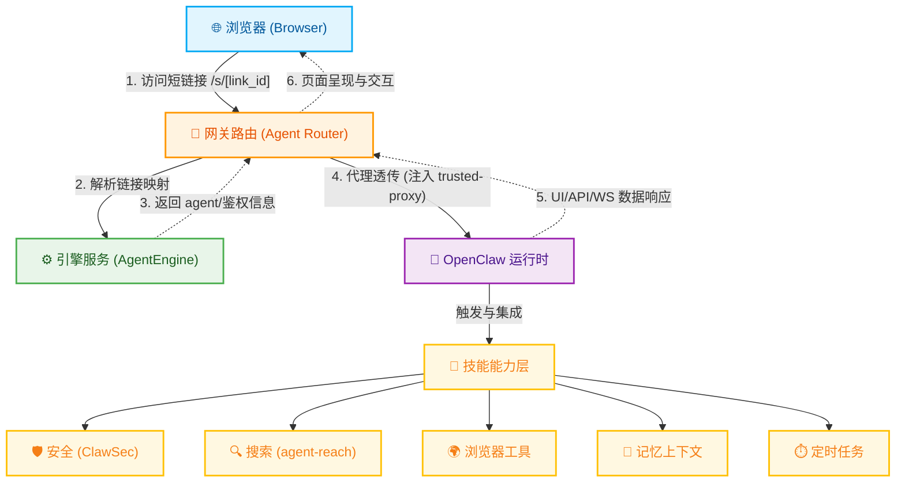
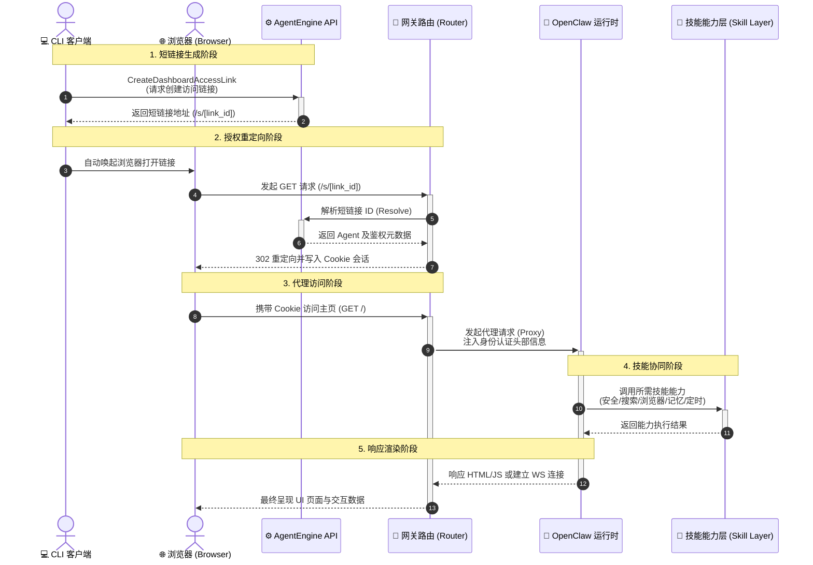

# OpenClaw 网关服务技术文档（Dashboard + HTTP/WS 代理）

> 文档范围：`agentengine-server` 网关路由与短链接访问链路，聚焦 OpenClaw trusted-proxy 模式与能力层协同。  
> 读者：平台架构、后端、安全、解决方案与售前技术团队。

## 1. 技术目标

网关目标是同时满足三件事：

1. 浏览器直接访问 OpenClaw UI（体验友好）。
2. 身份可信透传（安全合规）。
3. 与技能能力层协同（业务可扩展）。

## 2. 设计原则

1. 访问入口统一：短链接 `/s/{link_id}`。
2. 会话统一：cookie session 承载 UI 上下文。
3. 身份统一：`trusted-proxy` 头由网关注入，前端不伪造。
4. 协议统一：HTTP 与 WebSocket 共享同一认证上下文。
5. 能力统一：网关路由与技能执行层协同，支撑安全/搜索/浏览器工具场景。

## 3. 核心组件

- `dashboard_access_link_service.py`  
  负责创建/解析短链接，并解析 OpenClaw trusted-proxy 用户头配置。
- `router_service.py`  
  负责短链接入口、HTTP 代理、WS 代理、session 校验、trusted-proxy 头注入。
- `bootstrap_actions.py`  
  负责下发客户端启动配置（默认镜像、升级提示、公告）。

## 4. 架构图（网关 + 能力层）

## 5. 关键时序（短链接进入 UI 并触发能力层）

## 6. trusted-proxy 身份模型

### 6.1 注入头集合

当 `framework=openclaw` 时，网关注入：

- 自定义用户头（默认 `x-forwarded-user`）
- `x-forwarded-user`
- `x-authenticated-user`
- `x-authenticated-account-id`（存在 account_id 时）
- `x-ksc-account-id`（存在 account_id 时）

用户值优先取 `account_id`，缺失时回退 `anonymous`。

### 6.2 安全收益

- 前端仅持有短期 cookie，不持有后端长期身份凭证。
- OpenClaw 只信任代理链路身份头，减少前端伪造风险。
- 分享链接可过期/可撤销，便于审计与风控。

## 7. Session 与生命周期策略

- private 链接：短时有效，范围严格校验。
- share 链接：支持更长有效期，`expires=0` 可表示长期分享。
- 网关将 link 剩余 TTL 同步为 session TTL，避免会话提前失效。
- 预发环境默认不强制 secure cookie，线上按 https 决定 `Secure`。

## 8. HTTP / WS 代理细节

### 8.1 HTTP

- Agent 解析优先级：`X-Auth-Agent-Id` > `Authorization` 校验 > cookie session。
- 代理前过滤冲突头，再注入 trusted-proxy 头。
- SSE/stream 走流式转发，降低缓冲带来的延迟。

### 8.2 WebSocket

- 复用 cookie/authorization 的统一身份解析。
- 透传 origin/subprotocol，提升前端兼容性。
- trusted-proxy 头通过 `additional_headers`（或兼容 `extra_headers`）注入上游连接。

## 9. 客户端联动与动态配置

CLI 在 `openclaw deploy` 中调用 `GetClientBootstrapConfig`，可动态下发：

- `bootstrap.default_image` / `openclaw.default_image`
- `upgrade.latest_cli_version`
- `upgrade.min_cli_version`
- `notices`

收益：默认镜像、升级策略、运营公告可服务端热更新。

## 10. 可观测与告警建议

建议最少观测项：

1. short-link resolve 成功率与耗时。
2. cookie session 命中率与失效率。
3. HTTP/WS 错误码分布（400/401/404/410/502/1011）。
4. trusted-proxy 头注入命中率。
5. 技能调用成功率（ClawSec / agent-reach / 浏览器工具）。

## 11. 总结

这套网关方案将“访问体验、安全边界、能力扩展”三者统一在一条可运营链路：

- 入口安全：短链接。
- 会话稳定：cookie session。
- 身份可信：trusted-proxy。
- 能力可扩展：安全技能、搜索技能、浏览器工具协同。

对外可表述为：OpenClaw 不只是一个可访问 UI，而是可控可审计的企业级智能体能力底座。
