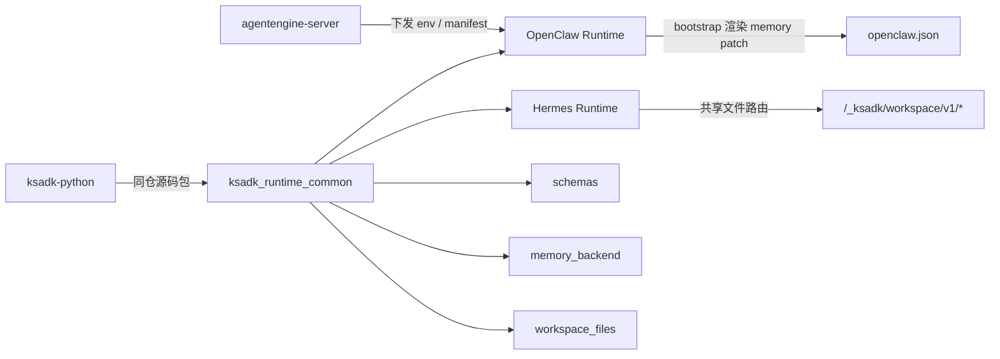

# `ksadk_runtime_common` 同仓共享重构实施说明

## 1. 目标

本次实施解决两个问题：

1. `ksadk-python` 不能再依赖未发布的 `agentengine-runtime-common` wheel。
2. OpenClaw 的 memory backend 不能只停留在设计层，必须真正接入 create/update/runtime bootstrap 主链路。

边界说明：

- 文件挂载能力是所有 agent 的通用能力，挂载/PVC/工作目录不做成 Hermes 特例。
- 本文涉及的 `memory_backend` 当前只给 OpenClaw runtime 使用，不扩散到 Hermes 或其他 framework。
- 不改 `CreateAgentProduct` / `CreateAgent` / `UpdateAgent` / `GetAgent` 的外部 `MemoryConfig` 形状。

## 2. 最终方案

结论只有一句：

- 放弃独立 `agentengine-runtime-common` wheel，改为在 `ksadk-python` 仓内维护共享源码包 `ksadk_runtime_common`，Hermes / OpenClaw 镜像在 Docker build 阶段直接从仓根 `COPY` 该目录。

架构如下：



## 3. 代码结构

共享源码包放在仓根：

- `ksadk_runtime_common/workspace_files/`
- `ksadk_runtime_common/memory_backend/`
- `ksadk_runtime_common/schemas/memory_backend_manifest.schema.json`

兼容层保留：

- `ksadk/server/workspace_files.py`

兼容层只做 re-export，避免历史导入路径失效。

## 4. Workspace Files

`workspace_files` 保持现有 contract，不做接口漂移：

- `GET /_ksadk/workspace/v1/entries`
- `GET /_ksadk/workspace/v1/files/{path:path}`
- `POST /_ksadk/workspace/v1/files/{path:path}`
- `DELETE /_ksadk/workspace/v1/files/{path:path}`
- `HEAD /_ksadk/workspace/v1/files/{path:path}`

设计要点：

- 能力本质上是 runtime 共享代码，不再靠复制第二份 `workspace_files.py`。
- Hermes runtime 直接 `import ksadk_runtime_common.workspace_files`。
- OpenClaw 这次没有启用 workspace files 主链路；它仍是独立主题，不和本次 memory backend 接通混在一起。
- Hosted `GetAgentUiBootstrap` 也不应对 OpenClaw 提前宣称 `WorkspaceFiles.Enabled=true`，直到 OpenClaw runtime/gateway 转发链路真正打通。
- “所有 agent 都需要文件挂载”这一点仍由控制面 `storage` / PVC 能力承担；`workspace_files` 只是挂载后的数据面访问入口。

## 5. Memory Backend

### 5.1 manifest 规范

当前只支持两种 backend：

- `openclaw_default`
- `mem0`

`mem0` manifest 结构：

```json
{
  "schema_version": "v1",
  "backend_type": "mem0",
  "config": {
    "mem0_instance_id": "uuid",
    "mem0_instance_name": "display-name",
    "mem0_region": "cn-qingyangtest-1"
  },
  "secrets_env": {
    "api_key": "MEM0_API_KEY",
    "memory_id": "MEM0_MEMORY_ID"
  }
}
```

### 5.2 schema 校验修复

这里有一个必须强调的修复：

- `parse_manifest()` 不允许对 `MemoryBackendManifest` 直接 early return。
- 即使调用方已经构造了 Pydantic model，也必须先 `model_dump()`，再走 JSON Schema 校验。

这样才能堵住“直接构造 model 绕过 `format: uuid`”的问题。

### 5.3 OpenClaw 主链路

`agentengine-server` 的行为：

- 仅当 `framework == openclaw` 时生成 `MEMORY_BACKEND_MANIFEST`
- `memory_system=openclaw_default` 时显式下发 default manifest
- `memory_system=mem0` 时同时下发：
  - `MEM0_API_KEY`
  - `MEM0_MEMORY_ID`
  - `MEMORY_BACKEND_MANIFEST`

`deploy/openclaw/bootstrap.sh` 的行为：

1. 检查是否存在 `MEMORY_BACKEND_MANIFEST`
2. 若存在，执行 `python3 -m ksadk_runtime_common.memory_backend.render`
3. render 成功后得到 `config_patch`
4. 在现有 Node config reconcile 中把 patch merge 回 `openclaw.json`
5. 若 render 失败或缺少必需 env，bootstrap 直接失败

## 6. Docker / 构建改动

### 6.1 构建上下文

Hermes / OpenClaw 都改为仓根上下文：

- `docker build -f deploy/hermes/Dockerfile .`
- `docker build -f deploy/openclaw/Dockerfile .`

原因很直接：

- 只有仓根上下文才能安全 `COPY ksadk_runtime_common /opt/ksadk_runtime_common`
- 不再需要独立 package 发布和版本同步

### 6.2 镜像变化

Hermes：

- `COPY ksadk_runtime_common /opt/ksadk_runtime_common`
- `ENV PYTHONPATH=/opt`
- runtime app 改为直接导入 `ksadk_runtime_common.workspace_files`

OpenClaw：

- `COPY ksadk_runtime_common /opt/ksadk_runtime_common`
- `ENV PYTHONPATH=/opt`
- 增加 `pydantic` / `jsonschema` 运行时依赖，用于 bootstrap 渲染 manifest

### 6.3 `.dockerignore`

仓根新增 `.dockerignore`，至少排除：

- `.git`
- `.venv`
- `dist`
- `build`
- `__pycache__`
- `.pytest_cache`

## 7. 验证结果

当前已经覆盖并通过的核心验证：

- `pytest -q tests/test_runtime_common_memory_backend.py`
- `pytest -q tests/test_runtime_common_packaging.py`
- `pytest -q tests/test_hermes_dockerfile.py`
- `pytest -q tests/test_hermes_runtime_template.py`
- `pytest -q tests/test_openclaw_bootstrap_secretref.py -k 'runtime_common_and_manifest_renderer or applies_mem0_memory_backend_manifest or incomplete'`
- `pytest -q tests/test_server_session_app.py -k 'workspace_files'`
- `pytest -q tests/test_agent_service.py`

另外补了一次干净环境验证：

- 使用临时 venv 执行 `pip install -e .`
- 目的：确认 `ksadk-python` 不再依赖外部未发布 wheel

## 8. 非目标

以下内容不在本次实施范围：

- 新增独立 `agentengine-runtime-common` 仓发布流程
- 把 `memory_backend` 扩展到 Hermes / LangChain / LangGraph / ADK
- OpenClaw workspace files 数据面主链路
- 动态 skills 安装

## 9. 后续建议

下一步最自然的延伸有两个：

1. 把 OpenClaw 的远程记忆后端抽成可扩展 provider 列表，而不是只看 `mem0`
2. 在 workspace files contract 稳定后，再把动态 skills 安装建立在同一份 workspace 数据面之上
