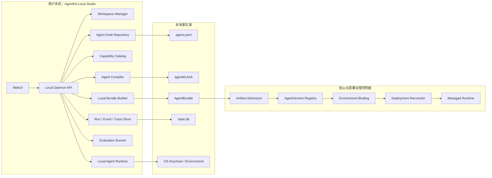
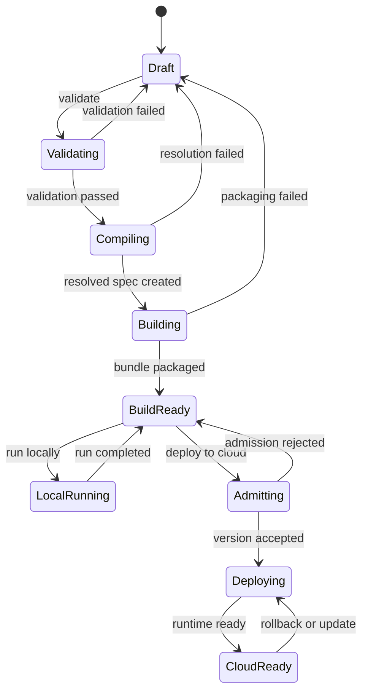
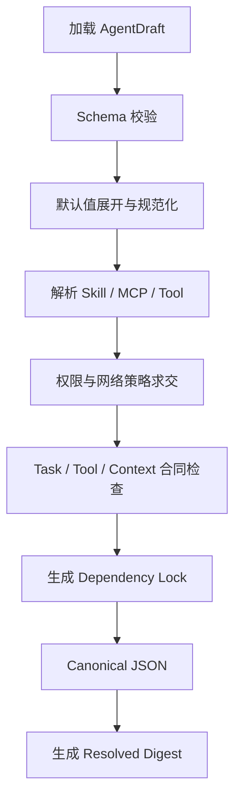
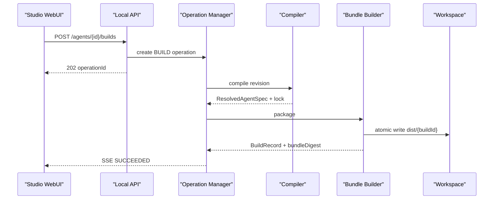
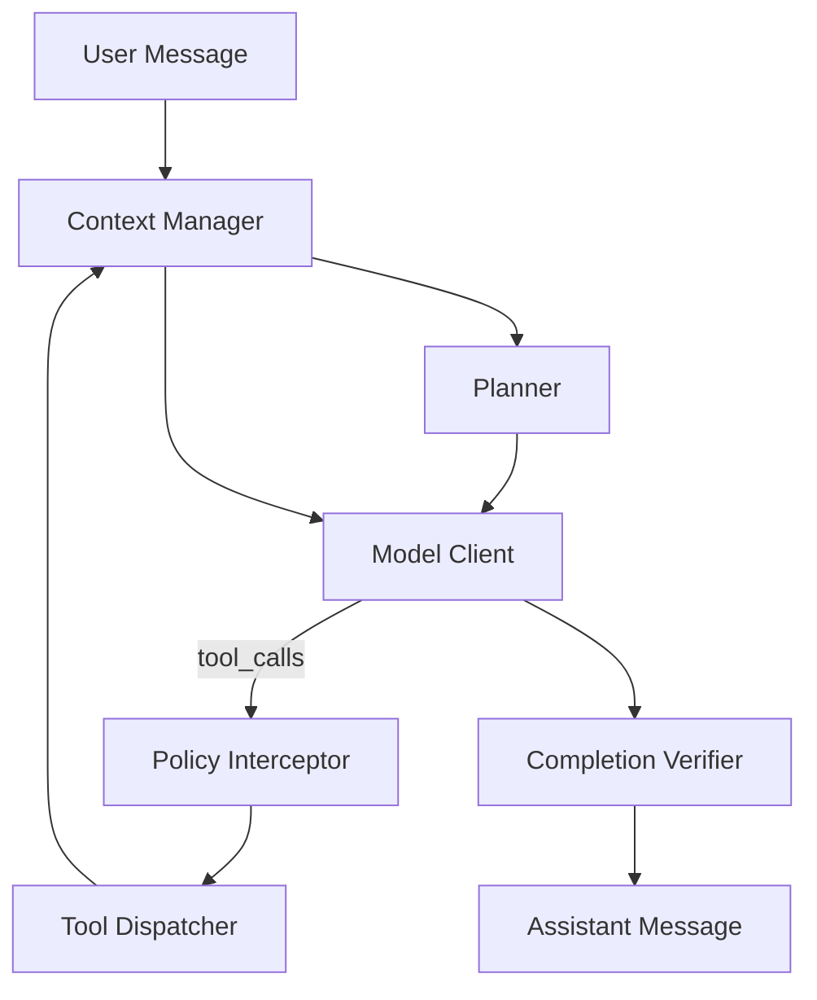

# AgentKit Local Studio 一期开发与交付设计

> 文档状态：一期开发基线
> 适用仓库：`ksadk-python`
> 开发分支：`agentkit-studio-phase1`
> 架构前提：WebUI、本地编译构建、本地运行；同一不可变制品可部署到金山云
> 非目标：工作流画布、云端重新构建、多人协同编辑、任意用户 Runtime、完整私有化安装
>
> 2026-08-01 补充：Qoder 对标后的 Resource/Binding/Resolved 重设计、产品工作台和最新
> 验收记录以 `qoder-cloud-agent-benchmark-and-phase1-redesign.md` 为准；本文保留一期完整
> 工程基线、接口与原始两轮评审。

## 1. 目标与验收口径

一期交付一套可以在用户电脑上启动的 Agent 工程控制面。用户不编写框架代码，也能通过
WebUI 创建声明式 Agent，配置模型、Skill、MCP、工具、执行策略、上下文、权限和评测，
在本地完成校验、编译、构建、运行与观察，最后把同一个不可变 AgentBundle 注册并部署到
云端。

一期完成的唯一判断标准不是“页面可点击”，而是下面的端到端事实同时成立：

1. `agentengine studio <workspace>` 只监听 loopback 地址并打开本地 WebUI。
2. WebUI 创建的 Agent 定义持久化为工作区内可读、可提交 Git 的 YAML。
3. 同一 Agent revision 重复构建产生相同 `ResolvedAgentSpec` digest 和 Bundle digest。
4. 本地 Runtime 只运行构建后的 Bundle，不绕过构建直接运行 Draft。
5. 一次真实模型调用可以生成完整的 Run、Event、Usage 和 Trace 数据。
6. Skill、MCP 和 Tool 都经过显式合同、权限和版本解析，不能以未锁定的 `latest` 发布。
7. Secret 只以引用进入 AgentSpec 和 AgentBundle，明文不进入 YAML、日志、事件和测试快照。
8. 云端接收的是本地 Bundle digest；云端只做准入、环境绑定和部署，不重新编译。
9. 每个功能域都有独立单元测试；最终 E2E 从空工作区创建并运行一个 Agent。

## 2. 一期功能清单

| ID | 功能域 | 一期交付能力 | 验收证据 |
|---|---|---|---|
| F01 | Studio 启动 | CLI、loopback HTTP、Bootstrap、静态 WebUI、健康检查 | CLI/API 测试，浏览器 smoke |
| F02 | Workspace | 打开目录、初始化结构、路径防逃逸、文件索引 | Workspace 单测 |
| F03 | Agent Draft | 创建、读取、更新、删除、revision 乐观锁 | Repository/API 单测 |
| F04 | 能力装配 | Model、Skill、MCP、Tool 的声明、发现、探测和锁定 | Resolver 单测 |
| F05 | 合同与权限 | Task/Tool/Context/Security 合同及静态校验 | Validator 单测 |
| F06 | Agent Compiler | Draft 规范化、默认值展开、依赖解析、生成 ResolvedAgentSpec | 确定性编译测试 |
| F07 | Local Builder | Lock、Bundle、checksum、SBOM/provenance、构建历史 | Builder 单测 |
| F08 | Local Runtime | 加载 Bundle、调用 OpenAI-compatible 模型、取消和超时 | Runtime 单测、真实模型 E2E |
| F09 | Evaluation | 数据集、断言、批量运行、通过率和门禁 | Evaluator 单测 |
| F10 | Observe | Run、Event、Usage、ToolReceipt、Trace、本地查询和 SSE | Event store/API 单测 |
| F11 | Cloud Deploy | 上传抽象、准入请求、EnvironmentBinding、Deployment 状态 | Gateway 合同测试 |
| F12 | 版本回滚 | 本地不可变 Build、云端 AgentVersion、按 digest 回滚 | Version/Deployment 测试 |

## 3. 总体架构



### 3.1 控制面边界

| 平面 | 部署位置 | 可以改变什么 | 不可以改变什么 |
|---|---|---|---|
| Local Authoring Plane | 用户本机 | Draft、依赖锁、Build、Local Run | 云端 Deployment 实际状态 |
| Cloud Deployment Plane | 金山云 | Version 注册、Binding、Deployment、Release | Bundle 内 Agent 执行语义 |
| Runtime Plane | 本地和云端 | Session、Run、Checkpoint、事件 | AgentVersion 和 Bundle |

### 3.2 一次完整生命周期



## 4. 代码模块与独立开发边界

一期在 `ksadk` 下新增 `studio` 包。模块之间只通过 Pydantic 合同或 Protocol 交互，不直接
读取对方的私有文件。

```text
ksadk/
├── studio/
│   ├── contracts.py       # AgentSpec、Build、Run、Evaluation、Deployment 合同
│   ├── errors.py          # 稳定错误码与 HTTP 映射
│   ├── workspace.py       # Workspace 初始化与路径安全
│   ├── repository.py      # Draft、Build、Run 的持久化
│   ├── capabilities.py    # Model/Skill/MCP/Tool catalog 和 resolver
│   ├── validator.py       # Schema、合同、权限和发布门禁
│   ├── compiler.py        # Draft -> ResolvedAgentSpec
│   ├── builder.py         # ResolvedAgentSpec -> AgentBundle
│   ├── model_client.py    # OpenAI-compatible chat/completions
│   ├── runtime.py         # 本地 Harness 和运行状态机
│   ├── evaluation.py      # 评测数据集和断言执行
│   ├── operations.py      # 异步 Operation 与 SSE
│   ├── cloud.py           # 云端 Artifact/Deployment Gateway Protocol
│   ├── service.py         # 应用服务编排
│   ├── api.py             # FastAPI local control plane
│   └── static/            # 本地 Studio WebUI
└── cli/
    └── cmd_studio.py      # agentengine studio
```

独立开发约束：

- `contracts.py` 不依赖 FastAPI、Click、具体 Runner 或云端 SDK。
- `compiler.py` 是纯函数核心；相同输入必须得到字节级稳定输出。
- `builder.py` 不访问模型，不执行 Agent，不读取明文 Secret。
- `runtime.py` 只加载 Build，不接受可变 Draft。
- `cloud.py` 只接受 Build digest 和 EnvironmentBinding，不读取工作区内部结构。
- `api.py` 只处理协议、鉴权和错误映射，不承载业务算法。
- WebUI 只调用 `/api/v1`，不直接访问文件系统、进程、Docker 或 Secret 存储。

## 5. 工作区与持久化设计

```text
workspace/
├── agentkit.yaml
├── agents/
│   └── {agent_id}/
│       ├── agent.yaml
│       ├── instructions/
│       │   ├── system.md
│       │   └── task.md
│       └── evaluations/
│           └── smoke.yaml
├── capabilities/
│   ├── skills/
│   ├── tools/
│   └── mcp-servers.yaml
├── environments/
│   ├── local.yaml
│   └── cloud.yaml
├── agentkit.lock
├── .agentkit/
│   ├── state.db
│   ├── operations/
│   ├── runs/
│   ├── cache/
│   └── builds/
└── dist/
    └── {agent_id}/{build_id}/
```

存储原则：

- `agents/**`、`capabilities/**`、`environments/**` 和 `agentkit.lock` 是 Git 友好的事实源。
- `.agentkit/state.db` 只保存索引、Operation、Run 和 UI 状态，不替代 YAML。
- `dist/**` 是可重建制品，按 `build_id` 不可变。
- 所有来自 API 的相对路径都先 `resolve()`，并验证结果仍位于 workspace root。
- 原子写入采用临时文件、`fsync` 和 `replace`；失败时保留旧 revision。

## 6. 核心合同

### 6.1 AgentDraft

```yaml
apiVersion: agentkit.ksyun.com/v1alpha1
kind: Agent
metadata:
  id: research-agent
  name: Research Agent
  revision: 1
  labels:
    team: platform
spec:
  description: 面向技术资料的研究助手
  instructions:
    system: 你是一个严谨的企业研究助手。
    task: 回答用户问题，并明确区分事实和推断。
  model:
    provider: openai-compatible
    model: glm-5.1
    endpointUrl: https://example.invalid/v1/chat/completions
    credentialRef: env://AGENTKIT_MODEL_API_KEY
    parameters:
      temperature: 0.2
      maxTokens: 2048
  capabilities:
    skills: []
    mcpServers: []
    tools: []
  execution:
    strategy: plan-act-observe
    maxSteps: 12
    timeoutSeconds: 120
    retry:
      maxAttempts: 2
      backoffSeconds: 1
  context:
    maxInputTokens: 32000
    reserveOutputTokens: 4096
    compaction:
      enabled: true
      thresholdRatio: 0.8
  security:
    toolPolicy: deny-by-default
    allowedPermissions: []
    network:
      mode: restricted
      allowedHosts: []
  evaluation:
    suiteRefs:
      - evaluations/smoke.yaml
    minimumPassRate: 1.0
```

### 6.2 Task Contract

| 字段 | 类型 | 必填 | 规则 |
|---|---|---|---|
| `instructions.system` | string | 是 | 1..32768 字符 |
| `instructions.task` | string | 否 | 0..32768 字符 |
| `execution.strategy` | enum | 是 | `direct`、`plan-act-observe` |
| `execution.maxSteps` | integer | 是 | 1..100 |
| `execution.timeoutSeconds` | integer | 是 | 1..3600 |
| `context.maxInputTokens` | integer | 是 | >= 1024 |
| `context.reserveOutputTokens` | integer | 是 | 小于 `maxInputTokens` |

模型地址接受两种互斥表达：

- `endpointUrl`：完整 chat completions 地址，适合平台直接提供请求地址的场景。
- `baseUrl`：OpenAI-compatible API 根地址，Compiler 规范化为
  `{baseUrl.rstrip('/')}/chat/completions`。

二者同时存在或同时缺失都视为合同错误。`ResolvedAgentSpec` 只保存规范化后的
`endpointUrl`，避免 Runtime 猜测或重复拼接路径。

### 6.3 Tool Contract

```yaml
name: search_documents
version: 1.2.0
description: 检索授权文档
inputSchema:
  type: object
  required: [query]
  properties:
    query:
      type: string
outputSchema:
  type: object
  required: [items]
permissions:
  - documents:read
timeoutSeconds: 20
sideEffect: read
approval: never
```

校验约束：

- `inputSchema` 和 `outputSchema` 必须是合法 JSON Schema。
- Tool 声明的每个 permission 必须包含在 Agent `allowedPermissions`。
- `sideEffect=write|external` 时，`approval` 不能默认为 `never`。
- Tool 名在同一 ResolvedAgentSpec 内唯一。
- Tool 和 Skill 发布依赖必须有确定版本与内容 digest。

### 6.4 ResolvedAgentSpec

`ResolvedAgentSpec` 是编译产物，不允许包含环境变量值或 Secret 明文。

```json
{
  "schemaVersion": "agentkit.resolved/v1",
  "agentId": "research-agent",
  "sourceRevision": 1,
  "compilerVersion": "1",
  "model": {
    "provider": "openai-compatible",
    "model": "glm-5.1",
    "endpointUrl": "https://example.invalid/v1/chat/completions",
    "credentialRef": "env://AGENTKIT_MODEL_API_KEY",
    "parameters": {
      "maxTokens": 2048,
      "temperature": 0.2
    }
  },
  "capabilities": {
    "skills": [],
    "mcpServers": [],
    "tools": []
  },
  "execution": {},
  "context": {},
  "security": {},
  "evaluation": {},
  "sourceDigest": "sha256:...",
  "resolvedDigest": "sha256:..."
}
```

### 6.5 AgentBundle

```text
agent-bundle/
├── manifest.json
├── resolved-agent-spec.json
├── agentkit.lock
├── instructions/
├── capabilities/
├── evaluations/
├── sbom.spdx.json
├── provenance.json
└── checksums.txt
```

`manifest.json` 的稳定字段：

| 字段 | 说明 |
|---|---|
| `bundleFormat` | 固定 `agentkit.bundle/v1` |
| `agentId` | Agent 稳定 ID |
| `sourceRevision` | Draft revision |
| `resolvedDigest` | ResolvedAgentSpec digest |
| `runtimeContract` | 固定 `agentkit.runtime/v1` |
| `files` | 相对路径、SHA-256、字节数 |
| `createdAt` | 展示字段，不参与内容 digest |
| `bundleDigest` | 排除自身和展示时间后的 canonical digest |

Bundle 归档还必须固定：

- 文件按 UTF-8 相对路径排序。
- Zip entry 时间统一为 `1980-01-01T00:00:00Z`。
- 普通文件 mode 固定为 `0644`，不继承开发机 umask。
- 不写入 uid、gid、用户名、主机名和绝对路径。
- 压缩算法和压缩级别由 Bundle format v1 固定。

所以“相同输入产生相同 digest”既包括 Resolved JSON，也包括最终可上传归档的字节。

### 6.6 Capability Resolver Protocol

Compiler 只依赖下面的抽象合同：

```python
class CapabilityResolver(Protocol):
    def resolve_model(self, ref: ModelRef) -> ResolvedModel: ...
    def resolve_skill(self, ref: SkillRef) -> ResolvedSkill: ...
    def resolve_mcp(self, ref: MCPServerRef) -> ResolvedMCPServer: ...
    def resolve_tool(self, ref: ToolRef) -> ResolvedTool: ...
```

一期解析来源：

| kind | 本地来源 | 锁定结果 |
|---|---|---|
| Model | AgentSpec 显式配置、本地 provider catalog | provider、model、endpoint、参数 |
| Skill | workspace `capabilities/skills/{name}` | name、semver、content SHA-256、入口 |
| MCP | `capabilities/mcp-servers.yaml` 和 probe 结果 | transport、server identity、tool contracts digest |
| Tool | workspace tool contract 或 MCP tool | name、semver、schema digest、permissions |

依赖引用允许 `name@1.2.3` 或同时给出 `version`；发布构建不接受 semver range、branch、tag 和
`latest`。开发期 MCP probe 可以没有服务端版本，但这种能力只能本地运行，release validation
必须失败。

## 7. 编译与构建设计

### 7.1 编译流水线



确定性要求：

- Map key 排序，UTF-8，JSON 分隔符固定，无无意义空白。
- 浮点配置先由 Pydantic 转成受控类型。
- 依赖按 `(kind, name, version, digest)` 排序。
- 时间、绝对路径、机器名和随机 ID 不进入 resolved digest。
- 不允许依赖版本 `latest`、空版本或可变 URL。
- `credentialRef` 可以进入 digest，credential value 不能进入。

### 7.2 构建流水线



### 7.3 Build 状态

`QUEUED -> VALIDATING -> RESOLVING -> COMPILING -> PACKAGING -> SUCCEEDED`

任意中间状态可以进入 `FAILED` 或 `CANCELLED`。失败必须返回稳定错误码、阶段、字段路径和
可执行建议，不能只返回 Python traceback。

并发和恢复语义：

- Daemon 在开始构建时复制目标 revision 的规范化快照，后续 Draft 更新不影响本次 Build。
- 同一 `agentId + revision + buildOptionsDigest` 只允许一个活动 Build。
- 相同 `Idempotency-Key` 返回第一次创建的 Operation，不重复执行。
- 不同 Agent 可以并行；一期默认最大 Build 并发为 2。
- Daemon 重启后，未进入终态的本地 Build 标记为 `INTERRUPTED`，用户可以显式重试。
- `CANCELLED` 和 `INTERRUPTED` 不生成可运行 Bundle。
- SQLite 使用 WAL；Operation 事件和状态变更在同一事务提交。

## 8. 本地 Runtime 与模型调用

一期 Harness 执行 `direct` 和最小 `plan-act-observe`：



一期模型协议：

- `POST {endpointUrl}`；`baseUrl` 在编译阶段规范化为完整地址
- Header：`Authorization: Bearer <resolved secret>`
- 请求：`model`、`messages`、`temperature`、`max_tokens`、`tools`、`stream`
- 响应：支持非流式作为强制基线，流式为兼容增强
- 超时：连接 10 秒，总请求使用 Agent `timeoutSeconds`
- 重试：只重试连接错误、429 和 5xx；不重试 4xx 合同错误
- 日志：Authorization、Cookie、URL query secret 和消息敏感字段必须脱敏
- Redirect：关闭自动跳转，避免 credential 被转发到未授权 host
- Response：限制响应 body 和单事件大小，超限返回稳定错误

模型和 HTTP MCP 请求执行 SSRF 控制：

- `security.network.allowedHosts` 是显式 allowlist，匹配规范化 hostname，不接受 URL 子串。
- DNS 解析后的每个地址都要检查，禁止未授权 private、loopback、link-local 和 multicast。
- `169.254.169.254`、`fd00:ec2::254` 等实例元数据地址无条件拒绝。
- 本地模型或本地 MCP 必须显式设置 `allowPrivateNetwork: true` 并将 host 加入 allowlist。
- 每次连接和重试都重新校验目标；不跟随 3xx。

Run 状态：

`CREATED -> RUNNING -> COMPLETED | FAILED | CANCELLED | TIMED_OUT`

事件最小集合：

| 事件 | 关键字段 |
|---|---|
| `run.created` | runId、buildId、sessionId |
| `run.started` | startedAt |
| `model.requested` | model、messageCount，不含 credential |
| `model.completed` | finishReason、usage |
| `message.delta` | text |
| `tool.requested` | toolCallId、tool、argumentsDigest |
| `tool.completed` | toolCallId、status、durationMs、resultDigest |
| `run.completed` | output、usage、durationMs |
| `run.failed` | errorCode、safeMessage |
| `run.cancelled` | reason |

## 9. Evaluation 设计

一期评测文件：

```yaml
apiVersion: agentkit.ksyun.com/v1alpha1
kind: EvaluationSuite
metadata:
  name: smoke
cases:
  - id: basic-answer
    input: 只回复 AGENTKIT_E2E_OK
    assertions:
      - type: contains
        value: AGENTKIT_E2E_OK
      - type: maxLatencyMs
        value: 60000
```

一期断言：

- `contains`
- `equals`
- `notContains`
- `jsonSchema`
- `maxLatencyMs`
- `maxInputTokens`
- `maxOutputTokens`
- `toolCalled`
- `toolNotCalled`

EvaluationRun 状态和 Run 一致。评测门禁以 `passed / total >= minimumPassRate` 判定；没有配置
评测集时允许本地 Build，但云端 Production Admission 默认拒绝。

## 9.1 一期 Tool 与 Context 执行边界

一期提供两个通用内置 Tool 和五个工作区 Tool，作为 Harness、权限与 Tool Contract 的
可执行基线：

- `builtin.echo@1.0.0`：回显结构化输入，用于合同与事件测试。
- `builtin.current_time@1.0.0`：返回明确时区的当前时间，权限 `system:time:read`。
- `workspace.read@1.0.0`：读取工作区 UTF-8 文本。
- `workspace.write@1.0.0`：原子写入工作区文件。
- `workspace.edit@1.0.0`：执行精确文本替换。
- `workspace.glob@1.0.0`：按 pattern 列举文件。
- `workspace.grep@1.0.0`：在工作区文本中搜索。

MCP Tool 通过 Studio 的 `MCPRuntimeAdapter` 调用官方 MCP Python SDK；Studio 不在 API 层
自行实现 MCP wire protocol。一期可执行 transport 固定为 `stdio`，`http`/`sse` 保留在声明
合同中但探测和执行明确返回 `MCP_TRANSPORT_UNSUPPORTED(501)`，不得静默降级。Skill 一期
是本地、版本化、带 digest 的能力包，构建时复制到 Bundle 并将 `SKILL.md` 指令注入 system
context。任意 Tool 调用都先经过 permission/approval Policy Interceptor，再进入 Tool
Dispatcher；`approval=always|policy` 在一期没有人工审批工作台时以
`TOOL_APPROVAL_REQUIRED(409)` 阻断，不允许绕过执行。

Context Manager 一期行为：

1. 计算 system、history、tool result 和新输入的预算。
2. 为输出保留 `reserveOutputTokens`。
3. 达到 `thresholdRatio` 时，按最旧普通消息优先压缩。
4. system 指令、当前输入、未完成 Tool call 和最近一轮消息不能被删除。
5. 压缩前后发出 `context.compaction.started/completed` 事件。

Tokenizer 不可用时，Context Manager 可以使用保守字符估算做本地预算，但该估算只属于
上下文裁剪内部信息，**不得写入 Provider Usage 或 Trace Token 指标**。Trace 中的
`gen_ai.usage.*` 只接受模型 Provider 或 Runtime 明确上报的值；未上报时返回 `null`，UI
显示“未上报”，不能显示 `0` 或估算值。

## 10. Local API 设计

### 10.1 通用协议

- Base path：`/api/v1`
- JSON：UTF-8，字段使用 camelCase。
- 所有写接口接受 `X-Request-Id`；异步创建接口要求 `Idempotency-Key`。
- Draft 更新要求 `If-Match: "<revision>"`。
- 异步操作返回 `202 Accepted` 和 `Operation`。
- SSE 支持 `Last-Event-ID`，事件 ID 在单个 Operation 内单调递增。
- 错误统一为：

```json
{
  "error": {
    "code": "AGENT_REVISION_CONFLICT",
    "message": "Agent 已被其他操作更新",
    "field": "metadata.revision",
    "details": {
      "expected": 2,
      "actual": 3
    },
    "requestId": "req_..."
  }
}
```

### 10.2 System 与 Workspace

#### `GET /api/v1/system/health`

响应：

```json
{
  "status": "ok",
  "version": "0.8.0",
  "workspaceReady": true
}
```

#### `GET /api/v1/system/bootstrap`

响应字段：

| 字段 | 类型 | 说明 |
|---|---|---|
| `serverVersion` | string | Local Daemon 版本 |
| `apiVersion` | string | `v1` |
| `sessionTokenRequired` | boolean | 浏览器会话保护状态 |
| `workspace` | object/null | 当前工作区摘要 |
| `features` | object | build/run/evaluation/deployment 等能力开关 |

#### `POST /api/v1/workspaces:open`

请求：

```json
{
  "path": "/absolute/path/to/workspace",
  "create": true
}
```

规则：只允许 Daemon 启动参数允许的 root 或用户明确选择的目录；远程请求不能静默扩大 root。

### 10.3 Agent Draft

#### `POST /api/v1/agents`

```json
{
  "id": "research-agent",
  "name": "Research Agent",
  "description": "技术研究助手",
  "template": "blank"
}
```

约束：

- `id`：`^[a-z][a-z0-9-]{2,62}$`
- `name`：1..128 字符
- `description`：0..1024 字符
- 重复 ID 返回 `409 AGENT_ALREADY_EXISTS`

#### `GET /api/v1/agents`

Query：

| 参数 | 默认 | 说明 |
|---|---|---|
| `limit` | 50 | 1..200 |
| `cursor` | 空 | 不透明游标 |
| `query` | 空 | ID、name 模糊搜索 |

#### `GET /api/v1/agents/{agentId}`

返回 `AgentDraft`、最近 Build 摘要和最近一次校验摘要。

#### `PUT /api/v1/agents/{agentId}`

Header：`If-Match: "3"`

Body：完整 `AgentDraft.spec`。成功后 revision 增一。revision 不一致返回 409。

#### `DELETE /api/v1/agents/{agentId}`

Query `purge=false`。默认软删除定义文件到 workspace trash；已经构建的 Bundle 不删除。

### 10.4 Capability

#### `GET /api/v1/capabilities`

Query：

| 参数 | 值 |
|---|---|
| `kind` | `model`、`skill`、`mcp`、`tool` |
| `query` | 名称搜索 |
| `status` | `ready`、`invalid`、`unresolved` |

#### `POST /api/v1/mcp-servers:probe`

```json
{
  "transport": "stdio",
  "command": "node",
  "args": ["./server.js"],
  "envRefs": {
    "TOKEN": "env://MCP_TOKEN"
  },
  "timeoutSeconds": 10
}
```

响应只返回 server info、tool contracts 和安全诊断，不返回解析后的 Secret。

### 10.5 Validation、Build 与 Artifact

#### `POST /api/v1/agents/{agentId}/validations`

```json
{
  "revision": 3,
  "level": "build"
}
```

`level`：`schema`、`build`、`release`。

#### `POST /api/v1/agents/{agentId}/builds`

Header：`Idempotency-Key: research-agent-r3`

```json
{
  "revision": 3,
  "runEvaluation": true,
  "evaluationSuiteRefs": ["evaluations/smoke.yaml"]
}
```

响应：

```json
{
  "operationId": "op_...",
  "kind": "BUILD",
  "status": "QUEUED",
  "resourceId": "build_..."
}
```

#### `GET /api/v1/builds/{buildId}`

返回 source revision、resolved digest、bundle digest、状态、诊断、评测摘要和本地相对路径。

#### `GET /api/v1/builds/{buildId}/manifest`

返回 Bundle manifest，不返回任意本地绝对路径。

#### `GET /api/v1/operations/{operationId}/events`

SSE。Query `after` 可作为不支持 `Last-Event-ID` 客户端的回退。

#### `POST /api/v1/operations/{operationId}:cancel`

幂等。终态 Operation 再次取消返回原终态。

### 10.6 Local Run 与 Observe

#### `POST /api/v1/builds/{buildId}/runs`

```json
{
  "sessionId": "ses_optional",
  "input": {
    "role": "user",
    "content": "只回复 AGENTKIT_E2E_OK"
  },
  "environment": "local",
  "stream": true
}
```

#### `GET /api/v1/runs/{runId}`

返回状态、输入输出、usage、duration、错误摘要和 traceId。

#### `GET /api/v1/runs/{runId}/events`

SSE，支持断线续传。

#### `POST /api/v1/runs/{runId}:cancel`

取消正在进行的模型请求或 Tool 调用，并发出 `run.cancelled`。

#### `GET /api/v1/traces/{traceId}`

返回由标准 OTLP JSON 派生的 `TraceView`，包含 Run、Model、Tool Span 树、父子关系、
Attributes、Events、Resource、Scope 和精确指标。该接口不返回自定义 RunEvent 列表，也
不负责跳转会话页。

#### `GET /api/v1/traces`

返回 Trace 摘要列表，支持 `agentId`、`status` 和 `limit` 筛选，供独立 Trace Explorer
使用。Trace 列表和详情不依赖当前选中的会话或 Agent。

#### `GET /api/v1/traces/{traceId}/otlp`

返回规范 OTLP JSON：`resourceSpans -> scopeSpans -> spans`。`traceId` 固定 32 位十六进制，
`spanId` 固定 16 位十六进制，纳秒时间使用 Protobuf JSON 字符串。Studio 本地持久化的
事实源是该 OTLP 文档；`TraceView` 只是无损 UI 读模型。

Runtime 与 Trace 的边界固定为：Runtime 产生统一 `RuntimeEvent`，`TraceAdapter` 单向投影
为 OTLP。原生 Runtime 若能直接产生 `RuntimeEvent`，`RunnerRuntimeAdapter` 必须优先消费
标准事件流，不得先压平成临时 chunk 再解析回来。Token 只接受 `USAGE_REPORTED`；总耗时
优先接受 `RUN_COMPLETED.duration_ms`，缺失时才使用 Studio 单调时钟回退，并明确标记
`agentkit.duration.source=studio`。

### 10.7 Evaluation

#### `POST /api/v1/builds/{buildId}/evaluations`

```json
{
  "suiteRefs": ["evaluations/smoke.yaml"],
  "concurrency": 1,
  "failFast": false
}
```

`concurrency` 一期范围 1..4；响应为异步 Operation。

#### `GET /api/v1/evaluations/{evaluationRunId}`

返回总数、通过数、失败数、passRate、各 case 断言和关联 runId。

### 10.8 Secret Reference

#### `POST /api/v1/secret-references:check`

```json
{
  "ref": "env://AGENTKIT_MODEL_API_KEY"
}
```

响应只包含 `exists`、`scheme`、`source` 和安全诊断。

#### `GET /api/v1/credentials/{credentialName}`

只返回 `reference`、`configured`、`source` 和 `persistence`，不返回 Secret value、长度、摘要
或可用于离线猜测的信息。

#### `PUT /api/v1/credentials/{credentialName}`

```json
{
  "value": "<password input>",
  "persistence": "session"
}
```

一期只允许 `session` 持久级别。请求必须同时通过 loopback Host、local Origin、HttpOnly
Session Cookie 和 CSRF 校验；API 进程将 value 写入与 Runtime 共享的内存覆盖层，前端请求
完成后立即清空密码输入框。value 不写工作区、`.env`、AgentSpec、Bundle、Operation、Run、
Trace、日志或响应。

#### `DELETE /api/v1/credentials/{credentialName}`

只清除当前 Studio 会话覆盖值；若启动环境已存在同名变量，删除后自动回退到环境变量。

#### `POST /api/v1/model-profiles/{resourceId}:test`

使用当前凭证执行最小 OpenAI-compatible 请求，只返回 `ok`、模型、finishReason 和延迟，
不返回模型响应正文或 Credential。

任何 `GET` API 都不能返回 Secret value。

### 10.9 Cloud Deployment

#### `POST /api/v1/builds/{buildId}/deployments`

```json
{
  "target": {
    "region": "cn-beijing-6",
    "environment": "development"
  },
  "binding": {
    "model": {
      "primary": "cloud-model://glm-5.1"
    },
    "secrets": {
      "model-api-key": "secret-manager://agentkit/model-api-key"
    }
  },
  "releasePolicy": {
    "strategy": "rolling",
    "approval": "none"
  }
}
```

响应异步 Operation。Cloud Gateway 固定步骤：

1. `CreateArtifactUpload`
2. 按临时凭证上传 Bundle
3. `CreateAgentVersion(bundleDigest, provenance)`
4. `CreateDeployment(versionId, binding, releasePolicy)`
5. 查询或订阅 Deployment 状态

如果服务端尚未支持 Bundle Admission，一期适配器必须返回
`CLOUD_BUNDLE_ADMISSION_UNAVAILABLE`，不能伪装部署成功，也不能改走云端重新构建。

## 11. WebUI 信息架构

WebUI 延续已经确认的轻量云控制台视觉语言：247px 左侧栏、薄顶栏、白色工作面、浅灰分隔、
绿色表示已就绪、黑色主操作。交互工作面而非营销页。

```text
┌────────────────────────────────────────────────────────────────────┐
│ AgentKit Studio        Workspace: research       本地 ●  云端 ○    │
├──────────────┬─────────────────────────────────────────────────────┤
│ 快速开始      │  Agent: Research Agent          revision 3          │
│ Agent         ├─────────────────────────────────────────────────────┤
│ 能力          │  [定义] [能力] [构建] [测试] [部署] [观测]          │
│ 构建          │                                                     │
│ 测试          │  当前页主工作区                                     │
│ 部署          │                                                     │
│ 可观测        │                                                     │
├──────────────┴─────────────────────────────────────────────────────┤
│ build sha256:...  已通过 12 项检查             [本地运行] [部署]    │
└────────────────────────────────────────────────────────────────────┘
```

一期页面：

- 快速开始：创建第一个 Agent，配置模型，构建，第一次运行。
- Agent：表单和 YAML 双视图，revision 冲突提示。
- 能力：Model、Skill、MCP、Tool 状态和合同。
- 构建：阶段日志、诊断、Bundle manifest、digest。
- 测试：输入、流式输出、事件、usage、评测集。
- 部署：目标、Binding、Admission 结果、Deployment 状态和回滚。
- 可观测：独立 Trace Explorer、Agent/状态筛选、Span 父子树与耗时瀑布、Attributes、
  Events、Resource、Raw OTLP；点击 Trace 不改变会话状态。

## 12. 安全控制

### 12.1 Local Daemon

- 默认只允许 `127.0.0.1` 和 `::1`，`--host 0.0.0.0` 一期直接拒绝。
- 启动生成随机 session token，使用 HttpOnly、SameSite=Strict Cookie 或首屏交换。
- 校验 `Origin` 和 `Host`，拒绝 DNS rebinding。
- 写请求要求 CSRF token；CLI 直连使用受限 bearer token。
- 请求体默认上限 2 MiB，Bundle 下载和上传使用流式接口单独限额。
- 静态文件路径和 workspace 文件路径分别做根目录约束。
- 不允许 WebUI 传任意 shell command；MCP stdio 使用结构化 command/args 和允许策略。
- MCP 进程使用 `shell=False`、最小环境变量、工作区内 cwd；工作区外 executable 需要本地确认。

### 12.2 Secret 与日志

- 允许的引用 scheme：`env://`、`keychain://`、`secret-manager://`。
- 编译器遇到疑似明文 key 字段直接失败。
- 日志脱敏：Authorization、Cookie、`api[_-]?key`、token、secret、AK/SK。
- Tool input/output 默认只记录 digest；用户明确开启内容观测才保存裁剪后的正文。
- E2E 的真实 API Key 只通过进程环境注入，不写 `.env`、YAML、pytest cache 或报告。
- Secret resolver 返回的值只存在于发起上游请求的局部变量，不放入 Pydantic dump 或异常上下文。

### 12.3 制品供应链

- Bundle 每个文件有 SHA-256。
- Provenance 包含 compiler/runtime contract、源 revision、Git commit（如存在）。
- SBOM 至少列出 Bundle format、runtime contract、Skill/Tool/MCP 锁定依赖。
- 上传云端前本地重新校验 Bundle digest。
- 云端按 digest 注册，不允许相同版本覆盖。

## 13. 错误码

| 错误码 | HTTP | 说明 |
|---|---:|---|
| `WORKSPACE_INVALID` | 400 | 工作区结构错误 |
| `WORKSPACE_PATH_FORBIDDEN` | 403 | 路径逃逸或未授权目录 |
| `AGENT_ALREADY_EXISTS` | 409 | Agent ID 重复 |
| `AGENT_NOT_FOUND` | 404 | Agent 不存在 |
| `AGENT_REVISION_CONFLICT` | 409 | 乐观锁冲突 |
| `AGENT_SCHEMA_INVALID` | 422 | Schema 错误 |
| `CAPABILITY_UNRESOLVED` | 422 | 能力无法解析 |
| `CAPABILITY_VERSION_MUTABLE` | 422 | 依赖版本可变 |
| `TOOL_PERMISSION_DENIED` | 422 | Tool 权限不满足 |
| `SECRET_REFERENCE_INVALID` | 422 | Secret 引用非法或疑似明文 |
| `NETWORK_TARGET_DENIED` | 403 | 模型或 MCP 地址不满足网络策略 |
| `BUILD_FAILED` | 422 | 构建失败 |
| `BUILD_NOT_READY` | 409 | Build 非成功终态 |
| `MODEL_REQUEST_FAILED` | 502 | 模型协议或上游错误 |
| `RUN_TIMED_OUT` | 504 | Run 超时 |
| `EVALUATION_GATE_FAILED` | 422 | 评测门禁未通过 |
| `CLOUD_ADMISSION_REJECTED` | 422 | 云端准入拒绝 |
| `CLOUD_BUNDLE_ADMISSION_UNAVAILABLE` | 501 | 云端暂未实现本地 Bundle 准入 |

## 14. 单元测试矩阵

### 14.1 F01-F03

- CLI 默认 host、随机 token、端口和 `--no-open`。
- 非 loopback host 被拒绝。
- Workspace 初始化目录完整。
- `../`、软链接和编码路径逃逸被拒绝。
- Draft 创建写出合法 YAML。
- 原子更新 revision 增一。
- 错误 `If-Match` 不改变文件。
- 同 ID 冲突和软删除语义。

### 14.2 F04-F07

- Model 参数边界。
- Skill/MCP/Tool 解析排序和锁定。
- `latest`、空版本、digest 不匹配失败。
- JSON Schema 非法时给出字段路径。
- Tool permission、side effect 和 approval 组合检查。
- Secret value 检测和 credentialRef 白名单。
- 同输入重复编译 digest 相同。
- key 顺序、YAML 排版和绝对路径不影响 digest。
- Bundle 文件、checksum、manifest 和 provenance 完整。
- 中途失败不留下半成品目录。
- 同 revision 的幂等 Build 返回同一结果。

### 14.3 F08-F10

- 模型请求字段和 Authorization 注入正确。
- 429/5xx 重试，400 不重试。
- redirect、metadata address、DNS/private address 和 allowlist 控制。
- timeout/cancel 状态和事件正确。
- API Key 不出现在异常、事件和日志。
- Run 只接受成功 Build。
- 事件序号单调，SSE `Last-Event-ID` 可续传。
- usage 聚合正确。
- Evaluation 每类断言通过和失败。
- minimumPassRate 边界。
- Trace span 父子关系、OTLP JSON 合法性和 W3C Trace/Span ID 长度。
- Provider/Runtime 未上报 Usage 时 UI 显示“未上报”，不得显示 0 或估算值。
- Runtime 上报耗时为权威值；Studio 回退耗时必须展示来源。
- Trace 深链刷新后仍停留在 `view=observability&traceId=...`，不跳转会话页。

### 14.4 F11-F12

- 上传前 digest 二次校验。
- Cloud Gateway 请求不携带本地 Secret value 和绝对路径。
- Admission 拒绝映射稳定错误码。
- Deployment 状态映射。
- 相同 Idempotency-Key 不产生重复版本。
- 回滚只允许历史成功 AgentVersion。
- 云端不支持 Admission 时显式 501。

### 14.5 API 与 WebUI

- 所有 endpoint 的成功、参数错误、404、409 和 422。
- 写接口 Origin/CSRF/session token。
- 响应中不出现 workspace 之外的绝对路径。
- 页面能够创建 Agent、编辑、构建、运行、查看事件。
- 桌面 1440x900、宽屏 1920x1080、移动 390x844 无横向溢出和文字遮挡。
- 非法 Origin、Host、CSRF、超大请求体和静态路径逃逸被拒绝。

## 15. E2E 设计

最终 E2E 在临时 workspace 执行，不依赖开发者已有 Agent：

```text
1. 启动 Local Studio
2. GET /system/health
3. POST /agents 创建 e2e-agent
4. PUT /agents/e2e-agent 配置 glm-5.1 和 env://AGENTKIT_E2E_API_KEY
5. POST /validations，断言无 error
6. POST /builds 并等待 Operation SUCCEEDED
7. 校验 manifest、resolvedDigest、bundleDigest
8. 对相同 revision 再构建，断言 digest 完全一致
9. POST /builds/{id}/runs，输入“只回复 AGENTKIT_E2E_OK”
10. 等待 Run COMPLETED
11. 断言输出包含 AGENTKIT_E2E_OK
12. 断言 model.completed、run.completed、usage 和 trace 存在
13. 扫描 workspace、Bundle、日志与测试报告，断言不存在 API Key
14. 通过 Mock Cloud Gateway 注册同一 bundleDigest 并创建 Deployment
15. 断言云端请求没有重新构建动作
```

真实模型 E2E 使用：

- Base URL：通过 `AGENTKIT_E2E_BASE_URL` 注入。
- Model：通过 `AGENTKIT_E2E_MODEL` 注入，目标为 `glm-5.1`。
- API Key：只通过 `AGENTKIT_E2E_API_KEY` 注入。
- 测试没有这些变量时明确 `skip`，不能伪造“真实 E2E 通过”。

云端真实部署 E2E 额外需要 Cloud API endpoint、租户身份、目标 region 和服务端 Bundle Admission
已上线；只有模型 API Key 时执行到“真实本地构建与运行 + Mock Cloud Contract”，并在交付报告中
区分两种证据。

## 16. 开发计划

| 阶段 | 功能 | 主要交付物 | 完成门禁 |
|---|---|---|---|
| D1 | Contracts/Errors | Pydantic 合同、错误码 | Contract 单测 |
| D2 | Workspace/Draft | 文件布局、Repository、revision | F02/F03 单测 |
| D3 | Capability/Validation | Resolver、Schema、权限策略 | F04/F05 单测 |
| D4 | Compiler/Builder | ResolvedSpec、Lock、Bundle | 确定性和制品测试 |
| D5 | Runtime/Observe | Model client、Run、Event、Trace | Mock 模型集成测试 |
| D6 | Evaluation | Suite、assertion、门禁 | Evaluation 单测 |
| D7 | Local API/CLI | FastAPI、SSE、`studio` 命令 | API/CLI 测试 |
| D8 | WebUI | 创建、构建、测试、部署、观测 | 浏览器 smoke |
| D9 | Cloud Gateway | Admission/Deployment Protocol | Mock cloud 合同测试 |
| D10 | E2E/Audit | 真实 glm-5.1、本地闭环、secret scan | E2E 报告 |

建议并行人员分工：

| 角色 | 人数 | 模块 |
|---|---:|---|
| Tech Lead/架构 | 1 | Contracts、边界、评审、集成 |
| Local Control Plane | 2 | Workspace、API、Operation、Security |
| Compiler/Build | 2 | Resolver、Compiler、Bundle、Provenance |
| Runtime/Harness | 2 | Model、Tool、MCP、Context、Event |
| WebUI | 2 | Studio 工作面、状态、SSE、可访问性 |
| Cloud Integration | 1 | Admission、Version、Deployment |
| QA/SDET | 1 | Contract、E2E、兼容和安全测试 |

## 17. 两轮详细评审记录

### 17.1 第一轮：架构一致性与范围评审

评审问题：

1. 是否错误地把正式构建放回云端？
2. 本地事实源、不可变 Build、云端 Version 是否清晰分离？
3. 本地和云端是否运行同一个 Bundle 和 Runtime Contract？
4. 每个模块是否可以独立测试和替换？
5. 一期是否误做成 Workflow 产品？

发现与处理：

| 级别 | 发现 | 处理 |
|---|---|---|
| P0 | 如果 Local Runtime 直接读取 Draft，本地测试无法证明云端制品可运行 | 强制 Runtime API 只接受成功 Build |
| P0 | 环境地址和 Secret 混入 Bundle 会破坏端云复用 | 增加 EnvironmentBinding，Bundle 只保留引用 |
| P1 | 云端若不支持 Bundle Admission，适配器可能退回既有云构建 | 固定返回 501，不允许隐式重新构建 |
| P1 | SQLite 成为 Draft 唯一存储会削弱 Git/IDE 能力 | YAML 作为事实源，SQLite 只存运行状态 |
| P1 | 任意代码 Agent 会扩大一期隔离与供应链范围 | 一期只交付声明式 Agent；代码扩展保留合同 |
| P2 | `createdAt` 会导致相同输入 Bundle digest 不同 | 展示时间不参与 canonical digest |
| P1 | 平台提供的可能是完整 completions URL，Runtime 再拼路径会调用错误 | 同时定义 `endpointUrl`/`baseUrl`，Compiler 只输出完整 endpoint |
| P1 | JSON digest 稳定不代表最终 zip 字节稳定 | 固定 entry 顺序、时间、mode 和压缩参数 |
| P1 | Compiler 直接读取 Skill/MCP 目录会破坏独立模块边界 | 增加 `CapabilityResolver` Protocol |

第一轮结论：通过。端侧负责“做出 Agent”，云侧负责“接收和治理同一制品”，没有工作流画布
或云端重构建路径。

### 17.2 第二轮：安全、失败语义与可测试性评审

评审问题：

1. 浏览器访问本地 Daemon 是否存在 DNS rebinding、CSRF 和路径逃逸？
2. Secret 是否可能进入 AgentSpec、Bundle、事件、日志或 E2E 报告？
3. 幂等、取消、超时、revision 冲突是否有可验证语义？
4. 真实模型测试与云部署测试是否被混为一谈？
5. “所有功能有单测”是否能按功能域追踪？

发现与处理：

| 级别 | 发现 | 处理 |
|---|---|---|
| P0 | 仅绑定 localhost 仍不足以阻断恶意网页调用本地 API | 增加 session token、Origin/Host 和 CSRF 校验 |
| P0 | API Key 若写入测试 `.env` 会进入缓存或失败报告 | E2E 只读进程环境，结束后执行定向 secret scan |
| P1 | SSE 断线后可能遗漏构建和 Run 终态 | 事件持久化并支持 `Last-Event-ID` |
| P1 | Build 重试可能产生不同 ID 和重复云端版本 | Build/Deployment 创建要求 Idempotency-Key |
| P1 | 只有模型 Key 不能证明真实云部署成功 | E2E 明确拆分真实本地模型链路和 Mock Cloud Contract |
| P1 | 任意 MCP command 可变成本地命令执行入口 | 使用结构化 command/args、工作区与允许策略，不接收 shell 字符串 |
| P2 | 错误若只保存 traceback 会向 UI 泄露绝对路径和 Secret | 稳定错误码与 safe message，traceback 仅 debug 且脱敏 |
| P0 | WebUI Secret 写入会让 key 短暂进入浏览器和 HTTP 请求内存 | 仅开放受 Session + CSRF 保护的 loopback session credential API；使用密码控件和 `SecretStr`，关闭 access log，请求后清空输入，禁止持久化、回显，并用定向 secret scan 阻断泄漏 |
| P0 | 模型/MCP URL 可被恶意 Draft 用于 SSRF 或 metadata 访问 | 加 host allowlist、DNS/IP 校验、metadata deny 和 redirect deny |
| P1 | Draft 在 Build 期间更新会造成同一 Build 混入两个 revision | Build 开始时冻结规范化 revision 快照 |
| P1 | Daemon 重启后 Operation 状态不明确 | 持久化事件，活动任务恢复为显式 `INTERRUPTED` |

第二轮结论：有条件通过。实现必须逐项满足本节 P0/P1，任何 Secret scan、确定性构建或
loopback 安全测试失败都阻断一期交付。

## 18. Definition of Done

一期只有在以下证据全部存在时才完成：

- 分支为 `agentkit-studio-phase1`，没有覆盖用户已有改动。
- 本文档中的 F01-F12 都有对应实现文件和单测。
- 相关单测、完整新增测试集和受影响既有测试通过。
- Ruff 或项目既有 lint 对新增代码通过。
- WebUI 三种视口 smoke 通过。
- 相同 revision 两次构建 digest 一致。
- 真实 `glm-5.1` E2E 创建、构建和本地 Run 通过。
- Cloud Gateway 合同 E2E 证明上传的是同一 digest，且无云端重构建。
- 定向 secret scan 证明真实 API Key 未进入 Git 工作树与生成制品。
- 最终交付报告逐项列出命令、结果、未执行的真实云部署条件和残余风险。

## 19. 实现落点与交付验证

### 19.1 模块落点

| 功能 | 实现模块 | 主要测试 |
|---|---|---|
| F01 Local Studio | `ksadk/cli/cmd_studio.py`、`ksadk/studio/api.py`、`static/index.html` | `test_cli_studio.py`、`test_api.py` |
| F02 Workspace | `workspace.py` | `test_workspace_repository.py` |
| F03 Draft | `repository.py`、`contracts.py` | `test_contracts.py`、`test_workspace_repository.py` |
| F04 Capability | `capabilities.py`、`mcp_runtime.py` | `test_validator_compiler.py`、`test_studio_mcp_runtime.py` |
| F05 Policy | `validator.py`、`runtime.py` | `test_validator_compiler.py`、`test_runtime.py` |
| F06 Compiler | `compiler.py` | `test_validator_compiler.py` |
| F07 Builder | `builder.py` | `test_builder.py` |
| F08 Runtime | `model_client.py`、`runtime.py` | `test_model_client.py`、`test_runtime.py` |
| F09 Evaluation | `evaluation.py` | `test_evaluation_cloud.py` |
| F10 Observe | `event_store.py`、`api.py` | `test_runtime.py`、`test_api.py` |
| F11 Cloud Delivery | `cloud.py`、`service.py` | `test_evaluation_cloud.py`、`test_real_model_e2e.py` |
| F12 Version/Rollback | `cloud.py`、`repository.py` | `test_evaluation_cloud.py` |

### 19.2 2026-08-01 验证记录

| 门禁 | 命令或方式 | 结果 |
|---|---|---|
| 一期单元/合同/API 测试 | `.venv/bin/pytest -q tests/studio` | `77 passed, 1 skipped`；真实模型用例在无环境变量时按设计 skip |
| 新增代码 Lint | `.venv/bin/ruff check ksadk/studio ksadk/cli/cmd_studio.py ksadk/cli/__init__.py tests/studio` | 通过 |
| Studio 类型检查 | `.venv/bin/mypy ksadk/studio` | 通过 |
| 受影响 CLI/审计回归 | `pytest` 执行 root entrypoint、open-source audit、Studio CLI | 22 passed |
| CLI canonical help | `.venv/bin/pytest -q tests/test_help_snapshots.py` | `3 passed`；虚拟环境已按 lock 对齐 `a2a-sdk==1.1.0` |
| Python 制品 | `uv build` 并检查 wheel 内容 | sdist/wheel 成功；Studio 模块、CLI、HTML 均已打包 |
| WebUI 桌面 | Playwright 1440x900 | 页面/元素无横向溢出，page error 为 0 |
| WebUI 宽屏 | Playwright 1920x1080 | 页面/元素无横向溢出，page error 为 0 |
| WebUI 移动 | Playwright 390x844 | 四步流程完整可见，无横向溢出，page error 为 0 |
| WebUI 交互 | Browser smoke | Agent 编辑、Skill/MCP/Tool 控件、检查动作通过 |
| 真实模型 E2E | 临时环境注入 endpoint/model/key 后运行 `test_real_model_e2e.py` | 1 passed；完成创建、校验、确定性构建、真实 Run、Trace、Mock Cloud 同 digest 和 secret scan |
| 定向安全扫描 | 扫描 Studio、测试和本文档的 key/AK/Bearer/绝对临时路径模式 | 无命中 |
| 仓库级回归 | 完整收集及排除已知缺失可选框架后的广泛回归 | 1990 passed、14 skipped、137 failed；失败均位于 Studio 外，主要为当前环境缺少 ADK/AG-UI/E2B、A2A SDK API 不匹配及既有静态资源/沙箱假设 |

真实模型 E2E 的 Secret 只存在于一次性进程环境，测试结束后已经 `unset`，没有写入 `.env`、
Agent YAML、Bundle、Trace、截图或 Git 工作树。真实金山云部署没有执行：当前只提供了模型
API 凭证，没有 Cloud Bundle Admission endpoint、租户身份、region 权限和 Secret Manager
binding；已由 `InMemoryCloudGateway` 验证“上传同一 Bundle digest、云端不重新构建”的合同。

### 19.3 一期明确边界

- 本地 Studio、编译、构建、运行和评测是可用实现，不依赖云控制面。
- MCP 一期执行 `stdio`；`http`/`sse` 是后续 transport adapter，不宣称已实现。
- Skill 一期提供安全 ZIP 导入、目录发现、版本/digest 锁定、Bundle 打包和指令注入；任意 Skill 代码沙箱不在本期。
- Tool 人工审批 UI 不在本期；需要审批的调用以稳定错误阻断，不能默认放行。
- Cloud Gateway 是可替换接口和同 digest 交付实现；接真实金山云仍需要服务端 Admission API。
- 一期是单 Agent 工程化闭环，不包含 Workflow/DAG 画布、多 Agent 编排调度和云端重新构建。
