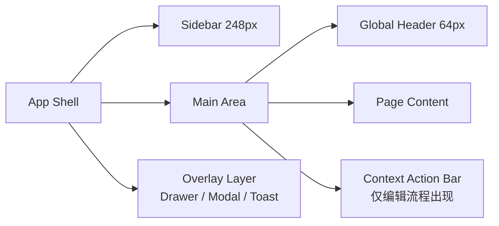
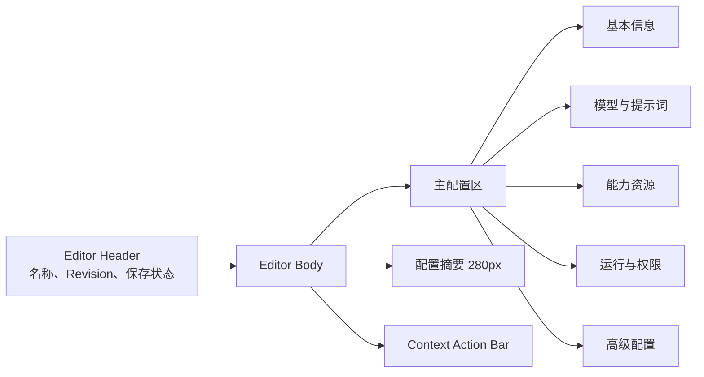

# AgentKit Studio 前端设计系统 V1.2

> 状态：Desktop production baseline
> 适用范围：AgentKit Studio 本地 WebUI、云端控制台同构界面
> 设计目标：将当前可用原型升级为生产环境级 Agent 工程控制台
> 设计参考：LangSmith 桌面工作台的信息密度、排版尺度与导航层级
> 设计关键词：清晰、可信、舒展、工程化、端云一致

## 1. 设计结论

AgentKit Studio 不是面向消费者的聊天产品，也不是营销型 SaaS 首页。它是供开发者和平台工程师长期使用的 Agent 工程控制台，界面首先服务于以下工作：

1. 创建和配置 Agent。
2. 管理 Model、Tool、MCP、Skill 等工程资源。
3. 构建、运行、验证和部署 AgentBundle。
4. 理解权限、执行策略、构建状态和运行结果。
5. 在本地工作区与云端运行环境之间保持一致心智。

因此，V1.2 采用 `Desktop Light Technical Console` 视觉方向：

- 以低饱和冷灰为基础色，不使用纯黑大色块。
- 所有常规按钮使用浅色背景，不使用高饱和或深色填充。
- 使用柔和的中文无衬线字体和克制的字重。
- 通过留白、字号、分组和对齐建立层级，减少边框与卡片堆叠。
- 状态色只表达状态，不承担品牌装饰。
- 动效仅用于反馈和状态变化，不制造持续视觉噪音。
- 第一期仅面向桌面浏览器，不以移动端折叠或触控密度作为设计约束。
- 页面保持完整侧边栏、工作区和上下文面板，窗口过小时允许横向滚动，不压缩业务字号。

设计参数基线：

| 参数 | 目标值 | 说明 |
| --- | ---: | --- |
| Design variance | 3 / 10 | 稳定、清晰，允许少量非对称布局 |
| Motion intensity | 3 / 10 | 以 hover、press、drawer、toast 过渡为主 |
| Visual density | 4 / 10 | 保留工程信息密度，同时提高可读性和留白 |

## 2. 当前界面诊断

当前页面已经具备完整的信息架构和主要工作流，但视觉上仍然偏向原型，主要原因不是单一颜色，而是以下问题叠加：

### 2.1 字体与层级

- 历史页面混用了西文字体优先和中文字体优先的回退顺序，中英文混排字面不统一。
- 大量文字集中在 `9px` 至 `12px`，在 1440px 及以上桌面视口中明显低于舒适阅读尺度。
- 首轮视觉验收使用了 `800×450` 紧凑窗口，导致桌面工作台被错误地按窄屏策略压缩。
- `650` 字重使用过多，标题、导航、正文之间显得生硬。
- 行高和段落宽度缺少统一约束，说明文案不够舒展。

### 2.2 色彩与表面

- 纯白背景覆盖范围过大，页面缺少前后层次。
- 深黑主按钮和红色强调会抢夺视线。
- 蓝、绿、黄、紫同时参与资源类型表达，整体像功能演示页。
- 边框承担了过多分组职责，导致页面呈现为线框稿。

### 2.3 组件与图标

- 使用 `⌁`、`◎`、`◌`、`⇧` 等字符模拟图标，不同操作系统下字形和基线不稳定。
- 按钮、输入框、选择器、标签的状态细节不完整。
- 多处同时出现顶部操作、页面操作和底部操作，主次不够明确。
- `Beta`、状态标签、资源标签和策略分段控件缺少统一组件规则。

### 2.4 布局与工作流

- 全局通知条、顶栏、页面标题、底部操作栏同时存在，纵向空间被切成多层。
- Agent 编辑页使用连续长表单，但没有清晰的配置章节和保存状态。
- 右侧摘要区像临时附加面板，和主编辑流程关系不够紧密。
- 快速开始页同时出现多个“创建 Agent”入口，重复 CTA 强化了 Demo 感。

### 2.5 产品完成度

- Loading、Empty、Error、Disabled、Unsaved、Building 等生产状态没有形成统一规范。
- Toast 承担了过多结果反馈，缺少字段级错误和页面级状态。
- 当前样式集中在单个 HTML 文件内，Token、组件和页面样式没有分层。
- 存在内联样式，难以进行一致性检查和主题演进。

## 3. 设计原则

### 3.1 Quiet by default

默认界面保持安静。常规操作、选中状态和提示均使用浅色表面；只有失败、危险、阻塞和需审批状态使用语义色。

### 3.2 Hierarchy before decoration

优先使用字号、字重、间距和排列建立层级。阴影、边框、色块只在结构无法通过排版表达时使用。

### 3.3 Workflow over dashboard

页面围绕“创建、配置、验证、构建、运行、部署”工作流组织。避免营销页式 Hero、大面积装饰和无业务意义的指标卡。

### 3.4 Progressive disclosure

默认展示最常用配置。高级 YAML、细粒度权限、运行限制和调试参数通过折叠区、抽屉或二级页面展开。

### 3.5 Local first, cloud ready

本地和云端使用同一套组件和状态表达。运行位置通过 Environment Indicator 表达，不为本地版和云端版维护两套视觉语言。

### 3.6 Desktop clarity over responsive compression

第一期以桌面生产环境为唯一验收目标：

- 最小工作宽度为 `1280px`。
- 标准设计宽度为 `1440px`，宽屏验收宽度为 `1920px`。
- 不把 Sidebar 折叠成纯图标栏。
- 不隐藏创建摘要、运行详情等重要上下文来换取窄屏适配。
- 当浏览器窗口低于最小工作宽度时保留完整布局并允许滚动，不缩小字号。

### 3.7 One action, one place

同一页面只保留一个主操作位置。页面级操作位于 Page Header；编辑保存类操作位于 Context Action Bar；行级操作位于行尾菜单。

## 4. 品牌与视觉语气

### 4.1 产品名称

- 主品牌：`AgentKit`
- 产品名称：`AgentKit Studio`
- 环境标签：`Local`、`Cloud`、`Hybrid`
- 版本状态：`Preview`、`Beta` 只允许出现在产品名称附近，不在业务页面反复出现。

### 4.2 品牌表达

AgentKit 的品牌感来自以下组合，而不是大面积品牌色：

- 柔和的冷灰基底。
- 克制的雾蓝强调色。
- 稳定的网格和排版。
- 清晰的工程术语。
- 可靠、可追溯的状态反馈。

金山云品牌红不作为常规交互色。它只可用于正式品牌标识或极小面积的品牌识别，不进入普通按钮、导航选中和业务状态。

## 5. Design Tokens

所有页面必须使用语义 Token，不允许在组件中直接写业务无关的十六进制颜色。

### 5.1 字体

生产版本应将字体文件随本地服务打包，不依赖公网字体服务。

```css
:root {
  --font-sans: "PingFang SC", "Noto Sans CJK SC", "Microsoft YaHei UI",
    "Microsoft YaHei", system-ui, -apple-system, BlinkMacSystemFont,
    "Segoe UI", sans-serif;
  --font-mono: "JetBrains Mono", "SFMono-Regular", Consolas, monospace;
}
```

建议打包 `Noto Sans CJK SC` 的必要字重子集。中文、英文和数字默认使用同一套中文优先正文字体栈，避免系统西文字体与中文字体的字面、基线和字重不一致；代码、ID、哈希和路径使用等宽字体。

字体规则：

| Token | 字号 / 行高 | 字重 | 使用场景 |
| --- | --- | ---: | --- |
| `page-title` | 24 / 1.4 | 600 | 页面标题，唯一 H1 |
| `metric` | 26 / 1.4 | 600 | 核心数值，不用于普通标题 |
| `section-title` | 18 / 1.4 | 600 | 页面章节、抽屉和空状态标题 |
| `subtitle` | 16 / 1.4 | 500 / 600 | 品牌名、二级分组标题 |
| `body` | 15 / 1.6 | 400 | 正文、输入内容、Chat 消息 |
| `control` | 14 / 1.55 | 500 | 导航、按钮、表单标签、表头 |
| `meta` | 13 / 1.5 | 400 | 辅助说明、时间、版本 |
| `caption` | 12 / 1.5 | 400 / 500 | 状态、ID、计数和非关键标签 |
| `code` | 13 / 1.72 | 400 | 路径、日志、YAML 和代码示例 |

约束：

- 不使用 `650`、`700` 作为常规界面字重。
- 页面正文宽度不超过 `68ch`。
- 数值使用 `font-variant-numeric: tabular-nums`。
- 全局 `letter-spacing: 0`，不通过负字距制造层级。
- 中文段落行高不低于字号的 `1.5` 倍。
- 任何承载业务信息的文本不得低于 `12px`。
- 不新增 `11px` 及以下文字；状态和辅助信息的最低字号为 `12px`。
- 普通界面只允许 `400`、`500`、`600` 三档字重。
- 除代码、ID、摘要和路径外，不得使用等宽字体。
- 所有字号、字重和行高声明必须引用 `--font-size-*`、`--font-weight-*`、`--line-height-*` Token。

### 5.2 颜色

#### 中性色

| Token | 值 | 使用场景 |
| --- | --- | --- |
| `--color-canvas` | `#F4F7FB` | 应用背景 |
| `--color-sidebar` | `#FFFFFF` | 侧边导航 |
| `--color-surface` | `#FFFFFF` | 主内容、浮层 |
| `--color-surface-subtle` | `#F7F9FC` | 表头、分组背景、禁用背景 |
| `--color-hover` | `#F1F5F9` | 中性 hover |
| `--color-selected` | `#E7F2FF` | 导航和列表选中 |
| `--color-text-primary` | `#243044` | 标题、正文主色 |
| `--color-text-secondary` | `#58677D` | 辅助正文 |
| `--color-text-tertiary` | `#8290A5` | 占位、元数据 |
| `--color-text-disabled` | `#B8C0CC` | 禁用文本 |
| `--color-border` | `#E2E8F0` | 默认分隔线 |
| `--color-border-strong` | `#CAD4E0` | 控件边框 |

#### 强调色

| Token | 值 | 使用场景 |
| --- | --- | --- |
| `--color-accent` | `#2167D5` | 强调文字、焦点、链接 |
| `--color-accent-soft` | `#EAF3FF` | 主按钮、选中背景 |
| `--color-accent-hover` | `#DDEEFF` | 主按钮 hover |
| `--color-accent-active` | `#CFE4FC` | 主按钮 pressed |
| `--color-accent-border` | `#BFD7F3` | 强调控件边框 |

#### 语义色

| 状态 | 文本 | 浅色背景 | 使用约束 |
| --- | --- | --- | --- |
| Success | `#28745A` | `#ECF7F1` | 已完成、健康、已连接 |
| Info | `#3E6F9F` | `#EEF4FA` | 运行中、信息提示 |
| Warning | `#8A641F` | `#FBF5E8` | 待审批、部分可用 |
| Danger | `#B5473C` | `#FFF1EF` | 失败、删除、不可恢复操作 |

状态色不得用于资源类型装饰。Model、Tool、MCP、Skill 默认使用同一中性色图标容器，通过图标和文字区分。

### 5.3 间距

使用 `4px` 基础网格：

```text
space-1   4px
space-2   8px
space-3  12px
space-4  16px
space-5  20px
space-6  24px
space-8  32px
space-10 40px
space-12 48px
```

主要规则：

- 页面左右内边距：标准桌面 `48px`，1280px 桌面 `32px`。
- Page Header 到首个内容区：`24px`。
- 一级章节间距：`32px`。
- 标题到说明：`4px`。
- 表单字段纵向间距：`20px`。
- 同组按钮间距：`8px`。

### 5.4 圆角

| Token | 值 | 使用场景 |
| --- | ---: | --- |
| `radius-control` | `6px` | 按钮、输入框、选择器 |
| `radius-surface` | `8px` | 独立面板、表格外框 |
| `radius-overlay` | `8px` | Modal、Drawer、Popover |
| `radius-status` | `999px` | 仅状态圆点和状态标签 |

禁止把普通按钮、导航项和标签统一做成胶囊形。

### 5.5 边框与阴影

- 页面分组优先使用留白，其次使用 `1px` 分隔线。
- 普通内容容器不使用阴影。
- Popover：`0 8px 24px rgba(31, 42, 55, 0.08)`。
- Modal：`0 16px 40px rgba(31, 42, 55, 0.12)`。
- Sticky Action Bar：`0 -6px 20px rgba(31, 42, 55, 0.05)`。
- 不使用外发光、彩色阴影和装饰性渐变。

### 5.6 动效

```css
:root {
  --motion-fast: 120ms;
  --motion-base: 180ms;
  --ease-standard: cubic-bezier(0.2, 0, 0, 1);
}
```

- Hover：`120ms`。
- Drawer、Modal、Toast：`180ms`。
- 仅动画 `transform` 和 `opacity`。
- Pressed 状态使用 `transform: translateY(1px)`。
- 尊重 `prefers-reduced-motion`。
- 不使用持续循环动画，运行状态仅允许低频状态点呼吸效果。

## 6. 应用壳层规范



### 6.1 Sidebar

- 桌面宽度：`248px`，不自动折叠为图标栏。
- 背景：`--color-sidebar`。
- 产品标识高度：`64px`。
- 导航项高度：`40px`，左右内边距 `12px`。
- 导航图标：`16px`，统一 `1.75px` stroke。
- Active 状态使用 `--color-selected`，并在左侧显示 `2px` 的 `--color-accent` 标记。
- 分组标题为 `12px / 18px`，不使用全大写。
- Workspace Selector 是一个独立控件，不使用彩色资源图标。
- 用户区固定在底部，设置入口使用标准 icon button。

低于最小工作宽度时仍保持完整 Sidebar，通过页面滚动保留业务结构，不执行移动端抽屉或图标栏降级。

### 6.2 Global Header

- 高度：`64px`。
- 左侧：Breadcrumb 或页面标题。
- 右侧：Environment Indicator、帮助、刷新等全局操作。
- 不保留当前独立的全宽通知条。
- `Local Runtime` 以环境状态控件呈现，例如 `Local · Ready`，点击后展示端口、工作区和运行时信息。
- 页面主操作不放在 Global Header。

### 6.3 Page Header

- 左侧：页面标题、必要的单行说明或版本信息。
- 右侧：最多一个主操作和两个次操作。
- 主操作使用浅色 Accent Button。
- 同一个动作不得同时出现在 Page Header、内容区和底部栏。

### 6.4 Context Action Bar

- 只在 Agent 编辑、资源编辑等“存在未保存状态”的页面出现。
- 左侧显示保存状态：`已保存`、`有未保存更改`、`保存失败`。
- 右侧显示 `运行`、`验证`、`保存并构建`。
- 默认按钮均为浅色；主操作使用 `accent-soft`，其余使用中性浅色。
- 非编辑页面不显示全局底栏。

## 7. 图标规范

- 统一采用 Lucide 图标集，并将资源打包到本地，不依赖 CDN。
- 导航图标：`16px`。
- 按钮图标：`16px`。
- 空状态和引导图标：`24px` 或 `32px`。
- 默认 stroke：`1.75px`。
- 同一组件内不得混用字符图标、Emoji、手绘 SVG 和 Lucide。
- Icon-only button 必须提供 Tooltip 和 `aria-label`。
- 图标只辅助识别，不能替代关键状态文字。

第一轮必须替换当前所有字符图标，包括：

```text
⌁ ◎ ◌ ⇧ ▤ ⌘ ⌬ ✦ ◇ ▥ ⌕ ⚙ ×
```

## 8. 按钮规范

### 8.1 尺寸

| Size | 高度 | 水平内边距 | 字号 | 图标 |
| --- | ---: | ---: | ---: | ---: |
| Small | 34px | 11px | 13px | 15px |
| Default | 40px | 15px | 14px | 16px |
| Large | 44px | 18px | 15px | 17px |
| Icon | 40px | 0 | - | 16px |

### 8.2 层级

#### Accent

- 背景：`--color-accent-soft`
- 文字：`--color-accent`
- 边框：`--color-accent-border`
- Hover：`--color-accent-hover`
- Pressed：`--color-accent-active`

用于当前页面唯一主操作，例如 `创建 Agent`、`保存并构建`。

#### Secondary

- 背景：`--color-surface`
- 文字：`--color-text-primary`
- 边框：`--color-border-strong`
- Hover：`--color-hover`

用于次操作，例如 `验证`、`刷新`。

#### Tertiary

- 背景透明。
- 默认无边框。
- Hover 使用 `--color-hover`。

用于行级操作、返回、取消和低优先级动作。

#### Danger

- 背景：Danger 浅色背景。
- 文字：Danger 文本色。
- 只用于删除、解除绑定、终止运行等破坏性操作。
- 不可恢复操作必须二次确认。

### 8.3 状态

所有按钮必须具备：

- Default
- Hover
- Pressed
- Focus visible
- Disabled
- Loading

Loading 状态保留按钮原有宽度，图标区域显示小型进度指示，不允许按钮文案导致布局跳动。

## 9. 表单规范

### 9.1 基础字段

- Label 位于控件上方。
- Label 与控件间距 `8px`。
- 输入框高度 `42px`，默认 `15px` 字号。
- Helper text 位于控件下方，间距 `7px`，字号 `13px`。
- Error text 替换 Helper text，不额外挤出两行。
- Placeholder 只提供格式示例，不承担字段说明。
- Disabled 字段使用浅灰背景，但保持文本可读。

### 9.2 表单布局

- 默认单列，适用于复杂配置和长文本。
- 只有名称、ID、数值限制等短字段可使用双列。
- 双列字段只在桌面工作区宽度足够时出现；一期不定义移动端布局。
- 每个一级章节不超过 `7` 个直接可见字段，更多内容进入二级分组或 Advanced。

### 9.3 校验

- 必填标识放在 Label 后。
- 提交后将焦点移动到第一个错误字段。
- 字段级错误直接显示在字段下方。
- 页面级错误显示在 Page Header 下方的 Inline Alert。
- 不使用 `window.alert()`。

### 9.4 策略与选择

- 二到三个互斥选项使用 Segmented Control。
- 二元状态使用 Switch 或 Checkbox。
- 数值限制使用 Input + Stepper。
- 多资源选择使用 Drawer，不在 Modal 中塞入大型表格。
- 高级 YAML 使用带行号的代码编辑区域，并和结构化表单保持双向校验状态。

## 10. 数据展示规范

### 10.1 Table

- 表格默认放在独立 Surface 中，圆角 `8px`。
- Header 高度 `46px`，Row 高度不低于 `62px`。
- Header 使用 `surface-subtle`，字重 `500`。
- 只使用横向分隔线，避免完整单元格网格。
- 名称默认使用主文字颜色，只有可导航时才表现为链接。
- ID、Revision、Build ID、时间使用等宽字体或 tabular numbers。
- 行级操作固定在最右侧，超过两个动作时使用 More Menu。
- Loading 使用与列宽一致的 Skeleton Row。
- Empty 使用表格内部空状态，不展示空白外框。

### 10.2 Status

状态标签由圆点、文字和浅色背景构成：

```text
Ready        绿色
Running      蓝色
Waiting      黄色
Failed       红色
Draft        中性灰
```

- 状态不可只通过颜色表达。
- Status 高度 `22px`，字体 `12px`。
- 不为 Model、Tool、MCP、Skill 使用不同彩色标签。

### 10.3 Metric

- 指标默认使用无框布局，通过栅格和分隔线组织。
- 数值字号不超过 `24px`。
- 构建、调用、耗时等数值使用 tabular numbers。
- 只有可点击或可展开的指标才使用 Card。

### 10.4 Log 与 Code

- 日志、YAML 和代码使用统一深色代码表面，但不改变页面整体主题。
- 背景：`#202631`，文字：`#D7DEE8`。
- 支持复制、自动换行、搜索和下载。
- 错误行使用左侧语义标记，不整行高饱和填充。

### 10.5 Overlay 与反馈

#### Drawer

- 资源选择、资源详情、运行详情优先使用右侧 Drawer。
- 默认宽度 `480px`，复杂资源选择最大 `720px`。
- Header、Body、Footer 分区固定，Body 独立滚动。
- Drawer Footer 只放当前抽屉范围内的操作。

#### Modal

- 只用于需要阻断背景操作的确认和短表单。
- 默认宽度 `520px`，复杂确认最大 `640px`。
- 标题必须说明对象和操作，不使用“提示”作为标题。
- 删除、终止等危险操作在 Modal 内明确展示影响范围。

#### Inline Alert

- 用于页面级错误、权限不足、运行时断连和构建阻塞。
- Alert 包含状态图标、标题、说明和可选操作。
- 默认不允许手动关闭阻塞性 Alert。

#### Toast

- 右下角展示，最大宽度 `400px`。
- 成功 Toast 自动关闭，错误 Toast 必须提供查看详情或重试入口。
- 同时最多显示三条，重复消息合并。
- Toast 不遮挡 Context Action Bar。

## 11. 页面模板

### 11.1 快速开始

目标是帮助用户完成第一个 Agent，而不是展示产品卖点。

布局：

1. Page Header：`快速开始` 和一个 `创建 Agent`。
2. Guided Progress：四步横向流程，可进入对应页面。
3. Recent Agents：最近 Agent 列表。
4. Getting Started Empty State：只在没有 Agent 时出现。

约束：

- 页面只保留一个 `创建 Agent` 主按钮。
- 不使用大 Hero 和装饰性插画。
- 已完成步骤使用 Success，当前步骤使用 Accent，其余使用 Neutral。

### 11.2 Agent 列表

布局：

1. Page Header。
2. Search、Status Filter、Runtime Filter。
3. Agent Table。
4. Pagination 或增量加载。

空状态必须明确提供 `创建 Agent` 和 `从 Manifest 导入` 两个入口。

### 11.3 Agent 创建

全局 `创建 Agent` 是通用工程入口，不绑定任何单一业务场景。

默认流程：

1. 默认选择 `空白 Agent`。
2. 用户填写名称、Agent ID、描述和系统提示词。
3. 用户选择 Model Profile、Tool、MCP Server、Skill 与权限模板。
4. 用户检查系统提示词和任务契约。
5. 创建 Agent Draft，并可选择立即构建和进入会话。

模板规则：

- `Research Agent` 等业务模板必须由用户显式选择。
- 只有选择 Research 模板后才显示目标读者、调研深度和报告格式。
- 空白 Agent 不自动绑定 Tool、MCP 或 Skill。
- 模板切换可以调整模板默认值，但不得覆盖用户已经自定义的名称、ID 或 Prompt。
- 配置摘要实时展示模板、模型、Skill、MCP、Tool、执行策略和权限策略。

### 11.4 Agent 编辑



章节顺序：

1. 基本信息。
2. 模型与系统提示词。
3. Tool、MCP、Skill。
4. 执行策略、任务契约和权限。
5. 运行限制。
6. Advanced YAML。

摘要区显示：

- Revision。
- Model。
- Tool / MCP / Skill 数量。
- 执行策略。
- 权限策略。
- 最近一次构建状态。

摘要区不放置超大主按钮。保存和构建动作统一进入 Context Action Bar。

### 11.5 构建与运行

- Build 和 Run 使用一致的任务详情模板。
- 顶部显示状态、开始时间、耗时、触发来源和操作。
- 中部显示阶段 Stepper。
- 下部显示日志和产物。
- 构建中离开页面不会丢失进度，返回后恢复当前状态。

### 11.6 资源管理

Model、Tool、MCP、Skill 共享同一列表模板：

- 统一搜索、筛选和状态。
- 统一详情 Drawer。
- 资源类型通过图标和名称表达，不使用四套彩色卡片。
- 新建流程复用 Form、Drawer 和 Validation 规范。

### 11.7 会话与验证

会话页面用于验证 Agent 行为，不设计为消费级聊天应用。

布局：

1. 左侧 Session List，展示名称、Agent Revision 和最近运行时间。
2. 中间 Conversation，展示用户输入、Agent 输出、Tool Call 和审批节点。
3. 右侧 Inspector，展示 Trace、Token、Latency、Context 和原始事件。

规则：

- 用户消息和 Agent 消息使用轻量背景差异，不使用大面积彩色气泡。
- Tool Call、MCP Call 和 Approval 使用可折叠事件块。
- 每次响应显示对应 Revision、Run ID 和状态。
- 输入区固定在 Conversation 底部，支持附件、停止和重新运行。
- Inspector 在窄桌面转为 Drawer。

### 11.8 部署

部署页面围绕“选择 Bundle、配置目标、预检、部署、验证”组织。

布局：

1. Deployment List：环境、Bundle Revision、状态、更新时间和访问地址。
2. Create Deployment Drawer：目标环境、资源规格、Secret Reference 和发布策略。
3. Deployment Detail：阶段进度、事件、配置摘要、Endpoint 和回滚操作。

规则：

- 本地运行和云端部署使用同一 Bundle 身份。
- 部署前预检结果使用 Checklist，不将全部结果塞进 Toast。
- Endpoint 提供复制和连通性检查。
- 回滚和删除属于 Danger Action，必须展示影响范围。
- 环境使用名称和图标区分，不用红绿颜色区分生产与测试。

### 11.9 可观测

可观测页面优先支持问题定位，不追求装饰性 Dashboard。

布局：

1. 顶部筛选：时间、Agent、Revision、Environment、Status。
2. 概览指标：调用量、成功率、P95 Latency、Token 和 Cost。
3. Run / Trace Table。
4. Trace Detail Drawer：步骤、模型调用、Tool Call、Context、错误和日志。

规则：

- 指标使用无框栅格和分隔线。
- 图表只使用一个强调色和一个中性色系列。
- Success Rate 等指标同时显示值和样本量。
- 错误聚合提供可下钻的 Error Group。
- Trace Timeline 以时间和父子关系为主，不使用装饰性流程图。
- 原始 Payload 默认折叠，并对 Secret 和敏感字段脱敏。

## 12. 完整状态规范

每个页面和核心组件都必须设计以下状态：

| 状态 | 表达方式 |
| --- | --- |
| Initial loading | 与真实布局一致的 Skeleton |
| Background refresh | 局部状态指示，不遮挡页面 |
| Empty | 说明原因，并提供一个明确下一步 |
| Partial | 保留已有内容，局部显示失败 |
| Error | Inline Alert + Retry |
| Offline | Global Header 显示 Runtime disconnected |
| Unsaved | Context Action Bar 显示未保存 |
| Saving | 操作区显示保存中，控件不整体冻结 |
| Saved | 短暂显示已保存时间 |
| Building | 阶段进度 + 可查看日志 |
| Disabled | 说明不可用原因，必要时提供 Tooltip |
| Permission denied | 说明所需权限和申请路径 |

Toast 只用于短暂、可忽略的成功反馈。需要用户处理的信息不得只放在 Toast 中。

## 13. 桌面视口规范

### 13.1 Breakpoints

```text
Wide desktop   >= 1600px
Desktop        1280px - 1599px
Unsupported    < 1280px
```

### 13.2 行为

- Wide desktop：Sidebar `248px`，页面内容最大宽度 `1520px`，创建向导显示右侧摘要。
- Desktop：维持完整 Sidebar，Page Gutter 从 `48px` 减少到 `32px`；必要时隐藏非关键摘要，但不压缩正文。
- 低于 `1280px`：页面保持 `1280px` 最小工作宽度并允许浏览器滚动，不启用移动端折叠。
- 固定格式组件必须使用稳定尺寸，Loading 和动态文案不得引起布局跳动。
- 最小宽度来自桌面工程控制台的信息架构约束，并在产品支持范围中明确说明。

AgentKit Studio 一期只承诺桌面端生产体验。移动端查看、审批和告警响应在后续独立产品形态中设计，不复用桌面页面的压缩版本。

## 14. 可访问性规范

- 正文与背景对比度达到 WCAG AA。
- 所有交互元素具有可见 Focus Ring。
- 键盘可完成导航、表单编辑、资源选择和 Modal 关闭。
- Icon Button 可视尺寸不低于 `32px`，点击区域不低于 `40px`。
- 表单错误通过文本和 `aria-describedby` 关联。
- Modal 打开后锁定背景滚动并管理焦点。
- Drawer、Menu、Tooltip、Tabs 使用正确 ARIA 语义。
- 状态不得只依赖颜色。
- 尊重系统字号和 Reduced Motion 偏好。

## 15. 内容与术语规范

统一保留以下工程术语：

```text
Agent
Model Profile
Tool
MCP Server
Skill
AgentBundle
Revision
Build
Run
Deployment
```

按钮采用“动词 + 对象”：

```text
创建 Agent
保存配置
保存并构建
运行 Agent
部署 Bundle
添加 MCP
安装 Skill
```

避免：

- “确定”“提交”等缺少对象的操作文案。
- 同一页面同时使用“智能体”和“Agent”。
- 感叹号、夸张语气和营销式描述。
- 将实现细节直接暴露为无说明的字段名称。

## 16. 前端工程规范

当前 Studio 使用原生 HTML、CSS 和 JavaScript。第一轮改造保持现有技术栈，不为视觉升级引入 React 或大型 UI 框架。

建议拆分：

```text
ksadk/studio/static/
├── index.html
├── css/
│   ├── tokens.css
│   ├── base.css
│   ├── layout.css
│   ├── components.css
│   └── pages.css
├── js/
│   ├── app.js
│   ├── api.js
│   ├── state.js
│   └── views/
├── fonts/
└── icons/
```

约束：

- 禁止新增内联样式。
- CSS 中只使用语义 Token。
- `:root` 之外禁止直接写数字字号、数字字重、数字行高或 `font` 简写。
- 新增文本必须映射到 `page-title`、`section-title`、`subtitle`、`body`、`control`、`meta`、`caption` 或 `code`，不得创造页面私有字号。
- 新页面必须复用现有 Page Header、Button、Field、Table、Status Badge、Drawer 和 Empty State 组件规则。
- 样式守门测试位于 `tests/studio/test_style_system.py`；修改视觉基线时必须同时更新 Token、规范和测试。
- 交互钩子使用 `data-*` 或 `id`，样式类不承担 JavaScript 选择器职责。
- 组件类和状态类分离，例如 `.button`、`.button-accent`、`.is-loading`。
- 图标和字体必须本地打包，保证离线启动。
- z-index 使用固定层级：Base `0`、Sticky `20`、Header `30`、Overlay `100`、Toast `120`。
- 所有网络错误必须进入统一错误模型。
- 所有异步按钮必须防重复提交。

## 17. 禁止模式

以下模式不得进入生产界面：

- 红色、黑色或高饱和颜色作为普通主按钮填充。
- 字符和 Emoji 模拟功能图标。
- 页面区块全部套 Card，或 Card 内继续嵌套 Card。
- 同一动作在三个位置重复出现。
- 依赖纯颜色区分资源和状态。
- 大面积营销 Hero、装饰性渐变、光晕和漂浮色块。
- 只有成功状态，没有 Loading、Empty、Error 和 Disabled。
- 使用浏览器 Alert 反馈业务错误。
- 为简单操作弹出 Modal。
- 表单中混用 Label、Placeholder 和 Helper 的职责。
- 通过更大、更黑、更粗解决所有层级问题。

## 18. 视觉验收标准

### 18.1 页面级

- 在 `1440 x 900` 下，首屏能够识别页面标题、主任务和当前状态。
- 页面中最多存在一个 Accent Button。
- 内容区不存在不必要的嵌套边框。
- 侧边栏、Header、内容和操作栏层级清晰。
- 中英文混排字面稳定，不出现字体回退造成的明显跳变。
- `1280 x 800` 下核心按钮和摘要不遮挡内容。
- `1920 x 1080` 下创建向导完整显示步骤、表单和配置摘要。
- 任何业务文字不低于 `12px`，正文、输入内容和 Chat 消息不低于 `15px`。

### 18.2 组件级

- 所有按钮通过 Default、Hover、Pressed、Focus、Disabled、Loading 截图检查。
- 所有表单通过 Default、Focus、Error、Disabled 检查。
- Table 具备 Loading、Empty、Populated、Error 状态。
- Modal 和 Drawer 通过键盘焦点与滚动检查。
- 所有图标来自统一图标集，尺寸和 stroke 一致。

### 18.3 自动化

- 保留现有 API 和工作流 E2E。
- 增加关键页面视觉回归截图：
  - Quick Start。
  - Agent List。
  - Agent Editor。
  - Resource List。
  - Build Detail。
- 增加 `axe` 或同类可访问性检查。
- CSS 变更必须通过 `git diff --check` 和静态资源测试。

## 19. 改造优先级

### P0：视觉基线

1. 拆分 CSS，建立 Tokens。
2. 替换字体和图标。
3. 重构浅色按钮体系。
4. 调整 App Shell、Header 和页面间距。
5. 删除重复 CTA 和全局底部操作。

### P1：核心工作流

1. 重构 Agent Editor 页面结构。
2. 建立统一 Table、Form、Status、Drawer。
3. 完成 Loading、Empty、Error、Unsaved、Building 状态。
4. 优化 Quick Start 和 Agent List。

### P2：生产级细节

1. 可访问性与键盘操作。
2. 1440px 与 1920px 桌面视觉回归。
3. 视觉回归测试。
4. 动效和微交互。
5. 本地字体、图标和静态资源体积优化。

## 20. 本轮设计决策摘要

| 决策项 | V1 选择 |
| --- | --- |
| 主题 | 浅色工程控制台 |
| 主字体 | PingFang SC / Noto Sans CJK SC 中文优先回退栈 |
| 代码字体 | JetBrains Mono / 系统等宽回退 |
| 主强调 | LangSmith 式清晰蓝色交互状态 |
| 主按钮 | 浅蓝背景、蓝色文字 |
| 普通按钮 | 白色或浅灰背景 |
| 危险按钮 | 浅红背景，仅破坏性操作 |
| 导航 | 248px 完整文字侧边导航 |
| 页面密度 | 中低密度，正文基线 15px |
| 圆角 | 6px 控件、8px Surface |
| 图标 | 本地打包 Lucide，统一 1.75px stroke |
| Card | 仅在独立实体或浮层需要时使用 |
| 动效 | 120ms 至 180ms 克制反馈 |
| 本地与云端 | 同构组件，环境状态区分 |

这份规范是 Studio V1 后续 UI 改造的唯一视觉基线。任何新增组件必须先映射到 Token、状态和页面模板；若无法映射，应先更新规范，再进入实现。

## 21. 会话工作台规范

Studio 会话采用非对称双侧任务工作台：用户输入靠右并使用轻量气泡，Agent 输出靠左并使用连续正文。它保留对话轮次的方向感，同时避免把长回答塞入客服式大气泡。

### 21.1 页面结构

- Studio 主导航保留产品级入口；会话内侧栏只负责会话历史，不重复展示工程资源。
- 会话历史栏桌面宽度为 `244px`，使用中性浅灰 Surface，与主阅读区通过单条边框分隔。
- 主阅读区使用宽度不超过 `880px` 的共享消息列，Agent 正文长行控制在约 `70ch`。
- 会话 Header 为单行结构，只保留 Agent 名称和 Session ID；不得重复显示“智能体”等低价值副标题。
- 输入区固定在会话底部，页面本身不得随消息增长；只有消息列表可以独立滚动。

### 21.2 消息语义

- 用户消息右对齐，使用内容自适应的浅蓝气泡，最大宽度为消息列的 `72%` 或 `600px`；短消息不得被拉伸成全宽块。
- Agent 消息左对齐并使用无边框连续正文，不使用气泡、头像或左侧装饰轨迹线，也不重复展示 Agent 名称和运行时间。
- 推理过程位于 Agent 正文之前，以“思考中 / 已思考”的可折叠行呈现；运行时未返回推理事件时不得伪造思考内容。
- 用户输入与 Agent 输出在视觉上形成左右轮次，但 Tool、MCP、Skill 与 A2UI 事件始终归属 Agent 侧。
- Tool、MCP、Skill 和 A2UI 活动作为正文中的结构化运行事件呈现，不与自然语言消息竞争主层级。
- 运行失败采用行内错误状态；红色只用于错误图标和文本，不使用大面积红色容器。
- 代码、命令、文件和 Session ID 使用统一等宽字体，普通正文不使用等宽字体。

### 21.3 字体与密度

- 会话正文、用户输入和 Composer 输入统一为 `15px`。
- 正文行高为 `1.65` 至 `1.68`；用户轮次与 Agent 轮次的组间距为 `28px` 至 `30px`。
- 历史标题为 `13px`，元数据为 `11px` 至 `12px`，不得通过整体缩小字体制造密度。
- Agent 输出不额外套 Card；用户气泡使用右下角收紧的非对称圆角，Composer 圆角不超过 `13px`。

### 21.4 实现边界

- `ksadk-web` 继续拥有会话状态、虚拟列表、Markdown、A2UI 和 Composer 行为。
- Studio 只通过 `shared-chat.css` 提供视觉主题，不复制或分叉 `ksadk-web` 组件逻辑。
- `/chat/` 直接访问和 Studio iframe 嵌入必须加载同一主题，不允许出现两套会话视觉。
- 上游静态包升级后必须完成三轮桌面视觉回归：结构密度、组件层级、长会话成品状态。
