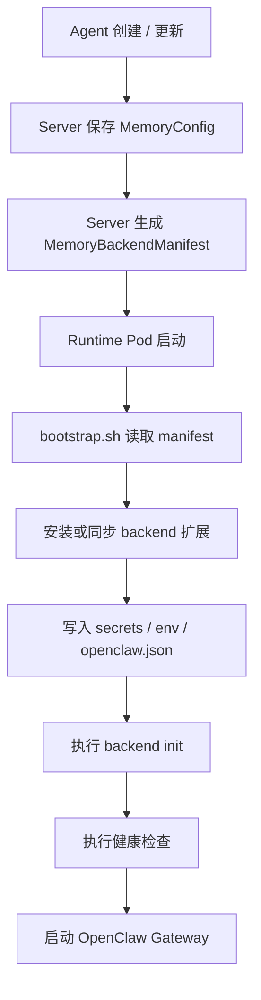

# OpenClaw 通用 Memory Backend Bootstrap 设计

## 1. 文档目标

本文只讨论 `ksadk-python` 的 OpenClaw 容器运行时，解决一个具体问题：

- `agentengine-server` 已经可以在控制面保存 `memory_config`
- OpenClaw runtime 现在只具备“把控制面配置转成环境变量”的能力
- 但如果未来 memory backend 不只 `mem0`，还会有 `LanceDB-S3` 等远程记忆方式，bootstrap 层需要有一套可扩展的安装、启用、配置、校验机制

本文不讨论：

- `ADK/LangChain/LangGraph/DeepAgents` 的 native memory 方案
- 通用数据库 schema 重构
- 远端 memory 服务本身的 API 设计

## 2. 当前代码现状

### 2.1 控制面现状

`agentengine-server` 当前已经具备以下能力：

- `CreateAgentProduct` 会把 `memory_config` 放进 pending context cache
- `CreateAgent` 在 Ding 回调没有透传 `MemoryConfig` 时，会从 pending context 恢复
- `AgentService` 对 OpenClaw 的 `memory_config` 只支持两种值：
  - `openclaw_default`
  - `mem0`
- 当 `memory_system=mem0` 时，服务端会查 `Mem0Service`，并把运行时环境变量注入为：
  - `MEM0_API_KEY`
  - `MEM0_MEMORY_ID`

也就是说，控制面已经能表达“这个 OpenClaw Agent 绑定了哪一种记忆后端”，但 runtime bootstrap 还没有一个通用后端装配层。

### 2.2 OpenClaw runtime 现状

`deploy/openclaw/bootstrap.sh` 目前已经能做很多运行时装配工作：

- 同步内置 skill
- 同步默认 extension
- patch gateway / dist
- 生成并修正 `openclaw.json`
- 处理模型、渠道、搜索等 provider 配置

但它还没有一层明确的 “memory backend registry / installer / config reconciler”。

换句话说，今天如果要把 `mem0` 真正装进 OpenClaw，最容易走成 one-off：

- 下载一个 tgz
- `openclaw plugins install ...`
- 再执行一段特定初始化命令

这对 `mem0` 能跑，但对后续扩展并不友好。

## 3. 设计目标

- 目标 1：不要把 `mem0` 做成一次性特判
- 目标 2：让 `LanceDB-S3` 与 `mem0` 走同一类扩展机制
- 目标 3：让 bootstrap 负责“运行时装配”，而不是把所有逻辑塞回 server
- 目标 4：失败要可见，可回滚，可禁用
- 目标 5：不要求独立微服务，优先复用现有 OpenClaw 镜像构建与 bootstrap 体系

## 4. 对 `LanceDB-S3` 的建模口径

这里采用固定口径：

- `LanceDB-S3` 视为一种 memory backend
- 不把它拆成两个独立 provider
- 也就是说，控制面和 bootstrap 层都把它当成一个单独 backend 类型处理，例如 `lancedb_s3`

原因很简单：

- 用户选择的是一种完整的远程记忆方案，而不是“LanceDB + S3”两个松散组件
- 它的安装方式、配置字段、健康检查、清理策略都应作为同一个 backend 生命周期来管理

## 5. 方案比较

### 方案 A：在 `bootstrap.sh` 里按 backend 写死 if/else

做法：

- `if memory_system == mem0`，执行 mem0 安装和初始化
- `if memory_system == lancedb_s3`，再追加一段新的安装和初始化

优点：

- 最快
- 改动面最小

缺点：

- 每加一个 backend 都要继续膨胀 `bootstrap.sh`
- 安装、启用、配置、健康检查逻辑无法复用
- reviewer 之后很容易把它判成“one-off 运维脚本堆积”

推荐结论：

- 不推荐作为正式方案
- 只适合临时 PoC

### 方案 B：完全靠 server 预注入环境变量，bootstrap 不做 backend 装配

做法：

- server 只负责把所有参数翻成 env
- OpenClaw 镜像默认已内置所需 plugin
- bootstrap 不感知 memory backend

优点：

- server 侧可控
- runtime 脚本变动少

缺点：

- 只适合“镜像已经完全内置一切”的 backend
- 一旦 backend 需要：
  - 安装 plugin
  - 写配置文件
  - 执行 init 命令
  - 做健康检查
  就会失效

推荐结论：

- 不推荐作为长期方案
- 只适合纯 env 型 backend

### 方案 C：引入 manifest-driven 的通用 memory backend bootstrap

做法：

- server 继续保存 `memory_config`
- runtime 额外接收一份规范化 backend manifest
- `bootstrap.sh` 按 manifest 执行统一流程：
  - 识别 backend 类型
  - 安装/同步 extension 或 plugin
  - 注入 secrets / env
  - 写入 OpenClaw config
  - 执行 backend-specific init
  - 做健康检查

优点：

- 对 `mem0`、`lancedb_s3`、未来其他远程记忆 backend 都可复用
- server 负责“声明式配置”，bootstrap 负责“命令式装配”
- 更符合 OpenClaw 当前已有的 extension/plugin/bootstrap 体系

缺点：

- 首次设计成本更高
- 需要把 manifest schema 设计清楚

推荐结论：

- 这是正式推荐方案
- 也是我建议后续真正落地的方向

## 6. 推荐方案

### 6.1 总结

正式推荐：`方案 C`

原因：

- 它最符合 OpenClaw 当前已有的 bootstrap 结构
- 不会把 `mem0` 做成一次性例外
- 可以自然覆盖 `LanceDB-S3`

### 6.2 推荐的建模方式

控制面建议保留两层概念：

- 用户可见层：`MemoryConfig`
- runtime 装配层：`MemoryBackendManifest`

其中：

- `MemoryConfig` 继续是控制面 API 概念
- `MemoryBackendManifest` 是 OpenClaw bootstrap 的内部契约

建议形态：

```json
{
  "backend_type": "mem0",
  "backend_family": "remote_memory",
  "install": {
    "mode": "plugin_archive",
    "source": "https://.../ksc-openclaw-mem0-1.0.6.tgz",
    "plugin_id": "ksc-openclaw-mem0"
  },
  "config": {
    "base_url": "http://mem-service.sdns.ksyun.com",
    "memory_id": "e52b7fac-e641-4b34-b9f7-6b0b9f190cd4",
    "user_id": "u-123"
  },
  "secrets": {
    "api_key_env": "MEM0_API_KEY"
  },
  "healthcheck": {
    "mode": "command",
    "argv": ["openclaw", "mem0", "status"]
  }
}
```

`lancedb_s3` 也走同一结构，只是 `backend_type` 和 `config` 字段不同。

## 7. 推荐的 bootstrap 流程



建议统一拆成 5 个函数：

- `resolve_memory_backend_manifest`
- `install_memory_backend_assets`
- `reconcile_memory_backend_config`
- `run_memory_backend_init`
- `verify_memory_backend_health`

## 8. `mem0` 与 `lancedb_s3` 的推荐落地口径

### 8.1 `mem0`

推荐按“外置 extension + manifest 装配”处理：

- 支持 tgz 包安装
- 支持镜像预装后只做 enable/config
- secrets 通过 env 注入，不把密钥写死到镜像层

### 8.2 `lancedb_s3`

推荐按与 `mem0` 同一套 backend 机制处理：

- backend 类型单独命名为 `lancedb_s3`
- 但仍归属于同一类 `remote_memory`
- 不拆成 `lancedb` 与 `s3` 两条生命周期

这样做的好处是：

- UI 选择简单
- bootstrap 逻辑稳定
- 后续做 healthcheck / doctor / status 时粒度清晰

## 9. 最小可落地实施顺序

### 第 1 步：先把 runtime contract 抽出来

- server 继续保留现有 `MemoryConfig`
- 新增内部 `MemoryBackendManifest`
- 只给 OpenClaw runtime 消费

### 第 2 步：bootstrap 增加 backend registry

- 在 `bootstrap.sh` 增加 backend dispatch
- 但 registry 初版只注册 `mem0`

### 第 3 步：把 `mem0` 从 one-off 脚本改成 manifest 驱动

- 安装
- enable
- init
- healthcheck

### 第 4 步：新增 `lancedb_s3`

- 不改 bootstrap 主流程
- 只新增一个 backend handler

## 10. 风险与边界

- 风险 1：如果 backend 安装包完全依赖公网，预发和生产稳定性会差
- 风险 2：如果 init 命令不可重入，Pod 重启会带来脏状态
- 风险 3：如果 healthcheck 失败仍继续启动，会导致“表面可用、实际失忆”

建议边界：

- bootstrap 只负责运行时装配，不负责 memory 数据迁移
- backend 安装失败时默认 fail-fast
- secrets 只通过 env 或受控 secret 文件传递，不写入镜像静态层

## 11. 最终推荐

一句话结论：

- OpenClaw memory backend 应该做成 manifest-driven 的通用 bootstrap 机制
- `mem0` 是第一种 backend，`LanceDB-S3` 是第二种 backend，但两者走同一套 runtime 生命周期

如果要继续往前推进实现，我建议下一步先产出一份更具体的 runtime contract：

- `MemoryBackendManifest` 字段定义
- `bootstrap.sh` 的函数拆分草稿
- `mem0` 首个 backend handler 的最小实现
