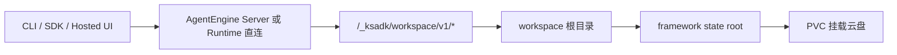
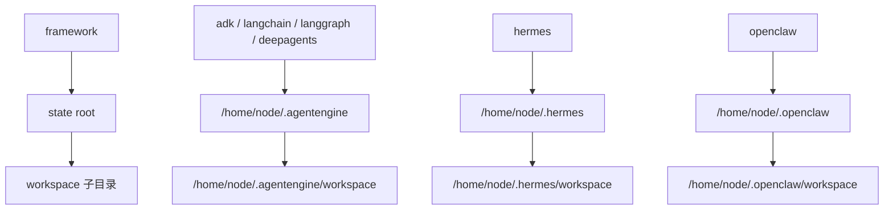

# Agent 通用 Workspace Files + PVC 实施说明

## 1. 文档口径

本文只描述 `workspace-files-v1` 分支当前代码对应的真实实现状态，口径基于今天本地验证结果，不沿用昨天的阶段性结论。

范围只覆盖两个仓库：

- `ksadk-python`
- `agentengine-server`

不覆盖：

- `agentengine-sdk-python`
- 线上环境现网行为
- 未升级到当前 worktree 镜像的旧预发 runtime

## 2. 当前结论

当前分支已经完成两条主线：

1. Agent 通用 workspace 文件能力主链路
2. serverless PVC storage contract 与 ksadk 默认挂盘参数

已经成立的事实：

- Hosted UI / Hosted action / CLI / SDK 的 workspace files contract 已经统一到同一套命名。
- `GetAgentUiBootstrap` 已经下发 `Capabilities.WorkspaceFiles` 与完整 `WorkspaceFiles.*` 字段。
- `agentengine-server` 已支持 `CreateAgent.Storage`、`UpdateAgent.Storage`、`GetAgent.Deployment.Storage`。
- `ksadk-python` 已支持把 storage 透传到 server 侧，并为 serverless 默认注入 PVC 参数。
- KOP 接口命名已统一为：
  - `ListWorkspaceFiles`
  - `AddWorkspaceFile`
  - `DeleteWorkspaceFile`
  - `GetWorkspaceFileContent`
- `OpenClaw` 在控制面/Bootstrap 层已经被纳入 `WorkspaceFiles` capability 白名单。

当前仍需单独验证的点：

- 旧预发 `OpenClaw` runtime 镜像是否已经包含当前 worktree 对应的 workspace helper / gateway patch。
- `agentengine launch` 的预发 CLI 级 e2e 还没在这轮执行。
- Share link 的浏览器人工回归还没补。

## 3. 目标与边界

### 3.1 目标

为当前支持的 agent 形态提供统一的文件数据面能力：

- 浏览 workspace
- 上传文件到 workspace
- 下载 agent 生成的文件
- 删除 workspace 条目
- 通过 PVC 在 pod 重建后保留 agent 工作目录

### 3.2 关键边界

- 只依赖 PVC / 云盘挂载，不依赖 KS3 作为 runtime 文件面。
- 对外暴露的是 `workspace` 子目录，不暴露整个 state root。
- 聊天附件链路与 workspace files 链路保持分离，不复用 URI 语义。
- Share link 默认不显示 workspace 面板。
- Hosted UI 首版只支持当前目录上传/刷新/展开/下载/删除，不做目录级同步。

## 4. 统一 contract

### 4.1 Runtime data plane

所有 runtime 对外统一为：

- `GET /_ksadk/workspace/v1/entries`
- `GET /_ksadk/workspace/v1/files/{path}`
- `POST /_ksadk/workspace/v1/files/{path}`
- `DELETE /_ksadk/workspace/v1/files/{path}`
- `HEAD /_ksadk/workspace/v1/files/{path}`
- `GET /_ksadk/workspace/v1/healthz`

### 4.2 Hosted action

`agentengine-server` 对 Hosted UI / 浏览器暴露：

- `POST /agentengine/api/v1/ListWorkspaceFiles`
- `POST /agentengine/api/v1/AddWorkspaceFile`
- `POST /agentengine/api/v1/DeleteWorkspaceFile`
- `GET /agentengine/api/v1/GetWorkspaceFileContent`

下载统一走二进制 streaming，不走 JSON action envelope。

### 4.3 Bootstrap capability

`GetAgentUiBootstrap` 当前下发：

- `Capabilities.WorkspaceFiles`
- `WorkspaceFiles.Enabled`
- `WorkspaceFiles.MaxUploadBytes`
- `WorkspaceFiles.SupportsDelete`
- `WorkspaceFiles.RootLabel`
- `WorkspaceFiles.EntryAction`
- `WorkspaceFiles.UploadAction`
- `WorkspaceFiles.ContentPath`

### 4.4 Storage contract

控制面 storage schema 统一为：

- `CreateAgent.Storage`
- `UpdateAgent.Storage`
- `GetAgent.Deployment.Storage`

字段为：

- `MountPath`
- `SizeGi`

约束为：

- 默认 `SizeGi = 20`
- 最小 `20`
- 最大 `500`

### 4.5 CLI / SDK

文件命令：

- `agentengine files list`
- `agentengine files upload`
- `agentengine files download`
- `agentengine files delete`
- `agentengine files push`
- `agentengine files pull`

serverless PVC 相关参数：

- `agentengine deploy --storage-size-gi --storage-mount-path --no-storage`
- `agentengine launch --storage-size-gi --storage-mount-path --no-storage`
- `agentengine hermes deploy --storage-size-gi --storage-mount-path --no-storage`
- `agentengine openclaw deploy --storage-size-gi --storage-mount-path --no-storage`

SDK convenience methods：

- `list_workspace_files`
- `upload_workspace_file`
- `download_workspace_file`
- `delete_workspace_file`

## 5. 存储暴露模型



外部只看到 `workspace`，不会看到整个 state root。



## 6. 默认挂盘策略

当前默认值如下：

| Framework | 默认 `MountPath` | 对外文件根 |
| --- | --- | --- |
| `adk` | `/home/node/.agentengine` | `/home/node/.agentengine/workspace` |
| `langchain` | `/home/node/.agentengine` | `/home/node/.agentengine/workspace` |
| `langgraph` | `/home/node/.agentengine` | `/home/node/.agentengine/workspace` |
| `deepagents` | `/home/node/.agentengine` | `/home/node/.agentengine/workspace` |
| `hermes` | `/home/node/.hermes` | `/home/node/.hermes/workspace` |
| `openclaw` | `/home/node/.openclaw` | `/home/node/.openclaw/workspace` |

说明：

- 默认只对 `serverless/kcf/kce` 自动注入 storage。
- 用户可以显式用 `--storage-mount-path` 覆盖默认挂载根。
- 用户可以用 `--no-storage` 关闭默认注入。
- 即使挂载根可配，对外 workspace files 仍只暴露 `workspace` 子目录。

## 7. 代码落点

### 7.1 ksadk-python

核心文件：

- [`ksadk_runtime_common/workspace_files/__init__.py`](/Users/xiayu/kingsoft/code/agent-sdk/agentengine/ksadk-python/ksadk_runtime_common/workspace_files/__init__.py)
- [`ksadk/server/app.py`](/Users/xiayu/kingsoft/code/agent-sdk/agentengine/ksadk-python/ksadk/server/app.py)
- [`ksadk/api/client.py`](/Users/xiayu/kingsoft/code/agent-sdk/agentengine/ksadk-python/ksadk/api/client.py)
- [`ksadk/deployment/base.py`](/Users/xiayu/kingsoft/code/agent-sdk/agentengine/ksadk-python/ksadk/deployment/base.py)
- [`ksadk/deployment/providers/serverless.py`](/Users/xiayu/kingsoft/code/agent-sdk/agentengine/ksadk-python/ksadk/deployment/providers/serverless.py)
- [`ksadk/cli/cmd_files.py`](/Users/xiayu/kingsoft/code/agent-sdk/agentengine/ksadk-python/ksadk/cli/cmd_files.py)
- [`ksadk/cli/cmd_deploy.py`](/Users/xiayu/kingsoft/code/agent-sdk/agentengine/ksadk-python/ksadk/cli/cmd_deploy.py)
- [`ksadk/cli/cmd_launch.py`](/Users/xiayu/kingsoft/code/agent-sdk/agentengine/ksadk-python/ksadk/cli/cmd_launch.py)
- [`ksadk/cli/cmd_hermes.py`](/Users/xiayu/kingsoft/code/agent-sdk/agentengine/ksadk-python/ksadk/cli/cmd_hermes.py)
- [`ksadk/cli/cmd_openclaw.py`](/Users/xiayu/kingsoft/code/agent-sdk/agentengine/ksadk-python/ksadk/cli/cmd_openclaw.py)
- [`ksadk/cli/storage.py`](/Users/xiayu/kingsoft/code/agent-sdk/agentengine/ksadk-python/ksadk/cli/storage.py)

### 7.2 agentengine-server

核心文件：

- [`app/api/v1/actions/agent_actions.py`](/Users/xiayu/kingsoft/code/agent-sdk/agentengine/agentengine-server/app/api/v1/actions/agent_actions.py)
- [`app/api/v1/actions/chat_actions.py`](/Users/xiayu/kingsoft/code/agent-sdk/agentengine/agentengine-server/app/api/v1/actions/chat_actions.py)
- [`app/api/v1/models/agent_models.py`](/Users/xiayu/kingsoft/code/agent-sdk/agentengine/agentengine-server/app/api/v1/models/agent_models.py)
- [`app/models/agent.py`](/Users/xiayu/kingsoft/code/agent-sdk/agentengine/agentengine-server/app/models/agent.py)
- [`app/services/agent_service.py`](/Users/xiayu/kingsoft/code/agent-sdk/agentengine/agentengine-server/app/services/agent_service.py)
- [`app/services/serverless_api.py`](/Users/xiayu/kingsoft/code/agent-sdk/agentengine/agentengine-server/app/services/serverless_api.py)

## 8. 各 framework 当前状态

### 8.1 ADK / LangChain / LangGraph / DeepAgents

- 共享 code runtime，默认挂载根为 `/home/node/.agentengine`
- workspace files 只暴露 `/home/node/.agentengine/workspace`
- serverless 默认会注入 PVC storage

### 8.2 Hermes

- `hermes deploy` 已默认注入 `/home/node/.hermes`
- runtime wrapper 使用 `/home/node/.hermes/workspace` 作为文件根
- CLI / Hosted UI / direct runtime path 已在代码和测试层打通

### 8.3 OpenClaw

- `openclaw deploy` 已默认注入 `/home/node/.openclaw`
- `GetAgentUiBootstrap` 已在控制面打开 `WorkspaceFiles`
- 但旧预发 runtime 镜像是否真的已经具备 `/_ksadk/workspace/v1/*` helper / gateway patch，需要基于升级后的镜像重新验收

这里要区分两件事：

- 控制面 contract：已经打开
- 旧预发 runtime 镜像：不一定已经升级到当前实现

## 9. 验证结果

今天已跑过的验证命令如下。

### 9.1 agentengine-server

```bash
pytest /Users/xiayu/kingsoft/code/agent-sdk/agentengine/agentengine-server/tests/test_chat_actions.py \
  /Users/xiayu/kingsoft/code/agent-sdk/agentengine/agentengine-server/tests/test_workspace_storage_contract.py \
  /Users/xiayu/kingsoft/code/agent-sdk/agentengine/agentengine-server/tests/test_router_service_proxy.py \
  /Users/xiayu/kingsoft/code/agent-sdk/agentengine/agentengine-server/tests/test_agent_actions_mem0.py \
  /Users/xiayu/kingsoft/code/agent-sdk/agentengine/agentengine-server/tests/test_mem0_actions.py \
  /Users/xiayu/kingsoft/code/agent-sdk/agentengine/agentengine-server/tests/test_mem0_client.py \
  /Users/xiayu/kingsoft/code/agent-sdk/agentengine/agentengine-server/tests/test_mem0_service.py \
  /Users/xiayu/kingsoft/code/agent-sdk/agentengine/agentengine-server/tests/test_agent_service.py -q
```

结果：

- `117 passed`

### 9.2 ksadk-python

```bash
pytest /Users/xiayu/kingsoft/code/agent-sdk/agentengine/ksadk-python/tests/test_cmd_deploy_no_cache.py \
  /Users/xiayu/kingsoft/code/agent-sdk/agentengine/ksadk-python/tests/test_cmd_launch_no_cache.py \
  /Users/xiayu/kingsoft/code/agent-sdk/agentengine/ksadk-python/tests/test_storage_defaults.py \
  /Users/xiayu/kingsoft/code/agent-sdk/agentengine/ksadk-python/tests/test_cmd_hermes.py \
  /Users/xiayu/kingsoft/code/agent-sdk/agentengine/ksadk-python/tests/test_client_framework_passthrough.py \
  /Users/xiayu/kingsoft/code/agent-sdk/agentengine/ksadk-python/tests/test_deploy_integration.py \
  /Users/xiayu/kingsoft/code/agent-sdk/agentengine/ksadk-python/tests/test_openclaw_workspace_files_gating.py \
  /Users/xiayu/kingsoft/code/agent-sdk/agentengine/ksadk-python/tests/test_json_contracts.py \
  /Users/xiayu/kingsoft/code/agent-sdk/agentengine/ksadk-python/tests/test_workflow_help_snapshots.py \
  /Users/xiayu/kingsoft/code/agent-sdk/agentengine/ksadk-python/tests/test_cli_dry_run.py \
  /Users/xiayu/kingsoft/code/agent-sdk/agentengine/ksadk-python/tests/test_cmd_files.py -q
```

结果：

- `167 passed`

补充回归：

```bash
pytest /Users/xiayu/kingsoft/code/agent-sdk/agentengine/ksadk-python/tests/test_cmd_deploy_no_cache.py \
  /Users/xiayu/kingsoft/code/agent-sdk/agentengine/ksadk-python/tests/test_storage_defaults.py \
  /Users/xiayu/kingsoft/code/agent-sdk/agentengine/ksadk-python/tests/test_cmd_hermes.py \
  /Users/xiayu/kingsoft/code/agent-sdk/agentengine/ksadk-python/tests/test_client_framework_passthrough.py \
  /Users/xiayu/kingsoft/code/agent-sdk/agentengine/ksadk-python/tests/test_deploy_integration.py \
  /Users/xiayu/kingsoft/code/agent-sdk/agentengine/ksadk-python/tests/test_openclaw_workspace_files_gating.py \
  /Users/xiayu/kingsoft/code/agent-sdk/agentengine/ksadk-python/tests/test_json_contracts.py \
  /Users/xiayu/kingsoft/code/agent-sdk/agentengine/ksadk-python/tests/test_workflow_help_snapshots.py \
  /Users/xiayu/kingsoft/code/agent-sdk/agentengine/ksadk-python/tests/test_cli_dry_run.py \
  -k 'deploy or launch or hermes or openclaw or storage or cached' -q
```

结果：

- `106 passed, 43 deselected`

说明：

- 这轮额外修复了一个测试夹具问题：`AGENTENGINE_GLOBAL_DRY_RUN` 之前没有在 `tests/conftest.py` 中复位，会导致 dry-run 用例污染后续普通命令用例。

### 9.3 预发 CLI/e2e

`Hermes` 预发目录 `/Users/xiayu/agentengine-test/hermes-pre` 已完成一轮真实命令验证：

```bash
agentengine files upload --local-path <tmp>/single.txt --remote-path tmp/<run_id>/single.txt --output json
agentengine files list --path tmp/<run_id>
agentengine files download --remote-path tmp/<run_id>/single.txt --output-path <tmp>/downloaded.txt --output json
agentengine files push --local-dir <tmp>/nested --remote-path tmp/<run_id>/sync --output json
agentengine files list --path tmp/<run_id>/sync --recursive --output json
agentengine files pull --remote-path tmp/<run_id>/sync --local-dir <tmp>/pulled --output json
agentengine files delete --remote-path tmp/<run_id>/single.txt --yes --output json
agentengine files delete --remote-path tmp/<run_id>/sync/a.txt --yes --output json
agentengine files delete --remote-path tmp/<run_id>/sync/b.txt --yes --output json
```

结果：

- `list / upload / download / delete / push / pull` 全部通过
- pretty 输出与 JSON 输出都符合当前设计
- `pull` 后本地文件内容校验通过，`download` 后单文件内容校验通过

`OpenClaw` 预发目录 `/Users/xiayu/agentengine-test/openclaw-pre` 当前验证结论：

- 控制面资源仍可正常 `agentengine openclaw status`
- 但直接访问 runtime endpoint 会返回 `401 Unauthorized`
- `agentengine files list` 因此无法在这个旧实例上完成直连验证
- 这说明当前阻塞点仍然是“旧预发 runtime 镜像未升级到当前 workspace helper / gateway patch 版本”，不是 CLI contract 本身

## 10. 当前已知剩余事项

还没有完成的不是 contract，而是剩余的 runtime 级验收：

1. `OpenClaw` 需要升级到包含当前 workspace helper / gateway patch 的 runtime 镜像后，再验证 `/_ksadk/workspace/v1/healthz` 与 `agentengine files *`
2. `agentengine launch` 需要补一轮预发 CLI 级 e2e
3. Share link 需要补浏览器人工回归

## 11. review 时最值得盯的点

建议 review 时重点看这几件事：

1. storage 只挂 state root，但对外只暴露 `workspace` 子目录，这个边界是否始终成立
2. `CreateAgent / UpdateAgent / GetAgent` 的 `Storage` 字段命名是否与控制面最终契约一致
3. `OpenClaw` 当前是“控制面已开，runtime 旧镜像未验”，不要把这两个状态混为一谈
4. `deploy / launch / hermes deploy / openclaw deploy` 的默认挂盘口径是否一致
5. `--no-storage` 是否足够作为默认注入的逃生口

## 12. 一句话总结

当前分支已经把 workspace files 主链和 serverless PVC contract 打通到了“代码 + 单测 + Hermes 预发 CLI/e2e”层面；剩下真正未闭环的是 `OpenClaw` 旧 runtime 镜像升级后的直连验收，以及 `launch` 路径的预发补测。
