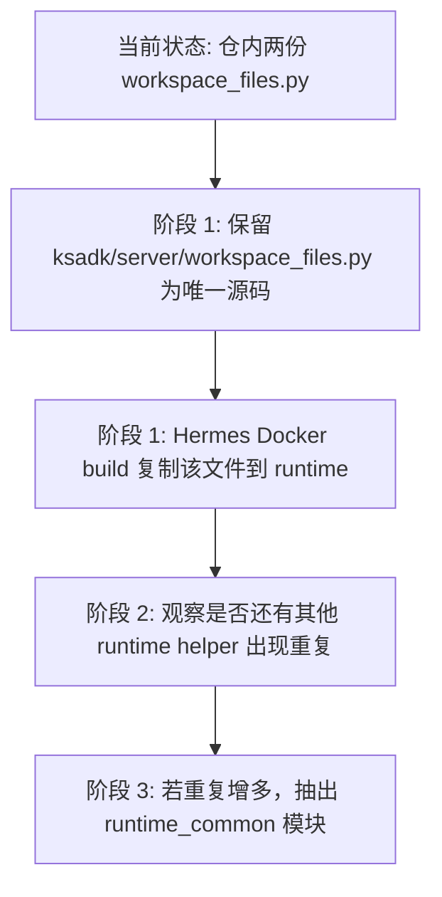

# Workspace Files 去重改造方案比较稿

## 1. 问题定义

当前仓内存在两份 `workspace_files` 实现：

- `ksadk/server/workspace_files.py`
- `deploy/hermes/runtime/workspace_files.py`

这两份代码几乎相同，但运行上下文不同：

- 前者给 `ksadk` code runtime 使用
- 后者给 Hermes runtime 镜像使用

这会带来一个非常明确的维护风险：

- 任何路由、安全策略、返回结构、上传限制的修改，都需要手动改两处
- 测试虽然能帮忙兜底，但不能阻止“改了一处忘了另一处”

这个扣分项是成立的，不是吹毛求疵。

## 2. 当前现状

当前实现的优点：

- 简单直接
- Hermes runtime 不依赖完整 `ksadk` 包
- 镜像可以独立构建

当前实现的问题：

- 仓库里维护两份源码
- `deploy/hermes/runtime/workspace_files.py` 顶部已经写了：
  - `Keep this module aligned with ksadk.server.workspace_files`
- 这说明维护者已经知道这里存在漂移风险

## 3. 目标

- 目标 1：仓内只保留一份 `workspace_files` 源码
- 目标 2：Hermes runtime 仍可独立构建
- 目标 3：不要为了去重把 Hermes 镜像强耦合到整个 `ksadk` 依赖树
- 目标 4：尽量不破坏现有测试和镜像构建流程

## 4. 方案比较

### 方案 A：Hermes 镜像直接安装 `ksadk` wheel

做法：

- 先构建 `ksadk` wheel
- Hermes Dockerfile 在构建时 `pip install ksadk-*.whl`
- runtime 直接 `import ksadk.server.workspace_files`

优点：

- 真正单一源码
- 运行时 import 关系最清晰

缺点：

- Hermes runtime 会依赖完整 `ksadk` 包
- 依赖树变重，镜像构建和版本对齐复杂度上升
- 如果 `ksadk` 未来再引入更多 server 依赖，Hermes runtime 会被被动拖进来

推荐结论：

- 不推荐作为当前阶段方案
- 只有在 Hermes runtime 本来就准备正式依赖 `ksadk` 包时才合适

### 方案 B：构建阶段复制单一源文件

做法：

- 仓内只保留 `ksadk/server/workspace_files.py`
- Hermes Dockerfile 在构建时把这一个文件复制到 runtime 目录
- Hermes runtime 继续以本地模块方式导入

优点：

- 仓内只有一份源码
- Hermes runtime 不需要安装完整 `ksadk`
- 改动小，落地快
- 与当前 Docker build 流程天然兼容

缺点：

- 复制仍然存在，但复制发生在构建阶段，不是人工维护两份源码
- 如果以后共享模块不止一个文件，Dockerfile 会继续增长

推荐结论：

- 这是当前阶段的推荐方案

### 方案 C：抽出 `runtime_common` 共享模块

做法：

- 新建轻量共享模块，例如 `ksadk/runtime_common/workspace_files.py`
- `ksadk.server.app` 和 Hermes runtime 都从这个共享模块导入
- 共享模块只放 runtime 级纯函数与路由拼装，不带 server-specific 依赖

优点：

- 架构上最干净
- 以后不仅 `workspace_files`，其他 shared runtime helper 也能一起收敛

缺点：

- 需要重新梳理包边界
- 需要确认 Hermes runtime 如何在镜像内获得这个模块
- 首次改造成本高于方案 B

推荐结论：

- 这是中长期最佳方案
- 但不是当前最小代价方案

## 5. 推荐方案

### 5.1 结论

分层推荐如下：

- 当前立即落地：`方案 B`
- 中长期演进目标：`方案 C`

不推荐当前直接走 `方案 A`。

### 5.2 为什么当前优先选 B

原因有三点：

- 它能立刻消灭“仓内两份源码”的主要维护风险
- 它不要求 Hermes runtime 依赖完整 `ksadk` 包
- 它对现有测试、镜像构建、发布链路的冲击最小

也就是说，`B` 是“现在就值得做”的解，`C` 是“后面值得继续演进”的解。

## 6. 推荐落地方式

### 6.1 单一源码位置

保留：

- `ksadk/server/workspace_files.py`

删除仓内重复源：

- `deploy/hermes/runtime/workspace_files.py`

### 6.2 构建方式

改成 Docker build 时复制：

```dockerfile
COPY ksadk/server/workspace_files.py /app/runtime/workspace_files.py
```

如果当前 Docker build context 不在仓库根，可以在 Hermes 构建脚本里先把源文件同步到临时上下文，再 `COPY`。

### 6.3 测试方式

测试要从“验证两份文件一致”改成“验证 Hermes 构建产物包含共享源码”：

- 单元测试继续测路由契约
- 模板测试确认 runtime 目录内存在复制后的 `workspace_files.py`
- 不再需要仓内维护 sibling duplicate

## 7. 推荐的演进路径



## 8. 不推荐当前直接做的事情

- 不推荐为了一个 `workspace_files.py` 就让 Hermes 镜像安装完整 `ksadk` wheel
- 不推荐继续保留两份源码，再靠注释和 review 保证同步

前者耦合过重，后者维护风险过高。

## 9. 风险与注意事项

- 风险 1：如果 Docker build context 不能直接访问 `ksadk/server/workspace_files.py`，需要先调整构建入口
- 风险 2：如果未来 `workspace_files.py` 开始依赖更多 `ksadk.server` 内部对象，方案 B 会再次变脆
- 风险 3：如果 Hermes runtime 后续还会复用更多 server helper，应该尽快从 B 演进到 C

因此，方案 B 有一个前提：

- `workspace_files.py` 必须继续保持“纯 runtime helper”性质

## 10. 最终推荐

一句话结论：

- reviewer 指出的重复实现问题是合理的
- 当前最合适的修正方式是“单一源码 + 构建阶段复制”，也就是 `方案 B`
- 如果后续共享逻辑继续增加，再顺势升级到 `runtime_common`，也就是 `方案 C`
