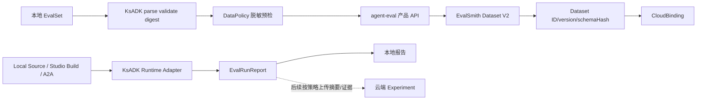

# KsADK Studio 端云评测方案

## 1. 结论摘要

基于 `agentkit-eval-phase1` 当前代码，Studio 本地评测 P0 已实现：统一 EvalSet/Target/Report 合同，支持 Local Source、Studio Build、A2A，CLI 与 Studio 共用执行器，并支持 Operation 进度、取消和部分报告持久化。

端云结合尚未完成。当前缺少 EvalSet 云端绑定、上传 CLI、Studio 上传 UI、版本冲突治理、云端 Dataset version 与 EvalRunSpec 的固定关联，以及 Report/evidence 的云端策略。

目标不是在 KsADK 再建一套 Dataset，而是：

```text
本地 EvalSet -> KsADK 预检/脱敏 -> agent-eval 产品 API -> EvalSmith Dataset V2
                                      -> Dataset ID + immutable version
                                      -> 本地 CloudBinding
```

## 2. 当前能力基线

### 2.1 已具备

#### 统一评测合同

```text
EvalSet 文件
  -> EvalSetVersion
  -> TargetRef
  -> TargetSnapshot
  -> EvalRunSpec
  -> TargetRun / MetricResult
  -> CaseRun
  -> EvalRunReport
```

- `EvalSetVersion` 支持原生 `ksadk.eval/v1`，并兼容 Studio EvaluationSuite、Google ADK EvalSet。
- EvalSet 会规范化多轮 Case、校验 Case ID 唯一性并计算 `contentDigest`。
- `TargetRef` 是待执行目标；`TargetSnapshot` 是执行前冻结的目标身份。
- `EvalRunSpec` 固定 EvalSet、TargetSnapshot、配置和运行 ID。
- `EvalRunReport` 保存状态、Case 结果、Metric 结果、统计和 evidence。
- `DataPolicy` 已有 `local_only`、`metadata_only`、`redacted_trace`、`full_trace`。

#### Target 与执行

| 能力 | 当前状态 |
| --- | --- |
| `LOCAL_SOURCE` | 已具备：从本地源码 snapshot，通过 RuntimeExecutor 执行，Case/Attempt 使用隔离 session。 |
| `STUDIO_BUILD` | Studio 入口已具备基础能力：从不可变 Studio Build artifact 执行，记录 Build digest；CLI 暂无直接选择 Build ID 的参数。 |
| `A2A` | 已具备：Agent Card 发现、调用、鉴权引用、超时、错误映射和取消。 |
| `CODEX_WORKTREE` | 当前仅有 TargetKind/CLI 参数方向，没有注册为公共执行 adapter，不能视为已完成。 |

#### Operation 与 Studio

- CLI `agentengine eval` 和 Studio `POST /api/v1/evaluations` 共用 `execute_evaluation()`。
- Studio 创建 Operation 时预分配 `eval_*`，`resourceId` 可直接定位报告。
- Operation Events 默认使用 SSE；`Accept: application/json` 可轮询增量事件。
- 已有 `evaluation.case.started` 进度事件。
- `POST /api/v1/operations/{operationId}:cancel` 可取消评测。
- 取消会传播到 Local Source、Studio Build、A2A；进入 Case 执行后取消会保存 `CANCELLED` 报告及已完成 Case，TargetSnapshot 完成前取消则只保存 Operation 终态。
- React 评测页只在评测视图加载，不影响原有 Studio 页面；支持当前 Case、取消，以及成功或存在部分报告时的报告跳转。

#### Evaluator 与证据

已支持的确定性评估器包括：

- `response.equals`、`response.contains`、`response.notContains`
- `response.jsonSchema`
- `runtime.maxLatencyMs`、`runtime.maxInputTokens`、`runtime.maxOutputTokens`
- `tool.called`、`tool.notCalled`

Target adapter 可生成 RuntimeEvent、trace reference、token usage 和非敏感 evidence，并写入本地 `.agentkit/evaluations`。

### 2.2 部分具备

- Studio Build 本地执行已具备，但尚未和云端 Dataset、Experiment、Target 形成可审计绑定。
- RuntimeEvent/evidence 已在部分 adapter 落地，但字段、脱敏、大小限制和云端保留策略还未统一。
- A2A 本地协议评测已具备，但远端 Agent registry/version 与 TargetSnapshot 的正式关联尚未建立。
- agent-eval 已有 `CreateEvaluationSet`、`ImportEvaluationSetRow`、`DescribeEvaluationSet`、`ListEvaluationSet` 等产品侧接口，但创建和导入通常是多次调用，尚未提供正式的原子 snapshot publish 语义。

### 2.3 尚未具备

1. `agentengine evalset push` 或等价云端上传 CLI。
2. Studio“预检/上传/发布到云端”UI。
3. 本地 EvalSet 与 Dataset ID/version/schemaHash 的 CloudBinding。
4. `contentDigest` 幂等发布和幂等结果查询。
5. `baseVersion` 乐观锁、diff、冲突和显式 rebase。
6. 云端 Dataset snapshot 到本地 EvalSet 的 pull/import。
7. EvalRunSpec 对固定云端 Dataset version 的记录。
8. 云端 Experiment、Report、TargetSnapshot、Build digest 的统一关联。
9. Report/evidence 上传、脱敏、留存和删除策略。

### 2.4 当前本地评测的已知边界

- 公共 executor 当前顺序执行 Case，没有 Case 并发调度。
- `EvalRunSpec.attempt` 已存在，但公共 executor 当前一次运行只执行 attempt 1，没有 repetitions/多次采样聚合。
- Operation 目前只有 `evaluation.case.started`，还没有 `case.completed`、百分比、预计剩余时间等事件。
- 取消发生在 `TargetSnapshot` 完成后才会形成可持久化的 `CANCELLED` EvalRunReport；snapshot 前取消尚无独立 Run manifest。
- `DataPolicy` 已进入公共合同，但对本地证据的完整递归脱敏和上传门禁尚未实现。
- `llm_judge` 有评估器和配置入口，但依赖外部模型与凭证，不能作为离线确定性门禁。
- Studio Build 由 Studio 注入专用 adapter；通用 `create_target_adapter()` 目前只注册 A2A 和 Local Source。

## 3. 目标架构与职责



| 组件 | 负责 | 不负责 |
| --- | --- | --- |
| KsADK CLI/Studio | 本地文件、规范化、digest、脱敏、预检、用户确认、上传入口、绑定、本地报告 | 云端 Dataset 权威存储和租户权限 |
| agent-eval | 对外产品 API、账号/项目解析、鉴权、请求适配和错误语义 | 长期维护第二套 Dataset 主模型 |
| EvalSmith Dataset V2 | `FieldSchema[] + Row.values`、校验、不可变版本、publish、diff、rollback | 本地路径解析和 Agent 执行 |
| eval-engine/worker | 消费固定 Dataset version，运行云端 Experiment | 执行时隐式读取 current version |
| agentengine-server/gateway | Agent 生命周期、部署、路由、鉴权 | Dataset 主存 |

原则：本地 EvalSet 是 Git 可审查源，云端 Dataset 是共享和规模化执行源；两者通过 converter 连接，不复制第二套评测合同。

## 4. 数据模型与转换

### 4.1 本地 EvalSet

本地继续使用当前结构：

```yaml
schemaVersion: ksadk.eval/v1
name: support-regression
cases:
  - id: case-001
    turns:
      - input: "如何修改密码？"
    assertions:
      - type: response.contains
        value: "密码"
```

### 4.2 云端 Dataset V2

EvalSmith Dataset V2 的主模型是 `FieldSchema[] + Row.values + DatasetVersion`，不是旧的 `inputs/expected_outputs/metadata` 三段式。

建议初版字段：

| 字段 | 类型 | 映射 |
| --- | --- | --- |
| `case_id` | string | `EvalCase.id`，必填 |
| `turns` | json | `EvalCase.turns`，必填，保留多轮结构 |
| `assertions` | json | `EvalCase.assertions`，必填 |
| `case_metadata` | json | `EvalCase.metadata`，可选 |
| `source_format` | string | `sourceFormat` |
| `ksadk_content_digest` | string | `contentDigest` |

需要新增单一转换边界 `EvalSetToDatasetConverter`，负责：

- EvalSetVersion -> FieldSchema。
- EvalCase -> Row.values。
- 保留 turns、assertions、metadata 和 Case ID。
- 计算 schema hash、payload digest、行数和大小。
- 执行 DataPolicy 预检和脱敏。
- Dataset snapshot -> 本地 EvalSetVersion 的反向转换。

Target adapter、RuntimeExecutor 和 Report 执行逻辑不应直接适配 Dataset 字段。

## 5. CloudBinding

建议在 `.agentkit/evaluation-bindings/` 保存绑定 sidecar：

```yaml
schemaVersion: ksadk.eval.cloud/v1
evalset:
  path: evaluations/support.yaml
  contentDigest: sha256:...
remote:
  provider: agent-eval/evalsmith
  projectId: project_xxx
  datasetId: ds_xxx
  version: 3
  schemaHash: sha256:...
sync:
  direction: push
  uploadedAt: 2026-08-13T12:00:00Z
```

binding 不保存 API Key、Cookie、session token、密码或临时签名 URL；本地 EvalSet 源文件仍由 Git 管理。

## 6. 端云主流程

### 6.1 首次发布

```text
选择 EvalSet
  -> parse/validate/digest
  -> DataPolicy 预检和脱敏
  -> 展示项目、字段、行数、大小和敏感信息
  -> 用户确认
  -> agent-eval 原子发布 Dataset snapshot
  -> 返回 datasetId/version/schemaHash
  -> 写 CloudBinding
```

### 6.2 重复发布和冲突

逻辑幂等键建议为 `projectId + contentDigest`：

- digest 未变：返回已有 Dataset/version，不新建版本。
- digest 变化且绑定的 `baseVersion` 仍为 current：发布新版本。
- baseVersion 已过期：拒绝发布，先显示 diff，再显式 rebase/resolve。
- 写请求超时：先查询幂等结果，不能直接重试创建。

该语义必须由 agent-eval/EvalSmith 正式确认，不能只在 KsADK 客户端约定。

### 6.3 云端导入本地

用户明确选择 `datasetId + version`，读取固定 snapshot，转换成新的本地 EvalSet 文件。默认不覆盖原 YAML，建议生成：

```text
evaluations/imported/<dataset-id>-v<version>.yaml
```

### 6.4 评测运行绑定

本地或云端运行均应记录：

```text
EvalSet contentDigest
source = local | remote
remote.datasetId
remote.version
remote.schemaHash
```

运行时必须使用已解析的固定 version，禁止每个 Target 各自读取云端 current version。

### 6.5 Trace 候选回流

生产 Trace 可以形成候选样本，但必须经过人工审核：

```text
Trace -> 候选 Row -> 人工审核 -> 正式 Dataset version -> 回归评测
```

不允许生产 Trace 自动进入正式回归集。

## 7. 安全、可靠性和接口要求

### 7.1 DataPolicy

| 策略 | 上传行为 |
| --- | --- |
| `local_only` | 拒绝上传正文 |
| `metadata_only` | 只上传 digest、行数、来源等摘要 |
| `redacted_trace` | 递归脱敏后上传 |
| `full_trace` | 显式确认、RBAC、审计，默认关闭 |

上传前需要检查 token、邮箱、手机号、URL query secret，并递归处理 JSON 对象和数组。应展示命中字段、脱敏数量和拒绝原因。

### 7.2 写入可靠性

- 创建、发布、回滚必须使用稳定幂等键。
- 超时后先查询写操作结果，不盲目重试。
- 服务端应一次性校验并发布 schema + rows。
- 需要返回 `datasetId/version/schemaHash/contentDigest/rowCount`。
- 需要支持 `baseVersion` 冲突错误。
- 大数据集超过请求体限制时使用对象存储 manifest。

### 7.3 建议接口

KsADK 内部 service：

```text
preview(evalset, policy)
push(evalset, project, policy)
pull(datasetId, version)
diff(binding, evalset)
```

Studio API 可在其上提供：

```text
GET  /api/v1/evaluation-cloud/catalog
POST /api/v1/evaluation-cloud/preview
POST /api/v1/evaluation-cloud/publish
GET  /api/v1/evaluation-cloud/bindings
POST /api/v1/evaluation-cloud/pull
GET  /api/v1/evaluation-cloud/diff
```

写接口沿用 Studio session/CSRF，并要求 `Idempotency-Key`。

agent-eval 现有 `CreateEvaluationSet`、`ImportEvaluationSetRow`、`DescribeEvaluationSet`、`ListEvaluationSet` 可用于 POC；正式发布前必须补齐或确认原子 snapshot publish、digest 幂等、baseVersion、固定 snapshot 读取和部分成功语义。

## 8. Studio 目标产品形态

评测页增加独立的“数据集来源”区域，不改变已有本地评测流程：

- 本地 EvalSet：选择工作区内文件。
- 云端 Dataset：选择项目、Dataset 和固定版本。
- 同步状态：未绑定、已同步、本地有变更、云端有变更、冲突。
- 预检结果：字段、行数、digest、大小、脱敏结果。
- 发布确认：目标项目、baseVersion、是否新建版本和风险提示。

报告页必须显示：

```text
EvalSet / contentDigest
Source: local | remote
Dataset ID / Version / SchemaHash
TargetSnapshot / Build digest
DataPolicy
```

## 9. 分阶段开发计划

### Cloud-0：协议与转换器 Spike

1. 新增 `EvalSetToDatasetConverter`。
2. 新增 CloudBinding 模型和本地存储。
3. 增加 `evalset preview`/dry-run。
4. 输出 schema、digest、行数、大小、敏感字段。
5. 用 mock agent-eval 验证多轮、assertions、错误和脱敏。
6. 冻结原子 publish、鉴权、幂等、冲突契约。

验收：local_only 不发网络请求；多轮 turns/assertions 无损；digest 稳定；敏感字段可拒绝或脱敏。

### Cloud-1：单向 Push

1. `agentengine evalset push <file> --project-id <id>`。
2. Studio 增加预检和发布确认。
3. 首次创建、同 digest 幂等、CloudBinding 写入。
4. 上传过程使用 Operation、进度、取消和错误报告。
5. 暂不上传 Report/evidence。

### Cloud-2：版本治理与双向同步

1. 版本列表、固定 snapshot pull、diff。
2. `baseVersion` 冲突检测和显式 rebase。
3. 云端 Dataset 导入本地 EvalSet。
4. EvalRunSpec 绑定 Dataset version。

### Cloud-3：云端 Experiment 与证据

1. TargetSnapshot/Studio Build/A2A Agent 与云端 Target 关联。
2. 固定 Dataset version 创建云端 Experiment。
3. 上传 Report summary、metrics、TargetSnapshot。
4. 按 DataPolicy 分层上传 evidence。
5. Trace 候选回流、人工审核、RBAC、审计和留存。

## 10. Owner 与边界

| 工作 | 建议模块 | Owner |
| --- | --- | --- |
| EvalSet -> Dataset converter | 新建 `ksadk/evaluation/cloud_converter.py` | 公共评测 Owner |
| CloudBinding | 新建 `ksadk/evaluation/cloud_binding.py` 或 Studio storage 扩展 | Studio/存储 Owner |
| agent-eval client | 独立 cloud client | Studio/存储 Owner |
| CLI preview/push | 新建 `cmd_evalset.py` 或独立命令入口 | 公共评测 + Studio 联合评审 |
| Studio API/UI | cloud service、`api.py`、评测页新增区域 | Studio Owner |
| Report/TargetSnapshot 扩展 | 单一转换边界 | 公共评测 Owner |

云端 Dataset 逻辑不要写入 `local_adapter.py`、`studio_build_adapter.py`、`a2a_adapter.py`、RuntimeExecutor 或 Agent runtime 入口。

## 11. 正式开发前的阻断项

必须先和 agent-eval/EvalSmith 团队确认：

1. 原子 schema + rows publish 接口和请求大小上限。
2. `projectId`、账号、权限和鉴权传递方式。
3. `contentDigest` 幂等键和结果查询接口。
4. `baseVersion` 冲突错误码及 diff 语义。
5. 固定 Dataset version snapshot 读取接口。
6. 大数据集对象存储 manifest 方案。
7. Dataset version 与云端 Experiment 的绑定字段。
8. Report/evidence 的云端归属、保留和删除策略。

契约冻结前，不应直接实现“上传按钮 + 创建 Dataset + 多次导入 Rows”的正式功能，否则会产生重复 Dataset、半成品版本、静默覆盖和不可复现报告。

## 12. 最终目标

```text
本地编辑 EvalSet
  -> 预检/脱敏
  -> 发布云端 Dataset version
  -> 选择 Local Source / Studio Build / A2A Target
  -> 固定 Dataset version + TargetSnapshot
  -> 本地或云端执行
  -> Operation 进度
  -> EvalRunReport / Experiment Report
  -> 可追溯到 EvalSet digest、Dataset version、Build digest 和 DataPolicy
```

本地模式提供开发者快速反馈，云端模式提供共享、权限、版本和规模化运行；两者必须保持同一套 EvalSet、TargetSnapshot、指标和报告语义。
