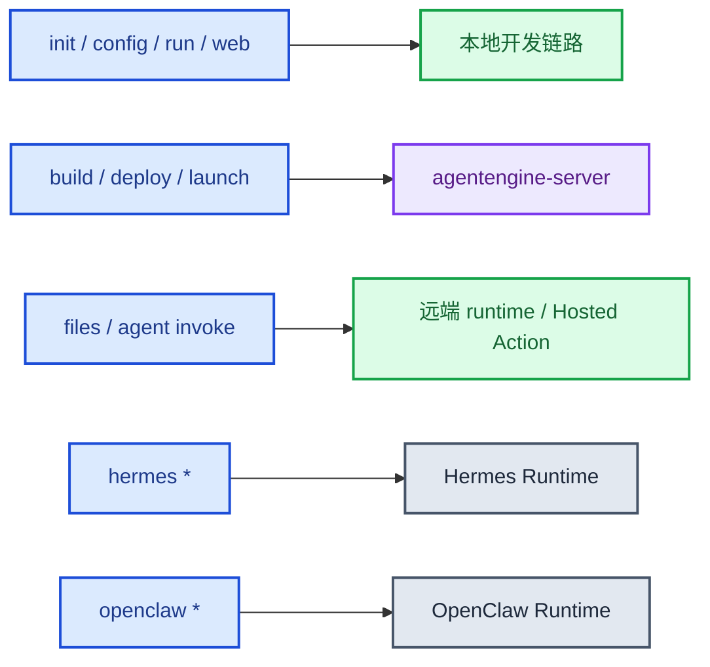
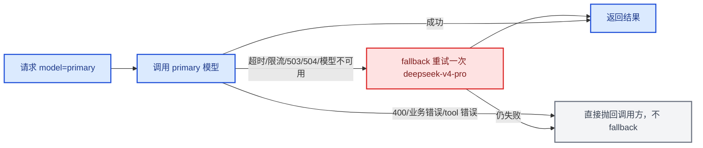
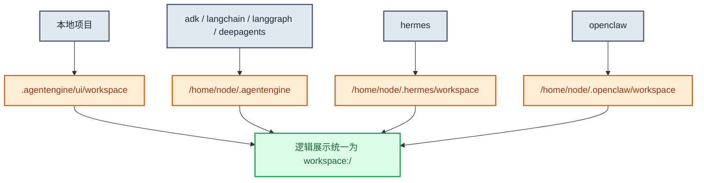
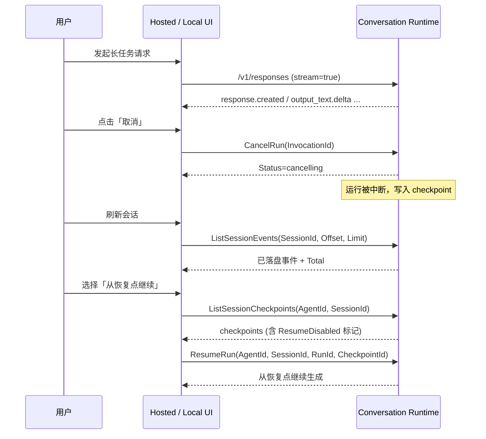

# ksadk使用文档

本文档面向使用 `agentengine` / `ksadk` 的开发者、SA 与交付同学，口径以当前仓库代码、CLI 帮助、测试断言和 Docker/Makefile 默认值为准。

## 1. 适用范围

当前文档覆盖这些主线能力：

- 本地初始化、配置、运行与调试
- `build / deploy / launch` 的构建与部署参数
- `agentengine files` 的完整工作区文件管理链路
- Hermes 与 OpenClaw 的部署和常用验证路径
- PVC 默认值、默认挂载目录、容量约束
- `agentengine agent invoke` 的 Hermes 远端 native 调用与本地目录同步
- 统一模型策略与 fallback（`0.6.6` 引入，`0.6.7` 补齐 reasoning 与 thinking 兼容）
- Hosted 附件 `ae-upload://` scheme 与 `AttachmentContent` action
- `ListSessions` / `ListSessionEvents` 分页字段
- Custom UI bundle 与 `RuntimeCapabilities` 能力位
- `--env` / `--env-file` 运行时环境变量与 `.env` 构建上下文边界
- KCR 企业版 / 个人版 / 第三方镜像仓库凭证收敛
- 长任务恢复与 `CancelRun` / `ResumeRun` 用户向流程

## 2. 安装与入口

```bash
pip install -U ksadk
```

可选 extras：

```bash
pip install "ksadk[langgraph]"
pip install "ksadk[langchain]"
pip install "ksadk[deepagents]"
pip install "ksadk[adk]"
pip install "ksadk[skills]"
```

知识库和长期记忆使用的 `kingsoftcloud-sdk-python` 已包含在默认依赖中，不需要额外安装 `ksadk[kb]`。

命令入口等价：

```bash
agentengine --help
ksadk --help
```

## 3. CLI 全景

当前主线命令组包括：

- `init`
- `config`
- `run`
- `web`
- `build`
- `deploy`
- `launch`
- `agent`
- `files`
- `dashboard`
- `hermes`
- `openclaw`
- `mcp`
- `a2a`

全局选项包括：

- `--output pretty|json`
- `--dry-run`
- `--no-color`



## 4. 最短成功路径

### 4.1 本地项目初始化

```bash
agentengine init my-agent -f langgraph
cd my-agent
agentengine config
agentengine run -i
```

本地 Web UI：

```bash
agentengine web --port 8080
```

### 4.2 云端一键部署

```bash
agentengine launch . --target serverless
```

### 4.3 Hermes 云端部署

```bash
agentengine init my-hermes -f hermes
cd my-hermes
agentengine hermes deploy --name my-hermes
agentengine hermes status
```

### 4.4 OpenClaw 云端部署

```bash
agentengine init my-openclaw -f openclaw
cd my-openclaw
agentengine openclaw deploy
agentengine openclaw status
```

### 4.5 Skill Runtime 与内置工具接入

`0.6.2` 新增 `ksadk.toolsets`，开发者可以在 LangGraph、LangChain、DeepAgents 或自定义 runner 中显式绑定 AgentEngine 内置工具。推荐默认使用渐进式披露，避免把所有低频或高风险工具直接塞进模型上下文：

```python
from ksadk.toolsets import describe_agentengine_tools, get_agentengine_tools

tools = get_agentengine_tools(include=["focused", "agentengine_tool_dispatcher"])
tool_specs = describe_agentengine_tools(include=["focused", "agentengine_tool_dispatcher"])
```

`focused` 默认直接暴露这些高频工具：

- Skill Space：`list_skills`、`search_skills`、`load_skill`
- Workspace：`workspace_status`、`search_workspace_files`、`edit_workspace_file`、`lint_workspace_file`
- Platform：`component_status`
- Sandbox：`sandbox_status`

低频、高风险或上下文较重的工具通过 `agentengine_tool_dispatcher` 按需 `list` / `describe` / `call`：

```python
from ksadk.toolsets import agentengine_tool_dispatcher

agentengine_tool_dispatcher("describe", tool_name="run_code")
agentengine_tool_dispatcher(
    "call",
    tool_name="run_code",
    arguments={"code": "print(42)", "language": "python"},
)
```

`get_agentengine_tools()` 无参仍返回全量工具，兼容旧项目；新项目建议显式写 `include=["focused", "agentengine_tool_dispatcher"]`。如果只需要某个分组，也可以写 `include=["skill"]`、`include=["workspace"]`、`include=["platform"]` 或 `include=["sandbox"]`。

Skill Runtime 执行入口是 `execute_skills`。它只用于 workflow 型任务，普通 instruction-first Skill 推荐先 `load_skill` 读取 `SKILL.md`，再由外层 agent 按指令完成。隔离执行 backend 由环境变量决定：

- `KSADK_SKILL_RUNTIME_BACKEND=local_process`：走本地 agent 进程
- `KSADK_SKILL_RUNTIME_BACKEND=e2b`：走远程 sandbox / E2B backend
- 未设置 backend 但存在 `KSADK_SANDBOX_TEMPLATE_ID`：自动走 E2B
- 显式 `KSADK_SKILL_RUNTIME_BACKEND=disabled`：禁用隔离执行

Workspace 内置工具只访问 AgentEngine UI workspace，不访问任意宿主机路径。`edit_workspace_file` 是 exact snippet replacement；匹配不到返回 `snippet_not_found`，匹配次数不符合预期返回 `ambiguous_edit`。`lint_workspace_file` 提供 Python AST、JSON parse 和通用文本轻量检查。

Sandbox direct tools 只通过 configured isolated sandbox backend 执行。`run_command` / `run_code` 不会退化为宿主机 shell；未配置 sandbox 时会返回诊断。`execute_skills`、Workspace 写入/删除、sandbox command/code 等中高风险工具会经过 Tool Gateway；strict 模式下会返回 `approval_required`，由 UI 或调用方回传批准后继续。

## 5. `/v1/responses` OpenAI 兼容接口

本地 `agentengine run -i` 启动后，AgentEngine 暴露 `/v1/responses`。这一接口优先兼容 OpenAI Responses 的返回结构和 SSE 生命周期，同时保留少量 `ksadk` 扩展字段，方便会话和本地 CLI 继续工作。

### 5.1 非流式调用

```bash
curl http://127.0.0.1:8000/v1/responses \
  -H "Content-Type: application/json" \
  -d '{
    "model": "glm-5.2",
    "input": "请用一句话介绍 AgentEngine",
    "instructions": "只用中文回答，语气简洁",
    "metadata": {"source": "local-doc"}
  }'
```

当前支持的常用请求字段：

- `input`：字符串或 OpenAI message/input item 列表。
- `model`：本轮请求使用的模型，会同步到运行时环境。
- `instructions`：本轮系统/开发者指令，不写入用户消息正文；LangGraph 会转为 system message，字符串输入类 runner 会作为 prompt 前缀。
- `metadata`：请求元数据，会回显到 response object，并记录到本轮事件 metadata；不参与模型生成。
- `stream`：`true` 时返回 SSE。
- `session_id`：复用已有会话；未传时自动创建。

非流式响应包含官方风格字段：`id`、`object`、`created_at`、`status`、`model`、`output`、`metadata`、`usage`、`error`、`incomplete_details`。同时保留 `output_text` 和 `session_id` 作为 `ksadk` 扩展，兼容现有调用方。

### 5.2 流式调用

```bash
curl -N http://127.0.0.1:8000/v1/responses \
  -H "Content-Type: application/json" \
  -d '{
    "model": "glm-5.2",
    "session_id": "sess-demo-001",
    "input": [{"role": "user", "content": [{"type": "input_text", "text": "分析这个任务"}]}],
    "stream": true
  }'
```

`model` 和 `session_id` 在流式与非流式调用中都可传；`session_id` 用来复用同一会话，未传时自动创建。

流式事件按 Responses 生命周期输出：

- `response.created` / `response.in_progress`：响应创建与开始运行。
- `response.output_item.added` / `response.content_part.added`：开始输出 message、reasoning、function call 或 MCP approval request。
- `response.output_text.delta` / `response.output_text.done`：正文增量与正文完成。
- `response.reasoning.delta`：思考内容增量，前端可选择单独渲染。
- `response.function_call_arguments.delta` / `response.function_call_arguments.done`：工具调用参数；底层一次性拿到参数时也会按一次 delta + done 输出。
- `response.output_item.done` / `response.content_part.done`：输出项或内容块完成。
- `response.completed`：本轮完成。
- `response.failed`：运行失败。
- `response.incomplete`：需要人工审核或中断恢复。

工具结果和人工审核的兼容策略：

- `response.ksadk.tool_result`：工具执行结果。
- 能明确识别为工具审批的 interrupt 会渲染为官方风格 `mcp_approval_request` output item。
- 其他通用 interrupt 使用 `response.ksadk.approval_request` 扩展事件；最终 response 会以 `status: "incomplete"` 返回，并在 `incomplete_details.ksadk_interrupt` 中包含中断信息。

### 5.3 图片与附件输入

`/v1/responses` 是默认主维护协议，按 OpenAI Responses 语义接收 `input_text` / `input_image` / `input_file`。运行时会把这些输入块原样投影到 runner 的 `input_content` / `input_messages`，同时生成 legacy/internal 的 `input_parts` 兼容旧 runner。

当前 `/v1/responses` 推荐输入块：

- `input_text`
- `input_image`
- `input_file`

旧客户端仍可传 KOP 风格 part 数组，运行时会兼容：

- `text`
- `inlineData`
- `fileData`

推荐图片传法：

1. 按 OpenAI Responses 官方形态传 `input_image.image_url`，其中 `image_url` 可以是远程图片 URL，也可以是 `data:image/...;base64,...`
2. 老客户端可先调用 `UploadFile` 上传图片，再通过兼容扩展 `fileData.fileUri` 引用
3. 老客户端可直接把图片 base64 放进兼容扩展 `inlineData.data`

OpenAI 风格 data URL 示例：

```json
{
  "input": [
    {
      "role": "user",
      "content": [
        { "type": "input_text", "text": "请分析这张图片" },
        {
          "type": "input_image",
          "image_url": "data:image/png;base64,<base64-encoded-image-bytes>"
        }
      ]
    }
  ],
  "stream": false
}
```

运行时会保留这个官方输入块到 `input_content`，并额外归一化为内部附件上下文，因此业务代码可以继续通过 `has_current_files` / `current_attachments` 判断本轮是否带图。远程图片 URL 会作为引用保留，并可在支持原生图片输入的 LangGraph 路径下继续传给模型；KsADK 不会主动拉取远程图片做 OCR。需要平台提取、OCR 或本地附件内容时，请使用 data URL、`inlineData` 或 `fileData`。

多模态模型“看图”和平台 OCR 是两条不同链路：推荐让支持图片的模型直接消费 `input_image` / `input_content`，这样不需要在代码包里安装本地 OCR 依赖。平台本地 OCR 只用于需要把图片预先转成 `current_attachment_results[*].text` 的场景；源码构建默认不打包 OCR 二进制栈，如需启用请在构建环境设置 `KSADK_BUILD_ENABLE_ATTACHMENT_OCR=true`，或在项目 `requirements.txt` 中显式加入 OCR 相关依赖。

OpenAI 风格文件示例：

```json
{
  "input": [
    {
      "role": "user",
      "content": [
        { "type": "input_text", "text": "请总结这个文件" },
        {
          "type": "input_file",
          "filename": "resume.txt",
          "file_data": "<base64-encoded-file-bytes>"
        }
      ]
    }
  ]
}
```

`input_file.file_data` 会保留在 `input_content`，并归一化为内部 `inlineData`；`input_file.file_url` / `input_file.file_id` 会保留为引用，并归一化为内部 `fileData`。KsADK 不会主动拉取远程 `file_url` 内容；需要平台提取或 OCR 时，请使用 `file_data`、`inlineData` 或先上传后用 `fileData.fileUri`。

旧客户端先上传再引用的兼容示例：

```json
{
  "input": [
    {
      "role": "user",
      "content": [
        { "text": "请分析这张图片" },
        {
          "fileData": {
            "fileUri": "ksadk-upload://abc123.png",
            "displayName": "diagram.png",
            "mimeType": "image/png"
          }
        }
      ]
    }
  ],
  "stream": false
}
```

旧客户端直接内联的兼容示例：

```json
{
  "input": [
    {
      "role": "user",
      "content": [
        { "text": "请分析这张图片" },
        {
          "inlineData": {
            "data": "<base64-encoded-image-bytes>",
            "displayName": "diagram.png",
            "mimeType": "image/png"
          }
        }
      ]
    }
  ]
}
```

当前附件类型支持矩阵：

| 类型 | 典型扩展名 / MIME | 传输支持 | 平台内容提取 | 原生多模态直通 |
| --- | --- | --- | --- | --- |
| 文本 | `.txt` `.md` `.json` `.yaml` `.yml` `.csv` `.tsv` `.log` | 支持 | 支持 | 不适用 |
| 文档 | `.pdf` `.docx` `.pptx` `.xlsx` `.html` `.htm` | 支持 | 部分支持：文本提取 / OCR | 不适用 |
| 图片 | `.png` `.jpg` `.jpeg` `.webp` / `image/*` | 支持 | 元信息提取默认支持；OCR 需构建时显式启用 | 部分支持，见下方 |
| 压缩包 | `.zip` | 支持 | 支持：目录/可读文件抽样提取 | 不适用 |
| 其他二进制 | 其他后缀或 `application/octet-stream` | 支持 | 通常仅保留为附件引用 | 不支持 |

框架差异：

- `ADK`
  - 图片会优先按原生 bytes part 传给底层 SDK
  - 如果模型支持原生多模态，可直接吃图
- `LangGraph`
  - 若模型支持图片输入，默认消息构造会把图片附件转换成多模态 `HumanMessage.content` blocks
- `LangChain`
  - 当前不保证所有 agent 自动原生吃图
  - 如需原生多模态，建议在 `ksadk_prepare_input(payload, session_context)` 中优先消费 `input_content / input_messages`，必要时再兼容 `input_parts / current_attachments / attachments`
  - 判断当前轮是否传文件用 KsADK runner payload 扩展字段 `has_current_files`；该字段不是 OpenAI Responses API 官方字段

模型能力判断优先级：

1. 请求里显式传入的 `model_metadata`
2. runtime 通过 `OPENAI_BASE_URL` / `OPENAI_API_KEY` 查询上游 `/v1/models` 返回的 `architecture.input_modalities`
3. 本地默认兜底（按文本模型处理）

### 5.4 Hosted 附件与 `ae-upload://`

!!! new "0.6.6 新增"

Hosted 部署下，用户在 Hosted UI 上传的附件不再以本地 `ksadk-upload://` 落盘，而是由控制面托管，统一以 `ae-upload://<file_id>` scheme 引用。两类 URI 的区别：

| 附件 URI scheme | 来源 | 存储 | 读取方式 |
| --- | --- | --- | --- |
| `ksadk-upload://<file_id>` | 本地 `agentengine run -i` / CLI 上传 | 本地 `files/` 目录 + KS3 兜底 | 本地直读或 KS3 回源 |
| `ae-upload://<file_id>` | Hosted 控制面上传 | 控制面托管对象 | 经由 `AttachmentContent` action 拉取 |

读取 `ae-upload://` 附件时，conversation runtime 会调用 Hosted 控制面的 `AttachmentContent` action：

```
GET /agentengine/api/v1/AttachmentContent?FileUri=ae-upload://<file_id>
```

返回内容包含二进制字节、`display_name` 与 `content_type`。拉取成功后，runtime 会把内容写回本地附件 cache 目录（`<session>/files/`）并落一份 `.meta.json`，后续同一会话内再次读取该附件时优先命中本地 cache，避免重复远端拉取。

会话刷新（refresh / rehydrate）后，已写回本地 cache 的 Hosted 附件会继续以本地 cache 读取；未命中本地 cache 的 `ae-upload://` 附件会再次触发 `AttachmentContent` 拉取。`ensure_local_path` / `read` 会保证返回可用本地路径，业务代码无需关心附件原始来源。

### 5.5 会话与事件分页

`ListSessions` 与 `ListSessionEvents` 支持分页，字段对齐控制面 action 契约：

| Action | 请求字段 | 响应字段 |
| --- | --- | --- |
| `ListSessions` | `AgentId`、`UserId`（默认 `user`）、`Page`（≥1）、`PageSize`（1~200，默认 20） | `Sessions`、`Total`、`Page`、`PageSize` |
| `ListSessionEvents` | `SessionId`、`Offset`（≥0）、`Limit`（≥1） | `Events`、`Total`、`Offset`、`Limit` |

`ListSessions` 用 `Page` / `PageSize` 做页式分页，客户端按 `Total` 计算总页数；`ListSessionEvents` 用 `Offset` / `Limit` 做偏移分页，`Total` 为该会话事件总数。事件按追加顺序返回，分页只读取已落盘事件，不会阻塞正在写入的事件流。

### 5.6 当前不支持

本期不支持 `previous_response_id`、`store`、复杂 `reasoning/text` 控制、完整 tool schema 请求面，也不新增原生 LangGraph state endpoint。自定义 LangGraph State 请使用 `ksadk_prepare_state` 或 `agentengine init --from-agent` 自动生成的 adapter。

## 6. 统一模型策略与 fallback

!!! new "0.6.7 新增"

`0.6.6` 起引入统一模型策略契约，`0.6.7` 补齐 reasoning 声明与 thinking disabled 兼容。Hermes、OpenClaw 与通用 Agent 共用一套默认语义，避免三类 runtime 各自维护一份模型清单。

### 6.1 策略契约

策略以 JSON 描述，可通过环境变量 `AGENTENGINE_MODEL_POLICY_JSON` 整体覆盖。未设置时使用内置默认策略 `DEFAULT_MODEL_POLICY`（版本号 `v1`）：

```json
{
  "version": "v1",
  "primary": {"model": "glm-5.2"},
  "multimodal": {"model": "kimi-k2.7-code"},
  "fallback": {
    "model": "deepseek-v4-pro",
    "fallback_errors": [
      "timeout",
      "temporarily unavailable",
      "model unavailable",
      "rate limit",
      "too many requests",
      "503",
      "504"
    ],
    "on_errors": [
      "timeout",
      "temporarily unavailable",
      "model unavailable",
      "rate limit",
      "too many requests",
      "503",
      "504"
    ]
  },
  "models": {
    "glm-5.2": {"reasoning": true, "options": {}},
    "kimi-k2.7-code": {"input": ["text", "image"], "reasoning": true, "options": {"temperature": 1}},
    "deepseek-v4-pro": {"reasoning": true, "options": {}}
  }
}
```

三个角色的语义：

| 角色 | 默认模型 | 用途 |
| --- | --- | --- |
| `primary` | `glm-5.2` | 默认文本主模型，未显式指定 `model` 时使用 |
| `multimodal` | `kimi-k2.7-code` | 图片/多模态输入时路由到的模型 |
| `fallback` | `deepseek-v4-pro` | 主模型遇到可恢复错误时重试一次的目标模型 |

构建期会把策略序列化后注入 runtime 环境变量，并按 runtime 类型分别填充对应的模型变量：

- 通用 Agent：`OPENAI_MODEL_NAME`（primary）、`OPENAI_FALLBACK_MODEL_NAME`（fallback）
- `hermes`：`HERMES_DEFAULT_MODEL`（primary）、`HERMES_FALLBACK_MODEL`（fallback）、`HERMES_MODEL_CATALOG_JSON`
- `openclaw`：`OPENAI_MODEL_NAME`（primary，带 `ksyun/` provider 前缀）、`OPENCLAW_FALLBACK_MODEL`、`OPENCLAW_IMAGE_MODEL`（multimodal）、`OPENCLAW_MODEL_CATALOG_JSON`

!!! info "策略合并"
`AGENTENGINE_MODEL_POLICY_JSON` 传入的 JSON 会与 `DEFAULT_MODEL_POLICY` 做深度合并（deep merge），未声明的字段保留默认值；只覆盖你想改的部分即可。`fallback.fallback_errors` / `fallback.on_errors` 会被同步成同一份列表。

### 6.2 自动 fallback 与重试

conversation runtime 在主模型调用失败时按错误信息判断是否自动 fallback 重试一次：

- 可恢复错误会触发 fallback：超时、限流（rate limit / too many requests）、模型不可用、`503` / `504` 等临时不可用。
- 不会吞掉的错误，直接抛回调用方：`400` 参数错误、`invalid request` / `bad request`、业务错误、tool 执行错误。
- fallback 目标模型等于当前模型时不重试，避免空转。
- 只重试一次；fallback 仍失败则按原错误返回。

### 6.3 reasoning 声明与 catalog

!!! new "0.6.7 新增"

`0.6.7` 起在 `models.<model>` 中声明 `reasoning: true`。构建期生成的 model catalog（`OPENCLAW_MODEL_CATALOG_JSON` / `HERMES_MODEL_CATALOG_JSON`）会输出 `reasoning` 字段，Hosted UI 可据此判断是否渲染思考内容区。catalog 每条记录形如：

```json
{
  "id": "glm-5.2",
  "name": "glm-5.2",
  "api": "openai-completions",
  "input": ["text"],
  "reasoning": true
}
```

`input` 字段用于声明多模态能力（如 `kimi-k2.7-code` 为 `["text", "image"]`）；`options` 透传模型默认参数（如 temperature）。

### 6.4 thinking disabled 兼容

当本轮请求显式关闭思考（`reasoning.effort` 归一化为 `none` / `disabled`，或 `max_reasoning_tokens=0`）时，runtime 会向 OpenAI 兼容请求的 `extra_body` 注入：

```json
{
  "enable_thinking": false,
  "chat_template_kwargs": {"enable_thinking": false}
}
```

这套字段是 DeepSeek 系模型关闭 thinking 的兼容写法；对不识别该字段的模型无副作用。流式输出阶段会过滤 reasoning output item，确保关闭思考时不会向客户端回吐思考内容。



## 7. Framework、挂盘与 workspace 约定

### 7.1 默认 PVC 规则

来自 `ksadk/cli/storage.py` 的统一约束：

- 默认容量：`20Gi`
- 最小容量：`20Gi`
- 最大容量：`500Gi`

### 7.2 默认挂载目录

| Framework | 默认挂载目录 | workspace 逻辑根 | 当前代码里可直接确认的绝对路径 |
| --- | --- | --- | --- |
| `adk` | `/home/node/.agentengine` | `workspace:/` | 运行时对外统一以逻辑根 `workspace` 暴露 |
| `langchain` | `/home/node/.agentengine` | `workspace:/` | 运行时对外统一以逻辑根 `workspace` 暴露 |
| `langgraph` | `/home/node/.agentengine` | `workspace:/` | 运行时对外统一以逻辑根 `workspace` 暴露 |
| `deepagents` | `/home/node/.agentengine` | `workspace:/` | 运行时对外统一以逻辑根 `workspace` 暴露 |
| `hermes` | `/home/node/.hermes` | `workspace:/` | `/home/node/.hermes/workspace` |
| `openclaw` | `/home/node/.openclaw` | `workspace:/` | `/home/node/.openclaw/workspace` |

补充说明：

- 本地 `ksadk server` 的 workspace 根目录是 `<project>/.agentengine/ui/workspace`。
- 对外 CLI 和 Hosted UI 一律展示逻辑根 `workspace:/...`。
- 当运行时响应里带有 `workspace_real_root` 或 `workspace_path` 时，CLI 会同时显示“实际目录”。



## 8. `build / deploy / launch` 参数

### 8.1 构建体积与依赖策略

`agentengine build` 默认优先保持源码包轻量，不会把所有平台增强能力的重依赖都打进包：

- 默认包含：KsADK runtime 必需依赖、附件基础解析依赖、`kingsoftcloud-sdk-python`、`requests-aws4auth`。
- 推荐多模态图片写法：让支持图片的模型直接消费 OpenAI Responses `input_image` / runner `input_content`，不要为了“看图”默认启用本地 OCR。
- 兼容 OCR 写法：如果业务明确需要平台先把图片转成 `current_attachment_results[*].text`，再设置 `KSADK_BUILD_ENABLE_ATTACHMENT_OCR=true`，或在项目 `requirements.txt` 显式写入 OCR 依赖。
- MCP adapter：默认不打包；当项目 import `mcp` / `langchain_mcp_adapters`，或 `.env` 配置了非空 `KSADK_MCP_SERVERS` 时自动加入。自动发现不到时可设置 `KSADK_BUILD_ENABLE_MCP=true`。
- PostgreSQL session：默认不打包 `asyncpg`；当 `.env` 设置 `KSADK_SESSION_BACKEND=postgres` 或 PostgreSQL DSN 时自动加入。自动发现不到时可设置 `KSADK_BUILD_ENABLE_POSTGRES_SESSION=true`。

构建会复用 `.agentengine/code_build/pip_cache`，依赖清单未变化时也会复用 `.agentengine/code_build/linux_deps`，避免第二次构建从头下载。`pip install` 默认超时为 45 分钟，可用 `KSADK_BUILD_PIP_INSTALL_TIMEOUT_SECONDS` 调整。

构建完成会打印 zip 体积、解压体积和 Top 体积来源。只有当解压体积超过 500 MB 或 zip 超过 300 MB 时，才会提示切换 container 模式：

```bash
agentengine build . --mode container --push --registry <registry>
```

源码包里依赖本身很多时，优先建议业务拆分不必要依赖、使用环境变量显式关闭未用能力、或切到已有的 container 模式；本轮不建议把 `ksadk` 内置进固定 base 镜像，因为 SDK 更新频繁，固定 base 镜像会降低版本灵活性。

### 8.2 部署、存储与网络参数

以下参数在 `deploy`、`launch` 以及对应 framework 命令中统一存在：

- `--storage-size-gi`
- `--storage-mount-path`
- `--no-storage`

以下 network 参数在 `agentengine deploy`、`agentengine launch` 和 `agentengine openclaw deploy` 中统一存在：

- `--enable-public-access / --disable-public-access`
- `--enable-vpc-access`
- `--vpc-id`
- `--subnet-id`
- `--security-group-id`
- `--availability-zone`

示例：

```bash
agentengine deploy . --target serverless --storage-size-gi 50
agentengine launch . --target kce --storage-mount-path /home/node/.agentengine
agentengine hermes deploy --storage-size-gi 20
agentengine openclaw deploy --no-storage
```

VPC 网络示例：

```bash
agentengine deploy . \
  --target serverless \
  --disable-public-access \
  --enable-vpc-access \
  --vpc-id vpc-xxx \
  --subnet-id subnet-xxx \
  --security-group-id sg-xxx \
  --availability-zone cn-beijing-6a

agentengine launch . \
  --enable-vpc-access \
  --vpc-id vpc-xxx \
  --subnet-id subnet-xxx \
  --security-group-id sg-xxx

agentengine openclaw deploy \
  --enable-vpc-access \
  --vpc-id vpc-xxx \
  --subnet-id subnet-xxx \
  --security-group-id sg-xxx
```

配置文件也可写入 network。CLI 显式参数优先级高于配置文件：

```yaml
network:
  enable_public_access: false
  enable_vpc_access: true
  vpc_id: vpc-xxx
  subnet_id: subnet-xxx
  security_group_id: sg-xxx
  availability_zone: cn-beijing-6a

deploy:
  network:
    enable_public_access: false
    enable_vpc_access: true
    vpc_id: vpc-xxx
    subnet_id: subnet-xxx
    security_group_id: sg-xxx
```

行为要点：

- 不传时使用框架默认挂载目录。
- 容量会在客户端侧先做 `20~500Gi` 校验。
- `--no-storage` 会显式关闭默认 PVC 挂载。
- 只要开启 VPC 访问，或传入 `--vpc-id` / `--subnet-id` / `--security-group-id` 中任意一个，就必须同时具备 `VpcId`、`SubnetId`、`SecurityGroupId`。
- `--availability-zone` 是可选字段，不替代子网或安全组。

### 8.3 运行时环境变量 `--env` / `--env-file`

!!! new "0.6.7 新增"

`agentengine deploy` 与 `agentengine launch` 支持显式透传运行时环境变量，不再只依赖项目根 `.env`：

```bash
# 多次 --env 传 KEY=VALUE
agentengine deploy . --target serverless \
  --env MODEL_NAME=glm-5.2 \
  --env LOG_LEVEL=DEBUG

# 或用一个 .env / JSON 对象文件
agentengine launch . --target kce --env-file ./prod.env
```

- `--env` 可重复传入，格式 `KEY=VALUE`；变量名必须为合法环境变量名（`[A-Za-z_][A-Za-z0-9_]*`）。
- `--env-file` 支持 `.env`（dotenv）或 JSON 对象文件；路径不存在或格式不合法会直接报错退出。
- `--env` 与 `--env-file` 可同时使用，同名变量以 `--env` 为准（命令行优先级高于文件）。

`.env` 构建上下文边界：

- 真实 `.env` 只通过 deploy payload 注入 runtime，不会进入镜像构建上下文或源码包。
- 构建期会复制 `.env.example`（作为模板），但跳过真实 `.env`，避免凭证被打进镜像。
- `.git`、`__pycache__`、`node_modules`、`.pytest_cache` 等同样不会进入构建上下文。

### 8.4 镜像仓库凭证（KCR 企业版 / 个人版 / 第三方）

镜像拉取凭证按目标镜像仓库地址自动判别类型，避免企业版/第三方误用 `KSYUN_ACCOUNT_ID`：

| 仓库类型 | 判别规则 | 凭证要求 |
| --- | --- | --- |
| 企业版 KCR | host 以 `.ksyunkcr.com` 结尾 | 必须配 `KCR_USERNAME` + `KCR_PASSWORD` |
| 个人版 KCR | host 以 `.kce.ksyun.com` 结尾 | `KCR_USERNAME` 可留空，运行时用 `KSYUN_ACCOUNT_ID` 兜底；`KCR_PASSWORD` 必填 |
| 第三方镜像仓库 | 其他 host | 必须配 `KCR_USERNAME` + `KCR_PASSWORD` |

```bash
agentengine config
# 个人版 KCR 可留空 KCR_USERNAME，运行时使用 KSYUN_ACCOUNT_ID 作为用户名兜底
# 企业版 KCR 和第三方镜像仓库必须配置 KCR_USERNAME + KCR_PASSWORD
```

行为要点：

- 检测到 `KCR_PASSWORD` 但缺少 `KCR_USERNAME`，且仓库不是个人版 KCR 时，CLI 会忽略该凭证并给出告警，不会用错误的用户名去拉私有镜像。
- 个人版 KCR 在缺 `KCR_USERNAME` 时，会用 `KSYUN_ACCOUNT_ID` 作为用户名兜底。
- KCR 访问凭证获取：`https://kcr.console.ksyun.com/` → 访问凭证。

### 8.5 Custom UI 与 RuntimeCapabilities

!!! new "0.6.7 新增"

Agent 可以声明自己的 Hosted UI bundle，替代内置统一 UI。两种声明方式：

1. 在项目根 `agentengine.yaml`（或 `ksadk.yaml` / `ksadk.yml`）中声明：

```yaml
ui_profile: custom
ui_path: /
ui_bundle_path: research-ui/dist
```

2. 不写配置时，`agentengine web` 与 runtime 会自动探测项目根 `research-ui/dist/index.html`：存在即视为 custom UI bundle，自动启用 `ui_profile=custom`。

Hosted 部署下，bootstrap 会返回 `RuntimeCapabilities` 字段，声明当前 runtime 支持的能力位，Hosted UI 据此决定是否渲染对应入口。当前包含的能力位：

| 能力字段 | 含义 |
| --- | --- |
| `CancelRun` | 是否支持取消正在运行的 run |
| `ResumeRun` | 是否支持从 checkpoint 恢复长任务（含 `Supported` 子字段） |

`ResumeRun.Supported=true` 时，`ListSessionCheckpoints` 返回的每条 checkpoint 会带 `ResumeDisabled` / `ResumeDisabledReason`，标记哪些恢复点当前可用。已恢复过的 checkpoint 在当前策略下不允许重复恢复。

## 9. 长任务恢复与 CancelRun / ResumeRun

!!! new "0.6.7 新增"

长任务（长 LLM 生成、多步 tool 编排、流式任务）可能因超时、用户主动中断或异常退出而中断。`0.6.7` 起补齐用户向的恢复流程，避免长任务丢失进度。

用户侧典型流程：



关键 action：

- `CancelRun`：传入 `InvocationId`（即 `run_id`）取消正在运行的流式任务。runtime 会先尝试取消进程内 detached stream，再调用 runner 的 cancel 接口；返回 `Cancelled`、`Found`、`Status`、`RunnerCancelStatus`。
- `ListSessionCheckpoints`：列出某个会话可恢复的 checkpoint，支持 `OnlyResumable` 过滤、`Offset` / `Limit` 分页（`Limit` 上限 500）。
- `ResumeRun`：传入 `AgentId` / `SessionId` / `RunId` / `CheckpointId` 从指定恢复点继续。同一 session+run 已有进行中的 resume 时会返回 `resume_already_running`，避免并发重复恢复。

!!! warning "不可恢复的 checkpoint"
- 已是终态的 checkpoint 不可恢复（`ResumeDisabledReason` 会提示「选择更早恢复点重跑」）。
- 进程内 checkpoint 不能跨实例恢复。
- 同一 checkpoint 在当前策略下不允许重复恢复。

## 10. `agentengine files` 工作区文件管理

### 10.1 子命令清单

- `agentengine files list`
- `agentengine files upload`
- `agentengine files download`
- `agentengine files delete`
- `agentengine files push`
- `agentengine files pull`

### 10.2 路径语义

- 远端路径统一是 workspace 相对路径。
- `.`、空字符串和 `/` 会被解释为逻辑根 `workspace:/`。
- 输出里会同时给出：
  - 逻辑路径：`workspace:/docs/readme.md`
  - 真实路径：当运行时返回真实根目录时，显示绝对路径

### 10.3 常用示例

列目录：

```bash
agentengine files list --path .
agentengine files list --path docs --recursive
```

上传单文件：

```bash
agentengine files upload \
  --local-path ./report.md \
  --remote-path reports/report.md
```

下载文件：

```bash
agentengine files download \
  --remote-path reports/report.md \
  --output-path ./downloads/report.md
```

删除文件：

```bash
agentengine files delete --remote-path reports/report.md
```

推送目录：

```bash
agentengine files push \
  --local-dir ./dist \
  --remote-path releases/current
```

拉取目录：

```bash
agentengine files pull \
  --remote-path releases/current \
  --local-dir ./synced
```

### 10.4 `push / pull` 覆盖策略

- 默认不会强制覆盖已有文件。
- 加 `--force` 时，已有同名文件会进入 `overwritten` 结果集。
- 输出会区分：
  - `created`
  - `overwritten`
  - `skipped`

### 10.5 JSON 输出

所有 `files` 子命令都可配合 `--output json` 使用。典型字段包括：

- `workspace_root`
- `workspace_display_path`
- `workspace_real_path`
- `entry_count`
- `size_bytes`
- `size_human`
- `transport_mode`
- `results.created / overwritten / skipped`

### 10.6 大小限制

当前统一上限来自 `ksadk_runtime_common.workspace_files.constants`：

- 单文件上传上限：`100MB`

目录同步时还有两条额外限制：

- 本地目录中任一单文件不能超过上限
- 本地目录总大小也不能超过同一个上限

### 10.7 传输模式

CLI 内部会在两种模式间切换：

- `runtime_direct`：直连 runtime 的 `/_ksadk/workspace/v1/*`
- `action_proxy`：经由控制面 Action 调用

当前代码里的实际策略：

- 常规 agent：优先使用 `runtime_direct`
- OpenClaw：优先使用 `action_proxy`

更完整的协议与安全说明见 [工作区文件技术设计](../internal/工作区文件技术设计.md)。

## 11. `agentengine agent invoke`

`agentengine agent invoke` 是当前主线命令；`agentengine invoke` 仍保留为兼容别名。

### 11.1 常见用法

```bash
agentengine agent invoke my-agent
agentengine agent invoke my-agent --message "你好"
agentengine agent invoke my-agent --transport chat
```

### 11.2 Hermes 远端 native 模式

`--local-workspace` 只支持 Hermes 的远端 native 模式：

```bash
agentengine agent invoke my-hermes \
  --transport native \
  --local-workspace ./local-workspace
```

可选指定远端目录：

```bash
agentengine agent invoke my-hermes \
  --transport native \
  --local-workspace ./local-workspace \
  --remote-workspace-path demos/hermes-pre
```

当前行为：

- 如果不传 `--remote-workspace-path`，默认使用本地目录名作为远端子目录名
- 本地空目录不会被同步
- 会先读取 `GetAgentUiBootstrap` 中的 `WorkspaceFiles.MaxUploadBytes`
- 如 bootstrap 获取失败，则回退到默认 `100MB`

### 11.3 约束

- `--remote-workspace-path` 必须与 `--local-workspace` 一起使用
- `--local-workspace` 不能和单次 `--message` 模式一起使用
- 当前只支持 Hermes 远端 native 模式

## 12. Hermes 命令主线

常用命令：

```bash
agentengine hermes deploy --name hermes-demo
agentengine hermes status
agentengine hermes open --chat
agentengine hermes connect
agentengine hermes exec -- status
```

部署相关默认值：

- 默认 PVC 大小：`20Gi`
- 默认挂载目录：`/home/node/.hermes`
- 默认 workspace 根目录：`/home/node/.hermes/workspace`

## 13. OpenClaw 命令主线

常用命令：

```bash
agentengine openclaw deploy
agentengine openclaw list
agentengine openclaw status
agentengine openclaw gateway doctor
agentengine openclaw channel status --probe
```

### 13.1 当前支持的记忆参数

```bash
agentengine openclaw deploy --memory-system openclaw_default
agentengine openclaw deploy \
  --memory-system mem0 \
  --mem0-instance-id <uuid> \
  --mem0-instance-name my-mem0 \
  --mem0-region cn-beijing-6
```

约束：

- `--memory-system mem0` 时必须传 `--mem0-instance-id`
- `--memory-system openclaw_default` 时不能再传 mem0 细节参数
- 不显式传 `--memory-system` 时，CLI 不会主动覆盖现有服务端配置

### 13.2 当前 mem0 行为

- OpenClaw 镜像内置 mem0 插件资产
- bootstrap 默认把 `openclaw-mem0` 视为延迟同步插件
- 只有在存在 `MEMORY_BACKEND_MANIFEST` 且渲染结果要求该插件时，才会把插件真正同步到实例目录
- 不使用 mem0 时，不会把该插件种到实例的持久化状态里

### 13.3 OpenClaw 存储默认值

- 默认 PVC 大小：`20Gi`
- 默认挂载目录：`/home/node/.openclaw`
- 默认 workspace 根目录：`/home/node/.openclaw/workspace`

更多 OpenClaw 细节见 [OpenClaw一键部署指南](../reference/openclaw一键部署指南.md)。

## 14. 常见验证项

### 14.1 验证工作区文件

```bash
agentengine files list --output json
agentengine files push --local-dir ./workspace --remote-path demo
agentengine files pull --remote-path demo --local-dir ./downloaded --force
```

### 14.2 验证 Hermes remote workspace

```bash
agentengine agent invoke hermes-demo \
  --transport native \
  --local-workspace ./workspace
```

### 14.3 验证 OpenClaw mem0 参数

```bash
agentengine openclaw deploy \
  --memory-system mem0 \
  --mem0-instance-id e52b7fac-e641-4b34-b9f7-6b0b9f190cd4
```

## 15. 相关文档

- [ksadk技术设计](../reference/ksadk技术设计.md)
- [工作区文件技术设计](../internal/工作区文件技术设计.md)
- [记忆使用指南](./记忆使用指南.md)
- [知识库与记忆示例](./知识库与记忆示例.md)
- [OpenClaw一键部署指南](../reference/openclaw一键部署指南.md)
- [DeepAgents说明](./DeepAgents说明.md)
