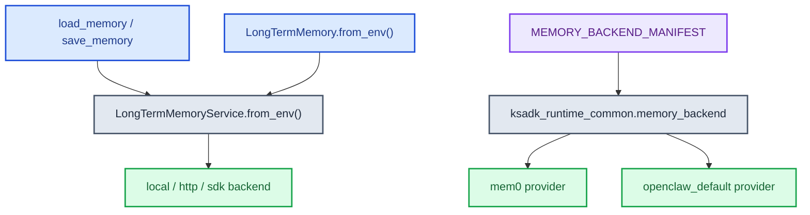
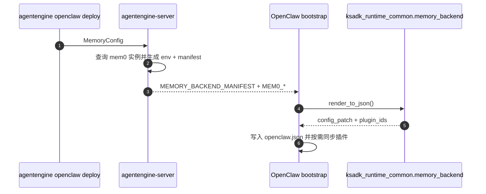

# 记忆使用指南

本文档说明 `ksadk-python` 当前代码里可直接使用的记忆能力，分为两条主线：

1. 平台长期记忆工具：`load_memory` / `save_memory`
2. OpenClaw runtime memory backend：`openclaw_default` / `mem0`

## 1. 能力分层



## 2. 平台长期记忆工具

### 2.1 入口

文件：`ksadk/memory/tool.py`

- `load_memory(query: str) -> str`
- `save_memory(content: str) -> str`

### 2.2 行为约束

- 依赖运行时上下文 `platform_invocation_context`
- 无上下文时不会盲写，而是返回诊断信息
- 保存时会附带 `agent_id / user_id / session_id / runner_type` 等元数据

### 2.3 使用示例

```python
from ksadk.memory.tool import load_memory, save_memory

history = load_memory("用户之前提过哪些偏好")
save_memory("用户偏好：先给结论，再给简短原因")
```

## 3. ADK 记忆服务

文件：`ksadk/memory/adk/long_term_memory.py`

核心入口：

```python
from ksadk.memory.adk.long_term_memory import LongTermMemory

ltm = LongTermMemory.from_env(app_name="demo_app")
```

当前行为：

- 只持久化用户事件
- 会把检索结果转换成 ADK `MemoryEntry`
- 支持 `local`、`http`、`sdk` 三类后端

## 4. 环境变量

### 4.1 通用 LTM 环境变量

- `KSADK_LTM_BACKEND`：`local` / `http` / `sdk`
- `KSADK_LTM_TOP_K`：默认 `5`
- `KSADK_LTM_INDEX`
- `KSADK_LTM_APP_NAME`

### 4.2 `http` 后端

- `KSADK_LTM_HTTP_URL`
- `KSADK_LTM_HTTP_TOKEN`

### 4.3 `sdk` 后端

- `KSADK_LTM_ACCESS_KEY`
- `KSADK_LTM_SECRET_KEY`
- `KSADK_LTM_REGION`
- `KSADK_LTM_ENDPOINT`
- `KSADK_LTM_SCHEME`
- `KSADK_LTM_NAMESPACE`：环境变量名保持不变，值对应新版 SDK 的 `MemoryCollectionId`
- `KSADK_LTM_AGENT_ID`
- `KSADK_LTM_SCENE_ID`：默认 `_sys_general`
- `KSADK_LTM_AUTO_SAVE`：布尔开关。默认在 `KSADK_LTM_BACKEND=sdk` 且 `KSADK_LTM_NAMESPACE` 已设置时开启；设为 `false` / `0` / `off` 可关闭 runtime 每轮完成后的会话文本镜像。

自动镜像只写 user/assistant 文本和附件摘要，metadata 会包含 `agent_id`、`session_id`、`invocation_id`、`model`、`runner_type`。图片、文件 base64 和二进制内容不会写入长期记忆；完整附件回显仍由 AgentEngine conversation 存储负责。

## 5. OpenClaw 的记忆后端声明

### 5.1 CLI 入口

```bash
agentengine openclaw deploy --memory-system openclaw_default
agentengine openclaw deploy --memory-system mem0 --mem0-instance-id <uuid>
```

### 5.2 当前支持的 backend

| backend_type | 含义 |
| --- | --- |
| `openclaw_default` | 保持 OpenClaw 默认记忆模式 |
| `mem0` | 使用 mem0 插件和平台注入的环境变量 |
| `lancedb` | 进程内 LanceDB OpenClaw 记忆插件（plugin id `memory-lancedb`）。通过 `MEMORY_BACKEND_MANIFEST` 直接声明，不走 `agentengine openclaw deploy --memory-system` CLI 入口；manifest 可选覆盖 `dbPath`、embedding 配置和 storage 选项。 |

### 5.3 manifest 契约

`ksadk_runtime_common.memory_backend.manifest` 当前强制按 JSON Schema 校验。即使调用方直接传 `MemoryBackendManifest` 模型实例，也会先 `model_dump()` 再走 schema 校验。

### 5.4 `mem0` provider 约束

当前 `mem0` 渲染要求：

- `config.mem0_instance_id` 必填
- 运行时环境变量必须存在：
  - `MEM0_API_KEY`
  - `MEM0_USER_ID`
  - `MEM0_BASE_URL`

渲染结果会生成：

- `plugins.slots.memory = "openclaw-mem0"`
- `plugins.entries.openclaw-mem0.enabled = true`
- `plugins.entries.openclaw-mem0.config.mode = "platform"`

## 6. 服务端与 runtime 的分工



分工边界：

- server 是 mem0 实例查询、校验和密钥拼装的事实源
- runtime 只消费 manifest 和环境变量，不直接查询 mem0 控制面

## 7. 常见排查

### 7.1 `load_memory` 返回诊断文本

通常表示当前调用不在受支持的运行时上下文里。

### 7.2 `sdk` 后端初始化失败

优先检查：

- 依赖是否安装
- AK/SK 是否齐全
- `KSADK_LTM_ENDPOINT` 与网络环境是否匹配

### 7.3 OpenClaw mem0 渲染失败

当前渲染失败会直接指出缺失的环境变量，例如：

- `mem0 backend requires environment variable 'MEM0_API_KEY'`

### 7.4 OpenClaw 启动后配置校验失败

优先检查：

- `MEMORY_BACKEND_MANIFEST` 是否为合法 JSON
- manifest 中 `mem0_instance_id` 是否满足 schema 要求
- runtime 中的 mem0 插件是否按渲染结果被同步

## 8. 相关文档

- [知识库与记忆示例](./知识库与记忆示例.md)
- [ksadk技术设计](../reference/ksadk技术设计.md)
- [OpenClaw一键部署指南](../reference/openclaw一键部署指南.md)
