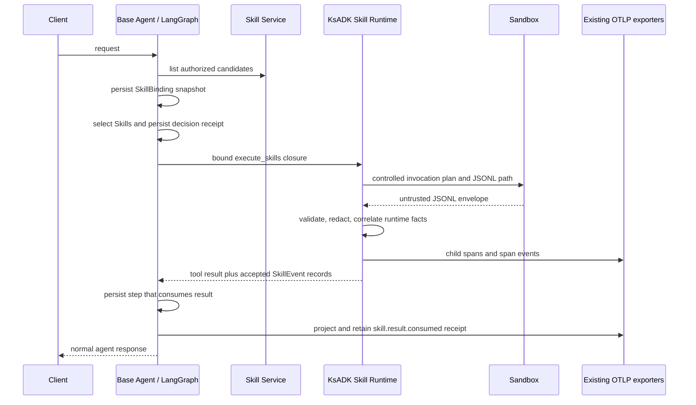

# Base Agent 开发方：Skill 评测接入指南

> 适用对象：基于 KsADK、使用 LangGraph 编排请求和工具节点的 Base Agent 开发方。本指南以 Base Agent 要修改的请求编排为主；KsADK 内容仅说明可直接调用的依赖和当前接口边界。
>
> 本文描述如何接入 Skill 评测所需的运行过程证据，不包含 EvalSmith 的数据消费、评分器或业务结果判定。文中的 ID、Space 和内容摘要均为示例，不可替换为真实凭证、签名下载地址或用户数据。

## 1. Base Agent 要改什么

Base Agent 需要完成以下四项工作，并与 KsADK 开发方确认第 7 节的最小 bridge 已就绪：

1. 在模型决策前查询已授权候选并持久化不可变 `SkillBinding`。
2. 在图中显式完成 Skill 选择，持久化 `decision_id` 与 `selection_receipt_id`，再创建受限的执行工具。
3. 在工具节点限制 `skill_names` 只能等于已选择集合，并使用 KsADK 的可信 `SkillExecutionContext` 执行。
4. 在实际消费工具结果的 LangGraph step 持久化成功后，产生 `skill.result.consumed` 回执并保存、上报。

不满足以上条件时，保留原有 Base Agent 流程和工具行为，并让相应评测维度为 `not_evaluable`。不要为了观测而改变业务执行、重试一次 Skill，或把内部关联字段交给模型。

### 1.1 LangGraph 中的改造落点

| LangGraph 落点 | Base Agent 改造 | 产出的能力 |
| --- | --- | --- |
| 请求入口或 middleware | 从当前身份已授权的 Skill Space 读取候选，冻结并保存 binding snapshot | 评测可知道“当时可选什么”，而不是按当前最新配置猜测 |
| Skill 选择节点 | 在模型调用 Skill 前选择候选、校验归属并持久化 selection receipt | 评测可校验选择是否正确、是否存在越权或版本漂移 |
| 工具工厂 / ToolNode | 用受信任 context 创建受限 `execute_skills` 闭包，并限制模型的 `skill_names` | 选中的 Skill、版本和 Sandbox invocation 在执行前已固定 |
| 消费工具结果的业务节点 | 成功写入 graph state、产物引用或后续输入后，持久化 consumer step | 评测可证明 Agent 实际使用了哪个 Skill 结果，不依赖最终文本猜测 |
| 请求 trace scope | 保持 KsADK 调用在既有请求 span 内 | Skill 生命周期自动出现在现有 OTEL/Langfuse 链路，不改变 exporter |

### 1.2 改造后会获得什么效果

| 新能力 | 可回答的问题 | 对评测和排障的实际效果 |
| --- | --- | --- |
| 候选快照 | 这次请求被授权的候选是什么？ | 可计算候选覆盖、误选和漏选；版本升级后仍可复盘历史请求 |
| 选择回执 | 为什么/何时选择了此 Skill？ | 可将模型或路由决策与完整 `SkillRef` 绑定，排除同名不同版本混淆 |
| 受控调用计划 | Sandbox 实际应执行哪一份 Skill？ | Sandbox 返回的伪造或不匹配事件会被拒绝，执行链路可追溯 |
| 执行生命周期 | 下载、校验、加载、执行、超时、产物和清理是否正常？ | 可区分选择问题、包问题、Sandbox 问题和业务执行失败 |
| 结果消费回执 | 结果被哪个 Agent step 实际使用？ | 可区分“Skill 执行成功但没有帮助 Agent”与“结果被消费后仍答错” |
| 兼容降级 | 旧 KsADK 或无 Skill 请求是否受影响？ | 评测增强缺失只得到 `not_evaluable`，不会中断原 Agent 服务 |

上述能力提供的是**过程可评测性和可诊断性**，不直接判定 Skill 的业务结果是否正确，也不替代 EvalSmith 的评分器。

## 2. 为什么 Base Agent 必须改造

Skill 评测不仅需要 Agent 最终回复，还需要可验证地回答五个问题：

1. 本次请求有哪些已授权、固定版本的候选 Skill？
2. Agent 最终选择了哪一个候选，选择依据对应哪次决策？
3. 被选中的包是否正确下载、校验、加载并执行？
4. Sandbox 的执行、超时、产物和清理结果是什么？
5. Agent 的哪个持久化步骤实际消费了哪个 Skill 的结果？

当前 `feat/skill-observability` 中的 KsADK 已实现第 3、4 项的运行时证据生产，以及第 1、2、5 项所需的数据类型和校验原语。Base Agent 仍必须在 LangGraph 的请求编排中提供可信候选快照、选择回执和结果消费回执；否则这些维度必须标为 `not_evaluable`，不能以推测填充。

本次不需要改 OpenClaw、Hermes、`RuntimeEvent v1`、SSE 或 Studio replay。Base Agent 是实际的请求编排 owner，应在自己的 LangGraph 图中接入，而不是修改通用 `LangGraphRunner` 进行隐式全局注入。

## 3. Base Agent 的请求编排改造

KsADK 能观察到包、加载和 Sandbox 的事实，却不知道业务请求何时开始、哪些候选经过授权、模型为何选择某个 Skill，以及图中的哪个节点用了工具结果。这些事实只存在于 Base Agent 的请求、状态和持久化步骤中。

`LangGraphRunner` 只加载并调用已编译图；它会把有限的 `platform_context` 以 LangGraph 原生 `context` 参数传入，但不会修改用户图的工具集，也不会推断结果消费。自动注入 `execute_skills` 的逻辑目前只在 `ADKRunner`，并且是兼容旧路径，不带可信评测上下文。因此 LangGraph Base Agent 必须显式接入。



`SkillEvent` 是评测事实的结构化载体；OTEL 是它到现有 Langfuse、Cloud Monitor 和 OTLP exporter 链路的投影。二者关联但不等价：一个 `RuntimeEvent` 或一个 span 不能替代完整的 Skill 证据链。

## 4. Base Agent 与 KsADK 的边界

| 所有者 | 必须负责 | 不应负责 |
| --- | --- | --- |
| Base Agent | 请求级授权候选、不可变 `SkillBinding`、`decision_id`、选择回执、LangGraph step 关联和 `skill.result.consumed` 持久化 | 伪造包校验、加载、执行或 Sandbox 内部事件；把内部上下文暴露给模型 |
| KsADK Skill Runtime | 包下载、缓存、摘要校验、安全解压、manifest、加载、执行、产物、清理；JSONL envelope 校验、脱敏和 OTEL 投影 | Skill 注册/版本治理、Agent 选择理由、业务结果正确性、评测打分 |
| Skill Service | 对当前运行身份授权的候选、Space 归属、固定 Version、内容摘要和下载能力 | 执行 Skill 或产生执行事件 |
| Sandbox | 会话、命令、超时、kill、受控 JSONL sidecar | 直报 OTEL/Langfuse、持有 Collector 凭证、决定 Skill 选择 |
| EvalSmith | 消费完整证据并计算评测结果 | 执行 Skill 或补造缺失证据 |

## 5. KsADK 为 Base Agent 提供的能力与边界

以下能力已在本分支完成，Base Agent 不应重复实现：

| 能力 | KsADK 接口或位置 | Base Agent 的使用方式 |
| --- | --- | --- |
| 可信候选与调用数据模型 | `ksadk.skills.SkillBinding`、`SkillExecutionContext`、`SkillInvocationPlan` | 由请求编排构造并传给 KsADK；不要让模型提供这些字段 |
| 调用计划校验 | `build_skill_invocation_plan()` | 只接受来自 binding 的已选 Skill；不在 binding 中的 ID 会拒绝 |
| 执行工具闭包 | `build_execute_skills_tool(..., execution_context=...)` | 在选择完成后创建，模型可见参数仍仅是 `workflow_prompt`、`skill_names` |
| 运行时事实 | `SkillRuntimeResult.skill_events` | 读取已脱敏的 `SkillEvent v1`，关联 `skill_invocation_id` |
| Sandbox 防伪 | outer invocation plan + JSONL envelope 校验 | 不把 `traceparent`、OTLP/Langfuse 环境变量或 Collector 凭证交给 Sandbox |
| OTEL 投影 | `project_skill_events()` | 保持调用位于请求的当前 span 内；不得替换或重配现有 exporter |
| 结果消费回执 | `record_skill_result_consumption()` | 在实际、持久化的 Agent step 后调用；不能从最终自然语言猜测 |

事件属性采取 allowlist。prompt、stdout、stderr、下载 URL、凭证、token、密码、文件系统路径及产物内容不得写入事件、span 属性或 Base Agent 的评测证据存储。

## 6. 接入步骤与契约

### 6.1 启用判定和兼容降级

只有同时满足以下条件时才启用评测证据增强：

- 本次请求已绑定至少一个 Skill Space，且当前身份可从 Skill Service 获取候选；
- Base Agent 已启用自己的 `skill_evaluation_v1` 特性开关；
- 安装的 KsADK 可导入 `SkillBinding`、`SkillExecutionContext`、`build_execute_skills_tool` 和 `record_skill_result_consumption`；
- Base Agent 已实现本节的选择前置、工具参数约束和消费回执存储。

任一条件不满足时，必须走原有 Skill 工具和 LangGraph 路径。没有 Skill 的 Agent 不应增加 Skill Service 调用、额外状态、工具参数或 trace 事件；旧 KsADK 不支持新类型时，评测维度为 `not_evaluable`，绝不能导致原请求失败。

观测、receipt 序列化或 OTEL 投影异常都只能降级评测证据，不能改变既有 Skill workflow 的成功、失败、超时或清理语义。

### 6.2 请求开始：生成不可变候选快照

在第一次模型决策前，Base Agent 必须使用当前请求身份从 Skill Service 获取**已授权**候选，并持久化一条 binding snapshot。一个候选至少包含：

| 字段 | 来源与约束 |
| --- | --- |
| `binding_snapshot_id` | Base Agent 生成并持久化；同一请求内不可修改 |
| `space_id` | Skill Service 返回的已授权 Space |
| `skill_id`、`version_id`、`version`、`name` | 固定的完整 `SkillRef` 身份，不能只保存名称 |
| `content_hash` | Skill Service 的内容摘要；用于版本和包归因 |
| `decision_id` | 选择发生后由 Base Agent 持久化；不是模型自报字段 |
| `selection_receipt_id` | 选择记录的稳定 ID；在结果消费时回链 |

`archive_uri` 若运行时需要，可仅保存在受控的内部 binding 记录中；不得进入模型 prompt、`SkillEvent` 属性、OTEL 属性、公开日志或结果回放。

推荐的持久化记录关系是：`request/run -> binding_snapshot -> selection_receipt -> agent_step -> skill_invocation_id`。`binding_snapshot_id` 不能在重试、续跑或模型再思考时被新查询结果覆盖；新的选择应创建新的 decision/receipt，不能篡改旧记录。

### 6.3 选择阶段：必须先选定，再创建受限工具

当前 KsADK 的 `SkillExecutionContext.selected_skill_ids` 在构建 `execute_skills` 闭包时即用于创建外层 invocation plan。因此 Base Agent 必须将 Skill 选择安排为图中的显式阶段：

1. 候选节点读取已持久化 binding。
2. 选择节点从 binding 中产出 `selected_skill_ids`，并持久化 `decision_id` 和 `selection_receipt_id`。
3. 验证每个 selected ID 都来自 binding；重复 ID 或 binding 外 ID 立即拒绝该评测增强路径。
4. 仅随后创建绑定了 `SkillExecutionContext` 的 `execute_skills` 工具，交给执行节点。

不要让 ReAct 的模型先通过任意 `skill_names` 调用通用工具，再事后从 tool call 参数倒推选择。这样既无法在 Sandbox 前固定 invocation plan，也无法证明候选集合和版本归因。

选择可以来自确定性路由、显式 planner 节点或受控的模型选择节点，但选择结果必须先写入持久化 receipt。模型的选择文本不是 receipt；receipt 至少需要 binding snapshot、selected complete `SkillRef`、`decision_id` 和时间。

### 6.4 构造可信执行上下文

选择记录成功后，在 Base Agent 的工具工厂中构造内部上下文。它不是 LangGraph state 中可被 prompt 模板拼接的业务对象，也不是模型工具 schema 的参数。

```python
from ksadk.skills import (
    BoundSkillRef,
    SkillBinding,
    SkillExecutionContext,
)

binding = SkillBinding(
    binding_snapshot_id=persisted_binding.snapshot_id,
    candidates=tuple(
        BoundSkillRef(skill_ref=item.skill_ref, space_id=item.space_id)
        for item in persisted_binding.candidates
    ),
)
context = SkillExecutionContext(
    run_id=run_id,
    trace_id=trace_id,
    binding=binding,
    decision_id=persisted_selection.decision_id,
    selected_skill_ids=tuple(persisted_selection.skill_ids),
    agent_step_id=execution_step_id,
    selection_receipt_id=persisted_selection.receipt_id,
)
```

`trace_id` 是业务关联字段，不应用它在 Sandbox 内构造 trace context。KsADK 会从调用时的 OTel current span 建立正确的父子关系。

### 6.5 执行阶段：约束模型参数并保留正常行为

用 `build_execute_skills_tool(backend=..., skill_space_ids=..., execution_context=context)` 创建工具时，Base Agent 还必须实现一个很薄的受限 wrapper：调用参数中的 `skill_names` 必须等于已持久化的 `selected_skill_ids`，或由 wrapper 忽略模型传入值并使用已选集合。

这是当前接入的必要保护。KsADK 以 `execution_context` 创建受控 invocation plan，但现有工具仍会将模型给出的 `skill_names` 传给 backend；Base Agent 若不约束该参数，模型可请求与已选计划不同的名称，导致执行事实不完整或 correlation rejection。

以下是工具工厂内可直接采用的最小约束形式。实际项目应把 `normalize_names()` 替换为其现有的参数标准化函数，但不得从模型参数扩展已选集合：

```python
def make_selected_execute_skills(bound_tool, selected_skill_ids):
    selected = tuple(selected_skill_ids)

    def execute_skills(workflow_prompt, skill_names=None):
        requested = tuple(normalize_names(skill_names))
        if requested and requested != selected:
            raise ValueError("skill_names must match the persisted selection")
        return bound_tool(workflow_prompt, skill_names=list(selected))

    execute_skills.__name__ = "execute_skills"
    return execute_skills
```

调用失败、超时或 cleanup 失败仍应按既有 Agent 语义返回。KsADK 会保留对应的 `SkillEvent`；Base Agent 不应把观测失败转换成第二次业务执行。

## 7. 结果消费回执与当前接入门槛

`skill.result.consumed` 的语义是：一个可识别、已持久化的 LangGraph step 读取了特定 `skill_invocation_id` 的成功执行结果，并把它用于后续状态、产物处理、工具调用或最终生成。仅收到 tool result、模型最终回答出现相似文字、或调用时间相邻，都不能证明消费。

Base Agent 应在**持久化消费 step 成功后**调用：

```python
receipts = record_skill_result_consumption(
    raw_skill_runtime_result,
    context,
    agent_step_id=persisted_consumer_step_id,
    skill_invocation_ids=consumed_invocation_ids,
)
persist_skill_evidence(receipts)
project_skill_events(receipts)
```

其中 `consumed_invocation_ids` 必须来自该次执行返回的 invocation plan/event，不能由模型自由填写。`record_skill_result_consumption()` 仅为已完成的 `skill.execution.completed` 产生回执；无效 ID 产生受控 `sandbox.envelope.rejected` 诊断，而不是伪造消费事实。

### 当前 KsADK 需先补齐的最小桥接

当前 `build_execute_skills_tool()` 返回的是序列化 `dict`，而 `record_skill_result_consumption()` 当前读取的是内存中的 `SkillRuntimeResult.skill_events`。因此标准 LangGraph `ToolNode` 仅持有工具输出时，无法直接生成可验证的消费回执。

在 Base Agent 开发前，需要先完成一个小的、向后兼容的 KsADK bridge，二选一即可，推荐第一种：

1. **推荐：**让 `record_skill_result_consumption()` 同时接受已脱敏的工具结果 mapping，从 `skill_events` 安全还原 `SkillEvent` 后执行同样的 completed-invocation 校验。
2. 提供一个显式、公开的 KsADK 执行 API，返回 `SkillRuntimeResult` 给 Base Agent 的专用 ToolNode；现有 `build_execute_skills_tool()` 保持返回 dict 以兼容旧调用。

不要在 Base Agent 中导入 KsADK 私有函数、重新调用 backend、从 stdout 解析 invocation ID，或自行拼造 `SkillEvent`。这些做法会绕过校验或造成重复执行。桥接完成前，可采集加载/执行健康度，但“结果已使用”必须是 `not_evaluable`。

消费回执返回后由 Base Agent 负责两件事：将其与 consumer step 一起存入受控证据记录，并在同一请求 OTel context 下调用 `project_skill_events(receipts)`。原始 `RuntimeEvent v1` 和现有 SSE 无需增加字段。

## 8. 推荐的 LangGraph 图结构

推荐以显式节点而不是对所有图做 runner 级 monkey patch：

```text
request_start
  -> resolve_authorized_skill_binding
  -> choose_skills_and_persist_receipt
  -> build_bound_skill_tool
  -> execute_skills
  -> persist_consumer_step
  -> emit_consumption_receipt
  -> respond
```

无 Skill、未启用特性或不支持新 KsADK 时，图应跳过前六个 Skill 节点，直接走现有 `respond` / 原工具节点。对于具备多次 Skill 调用的图，每次独立选择都应产生新的 `decision_id`、receipt 和 invocation plan；不要复用第一次选择的 invocation ID。

Base Agent 可把 binding/receipt 的轻量引用放在 LangGraph state，但完整 binding 和任何潜在敏感来源数据应保存到其受控存储。重放时应读取原 snapshot，而非重新查询“当前最新”候选。

## 9. 兼容与失败语义

| 场景 | Base Agent 行为 | 评测结果 |
| --- | --- | --- |
| 无 Skill Space | 不创建 binding、不注入新工具路径 | Skill 维度不适用 |
| 旧 KsADK 或 feature 未启用 | 保留原工具和原输出结构 | 选择/消费维度 `not_evaluable` |
| binding 查询或 receipt 写入失败 | 降级原 Skill 执行路径，不篡改工具结果 | 增强维度 `not_evaluable`，记录受控诊断 |
| selection 含 binding 外 Skill | 拒绝增强执行计划；不得把该 ID 传入 Sandbox | 选择错误或 `not_evaluable`，取决于是否有完整证据 |
| Sandbox envelope 非法 | 保留原 workflow 结果，追加 `sandbox.envelope.rejected` | Sandbox 相关维度按证据判定 |
| Skill 执行失败/超时/清理失败 | 保持已有重试和错误策略 | 执行健康度可评测为失败 |
| 消费 step 未持久化 | 不发出 consumed receipt | 结果使用 `not_evaluable` |

旧版本兼容应使用能力探测或安全导入，不要通过硬编码版本号判断。新功能失败只能关闭评测增强，不能阻断正常 Agent 运行。

## 10. 验收清单

Base Agent 开发完成前，至少覆盖以下测试和联调项：

- 无 Skill 请求与旧 KsADK 请求的输出、SSE、工具行为完全保持原状。
- 已授权候选形成固定 binding；模型或用户传入的 Skill ID 不能替换其 Version、Space 或内容摘要。
- selection receipt 在工具执行前已持久化；binding 外、重复或未选择的 Skill 被拒绝。
- 工具 wrapper 不能把与 `selected_skill_ids` 不一致的 `skill_names` 发送给 backend。
- 单个 `skill_invocation_id` 串联候选、选择、加载、执行、产物、清理和消费事件。
- 只有成功持久化的消费 step 才产生 `skill.result.consumed`；未消费或仅最终文本引用的结果不产生回执。
- 事件和 OTEL 属性不包含 prompt、stdout/stderr、下载 URL、凭证、token、密码、路径或产物内容。
- `execute_skills` 下存在 KsADK lifecycle child span 与瞬时 event；既有 Langfuse、Cloud Monitor 和 OTLP exporter 配置未改变。
- local_process 与 E2B fake 覆盖通过；真实 E2E 仅在已授权 Space、预发 Skill Service、注册 Sandbox template 和非敏感 OTLP 配置齐备后执行。

KsADK 当前已完成的回归集合可作为 SDK 基线：

```bash
uv run pytest \
  tests/skills/test_events.py \
  tests/skills/test_package_store.py \
  tests/skills/test_runtime.py \
  tests/skills/test_runtime_agent.py \
  tests/skills/test_loader_and_tools.py \
  tests/skills/test_adk_runner_skill_runtime.py \
  tests/skills/test_skill_event_tracing.py \
  tests/test_tracing_setup_otlp.py \
  tests/test_tracing_cloud_monitor_e2e.py -q
```

该集合验证 KsADK runtime 和 tracing 行为，不替代 Base Agent 的请求级 integration test 或真实预发 E2E。

## 11. 相关实现与参考

- KsADK 事件与回执：`ksadk/skills/events.py`
- KsADK 工具闭包：`ksadk/skills/tool_defs.py`
- Skill Runtime result/backend：`ksadk/skills/runtime/base.py`
- OTEL 投影：`ksadk/skills/observability.py`
- LangGraph runner 边界：`ksadk/runners/langgraph_runner.py`
- Skill Runtime 评测可观测性设计：`docs/internal/skill-runtime-evaluation-observability-design.md`
- Skill Runtime E2E 运行手册：`docs/internal/skill-runtime-e2e.md`

## 12. 议题概要与结论

Base Agent 的接入重点不是让 KsADK 多执行一次 Skill，而是把请求授权、选择、执行和实际消费的因果关系持久化。KsADK 已经负责执行事实、Sandbox 防伪和 OTEL 投影；Base Agent 负责可信上下文与消费证据。完成本文第 6、7 节的接入及最小 bridge 后，Skill 选择、执行健康度和结果使用才能在后续评测中得到可靠结论；缺少任一证据时必须输出 `not_evaluable`。
