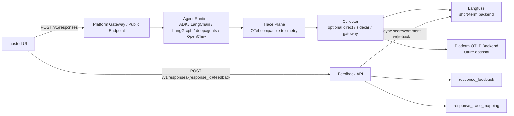

# 平台可观测与用户反馈设计方案

本文档是 `ksadk-python` / `agentengine-server` 面向 Agent 运行时可观测与 hosted UI 用户反馈的统一设计方案。

与早期的 `OTel Collector Sidecar` 方案相比，本文档把设计重心从“某一种采集部署形态”调整为“平台 contract”。`sidecar` 仍然是 serverless runtime 的推荐采集形态，但不是所有 runtime 的硬性要求。

## 1. 结论

本方案要统一的是平台能力，不是统一某几个 Python framework 的内部 tracing 实现。

目标覆盖范围包括：

- `ADK`
- `LangChain`
- `LangGraph`
- `deepagents`
- `OpenClaw`
- 后续新增的 agent framework / runtime

最终能力拆成两条链路：

- `Trace Plane`
  runtime 内部的 agent / LLM / tool / MCP / sub-agent 调用链路，统一收敛到 OpenTelemetry-compatible signals。
- `Feedback Plane`
  hosted UI 对整条 Agent 输出的点赞、点踩和文字反馈，统一走平台 feedback API 和最小状态表。

两条链路可以通过 `response_id` 关联，但职责不同：

- Trace 解决“运行时发生了什么”。
- Feedback 解决“用户如何评价这次输出”。

可落地性判断：

- `hosted UI feedback` 值得先做，收益明确，改造面可控。
- `multi-agent trace` 值得做，但应作为第二阶段，不应阻塞反馈闭环。
- `sidecar` 是 serverless runtime 的推荐形态，不是 OpenClaw、deepagents 或未来 runtime 的硬约束。
- Langfuse 短期继续保留，优先把新链路迁到 `OTLP`，不要一次性替换后端。

## 2. 当前代码库事实

### 2.1 `/v1/responses` 已有反馈协议基础

当前 `ksadk-python` 已经具备 feedback 链路的关键前置条件：

- `/v1/responses` 返回 `response_id` 和 `session_id`。
- Responses streaming 路径会提前生成本轮 `response_id`，并在 SSE 事件中返回。
- 部分 runner 若产出 `responses_output`，当前会把对应 `response_id` 写入 assistant event metadata。
- `previous_response_id` 已经作为 OpenAI Responses 风格续接字段保留。

这说明 hosted UI 的反馈协议可以先依赖 `response_id`，不需要前端感知 Langfuse 的 `trace_id`、`observation_id` 或 secret。

但当前还不能把它理解成“反馈已经可直接落库”：

- 非 streaming `/v1/responses` 当前会返回 `response_id`，但尚未把该 `response_id` 稳定写入 assistant event metadata。
- streaming 路径中的 assistant event metadata 也依赖 runner 是否产出 `responses_output` / `response_id`。
- `agentengine-server` 当前能通过 `ListSessionEvents` 返回内部 `EventId`，但尚未提供 `response_id -> EventId -> trace` 的正式映射表。
- 因此正式版应把 `response_id` 定义为前端 contract，同时由平台维护它到内部 assistant event 和 trace 的映射。

### 2.2 `ksadk` 当前支持 multi-agent / sub_agents

当前 `ksadk` 已经有两类多 Agent 能力。

第一类是 `ksadk.agents` 自有编排层：

- `SequentialAgent`
  按顺序执行 `sub_agents`。
- `ParallelAgent`
  为每个子 agent 创建独立 branch context，并在结束后合并分支状态。
- `LoopAgent`
  重复执行 `sub_agents`，支持 `max_iterations` 和 `exit_condition`。
- `RunnerAgent`
  把 runner-like 对象包装成可编排子 agent。

自有编排层支持的子 agent 形态包括：

- `BaseOrchestrationAgent`
- async callable
- runner-like object，也就是带 `invoke()` 的对象
- 带 `stream()` 的 runner-like object

相关测试已经覆盖：

- 顺序执行
- 并行分支隔离与状态合并
- 并行分支异常抛出
- loop 最大次数退出
- loop 条件退出
- nested orchestration
- runner invoke / stream 适配
- sub-agent 名称校验与重复名称校验

第二类是 ADK runner 对上游 ADK `sub_agents` 的兼容：

- `ADKRunner` 会递归遍历 agent tree 中的 `sub_agents`。
- 当前递归逻辑已用于模型发现和模型切换。
- 实际执行仍依赖上游 ADK runner 对 `sub_agents` / transfer / orchestration 的行为。

因此，`ksadk` 对 multi-agent / sub_agents 的结论是：

- 编排能力已经存在。
- 子 agent 执行事件已经能从自有编排层流出。
- 但 multi-agent 事件到 OTel span 的标准映射还没有实现成平台默认路径。
- 跨 runtime、跨进程、OpenClaw 这类外部 runtime 的 trace context 传播仍需要补 contract。

### 2.3 当前可观测实现仍偏应用内 exporter

当前 `ksadk.tracing.setup` 支持：

- `InMemoryExporter`
- `LangfuseExporter`
- `OTLPSpanExporter`
- ADK / LangChain OpenInference instrumentation

这说明短期可以继续保留 Langfuse，并逐步把新链路收敛到 `OTLP`。但需要避免同一个请求同时通过 callback 和 OTLP 写到同一个 Langfuse backend，防止重复 trace。

### 2.4 OpenClaw 是外部容器 runtime

OpenClaw 当前在 `ksadk` 中是 container runtime 形态，不走 Python embedded runner 路径。

因此 OpenClaw 不应该被要求继承 `ksadk.tracing.setup` 的实现方式。它只需要满足平台 contract：

- 能输出或转发 OTel-compatible telemetry。
- 能让平台拿到 hosted UI 输出对应的 `response_id`。
- 能让平台建立 `response_id -> session / agent / trace` 映射。

## 3. 设计目标

### 3.1 目标

- 建立覆盖所有 runtime 的平台级可观测 contract。
- 保留 Langfuse 作为短期主后端。
- 新链路优先使用 `OTel + OpenInference + OTLP`。
- 支持 direct / sidecar / gateway 三种采集形态。
- hosted UI 支持对整条 Agent 输出做点赞、点踩和文字反馈。
- 平台维护最小 feedback 状态表，作为用户反馈事实源。
- feedback 可以异步写回 Langfuse score / comment。
- multi-agent 场景下能看到 root agent、sub-agent、LLM、tool、MCP、handoff 的调用关系。
- 前端不直接接触 Langfuse secret 或 trace backend 细节。
- 保持现有 `--observability/--no-observability` 和 `langfuse_enabled` 兼容。

### 3.2 非目标

- 不统一所有 runtime 的内部 tracing 实现。
- 不要求所有 runtime 首版都使用 sidecar。
- 不要求 hosted UI 对单个 tool call 或 reasoning step 打分。
- 不要求前端直接写 Langfuse。
- 不把 Langfuse 作为长期唯一后端。
- 不要求 OpenClaw 改造成 Python runner。

### 3.3 收益与代价

收益：

- hosted UI 可以提供通用 Agent 点赞、点踩和文字反馈，不需要每个业务 Agent 自己维护反馈数据。
- 平台有自己的反馈事实源，后续可用于评估集构建、Bad Case 回放、Agent 版本对比和运营分析。
- Langfuse 继续作为短期观测后端，现有投入不浪费。
- `OTLP` 成为新的传输边界后，后续接自研观测后台、云上 VM 集群可视化或双写都更容易。
- multi-agent 场景能从“只有最终输出”提升到“看见 root agent / sub-agent / tool / MCP 的调用关系”。

代价：

- P0 需要改 hosted UI action / `agentengine-server` 持久化 / runtime Responses 事件 metadata，属于跨仓改造。
- P1 需要补 `response_trace_mapping` 和异步 writeback，涉及幂等、重试和权限校验。
- P3 需要实现 `AgentEvent -> OTel span` adapter，且要处理 parallel / loop / runner-like 子 agent 的 parent-child 关系。
- sidecar 会增加每个 serverless runtime pod 的资源占用，因此不应作为所有 runtime 的硬前置。
- OpenClaw、deepagents 等外部 runtime 的细粒度观测质量取决于它们自身 OTel 输出能力，平台只能通过 contract 和 gateway 补齐公共字段。

## 4. 总体架构



## 5. 平台 Contract

### 5.1 Trace Contract

所有 runtime 需要满足最小 trace contract。具体实现可以不同，但导出的 trace 至少要能表达：

- 一次用户请求
- root agent 调用
- sub-agent 调用
- LLM 调用
- tool 调用
- MCP 调用
- handoff / transfer / delegation
- 错误、取消、超时
- token usage、latency、model、provider 等核心指标

推荐公共属性：

| 属性 | 说明 |
| --- | --- |
| `agentengine.agent_id` | 平台 Agent ID |
| `agentengine.agent_name` | 平台 Agent 名称 |
| `ksadk.session_id` | 平台会话 ID |
| `ksadk.invocation_id` | 单次运行 ID |
| `ksadk.response_id` | `/v1/responses` 输出 ID |
| `ksadk.runtime.framework` | `adk` / `langchain` / `langgraph` / `deepagents` / `openclaw` |
| `ksadk.runtime.type` | `python_runner` / `remote_runner` / `container_runtime` |
| `ksadk.agent.name` | 当前 agent / sub-agent 名称 |
| `ksadk.agent.parent_name` | 父 agent 名称 |
| `ksadk.agent.branch` | parallel branch 名称 |
| `gen_ai.system` | 模型系统或 provider |
| `gen_ai.request.model` | 模型名称 |
| `gen_ai.operation.name` | `invoke_agent` / `call_llm` / `execute_tool` / `mcp_call` |
| `gen_ai.span.kind` | `workflow` / `agent` / `llm` / `tool` |

### 5.2 Trace Context 传播

multi-agent 场景能否观测完整，关键不在 sidecar，而在 trace context。

要求如下：

- 同一次 hosted UI 请求只创建一个 root trace。
- root agent 和所有 sub-agent 共享同一个 `trace_id`。
- sub-agent 调用必须成为 parent span 的 child span。
- parallel 分支需要保留 branch 信息，但不能各自创建孤立 trace。
- 跨 HTTP、MCP、remote runner、OpenClaw gateway 时必须传播 `traceparent`。
- 平台字段通过 baggage 或请求 metadata 传播：
  - `session_id`
  - `invocation_id`
  - `response_id`
  - `agent_id`
  - `runtime_framework`

### 5.3 Multi-Agent Span 模型

推荐 span 层级：

```text
invocation
  agent.invoke root_agent
    agent.invoke sub_agent_a
      llm.call
      tool.call
    agent.invoke sub_agent_b
      mcp.call
      llm.call
    handoff transfer_to_agent
```

`ksadk.agents` 自有编排事件可以按如下规则映射：

| `AgentEvent` | Span 行为 |
| --- | --- |
| `AGENT_START` | 创建或进入 `agent.invoke` span |
| `AGENT_END` | 结束当前 `agent.invoke` span |
| `TEXT_OUTPUT` | 记录输出摘要或事件属性 |
| `TOOL_CALL` | 创建 `tool.call` span |
| `TOOL_RESULT` | 结束 `tool.call` span 并记录结果 |
| `STATE_CHANGE` | 添加 span event |
| `ESCALATE` | 添加 escalation event |
| `ERROR` | 记录 exception 并标记 span error |

当前代码已经有编排事件模型，但还需要补一个 `AgentEvent -> OTel span` adapter，才能把自有 multi-agent 编排完整接入 Trace Plane。

### 5.4 Feedback Contract

hosted UI 反馈只依赖 `response_id`。这是前端 contract，不等同于平台内部最终主键。

要求如下：

- 每条展示给用户的 assistant 输出必须有稳定 `response_id`。
- 平台可以通过 `response_id` 查到内部 assistant event，也就是 hosted UI / `ListSessionEvents` 中的 `EventId`。
- 平台可以继续通过该映射查到 `agent_id`、`session_id`、`invocation_id`、`runtime_framework`。
- 若 trace 已生成，平台可以进一步查到 `trace_id` 和 root span。
- 前端不感知 `trace_id`、Langfuse `observation_id` 或 Langfuse secret。

因此正式实现必须做两层映射：

```text
response_id -> assistant_event_id(EventId) -> trace_id/root_span_id
```

这样可以兼容当前 hosted UI 的事件模型，也避免把临时 Responses 兼容层 ID 当成唯一持久业务事实。

## 6. 采集形态

采集形态不做唯一约束，平台显式支持三种模式。

| 模式 | 说明 | 适用场景 | 代价 |
| --- | --- | --- | --- |
| `direct` | 应用直接向 Langfuse 或 OTLP endpoint 上报 | 短期上线、外部 runtime、OpenClaw 自带 OTel | 应用仍感知后端细节 |
| `sidecar` | runtime pod 内注入 OTel Collector | serverless 标准 runtime | 每个 pod 多一个容器 |
| `gateway` | 平台级共享 collector / OTLP gateway | 中长期统一治理、大规模双写 | 平台复杂度更高 |

推荐策略：

- P0 / P1 支持 `direct`，降低落地成本。
- serverless 托管 runtime 默认走 `sidecar`。
- OpenClaw 这类外部容器 runtime 可先走自带 OTel 导出或平台 gateway。
- 大规模后再建设 `gateway`，不要阻塞前期反馈闭环。

配置建议：

```yaml
observability:
  enabled: true
  mode: direct        # off | direct | sidecar | gateway
  backend: langfuse   # langfuse | otlp | dual
  otlp_endpoint: ""
  langfuse_enabled: true
```

兼容规则：

- 旧字段 `langfuse_enabled=true` 等价于 `enabled=true` 且 `backend=langfuse`。
- 旧字段 `--no-observability` 等价于 `enabled=false`。
- 若同一个 Langfuse backend 已通过 OTLP 接入，应禁用 callback-only 双写。

## 7. Langfuse 策略

短期不需要替换 Langfuse。更合理的路径是：

- Langfuse 继续作为主观测后端。
- 新接入优先走 OTLP。
- collector 或 gateway 负责把 OTLP 转发到 Langfuse `/api/public/otel`。
- feedback 由平台 API 接收后异步写回 Langfuse score / comment。

关键约束：

- 不让前端持有 Langfuse secret。
- 不让业务容器长期绑定 Langfuse 私有 API。
- 不对同一次请求重复写 callback trace 和 OTLP trace。

## 8. Feedback Plane

### 8.1 反馈粒度

首版只支持整条 Agent 输出的整体反馈：

- `up`
- `down`
- `none`
- 可选文字 `comment`

明确不支持：

- 单个 tool call 打分
- 单段 reasoning 打分
- 单个 sub-agent 打分
- token 级评分

### 8.2 最小状态表

平台维护 `response_feedback` 表作为事实源。

推荐字段：

| 字段 | 说明 |
| --- | --- |
| `id` | 主键 |
| `response_id` | `/v1/responses` ID |
| `assistant_event_id` | 平台内部 assistant message 事件 ID，也就是 `EventId` |
| `session_id` | 会话 ID |
| `invocation_id` | 单次运行 ID |
| `agent_id` | 平台 Agent ID |
| `runtime_framework` | runtime framework |
| `user_id` | 反馈用户 |
| `vote` | `up` / `down` / `none` |
| `comment` | 可选文字反馈 |
| `trace_id` | 可选 trace ID |
| `trace_backend` | `langfuse` / `otlp` |
| `trace_feedback_id` | 外部 score / feedback ID |
| `writeback_status` | `pending` / `succeeded` / `failed` / `skipped` |
| `created_at` | 创建时间 |
| `updated_at` | 更新时间 |
| `deleted_at` | 软删除时间，可选 |

唯一约束：

```sql
unique(response_id, user_id)
```

如果存在 `assistant_event_id`，建议同时加辅助索引：

```sql
index(assistant_event_id)
```

这样可以支持：

- 首次点赞
- 首次点踩
- 点赞改点踩
- 点踩补充文字
- 取消反馈
- 异步重试 trace writeback

### 8.3 Response-Trace Mapping

平台需要维护 `response_id -> trace` 映射。

首版可以复用 `conversation_events.metadata`，但正式形态建议抽出 `response_trace_mapping`：

| 字段 | 说明 |
| --- | --- |
| `response_id` | 主键 |
| `assistant_event_id` | 内部 assistant message 事件 ID |
| `agent_id` | 平台 Agent ID |
| `session_id` | 会话 ID |
| `invocation_id` | 单次运行 ID |
| `runtime_framework` | runtime framework |
| `runtime_type` | runtime type |
| `trace_id` | OTel trace ID |
| `root_span_id` | root span ID |
| `observation_id` | Langfuse observation ID，可选 |
| `status` | `created` / `mapped` / `completed` / `failed` |
| `created_at` | 创建时间 |
| `completed_at` | 完成时间 |

映射要求：

- 在本轮输出生成早期确定 `response_id`。
- 在 root span 创建后尽快拿到 `trace_id`。
- 在 assistant event 持久化时补齐 `assistant_event_id`。
- 在首个响应 chunk 返回前尽量完成 `response_id -> session / invocation` 的最小映射。
- 如果 trace 生成滞后，feedback 先落库，后续补偿 writeback。

### 8.4 API

推荐端点：

```http
POST /v1/responses/{response_id}/feedback
GET /v1/responses/{response_id}/feedback
DELETE /v1/responses/{response_id}/feedback
```

`POST` 请求体：

```json
{
  "vote": "down",
  "comment": "回答没有结合当前工作区实现。"
}
```

`GET` 返回：

```json
{
  "response_id": "resp_xxx",
  "vote": "down",
  "comment": "回答没有结合当前工作区实现。",
  "updated_at": "2026-05-06T12:30:00Z"
}
```

`DELETE` 语义：

- 删除或置空当前用户对该 response 的反馈。
- 平台状态以本地表为准。
- 外部 trace backend 如果不能删除 score，则写入覆盖状态或记录 skipped。

### 8.5 Writeback

feedback 写回 trace backend 必须异步。

流程：

1. hosted UI 提交 feedback。
2. 平台鉴权并校验 `response_id` 归属。
3. 平台 upsert `response_feedback`。
4. 后台任务查 `response_trace_mapping`。
5. 若 trace 已存在，写回 Langfuse score / comment。
6. 更新 `trace_feedback_id` 和 `writeback_status`。
7. 若 trace 暂不存在，保持 `pending`，后续补偿。

## 9. Multi-Agent 观测

### 9.1 能观测到什么

在 multi-agent 场景中，平台目标是至少观测到：

- root agent 开始和结束
- 每个 sub-agent 开始和结束
- parallel branch 名称和状态合并结果
- loop iteration
- handoff / transfer_to_agent
- 每个 agent 下的 LLM 调用
- 每个 agent 下的 tool / MCP 调用
- 错误发生在哪个 agent / branch

### 9.2 `ksadk.agents` 映射

`SequentialAgent`：

- root span：`agent.invoke <sequential_agent_name>`
- 每个 sub-agent 创建 child span。
- span 顺序与执行顺序一致。

`ParallelAgent`：

- root span：`agent.invoke <parallel_agent_name>`
- 每个 branch 创建 child span。
- child span 添加 `ksadk.agent.branch`。
- 状态合并结果以 span event 记录。

`LoopAgent`：

- root span：`agent.invoke <loop_agent_name>`
- 每轮迭代添加 `ksadk.loop.iteration`。
- 子 agent span 挂在对应 iteration 下。

`RunnerAgent`：

- 包装 runner-like 子 agent。
- runner 输出的 chunk 可转换成 span event。
- 如果 runner 自己已经产生 OTel span，需要通过 trace context 保持父子关系。

### 9.3 ADK sub_agents 映射

ADK runtime 中的 `sub_agents`、transfer、tool-as-agent 等能力应遵循同一层级：

```text
invocation
  agent.invoke root_adk_agent
    agent.invoke sub_agent
      llm.call
      tool.call
```

`ADKRunner` 已经会递归访问 `sub_agents` 做模型发现和模型切换，但 trace 层仍需要确认上游 ADK instrumentation 是否能产出稳定的 parent-child span。

若上游 instrumentation 信息不足，平台需要补一层 adapter：

- 从 ADK event / invocation metadata 中提取 agent 名称。
- 为 sub-agent 调用补充 `ksadk.agent.name` 和 parent 信息。
- 把 `response_id`、`session_id`、`invocation_id` 注入当前 trace context。

### 9.4 OpenClaw 多 Agent

OpenClaw 不走 `ksadk.agents` 编排层。

对 OpenClaw 的要求是：

- 如果 OpenClaw 自身有 OTel diagnostics，平台接收它的 OTLP 输出。
- 如果 OpenClaw 有 gateway message/session 概念，平台在 gateway 层建立 `response_id`。
- hosted UI feedback 仍然走平台 API，不依赖 OpenClaw 自己实现点赞点踩。
- 若 OpenClaw 内部有多 agent / tool routing，应通过 OTel span 属性暴露 agent/tool 维度。

## 10. 落地路线

### P0：hosted UI feedback 闭环

目标：

- hosted UI 能对整条输出点赞、点踩、提交文字反馈。
- 平台有最小状态表。
- feedback 能先稳定落库，并在 trace 映射可用时异步写回 Langfuse。

工作项：

- 稳定生成并返回 `response_id`。
- 确保所有 `/v1/responses` 路径都把 `response_id` 写入 assistant event metadata。
- 建立 `response_id -> assistant_event_id(EventId)` 映射。
- 新增 `response_feedback`。
- 新增 feedback API。
- 建立 `response_id -> session / agent / invocation` 关联。
- 写回 Langfuse score / comment，失败时保留 `pending / failed` 状态。

### P1：Response-Trace Mapping

目标：

- feedback 可以稳定关联 trace。
- trace 生成滞后时可补偿。

工作项：

- 新增或抽象 `response_trace_mapping`。
- root span 创建时记录 `trace_id`。
- 响应完成时补全 `completed_at` 和 status。
- 后台任务重试 pending feedback writeback。
- 在 `response_trace_mapping` 中保留 `assistant_event_id`，不要让 trace 只绑定临时响应 payload。

### P2：Observability Mode 标准化

目标：

- 不再只用 `langfuse_enabled` 表达观测能力。
- 显式支持 `off | direct | sidecar | gateway`。

工作项：

- 扩展 CLI / deploy request / server model。
- 保持 `--observability/--no-observability` 兼容。
- 新增 `observability.mode`。
- 新增 `observability.backend`。
- 禁止同 backend 重复 callback + OTLP 写入。

### P3：Multi-Agent Trace Adapter

目标：

- `ksadk.agents` 的多 Agent 编排事件可转成 OTel span。
- ADK sub_agents 能补充平台公共属性。

工作项：

- 实现 `AgentEvent -> OTel span` adapter。
- 为 `SequentialAgent / ParallelAgent / LoopAgent / RunnerAgent` 加 trace context。
- 补 `branch`、`iteration`、`parent_agent` 属性。
- 为 runner-like sub-agent 传入 `traceparent` 和 baggage。

### P4：Sidecar 标准化

目标：

- serverless runtime 默认使用 collector sidecar。
- 应用容器只发本地 OTLP。

工作项：

- 注入 OTel Collector sidecar。
- 默认接收 `127.0.0.1:4317` / `4318`。
- collector 负责 batch、retry、memory limit。
- collector 负责 Langfuse OTLP endpoint 和未来 dual write。

### P5：Gateway Collector / 自研 OTLP Backend

目标：

- 大规模统一治理。
- 降低 per-pod sidecar 资源开销。
- 为平台自研观测后台预留演进空间。

工作项：

- 建平台级 OTLP gateway。
- 支持租户隔离和鉴权。
- 支持采样、限流、双写、脱敏。
- 评估从 Langfuse 主后端迁移或双写。

## 11. 风险与约束

### 11.1 重复 trace

风险：

- LangChain / LangGraph callback 和 OTLP exporter 同时写同一个 Langfuse backend。

策略：

- 同一 backend 只能启用一条写入路径。
- 迁移期用配置明确 `direct_callback` 和 `otlp` 的互斥关系。

### 11.2 response_id 与 trace_id 映射滞后

风险：

- 用户点击 feedback 时 trace 还没完成或还没导出。

策略：

- feedback 先落平台表。
- writeback 异步重试。
- `writeback_status` 记录状态。

### 11.3 外部 runtime 信息不完整

风险：

- OpenClaw 或 remote runner 只导出粗粒度 trace。

策略：

- 平台 contract 定义最小必需属性。
- gateway 层补 `response_id / session_id / agent_id`。
- runtime 自身逐步补 agent/tool 细粒度 span。

### 11.4 多 Agent span 层级不稳定

风险：

- 不同 framework 对 sub-agent、handoff、tool-as-agent 的定义不同。

策略：

- 平台只统一公共 span 层级和属性。
- framework-specific 信息放入扩展属性。
- UI 和 feedback 只依赖 `response_id` 与 root trace。

## 12. 推荐决策

当前最务实的路线是：

1. 先做 hosted UI feedback 正式版。
2. 以平台最小状态表作为 feedback 事实源。
3. Langfuse 短期继续作为主 trace 后端。
4. 新 trace 接入逐步收敛到 OTLP。
5. direct / sidecar / gateway 都作为合法采集形态。
6. serverless 托管 runtime 推荐 sidecar。
7. 多 Agent 观测通过 trace context 和 span 层级规范实现。

这条路线能先交付用户反馈闭环，同时不给 OpenClaw、deepagents 和后续 runtime 强加同一种实现路径。
