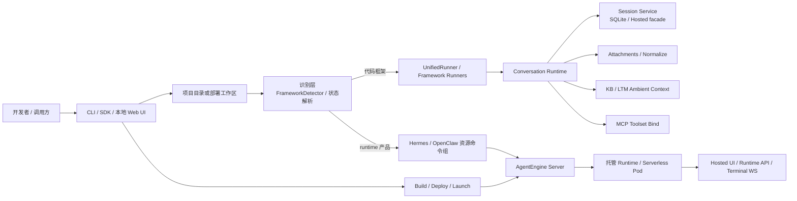
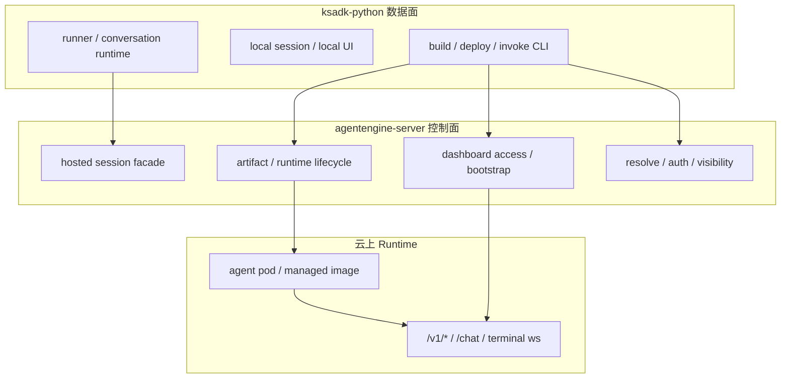
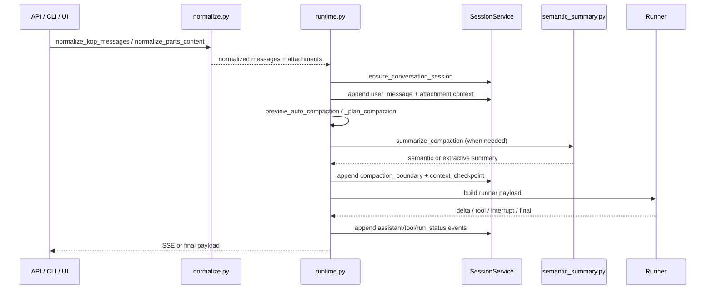

# KSADK 技术设计

本文档描述 `ksadk-python` 在 2026-04-19 对应的当前实现形态。

文档目标有两个：

- 帮助零上下文工程师快速建立 `ksadk` 的整体心智模型
- 明确 `ksadk-python` 与 `agentengine-server` 的边界和契约面

本文档只描述“当前代码已经具备的能力”和“当前代码依赖的跨仓契约”，不承担中长期路线图职责。跨仓中长期架构草案仍以 `agentengine-server/docs/ksadk-platform-architecture-draft.md` 为准。

## 1. 文档定位与边界

### 1.1 `ksadk-python` 负责什么

当前 `ksadk-python` 负责的数据面能力包括：

- 本地项目检测与命令分发
- 本地 runner 加载与运行
- 会话、事件、状态的本地持久化与 transcript 编排
- conversation runtime
- 附件规范化、抽取与本地文件落盘
- KB / LTM ambient context 注入
- MCP toolset 绑定
- 本地 Web UI 与远端调用消费侧适配
- 面向开发者的 `build / deploy / launch / invoke` CLI
- Hermes / OpenClaw 这类 runtime 产品的消费侧 CLI

### 1.2 `ksadk-python` 不负责什么

以下能力的 canonical 真相源不在 `ksadk-python`：

- artifact 生命周期治理
- 托管 runtime 创建、更新、删除
- Dashboard access link 与 hosted 分享能力
- 统一 registry / resolve / auth / visibility
- hosted conversation façade
- control plane 的版本治理与权限策略

这些能力当前主要由 `agentengine-server` 承担，`ksadk-python` 以客户端和运行时消费层的方式接入。

### 1.3 当前采用的支持模型

本文档采用“代码框架 + runtime 产品”的口径，而不是“六个并列 framework”。

| 支持面 | 当前对象 | 本地真相源 | 主入口 |
| --- | --- | --- | --- |
| 代码框架 | `ADK`、`LangChain`、`LangGraph`、`DeepAgents` | 用户代码 | `run` / `web` / 通用 `build` / `deploy` |
| runtime 产品 | `Hermes`、`OpenClaw` | 部署工作区 + `.agentengine.state` | `agentengine hermes ...` / `agentengine openclaw ...` |

注意：

- `Hermes` 在当前代码中仍保留了一部分历史兼容路径，例如出现在 `FrameworkDetector` 的配置识别里，但它并不复用本地 runner。
- `OpenClaw` 更明确地处于产品型路径，不进入通用本地 runner 抽象。

## 2. 整体架构

### 2.1 仓库内总览

### 2.2 跨仓视角

如果放到 `ksadk ↔ server` 的协同链路里，当前关系更接近下面这个模型：

这也是为什么 `ksadk-python` 可以负责“运行与消费”，但不适合单独承担完整 registry 与托管治理。

## 3. 核心子系统

### 3.1 支持面识别与入口分发

关键文件：

- `ksadk/detection/detector.py`
- `ksadk/runners/unified_runner.py`
- `ksadk/cli/cmd_run.py`
- `ksadk/cli/cmd_web.py`
- `ksadk/cli/cmd_hermes.py`
- `ksadk/cli/cmd_openclaw.py`

当前识别层的实际语义是：

1. 对代码框架，`FrameworkDetector.detect()` 负责解析 `agentengine.yaml/ksadk.yaml`、入口文件和导入语句。
2. `UnifiedRunner.create(...)` 仅为 `ADK`、`LangChain`、`LangGraph`、`DeepAgents` 创建 runner。
3. `run` 和 `web` 命令本质依赖 `FrameworkDetector + UnifiedRunner` 这条链。
4. `Hermes/OpenClaw` 的主路径不是本地 runner，而是资源命令组 + 远端 runtime。

这意味着：

- `ADK / LangChain / LangGraph / DeepAgents` 是典型代码框架
- `Hermes / OpenClaw` 是镜像型 runtime 产品

`Hermes` 是当前代码里的历史特例：它在配置识别层可被识别为 `framework: hermes`，但在运行层没有 `HermesRunner`，而是转向：

- `agentengine hermes deploy`
- `agentengine hermes open`
- `agentengine hermes exec`
- `agentengine agent invoke` 的 Hermes native TUI 分流

### 3.2 Session / Transcript 存储层

关键文件：

- `ksadk/sessions/local_service.py`
- `ksadk/sessions/base.py`
- `ksadk/conversations/context.py`

当前本地持久化的真相源是 `LocalSessionService`：

- 默认会话目录：`.agentengine/ui/`
- 默认数据库：`.agentengine/ui/sessions.sqlite`
- 默认附件目录：`.agentengine/ui/files/`

`resolve_local_session_dir()` 与 `resolve_local_session_path()` 负责把本地 UI、会话 SQLite 和附件目录绑定到项目目录或 `AGENTENGINE_UI_DIR` 指向的路径。

这里的设计重点是：

- transcript 是 append-only event log，而不是整段历史字符串
- 会话元数据、事件正文、状态增量分开存储
- 本地 UI 和 runtime 都消费同一份 transcript 语义

### 3.3 Conversation Runtime

关键文件：

- `ksadk/conversations/runtime.py`
- `ksadk/conversations/context.py`
- `ksadk/conversations/model_context.py`
- `ksadk/conversations/semantic_summary.py`
- `ksadk/conversations/session_title.py`

`conversation runtime` 是当前仓库最核心的编排层，负责把“用户输入、会话、附件、上下文、runner 调用、事件回写”收口为同一条链路。

它的核心职责不是简单地“转发消息”，而是：

1. 规范化不同协议入口的消息形态
2. 统一构造 `PreparedConversationTurn`
3. 维护会话归属与 transcript 真相源
4. 在进入模型前做 compaction 规划与必要压缩
5. 在流式/非流式路径中统一 run status、tool、approval、assistant 事件
6. 在 PTL（prompt too long）场景下做二次 compaction 与重试
7. 更新会话标题、摘要和附件上下文状态

#### 3.3.1 输入规范化

入口函数主要是：

- `normalize_kop_messages(...)`
- `normalize_parts_content(...)`
- `_normalized_conversation_messages(...)`
- `_latest_user_turn(...)`

不同协议入口进入 runtime 前，都会被收敛为内部统一 message shape：

- `role`
- `content`
- `display_content`
- `parts`
- `attachments`
- `attachment_results`

这样做的目的，是避免不同 API 路径分别拼装 history、附件和 display 文本。

#### 3.3.2 会话归属与用户事件写入

关键函数：

- `ensure_conversation_session(...)`
- `append_conversation_event(...)`
- `_update_session_metadata_after_user_turn(...)`

在真正调用 runner 前，runtime 会先：

1. 校验或创建 session
2. 将用户输入落为 `user_message`
3. 把附件上下文通过 state delta 写入会话状态
4. 更新 `first_prompt`、`last_prompt`、fallback title

这里的设计原则是：

- 会话真相源永远在 transcript / state store
- 客户端不再依赖回传完整历史
- 标题与 summary 作为 metadata 统一维护

#### 3.3.3 Compaction 规划与 token 预算

关键函数：

- `_plan_compaction(...)`
- `preview_auto_compaction(...)`
- `compact_conversation_history(...)`
- `append_context_checkpoint_event(...)`

token 预算相关逻辑在 `model_context.py` 中集中管理：

- `estimate_text_tokens(...)`
- `get_effective_context_window_tokens(...)`
- `get_auto_compact_threshold_tokens(...)`
- `get_auto_compact_threshold_percentage(...)`
- `normalize_model_metadata(...)`

当前 compaction 机制不是“粗暴截断历史”，而是：

1. 先将 transcript 按 API round 分组
2. 识别不能被压缩的 pinned 轮次
3. 根据模型上下文窗口推导 auto-compact 阈值
4. 保留尾部若干轮，将更早轮次折叠为 checkpoint summary
5. 通过 `compaction_boundary` + `context_checkpoint` 两类事件把压缩结果显式写回 transcript

`semantic_summary.py` 进一步把摘要层拆成独立客户端：

- 优先使用 summary model 做 semantic summary
- 不可用时自动回退到 extractive summary
- pending approvals、pending tools、attachment refs、current user goal 会作为 pinned state 显式保留

这套设计比“直接覆盖旧 history”更稳，因为它保留了边界事件和摘要语义，便于后续 replay 和恢复。

#### 3.3.4 Prompt-too-long 恢复

关键函数：

- `_is_prompt_too_long_error(...)`
- `invoke_conversation_once(...)`
- `stream_conversation_turn(...)`

当前 runtime 对 PTL 的处理不是直接失败，而是：

1. 首次调用失败后识别 PTL 类错误
2. 触发 `force=True` 的 compaction
3. 使用更激进的 `keep_tail_groups`
4. 刷新 history 视图后重试一次

这让 compaction 同时承担了“常规自动压缩”和“故障恢复”两类职责。

#### 3.3.5 流式编排

关键函数：

- `stream_conversation_turn(...)`
- `build_compaction_sse_event(...)`
- `append_run_status_event(...)`

流式路径中，runtime 不仅负责向前端发 SSE，还负责把模型运行态写回 transcript：

- `response.compaction.start/done`
- `response.reasoning.delta`
- `response.output_text.delta`
- `response.tool_call`
- `response.tool_result`
- `response.approval_request`
- `response.completed`

同时，正式持久化的事件仍然是：

- `user_message`
- `assistant_message`
- `tool_call`
- `tool_result`
- `approval_request`
- `run_status`
- `context_checkpoint`
- `compaction_boundary`

thinking/token delta 仍以临时流式事件为主，不作为 transcript 真相源。

#### 3.3.6 数据流示意

### 3.4 附件与文件处理

关键文件：

- `ksadk/conversations/attachments.py`
- `ksadk/conversations/normalize.py`
- `ksadk/sessions/local_service.py`

`attachments.py` 是当前仓库里独立且复杂度很高的子系统，不只是“把文件附在消息上”。

当前实现包含四层能力：

#### 3.4.1 附件分类

`classify_attachment_kind(...)` 会按 MIME 和扩展名将附件归类为：

- `text`
- `document`
- `image`
- `archive`
- `binary`

这一步决定后续抽取和提示词构造路径。

#### 3.4.2 文本与文档抽取

当前支持：

- 纯文本类：直接解码
- `PDF`：优先原生文本抽取，质量差时回退 OCR
- `DOCX / PPTX / XLSX / HTML`：走各自原生抽取器

关键函数包括：

- `extract_pdf_text(...)`
- `_extract_document_attachment(...)`
- `_pdf_text_quality_is_poor(...)`

#### 3.4.3 OCR 双引擎 fallback

图片和扫描型 PDF 的 OCR 走双引擎策略：

- `RapidOCR`
- `pytesseract`

对应函数：

- `perform_ocr(...)`
- `_perform_rapidocr(...)`
- `_perform_tesseract_ocr(...)`

优先使用 `RapidOCR`，失败后回退 `tesseract`。

#### 3.4.4 ZIP 安全处理

压缩包不会被无条件展开。当前实现会限制：

- 最大处理字节数
- 单文件大小
- 总解压大小
- 最大 entry 数量
- 嵌套压缩包
- 可执行文件扩展名

因此它不是“任意上传 ZIP 后随意读”，而是一个有显式安全边界的结构化解析器。

#### 3.4.5 会话中的附件上下文

`normalize.py` 会把附件处理结果同时分成两层：

- 给模型用的 `attachment_results` / prompt text
- 给 UI 与 session 用的 `attachments` / display content

runtime 再通过 `ATTACHMENT_CONTEXT_STATE_KEY` 将附件上下文写入会话状态，这样在多轮对话里，即使当前回合未再次上传附件，也能从 session 中恢复“最近一次有效附件上下文”。

#### 3.4.6 当前边界

当前附件能力的边界很明确：

- 已支持本地 UI / 本地 session 的上传、落盘和多格式抽取
- 尚未形成统一的“云上 pod 工作区文件上传/下载服务”

换句话说，当前已经有“对话附件处理链路”，但还没有统一的 `workspace file service`。

### 3.5 KB / LTM Ambient Context 与 ADK Native Path

关键文件：

- `ksadk/conversations/runtime.py`
- `ksadk/runners/adk_runner.py`
- `ksadk/knowledge_base/service.py`
- `ksadk/memory/service.py`

当前知识库和长期记忆分为两条路径：

1. ADK native path
2. 非 ADK ambient path

对 `ADK`：

- runner 初始化时直接注入工具
- 尽量保持原生 tool 调用语义

对 `LangChain / LangGraph / DeepAgents`：

- runtime 按策略决定是否构建 `kb_context` / `memory_context`
- 最终作为 `platform_context` 的一部分注入 runner payload

当前的策略控制点包括：

- `KSADK_KB_AMBIENT_POLICY`
- `KSADK_LTM_AMBIENT_POLICY`
- `on_demand`
- `always`
- `disabled`

这让平台级上下文能力可以在不改多数 agent 代码的前提下覆盖非 ADK 框架。

### 3.6 MCP Runtime 与 Runtime Image Add-ons

关键文件：

- `ksadk/mcp_runtime/__init__.py`
- `deploy/hermes/entrypoint.sh`
- `deploy/openclaw/bootstrap.sh`

这里需要明确区分两层概念：

#### 3.6.1 通用 MCP Runtime

`mcp_runtime/__init__.py` 负责的是通用 MCP toolset 绑定：

- 从 `KSADK_MCP_SERVERS` 读取配置
- 校验 `/mcp` endpoint
- 构造 `McpToolset`
- 通过 dedupe key 避免重复注入

这是一条数据面能力链路，用于把远端 MCP server 绑定到 runner。

#### 3.6.2 Runtime Image Add-ons

`Hermes/OpenClaw` 运行时镜像中还存在一层“镜像内附加能力”，它不等同于通用 `mcp_runtime`：

- `mcporter`
- bundled skills
- agent-browser
- runtime bootstrap 脚本

以 Hermes 为例，`deploy/hermes/entrypoint.sh` 会在启动时设置：

- `HERMES_STATE_DIR`
- `HERMES_WORKDIR`
- `MCPORTER_HOME`
- `AGENT_BROWSER_*`

并把镜像内置 skills 同步到 `~/.hermes/skills`。

以 OpenClaw 为例，`deploy/openclaw/bootstrap.sh` 会在启动阶段：

- 同步预置 skills / 插件
- 应用兼容补丁
- reconcile runtime config
- 最后拉起 gateway

因此 `mcporter` 在当前仓库中的正确定位是：

- Hermes/OpenClaw runtime image 的工具和配置层
- 不是 `ksadk` 通用 MCP runtime 的核心抽象

### 3.7 UI、Transport 与 Hosted Surface

关键文件：

- `ksadk/cli/cmd_web.py`
- `ksadk/cli/cmd_invoke.py`
- `ksadk/server/app.py`
- `ksadk/server/web-ui/*`
- `ksadk/hermes_terminal.py`

当前 UI 与交互面至少分成三层：

#### 3.7.1 本地 UI

- 入口：`agentengine web`
- 宿主：`ksadk.server.app`
- 默认会话目录：`.agentengine/ui/`

本地 UI 是统一的聊天与会话界面，不再按框架各自分裂。

#### 3.7.2 通用远端调用面

- 入口：`agentengine agent invoke`
- 兼容 `chat` / `native` / `auto` transport
- 单次调用与 TUI 都可以通过远端 endpoint 访问

#### 3.7.3 Hermes 特有 surface

Hermes 当前同时暴露多类 surface：

- `/`：Hermes 管理 UI
- `/chat`：平台 hosted chat
- `/v1/*`：OpenAI-compatible API
- `/_ksadk/terminal/ws`：原生远端 TUI / exec / pairing

`cmd_invoke.py` 中已经按 runtime 类型做 transport 分流：

- `Hermes` 默认进入 native remote TUI
- 通用 chat TUI 对 Hermes 不再是默认路径

这也是当前技术设计里最典型的“runtime 产品不等于普通代码框架”的体现。

### 3.8 构建、部署与 Runtime Image 策略

关键文件：

- `ksadk/cli/cmd_build.py`
- `ksadk/cli/cmd_deploy.py`
- `ksadk/builders/code_builder.py`
- `ksadk/builders/container_builder.py`
- `ksadk/cli/cmd_hermes.py`
- `ksadk/cli/cmd_openclaw.py`

当前仓库支持两类通用制品：

- `Code`
- `Container`

通用目标包括：

- `serverless`
- `kcf`
- `kce`

但这条通用 build/deploy 链路主要服务于代码框架。

对 runtime 产品来说，当前主策略是：

#### Hermes

- 以共享 runtime 镜像为主
- 默认不要求用户本地 `build/push`
- deploy 时把模型、UI metadata、运行时 env 注入共享镜像

#### OpenClaw

- 以 managed runtime 镜像为主
- 启动期通过 `bootstrap.sh` 收敛配置
- 支持 channel bootstrap、browser policy、repair 等产品级 lifecycle 语义

因此，仓库里虽然保留了 `deploy/hermes/*`、`deploy/openclaw*` 等镜像模板资产，但它们更接近“平台维护镜像链路”，而不是“每个用户都走本地 build 的常规开发路径”。

## 4. 关键调用链

这一节只写最常见的几个入口，并明确对应的关键函数。

| 场景 | 主入口 | 关键函数 / 文件 | 说明 |
| --- | --- | --- | --- |
| 本地运行 | `agentengine run` | `ksadk/cli/cmd_run.py::run` -> `FrameworkDetector.detect` -> `UnifiedRunner.create` | 代码框架主路径 |
| 本地 Web UI | `agentengine web` | `ksadk/cli/cmd_web.py::web` -> `FrameworkDetector.detect` -> `UnifiedRunner.create` | 统一本地 Invoke UI |
| 非流式会话编排 | runtime/CLI invoke | `ksadk/conversations/runtime.py::build_run_input` -> `invoke_conversation_once` | 写用户事件、必要 compaction、runner.invoke、回写 transcript |
| 流式会话编排 | `/v1/responses` / hosted UI | `ksadk/conversations/runtime.py::preview_auto_compaction` -> `stream_conversation_turn` | SSE、tool、approval、PTL 恢复共用一条 conversation path |
| KOP / Web UI 入口 | `ksadk/server/app.py` | `normalize_parts_content` -> `build_run_input` / `stream_conversation_turn` | 本地 UI 与 KOP 请求共享会话语义 |
| Hermes 部署 | `agentengine hermes deploy` | `ksadk/cli/cmd_hermes.py::deploy` -> `_deploy_hermes` | 平台共享镜像主路径 |
| OpenClaw 部署 | `agentengine openclaw deploy` | `ksadk/cli/cmd_openclaw.py::deploy` -> `_deploy_openclaw` | managed runtime 产品主路径 |

## 5. `ksadk` 与 `agentengine-server` 的契约面

这一节不是重复 server 的设计，而是说明当前 `ksadk` 依赖了哪些跨仓契约。

### 5.1 跨仓职责对照表

| 关注点 | `ksadk-python` 负责什么 | `agentengine-server` 负责什么 | 当前契约 / 真相源 |
| --- | --- | --- | --- |
| 本地会话与 transcript 编排 | `LocalSessionService`、`conversation runtime`、本地 UI 消费 | hosted session façade、云端 session/event/state 存储 | 本地真相源在 `.agentengine/ui/`，云端真相源在 conversations 三张表或 façade 背后存储 |
| 运行时调用 | 规范化输入、compaction、runner payload、SSE 编排 | 提供 hosted 入口、runtime 路由、bootstrap 信息 | `responses` / `RunAgent` 等协议需要 hosted/local 尽量同构 |
| 构建与部署客户端 | `build` / `deploy` / `invoke` CLI、部署参数组装 | artifact 接收、runtime lifecycle、部署治理 | `ksadk` 是客户端与消费层，最终 runtime 生命周期由 server 托管 |
| 托管访问入口 | 本地 `web`、runtime API 消费、Hermes/OpenClaw 产品命令 | dashboard access link、分享入口、hosted UI 宿主 | access link、share、visibility 的真相源在 server |
| 资源发现与鉴权 | 读取本地配置、携带 endpoint / token / deployment state | `resolve / auth / visibility`、跨租户控制 | 统一 registry 不在 `ksadk` 内闭环 |
| 文件与附件 | 本地附件上传、落盘、抽取、上下文注入 | 云上工作区路由、托管鉴权、下载/分享治理 | 当前已统一附件链路，但尚未统一云上 `workspace file service` |

### 5.2 `agentengine-server` 提供的控制面能力

从 `agentengine-server/docs/ksadk-platform-architecture-draft.md` 与 `unified-agent-ui-v1-technical-design.md` 的视角看，`ksadk` 当前依赖 server 至少提供：

- runtime lifecycle
- artifact 入口
- hosted session façade
- dashboard access / bootstrap
- resolve / auth / visibility

这也是为什么：

- `ksadk` 可以负责本地 transcript、runner consume、build/deploy CLI
- 但不会单独成为完整 control plane

### 5.3 hosted/local parity 的分工

当前跨仓主线并不是“本地和云端各写一套聊天系统”，而是：

- `ksadk-python` 负责本地 UI、runner、conversation runtime 的数据面实现
- `agentengine-server` 负责 hosted 入口、bootstrap、分享链接和会话 façade

因此当前统一 UI 相关能力的正确理解是：

- hosted/local 共享 conversation / control 语义
- 宿主不同，但事件模型和会话真相源模型应尽量一致

### 5.4 为什么某些能力不在 `ksadk` 内闭环

以几个常见问题为例：

- 为什么 `dashboard access link` 不在 `ksadk` 里实现  
  因为它属于 hosted access control 和分享治理，真相源在 server。

- 为什么 `resolve / auth / visibility` 不在 SDK 内做成统一 registry  
  因为它属于跨租户、跨资源的控制面问题，不适合放在本地数据面。

- 为什么 `workspace file service` 现在还没在 `ksadk` 内统一  
  因为它最终依赖 pod 工作区、runtime 路由、鉴权和托管生命周期，更接近 runtime capability + control plane 交界面，而不是单仓 SDK 子系统。

## 6. 当前缺口与未统一能力

为了避免把未来能力误写成当前能力，这里显式记录几个尚未统一的点：

1. 还没有统一的云上 `workspace file service`，当前只有本地会话附件处理和 runtime 自身的工作区目录。
2. `Hermes` 在当前代码里仍保留部分历史兼容路径，抽象上尚未完全从“framework”口径切走。
3. `mcporter` 已是 Hermes/OpenClaw runtime image 的重要组成部分，但还没有上升为统一 runtime capability 文档模型。
4. hosted session façade 与本地 session service 已在语义上靠拢，但跨仓契约仍需要继续收敛。

## 7. 总结

当前 `ksadk-python` 最准确的描述不是“一个只负责框架适配的小 CLI”，也不是“完整的平台后端”，而是：

- 代码框架与 runtime 产品的消费侧数据面
- transcript / conversation runtime 的统一编排层
- 本地 UI、runner、附件处理、MCP 绑定和部署客户端的收口点

结合 `agentengine-server` 来看：

- `ksadk-python` 负责运行、编排、绑定、消费
- `agentengine-server` 负责托管、治理、发现、分享与控制

理解这条边界，是理解当前仓库结构、命令分层和未来演进方向的前提。
