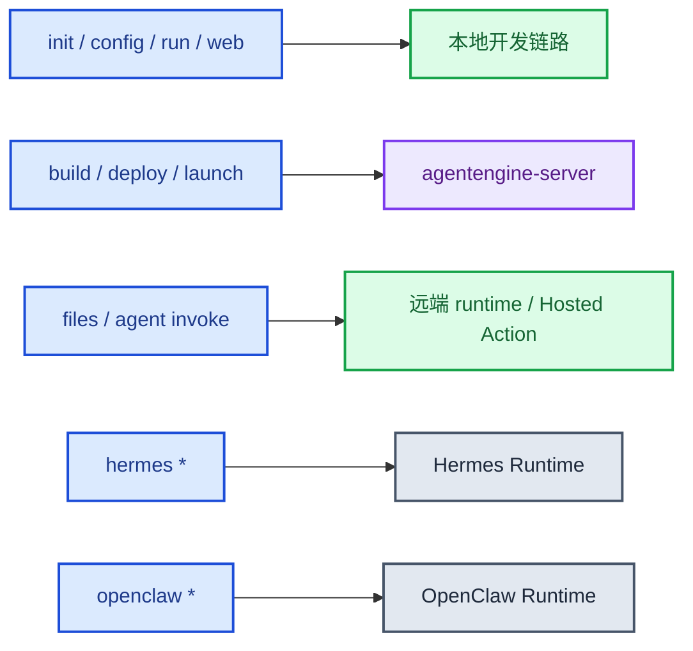
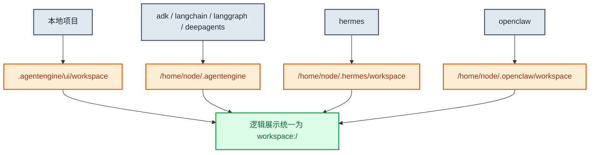

# ksadk使用文档

本文档面向使用 `agentengine` / `ksadk` 的开发者、SA 与交付同学，口径以当前仓库代码、CLI 帮助、测试断言和 Docker/Makefile 默认值为准。

## 1. 适用范围

当前文档覆盖这些主线能力：

- 本地初始化、配置、运行与调试
- `build / deploy / launch` 的构建与部署参数
- `agentengine files` 的完整工作区文件管理链路
- Hermes 与 OpenClaw 的部署和常用验证路径
- PVC 默认值、默认挂载目录、容量约束
- `agentengine agent invoke` 的 Hermes 远端 native 调用与本地目录同步

## 2. 安装与入口

```bash
pip install -U ksadk
```

可选 extras：

```bash
pip install "ksadk[langgraph]"
pip install "ksadk[langchain]"
pip install "ksadk[deepagents]"
pip install "ksadk[adk]"
pip install "ksadk[kb]"
pip install "ksadk[skills]"
```

命令入口等价：

```bash
agentengine --help
ksadk --help
```

## 3. CLI 全景

当前主线命令组包括：

- `init`
- `config`
- `run`
- `web`
- `build`
- `deploy`
- `launch`
- `agent`
- `files`
- `dashboard`
- `hermes`
- `openclaw`
- `mcp`
- `a2a`

全局选项包括：

- `--output pretty|json`
- `--dry-run`
- `--no-color`



## 4. 最短成功路径

### 4.1 本地项目初始化

```bash
agentengine init my-agent -f langgraph
cd my-agent
agentengine config
agentengine run -i
```

本地 Web UI：

```bash
agentengine web --port 8080
```

### 4.2 云端一键部署

```bash
agentengine launch . --target serverless
```

### 4.3 Hermes 云端部署

```bash
agentengine init my-hermes -f hermes
cd my-hermes
agentengine hermes deploy --name my-hermes
agentengine hermes status
```

### 4.4 OpenClaw 云端部署

```bash
agentengine init my-openclaw -f openclaw
cd my-openclaw
agentengine openclaw deploy
agentengine openclaw status
```

## 5. `/v1/responses` OpenAI 兼容接口

本地 `agentengine run -i` 启动后，AgentEngine 暴露 `/v1/responses`。这一接口优先兼容 OpenAI Responses 的返回结构和 SSE 生命周期，同时保留少量 `ksadk` 扩展字段，方便会话和本地 CLI 继续工作。

### 5.1 非流式调用

```bash
curl http://127.0.0.1:8000/v1/responses \
  -H "Content-Type: application/json" \
  -d '{
    "model": "glm-5.1",
    "input": "请用一句话介绍 AgentEngine",
    "instructions": "只用中文回答，语气简洁",
    "metadata": {"source": "local-doc"}
  }'
```

当前支持的常用请求字段：

- `input`：字符串或 OpenAI message/input item 列表。
- `model`：本轮请求使用的模型，会同步到运行时环境。
- `instructions`：本轮系统/开发者指令，不写入用户消息正文；LangGraph 会转为 system message，字符串输入类 runner 会作为 prompt 前缀。
- `metadata`：请求元数据，会回显到 response object，并记录到本轮事件 metadata；不参与模型生成。
- `stream`：`true` 时返回 SSE。
- `session_id`：复用已有会话；未传时自动创建。

非流式响应包含官方风格字段：`id`、`object`、`created_at`、`status`、`model`、`output`、`metadata`、`usage`、`error`、`incomplete_details`。同时保留 `output_text` 和 `session_id` 作为 `ksadk` 扩展，兼容现有调用方。

### 5.2 流式调用

```bash
curl -N http://127.0.0.1:8000/v1/responses \
  -H "Content-Type: application/json" \
  -d '{
    "model": "glm-5.1",
    "session_id": "sess-demo-001",
    "input": [{"role": "user", "content": [{"type": "input_text", "text": "分析这个任务"}]}],
    "stream": true
  }'
```

`model` 和 `session_id` 在流式与非流式调用中都可传；`session_id` 用来复用同一会话，未传时自动创建。

流式事件按 Responses 生命周期输出：

- `response.created` / `response.in_progress`：响应创建与开始运行。
- `response.output_item.added` / `response.content_part.added`：开始输出 message、reasoning、function call 或 MCP approval request。
- `response.output_text.delta` / `response.output_text.done`：正文增量与正文完成。
- `response.reasoning.delta`：思考内容增量，前端可选择单独渲染。
- `response.function_call_arguments.delta` / `response.function_call_arguments.done`：工具调用参数；底层一次性拿到参数时也会按一次 delta + done 输出。
- `response.output_item.done` / `response.content_part.done`：输出项或内容块完成。
- `response.completed`：本轮完成。
- `response.failed`：运行失败。
- `response.incomplete`：需要人工审核或中断恢复。

工具结果和人工审核的兼容策略：

- `response.ksadk.tool_result`：工具执行结果。
- 能明确识别为工具审批的 interrupt 会渲染为官方风格 `mcp_approval_request` output item。
- 其他通用 interrupt 使用 `response.ksadk.approval_request` 扩展事件；最终 response 会以 `status: "incomplete"` 返回，并在 `incomplete_details.ksadk_interrupt` 中包含中断信息。

### 5.3 图片与附件输入

`/v1/responses` 支持把用户输入写成 KOP 风格 part 数组。当前常用 part 类型：

- `text`
- `inlineData`
- `fileData`

推荐两种图片传法：

1. 先调用 `UploadFile` 上传图片，再在 `/v1/responses` 中通过 `fileData.fileUri` 引用
2. 直接把图片 base64 放进 `inlineData.data`

先上传再引用的示例：

```json
{
  "input": [
    {
      "role": "user",
      "content": [
        { "text": "请分析这张图片" },
        {
          "fileData": {
            "fileUri": "ksadk-upload://abc123.png",
            "displayName": "diagram.png",
            "mimeType": "image/png"
          }
        }
      ]
    }
  ],
  "stream": false
}
```

直接内联示例：

```json
{
  "input": [
    {
      "role": "user",
      "content": [
        { "text": "请分析这张图片" },
        {
          "inlineData": {
            "data": "<base64-encoded-image-bytes>",
            "displayName": "diagram.png",
            "mimeType": "image/png"
          }
        }
      ]
    }
  ]
}
```

当前附件类型支持矩阵：

| 类型 | 典型扩展名 / MIME | 传输支持 | 平台内容提取 | 原生多模态直通 |
| --- | --- | --- | --- | --- |
| 文本 | `.txt` `.md` `.json` `.yaml` `.yml` `.csv` `.tsv` `.log` | 支持 | 支持 | 不适用 |
| 文档 | `.pdf` `.docx` `.pptx` `.xlsx` `.html` `.htm` | 支持 | 部分支持：文本提取 / OCR | 不适用 |
| 图片 | `.png` `.jpg` `.jpeg` `.webp` / `image/*` | 支持 | 支持：OCR / 元信息提取 | 部分支持，见下方 |
| 压缩包 | `.zip` | 支持 | 支持：目录/可读文件抽样提取 | 不适用 |
| 其他二进制 | 其他后缀或 `application/octet-stream` | 支持 | 通常仅保留为附件引用 | 不支持 |

框架差异：

- `ADK`
  - 图片会优先按原生 bytes part 传给底层 SDK
  - 如果模型支持原生多模态，可直接吃图
- `LangGraph`
  - 若模型支持图片输入，默认消息构造会把图片附件转换成多模态 `HumanMessage.content` blocks
- `LangChain`
  - 当前不保证所有 agent 自动原生吃图
  - 如需原生多模态，建议在 `ksadk_prepare_input(payload, session_context)` 中自行消费 `input_parts / attachments`

模型能力判断优先级：

1. 请求里显式传入的 `model_metadata`
2. runtime 通过 `OPENAI_BASE_URL` / `OPENAI_API_KEY` 查询上游 `/v1/models` 返回的 `architecture.input_modalities`
3. 本地默认兜底（按文本模型处理）

### 5.4 当前不支持

本期不支持 `previous_response_id`、`store`、复杂 `reasoning/text` 控制、完整 tool schema 请求面，也不新增原生 LangGraph state endpoint。自定义 LangGraph State 请使用 `ksadk_prepare_state` 或 `agentengine init --from-agent` 自动生成的 adapter。

## 6. Framework、挂盘与 workspace 约定

### 6.1 默认 PVC 规则

来自 `ksadk/cli/storage.py` 的统一约束：

- 默认容量：`20Gi`
- 最小容量：`20Gi`
- 最大容量：`500Gi`

### 6.2 默认挂载目录

| Framework | 默认挂载目录 | workspace 逻辑根 | 当前代码里可直接确认的绝对路径 |
| --- | --- | --- | --- |
| `adk` | `/home/node/.agentengine` | `workspace:/` | 运行时对外统一以逻辑根 `workspace` 暴露 |
| `langchain` | `/home/node/.agentengine` | `workspace:/` | 运行时对外统一以逻辑根 `workspace` 暴露 |
| `langgraph` | `/home/node/.agentengine` | `workspace:/` | 运行时对外统一以逻辑根 `workspace` 暴露 |
| `deepagents` | `/home/node/.agentengine` | `workspace:/` | 运行时对外统一以逻辑根 `workspace` 暴露 |
| `hermes` | `/home/node/.hermes` | `workspace:/` | `/home/node/.hermes/workspace` |
| `openclaw` | `/home/node/.openclaw` | `workspace:/` | `/home/node/.openclaw/workspace` |

补充说明：

- 本地 `ksadk server` 的 workspace 根目录是 `<project>/.agentengine/ui/workspace`。
- 对外 CLI 和 Hosted UI 一律展示逻辑根 `workspace:/...`。
- 当运行时响应里带有 `workspace_real_root` 或 `workspace_path` 时，CLI 会同时显示“实际目录”。



## 7. `build / deploy / launch` 参数

以下参数在 `deploy`、`launch` 以及对应 framework 命令中统一存在：

- `--storage-size-gi`
- `--storage-mount-path`
- `--no-storage`

以下 network 参数在 `agentengine deploy`、`agentengine launch` 和 `agentengine openclaw deploy` 中统一存在：

- `--enable-public-access / --disable-public-access`
- `--enable-vpc-access`
- `--vpc-id`
- `--subnet-id`
- `--security-group-id`
- `--availability-zone`

示例：

```bash
agentengine deploy . --target serverless --storage-size-gi 50
agentengine launch . --target kce --storage-mount-path /home/node/.agentengine
agentengine hermes deploy --storage-size-gi 20
agentengine openclaw deploy --no-storage
```

VPC 网络示例：

```bash
agentengine deploy . \
  --target serverless \
  --disable-public-access \
  --enable-vpc-access \
  --vpc-id vpc-xxx \
  --subnet-id subnet-xxx \
  --security-group-id sg-xxx \
  --availability-zone cn-beijing-6a

agentengine launch . \
  --enable-vpc-access \
  --vpc-id vpc-xxx \
  --subnet-id subnet-xxx \
  --security-group-id sg-xxx

agentengine openclaw deploy \
  --enable-vpc-access \
  --vpc-id vpc-xxx \
  --subnet-id subnet-xxx \
  --security-group-id sg-xxx
```

配置文件也可写入 network。CLI 显式参数优先级高于配置文件：

```yaml
network:
  enable_public_access: false
  enable_vpc_access: true
  vpc_id: vpc-xxx
  subnet_id: subnet-xxx
  security_group_id: sg-xxx
  availability_zone: cn-beijing-6a

deploy:
  network:
    enable_public_access: false
    enable_vpc_access: true
    vpc_id: vpc-xxx
    subnet_id: subnet-xxx
    security_group_id: sg-xxx
```

行为要点：

- 不传时使用框架默认挂载目录。
- 容量会在客户端侧先做 `20~500Gi` 校验。
- `--no-storage` 会显式关闭默认 PVC 挂载。
- 只要开启 VPC 访问，或传入 `--vpc-id` / `--subnet-id` / `--security-group-id` 中任意一个，就必须同时具备 `VpcId`、`SubnetId`、`SecurityGroupId`。
- `--availability-zone` 是可选字段，不替代子网或安全组。

## 8. `agentengine files` 工作区文件管理

### 8.1 子命令清单

- `agentengine files list`
- `agentengine files upload`
- `agentengine files download`
- `agentengine files delete`
- `agentengine files push`
- `agentengine files pull`

### 8.2 路径语义

- 远端路径统一是 workspace 相对路径。
- `.`、空字符串和 `/` 会被解释为逻辑根 `workspace:/`。
- 输出里会同时给出：
  - 逻辑路径：`workspace:/docs/readme.md`
  - 真实路径：当运行时返回真实根目录时，显示绝对路径

### 8.3 常用示例

列目录：

```bash
agentengine files list --path .
agentengine files list --path docs --recursive
```

上传单文件：

```bash
agentengine files upload \
  --local-path ./report.md \
  --remote-path reports/report.md
```

下载文件：

```bash
agentengine files download \
  --remote-path reports/report.md \
  --output-path ./downloads/report.md
```

删除文件：

```bash
agentengine files delete --remote-path reports/report.md
```

推送目录：

```bash
agentengine files push \
  --local-dir ./dist \
  --remote-path releases/current
```

拉取目录：

```bash
agentengine files pull \
  --remote-path releases/current \
  --local-dir ./synced
```

### 8.4 `push / pull` 覆盖策略

- 默认不会强制覆盖已有文件。
- 加 `--force` 时，已有同名文件会进入 `overwritten` 结果集。
- 输出会区分：
  - `created`
  - `overwritten`
  - `skipped`

### 8.5 JSON 输出

所有 `files` 子命令都可配合 `--output json` 使用。典型字段包括：

- `workspace_root`
- `workspace_display_path`
- `workspace_real_path`
- `entry_count`
- `size_bytes`
- `size_human`
- `transport_mode`
- `results.created / overwritten / skipped`

### 8.6 大小限制

当前统一上限来自 `ksadk_runtime_common.workspace_files.constants`：

- 单文件上传上限：`100MB`

目录同步时还有两条额外限制：

- 本地目录中任一单文件不能超过上限
- 本地目录总大小也不能超过同一个上限

### 8.7 传输模式

CLI 内部会在两种模式间切换：

- `runtime_direct`：直连 runtime 的 `/_ksadk/workspace/v1/*`
- `action_proxy`：经由控制面 Action 调用

当前代码里的实际策略：

- 常规 agent：优先使用 `runtime_direct`
- OpenClaw：优先使用 `action_proxy`

更完整的协议与安全说明见 [工作区文件技术设计](./工作区文件技术设计.md)。

## 9. `agentengine agent invoke`

`agentengine agent invoke` 是当前主线命令；`agentengine invoke` 仍保留为兼容别名。

### 9.1 常见用法

```bash
agentengine agent invoke my-agent
agentengine agent invoke my-agent --message "你好"
agentengine agent invoke my-agent --transport chat
```

### 9.2 Hermes 远端 native 模式

`--local-workspace` 只支持 Hermes 的远端 native 模式：

```bash
agentengine agent invoke my-hermes \
  --transport native \
  --local-workspace ./local-workspace
```

可选指定远端目录：

```bash
agentengine agent invoke my-hermes \
  --transport native \
  --local-workspace ./local-workspace \
  --remote-workspace-path demos/hermes-pre
```

当前行为：

- 如果不传 `--remote-workspace-path`，默认使用本地目录名作为远端子目录名
- 本地空目录不会被同步
- 会先读取 `GetAgentUiBootstrap` 中的 `WorkspaceFiles.MaxUploadBytes`
- 如 bootstrap 获取失败，则回退到默认 `100MB`

### 9.3 约束

- `--remote-workspace-path` 必须与 `--local-workspace` 一起使用
- `--local-workspace` 不能和单次 `--message` 模式一起使用
- 当前只支持 Hermes 远端 native 模式

## 10. Hermes 命令主线

常用命令：

```bash
agentengine hermes deploy --name hermes-demo
agentengine hermes status
agentengine hermes open --chat
agentengine hermes connect
agentengine hermes exec -- status
```

部署相关默认值：

- 默认 PVC 大小：`20Gi`
- 默认挂载目录：`/home/node/.hermes`
- 默认 workspace 根目录：`/home/node/.hermes/workspace`

## 11. OpenClaw 命令主线

常用命令：

```bash
agentengine openclaw deploy
agentengine openclaw list
agentengine openclaw status
agentengine openclaw gateway doctor
agentengine openclaw channel status --probe
```

### 11.1 当前支持的记忆参数

```bash
agentengine openclaw deploy --memory-system openclaw_default
agentengine openclaw deploy \
  --memory-system mem0 \
  --mem0-instance-id <uuid> \
  --mem0-instance-name my-mem0 \
  --mem0-region cn-beijing-6
```

约束：

- `--memory-system mem0` 时必须传 `--mem0-instance-id`
- `--memory-system openclaw_default` 时不能再传 mem0 细节参数
- 不显式传 `--memory-system` 时，CLI 不会主动覆盖现有服务端配置

### 11.2 当前 mem0 行为

- OpenClaw 镜像内置 mem0 插件资产
- bootstrap 默认把 `openclaw-mem0` 视为延迟同步插件
- 只有在存在 `MEMORY_BACKEND_MANIFEST` 且渲染结果要求该插件时，才会把插件真正同步到实例目录
- 不使用 mem0 时，不会把该插件种到实例的持久化状态里

### 11.3 OpenClaw 存储默认值

- 默认 PVC 大小：`20Gi`
- 默认挂载目录：`/home/node/.openclaw`
- 默认 workspace 根目录：`/home/node/.openclaw/workspace`

更多 OpenClaw 细节见 [OpenClaw一键部署指南](./openclaw一键部署指南.md)。

## 12. 常见验证项

### 12.1 验证工作区文件

```bash
agentengine files list --output json
agentengine files push --local-dir ./workspace --remote-path demo
agentengine files pull --remote-path demo --local-dir ./downloaded --force
```

### 12.2 验证 Hermes remote workspace

```bash
agentengine agent invoke hermes-demo \
  --transport native \
  --local-workspace ./workspace
```

### 12.3 验证 OpenClaw mem0 参数

```bash
agentengine openclaw deploy \
  --memory-system mem0 \
  --mem0-instance-id e52b7fac-e641-4b34-b9f7-6b0b9f190cd4
```

## 13. 相关文档

- [ksadk技术设计](./ksadk技术设计.md)
- [工作区文件技术设计](./工作区文件技术设计.md)
- [记忆使用指南](./记忆使用指南.md)
- [知识库与记忆示例](./知识库与记忆示例.md)
- [OpenClaw一键部署指南](./openclaw一键部署指南.md)
- [DeepAgents说明](./DeepAgents说明.md)
