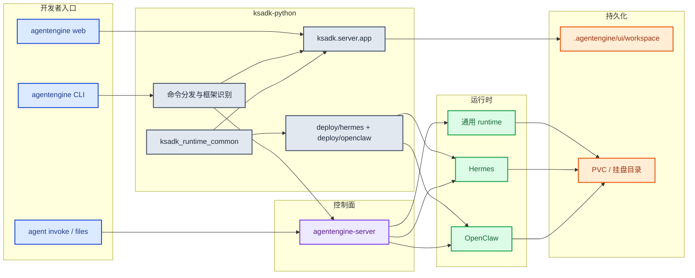
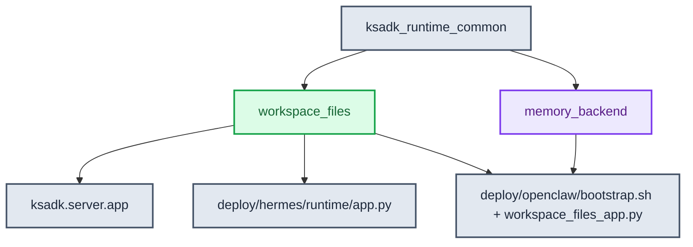
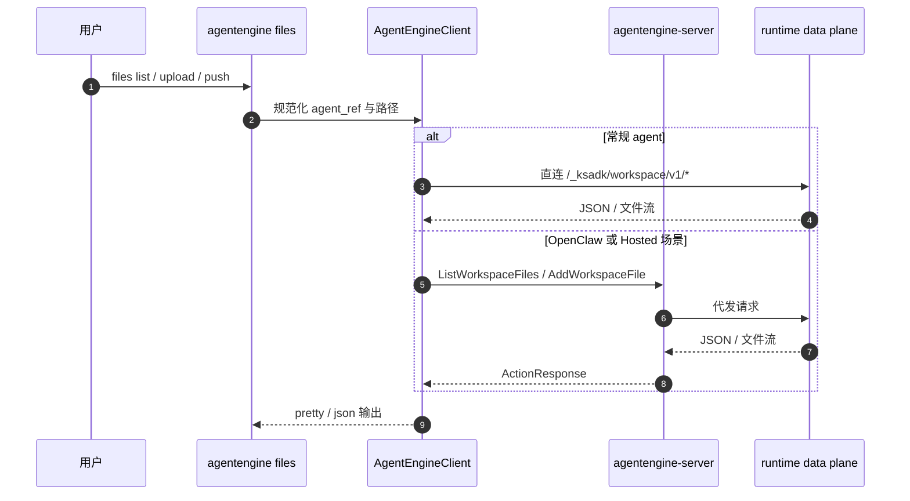
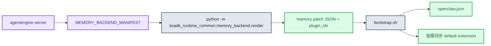

# ksadk技术设计

本文档描述 `ksadk-python` 当前主线的正式技术设计。写法采用技术设计文档结构，但内容只记录已经体现在代码、测试、CLI 帮助、Dockerfile 与默认常量中的行为。

## 1. 目标与边界

`ksadk-python` 负责三类职责：

1. 开发者入口
   提供 `agentengine` / `ksadk` CLI，本地开发、调试、构建和部署都从这里进入。
2. 本地运行时
   提供本地 Web UI、会话存储、本地 workspace 数据面以及开发态调用能力。
3. 托管运行时资产
   提供 Hermes / OpenClaw 共享镜像、bootstrap 脚本、共享 workspace_files 与 memory_backend 源码。

不在本仓承担最终事实源的能力：

- Agent 生命周期持久化
- endpoint / api_key 写回
- Hosted UI bootstrap
- Workspace Files Hosted Action
- OpenClaw `MEMORY_BACKEND_MANIFEST` 生成

这些由 `agentengine-server` 负责。

## 2. 总体架构



## 3. 代码分层

### 3.1 CLI 层

入口在 `pyproject.toml`：

```toml
agentengine = "ksadk.cli:main"
```

CLI 层负责：

- framework 检测
- 本地运行与调试
- 构建产物准备
- 调用 `agentengine-server`
- `files` 与 `agent invoke` 的传输选择
- framework 级默认存储参数

### 3.2 本地运行时

本地运行时的核心是 `ksadk.server.app`，负责：

- 本地会话
- 本地统一 Web UI
- 本地附件上传
- 本地 workspace files 路由

当前本地目录约定：

- UI 根目录：`<project>/.agentengine/ui`
- 本地会话：`<project>/.agentengine/ui/sessions.sqlite`
- 本地 workspace：`<project>/.agentengine/ui/workspace`

### 3.3 托管运行时资产

当前仓库直接维护：

- `deploy/hermes/`
- `deploy/openclaw/`
- `deploy/openclaw-user-template/`

这些目录不仅是模板，还包含线上运行时镜像的事实约定，例如：

- Hermes 的 `entrypoint.sh`
- OpenClaw 的 `bootstrap.sh`
- 共享 workspace sidecar 与 memory backend 渲染入口

## 4. `ksadk_runtime_common` 同仓共享源码

这是当前主线的核心去重点。



当前共享源码包含两块：

### 4.1 `workspace_files`

职责：

- 统一 runtime 路由前缀
- 统一 Hosted bootstrap payload
- 统一路径逃逸拦截
- 统一上传大小上限和动作常量

关键常量：

- `WORKSPACE_ENTRY_ACTION = "ListWorkspaceFiles"`
- `WORKSPACE_UPLOAD_ACTION = "AddWorkspaceFile"`
- `WORKSPACE_CONTENT_PATH = "/agentengine/api/v1/GetWorkspaceFileContent"`
- `DEFAULT_WORKSPACE_MAX_UPLOAD_BYTES = 100MB`

### 4.2 `memory_backend`

职责：

- 解析并校验 `MEMORY_BACKEND_MANIFEST`
- 基于 provider 渲染 OpenClaw 需要的配置 patch
- 返回需要同步的插件 ID 列表

当前 provider：

- `openclaw_default`
- `mem0`

当前 `mem0` 渲染所要求的环境变量：

- `MEM0_API_KEY`
- `MEM0_USER_ID`
- `MEM0_BASE_URL`

## 5. 存储与 workspace 设计

`ksadk/cli/storage.py` 统一定义了 framework 级默认值。

### 5.1 容量约束

- 默认：`20Gi`
- 最小：`20Gi`
- 最大：`500Gi`

### 5.2 默认挂载目录

| Framework | 默认挂载目录 |
| --- | --- |
| `adk` | `/home/node/.agentengine` |
| `langchain` | `/home/node/.agentengine` |
| `langgraph` | `/home/node/.agentengine` |
| `deepagents` | `/home/node/.agentengine` |
| `hermes` | `/home/node/.hermes` |
| `openclaw` | `/home/node/.openclaw` |

### 5.3 workspace 对外语义

- CLI 和 Hosted UI 统一把根目录表示为 `workspace:/`
- Hermes 明确把 `KSADK_WORKSPACE_ROOT` 绑定到 `HERMES_WORKDIR`
- OpenClaw 明确把 `KSADK_WORKSPACE_ROOT` 绑定到 `${OPENCLAW_STATE_DIR}/workspace`

## 6. 文件访问与传输选择



当前策略重点：

- 常规 agent 有 endpoint + api_key 时，优先 `runtime_direct`
- OpenClaw 默认优先 `action_proxy`
- CLI 会把逻辑路径和真实路径同时渲染到输出中

## 7. `agentengine agent invoke` 与本地目录同步

`agentengine agent invoke` 是远端交互入口；其中 Hermes native 模式额外接通了本地目录同步。

同步前会做四件事：

1. 递归扫描本地目录
2. 校验目录非空
3. 校验任一单文件不超过 `MaxUploadBytes`
4. 校验目录总大小不超过同一个上限

如果不传 `--remote-workspace-path`，会默认使用本地目录名作为远端子目录名。

## 8. Hermes 运行时设计要点

Hermes runtime 的关键事实：

- Docker 构建时从仓根复制 `ksadk_runtime_common`
- `PYTHONPATH=/opt`
- `HERMES_HOME=/home/node/.hermes`
- `HERMES_WORKDIR=/home/node/.hermes/workspace`
- `KSADK_WORKSPACE_ROOT` 默认跟随 `HERMES_WORKDIR`

Hermes 既承载 dashboard，又承载：

- `/v1/*`
- `/_ksadk/terminal/ws`
- `/_ksadk/workspace/v1/*`

## 9. OpenClaw 运行时设计要点

OpenClaw runtime 的关键事实：

- Docker 构建时从仓根复制 `ksadk_runtime_common`
- `PYTHONPATH=/opt`
- bootstrap 会启动 workspace files sidecar
- sidecar 默认监听 `127.0.0.1:8091`
- gateway 内部通过 `OPENCLAW_WORKSPACE_FILES_PROXY_URL` 转发到 sidecar

### 9.1 memory backend 主链路



当前链路特征：

- manifest 由控制面生成
- 渲染在 runtime 内完成
- `mem0` 需要环境变量齐全，否则 bootstrap 直接失败
- 插件不是无条件落盘，而是由渲染结果驱动按需同步

## 10. Docker 构建与根上下文

当前 Hermes / OpenClaw 镜像都采用同仓共享源码 + 根上下文构建：

- `COPY ksadk_runtime_common /opt/ksadk_runtime_common`
- `PYTHONPATH=/opt`
- 根目录 `.dockerignore` 负责排除 `.git`、`dist`、`build`、缓存目录和本地产物

收益：

- 不依赖额外 wheel 仓发布
- 共享源码与 runtime 资产同仓演进
- Docker 构建可直接消费最新共享模块

## 11. 与服务端的协作边界

| 能力 | `ksadk-python` | `agentengine-server` |
| --- | --- | --- |
| CLI / 本地开发 | 负责 | 不负责 |
| Agent 生命周期 | 调用方 | 真相源 |
| Hosted UI bootstrap | 消费方 | 负责 |
| Workspace Files runtime data plane | 负责 | 不负责 |
| Workspace Files Hosted Action | 消费方 | 负责 |
| Memory manifest 渲染 | 负责 | 不负责 |
| Memory manifest 生成 | 不负责 | 负责 |
| endpoint / api_key 写回 | 不负责 | 负责 |

## 12. 文档索引

- [ksadk使用文档](./ksadk使用文档.md)
- [工作区文件技术设计](./工作区文件技术设计.md)
- [记忆使用指南](./记忆使用指南.md)
- [OpenClaw一键部署指南](./openclaw一键部署指南.md)
