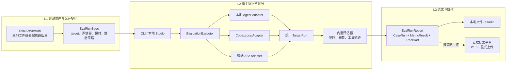
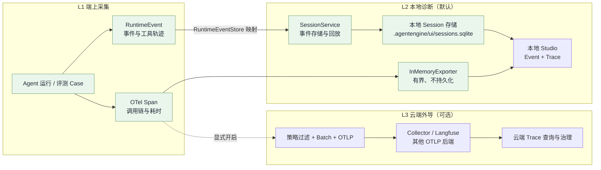
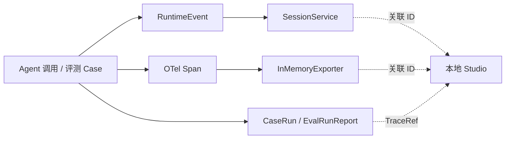
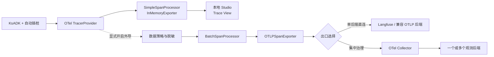

# KsADK 端上 Agent 观测与评测技术评审方案

> 状态：技术评审稿
>
> 范围：KsADK SDK、CLI、本地 Studio，以及未来与云端 Studio 的协作。
>
> 基线：以当前 `ksadk-python` 对外能力为准；VeADK 和行业产品仅作为参考。文中的“待建设”不代表当前已经支持。

## 1. 背景与结论

端上 Agent 通常运行在开发机、内网或用户设备中，代码、模型凭据、MCP 和业务数据不适合由云端直接访问。云端更适合管理评测集、权限、结果和趋势。

推荐采用“**端上执行、本地可诊断、云端按策略协作**”的方案：

- CLI 在端上评测本地 Agent 或远端 A2A Agent；云端不反向连接端上进程。
- 本地 `RuntimeEvent` 和 Trace 支撑调试与轨迹评测；Trace 外导独立配置、默认关闭。
- 本地 Studio 先形成真实评测闭环；云端 Studio 后续管理版本化评测集和已上传结果。
- 每个评测 case 保存 `TraceRef`，从评分结果可下钻到事件和 Trace。

一期只建设确定性回归能力，不包含 LLM Judge、自动生成案例、生产流量回放或复杂云端调度。

## 2. 分析口径与能力现状

### 2.1 四个平面

| 平面 | 核心问题 | 设计要求 |
| --- | --- | --- |
| Agent 执行面 | Agent 在哪里运行？ | 区分本地源码、远端 A2A、托管 Runtime |
| 评测执行面 | 谁驱动案例并评分？ | 执行器必须位于可访问 target 的网络侧 |
| 观测数据面 | 事件和 Trace 保存在哪里？ | 区分进程内、SessionService、外部 Trace 后端 |
| 评测控制面 | 谁管理评测集、结果和权限？ | 本地负责开发闭环，云端负责团队资产与协作 |

“本地评测”只表示评测执行器在本地。如果 Agent、工具、Judge 或 Exporter 调用云服务，仍会产生网络通信。

### 2.2 KsADK 当前能力边界

以下结论基于当前仓库实现，不把后续方案设计视为已经支持。

| 方向 | 能力 | 当前状态 | 核心边界 |
| --- | --- | --- | --- |
| 本地执行 | 多框架 Agent 运行 | **已支持** | 支持 ADK、LangChain、LangGraph、DeepAgents 的本地运行与调试，但不等于批量评测 |
| 本地执行 | Codex 本机调度 | **待建设** | 将本机 `codex exec` 视为外部 CLI Runner；本机启动不等于模型推理在本机，只有 Codex 明确使用本地 Provider 时才是端上模型 |
| 本地执行 | RuntimeEvent | **已支持** | 支持事件持久化、订阅和回放；跨进程保留取决于 SessionService，回放不重新执行 Agent |
| 本地执行 | A2A Runtime | **已支持，Alpha** | 支持 A2A 服务、Agent Card、Task 和 Space 调用；尚无 A2A 批量评测与远端轨迹保证 |
| 观测 | 本地 OTel Trace | **已支持** | Trace 默认保存在当前进程内，重启丢失；已有基础查询 API |
| 观测 | Trace 外导 | **源码已实现，尚未产品化收口** | 已有 OTLP、Langfuse、CloudMonitor 路径，缺少统一治理、健康状态和兼容性验收 |
| 观测 | Studio 观测 | **具备基础 API** | 尚未形成 RuntimeEvent + Trace 联合诊断、A2A 下钻和 Exporter 状态工作台 |
| 评测 | 本地评测 | **已有 Studio 后端原型** | 仅支持本地 Build、YAML Suite 和确定性断言，沿用旧模型且前端未形成完整闭环 |
| 评测 | CLI/A2A 评测 | **当前不支持** | 无 `agentengine eval`、Local/A2A Target Adapter 和统一报告契约 |
| 评测 | 云端协作 | **当前不支持** | 无云端 EvalSet 版本、报告上传、端云编排、反馈入集和团队治理 |

整体上，KsADK 已具备本地执行和事件/Trace 基座；观测需要产品化收口，评测需要在现有原型之外重建统一 CLI、数据契约和 Studio 闭环。

## 3. 行业调研与对齐结论

### 3.1 产品能力对比

| 产品 | 主要能力 | 对 KsADK 的借鉴 | 边界 |
| --- | --- | --- | --- |
| VeADK | CLI 可评本地 `root_agent` 或远端 A2A；支持 ADK/DeepEval；可上传 ADK EvalSet 到 CozeLoop | 一条 CLI 覆盖本地/A2A；兼容 ADK EvalSet | 上传评测集不等于产生 EvalRun；Studio 评测页尚非执行闭环 |
| Google ADK | 本地 Web、CLI、EvalSet 和 Trace View 共享语义 | CLI、Studio、评测集和 Trace 使用统一模型 | 本地开发 UI 不提供团队级权限与长期资产管理 |
| LangSmith | Dataset、Experiment、Trace、反馈围绕统一 Run 模型 | 打通 EvalSet、CaseRun、Trace 和反馈 | 云端控制面不能假设可访问所有本地 Agent |
| Langfuse | 跨框架 Trace、Dataset、Score、Experiment；支持 Cloud/Self-host | 运行时与观测控制面解耦，明确数据策略 | 不需要照搬其平台并重建 Agent Runtime |

### 3.2 与 VeADK 对齐的取舍

| 维度 | VeADK 参考能力 | KsADK 建设方向 |
| --- | --- | --- |
| CLI target | `--agent-dir` 或 `--a2a-url` | 新增本机 Codex Target；三者参数必须互斥 |
| 评估器 | ADK 与 DeepEval | P1 固定确定性评估器；Judge 后置为插件 |
| 评测集 | Google ADK JSON，可上传 CozeLoop | 兼容导入并规范化为不可变 `EvalSetVersion` |
| 结果 | CLI/框架结果 | 统一 `EvalRunReport`、失败分类和版本快照 |
| Studio | 调试、Trace、部分反馈沉淀 | 建设真实运行、结果详情、比较和 Trace 下钻 |
| 观测 | 可选外部 Exporter | 先定义外导策略、脱敏和关联契约，再实现 Exporter |

KsADK 应对齐 VeADK 的 CLI 入口，同时补齐版本化报告、真实 Studio 和端云资产闭环。

## 4. 方案选择、总体架构与端云场景

### 4.1 部署方案对比

以下方案统一按评测执行面与资产/结果控制面比较；Agent 本身可位于本地或远端，关键约束是评测执行器能否访问该 Target。

| 方案 | 评测执行面 | 评测集与结果 | 可覆盖 Target | 主要边界 | 判断 |
| --- | --- | --- | --- | --- | --- |
| 纯端上闭环 | CLI / 本地 Studio | 本地文件或本地 Studio | 本地 Agent、端上网络可访问的 A2A Agent | 可离线且数据边界清晰；缺少团队共享、权限和趋势分析 | **P1 基线** |
| 纯云端闭环 | 云端 Worker | 云端统一管理 | 云端可访问的托管 Agent 或 A2A Agent | 集中管理简单；无法直接评测开发机或私网 Agent | 仅适合云端场景 |
| 端云协同 | 执行器部署在可访问 Target 的一侧 | 本地可用；评测集版本和结果可按策略同步云端 | 本地 Agent、远端 A2A Agent、云端托管 Agent | 需要版本校验、脱敏和同步失败处理 | **推荐目标方案** |

推荐方案不是让云端访问所有 Agent，而是统一评测契约，由能够访问 Target 的执行器完成评测，再按数据策略同步评测集和结果。

### 4.2 评测总体架构



L1 冻结可比较基线，L2 在能够访问 target 的端上执行，L3 默认保留本地结果并按策略与云端协作。云端 Studio 不直接连接本地或内网 Agent。

### 4.3 观测总体架构



**已有能力**：`RuntimeEventStore` 将 RuntimeEvent 映射为 SessionEvent，再由 SessionService 写入配置后端；`agentengine web` 默认落到 `<agent>/.agentengine/ui/sessions.sqlite`，使用 `memory` 时不持久化。OTel Span 由 InMemoryExporter 临时保存，当前已有基础查询 API。OTLP Exporter 已有源码路径，但尚未形成统一的数据策略和健康状态。

**待建设能力**：本地 Studio 按稳定 ID 联合查询 Event 和 Trace；Trace 外导统一经过策略过滤、结构化脱敏、批量队列和失败隔离。评测集与评测报告上传仍是独立通道，评测结果只通过 `TraceRef` 关联 Event 和 Trace。

架构约束：

- 执行器靠近 target，云端不主动连接端上 Agent。
- CLI 和 Studio 共用 `EvaluationExecutor`，不互相解析命令行文本。
- 评测集、target、评估器和环境均记录不可变版本或 digest。
- 评测集、报告和 Trace 是三个独立的外发通道。

### 4.4 典型端云场景

| 场景 | Agent 执行面 | 评测执行面 | 观测/结果控制面 | KsADK 落地方向 |
| --- | --- | --- | --- | --- |
| A. 全本地 | 本地 Agent | 本地 CLI、Studio 或 CI | 本地文件、SessionService、进程内 Trace | P1 完成 EvalSet、确定性评估器、本地报告和 Trace 下钻 |
| B. 本地 Agent + 云端 Judge | 本地 Agent | 本地编排；Judge 在云端评分 | 结果保存在本地或按策略上传；Trace 可保持本地 | P2 可选 Judge 插件；单独治理输入、输出、参考答案和 Judge Prompt 外发 |
| C. 本地 Agent + 云端观测 | 本地 Agent | 本地评测或无评测 | 云端/私有化 Trace 后端；报告独立选择本地或云端 | P2 标准 OTLP Exporter、脱敏、采样和失败隔离 |
| D. 本地评远端 A2A Agent | 远端 A2A Agent | 本地 CLI、Studio 或 CI | 报告保存在本地或上传摘要；远端 Trace 按权限关联 | P1 建设 A2AAdapter、Card/鉴权、Task 状态、Target Snapshot 和轨迹降级 |
| E. 云端 Agent + 云端评测 Worker | 云端 Runtime | 云端 Eval Worker | 云端或私有化统一控制面 | P2/P3 建设调度、测试租户，并隔离运行、评测和观测读取身份 |
| F. 本地敏感执行 + 云端汇总 | 本地、端侧或内网 Agent | 本地 CLI/Worker | 原始 case、输出和 Trace 留在本地；云端仅保存脱敏结果或聚合指标 | P1.5 支持 `result_only`、离线补传、可审计脱敏和私有化控制面 |

B 与 C 是两个独立网络出口：Judge 会接收评测内容，Exporter 会发送观测数据，不能因启用其中一个而默认启用另一个。场景 D 无远端细粒度 Trace 时，工具轨迹必须标记 `UNAVAILABLE`；场景 E 的三类身份不得复用生产用户令牌。

## 5. 观测能力建设

当前代码基座已有 `InMemoryExporter`、框架自动插桩、通用 OTLP/HTTP、Langfuse/CloudMonitor 兼容路径和可选 OTLP/gRPC。建设重点不是重写采集链路，而是把这些代码收口成可配置、可治理、可诊断的产品能力。

### 5.1 建设项总览

| 编号 | 建设项 | 需要落地的能力 | 复用与新增 | 阶段 |
| --- | --- | --- | --- | --- |
| O1 | 本地采集与统一关联 | 统一 Agent、模型、工具、A2A 和评测 span 语义；以稳定 ID 关联 RuntimeEvent、Trace、CaseRun；提供有界内存查询 | 复用自动插桩、`InMemoryExporter` 和本地 API；新增语义与关联契约 | P1 |
| O2 | 标准外导与后端接入 | 以 OTLP/HTTP 为主、gRPC 兼容，可直连 Langfuse 等后端或经 Collector 路由 | 复用现有 Exporter 初始化；统一配置优先级、启停和防重复规则 | P2 |
| O3 | 外导治理与可运维性 | 支持分级外发、结构化脱敏、批量队列、失败隔离、flush 和健康指标 | 复用 `BatchSpanProcessor`；新增导出策略、过滤器和健康状态 | P2 |
| O4 | A2A 与 Studio 诊断 | 建立 A2A client span 和远端 Task 映射；按能力传播 Trace Context；提供本地 Trace/Event 下钻及云端受权链接 | 复用 A2A 和本地 Trace API；新增传播协商、统一查询和降级展示 | P1/P2 |
| O5 | Codex 本机调度观测 | 将 `codex exec --json` 的生命周期、工具、命令、文件变更和错误事件保留为本地证据包，并以稳定 ID 关联 CaseRun 和 OTel | 复用外部进程执行、评测报告和本地 Trace；新增 JSONL 解析、证据包与 Codex 状态映射 | P1 |

### 5.2 本地采集与统一关联

同一次 Agent 调用并行产生 RuntimeEvent 和 OTel Span：前者记录“发生了什么”，后者记录“调用链如何执行”。二者不互相转换，通过稳定 ID 在 Studio 和评测报告中关联。



#### 采集对象与职责

| 对象 | 记录内容 | 本地承载 | 主要用途 |
| --- | --- | --- | --- |
| `RuntimeEvent` | Agent 输出、工具调用顺序、状态变化和错误 | `SessionService` | 会话回放、工具轨迹断言 |
| OTel Span | Agent、模型、工具、A2A 调用的父子关系、耗时和状态 | `InMemoryExporter` | Trace 拓扑、性能和错误诊断 |
| `CaseRun` / `EvalRunReport` | Case 输出、评分、失败分类和关联指针 | 本地评测结果存储 | 从评测结果下钻事件和 Trace |

`InMemoryExporter` 是进程内有界 Span 缓冲区，不是持久化存储；进程退出或容量淘汰后数据不可恢复。

#### 最小关联契约

| 关联范围 | 必备字段 | 串联对象 |
| --- | --- | --- |
| 一次 Agent 调用 | `agent_id`、`session_id`、`invocation_id` | 会话、RuntimeEvent、根 Span |
| 一条 Trace | `trace_id`、`root_span_id` | 根 Span、模型 Span、工具 Span、A2A Client Span |
| 一次评测 Case | `eval_run_id`、`eval_case_id`、`attempt` | CaseRun、MetricResult、RuntimeEvent、TraceRef |
| 被测 Target | `target_kind`、`target_revision` | 本地 Agent 或 A2A Agent 及其版本 |
| 远端 A2A 任务 | `remote_task_id`、`remote_agent_id` | 本地 Client Span 与远端任务；不表示已取得远端 Trace |
| Codex 本机运行 | `codex_run_id`、`codex_thread_id`、`codex_turn_id`、`event_seq` | CaseRun、`codex.run` Span、JSONL 事件和证据包 |

上述字段写入 `EvalRunReport`、`TraceRef` 以及对应的 `ksadk.*` Span Attribute，形成四条直接查询路径：`Session -> Invocation -> Event/Trace`、`EvalRun -> CaseRun -> Event/Trace`、`A2A Client Span -> Remote Task`、`EvalRun -> CaseRun -> Codex JSONL/证据包`。

实现上，每个进程只初始化一个 `TracerProvider`；本地内存查询使用 `SimpleSpanProcessor`，网络外导使用 `BatchSpanProcessor`。自动插桩采集框架内部调用，KsADK 补充 `agent.run`、`tool.call`、`a2a.client`、`eval.case` 等稳定边界 Span，并避免 Callback 与直接 OTel 插桩产生重复 Span。完整 Prompt、用户标识、工具密钥和附件正文不得直接写入 Span 或 Resource Attribute。

### 5.3 OTel、OTLP 与后端职责

| 组件 | 角色 | KsADK 定位 |
| --- | --- | --- |
| OTel SDK | 创建和处理 Trace/Span | 通用采集基础，不表示已经外发 |
| `InMemoryExporter` | 将完成的 span 留在进程内 | 本地 Studio 调试；不持久化、不发网络 |
| `OTLPSpanExporter` | 通过 OTLP/HTTP 或 OTLP/gRPC 发送 span | 标准网络外导客户端 |
| OTel Collector | 接收、处理、脱敏和路由 OTLP | 多后端、私网代理或集中治理时使用 |
| Langfuse SDK | 基于 OTel 的客户端 SDK，封装 Langfuse 发送链路 | 兼容路径，不能与直接 OTLP 重复启用 |
| Langfuse 服务端 | OTLP Trace Receiver、存储和 UI | 观测后端，**不是 Exporter** |

KsADK 推荐 OTel-first：业务代码只生成标准 span，优先使用 `OTLPSpanExporter` 对接 Langfuse、Collector 或其他后端。只有鉴权或语义映射确有差异时才增加薄适配层。本方案只承诺 Trace/Span 接入，不由此推导后端支持通用 OTel Metrics 和 Logs。

### 5.4 Trace 外导落地



#### 配置与路由

本节定义未来稳定对外配置；现有 `LANGFUSE_*`、`CLOUD_MONITOR_*` 保留为兼容路径，不再作为新增后端的首选接入方式。

| 路由 | OTLP Endpoint 指向 | 适用场景 | 规则 |
| --- | --- | --- | --- |
| 仅本地 | 不配置 | 离线调试、敏感数据 | 只保留 `InMemoryExporter` |
| 单后端直连 | Langfuse 或其他兼容 OTLP 的后端 | 开发环境、单一后端 | 链路短、配置少；Agent 进程只连接一个网络后端 |
| 经 Collector | OTel Collector | 私网代理、多后端、集中采样和脱敏 | 由 Collector 分流，Agent 进程不挂多套供应商 Exporter |

| 配置目的 | 配置项 | 生效规则 |
| --- | --- | --- |
| 服务标识 | `OTEL_SERVICE_NAME`、`OTEL_RESOURCE_ATTRIBUTES` | 只放稳定、非敏感的 Agent、环境和实例信息 |
| Trace 地址 | `OTEL_EXPORTER_OTLP_TRACES_ENDPOINT` | 优先于通用 `OTEL_EXPORTER_OTLP_ENDPOINT`；配置后才具备网络出口 |
| 协议 | `OTEL_EXPORTER_OTLP_TRACES_PROTOCOL` | P2 主路径为 `http/protobuf`，保留 gRPC 兼容 |
| 鉴权 | `OTEL_EXPORTER_OTLP_TRACES_HEADERS` | 由环境变量或平台 Secret 注入；日志只显示 header 名称 |
| 批量大小 | `KSADK_OTLP_MAX_EXPORT_BATCH_SIZE` | 默认有界，避免单次请求过大和队列内存膨胀 |
| 数据级别 | `KSADK_TRACE_EXPORT_POLICY`（待新增） | 默认 `local_only`；必须显式选择其他级别才能外导 |

初始化规则固定为：本地 InMemory 路径始终独立保留；标准 `OTEL_EXPORTER_OTLP_*` 是主路径；兼容变量不得与同目标的直接 OTLP 或 Callback 重复发送。同一 Trace 需要进入多个后端时使用 Collector 分流。

#### 数据策略

Trace 外导策略只控制 OTel Span，不控制评测报告上传；`result_only` 属于 6.6 节的评测结果同步策略。

| Trace 策略 | 外导内容 | 适用场景 |
| --- | --- | --- |
| `local_only` | 不创建网络 Exporter | 默认模式、离线或敏感环境 |
| `metadata_only` | 仅调用拓扑、类型、状态、耗时、Token 计数和关联 ID | 需要云端性能与错误分析，但不允许外发业务内容 |
| `redacted_trace` | 在 `metadata_only` 基础上，增加 allowlist 允许且完成结构化脱敏的输入输出字段 | 需要在云端排查内容相关问题 |
| `full_trace` | 显式授权的完整 Span 数据 | 受控环境，必须配套项目权限、保留期和审计 |

处理顺序固定为：`策略选择 -> Span/字段 allowlist -> 结构化脱敏 -> OTLP 序列化 -> 批量发送`。脱敏覆盖 Span Attribute、Event、Status Description 和 Resource Attribute；未知字段或脱敏失败时标记 `EXPORT_BLOCKED`，不得降级为明文上传。本地 InMemory 数据是否展示敏感内容由本地 Studio 权限策略单独控制。

#### 可靠性与可运维性

- 网络 Exporter 使用有界队列、批量发送、超时和有限重试，不得阻塞或改变 Agent 主调用结果。
- 进程退出时统一 `force_flush`/`shutdown` 所有 SpanProcessor；超时后记录未发送数量，不无限等待。
- 提供 `disabled/healthy/degraded/blocked` 状态，以及最近成功/失败时间、导出 Span 数、失败数、丢弃数和队列使用率。
- 启动日志展示生效的后端、协议、service name 和 header 名称，不输出 token、完整 header 或原始 Trace。

### 5.5 Codex 本机调度观测

`CodexLocalAdapter` 的可行性建立在 Codex CLI 的非交互 `codex exec --json` 上：该模式输出逐行 JSON 事件，覆盖 thread/turn 生命周期、Agent 消息、命令执行、文件变更、MCP 调用、计划更新和错误。KsADK 不解析 TUI 文本、不依赖事后扫描 Codex 会话目录，也不尝试把 Codex 私有内部状态伪造成 KsADK `RuntimeEvent`；经脱敏后的 JSONL 事件流是该 Target 的一手轨迹，优先于归一化视图。

#### 运行与证据包

每个 Case 在独立的 Git worktree 中执行，调度器为其分配 `codex_run_id`。执行命令固定采用最小权限的 `workspace-write` sandbox；非交互运行使用预配置的审批策略，禁止使用 `--yolo` 或 `danger-full-access` 作为默认路径。每次运行至少保留以下本地不可变证据：

```text
<eval_run_id>/<eval_case_id>/<attempt>/
  events.jsonl       # 经脱敏的 Codex stdout 事件流，按到达顺序追加
  final.md           # --output-last-message 的最终消息
  stderr.log         # 进程 stderr，经结构化脱敏
  diff.patch          # 相对 Case 基线 commit 的工作区差异
  verification.log   # 预批准验证命令的输出
  manifest.json      # 快照、状态、时间、摘要和文件 hash
```

启动包装器流式读取 JSONL 并同时落盘，不能等进程结束后只保留最终消息。运行配置必须隐藏 Agent Reasoning；持久化前移除 reasoning 项并对命令参数、文件内容、Prompt、MCP 返回和环境变量执行结构化脱敏。包装器创建 `codex.run` 根 Span，记录启动、首事件、最后事件、退出、超时和取消时间；对 JSONL 仅提取事件类型、状态、耗时、工具/命令类别、退出码、改动路径摘要和关联 ID 写入 Span Attribute。脱敏后的详细内容只留在受控本地证据包，按 Trace 外导策略决定是否允许外发。

| 观测维度 | 一手证据 | `TargetRun` / Studio 展示 |
| --- | --- | --- |
| 调度生命周期 | `thread.started`、`turn.started`、`turn.completed` / `turn.failed`、进程退出码 | 排队、启动、首事件、运行、完成、失败、超时、取消与重试 |
| Agent 行为 | JSONL 的 `item.*` 及其命令、文件变更、MCP 调用和错误项 | 时间线、工具/命令摘要、非零退出、文件变更与首个失败事件 |
| 工作区结果 | 基线 commit、`git diff`、`git status`、产物 hash | 改动范围、允许/禁止路径、残留文件与 diff 链接 |
| 任务结果 | `final.md` 与预批准验证日志 | 最终输出、测试/构建结果、质量指标和失败分类 |

`codex_thread_id`、`codex_turn_id` 和 `event_seq` 写入 `TraceRef`；没有可用 JSONL 或事件序列不完整时，Codex 轨迹相关指标为 `UNAVAILABLE`，不能根据最终回答补造轨迹。

#### 最小实施路径与运行快照

一期不需要新增 Codex 插件、MCP 或修改 Codex。本地执行器按下列顺序实现即可：

1. 为 Case 创建 worktree，冻结基线 commit，并从受信配置解析 Codex 二进制、模型、profile、sandbox、超时和环境变量 allowlist。
2. 启动 `codex exec --json --sandbox workspace-write -C <worktree> -o <final.md> <prompt>`，流式写入 `events.jsonl`；超时或取消后终止子进程并等待确定终态。
3. 收集退出码、最终事件、diff 和 `git status`，再在该 worktree 执行 Case 引用的预批准验证命令；命令 ID 由执行器配置解析，不允许 EvalSet 注入任意 shell。
4. 写入 `manifest.json` 与 `TargetRun`，由既有 `EvaluationExecutor` 评分并产出 `EvalRunReport`；保留 worktree 或清理 worktree 由本地保留策略决定，证据包不随清理丢失。

`TargetSnapshot` 对 Codex 需额外冻结：Codex CLI 版本、模型/本地 provider、profile 与生效配置摘要、`AGENTS.md`/Skill/插件清单摘要、基线 commit、操作系统/架构、sandbox 与审批策略。它们影响行为和可复现性，但报告中不保存配置中的凭据或临时路径。

#### Codex 专项验收与故障分类

Codex 结果必须同时通过独立门禁，不能以平均分掩盖调度或安全失败：

| 门禁 | 判定证据 | 失败示例 |
| --- | --- | --- |
| `codex_runner@v1` | 进程退出、终态事件、`final.md`、事件序列完整性和超时状态 | 启动失败、CLI 崩溃、`turn.failed`、JSONL 截断、超时或取消未收敛 |
| `workspace_policy@v1` | 基线 diff、允许路径、禁止路径、工作区残留和密钥扫描结果 | 修改范围外文件、生成未允许产物、敏感信息写入或未隔离基线 |
| `verification_command@v1` | 预批准的测试/构建/断言命令退出码和 `verification.log` | 最终回答声称完成但测试失败或未执行 |
| `response_contract@v1`（可选） | `final.md` 的确定性断言 | 文本或结构化输出不符合 Case 契约 |

基准集除正常仓库任务外，必须有只读/可写/禁止写入场景，以及启动失败、超时、取消、脏 worktree、并发冲突和非零工具退出的故障注入。稳定性测试固定同一 `TargetSnapshot`、EvalSetVersion、执行环境和并发配置，重复运行至少 3 次，单独报告完成率、门禁失败率、P50/P95 时延、首事件时延、命令失败率和变更范围；安全、可启动性和验证失败均为独立 release gate。

### 5.6 A2A 观测与 Studio 工作台

A2AAdapter 每次远端调用创建 `a2a.client` Span，并写入 Endpoint 指纹、Task 状态和 `remote_task_id`。目标声明并验证支持 W3C Trace Context 时才透传 `traceparent`/`tracestate`；否则只保存本地 Span 和任务映射，不伪造远端父子 Trace。远端没有细粒度轨迹时，Studio 和评测结果统一显示 `UNAVAILABLE`。

以下均为待建设能力，不代表当前 Studio 已经支持。

#### 本地诊断工作台（P1）

| 页面层级 | Studio 应提供的能力 | 数据边界 |
| --- | --- | --- |
| Run/Trace 列表 | 按 Agent、Session、Invocation、时间、状态和评测 Case 筛选；显示耗时、错误和数据来源 | InMemory Trace 仅属于当前进程；RuntimeEvent 是否跨重启可查取决于 SessionService 后端 |
| Trace 详情 | 展示 Span 树与时间线、模型/工具节点、耗时、Token、状态和错误；敏感输入输出按策略隐藏 | Trace 用于拓扑和性能诊断，不作为工具轨迹断言的唯一依据 |
| Event 联合诊断 | 在同页展示 RuntimeEvent 时间线；支持 Span、`seq_id` 和工具调用双向定位 | RuntimeEvent 是工具序列和参数断言的事实来源 |
| 评测关联 | 从 CaseRun 跳转对应 Trace/Event，并从 Trace 返回 `eval_run_id`、`eval_case_id` 和失败指标 | 无 Trace 的 Case 明确显示未采集，不伪造关联 |

#### 端云诊断与治理（P2/P3）

| 阶段 | Studio 应提供的能力 | 边界 |
| --- | --- | --- |
| P2：A2A 诊断 | 展示 A2A Client Span、Endpoint 指纹、Task ID、终态、延迟和错误分类 | 远端 Trace 仅在对方支持上下文传播且当前用户获权时提供链接，否则显示 `UNAVAILABLE` |
| P2：Exporter 诊断 | 展示生效协议、后端、最近成功/失败时间、导出/失败/丢弃数和队列状态 | 不展示 Token、完整 Header 或原始敏感字段；Exporter 故障不影响 Agent 结果 |
| P3：查询与治理 | 按 Agent/Target/版本聚合延迟和错误；配置采样、保留期、字段可见性和访问审计 | 云端只治理已外导数据，不能查询仍留在端上的 Trace |

云端 Studio 只展示已上传报告、Exporter 健康状态和受权 Trace 链接；`result_only` 模式下不得出现“云端已保存 Trace”的误导入口。

### 5.7 观测验收

| 阶段 | 观测交付 | 验收标准 |
| --- | --- | --- |
| P1 | 统一 Span/关联字段、本地 Trace/Event 下钻、A2A Client Span、Codex JSONL 证据包 | `local_only` 不产生观测或评测外导；有 Trace 或 Codex JSONL 的本地 Case 关联率 100%；重启后内存 Trace 消失但持久化 RuntimeEvent/Codex 证据包可查询 |
| P2 | 标准 OTLP、数据策略、Exporter 健康状态、A2A Trace Context、云端链接 | Exporter 故障不影响 Agent；脱敏命中和阻断可审计；Callback/直接 OTLP 不产生重复 Trace；离线/重试不泄露凭据 |
| P3 | 采样、保留、告警、成本与组织权限 | 可按项目执行保留/删除；按 Agent/target/version 聚合趋势；敏感内容访问可审计 |

## 6. 评测能力建设

### 6.1 能力分层与建设总览

| 层级 | 建设目标 | 核心能力 | 阶段 |
| --- | --- | --- | --- |
| L1 资产与契约层 | 固定评测输入和可比较基线 | EvalSetVersion、CaseProvenance、EvalRunSpec、Target/评估器/环境快照、ADK EvalSet 导入 | P0 |
| L2 执行与评分层 | 用同一引擎评测三类 Target | CLI/Studio 入口、`EvaluationExecutor`、本地/A2A/Codex Adapter、确定性评估器、隔离 Session/worktree 和错误分类 | P1 |
| L3 结果与协作层 | 形成可复现、可下钻、可共享的结果 | TargetRun、EvalRunReport、MetricResult、TraceRef、本地 Studio、云端报告上传 | P1/P1.5 |

P0 冻结 L1 契约，P1 闭环本地 L2-L3，P1.5 增加云端资产与结果控制面，但不替换端上执行器。

### 6.2 评测契约、EvalSet 与比较规则

以下对象是待建设的统一契约，不代表当前 KsADK 已有对应的稳定类型。

#### 对象关系

```text
EvalSetVersion + TargetSnapshot + 评估器/执行配置
    -> EvalRunSpec -> EvalRun
                       |- CaseRun[]
                       |  |- TargetRun
                       |  |- MetricResult[]
                       |  \- TraceRef
                       \- EvalRunReport
```

#### 核心对象

| 对象 | 含义与作用 | 关键内容与边界 |
| --- | --- | --- |
| `EvalSet` / `EvalSetVersion` | `EvalSet` 是逻辑评测集，`EvalSetVersion` 是一次执行引用的不可变版本 | 包含 Case、参考输出、期望轨迹、多轮初始状态、标签、数据分级和内容 Digest；P0 兼容导入 ADK EvalSet JSON |
| `CaseProvenance` | 记录每个 Case 的来源和演进过程，避免反馈或 Trace 样本直接污染正式数据 | 标识人工创建、文件导入、用户反馈或 Trace 回流，以及审核状态和父版本；修改后生成新的 EvalSetVersion |
| `TargetSnapshot` | 冻结本次被测 Agent 的身份和版本 | 本地 Agent 记录代码/配置版本；A2A Agent 记录 Card、Endpoint 指纹和部署版本；Codex 记录 CLI/模型/profile/指令摘要、基线 commit 和 sandbox；不保存凭据 |
| `EvalRunSpec` | 一次评测的不可变执行计划，回答“评什么、评谁、怎么评、如何执行” | 引用 EvalSetVersion、TargetSnapshot、评估器及版本，并记录阈值、超时、重试、执行环境和数据策略 |
| `EvalRun` | 一次评测任务的运行实例 | 包含 `eval_run_id`、状态、进度、开始/结束时间和失败分类；由 CLI 或 Studio 创建，由执行器更新 |
| `TargetRun` | Adapter 对单个 Case 调用 Agent 后产生的统一执行结果 | 包含实际输出、Usage、工具轨迹、错误和 TraceRef；屏蔽本地 Agent 与 A2A 协议差异 |
| `CaseRun` | 一个 Case 在某次 EvalRun 中的完整执行与评分记录 | 关联 Case、TargetRun、Attempt 和 MetricResult；区分质量不通过与执行失败 |
| `MetricResult` | 单个评估器对 CaseRun 的判断 | 保存评估器版本、`PASS`/`FAIL`/`UNAVAILABLE`、分值或阈值、证据和首个违例位置 |
| `TraceRef` | 评测结果到 RuntimeEvent、Trace 或远端 Task 的关联指针 | 保存 `trace_id`、`seq_id`、`remote_task_id` 等 ID，不内嵌或代表已经上传原始 Trace |
| `EvalRunReport` | 一次 EvalRun 的可持久化、可上传结果包 | 汇总运行快照、CaseRun、指标统计、失败分类和 Report Digest；CLI 与 Studio 共用同一 Schema |

#### 比较规则

本方案只考虑两种比较：

| 比较类型 | 目的 | 允许变化 | 必须保持一致 |
| --- | --- | --- | --- |
| 稳定性比较 | 判断同一版本重复运行是否稳定 | 不主动改变任何评测变量 | Agent 版本、EvalSetVersion、评估器配置和执行环境 |
| Agent 版本对比 | 判断新版本是否提升或回退 | 仅 TargetSnapshot 中的 Agent 版本 | EvalSetVersion、评估器配置和执行环境 |

每次 EvalRun 必须记录 TargetSnapshot、EvalSetVersion、EvalRunSpec 和执行环境快照。超出上述规则的运行可以并列展示，但不能直接得出稳定性或版本回归结论。

### 6.3 CLI 与端云 Target 执行

以下 Adapter 和统一契约均为待建设能力。CLI 与 Studio 只负责创建 `EvalRunSpec`，`EvaluationExecutor` 根据 Target 类型选择 Adapter：

```text
EvalCase + TargetSnapshot + 执行策略
    -> LocalAgentAdapter / CodexLocalAdapter / A2AAdapter
    -> TargetRun
    -> 内置评估器
```

```bash
# 本地 Agent
agentengine eval --agent-dir ./my-agent \
  --evalset-file evaluations/smoke.evalset.json

# 远端 A2A Agent
agentengine eval --a2a-url https://agent.example.com/.well-known/agent-card.json \
  --evalset-file evaluations/regression.evalset.json

# 本机 Codex 调度
agentengine eval --codex-worktree ./my-repo \
  --evalset-file evaluations/coding-regression.evalset.json
```

| 设计项 | `LocalAgentAdapter` | `CodexLocalAdapter` | `A2AAdapter` |
| --- | --- | --- | --- |
| Target 定位 | `--agent-dir` 指向本地源码和配置 | `--codex-worktree` 指向 Git 基线；Codex 可执行文件和 profile 来自受信本地配置 | `--a2a-url` 指向 Agent Card；从 Card 解析服务地址和能力 |
| 执行方式 | 加载 Agent，创建隔离 Session，通过本地 Runner 执行 Case | 每 Case 创建 worktree，启动 `codex exec --json`，流式落盘并执行预批准验证 | 发送 A2A Message 并归一化 Message/Task 响应；Task 使用流式或轮询等待终态，并支持超时和取消 |
| 状态输入 | 按 EvalSet 契约注入多轮历史和初始 State；不支持时显式报错 | Case 形成受版本控制的任务 Prompt；不复用历史 Codex 会话，默认一个 Case 一个新进程 | 只传递 A2A 协议支持的消息和上下文；不假设可注入远端内部 State |
| 结果归一化 | 收集最终输出、Usage、RuntimeEvent、TraceRef 和错误 | 收集 JSONL、最终消息、退出码、diff、验证日志和 `codex_thread_id` / `codex_turn_id` | 收集响应/Artifact、Task 状态、`remote_task_id` 和本地 Client Span；远端轨迹按能力返回 |
| Target 快照 | 记录源码/配置 Digest、框架和运行环境，不保存本地凭据 | 记录基线 commit、CLI 版本、模型/provider、profile/指令摘要、sandbox 和验证命令版本 | 记录 Agent Card Digest、Endpoint 指纹和部署版本；报告只保存鉴权引用 |
| 错误分类 | 区分加载、配置、运行、工具和超时错误 | 区分 CLI 缺失、配置/鉴权、启动、JSONL、Agent 运行、超时/取消、工作区策略和验证失败 | 区分网络、鉴权、协议、Task 和远端业务错误 |

公共 `EvaluationExecutor` 负责逐 Case 隔离、并发、超时、取消、重试和错误归一化；Adapter 只负责调用 Target 并生成 `TargetRun`，不执行评分。三类 target CLI 参数必须互斥，CLI/Studio 复用同一 Adapter 和报告 Schema；无法取得 A2A 或 Codex 轨迹时相关字段和评估器结果标记 `UNAVAILABLE`。

### 6.4 内置评估器

P1 的内置评估器都是可复现的本地确定性规则，不调用 LLM Judge：

| 评估器 | 含义与作用 | 主要检查 | 适用场景与边界 |
| --- | --- | --- | --- |
| `response_contract@v1` | 判断最终响应是否满足预先定义的内容或结构要求，解决“回答格式或关键结果是否正确” | equals、contains、notContains、JSON Schema | 适合固定答案、关键字段和结构化输出；不判断语义质量、表达风格或事实推理 |
| `runtime_budget@v1` | 判断一次 Case 是否成功完成且资源消耗未超出预算，解决“改版后是否变慢或变贵” | 运行状态、延迟、输入/输出 Token 上限 | 适合性能回归和 CI 门禁；通过不代表回答内容正确 |
| `tool_trajectory@v1` | 判断 Agent 是否按预期调用工具，解决“结果看似正确但执行过程是否错误或越权” | 必须/禁止调用的工具、调用顺序、次数和可选参数 Schema | 适合 KsADK 工具型 Agent 和安全回归；依赖 RuntimeEvent，无法取得远端轨迹时不可评分 |
| `codex_runner@v1` | 判断 Codex 子进程是否完整收敛，解决“最终文本存在但调度已失败”的误判 | 进程退出、终态事件、JSONL 完整性、超时/取消和最终消息 | 仅适用于 Codex Target；不判断代码是否正确 |
| `workspace_policy@v1` | 判断 Codex 改动是否处于允许范围，解决“任务完成但污染工作区或越权修改”的风险 | worktree 基线 diff、允许/禁止路径、残留文件和密钥扫描 | 仅适用于 Codex Target；发现违反即独立阻断 |
| `verification_command@v1` | 判断修改后的仓库产物是否通过受控验证，解决“声称完成但代码不可用”的问题 | 预批准验证命令的退出码和日志 | 命令由执行器配置解析，EvalSet 不得提供任意 shell |

每个评估器输出带证据的 `PASS`、`FAIL` 或 `UNAVAILABLE` MetricResult。本地工具轨迹来自 RuntimeEvent，并保存首个违例 `seq_id`；Codex 轨迹来自原始 JSONL，并保存 `event_seq`；A2A 无细粒度轨迹时，只运行响应和预算评估，轨迹结果标记 `UNAVAILABLE`，不计为通过或失败。`codex_runner`、工作区策略和验证命令失败均独立阻断，不能与内容得分平均。

### 6.5 Studio 评测工作台

以下均为待建设能力。P1 的优先级是真实评测闭环，而不是先扩充指标选择、趋势或综合得分 UI。

#### 本地评测闭环（P1）

| 页面层级 | Studio 应提供的能力 | 核心数据 |
| --- | --- | --- |
| 发起评测 | 选择本地/A2A/Codex Target、EvalSet、内置评估器、超时和数据策略；Codex 显示 worktree 基线、sandbox 和验证命令；生成不可变运行快照 | EvalRunSpec、TargetSnapshot、EvalSetVersion |
| 运行列表 | 展示排队/运行/成功/质量不通过/执行失败/取消状态、进度和版本摘要；支持启动、取消和查询 | EvalRun、状态事件、失败分类 |
| 运行详情 | 展示指标汇总、Case 列表、通过率、延迟和 Usage；区分质量失败与执行错误 | EvalRunReport、MetricResult |
| Case 详情 | 展示输入、参考答案、实际输出、逐项断言和首个轨迹违例；Codex 可查看脱敏 JSONL、diff、验证日志和 manifest，并跳转 RuntimeEvent/Trace | CaseRun、TraceRef、`seq_id` / `event_seq` |
| 运行比较 | 支持全部快照一致的稳定性比较，以及仅 Agent 版本不同的版本对比；其他差异必须显式标出 | Snapshot Digest、对比结果 |

CLI 与 Studio 必须共用 `EvaluationExecutor`、状态机、报告 Schema 和本地结果目录。P1 固定使用 `local_only`；没有真实 EvalRun、Case 结果、版本快照和失败详情时，配置页或综合得分不可作为可审计评测能力。

#### 端云评测演进（P1.5-P3）

| 阶段 | Studio 应提供的能力 | 核心产物与约束 |
| --- | --- | --- |
| P1.5：资产与结果协作 | 拉取云端 EvalSet 精确版本；上传脱敏 EvalRunReport；查看同步状态和云端结果链接 | EvalSetVersion、上传回执；云端不访问端上 Target |
| P2：统一端云编排 | 本地执行器与云端 Eval Worker 二选一；支持异步任务、并发、重试、超时和取消 | 两种执行器写入同一 EvalRun 契约；云端 Worker 只评已部署 A2A/托管 Agent |
| P2：数据与观测闭环 | 点赞/点踩或 Trace 样本经审核、脱敏后提升为新 EvalSetVersion；支持 ADK JSON 导入/导出；保留人工参考答案和工具轨迹；支持 Run-to-Trace 下钻 | FeedbackCandidate、CaseProvenance、TraceRef；禁止反馈直接污染正式版本 |
| P3：云端治理 | 提供实验比较、基线、趋势、成本、模型版本、审批和报告；按项目执行权限与保留策略 | 稳定性比较固定全部快照；版本对比只改变 Agent 版本；Judge 启用时冻结模型和 Prompt 版本 |

### 6.6 云端评测资产与结果协作

上一节定义 Studio 产品能力，本节定义其依赖的云端资产和同步契约。P1.5 先建设“资产上云、执行留端”：

| 云端对象 | 能力 |
| --- | --- |
| `EvalSet` / `EvalSetVersion` | 项目权限、不可变版本、schema、`content_digest`、push/pull/list/deprecate |
| `EvalRunSpec` | 固定评测集版本、评估器、Target 描述和上传策略 |
| `EvalRunReport` | CLI 主动幂等上传 Case 结果、统计、快照和 TraceRef |
| `FeedbackCandidate`（P2） | 点赞/点踩或 Trace 样本经审核、脱敏后生成新 EvalSetVersion |

```bash
agentengine evalset push evaluations/weather.evalset.json \
  --project demo --name weather

agentengine eval --agent-dir ./weather-agent \
  --evalset evalset://demo/weather@12 --upload result_only
```

CLI 只能使用精确版本执行。离线报告以 `eval_run_id + attempt + report_digest` 幂等补传；同步失败保留本地结果，不重新执行 Agent。云端权限不包含访问端上 Target 或本地密钥。

## 7. 评测分阶段演进与验收

为便于评审，评测路线合并为三个产品阶段：阶段 0 对应契约和 CLI 基础能力，阶段 1 对应本地 Studio 闭环，阶段 2 汇总端云资产、执行和治理能力。观测能力仍按 5.7 节独立验收。

| 阶段 | 目标 | 核心建设 | 验收标准 |
| --- | --- | --- | --- |
| 阶段 0：契约与 CLI 基础 | 建立基础 eval CLI，使本地结果可理解、归档和复用 | 统一运行与结果契约；规范 EvalSet 语义及无损/有损导入；支持本地/A2A/Codex Target 快照、Codex JSONL 证据包和鉴权引用 | 相同版本和配置生成可比较结果包；失败 Case 可定位输入、实际输出、评估配置、Trace 或 Codex 证据；不支持的状态或字段不得静默忽略 |
| 阶段 1：本地 Studio 闭环 | 开发者不写额外脚本即可评测本地 Agent 或 Codex | 建设 Dataset 管理和真实 EvalRun 页面；CLI/Studio 共用执行引擎；支持失败下钻、重跑和审核后回流 Case | Studio 可运行本地回归集；CLI 与 Studio 使用同一执行器和报告契约；任一失败分数均可下钻到对应 Case 和 Trace/Event/Codex 证据 |
| 阶段 2：端云统一控制面 | 用同一报告语义支持本地评云端和云端评云端 | 统一 A2A/ManagedRuntime Target 与本地/云端 Worker；建设云端调度和分级同步；提供版本比较、质量门禁及 TraceRef 关联 | 本地与云端 Worker 生成兼容 EvalRunReport；云端不反向访问本地 Target；同步失败可幂等补传且不重跑 Agent；比较和门禁只使用满足可比性规则的运行 |

三个阶段共同遵守：A2A 网络、鉴权、协议、Task 和业务错误分类；Codex 额外分类 CLI、JSONL、工作区和验证错误；结果不得泄露 Token、密钥或 Reasoning；相同报告重复导入必须幂等；没有远端或 Codex 轨迹时明确标记 `UNAVAILABLE`。

## 8. 风险与待决策项

### 8.1 风险与应对

| 风险 | 处理 |
| --- | --- |
| 远端 A2A 无轨迹 | 显式降级，不推测工具调用 |
| Case/Trace 含敏感数据 | 默认本地保存，上传前执行字段白名单和脱敏，失败关闭 |
| RuntimeEvent 与 Trace 表达不同 | 前者用于轨迹断言，后者用于调用拓扑和耗时，以 ID 关联展示 |
| Codex JSONL 含敏感内容或 Reasoning | 启动时隐藏 Reasoning，持久化前结构化脱敏；证据包默认本地且按保留期清理，外导仅允许策略许可字段 |
| Codex 改写基线或执行验证命令越权 | 每 Case 隔离 worktree；默认 `workspace-write`；验证命令使用受信命令 ID，不接受 EvalSet 原始 shell |
| 本地/云端 Schema 漂移 | Schema 版本、Digest、兼容测试和幂等导入 |

### 8.2 待评审决策

| 决策项 | 推荐口径 |
| --- | --- |
| 云端 API 归属与权限 | 由评测控制面提供 EvalSet 和报告 API，与 Agent Runtime 身份、权限和保留策略分离 |
| 默认数据策略 | P1 默认 `local_only`；P1.5 可显式选择 `result_only`，Trace 外导继续独立配置 |
| 私网 A2A 接入 | 由端上执行器注入网络和鉴权配置，云端不做代理，也不保存端上凭据 |
| `UNAVAILABLE` 与门禁 | 默认不计为通过或失败；要求轨迹指标的门禁必须显式配置为阻断 |
| Codex 运行隔离 | 每 Case 独立 Git worktree、`workspace-write` sandbox、非交互审批策略；禁止默认使用 `--yolo` |

## 9. 参考

- KsADK：`ksadk/studio/evaluation.py`、`ksadk/events/runtime_event.py`、`ksadk/events/store.py`、`ksadk/tracing/setup.py`、`ksadk/a2a/`。
- [竞品调研文档](/Users/hush/Code/veadk-python/docs/AGENT_OBSERVABILITY_EVALUATION_COMPETITIVE_ANALYSIS_CN.md)。
- VeADK：`veadk/cli/cli_eval.py`、`veadk/cli/cli_uploadevalset.py`、`veadk/evaluation/`。
- [Codex 非交互 JSONL 输出](https://learn.chatgpt.com/docs/non-interactive-mode#make-output-machine-readable)、[Codex `exec` 参数](https://learn.chatgpt.com/docs/developer-commands#codex-exec)。
- [Google ADK Evaluation](https://google.github.io/adk-docs/evaluate/)、[LangSmith Evaluation](https://docs.smith.langchain.com/evaluation)、[Langfuse Evaluation](https://langfuse.com/docs/evaluation/overview)。
