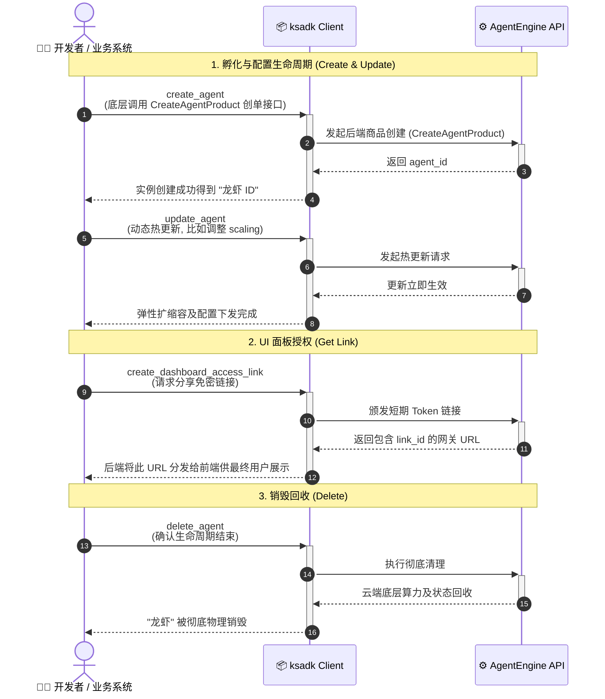

# OpenClaw 客户端环境部署与 API 接入指南

> 目标：通过 AgentEngine CLI，快速完成 OpenClaw 云端部署与安全访问开通。  
> 核心卖点：**开箱即用、极速启动、安全免配置、内置技能能力栈**。  
> 行业场景口径（养虾）：**快速养虾，想养几只就养几只**（按需部署、按需扩缩）。

## 1. 方案价值

- **开箱即用**：默认预构建 OpenClaw 镜像，免本地构建。
- **安全免配置**：默认 `trusted-proxy` 身份模式，浏览器无需携带后端长期凭证。
- **极速上线**：`agentengine openclaw deploy` 一条命令直连控制面。
- **能力预集成**：模型映射、Dashboard 短链接、状态文件自动持久化全部内建。
- **弹性养殖**：按需扩缩实例与并发，业务高峰“多养几只”，平峰“少养几只”。

## 2. 养虾场景表达

- 把一个 OpenClaw 实例理解成一只“数字虾苗”：部署后即可开工。
- 新业务上来时，直接扩容“多放几只虾苗”；淡季时再缩容回收成本。
- 安全能力（ClawSec）和搜索能力（agent-reach）相当于“虾场巡检与外部信息饲料”，部署即能接入能力链路。

## 3. 内置能力亮点

### 3.1 安全技能能力：TuanziGuardianClaw

- 默认内置安全技能：`TuanziGuardianClaw`
- 定位：作为默认安全审查技能，对高风险文件访问、外部网络请求、敏感命令执行做风险分类、确认提醒与安全建议。
- 对外可表达为：OpenClaw 支持将安全策略能力直接纳入智能体执行链路，用于风险识别、策略检查与安全运营协同。

### 3.2 搜索与外部触达能力：agent-reach

- 镜像侧已内置 `agent-reach` 相关能力入口，可用于多平台搜索与内容触达能力扩展。
- 对外可表达为：平台在部署即具备“搜索 + 渠道触达”增强能力，不需要另起一套集成工程。

### 3.3 浏览器工具内置

- 运行时已包含浏览器工具相关配置（headless/no-sandbox/executable path 等），便于开箱启用网页自动化能力。
- 对外可表达为：客户无需额外采购或安装浏览器自动化运行环境。

### 3.4 可选上下文/记忆插件位

- 运行时保留 OpenClaw 原生插件扩展位，可按需启用上下文/记忆类插件，而不是默认绑定第三方实现。
- 对外可表达为：上下文增强能力支持按场景选装，默认镜像更轻、更稳、供应链面更小。

### 3.5 默认支持定时任务

- 运行时默认支持定时任务能力（内置调度守护进程启动链路），无需客户再手动搭建额外调度组件。
- 对外可表达为：可将例行巡检、日报汇总、定时抓取等任务纳入标准化自动执行流程。

## 4. 先决条件

1. Python 3.10+ （推荐 3.12 版本）
2. 金山云账号与 AK/SK
3. OpenAI 兼容模型服务 API Key

安装 CLI：

```bash
pip install -U ksadk
agentengine --version
```

## 5. 标准部署流程

```bash
# 1) 创建 OpenClaw 项目模板
agentengine init my-openclaw -f openclaw
cd my-openclaw

# 2) 写入最小必需环境变量
cat > .env <<'ENV'
KSYUN_ACCESS_KEY=你的AK
KSYUN_SECRET_KEY=你的SK
KSYUN_REGION=cn-beijing-6

OPENAI_API_KEY=你的模型APIKey
# OPENAI_BASE_URL=https://你的openai兼容网关/v1
# OPENAI_MODEL_NAME=deepseek-v3.2
ENV

# 3) 一键部署 OpenClaw
agentengine openclaw deploy

# 4) 查询状态
agentengine openclaw status

# 5) 打开云端 UI（短链接）
agentengine dashboard --share
```

## 6. 关键行为说明

### 6.1 `openclaw deploy`

- 自动读取 `.env` 并补齐运行所需变量。
- 未显式指定镜像时，优先使用服务端下发默认镜像。
- 部署成功后写入 `.agentengine.state`，后续命令可直接复用目标实例。

### 6.2 `openclaw status`

- 建议确认 `RUNNING` 后再打开 Dashboard。
- 若非 `RUNNING`，等待后重试即可。

### 6.3 `dashboard --share`

- 默认创建短链接并打开浏览器。
- 适用于企业内部演示、测试与受控分享访问。

### 6.4 默认执行审批策略

- 默认采用 `exec.host=gateway` + `exec.security=allowlist` + `exec.ask=off`：普通白名单命令自动执行，未命中白名单的高风险命令直接拒绝，不弹确认打断用户。
- 默认 `askFallback=allowlist`：如后续显式开启审批模式，审批 UI 不可达时，白名单命令仍可自动放行。
- 默认 `autoAllowSkills=false`：不自动放行 Skill CLI，避免第三方或自定义 Skill 借助宿主机执行路径扩大敏感面。
- 镜像启动时会通过 `/opt/openclaw/safe-bin` 安全包装器为 `main` 智能体预置一组常用只读/开发命令白名单（如 `pwd`、`ls`、`whoami`、`id`、`uname`、`date`、`ps`、`df`、`du`、`stat`、`find`、`cat`、`head`、`tail`、`wc`、`git`），并对工作区边界与状态目录访问做额外检查。
- 默认 `tools.fs.workspaceOnly=false`：文件工具不再被强制锁死在工作区，便于读取技能目录、项目外挂资料和常见挂载路径；敏感目录访问仍应结合 `tools.exec` 白名单与提示词安全边界一起约束。
- 如需扩展自动审批命令，可通过环境变量 `OPENCLAW_EXEC_ALLOWLIST` 追加二进制路径模式；如需关闭默认白名单，可设 `OPENCLAW_EXEC_DEFAULT_ALLOWLIST_ENABLED=false`。
- 模型 API Key 默认不再以运行时环境变量方式提供给 Gateway 进程，而是在启动阶段转存到 `${OPENCLAW_STATE_DIR}/secrets.json` 并通过 OpenClaw `file` SecretRef 读取，以降低 `printenv` / 环境转储类泄露风险。
- 默认工作区会内置一版安全导向的 `SOUL.md` 和 `AGENTS.md`，为 prompt injection、防泄密、外发审批、Skill 安装审批等场景提供软约束。

## 7. 企业常用扩展命令

```bash
# 列出实例
agentengine openclaw list

# 指定实例查询
agentengine openclaw status ar-xxxx

# 指定镜像
agentengine openclaw deploy --image hub.kce.ksyun.com/myns/openclaw:v2

# 显式模型网关
agentengine openclaw deploy \
  --model-base-url https://api.example.com/v1 \
  --model-api-key sk-xxx \
  --default-model deepseek-v3.2

# 删除实例
agentengine openclaw delete ar-xxxx -y

# 高峰时段：多养几只（扩容）
agentengine openclaw deploy --name openclaw-gateway-peak
```

## 8. 常见问题

### Q1: 部署后模型调用失败

检查模型环境变量：

```bash
cat .env | rg 'OPENAI_API_KEY|OPENAI_BASE_URL|OPENAI_MODEL_NAME|OPENCLAW_'
```

### Q2: Dashboard 打开异常（401/403）

优先使用统一入口：

```bash
agentengine dashboard --share
```

### Q3: 私有镜像拉取失败

补齐镜像仓库凭证：

```bash
export KCR_PASSWORD=你的KCR临时密码
export KSYUN_ACCOUNT_ID=你的账号ID
agentengine openclaw deploy --image hub.kce.ksyun.com/你的命名空间/openclaw:你的tag
```

## 9. 对外一句话版本

OpenClaw 基于 AgentEngine 提供“**一键部署 + 安全免配置 + 内置安全/搜索/浏览器能力栈 + 按需弹性伸缩**”的企业级智能体上线方案。

## 10. SDK 自动化接入 (CRUD 与面板管理 API)

除了使用 `agentengine` CLI 外，您的业务系统代码还能通过 `ksadk` 的 Python Client 轻松实现 OpenClaw 实例的全生命周期管理（创建、更新、查询、删除）及前端免密 UI 面板（Dashboard）链接的颁发。

### 10.1 核心全生命周期时序

以下是典型的业务研发端，通过 SDK 孵化、使用并最终销毁一只“龙虾（OpenClaw 实例）”的交互流：



### 10.2 客户端初始化

```python
import asyncio
from ksadk.api.client import AgentEngineClient

async def init_client():
    # 自动从环境加载 KSYUN_ACCESS_KEY / KSYUN_SECRET_KEY / KSYUN_REGION
    async with AgentEngineClient() as client:
        pass # 调用 CRUD 方法
```

### 10.3 OpenClaw 实例生命周期管理 (CRUD)

> **核心提示**：无论 CLI 还是 API，创建 OpenClaw 的本质是调用 Agent 协议层，并将参数 `framework` 设为 `openclaw`。

```python
async def manage_openclaw(client: AgentEngineClient):
    # 1. 创建 OpenClaw 实例 (本质调用 CreateAgentProduct 创单接口)
    # framework 必填 openclaw，artifact_type 选填 Container
    create_req = {
        "name": "my-openclaw-api-agent",
        "description": "通过 SDK API 创建的 OpenClaw 实例",
        "framework": "openclaw", 
        "artifact_type": "Container", 
        "artifact_path": "hub.kce.ksyun.com/ksyun-ksadk/openclaw:latest",
        "resources": {"cpu": 2, "memory": "4Gi"},
        "env_vars": {
            "OPENAI_API_KEY": "sk-xxx",
            "OPENAI_BASE_URL": "https://api.openai.com/v1"
        }
    }
    create_res = await client.create_agent(create_req)
    agent_id = create_res["agent_id"]
    print(f"Created Agent ID: {agent_id}")

    # 2. 查询实例状态 (Read)
    status_res = await client.get_agent(agent_id=agent_id)
    print(f"Agent Status: {status_res['status']}")

    # 3. 更新实例配置 (Update) -> 调整并发与 CPU 等
    update_req = {
        "resources": {"cpu": 4, "memory": "8Gi"},
        "scaling": {"min_replicas": 1, "max_replicas": 5}
    }
    await client.update_agent(agent_id, update_req)

    # 4. 删除实例 (Delete)
    # await client.delete_agent(agent_id)
```

### 10.4 获取与管理 Dashboard 免密授权链接

基于 `trusted-proxy` 机制，业务系统可为当前前端终端用户实时生成专属授权链接，实现 OpenClaw 控制台页面的鉴权安全嵌入。

```python
async def manage_dashboard_links(client: AgentEngineClient, agent_id: str):
    # 1. 创建带有授权凭证的短期分享链接
    link_res = await client.create_dashboard_access_link(
        agent_id=agent_id,
        link_type="share",      # 支持 "private" / "share"
        expires_seconds=3600    # 链接有效时长 (秒)
    )
    link_id = link_res["link_id"]
    
    # 最终分发给前端用户的 URL，包含 link_id
    # 该地址进入网关后会完成 302 Cookie 种植与 x-forwarded-user 信任头注入
    ui_url = f"https://console.agentengine.ksyun.com/s/{link_id}"
    print(f"Secure UI Access Link: {ui_url}")

    # 2. 查询当前颁发的可用链接列表
    links = await client.list_dashboard_access_links(agent_id=agent_id)
    
    # 3. 后端主动撤销某特定人员的访问短链接 (安全阻断)
    await client.delete_dashboard_access_link(link_id=link_id)
```

## 11. 结语

一只龙虾看起来需要成长的空间很大，可是他已经出生了。  
给他目标，帮他拉弓，让他帮我们飞向靶心。
