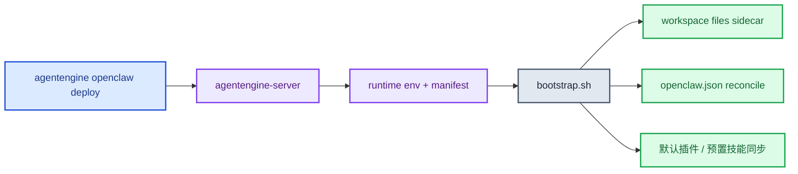
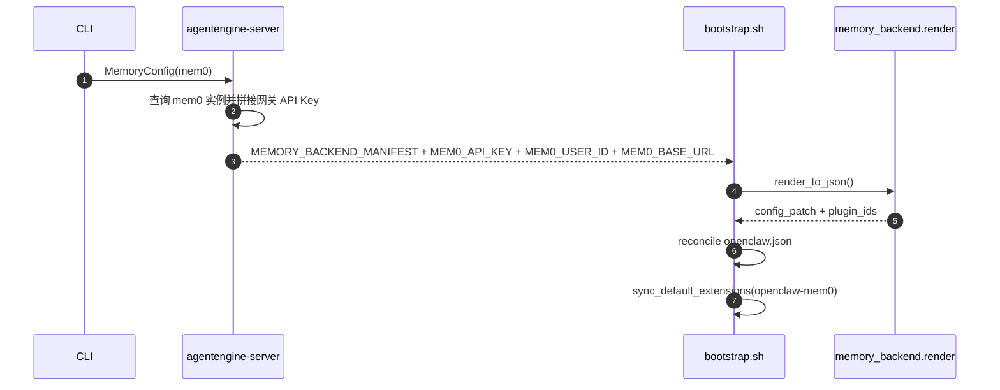

# OpenClaw一键部署指南

本文档对应当前 `agentengine openclaw` CLI 与 `deploy/openclaw/*` 运行时资产。

## 1. 一条命令部署

```bash
agentengine openclaw deploy
```

常见扩展：

```bash
agentengine openclaw deploy --name my-openclaw
agentengine openclaw deploy --image hub.kce.ksyun.com/your-ns/openclaw:v1
agentengine openclaw deploy --security-profile strict
agentengine openclaw deploy --storage-size-gi 50
```

## 2. 当前支持的关键参数

### 2.1 安全预设

- `--security-profile relaxed`
- `--security-profile strict`
- `--security-profile strictest`

兼容参数：

- `--strict-mode`
- `--strictest`

### 2.2 记忆系统

```bash
agentengine openclaw deploy --memory-system openclaw_default
agentengine openclaw deploy \
  --memory-system mem0 \
  --mem0-instance-id e52b7fac-e641-4b34-b9f7-6b0b9f190cd4 \
  --mem0-instance-name wangxu_m0_1011 \
  --mem0-region cn-beijing-6
```

约束：

- `mem0` 必须传 `--mem0-instance-id`
- `openclaw_default` 不能再传 mem0 细节参数
- 不传 `--memory-system` 时，CLI 不会强制覆盖已有 memory 配置

### 2.3 存储参数

- `--storage-size-gi`：默认 `20`
- `--storage-mount-path`：默认 `/home/node/.openclaw`
- `--no-storage`

## 3. 当前 runtime 行为



### 3.1 gateway 鉴权

当前默认值仍然是：

- `OPENCLAW_GATEWAY_AUTH_MODE=trusted-proxy`

但现在可以显式切到 token 模式：

```bash
agentengine openclaw deploy \
  --env OPENCLAW_GATEWAY_AUTH_MODE=token \
  --env OPENCLAW_GATEWAY_TOKEN=gateway-token-demo
```

兼容别名：

- `OPENCLAW_GATEWAY_PASSWORD`

行为说明：

- 托管 Dashboard/短链刷新仍走 cookie session，不要求浏览器持有 token。
- Router 会在服务端向 upstream runtime 注入 `Authorization: Bearer <OPENCLAW_GATEWAY_TOKEN>`。
- 如果直接访问实例公网入口，则客户端需要自己带 Bearer token。

### 3.2 workspace files

bootstrap 会：

- 默认导出 `OPENCLAW_WORKSPACE_FILES_ENABLED`
- 启动 `workspace_files_app.py`
- 让 gateway 内部反向代理到 `127.0.0.1:8091`

### 3.3 mem0 插件策略

当前镜像采用“镜像内置、按需同步”的方式：

- 镜像内已打包 `openclaw-mem0`
- 默认把它列入 `DEFERRED_DEFAULT_EXTENSIONS`
- 不使用 mem0 时，不会把该插件种到实例的持久化目录
- 使用 mem0 时，渲染出的 `plugin_ids` 会触发同步

## 4. mem0 链路



当前 server 注入到 runtime 的关键变量包括：

- `MEM0_API_KEY`
- `MEM0_MEMORY_ID`
- `MEM0_USER_ID`
- `MEM0_BASE_URL`
- `MEMORY_BACKEND_MANIFEST`

## 5. 渠道与诊断

常用命令：

```bash
agentengine openclaw status
agentengine openclaw gateway doctor
agentengine openclaw gateway doctor --fix
agentengine openclaw gateway logs
agentengine openclaw channel status --probe
agentengine openclaw channel connect --channel weixin
agentengine openclaw channel connect --channel feishu
agentengine openclaw channel connect --channel agentspace
```

## 6. 最小验证路径

### 6.1 默认记忆模式

```bash
agentengine openclaw deploy
agentengine openclaw status --output json
agentengine files list
```

### 6.2 mem0 模式

```bash
agentengine openclaw deploy \
  --memory-system mem0 \
  --mem0-instance-id e52b7fac-e641-4b34-b9f7-6b0b9f190cd4
```

然后检查：

- agent 状态进入 `RUNNING`
- runtime 日志中出现 memory backend render
- `openclaw-mem0` 被按需同步

## 7. 运行时目录

默认状态目录：

- 状态根：`/home/node/.openclaw`
- workspace：`/home/node/.openclaw/workspace`
- 配置文件：`/home/node/.openclaw/openclaw.json`

## 8. 相关文档

- [ksadk使用文档](./ksadk使用文档.md)
- [ksadk技术设计](./ksadk技术设计.md)
- [工作区文件技术设计](./工作区文件技术设计.md)
- [OpenClaw 用户镜像模板说明](../deploy/openclaw-user-template/README.md)
