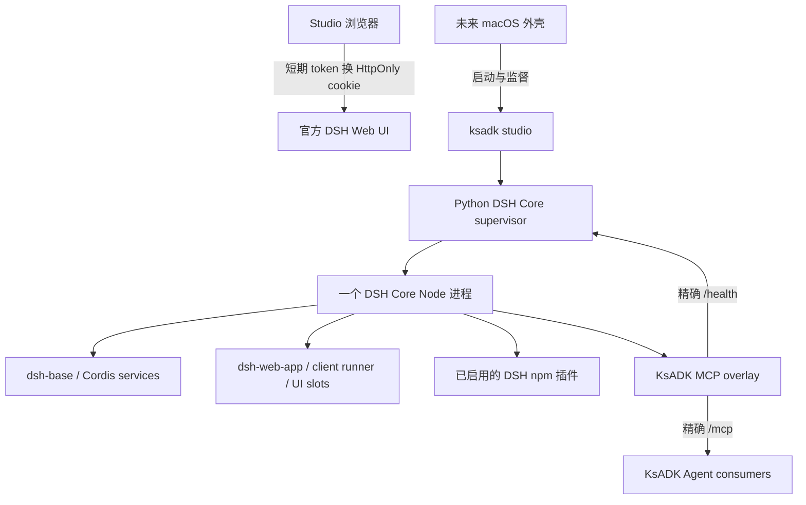

# KsADK 插件生态复用与完整 DSH Core 架构

> 状态：`@kingsoftcloud/ksadk-web 0.3.7` 已发布；`ksadk 0.8.4` 发布候选实施方案，尚未批准发布。
> 修订日期：2026-09-07。
> DSH 基线：`@deepseek-ai/dsh@0.1.2-rc.1`，Git tag `dsh-v0.1.2-rc.1`，commit `a66e4702047846cdaa10c66c9d3df3951f5ea70d`。
> 视觉基线：`kingsoftcloud/ksadk-python#66`；遇到配色、间距、圆角冲突时以该 PR 的 King Design 规则为准。

## 1. 最终决策

KsADK 内置并托管一个完整、官方的 DSH Core。它由官方 `@deepseek-ai/dsh` 根包及其依赖图组成，在独立 Node 子进程中运行 `web` profile。`dsh-base`、`dsh-web-app`、Cordis client runner、UI runtime、设置、国际化和插件 slot 均由 DSH Core 自己提供。

Studio 不再模拟 DSH 浏览器运行时，也不再维护 mini runtime、client bundle sandbox、React externals 或 UI message relay。Studio 只负责安装、配置、生命周期、鉴权入口、插件目录和 Agent 绑定。DSH 插件 UI 在官方 DSH Core 页面运行。

同一个 DSH Core 进程同时提供：

- 官方 DSH Web UI；
- 官方 Cordis 服务和插件生命周期；
- KsADK 注入的精确 `/mcp` 与 `/health` 路由；
- 同一 profile 中已启用插件的工具投影。

这里没有第二个 HTTP host，也没有第二套 Cordis 容器。KsADK 的 capability host 是 Python 侧的进程监督器和 Node 侧的薄 overlay，不是另一个应用宿主。

## 2. 目标与非目标

### 2.1 本次发布目标

1. 固定一个可复现、可校验、可回滚的完整 DSH 运行时版本。
2. 让未经修改的上游 DSH 工具插件在官方 Core 中激活，并通过 MCP 被 Agent 调用。
3. 让带 UI 的 DSH 插件使用官方 Core 的完整 client runtime，而不是由 Studio 猜测其依赖。
4. Studio 与未来 macOS 外壳复用同一个 Python supervisor 和同一个 DSH Core，不再引入新的运行时层。
5. Codex 插件继续只使用 Codex 原生工具、MCP 和 Skills；不把任意 KsADK Tool 注入 Codex。
6. Studio 和 Hosted UI 的会话体验继续由 `ksadk-web` 细粒度组件统一；DSH 插件 UI 与聊天 UI 保持清晰边界。
7. 发布候选必须绑定源码提交、npm 产物、wheel/sdist、静态资源和真实 E2E 证据。

### 2.2 本次不做

- 不复制或改写 DSH Core 的 client runtime。
- 不在 Studio 中运行第三方 DSH client bundle。
- 不承诺依赖 Electron、Wework 私有 DOM 或私有插件服务的插件天然兼容。
- 不把安装成功、路由存在或工具列表可见当成真实可用证据。
- 不在没有明确发布授权时推 tag、上传 npm/PyPI 或创建 Release。
- 不把 DSH 完整 AgentProvider 和 Studio 的共享 DSH Core 同时当作同一会话的双宿主。

## 3. 架构



### 3.1 单宿主约束

以下条件必须同时成立：

- 一个 profile generation 只能对应一个 DSH Core PID；
- Web UI、Cordis 服务和 MCP overlay 必须属于同一 PID、同一 profile；
- overlay 必须注入官方 `webServer`、`tools`、`connection` 服务；
- overlay 只能注册精确 `/mcp` 和 `/health`，不能再调用 `createServer()`；
- profile 变更以事务方式完成，generation 变化后旧 lease 立即失效；
- Studio 不能在自身 React 树中加载第三方 DSH client bundle。

### 3.2 责任边界

| 组件 | 拥有的职责 | 不拥有的职责 |
|---|---|---|
| DSH Core | Cordis 容器、Web UI、client runtime、slots、settings、locale、插件激活 | Studio 路由、KsADK Agent 编排、Python 制品发布 |
| KsADK supervisor | 固定版本安装、校验、profile 事务、进程启停、健康检查、token 交接 | 实现 Cordis client API、渲染插件 UI |
| MCP overlay | 将同一 Core 中的工具以 scoped MCP 投影给宿主 | 启动第二个 server、持久化聊天状态 |
| Studio | 插件目录、安装/启用/绑定操作、打开 Core、安全提示 | 第三方插件 UI runtime |
| `ksadk-web` | 消息、流式、思考、工具、审批、人机反馈、历史回显、滚动和 composer | DSH 插件市场与 Cordis services |
| Hosted UI | 历史 Agent 兼容 adapter、主题和产品组合 | 复制共享聊天状态机 |

## 4. 为什么采用完整 Core

真实 DSH client 插件会依赖 `runtime`、`slots`、`locale`、`ui-renderer`、`ui-settings`、`systemPrompt`、`settings`、`webServer` 等 Cordis 服务。用 mini runtime 逐个补桩会产生三个长期问题：

1. 插件每增加一个服务依赖，Studio 都要追赶上游内部语义；
2. 空实现可能让插件表面激活，实际功能或持久化语义错误；
3. fixture 能通过，却不能证明社区插件可用。

官方 Core 已经拥有这些服务和生命周期。KsADK 只扩展受控的 MCP 投影，兼容成本随 DSH 官方版本升级，而不是随每个社区插件增加。

## 5. 与 Wework 的关系

本地 Wework 实现采用 Electron 主进程监督独立 Node 子进程，并在子进程中运行完整 DSH Core profile。KsADK 复用的是这一进程所有权模式：产品外壳负责启动、停止和打开页面，完整 DSH Core 负责 Cordis 与插件生态。

两者的区别是：

- Wework 当前本地实现包含自己的 `@wegent/*` 插件图和产品服务；
- KsADK 使用官方 `web` profile，不复制 Wework UI 或产品插件；
- KsADK 在官方 `webServer` 上增加 `/mcp` 和 `/health`，供 Agent 和 supervisor 使用；
- 某插件如果依赖 Wework 私有服务或 DOM，必须在兼容矩阵中明确标注，不能以“已安装”宣称兼容。

## 6. 运行时版本与供应链

### 6.1 固定版本

运行时固定为 `@deepseek-ai/dsh@0.1.2-rc.1`。工具链 receipt 同时记录 npm package 与精确版本、Git tag 与 commit、安装根目录、完整 Core 关键包版本、bundle integrity、lockfile 与来源。

禁止使用 `latest`、浮动 semver 或仅凭本机已有 `node_modules` 推断版本。

### 6.2 必要包图

工具链验证至少覆盖：

- `@deepseek-ai/dsh`、`dsh-base`、`dsh-web-app`；
- `dsh-cordis-client-runner`、`dsh-client-ui-cordis`；
- `dsh-app-boot`、`dsh-headless`、`dsh-sdk`、`dsh-mcp`；
- 兼容的 `@deepseek-ai/cordis`。

缺失任一必要包都应在启动前失败，不能退回 mini runtime。

### 6.3 升级门禁

升级 DSH 时必须：

1. 固定新 tag、commit、npm version 和 integrity；
2. 在干净目录安装完整图；
3. 初始化新的 `web` profile；
4. 运行官方 UI、cookie handoff、MCP 同进程 E2E；
5. 运行至少一个未经修改的上游工具插件；
6. 运行至少一个真实 UI 插件的浏览器检查；
7. 验证旧 profile 升级、失败回滚和旧 lease 撤销；
8. 更新兼容矩阵和已知边界。

## 7. Profile 与生命周期

### 7.1 冷启动

1. supervisor 校验工具链 receipt 和必要包图；
2. 若 `web` profile 不存在，用官方 CLI 初始化；
3. 在 profile 事务中安装/启用插件和 KsADK overlay；
4. 启动一个 DSH Core；
5. 等待 stdout readiness envelope；
6. 校验 profile、generation、端口、路由数和浏览器 token；
7. 返回 scoped lease。

### 7.2 Profile 事务

修改 `cordis.patch.yml`、`package.json`、lockfile 或 `node_modules` 前必须保存快照。失败时恢复文件状态；如果事务前不存在 `node_modules`，失败后也必须删除新创建的目录。

只有严格干净的官方 `web` profile 可以在没有旧 lock 的情况下首次安装。任何已有状态、额外 bundle 或未知文件都不能绕过 rollback 前置条件。

### 7.3 重启与失效

- 插件安装、更新、启用、禁用和删除会创建新的 generation；
- 新 generation 启动成功后才替换旧 lease；
- 旧 generation 的 bearer、MCP session 和 browser token 不再有效；
- Core 异常退出时 supervisor 终止 lease，并返回明确的运行时错误；
- 关闭路径不能持锁等待 monitor；monitor 必须可取消，避免固定超时卡顿。

## 8. 安全模型

### 8.1 浏览器入口

DSH Core 只监听 loopback。`connection.authenticatedUrl()` 生成短期 token URL；浏览器访问后由官方 Core 将 token 换为 `HttpOnly` cookie，并重定向到无 token 的干净 URL。

Studio API 只把这个 URL 返回给当前已授权用户。插件目录、日志、异常、健康响应和持久化配置都不能包含 token。

### 8.2 MCP 入口

- MCP 只暴露在同一官方 server 的精确 `/mcp`；
- bearer 与 profile generation、插件 scope 和 lease 绑定；
- `/health` 不返回密钥或环境变量；
- 工具调用必须经过宿主授权、审批和审计；
- 不因 MCP schema 可见而默认授予调用权限。

### 8.3 第三方包

- KsADK 仓库只内置官方自有插件；
- 社区插件通过外部 npm 安装做兼容测试；
- 测试 fixture 只能放在 `tests/fixtures/`；
- 安装前展示包名、版本、来源和权限；
- 原生模块、安装脚本、网络和文件系统权限必须进入风险提示与审批。

## 9. Studio API 与 UI

Studio 保留：列出插件和 profile，安装、更新、启用、禁用、删除，获取完整 Core 的一次性浏览器入口，获取可绑定 capability，管理 Agent draft 和运行时绑定。

插件详情页的“打开插件界面”直接打开官方 Core。Studio 不再提供 client bundle 列表、sandbox iframe、React externals、UI relay session、slot registry、composition host 和顶层 `extension` 路由。

这些删除项不能以兼容别名、隐藏代码或备用分支保留。后续若官方 DSH 提供稳定嵌入协议，应作为新的显式协议评审，而不是复活 mini runtime。

## 10. 插件兼容分级

| 等级 | 验证内容 | 可宣称能力 |
|---|---|---|
| L0 包解析 | manifest、版本、来源可读 | 可识别 |
| L1 安装激活 | 官方 Core 中安装并激活，无 pending service | 可安装 |
| L2 工具 | `/mcp` 可发现并真实调用 | 工具可用 |
| L3 UI | 官方 Core 页面可见且可交互 | UI 可用 |
| L4 Agent 回合 | 权限、审批、结果和失败恢复均闭环 | Agent 可用 |
| L5 生命周期 | 刷新、重启、禁用、卸载、升级均正确 | 发布支持 |

fixture 只能证明实现路径；发布兼容声明至少需要一个外部上游包达到对应等级。

`dsh-ssh` 一类插件可能需要宿主私有 settings schema、Wework shell 或 DOM。若它的工具达到 L2，而 UI 未达到 L3，应分别记录，不能把空页面归类为完整兼容。

## 11. Codex 插件边界

Codex Provider 只接受 Codex 原生工具、MCP server 和 Skills。普通 KsADK Tool 不能直接塞进 Codex draft。创建页、持久化 draft、编译器和 bundle 校验必须保持同一规则，避免直到运行时才出现 `Codex only accepts its native tools, MCP, and Skills`。

Codex hooks 在没有可信授权和审计执行器时继续明确拒绝。DSH capability 要进入 Codex 时，应作为受管 MCP 绑定，不能删除现有边界检查。

## 12. 与共享会话 UI 的关系

DSH Core 集成不改变 `ksadk-web` 的聊天职责。`ksadk-web` 继续向 Studio 与 Hosted UI 提供细粒度组件和主题变量，包括：

- message timeline 与历史分页；
- user、assistant、reasoning、tool、interaction 事件投影；
- optimistic user message；
- 流式占位、思考流光、工具状态；
- approval 与多选、自定义反馈；
- 页面刷新回显与 pending interaction 恢复；
- 智能贴底、离底提示和滚动到最新；
- composer、model picker、approval policy picker。

Studio 只组合目标选择、会话列表、路由和主题。Hosted UI 额外保留历史 Agent adapter。两者可以覆盖主题变量和局部样式，但不能复制状态机和协议解析。

## 13. 未来 macOS 应用

macOS 应用作为 Studio 的原生外壳，不新增运行时：

1. 启动或连接 `ksadk studio`；
2. 复用 Python supervisor 启动同一个 DSH Core；
3. 用 `WKWebView` 展示 Studio，并按需打开已鉴权的 Core URL；
4. 负责窗口、菜单、通知、深链、更新和进程退出；
5. 不在 Swift 中重写 Cordis、MCP 或聊天状态机。

打包时需要把 Node/DSH 工具链作为受版本控制的 runtime asset，校验签名与完整性，并设计首次安装、升级回滚、子进程退出和用户数据目录。App Sandbox、目录写权限、网络 entitlement 和 helper 签名在实现阶段单独评审。

## 14. 验收矩阵

### 14.1 必须通过的自动化证据

1. DSH toolchain：干净安装、完整包图、receipt、版本与 integrity。
2. Profile transaction：首次初始化、更新、失败回滚、无残留 `node_modules`。
3. Core lifecycle：ready、并发 lease、generation 替换、异常退出、快速关闭。
4. Core Web：一次性 URL 返回 303、设置 `HttpOnly` cookie、无 token URL 返回官方 HTML。
5. 同进程 MCP：同 profile、同端口，list/call 成功，路由数为 2。
6. 真实上游工具插件：不修改包源码，能发现并调用。
7. Studio API：插件 CRUD、Core URL、scope 和错误映射。
8. React UI：插件页、创建页、路由、聊天组件集成。
9. Codex 边界：非法普通 Tool 在创建和编译阶段被拒绝。
10. 制品：wheel/sdist 同时包含 Hosted UI、Studio UI、Node overlay 和 contract。

### 14.2 必须完成的人工浏览器证据

- Studio 插件页能打开完整 Core；
- 至少一个真实 UI 插件在 Core 中可见且可操作；
- 安装、禁用、重启、刷新后状态一致；
- PR #66 的导航、配色、圆角、暗色模式无明显回归；
- Studio 三种会话形态的流式、工具、审批、自定义反馈和历史回显正常；
- Hosted UI 的历史 Agent 不因共享组件升级失效。

### 14.3 建议命令

```bash
uv run ruff check .
uv run pytest -q

cd ksadk/studio/react-ui
npm test
npm run test:ui -- --exclude '**/.worktrees/**'
npm run build

cd ../../..
KSADK_DSH_TOOLCHAIN_E2E=1 \
KSADK_DSH_UPSTREAM_E2E=1 \
uv run pytest -q \
  tests/e2e/test_dsh_managed_toolchain_e2e.py \
  tests/plugins/test_dsh_node_provider_e2e.py \
  tests/plugins/test_dsh_capability_host_e2e.py \
  tests/plugins/test_dsh_upstream_plugin_e2e.py

make phase2-release-preflight
make public-preflight
```

`.worktrees/` 必须从 Vitest 收集范围排除，不能把工作树副本的测试结果计入当前候选。

## 15. 发布顺序

1. 完成并提交 DSH Core 重构；
2. 拉取 GitHub `main`，确认包含 PR #66；
3. 将 `main` 合入本地 `master`；
4. 将 `master` 合入当前特性分支，视觉冲突采用 PR #66；
5. 在 `ksadk-web` 的 `feat/conversation-v1-unified-render` 上完成共享聊天候选；
6. 构建并验证 `@kingsoftcloud/ksadk-web@0.3.7` tarball；
7. 从该 tarball 同步 `ksadk/server/static`，禁止从任意工作目录随手复制；
8. 构建 Studio static；
9. 运行 Python、React、真实 DSH、浏览器和制品门禁；
10. 确认两个仓库状态干净、提交和证据一致；
11. Web 0.3.7 已正式发布；其余门禁通过并获得明确发布授权后，再发布 Python 0.8.4。

## 16. 发布停止条件

出现任一情况即停止发布：

- mini runtime、sandbox 或 client bundle relay 仍在生产路径；
- Web UI 与 MCP 来自不同 DSH PID/profile；
- DSH 版本或来源浮动；
- 真实上游插件仅安装成功但没有调用或 UI 证据；
- token 出现在日志、inventory、URL 历史或持久化配置；
- profile 失败后无法回滚；
- Hosted 历史 Agent、审批或刷新回显有阻塞回归；
- `ksadk-web` static 与声明的 npm 候选不一致；
- PR #66 未进入 Python 发布分支；
- 任一仓库有未解释的 dirty/untracked 文件；
- 没有用户对发布动作的明确授权。

## 17. 当前边界与后续迭代

### 17.1 0.8.4 / 0.3.7 前必须完成

- 完整 Core 和上游插件 E2E 全绿；
- PR #66 合并并做视觉复查；
- `ksadk-web` 聊天回归和静态产物同步；
- 干净 wheel/sdist 安装验证；
- Studio 本地、Studio 云端 Agent、远程 ksadk deploy Agent、Hosted 历史 Agent 的会话矩阵。

### 17.2 后续可增量演进

- 提供 DSH Core profile 管理与诊断页；
- 为常见社区插件维护 L0-L5 兼容矩阵；
- 增加 runtime asset 离线缓存、签名和差分升级；
- 实现 macOS 外壳，但继续复用相同 Core supervisor；
- 若官方推出稳定嵌入 API，再评估在 Studio 内嵌 Core 页面。

这些工作都建立在单个完整 Core 上，不要求再次更换插件宿主架构。
