# KsADK Prompt、Context 与 Memory 统一建设方案

> 文档定位：面向产品汇报、架构评审和研发实施的统一总方案
> 适用分支：`feature-prompt-context-optimize`
> 当前基础：基于最新 `agentkit-studio-phase1` 的 RuntimeAdapter/Studio 架构
> 建设范围：Prompt、运行时上下文、Session 连续性和长期 Memory
> 当前状态：方案讨论稿，不代表已完成实现或正式排期

## 阅读摘要

KsADK 正在从单一 Python SDK 演进为支持本地或云端构建、云端统一部署、多 Runner 执行的 Agent 平台。最新 Studio 分支已经完成一项关键基础建设：Studio、Web、Responses、AG-UI、A2A 和 Harness 开始通过统一的 `RuntimeAdapter / RuntimeRegistry / RuntimeExecutor` 执行 Codex、ADK 和 LangGraph Agent；每个 Agent 在创建时保存自己的 `RuntimeRef`，而不是由 Studio 进程使用一个全局 Runner。

但在 Prompt、Context 与 Memory 层面，当前仍处于“上层部分统一、Runner 内部各自管理”的状态：

- Instructions 可以传入多个 Runner，但最终分别成为 Codex `base_instructions`、ADK 输入或 LangGraph `SystemMessage`，缺少统一来源、版本、优先级和投影证明；
- Session、RuntimeEvent、历史准备和 Compaction 已有公共基础，但最终 History、State、Checkpoint 和上下文组装仍受各 Runner 原生机制影响；
- KsADK 已有长期 Memory Service 和 ADK Memory 适配，但不同 Runner 的召回、注入、作用域和失败语义尚未形成统一合同；
- 当前可以迁移 Agent 配置、语义历史和部分平台长期事实，不能无损迁移 Codex Thread、ADK Invocation、LangGraph Checkpoint 等原生运行状态。

本方案的选择不是重新实现所有 Runner，而是：

> KsADK 统一 Prompt、Context、Memory 的语义、版本、治理、投影和观测；Runner 保留原生 Agent Loop、Session、Checkpoint、Compaction 和最终消息结构。

结合火山 AgentKit/VeADK、Amazon Bedrock AgentCore、Microsoft Foundry Agent Service、Google Gemini Enterprise Agent Platform（原 Vertex AI Agent Engine）和 Qoder Cloud Agents 的产品形态，本方案进一步明确为“两种产品模式、两轴运行合同”：

- **KsADK Managed Agent**：平台拥有最终模型请求时，完整提供 Prompt 编译、Context 组装、Memory、Compaction 和 Skill 投影；
- **Bring Your Own Runner**：托管 LangGraph、ADK、自定义容器或接入 Codex/Claude/OpenClaw/Hermes 时，统一部署、身份、资源、事件、观测和治理合同，不强制替换其内部 Agent Loop；
- **部署位置**按 `local / ksadk_managed_cloud / external_managed` 声明；
- **Context 所有权**按 `ksadk_owned / framework_assisted / native_owned` 声明，而不是把“由 KsADK 云端托管”误写成“最终 Context 由 KsADK 拥有”。

例如 Codex 可以由 KsADK 构建、部署和托管，但只要底层仍使用 Codex SDK/CLI，其 Thread、History、Compaction、原生 Skill 和最终模型请求仍由 Codex 拥有；它是 `ksadk_managed_cloud + native_owned`，不是 KsADK Harness。

建设顺序坚持“先观测、后接管”：先建立 Context 基线、Runner Ownership 和 Conformance；再以 shadow 方式引入 Prompt 编译和 Context 计划；只在 KsADK-owned 路径启用完整组装，在 ADK/LangGraph assisted 路径通过 Adapter 协作，在 Codex/Claude native 路径只做安全投影和诚实观测。

---

## 1. 背景

### 1.1 产品背景

KsADK 的目标产品形态是：

- 开发者可以在本地使用 SDK、CLI 或 Studio 创建和调试 Agent；
- 团队可以在云端完成配置、构建、评测和治理；
- 本地或云端产生的 AgentVersion 统一部署到云端 Runtime；
- 同一平台支持 Codex、Google ADK、LangGraph、未来 Claude Agent SDK 以及自定义 Runner；
- 平台统一提供版本、部署、资源绑定、会话、观测、安全和运行治理。

一个典型 Agent 生命周期如下：

```text
本地或云端定义 Agent
        ↓
配置 Prompt、模型、Tool、MCP 和 Skill
        ↓
生成可审计 Agent Revision / AgentVersion
        ↓
构建不可变 Artifact
        ↓
部署到指定 Runtime
        ↓
产生 Session、Run、Trace、Checkpoint 和 Memory
        ↓
升级版本、恢复任务或迁移 Runner
```

Prompt、Context 与 Memory 贯穿整个生命周期。如果它们完全依附于某一个 Runner，本地与云端、不同 Runner、不同版本之间就很难维持稳定行为。

### 1.2 为什么现在需要建设

最新 Studio 已经将执行入口收敛到 `RuntimeAdapter`，并支持一个 Workspace 中同时创建 Codex、ADK 和 LangGraph Agent。这意味着多 Runner 已经从远期设想变成当前产品能力，Prompt、Context 和 Memory 的差异也会直接暴露给用户。

如果继续由每个 Runner 或入口独立拼接，问题会逐步放大：

1. 同一个 Agent 的安全规则、角色说明和项目要求在不同 Runner 中可能处于不同层级；
2. 平台无法说明一段 Prompt 来自哪里、何时生效、是否被覆盖；
3. Prompt、History、Memory、Tool Result、Skill 和附件共同竞争窗口，但没有完整请求级预算；
4. KsADK 与 Native Runtime 可能重复注入历史或重复压缩；
5. 长会话摘要可能保留“发生过什么”，却没有稳定保留“当前做到哪里”；
6. Runner 本地 Memory 无法自然成为跨 Session、跨 Runner 和多租户的平台事实；
7. Native Runtime 最终上下文不可见时，平台容易把估算值误报为精确值；
8. 本地构建正常的 Agent，部署到云端或切换 Runner 后可能静默丢失能力。

### 1.3 用户可感知的问题

这些架构问题最终表现为具体体验：

- Agent 在长任务中突然忘记目标或重复已经完成的工作；
- 用户纠正过的错误在 Compaction 后再次出现；
- 一段大日志挤满窗口，导致当前要求或工具关系丢失；
- 本地运行遵守的规则，部署到另一个 Runner 后不再生效；
- Memory 没有召回、召回过期内容，或者把临时计划带入新会话；
- 用户切换 Agent 或 Runner 后无法继续原来的原生会话；
- 平台只能看到最终回答，无法判断问题来自 Prompt、History、Memory 还是 Tool；
- Token 和延迟增加，但无法解释具体由哪类上下文造成。

### 1.4 建设必要性

如果 KsADK 只封装一个固定 Runner，完全复用其原生 Prompt、Session 和 Memory 是可行的。但 KsADK 的产品目标是多 Runner、本地构建、云端统一部署和平台治理，因此需要建立一层跨 Runner 的公共语义。

这层公共语义不是新的 Agent Runtime，而是不同 Runtime 之间的合同：

```text
统一 Agent 定义和 Prompt 版本
统一外部 Context 的来源与预算意图
统一平台 Session 事实和 Working State
统一长期 Memory 的作用域和生命周期
统一 Runner 能力、所有权和投影结果
统一本地与云端的版本、错误和观测口径
```

---

## 2. 目的、口径和当前现状

### 2.1 建设目的

总体目标是建立一套适用于本地构建、云端构建和云端部署的 Prompt、Context 与 Memory 基础能力，使 Agent 在不同环境和 Runner 下具备可预测、可解释、可恢复和可演进的行为。

对开发者：

- Prompt 配置一次后，可以稳定用于本地和云端；
- 切换 Runner 时能明确知道哪些语义可迁移、哪些原生状态不可迁移；
- 长时间任务不容易因为窗口压缩而失去当前目标；
- 能够判断 Memory 是否生效以及为何未进入本轮；
- 出现异常时能区分 Prompt、Context、Memory、Tool 和 Runner 问题。

对平台：

- 管理 Prompt 版本、安全边界和发布生效关系；
- 观察上下文成本、超限、压缩和恢复；
- 说明每个 Runner 的能力、所有权和数据精度；
- 对长期 Memory 提供多租户作用域、删除、冲突和审计；
- 对新策略进行 shadow、回放、灰度和独立回退。

### 2.2 统一术语和口径

| 概念 | 统一口径 | 生命周期 | 不应混同为 |
|---|---|---|---|
| Prompt | Agent 应长期遵守的稳定规则和资源说明 | AgentVersion 级 | 全部模型输入 |
| Context | 本次模型调用实际需要的工作集 | Turn/Request 级 | 完整 Session |
| Session Transcript | 用户、Agent、Tool、Approval 等追加式事实记录 | Session 级 | 长期 Memory |
| Working State | 当前目标、阶段、下一步、错误修正和 pending state | Session/Checkpoint 级 | 跨 Session 偏好 |
| Memory | 未来会话仍有价值的精选事实和持续状态 | 跨 Session | 完整聊天归档 |
| Skill | 有版本和执行边界的程序性知识 | Agent/SkillVersion 级 | Memory |
| Checkpoint | 某一恢复边界的摘要、工作状态和原生引用 | Session/Run 级 | 原始 Transcript |
| Runner | 执行 Agent 的框架或原生 Runtime | Build/Deployment 级 | Agent 本身 |

### 2.3 观测口径

平台必须区分三类事实：

```text
planned    KsADK 计划选择和投影的内容
projected  KsADK 实际交给 Runner 的内容
actual     Runner 或 Provider 报告的实际使用内容
```

每项数据同时标明证据精度：

| 精度 | 含义 |
|---|---|
| exact | KsADK 拥有最终请求并能精确计算 |
| runtime_reported | Runner/Provider 直接上报 |
| estimated | 平台根据 tokenizer 或启发式估算 |
| opaque | Runtime 没有暴露足够信息 |

`ContextPlan` 在 native/assisted 模式下只代表平台计划或投影，不能默认宣称等于模型实际所见。

### 2.4 迁移口径

迁移分为两类：

| 类型 | 定义 | 当前方向 |
|---|---|---|
| 语义迁移 | 将 Prompt、历史摘要、Working State、平台 Memory 和资源绑定重新投影给新 Runner | 应建设和保证 |
| 原生状态迁移 | 将 Codex Thread、ADK Invocation、LangGraph Checkpoint 等内部状态原样转换 | 不承诺 |

切换 Runner 时，应明确展示可迁移和不可迁移内容，基于公共语义创建新 Session，而不是伪装成无损的原生恢复。

### 2.5 当前统一 Runtime 基础

最新分支已经具备：

- `RuntimeAdapter`：统一 start、stream、cancel、resume、checkpoint、close；
- `RuntimeRegistry`：注册 Codex、ADK、LangGraph 等 Runtime Factory；
- `RuntimeExecutor`：统一生命周期和 Run Handle 所有权；
- `RuntimeEvent`：作为 Responses、AG-UI、A2A、Studio 和 OTLP 的事件基础；
- `RuntimeLaunchContext`：承载 Runtime 类型、项目路径、探测结果和运行服务；
- Studio 每个 Agent 保存 `RuntimeRef`，构建和运行根据 Agent 自身 Runner 执行；
- Runtime Catalog 展示安装状态、版本和真实能力；
- Codex 使用 `CodexRuntimeAdapter`，ADK/LangGraph 通过框架 Adapter 接入。

Studio 新建页面默认选中 Codex，但用户可以选择 ADK 或 LangGraph；导入读取文件声明的 Runtime；项目识别使用 `FrameworkDetector`；已有 Agent 不能通过普通编辑直接切换 Runtime，需要迁移 Revision 或新 Agent。

### 2.6 当前 Prompt 现状

已有基础：

- Agent Draft/Revision 能保存 Instructions；
- 公共 conversation pipeline 能将调用级 `instructions` 传向 Runner；
- Codex 支持 `base_instructions`；
- ADK、LangGraph 已有各自指令注入路径；
- Compaction Prompt 已独立为固定 builder；
- Skill manifest 已支持描述索引和按需执行方向。

主要缺口：

- 缺少 Prompt 来源、优先级、覆盖和不可覆盖规则；
- 缺少 `PromptSection/CompiledPrompt`；
- 缺少 PromptVersion/hash 与 AgentVersion/Build/Deployment 的完整关联；
- 同一 Instructions 在不同 Runner 中的权限层级可能不同；
- 缺少稳定前缀、动态后缀和 cache-break 诊断；
- 无法证明各 Runner 获得了等价的关键语义。

特别说明：当前 Runtime 没有统一的 agent-level `platform_safety` 正文来源。现有 shadow 只编译真实存在的 request instructions，不能把规划中的 Prompt Section 当成已上线内容；正式平台规则应来自版本化、可回滚的控制面 Policy Bundle（本地使用显式版本化文件），而 approval、sandbox、secret redaction 等硬安全仍由代码与策略引擎强制执行。

### 2.7 当前 Context 与 Session 现状

已有基础：

- Session Transcript 是追加式事件流；
- 历史按 API round 和协议关系组织；
- 支持 Attachment、Tool、Approval、Resume 和 Checkpoint；
- 已有自动 Compaction、Prompt-too-long 恢复和分层压缩；
- 公共 conversation execution 负责准备输入、持久化 RuntimeEvent 和投影 Run 状态；
- RuntimeEvent 已增加 Context Compaction started/completed 事件；
- LangGraph、ADK、Codex 能诚实表达部分原生 Checkpoint/Resume 差异。

主要缺口：

- 当前预算仍主要围绕历史，缺少完整请求级 ContextPlan；
- Prompt、Memory、Tool Schema、Skill 和输出预留没有统一总预算；
- 单个大型 Tool Result 仍可能提前挤满窗口；
- Working State 尚未形成稳定的强类型恢复合同；
- Runner ownership 仍不完整，部分判断依赖 Runner 类型或类名；
- planned/projected/actual 尚未贯穿所有 Trace；
- Native Runtime 的内部 Context 和 Compaction 不可见时缺少统一展示规范。

### 2.8 当前 Memory 现状

已有基础：

- `LongTermMemoryService` 支持 local/http/sdk backend；
- 已有检索、保存和格式化 Context；
- ADK 可以将长期 Memory 适配为 `memory_service`；
- 非 ADK 的部分路径可以生成 `memory_context`；
- Studio 已具备 Agent、Session、资源和 Trace 的本地持久化基础。

主要缺口：

- 不同 Runner 的 Memory 投影方式不同；
- Codex 新 Adapter 路径尚未形成完整平台 Memory Projection；
- scope、版本、冲突、过期和删除语义不统一；
- 保存粒度偏向原始消息，缺少候选、去重、敏感信息和冲突判断；
- Working State 和长期 Memory 边界尚未完全固化；
- Runner 原生 Memory 不会自动成为平台事实源；
- Provider 故障、空结果和权限错误需要统一结构化语义。

### 2.9 当前迁移能力结论

| 内容 | 当前能力 |
|---|---|
| Agent 名称、说明、模型和普通 Instructions | 可迁移 |
| Prompt 来源、优先级和版本 | 尚不能完整保证 |
| 用户/Assistant 语义历史 | 可回放，但不等于原生恢复 |
| Tool/Approval 历史 | 部分可迁移，需保护协议配对 |
| Working State | 尚未标准化为跨 Runner 合同 |
| 平台长期 Memory | 在同一 Provider/scope 下部分可共享 |
| Codex thread_id | 仅 Codex 可用 |
| ADK invocation/checkpoint | 仅 ADK 可用 |
| LangGraph checkpoint/state | 仅原 Graph/Checkpointer 可用 |
| Runner 内部 Memory、缓存和运行中 Tool 状态 | 通常不可迁移 |

### 2.10 非目标

本期不做：

- 重写各 Runner 的 Agent Loop；
- 强制所有 Runner 使用相同 messages 或同一 Compaction 算法；
- 无损转换不同 Runner 的原生 Thread/Checkpoint；
- 完整 Skill 管理面、Skill 自进化和 Skill 漂移评测；
- Knowledge/RAG 全量重构；
- 图记忆；
- 通用 Completion Cache；
- 在 SDK 内建设完整的云端 Memory 管理后台；
- 将普通模型输出和完整聊天自动写入长期记忆。

---

## 3. 行业调研和对齐

### 3.1 调研方法

外部项目用于验证架构取舍，不作为逐项复制的功能清单。实施证据顺序为：

1. KsADK 当前代码、测试和真实部署协议；
2. 目标 Runtime 的官方 SDK、公开文档和实际 capability report；
3. 可运行的开源实现及其测试；
4. 第三方源码分析、文章和架构图。

第三方 Claude Code 分析只用于理解通用工程模式，不复制内部 Prompt、Feature Flag、私有接口或疑似还原代码，也不将其结论表述为 Anthropic 官方合同。

### 3.2 主要参考与对齐结论

| 参考 | 借鉴的思想 | 解决 KsADK 的问题 | 明确不照搬 |
|---|---|---|---|
| KsADK 当前实现 | append-only SessionEvent、API round、Checkpoint、分层 Compaction、PTL retry | 保留现有审计、恢复、Tool/Approval 配对和多 Runner 基础 | 不另建一套平行 Session 系统 |
| 最新 AgentKit Studio | RuntimeAdapter、RuntimeRegistry、RuntimeExecutor、RuntimeEvent、每 Agent RuntimeRef | 为 Prompt/Context 投影和 Runner Conformance 提供统一执行边界 | 不把 Studio 产品状态放进核心 Context Engine |
| OpenClaw | 稳定 Prompt 与动态 Context 分离、Skill 渐进披露、核心记忆与按需检索、压缩前整理 | 降低常驻 Token，避免重要事实随历史压缩消失 | 不把本地 `MEMORY.md` 当云端事实源 |
| Hermes | Working Context、Session、Memory、Skill 分层；主动与紧急压缩；可替换 Context Engine | 解决概念混用、临近窗口才压缩和 Runner 各自拼接 | 不采用固定 Token 常数，不在本期实现 Skill 自进化 |
| Letta/MemGPT | 有名称、描述、大小限制和写权限的 Core Memory Block | 给少量常驻记忆建立显式预算和权限 | 不让所有 Memory Block 无限常驻 Prompt |
| OpenHands | 先暴露 Skill 描述，需要时加载正文 | 验证 Skill manifest + on-demand 路径 | 不引入其完整 Agent 运行模型 |
| LangGraph | Thread scoped short-term state、namespace scoped long-term Store、可插拔 Store | 明确 Session 与长期 Memory 作用域 | 不要求用户必须采用 LangGraph，不魔改已编译 Graph |
| Mem0 | Memory 提取、去重、冲突和 add/update/delete | 避免整段聊天或模型猜测直接进入长期记忆 | 首期不引入完整服务和图记忆 |
| RULER 类方法 | 按长度、位置、干扰、多跳和聚合测试 | 验证长 Context 不只是“能塞进去” | 不以通用模型榜单代替业务验收 |
| Claude Code 第三方分析 | Prompt section、缓存边界、分层压缩、Working Notes、压缩后重注入 | 补齐稳定 Prompt、缓存诊断和长任务连续性思路 | 不复制未公开实现和 Prompt 原文 |
| claw-code | Prompt Builder、Tool Pair 边界、cache-break 统计、Parity Test | 强化输入约束和 Runner Conformance | 不采用其 completion cache 或实验性实现 |
| 火山 AgentKit + VeADK | 开源开发框架与全托管 Runtime 分层；平台统一身份、工具、记忆、知识、监控和评测；对 VeADK 深度集成、对其他框架兼容托管 | 验证 KsADK SDK/Runner 与云端 Agent Runtime 分层，以及“平台统一、框架分级接管” | 不把 VeADK 的 Agent/Runner 内核当成所有 Runner 的统一实现 |
| Amazon Bedrock AgentCore | Harness 深度接管 model/system prompt/tools/memory/agent loop；Runtime 托管任意框架、模型和 MCP/A2A；其他能力以 Memory、Identity、Gateway、Evaluation、Optimization 等服务组合 | 验证 Managed Agent 与 BYO Runtime 可以共用平台服务但采用不同 Context ownership | 不把 Runtime 托管误写为平台拥有第三方框架最终 Context |
| Microsoft Foundry Agent Service | Prompt Agent、Hosted Agent、外部 Agent 三档产品入口；Hosted Agent 支持多种框架和自定义代码 | 直接验证“两种产品模式、分级接管深度”的产品表达 | 不承诺不同框架原生 Session/Checkpoint 无损迁移 |
| Google Gemini Enterprise Agent Platform | 全托管 Agent Runtime、Sessions、Memory Bank、Evaluation、Sandbox；支持对象、源码、Dockerfile、镜像和 Git 部署 | 验证本地/源码/容器多构建方式可以汇聚到统一云 Runtime，同时平台 Session/Memory 服务与 Agent 内部 Context 仍需区分 | 不继续把旧版框架支持等级表当作当前稳定合同 |
| Qoder Cloud Agents | 自有 Agent Runtime、隔离 Sandbox、持久 Session、长任务恢复和 SSE 观测的一体化托管 | 验证只有平台控制完整 Runtime 时，才适合深度统一 Prompt、Context、Memory 和 Tool Loop | 不把 Qoder 的单一自有 Runtime 模式套到全部第三方 Runner |

### 3.3 国内外托管 Agent 产品形态对比

调研产品可以归为三类。差别不在于是否使用了“统一平台”这个词，而在于平台是否真正拥有最终模型请求和 Agent Loop。

| 产品/组合 | 开发与构建侧 | 云端运行侧 | 多框架方式 | Prompt/Context/Memory 所有权 | 对 KsADK 的直接启示 |
|---|---|---|---|---|---|
| 火山 VeADK + AgentKit | VeADK 提供 Agent、Runner 和本地开发；AgentKit CLI/SDK 负责构建部署 | 全托管 Runtime、身份、沙箱、知识、记忆、监控、评测 | VeADK 深度集成，其他 Python 框架兼容托管 | VeADK 路径可深度协同；其他框架保留内部语义 | 最接近 KsADK + agentengine-server 的目标形态 |
| Amazon Bedrock AgentCore | Harness 直接声明 model/system prompt/tools；Runtime 支持 CrewAI、LangGraph、LlamaIndex、Google ADK、OpenAI Agents SDK、Strands 和自定义框架 | Harness 深度托管；Runtime、Memory、Identity、Gateway、Policy、Observability、Evaluation、Optimization 模块化组合 | Harness 由平台拥有 Agent Loop；BYO Runtime 的框架仍拥有内部 Context | 与 KsADK Managed Agent + BYO Runner 双模式高度相似 |
| Microsoft Foundry Agent Service | Prompt Agent 低代码；Hosted Agent 支持框架代码；外部进程可只调用平台 API | Managed endpoint、扩缩容、身份和观测 | 按平台接管程度分档 | Prompt Agent 平台拥有较多；Hosted/外部 Agent 保留更多内部控制 | 产品上明确区分 Managed 与 BYO Runner，避免能力承诺含混 |
| Google Gemini Enterprise Agent Platform | Agent 对象、源码、Dockerfile、容器镜像或 Git 仓库部署；提供 ADK、LangChain、LangGraph、LlamaIndex、AG2 和自定义 Agent 使用入口 | 全托管 Runtime、Session、Memory Bank、Evaluation、Observability、Sandbox 和身份 | 当前公开文档以多种交付形态和平台服务为主，不再用旧版三档框架表作为主合同 | 与 KsADK 双构建、统一云部署和 Provider 化 Context 服务高度相似 |
| Qoder Cloud Agents | API 定义 Agent 和 Session | Qoder 自有 Runtime、Sandbox、持久 Session、SSE | 不是以任意 Runner 迁移为主要卖点 | Qoder 控制完整 Agent Loop，因此可以整体优化上下文与工具 | 适合作为 KsADK Managed Agent 的参考，不适合作为第三方 Runner 的强制合同 |

由此得到一个关键判断：

> 市场上成熟产品普遍统一部署、身份、资源、Session 边界、可观测和治理；只有在平台拥有自有 Agent Runtime 时，才会完整接管 Prompt、Context、Memory、Compaction 和 Tool Loop。

### 3.4 官方页面证据截图

以下截图采集于 2026-08-06，来自公开官方产品页或官方源码页。红框为本方案人工标注的证据区域，不改变原页面内容。截图用于架构评审时快速说明产品定位，具体能力仍以对应官方文档为准。

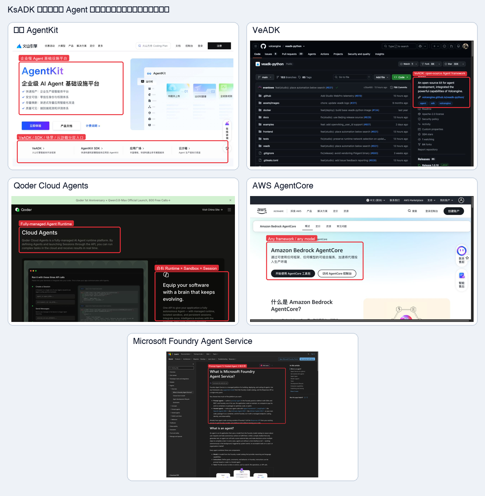

#### 3.4.1 火山 AgentKit：平台层与 VeADK/SDK/云沙箱分层

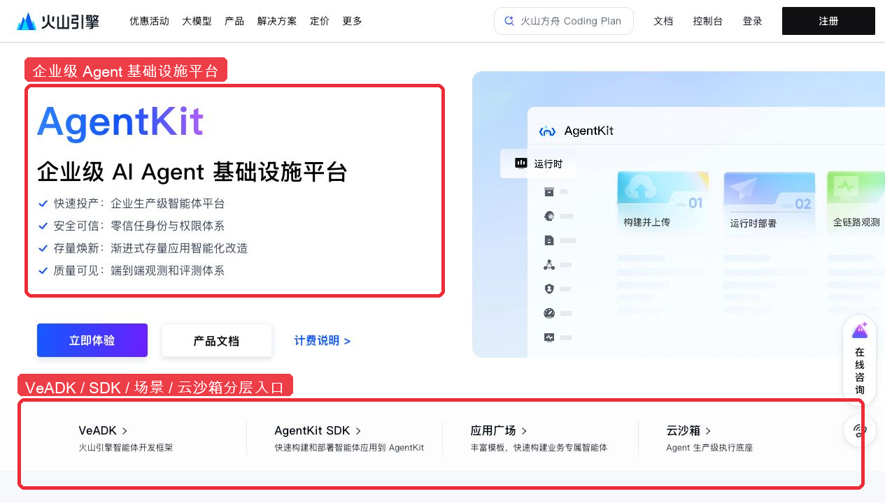

图中同时出现“企业级 AI Agent 基础设施平台”以及 VeADK、AgentKit SDK、应用广场、云沙箱入口，说明其产品不是单一 Runner，而是开发框架、平台 SDK、托管 Runtime 和基础设施的组合。官方 Runtime 文档进一步说明：平台深度集成 VeADK，同时兼容主流 Python Agent 框架。来源：[火山 AgentKit 产品页](https://www.volcengine.com/product/agentkit)、[AgentKit Runtime 文档](https://volcengine.github.io/agentkit-sdk-python/en/content/4.runtime/1.runtime_quickstart.html)。

#### 3.4.2 VeADK：开发 SDK/Framework，而不是云端托管平台本身

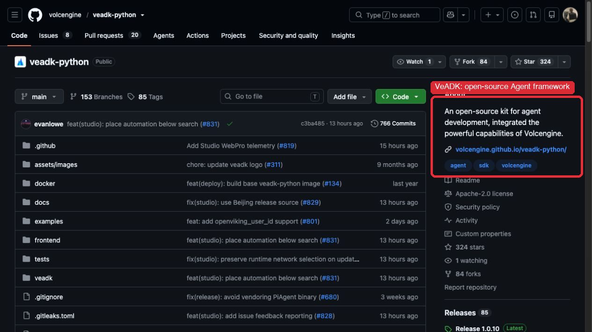

VeADK 官方仓库将自身定义为集成火山能力的开源 Agent 开发套件。它承担 Agent、Runner、本地执行和调试等开发侧职责；AgentKit 承担云端 Runtime 和治理。这个分层与 KsADK SDK/RuntimeAdapter 和 agentengine-server 控制面的边界高度相似。来源：[volcengine/veadk-python](https://github.com/volcengine/veadk-python)。

#### 3.4.3 Qoder Cloud Agents：自有 Runtime 的一体化托管

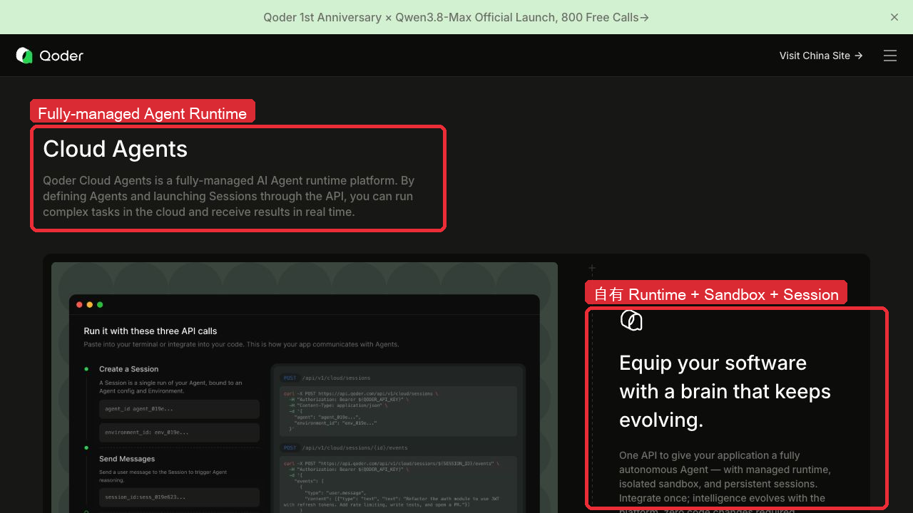

Qoder 强调的是 fully-managed Agent Runtime、隔离 Sandbox 和持久 Session。应用通过 Agent/Session API 使用 Qoder 自有执行语义，所以平台可以整体优化模型、工具、编排和上下文；这不等同于让用户把任意 LangGraph、ADK、Codex 或 Claude Runner 无损迁移进去。来源：[Qoder Cloud Agents](https://qoder.com/en/cloud-agents)、[Qoder Cloud Agent SDK](https://docs.qoder.com/cli/sdk/cloud-agent)。

#### 3.4.4 AWS AgentCore：框架无关的可组合基础设施

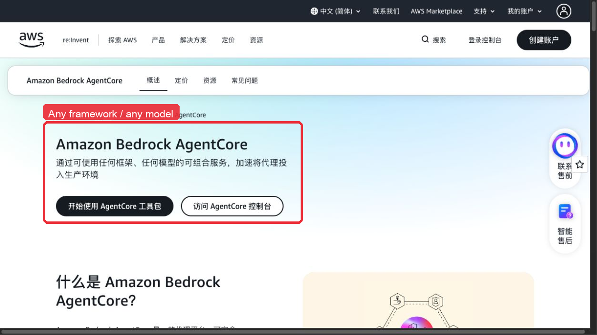

AgentCore 直接强调 any framework / any model，并把 Runtime、Memory、Identity、Gateway、Policy 和 Observability 作为可组合服务。这说明平台可以统一 Memory Provider、安全、运行和观测，但不会因此自动拥有每个框架最终送给模型的 Context。来源：[Amazon Bedrock AgentCore](https://aws.amazon.com/bedrock/agentcore/)。

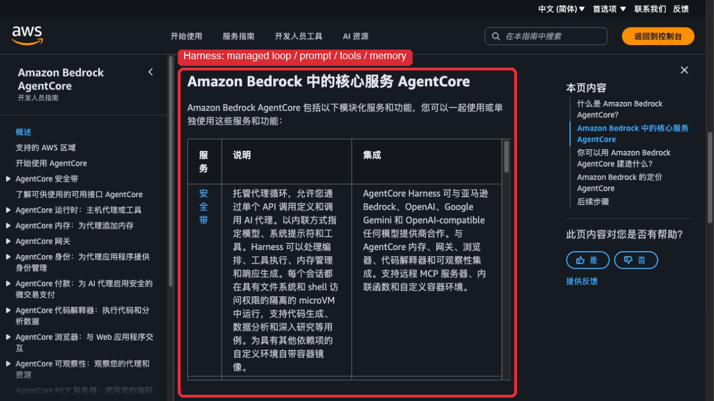

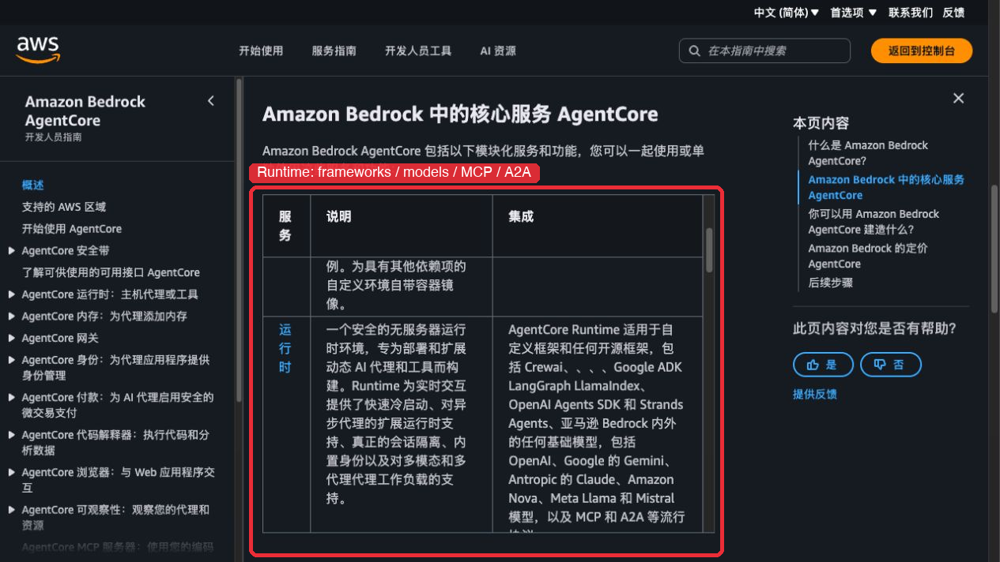

官方服务表进一步给出了两条不同路径：Harness 是托管 Agent Loop，直接处理 model、system prompt、tools、orchestration、memory 和 response；Runtime 则托管 CrewAI、LangGraph、LlamaIndex、Google ADK、OpenAI Agents SDK、Strands、自定义框架和 MCP/A2A。两者共用 AgentCore 平台服务，但 Context ownership 不相同。来源：[AgentCore Developer Guide](https://docs.aws.amazon.com/bedrock-agentcore/latest/devguide/)。

#### 3.4.5 Microsoft Foundry：Prompt Agent 与 Hosted Agent 分级托管

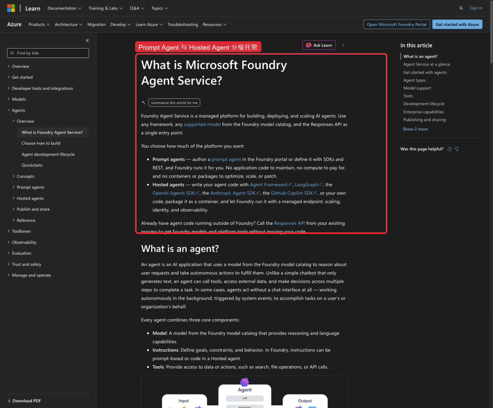

Foundry 将 Prompt Agent 与 Hosted Agent 明确分开：前者由平台直接运行，后者允许使用 Agent Framework、LangGraph、OpenAI Agents SDK、Anthropic Agent SDK 或自定义代码，平台主要提供托管端点、扩缩容、身份和可观测。这是 KsADK “Managed Agent + Bring Your Own Runner” 产品划分最直接的行业参照。来源：[Microsoft Foundry Agent Service](https://learn.microsoft.com/en-us/azure/foundry/agents/overview)。

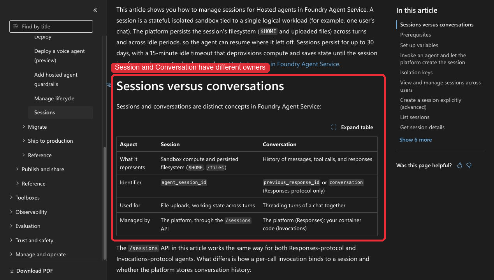

Foundry 还明确区分 Hosted Session 与 Conversation：Session 表示隔离 Sandbox 计算和持久文件系统；Conversation 表示消息、Tool Call 和 Response 历史。Responses 协议可由平台管理 Conversation，而 Invocations 协议由用户容器管理。这验证了“平台托管 Session”不能直接推导为“平台拥有所有 Runner 的 Context”。来源：[Manage hosted agent sessions](https://learn.microsoft.com/en-us/azure/foundry/agents/how-to/manage-hosted-sessions)。

#### 3.4.6 Google Agent Platform：多交付方式汇聚统一云 Runtime

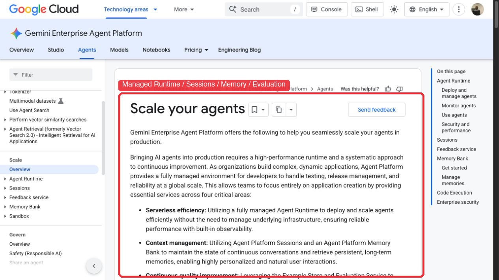

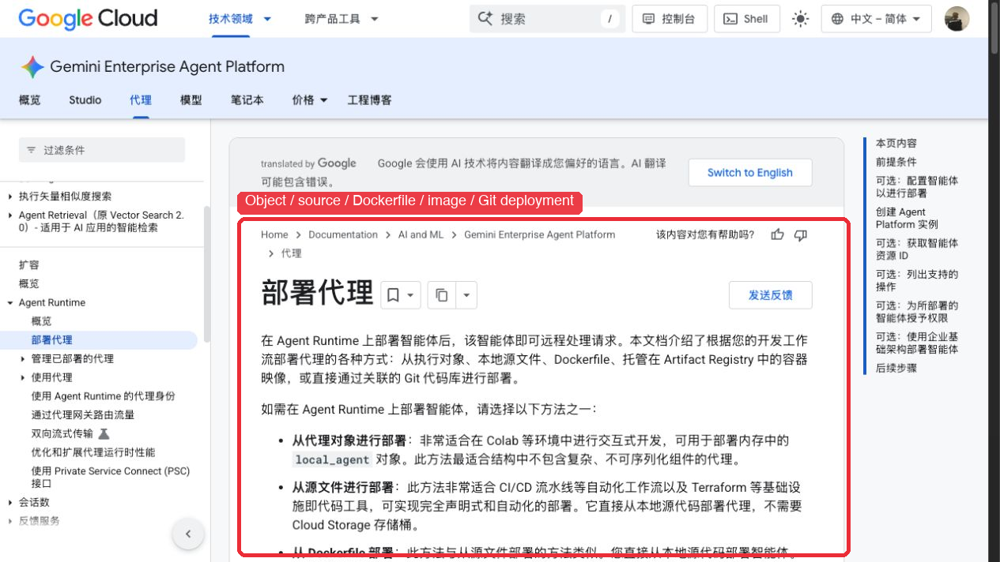

Google 当前官方产品口径已经迁移到 Gemini Enterprise Agent Platform：平台提供全托管 Agent Runtime、Sessions、Memory Bank、Evaluation、Observability 和 Sandbox，并支持从 Agent 对象、本地源码、Dockerfile、Artifact Registry 镜像或关联 Git 仓库部署。旧版 Vertex AI Agent Engine 的框架分级表可以作为历史设计参考，但不再作为本文对当前产品能力的唯一证据。来源：[Scale your agents](https://docs.cloud.google.com/gemini-enterprise-agent-platform/scale)、[Deploy agents](https://docs.cloud.google.com/gemini-enterprise-agent-platform/scale/runtime/deploy-an-agent)。

### 3.5 行业共识

调研结果可以收敛为六项共识：

1. Prompt 应与动态 Context 分离，并具有稳定构建边界；
2. 长上下文需要预算、检索和 Compaction，不能依赖无限窗口；
3. 完整 Session、当前 Working State 和长期 Memory 是不同生命周期；
4. Skill 是程序性知识，应按需加载，不应混入 Memory；
5. Memory 写入需要筛选、冲突和安全治理，不应直接保存全部模型输出；
6. 不同 Runtime 的原生 Session 和压缩能力差异真实存在，平台应统一合同而不是强行抹平。

### 3.6 KsADK 的差异化选择

KsADK 与单机个人 Agent 的关键差异在于：

- 需要同时支持本地和云端；
- 需要多租户、权限、删除和审计；
- 需要同一 AgentVersion 部署到明确的 Runtime；
- 需要多 Runner 能力声明和升级门禁；
- 需要协议入口和 Studio 共用 RuntimeEvent；
- 需要区分平台计划、Runner 投影和 Runtime 实际报告。

因此不能直接采用以本地 Markdown、单用户目录或单一 Runtime 为中心的实现。应借鉴其分层和渐进披露思想，再通过 Provider、Adapter、版本和治理合同适配平台场景。

更具体地说，KsADK 的差异化不是“比所有 Runner 更懂它们的内部上下文”，而是同时提供：

1. 面向平台原生 Agent 的完整 Prompt/Context/Memory 地基；
2. 面向第三方 Runner 的统一部署与治理合同；
3. 同一 Studio 中清晰可见的 capability、ownership 和迁移边界；
4. 从本地构建到云端部署可追踪的 AgentVersion、Prompt hash 和资源版本；
5. 对 planned、projected、actual 和 opaque 的诚实观测。

### 3.7 主要参考资料

- [OpenClaw Memory](https://docs.openclaw.ai/concepts/memory) 与 [OpenClaw Skills](https://docs.openclaw.ai/tools/skills)
- [Hermes Agent](https://github.com/NousResearch/hermes-agent)
- [Letta Context Hierarchy](https://docs.letta.com/guides/core-concepts/memory/context-hierarchy) 与 [Memory Blocks](https://docs.letta.com/guides/core-concepts/memory/memory-blocks)
- [OpenHands AgentSkills](https://docs.openhands.dev/sdk/guides/skill)
- [LangGraph Memory](https://docs.langchain.com/oss/python/concepts/memory)
- [Mem0](https://github.com/mem0ai/mem0)
- [NVIDIA RULER](https://github.com/NVIDIA/RULER)
- [liuup/claude-code-analysis](https://github.com/liuup/claude-code-analysis)
- [ultraworkers/claw-code](https://github.com/ultraworkers/claw-code)
- [火山 AgentKit](https://www.volcengine.com/docs/86681?lang=zh)、[AgentKit Runtime](https://volcengine.github.io/agentkit-sdk-python/en/content/4.runtime/1.runtime_quickstart.html) 与 [VeADK](https://github.com/volcengine/veadk-python)
- [Amazon Bedrock AgentCore](https://aws.amazon.com/bedrock/agentcore/)
- [Microsoft Foundry Agent Service](https://learn.microsoft.com/en-us/azure/foundry/agents/overview)
- [Google Gemini Enterprise Agent Platform](https://docs.cloud.google.com/gemini-enterprise-agent-platform/scale)
- [Qoder Cloud Agents](https://qoder.com/en/cloud-agents) 与 [Cloud Agent SDK](https://docs.qoder.com/cli/sdk/cloud-agent)

---

## 4. 方案选择和流程架构

### 4.1 方案选项

#### 方案 A：完全依赖每个 Runner

优点：实现快，能充分利用原生能力。

问题：

- Prompt、Memory 和错误语义分裂；
- 本地和云端难以统一治理；
- 跨 Runner 只能重复建设；
- 平台无法提供统一版本、观测和评测。

不适合作为 KsADK 的长期方案。

#### 方案 B：KsADK 完全接管所有 Runner 上下文

优点：理论上具有统一输入模型。

问题：

- 会破坏 Codex、Claude 等 Native Runtime 的 Thread、Agent Loop 和 Compaction；
- 容易出现重复历史和双重压缩；
- 已编译 LangGraph 和框架原生 Store 难以安全改写；
- 最终形成最低能力公分母。

风险过高，不采用。

#### 方案 C：统一语义合同，按 ownership 分层执行

KsADK 统一 Prompt、Context、Memory 的语义、版本、策略、投影和观测；具体执行根据 Runner 能力分为 hosted、assisted 和 native。

这是推荐方案。

调研之后，方案 C 不再只作为内部技术抽象，而是明确对应两种产品体验：

| 产品模式 | 用户获得什么 | KsADK 接管范围 | 典型 Runner |
|---|---|---|---|
| KsADK Managed Agent | 配置即运行、平台持续优化、本地/云端一致、完整 Trace 和 Memory | 根据 Context ownership 决定；只有 `ksadk_owned` 才接管最终 Prompt、Context、Memory 和 Compaction | KsADK Harness，以及由 KsADK 托管但保持 native-owned 的 Codex 等产品化 Runtime |
| Bring Your Own Runner | 保留既有框架能力，同时获得统一构建、部署、身份、资源、协议、观测和治理 | 只接管 Runner 明确开放的边界；其余保持 assisted/native/opaque | ADK、已编译 LangGraph、自定义容器、外部 Codex/Claude/OpenClaw/Hermes |

因此，“统一建设”中的统一指平台语义和行为合同统一，不表示所有 Runner 的最终 messages、原生 Thread、Checkpoint 或 Compaction 算法相同。

### 4.2 核心设计原则

1. Prompt 是版本化的稳定指令，不等于完整请求输入；
2. Context 是每次调用前根据预算动态组装的工作集；
3. Transcript 是追加式事实，不因 Compaction 删除；
4. Working State 属于 ContextCheckpoint，不属于长期 Memory；
5. Memory 是跨 Session 精选事实，检索后才进入 Context；
6. Skill 是程序性知识，不作为 Memory；
7. 多 Runner 统一合同、能力和观测，不统一内部 Agent Loop；
8. 每个 Runner 必须明确 Prompt、History、Compaction、Memory 和 Skill ownership；
9. 外部 Context 默认不可信，不能覆盖平台安全 Prompt；
10. 本地和云端使用同一语义合同，只替换 Provider、身份和策略来源；
11. 先 observe/shadow，再灰度接管；
12. 对无法证明的 Native Context 明确标记 opaque。

### 4.3 双产品模式、两轴运行合同

```text
                       Agent Studio / SDK / CLI
                                  │
                   AgentVersion / RuntimeRef / Policy
                                  │
                产品体验：Managed Agent / BYO Runner
                                  │
          ┌───────────────────────┴────────────────────────┐
          │                                                │
          ▼                                                ▼
部署轴 DeploymentMode                              Context ownership 轴
local                                             ksadk_owned
ksadk_managed_cloud                               framework_assisted
external_managed                                  native_owned
          │                                                │
          └───────────────────────┬────────────────────────┘
                                  ▼
                         RuntimeAdapter Contract
                                  │
          ┌───────────────────────┼────────────────────────┐
          ▼                       ▼                        ▼
KsADK Harness              ADK/LangGraph              Codex/Claude
managed_cloud              managed_cloud/local        managed_cloud/external
ksadk_owned                assisted                   native_owned
          │                       │                        │
          └───────────────────────┴────────────────────────┘
                                  ▼
                  RuntimeEvent / Trace / Evaluation
                统一身份、资源、安全、部署和治理合同
```

部署轴只回答“在哪里运行、由谁负责生命周期”：

| DeploymentMode | 含义 |
|---|---|
| `local` | 开发者本机或本地容器运行 |
| `ksadk_managed_cloud` | 由 KsADK/agentengine 构建、部署、扩缩容和运维 |
| `external_managed` | 运行在第三方云、用户集群或外部 SaaS，KsADK 通过协议连接 |

Context ownership 轴回答“谁拥有最终模型请求和 Agent Loop”：

| 接管级别 | 最终请求所有权 | KsADK 可承诺的能力 | 观测精度 |
|---|---|---|---|
| `ksadk_owned`（现代码名 `ksadk_hosted`） | KsADK | 完整 Prompt 编译、Context 预算、Memory 注入和有序 Compaction | 以 `exact` 为目标 |
| `framework_assisted` | KsADK 与框架协作 | 统一语义和资源，按 Adapter 映射；尊重框架 State/Store/Checkpoint | `projected` + `runtime_reported/estimated` |
| `native_owned`（现代码名 `native_runtime`） | 原生 Runtime | 版本化 Instructions、资源和平台 Memory 的安全投影；不伪造内部上下文 | `runtime_reported/opaque` |

典型组合：

| 产品/Runner | DeploymentMode | Context ownership | 是否可称 KsADK Harness |
|---|---|---|---|
| KsADK 自有 Agent Loop | `ksadk_managed_cloud` | `ksadk_owned` | 是 |
| KsADK 云端托管 Codex SDK/CLI | `ksadk_managed_cloud` | `native_owned` | 否，应称 Managed Codex Runtime |
| Codex 作为 KsADK Harness 的 MCP 子 Agent | 外层 `ksadk_managed_cloud` | 外层 `ksadk_owned`、Codex 子线程 `native_owned` | 外层是 Harness，Codex 是专业子 Agent |
| KsADK 托管 ADK/已编译 LangGraph | `ksadk_managed_cloud` | `framework_assisted` | 否 |
| 外部 Claude/OpenClaw/Hermes | `external_managed` | `native_owned` | 否 |

### 4.4 总体流程架构

```text
Agent Revision / AgentVersion
├── Platform Policy
├── Agent Instructions
├── Project Instructions
├── Model / Tool / MCP / Skill Bindings
└── ContextPolicy / MemoryPolicy
                │
                ▼
         Prompt Compiler
    PromptSection → CompiledPrompt
                │
                ▼
Current Input ──► Context Coordinator ◄── Session Transcript
                      ▲     ▲                    └── ContextCheckpoint
                      │     │                         └── Working State
                      │     └──────── Memory Provider Recall
                      └────────────── Context Contributors
                                      Git / Rules / Skill / Attachment / Tool
                              │
                              ▼
               ContextItem → ContextPlan
                 planned / projected / actual
                              │
                              ▼
                    RuntimeExecutor
                              │
                    RuntimeAdapter Projection
          ┌───────────────────┼────────────────────┐
          ▼                   ▼                    ▼
      Codex Native        ADK Assisted      LangGraph Assisted/Hosted
          │                   │                    │
          └───────────────────┼────────────────────┘
                              ▼
                         RuntimeEvent
               Session / Trace / Usage / Checkpoint
                              │
             ┌────────────────┴────────────────┐
             ▼                                 ▼
     Append-only Transcript              Memory Candidate
                                            ↓ policy/commit
                                      Long-term Memory
```

### 4.5 Prompt 设计

Prompt 由有来源和权限的 Section 组成：

```text
platform_safety       平台安全，不可覆盖
organization_policy   组织/租户规则
agent_identity        Agent 身份和边界
project_instructions  项目规则
resource_manifest     Tool/MCP/Skill 描述
runner_guidance       Runner 专属补充
request_instructions  单次请求补充
```

`PromptSection` 负责表达来源、优先级、版本、是否必选和是否可覆盖；`CompiledPrompt` 负责排序、合并、去重、预算、hash 和编译清单。

发布流程：

```text
Prompt Draft
   ↓ 校验、预览、冲突诊断
Published AgentVersion
   ↓ Build 锁定 Prompt hash
Artifact
   ↓ Deployment 选择版本
Runtime Projection
   ↓ Trace 记录版本和投影结果
```

Draft 修改不影响已有部署；升级和回滚 AgentVersion 时 Prompt 一起升级和回滚。

### 4.6 Context 设计

所有候选材料统一为 `ContextItem`：

```text
Prompt / Current Input / History Round / Working State
Memory / Skill / Tool Result / Attachment / Knowledge / Rules
```

每个 Item 至少表达：

- 来源和类型；
- required、priority 和 group；
- token 估算及所用 Counter；
- 是否可压缩、截断或替换；
- 信任级别和敏感级别；
- 版本、时效和 provenance。

`ContextPlan` 对一次请求记录：

- 模型窗口和输出/Reasoning 预留；
- 各分区预算；
- selected、compressed、replaced 和 dropped；
- 每项决策原因；
- Runner 投影结果和 accounting accuracy。

默认优先保护：

```text
平台安全规则
当前用户输入
Agent 核心身份
Working State
最近相关历史
未完成 Approval
Tool Call/Result 原子组
高相关有效 Memory
```

默认优先降载：

```text
重复说明
低相关或过期 Memory
可重新获取的大型 Tool Result
已被摘要覆盖的旧历史
当前未使用的完整 Skill 正文
```

### 4.7 Compaction 与恢复流程

```text
Context 低于主动阈值
        → 正常运行

达到主动阈值
        → Tool Result 有序降载
        → Snip / Microcompact
        → 更新 Checkpoint 和 Working State

达到紧急阈值或 PTL
        → Memory Flush（best effort）
        → Semantic Compaction
        → 重新生成 ContextPlan
        → 最多一次受控重试
```

Compaction 只改变后续请求投影，不删除原始 Transcript。压缩后优先重注入：

```text
当前目标
用户最新纠正
已完成事项
下一步
关键文件和 Artifact 引用
pending Approval/Tool 状态
最近错误和恢复说明
```

### 4.8 Memory 生命周期

```text
Session Event / 用户明确保存 / 压缩前 Flush
                      │
                      ▼
               Memory Candidate
                      │
       提取 → 分类 → Secret/PII → 去重 → 冲突
                      │
                      ▼
          add / update / supersede / reject
                      │
                      ▼
             Platform Memory Provider
                      │
           检索、过滤、预算、排序
                      │
                      ▼
               ContextItem(memory)
```

长期 Memory 适合保存用户明确偏好、稳定项目事实和经确认业务状态；当前下一步、临时错误、待审批事项和模型猜测不直接写入长期 Memory。

### 4.9 Runner Ownership 与三种 Context 接入模式

以下模式只描述 **Context ownership**，不描述 Agent 在本机还是云端运行。为兼容当前代码和已完成的 shadow 基线，本期保留 `ksadk_hosted / framework_assisted / native_runtime` 枚举名；产品和架构表述分别对应 `ksadk_owned / framework_assisted / native_owned`。其中 `hosted` 是历史命名，不能据此推断部署位置。

| 模式 | KsADK 负责 | Runner 负责 | 典型场景 |
|---|---|---|---|
| ksadk_hosted | Prompt 编译、History、ContextPlan、Memory、Compaction、Skill 投影和最终请求 | 模型/Graph 执行 | KsADK Managed Agent |
| framework_assisted | Prompt/Memory/Policy 语义与 Adapter 投影 | State、Session、Store、框架压缩 | ADK、已编译 LangGraph/LangChain |
| native_runtime | 版本化 Instructions、平台 Memory、资源和治理投影 | Agent Loop、Thread、History、Compaction、最终输入 | Codex、未来 Claude、OpenClaw/Hermes |

Runner 注册时必须声明：

```text
prompt_owner
history_owner
compaction_owner
memory_mode
skill_mode
checkpoint/resume capability
actual_context_visibility
usage_reporting
```

部署合同则由 `RuntimeRef/Deployment` 另行声明 `deployment_mode`：

```text
local | ksadk_managed_cloud | external_managed
```

两个字段必须同时进入 AgentVersion、Run 和 Trace。例如云端运行的 Codex 是 `ksadk_managed_cloud + native_runtime`；只有平台拥有 Agent Loop 和最终模型输入时，才是 `ksadk_managed_cloud + ksadk_hosted`，也才可称为 KsADK Harness。

未知自定义 Runner 默认采用保守、不可越权和 `opaque` 的合同。

### 4.10 Runner Context Conformance

Conformance 验证的是平台承诺的语义是否正确到达 Runner 边界，而不是模型回答质量。

至少检查：

- required Prompt 是否存在且层级正确；
- 当前用户输入是否存在；
- Transcript 是否重复；
- Compaction owner 是否唯一；
- Tool/Approval 是否成对；
- Memory 支持与声明是否一致；
- Resume/Checkpoint 差异是否诚实；
- exact/reported/estimated/opaque 是否有证据。

Runner SDK 或默认镜像升级后，需要更新 capability hash 并重新通过 Conformance。

### 4.11 本地与云端一致性合同

本地和云端允许使用不同实现：

```text
本地：SQLite / 本地文件 / 本地模型凭证 / 本地 Runtime
云端：Session Service / Memory Service / 对象存储 / 托管 Runtime
```

必须保持一致的是：

- AgentVersion、Prompt hash 和资源 manifest；
- ContextPolicy、MemoryPolicy 和失败语义；
- Runtime capability 和 ownership；
- RuntimeEvent、Trace 和 accounting accuracy；
- Memory scope、删除和权限合同。

一致不代表回答逐字相同，也不代表所有 Runner 内部 messages 相同。

这里的一致性是“同一 AgentVersion 在同一 ownership 合同下的语义一致”，不是要求云端改变 Runner 的原生所有权。部署位置变化只允许替换 Runtime 实例、Provider、凭证和基础设施；如果 Context owner 发生变化，则必须形成新的 Runtime/Projection 版本并重新通过 Conformance，不能伪装成普通部署晋级。

---

## 5. 具体建设路径

### 5.1 建设策略

建设遵循四个约束：

1. 不推倒现有 Session、RuntimeEvent、Checkpoint、Approval 和 Compaction；
2. 基于最新 RuntimeAdapter 架构落地，不重新把逻辑分散到 Studio 和各协议入口；
3. 第一批只增加数据模型、能力声明、shadow plan 和测试，不改变线上输入；
4. 每个阶段按 Runner 独立启用和回退。

同时采用差异化验收：`ksadk_hosted` 路径以真实接管和 `exact` 为目标；`framework_assisted` 以投影一致、无重复和能力诚实为目标；`native_runtime` 以不破坏原生能力、资源安全投影和 `runtime_reported/opaque` 可解释为目标。每一种 ownership 还要分别验证 `local` 与 `ksadk_managed_cloud` 的部署一致性。不能用 Managed Agent 的完整上下文要求阻塞第三方 Runner 托管，也不能用 Native Runtime 的不可见性降低真正 Harness 的建设标准。

### 5.2 能力落点

| 层级 | 建议职责 |
|---|---|
| Agent Draft/AgentVersion | Prompt、ContextPolicy、MemoryPolicy 和资源绑定的版本源 |
| `ksadk/prompts` | PromptSection、CompiledPrompt、Compiler 和 ProjectionResult |
| `ksadk/context_engine` | ContextItem、Budget、Plan、Decision、TokenCounter、Contributor |
| `ksadk/runtime/conversation_execution.py` | 单次 Turn 的统一协调、事件和持久化 |
| `ksadk/runtime/preprocessing.py` | assisted Runner 的公共准备与安全投影 |
| `RuntimeAdapter` / `BaseRuntime` | ContextCapabilities、Ownership 和实际投影边界 |
| `ksadk/conversations` | SessionEvent、Checkpoint、Working State、Compaction 和 Resume |
| `ksadk/memory` | Memory Candidate、Provider、Recall 和生命周期 |
| Studio | 配置、预览、版本、Trace 和用户治理界面，不持有核心算法 |
| 云端控制面 | AgentVersion、策略、Provider、权限和部署治理，不逐 Turn 拼 messages |

### 5.3 Phase 0：基线与 Conformance

建议周期：2～3 天。

当前状态：数据模型、ownership/capability、shadow Prompt/ContextPlan、Trace 接线和 env-gated Runtime 基线采集已落地，默认不改变 Runner 输入。仍需补齐 ADK、Codex、云端预发真实样本，并把 `deployment_mode` 与 `integration_mode` 同时写入运行证据，才能关闭 Phase 0。

建设内容：

- 记录 Prompt、History、Memory、Tool、Skill 和附件的当前占用；
- 为 Codex、ADK、LangGraph 和自定义 Runner 建立 capability/ownership matrix；
- Trace 区分 planned、projected 和 actual；
- 建立 exact/runtime_reported/estimated/opaque；
- 固化长会话、Tool、Approval、Resume 和 PTL 的回放 Fixture；
- 建立 Runner Context Conformance 测试骨架；
- 记录 Prompt cache read/creation 和意外失效基线。

线上行为：不改变；已落地部分均为只读旁路。

完成标准：能够回答一次请求由谁管理 Prompt、History、Compaction、Memory 和 Skill，各类内容大约占多少，统计精度是什么，是否存在重复历史或双重压缩。

### 5.4 Phase 1：Prompt Compiler Shadow

建议周期：3～5 天。

建设内容：

- 引入 PromptSection/CompiledPrompt；
- 统一平台规则、Agent Instructions、项目规则和资源 manifest；
- 实现排序、覆盖、去重、不可覆盖和预算规则；
- 建立 Prompt hash、stable/dynamic boundary 和 cache-break 诊断；
- 为每个 RuntimeAdapter 输出 PromptProjectionResult；
- 将 PromptVersion/hash 关联到 Agent Revision、Build 和 Trace。

线上行为：先 shadow，编译结果不替换现有 Prompt。

完成标准：相同 AgentVersion 在本地和云端生成相同 canonical 编译结果；安全规则不能被 Memory、Tool 或 request instructions 覆盖；不同 Runner 的投影差异可解释。

### 5.5 Phase 2：ContextPlan 与预算 Shadow

建议周期：5～8 天。

建设内容：

- 引入 ContextItem、ContextBudget、ContextPlan 和 Decision；
- 将 Session round、Checkpoint、Tool Pair、Memory Result 和附件转换为候选 Item；
- 引入模型对应 TokenCounter 和输出/Reasoning 预留；
- 建立分区预算、required/group 原子性和决策原因；
- 对单个大型 Tool Result 设置预算和 Artifact replacement；
- Contributor 首期仅做 shadow 收集，不接管真实输入。

线上行为：先 shadow；对比通过后，只在 KsADK-owned 路径启用 assembler。

完成标准：Hosted 路径计划 Token 与实际 Usage 偏差可量化；assisted/native 路径区分 projected 和 actual；不产生孤立 Tool/Approval、重复历史或无来源 Context。

### 5.6 Phase 3：有序降载与 Working State

建议周期：5～8 天。

建设内容：

- 在 KsADK-owned 路径启用主动与紧急双阈值；
- 完成 Tool Budget → Snip → Microcompact → Semantic Compact → PTL retry；
- 在 ContextCheckpoint 中加入强类型 Working State；
- 压缩后重注入当前目标、下一步、错误修正、pending state 和 Artifact 引用；
- PTL 最多一次重规划和重试；
- assisted/native 路径只调用声明的原生 Compaction，不运行第二套摘要链路。

完成标准：长任务在 Compaction、恢复或 Pod 重启后能继续正确下一步；Transcript 不删除；Native Runtime 没有双重 Compaction。

### 5.7 Phase 4：Memory Candidate 与 Provider v2

建议周期：7～12 天。

建设内容：

- 定义 MemoryRecord、Candidate、Search 和 Provider 合同；
- 建立明确保存、会话结束和压缩前 best-effort Flush；
- 增加 Secret/PII、去重、冲突、版本、TTL 和删除；
- 建立 user/agent/workspace/org scope；
- 提供 SQLite Provider 和旧 local/http/sdk Adapter；
- 统一不同 Runner 的 Recall Projection；
- Provider 故障返回结构化空结果或标准错误，不污染模型输入。

完成标准：本地和云端 Provider 共用契约测试；更新、删除和 scope 隔离生效；Working State 和模型猜测不会被错误写入长期 Memory。

### 5.8 Phase 5：Contributor、灰度和清理

建议周期：4～7 天。

建设内容：

- Rules、Git、Memory、Skill、Attachment 和 Tool Contributor 逐个从 shadow 切换为真实候选；
- Contributor 必须受 trust、token、timeout 和 failure policy 约束；
- 在 Studio/dev/预发按 Agent 和 Runner 灰度；
- 比较任务成功率、Token、延迟、PTL、Memory、cache break 和连续性；
- 回放失败 Case，移除已验证不再使用的旧拼接分支；
- 保留一个版本周期的可配置回退路径。

完成标准：默认路径可按 Runner 独立开启，旧路径无隐式调用，指标和 Conformance 无系统性回归。

### 5.9 后续阶段

在基础能力稳定后再考虑：

- Skill 价值评测和漂移观测；
- Skill 版本建议或受控自进化；
- 图 Memory Provider；
- 更复杂的业务 Context Policy；
- Studio 可视化 Prompt Diff、Context Plan 和 Memory 治理界面。

这些不是当前 Prompt/Context/Memory 地基的前置条件。

### 5.10 PR 拆分建议

| PR | 主题 | 是否改变运行行为 |
|---|---|---|
| PR 1 | capability/ownership、基线指标、Conformance Fixture | 否 |
| PR 2 | Prompt 模型与 Compiler shadow | 否 |
| PR 3 | ContextItem/Plan shadow、TokenCounter | 否 |
| PR 4 | Hosted Context assembler 与 Tool Result 预算 | 是，可回退 |
| PR 5 | Working State 与有序 Compaction | 是，可回退 |
| PR 6 | Memory Candidate 与 Provider v2 | 是，兼容迁移 |
| PR 7 | Contributor 接管与默认启用 | 是，逐个灰度 |

不建议在一个 PR 中同时修改 Prompt 编译、所有 Runner 输入、Compaction 和 Memory 写入。

### 5.11 主要风险与应对

| 风险 | 应对 |
|---|---|
| 重复实现 Native Runtime 能力 | Ownership 唯一，native 默认保留原生历史和压缩 |
| 通用抽象过重 | 先 shadow，只有真实调用方才引入模块，不创建空框架 |
| 观测结果误导 | 强制 planned/projected/actual 和 accuracy |
| Working State 污染长期 Memory | Working State 固定属于 Checkpoint |
| Memory 污染和隐私风险 | Candidate、Secret/PII、scope、版本和删除 |
| Tool/Approval 被裁剪破坏 | group 原子性和 property-based invariant test |
| 成本与延迟增加 | 预算、超时、异步 Flush、Provider 降级和灰度指标 |
| Studio 与 Runtime 再次分叉 | 核心算法只放 runtime/context/memory，Studio 只消费合同 |

---

## 6. 评测

### 6.1 评测目标

评测需要证明的不是“新架构更复杂”或“Token 更少”，而是：

- Agent 更稳定遵守 Prompt；
- 长任务在压缩和恢复后仍能继续；
- 大型 Tool Result 不挤掉关键目标；
- Memory 在正确时间召回正确事实；
- 不同 Runner 不产生重复历史和双重压缩；
- 本地构建与云端部署保持关键语义；
- 出现问题时能从 Trace 快速解释；
- 提升不以安全、任务成功率或恢复能力下降为代价。

### 6.2 三层评测体系

| 层级 | 内容 | 方法 | 门禁性质 |
|---|---|---|---|
| L1 合同与安全 | Prompt、Tool/Approval、ownership、scope、accuracy | 硬断言、Conformance | 零容忍 |
| L2 行为质量 | 任务完成、约束遵循、连续性、Memory 相关性 | 固定 Case、人工盲评、Judge | 相对 Baseline |
| L3 效率稳定 | Token、延迟、PTL、Compaction、恢复和定位成本 | Usage、Trace、统计 | 无显著回归 |

### 6.3 A/B 方法

```text
A：当前稳定实现 Baseline
B：新实现 Candidate
```

A/B 固定 Agent、模型、参数、Runner、Tool Fixture、Session、Memory 和输入顺序。普通 Case 每版本至少重复 3 次，关键 Case 重复 5 次，使用成功率、中位数和 P95。

执行顺序：

```text
冻结评测资产
    ↓
建立 Baseline
    ↓
Shadow Plan 对比
    ↓
离线 A/B 回放
    ↓
内部指定 Agent/Runner 灰度
    ↓
云端预发
    ↓
按 Runner 默认启用
```

### 6.4 核心评测矩阵

| 维度 | 最小覆盖 |
|---|---|
| Runner | Codex、ADK、LangGraph、自定义 opaque Runner |
| Context ownership | ksadk_hosted、framework_assisted、native_runtime |
| DeploymentMode | local、ksadk_managed_cloud；外部 Runtime 再覆盖 external_managed |
| 组合重点 | KsADK Harness、Managed Codex Runtime、assisted ADK/LangGraph、外部 opaque Runtime |
| 窗口 | 短窗口、长窗口 |
| Session | 新会话、长会话、Compaction、Resume |
| Tool | 单工具、并行、大结果、Approval、超时 |
| Memory | 正确、无关、冲突、删除、Provider 故障 |
| 语言 | 中文、中英混合代码任务 |

### 6.5 核心 Case 集

| Case | 验证目标 |
|---|---|
| PCM-PROMPT-001 | 外部 Memory/Tool/附件不能覆盖安全 Prompt |
| PCM-PROMPT-002 | Prompt Draft、发布、Build、部署和回滚版本一致 |
| PCM-CONTEXT-001 | 80K Tool Result 有序降载并保留关键错误 |
| PCM-CONTEXT-002 | 用户最新纠正在长历史和压缩后仍生效 |
| PCM-CONTEXT-003 | Tool/Approval 在裁剪、恢复后保持原子性 |
| PCM-MEMORY-001 | 跨 Session 只召回相关明确偏好 |
| PCM-MEMORY-002 | Memory 冲突、替代、过期和删除生效 |
| PCM-MEMORY-003 | Provider timeout/401/500 不污染模型输入 |
| PCM-RUNNER-001 | Native Runtime 无重复 Transcript 和双重 Compaction |
| PCM-RUNNER-002 | ADK/LangGraph/Codex Conformance 与能力声明一致 |
| PCM-RUNNER-003 | 云端托管 Codex 仍保持 native ownership，不被误判为 KsADK Harness |
| PCM-HARNESS-001 | KsADK Harness 实际拥有最终 Prompt、Context、Compaction，并能提供 exact 证据 |
| PCM-HARNESS-002 | Codex 作为 MCP 子 Agent 时，外层与内层 ownership 清晰且不重复注入历史 |
| PCM-DEPLOY-001 | 本地构建与云端部署关键语义一致 |
| PCM-DEPLOY-002 | 部署位置变化不静默改变 Context ownership；改变时触发新版本和 Conformance |
| PCM-OBSERVE-001 | 能从 Trace 定位 Prompt、Memory、预算和能力故障 |

### 6.6 完整演示 Case

`PCM-E2E-001` 使用 Python 项目升级任务串联：

```text
固定安全 Prompt
    ↓
用户要求升级 Python 环境
    ↓
用户纠正：不升级业务依赖，只使用 uv run
    ↓
重新生成 lock 前触发 Approval
    ↓
恢复后继续同一 pending state
    ↓
测试工具返回 40K～60K 日志和 Prompt Injection
    ↓
日志降载，保留关键错误和 Artifact 引用
    ↓
触发 Compaction
    ↓
恢复当前目标、纠正、下一步和 pending state
    ↓
完成修改并真实复测
    ↓
新 Session 只召回明确、有效的长期偏好
```

完整步骤、Fixture、硬断言和评分见[评测 Case 与实施方案](./prompt-context-memory-evaluation-plan.md)。

### 6.7 核心指标

合同与安全：

```text
Required Prompt 保留率
Prompt/History 重复率
Compaction ownership 冲突
Tool/Approval Pair 完整率
Context 超预算率
Accounting Accuracy 正确率
Memory scope/delete 有效率
```

行为质量：

```text
Task Success Rate
Constraint Adherence
Goal Retention
Next Action Accuracy
Correction Retention
Rework Rate
User Restatement Rate
Memory Recall Precision/Coverage
```

效率稳定：

```text
Prompt/History/Memory/Tool Token
Time To First Token
P50/P95 Total Latency
Context/Memory/Compaction Latency
PTL Rate 和 Recovery Rate
Cost per Successful Task
Mean Time To Diagnose
Opaque Request Rate
```

### 6.8 上线硬门禁

以下必须为 0：

- 安全规则丢失或被覆盖；
- 跨租户 Memory 泄漏；
- 删除 Memory 再次召回；
- Native Runtime 重复完整历史；
- 双重 Compaction；
- 孤立 Tool/Approval Event；
- 将 estimated/opaque 误报为精确数据。

同时要求：

- Candidate 任务成功率和约束遵循不低于 Baseline；
- Working State 核心字段在压缩后保留；
- PTL 后最多一次受控重试；
- P95 延迟和平均输入 Token 无不可解释的显著回归；
- 每个 Runner 能独立启用和回退。

### 6.9 评测输出

每次评测输出：

- Baseline/Candidate 版本信息；
- 总体 Scorecard；
- L1 硬门禁结果；
- 单 Case 的成功率、评分、Token 和延迟；
- Context 决策、Memory Recall 和 ownership 摘要；
- Trace ID 或回放链接；
- 已知限制、未覆盖 Runner 和回退方式；
- 最终结论：继续 shadow、内部灰度、预发、默认启用或回退。

---

## 7. 结论

### 7.1 核心结论

当前 KsADK 已经具备多 Runner 的统一执行骨架，但 Prompt、Context 和 Memory 尚未形成完整的跨 Runner 治理合同。现状不是“各 Runner 完全独立”，也不是“已经统一可迁移”，而是：

```text
执行入口和平台事件已统一
Prompt/Context 的物理承载仍由 Runner 决定
平台 Session 支持语义回放
长期 Memory 具备部分共享基础
原生 Thread/Checkpoint 不能跨 Runner 无损迁移
```

### 7.2 推荐选择

推荐采用“统一语义合同、按 ownership 分层执行”：

- PromptSection/CompiledPrompt 管理稳定指令、版本和发布；
- ContextItem/ContextPlan 管理一次请求的候选、预算和决策；
- Transcript 保留完整事实，Working State 保证当前任务连续性；
- Memory Candidate/Provider 管理跨 Session 精选事实；
- RuntimeAdapter 声明能力和 ownership，并执行安全投影；
- Runner Context Conformance 保证关键语义不因切换 Runtime 静默丢失；
- 本地和云端共享 AgentVersion、策略和事件合同，只替换 Provider 和运行环境。

在产品上明确提供两种模式：

- **KsADK Managed Agent** 对标 Qoder Cloud 的一体化体验，并吸收 Prompt Agent 的平台接管方式；
- **Bring Your Own Runner** 对标 AgentKit/AgentCore/Foundry Hosted Agent 的开放托管方式。

两种产品体验共享 Studio、AgentVersion、部署、身份、资源、RuntimeEvent、Trace 和评测体系，但不作相同的内部上下文承诺。产品体验也不直接决定 ownership：KsADK Managed Agent 可以包含真正的 KsADK Harness，也可以包含由平台托管、但保持原生语义的 Managed Codex Runtime。

### 7.3 首要工作

第一阶段不应立即建设复杂 Memory，也不应接管所有 Runner。首要工作是：

1. 建立 Context 可观测基线；
2. 建立 RuntimeAdapter ContextCapabilities 和 Ownership；
3. 建立 Runner Context Conformance；
4. 以 shadow 方式生成 CompiledPrompt 和 ContextPlan；
5. 固化 A/B Case、回放资产和硬门禁；
6. 证明计划可靠后，只在 KsADK-owned 路径启用真实组装。

第一阶段的 Context 基线、Ownership 和 Conformance 不是为了立刻跨 Runner 改写上下文，而是为了给两种产品模式建立清晰的能力说明、验收证据和灰度边界。

### 7.4 预期用户效果

完成后，用户能够感受到：

- 同一个 Agent 在本地和云端使用明确的 Prompt 版本；
- 切换 Runner 前可以看到能力差异和可迁移范围；
- 长任务不容易在压缩后忘记目标、纠正和下一步；
- 大型工具结果不会轻易挤掉关键状态；
- Memory 只召回相关、有效、可删除的长期事实；
- 不支持的能力明确失败或降级，不再静默失效；
- 平台能说明一次请求计划了什么、投影了什么、实际知道什么；
- Prompt、Context、Memory 或 Runner 出现问题时，可以通过 Trace 快速定位。

### 7.5 需要评审确认的决策

1. 是否确认“统一合同、不统一 Runner 内部实现”为总体原则；
2. 是否确认语义迁移是产品能力，原生状态跨 Runner 无损迁移不是当前承诺；
3. 是否确认 Phase 0 只做基线、Ownership 和 Conformance；
4. 是否确认首批正式支持 Codex、ADK 和 LangGraph，并分别验收；
5. 是否确认长期 Memory 以平台 Provider 为事实源，Runner Memory 只作局部状态或投影；
6. 是否确认 Skill 评测、自进化和图 Memory 不进入本期；
7. 是否确认所有运行行为改变都必须经过 shadow、A/B、灰度和独立回退。
8. 是否确认产品正式区分 `KsADK Managed Agent` 与 `Bring Your Own Runner`，并分别定义能力承诺；
9. 是否确认 `ksadk_hosted / framework_assisted / native_runtime` 是 Context ownership/接管深度，而不是部署位置或面向用户暴露的三个 Runner 品牌；
10. 是否确认 `local / ksadk_managed_cloud / external_managed` 独立表达部署位置，并与 Context ownership 形成二维运行合同；
11. 是否确认通过 Codex SDK/CLI 托管的 Codex 是 Managed Codex Runtime，而不是 KsADK Harness；只有平台拥有外层 Agent Loop 和最终模型输入时才使用 Harness 名称。

## 附录：关联文档与演示资产

- [Prompt、Context 与 Memory 技术实现方案](./prompt-context-memory-implementation.md)
- [Prompt、Context 与 Memory 评测 Case 与实施方案](./prompt-context-memory-evaluation-plan.md)
- [架构图目录](./architecture-diagrams/)

本统一方案作为汇报、评审和整体决策入口；技术实现稿保留接口、数据模型和代码清单；评测稿保留完整 Fixture、Case 和报告模板。两份详细文档继续作为附属材料，不与本方案重复承担总体叙事职责。
