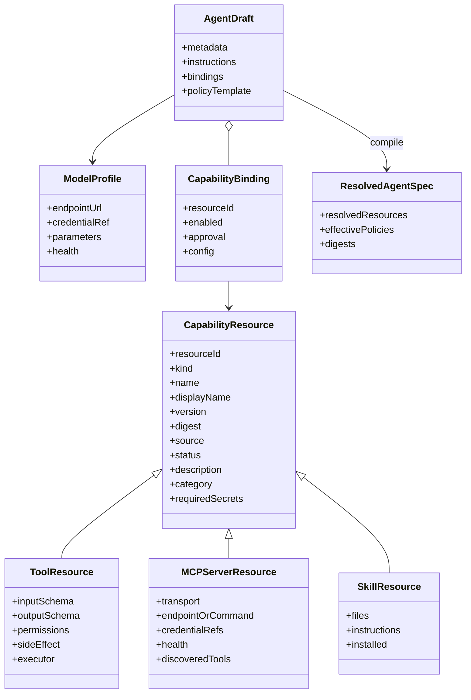
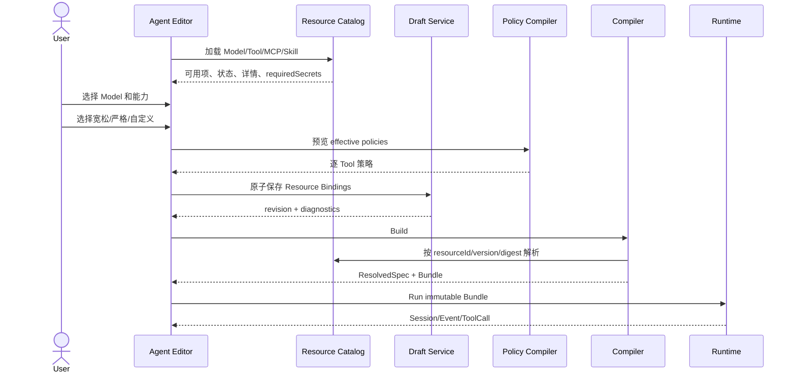
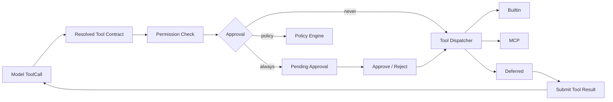

# AgentKit Local Studio 对标 Qoder Cloud Agent 的一期重设计

> 文档状态：实施基线
> 调研日期：2026-08-01
> 调研对象：Qoder Cloud Agents `https://qoder.com.cn/cloud/agents`
> 适用分支：`agentkit-studio-phase1`
> 产品原则：参考 Qoder 的资源化创建体验，但保持 AgentKit“本地创建、本地构建、本地运行、
> 同一 Bundle 上云”的端云一体定位。

## 1. 结论

当前 Studio 的底层 `AgentSpec -> ResolvedAgentSpec -> AgentBundle -> Runtime` 主链路可以保留，
但创建体验和资源控制面必须重构。尤其不能再让普通用户直接编辑 Skill、MCP 和 Tool 的 JSON
数组。

一期的正确产品模型应是：

```text
资源中心负责“有什么、是否可用”
        ↓
Agent 编辑器负责“选择什么、采用什么策略”
        ↓
Compiler 负责“把引用解析成不可变快照”
        ↓
Runtime 只执行已解析、已授权的 Bundle
        ↓
Session / Deployment 负责“在哪运行、挂载什么运行资源、如何触发”
```

核心修正：

1. Model、Skill、MCP、Tool 都是可发现、可选择、可配置的资源，不是自由文本。
2. 资源定义与 Agent Binding 分离。
3. Tool 合同与 Tool Policy 分离；同一个 Tool 可被不同 Agent 以不同审批策略使用。
4. Agent Definition 与 Environment/Secret/File/Memory 等运行绑定分离。
5. Agent 创建是配置工作台，JSON/YAML 只能作为高级视图。
6. Runtime 必须消费 Compiler 解析后的快照，不能运行时重新查找“最新”资源。

## 2. Qoder 实际体验记录

以下内容来自登录后的真实产品页面和用户提供的创建页截图，不是根据营销文案推测。

### 2.1 Agent 列表

Qoder 的 Agent 列表提供：

- 状态筛选和名称搜索。
- Agent ID、名称、版本、模型、会话数和更新时间。
- Agent 详情页包含配置/会话两个页签。
- Agent 配置按版本查看，不把草稿和已发布版本混为一体。
- Agent 会话可按状态筛选，并显示 Trigger、运行时长和 Token。

### 2.2 Agent 创建

创建弹窗是完整的 Agent Definition 编辑器，按顺序包含：

| 区域 | 可见交互 | 产品含义 |
|---|---|---|
| 基本信息 | 名称、描述 | Agent identity |
| 模型 | 下拉选择 | 选择可用模型资源，不输入 endpoint |
| 指令 | 系统提示词 | Agent 行为基线 |
| 工具 | 内置工具列表、启用复选框、展开设置 | Tool catalog + binding |
| 权限 | 宽松、严格、自定义 | Policy template |
| 逐工具策略 | 自动允许、每次审批 | Tool policy override |
| 自定义工具 | 空白工具、AskUserQuestion 模板 | Deferred/custom tool contract |
| Schema | 表单/JSON 双模式、添加参数、测试入参 | Schema authoring + validation |
| 能力 | BrowserUse 开关 | Runtime feature gate |
| MCP | 添加按钮 | MCP resource binding |
| Skill | 添加按钮；无 Skill 时跳转创建 | Installed Skill binding |

工具目录包含 Bash、Read、Write、Edit、Glob、Grep、WebFetch、WebSearch、ImageSearch、
ImageGen 和 DeliverArtifacts。Qoder 的严格模板语义是：

- Read、Glob、Grep 自动允许。
- Bash、Write、Edit、WebFetch、WebSearch、ImageSearch、ImageGen、DeliverArtifacts
  每次执行前审批。

这说明模板不是一个 UI 标签，而是会展开为逐 Tool 的确定策略。

### 2.3 自定义 Tool

Qoder 自定义 Tool 的交互包含：

- 名称唯一性检查。
- 禁止与内置 Tool 重名。
- 禁止使用保留前缀 `mcp__`。
- 描述用于模型做 Tool routing。
- Input Schema 支持表单和 JSON 两种视图。
- 表单支持逐参数添加。
- 可以使用样例参数执行 Schema 校验。
- 提供 AskUserQuestion 预设，表明 Custom Tool 不一定由 Agent 进程直接执行。

由此可以推断其 Runtime 至少区分：

1. 内置 Runtime Tool。
2. MCP Tool。
3. 外部/Deferred Tool：产生调用请求，由会话客户端提交 ToolResult 后继续执行。
4. Human Interaction Tool：暂停并等待用户输入。

### 2.4 MCP

MCP 添加弹窗包含两个页签：

- 从密钥选择：搜索密钥库或凭证。
- 手动填写：名称、类型、URL。

Cloud 侧可见 transport 为 `Streamable HTTP`。该设计表达了三个重要边界：

1. MCP Server 是独立资源。
2. MCP 凭证也是独立资源。
3. Agent 只保存对 MCP Server 的绑定，不保存 Secret value。

### 2.5 Skill

Skill 页面同时承担市场、安装和本地导入：

- 搜索。
- 技能市场/已安装。
- 热门/最新排序。
- 分类筛选。
- 卡片展示名称、版本、分类、作者、描述和安装状态。
- 详情页展示 ID、版本、来源、分类、作者、文件树和 `SKILL.md` 内容。
- 创建 Skill 使用 ZIP 上传，最大 50MB。
- ZIP 必须包含带 name/description 的 `SKILL.md`。

Agent 创建页只能选择已安装 Skill。资源不存在时，明确跳转 Skill 页面，不允许用户输入一个
系统无法解析的名字。

### 2.6 Environment

Environment 是独立资源：

- 名称、描述、类型、软件包数量、关联会话和最近运行。
- 创建时配置软件包。
- 软件包配置包含 manager、name 和 version。

Environment 不属于 Agent Definition，而是 Session/Deployment 的运行绑定。

### 2.7 Secret、File、Memory

Secret：

- 独立资源列表。
- Agent/MCP 只引用 Secret，不回显明文。

File：

- 独立上传资源。
- 用户上传文件是只读输入。
- Agent 产出文件可下载。

Memory：

- 独立持久化存储。
- 展示状态、条目数和容量。
- 与单次上下文历史不是同一概念。

### 2.8 Session 与观测

Session 详情包含：

- 取消、归档和删除。
- 事件、资源、Agent、Environment、Secret 视图。
- 对话视图和调试视图。
- User、Agent、Tool、Session lifecycle 的统一时间线。
- Tool 名称、参数摘要、耗时和失败状态。
- 选择事件后查看详情。
- 空闲 Session 可以继续发送消息。

这说明 Session 是持久 Runtime entity，而不是一次 HTTP 请求的别名。

### 2.9 Deployment

Qoder Deployment 实际是“可重复触发的 Agent 运行配置”：

- 名称和描述。
- 选择 Agent。
- 选择 Environment。
- 添加 File/Secret/Memory 等 Resource。
- 环境变量。
- 定时调度或仅手动触发。
- 频率、时区、Cron 和未来触发预览。
- 每次触发发送给 Agent 的初始消息。

AgentKit 仍需保留“上传不可变 Bundle”的端云差异，但产品上 Deployment 也必须包含
EnvironmentBinding、ResourceBinding 和 Trigger，而不能只展示 region 和 Secret URI。

## 3. 当前一期差距审计

### 3.1 P0：阻断产品验收

| 差距 | 当前证据 | 必须修复 |
|---|---|---|
| Skill 是 JSON 输入框 | `skillsJson` textarea | Skill 资源选择器、搜索、详情、启停 |
| MCP 是 JSON 输入框 | `mcpJson` textarea | MCP 资源选择器、手动创建、凭证引用、probe |
| Tool 是 JSON 输入框 | `toolsJson` textarea | Tool catalog、复选、逐 Tool policy |
| 模型是自由文本 | model、endpoint、credential 三个 input | Model profile selector |
| Catalog 只是扁平数组 | `/capabilities` | 稳定资源 ID、来源、状态、元数据、分页 |
| Resource 与 Binding 混用 | AgentSpec 直接嵌完整对象 | Resource/Binder/Resolved 三层 |
| 权限没有产品模型 | allowedPermissions 字符串数组 | 模板 + override + 编译展开 |
| 自定义 Tool 不可执行 | executor 只有 builtin/mcp | deferred tool lifecycle |
| Create 只收三字段 | 小型 modal | 完整创建工作台 |

### 3.2 P1：一期应补齐

| 差距 | 必须修复 |
|---|---|
| Skill 没有导入/安装状态 | Local ZIP import、manifest validation、installed catalog |
| MCP probe 不持久化 | MCP Resource Repository + health |
| 没有 Model profile | Local Model Profile Repository |
| 运行资源无统一绑定 | SessionBinding/DeploymentBinding |
| 会话只按 Run 展示 | Session summary + event timeline |
| 部署无 Trigger | manual/schedule contract，Local 一期先实现 manual |
| YAML 与 UI 缺少双向映射状态 | Advanced YAML 视图和 validation diagnostics |

### 3.3 P2：后续增强

- 公共 Skill 市场远程索引。
- Skill 评分、作者认证和自动更新。
- BrowserUse、ImageGen 等托管能力。
- Cron scheduler daemon。
- 多租户 Secret Manager。
- MCP Streamable HTTP 本地执行。

## 4. 重构后的领域模型



### 4.1 Resource、Binding、Resolved 的区别

`CapabilityResource`：

- 工作区资源中心的事实。
- 可被多个 Agent 复用。
- 可以处于 ready、unhealthy、invalid、missing-secret 等状态。

`CapabilityBinding`：

- 某个 Agent 对资源的选择。
- 保存 enabled、approval override 和非敏感配置。
- 不复制资源实现，也不包含 Secret value。

`ResolvedCapability`：

- Build 时生成的不可变快照。
- 包含精确 version、digest、展开后的 Tool Schema 和 effective policy。
- Runtime 只能消费这一层。

## 5. 重构后的创建流程



## 6. 一期产品页面

### 6.1 Agent 创建/编辑器

采用大尺寸工作台，不使用三个字段的小弹窗。

布局：

```text
┌ 基本信息 ─────────────────────────────┐
│ 名称 / ID / 描述                      │
├ 模型 ────────────────────────────────┤
│ [选择模型 Profile] [参数设置] [健康]  │
├ 系统指令 ────────────────────────────┤
│ Prompt editor                         │
├ 工具与权限 ──────────────────────────┤
│ [宽松] [严格] [自定义]                │
│ ☑ Read   自动允许            [设置]   │
│ ☑ Write  每次审批            [设置]   │
│ [+ 自定义 Tool]                       │
├ MCP ─────────────────────────────────┤
│ github-mcp  Ready  12 Tools  [移除]  │
│ [+ 添加 MCP]                          │
├ Skill ───────────────────────────────┤
│ deep-research v1.0.0          [移除]  │
│ [+ 添加 Skill]                        │
└──────────────────────────────────────┘
```

高级执行策略、Context、Network 和 Evaluation 放在折叠的“高级设置”中，不与高频配置竞争。

### 6.2 Resource Picker

Skill、MCP 和 Tool 共用 Picker shell：

- 搜索。
- 分类/来源/状态筛选。
- 已选择计数。
- 卡片或列表详情。
- 不可用原因。
- 多选或单选。
- 确认前不改 Draft。

Skill Picker 只显示 installed/ready Skill。

MCP Picker 显示：

- Server health。
- transport。
- tool count。
- credential status。
- 最近 probe。
- “新建 MCP Server”入口。

Tool Picker 显示：

- builtin/custom/mcp 来源。
- side effect。
- permissions。
- Schema 摘要。
- 默认 approval。

### 6.3 Resource Center

一期必须有：

- Model Profiles。
- Skills。
- MCP Servers。
- Tools。

Environment、SecretRef、File 和 Memory 先提供合同与本地最小 Repository，完整管理页面可按
后续迭代展开。

## 7. 权限模板

模板展开后保存 effective override，避免模板定义升级改变既有 Agent。

### 7.1 宽松

- 已启用 Tool：`approval=never`。
- 仍然执行 allowedPermissions 和网络策略。
- UI 明确提示仅适用于可信工作区。

### 7.2 严格

- `sideEffect=none|read`：`approval=never`。
- `sideEffect=write|external`：`approval=always`。
- Bash/process 类：`approval=always`。

### 7.3 自定义

- 用户逐 Tool 选择 `never|always|policy`。
- Agent Draft 保存每个 Tool 的最终值。

模板不能绕过 Runtime policy enforcement。

## 8. API 重设计

### 8.1 Catalog

#### `GET /api/v1/catalog/resources`

Query：

| 参数 | 类型 | 说明 |
|---|---|---|
| `kind` | model/tool/mcp/skill | 资源类型 |
| `query` | string | 名称和描述搜索 |
| `source` | builtin/local/market | 来源 |
| `status` | ready/unhealthy/invalid | 状态 |
| `installed` | boolean | Skill 安装状态 |
| `cursor` | string | 分页游标 |
| `limit` | 1..100 | 默认 50 |

响应：

```json
{
  "items": [
    {
      "resourceId": "tool:builtin/workspace.read@1.0.0",
      "kind": "tool",
      "name": "workspace.read",
      "displayName": "Read",
      "version": "1.0.0",
      "digest": "sha256:...",
      "source": "builtin",
      "status": "ready",
      "description": "读取工作区内的 UTF-8 文件",
      "category": "workspace",
      "installed": true,
      "contract": {}
    }
  ],
  "nextCursor": null
}
```

#### `GET /api/v1/catalog/resources/{resourceId}`

返回完整 ResourceDescriptor，不返回 Secret value。

### 8.2 Agent Binding

#### `PUT /api/v1/agents/{agentId}/bindings`

Headers：

- `If-Match: "<revision>"`

Body：

```json
{
  "modelProfileId": "model:local/glm-5.1",
  "policyTemplate": "strict",
  "tools": [
    {
      "resourceId": "tool:builtin/workspace.read@1.0.0",
      "enabled": true,
      "approval": "never"
    }
  ],
  "mcpServers": [
    {
      "resourceId": "mcp:local/github@1.0.0",
      "enabled": true
    }
  ],
  "skills": [
    {
      "resourceId": "skill:local/deep-research@1.0.0",
      "enabled": true
    }
  ]
}
```

服务端完成：

1. Resource 存在检查。
2. status=ready 检查。
3. version/digest 固定。
4. MCP required secret 检查。
5. Tool permission union 计算。
6. revision 原子更新。

### 8.3 MCP Resource

#### `POST /api/v1/catalog/mcp-servers`

```json
{
  "name": "github",
  "displayName": "GitHub MCP",
  "version": "1.0.0",
  "transport": "stdio",
  "command": "npx",
  "args": ["-y", "@modelcontextprotocol/server-github"],
  "envRefs": {
    "GITHUB_TOKEN": "env://GITHUB_TOKEN"
  }
}
```

步骤：

1. Schema 和 command policy validation。
2. 原子保存 MCP Resource。
3. 可选 probe。
4. 保存 server identity、Tool descriptors、health 和 probedAt。
5. Agent 只引用 resourceId。

#### `POST /api/v1/catalog/mcp-servers/{resourceId}:probe`

不接受 Secret value；只解析已存 credential refs。

### 8.4 Skill Import

#### `POST /api/v1/catalog/skills:import`

一期支持本地 ZIP multipart：

- 最大 50MB。
- 拒绝 Zip Slip、绝对路径、软链接和压缩炸弹。
- 必须有 `SKILL.md`。
- 解析 name、description、version。
- 计算 digest。
- 写入 staging 后原子安装。

### 8.5 Tool Schema

#### `POST /api/v1/tool-schemas:validate`

```json
{
  "schema": {},
  "sample": {}
}
```

返回 Schema diagnostics 和 sample validation diagnostics。

### 8.6 Policy Preview

#### `POST /api/v1/tool-policies:preview`

```json
{
  "template": "strict",
  "resourceIds": ["tool:builtin/workspace.read@1.0.0"]
}
```

返回逐 Tool effective approval 和 permission union。

## 9. Compiler 与 Runtime 内核

### 9.1 Compiler

Compiler 新增 Binding Resolution：

```text
AgentDraft.bindings
  -> Catalog lookup by resourceId
  -> exact version/digest verification
  -> required secret reference verification
  -> Tool policy expansion
  -> permission union
  -> Skill content snapshot
  -> MCP tool snapshot
  -> ResolvedAgentSpec
```

禁止：

- 按 name 猜测资源。
- 编译时选择 latest。
- Runtime 重新扫描工作区。
- Bundle 中保存 Secret value。

### 9.2 Runtime Tool Dispatcher



一期 UI 如果尚未提供审批操作，`always` 必须阻断；不能假装“严格模板可用”却自动放行。

### 9.3 Session 与 Deployment

Agent Version 固化 Definition。

Session Binding：

- Agent Version。
- Environment。
- Secret refs。
- Files。
- Memory store。

Deployment：

- Agent Version。
- EnvironmentBinding。
- ResourceBindings。
- manual/schedule trigger。
- initial message。

Local 一期必须完成 manual trigger；schedule 合同可落盘但不启动后台 scheduler，UI 标记为
后续能力。

## 10. 一期重新验收条件

### 10.1 产品

- 全局 `创建 Agent` 默认进入空白 Agent，不预设深度调研或其他业务场景。
- 第一步允许用户选择空白 Agent 或显式选择业务模板；切换模板不得覆盖用户已自定义的名称和 ID。
- 空白 Agent 以名称、描述、系统提示词为最小输入，不自动安装 Skill，也不自动绑定 Tool 或 MCP。
- Research Agent 仅在用户显式选择后展示调研目标、目标读者、深度和输出格式，并注入调研方法。
- 创建 Agent 时不再出现 Skill/MCP/Tool JSON 输入框。
- Model 通过 Profile 选择。
- Tool 可勾选并应用宽松/严格/自定义策略。
- 每个 Tool 可查看描述、Schema、权限和来源。
- Skill 通过搜索选择已安装项。
- MCP 通过搜索选择已有 Server，并可进入结构化新建流程。
- 已选资源以可移除列表展示。
- 不可用资源显示具体原因。
- 高级 YAML 仍可查看，但不是默认交互。

### 10.2 后台

- Catalog Resource 有稳定 ID。
- Agent 保存 Binding，而非依赖 UI 拼 JSON。
- MCP Resource 可持久化和 probe。
- Skill 可安全导入。
- Policy template 能稳定展开。
- Compiler 按 resourceId/version/digest 解析。
- Runtime 二次执行权限检查。

### 10.3 测试

- Resource catalog/filter/detail。
- Binding 原子保存和 revision conflict。
- 无效/不健康资源不能绑定。
- strict/loose/custom policy 展开。
- Skill ZIP 安全。
- MCP create/probe/secret missing。
- Schema builder roundtrip 和 sample validation。
- UI 从选择到 Draft YAML 的完整 E2E。
- Build 后 ResolvedSpec 与选择项一致。
- Runtime 未声明 Tool、未授权 Tool 和待审批 Tool 均被拒绝。

## 11. 实施顺序

1. ResourceDescriptor、Binding、PolicyTemplate 合同。
2. Local ResourceCatalog Repository。
3. 内置 Tool catalog 扩展。
4. Catalog/Binding/Policy/Schema API。
5. MCP Resource persistence。
6. Skill ZIP import。
7. Agent 创建工作台与 Picker。
8. Compiler binding resolution。
9. Runtime Tool dispatcher 和必要的 workspace builtin tools。
10. API、unit、browser E2E 和视觉回归。

## 12. 两轮正式评审记录

### 12.1 第一轮：产品模型与 Qoder 对标评审

评审范围：Qoder Agent 列表、创建工作台、Tool policy、自定义 Tool、MCP、Skill、
Environment、Secret、File、Memory、Session、Deployment。

参与角色：产品负责人、Agent 平台架构、前端负责人、控制面负责人、Runtime 负责人。

| 级别 | 发现 | 评审决定 | 落地证据 |
|---|---|---|---|
| P0 | Skill、MCP、Tool 以 JSON 文本框暴露内部合同 | 全部替换为 Catalog + Picker + Binding | 创建/编辑工作台无 JSON 能力输入 |
| P0 | Agent Resource 与 Agent Binding 混为一体 | 拆分 Resource、Binding、Resolved 三层 | `ResourceDescriptor`、`AgentBindings`、`ResolvedAgentSpec` |
| P0 | Model 允许自由输入地址和凭证 | 默认只选择 Model Profile；Profile 在资源中心管理 | Model selector 与 Model Profile API |
| P0 | 权限只有字符串数组，没有用户策略 | 提供宽松、严格、自定义模板和逐 Tool override | Policy Preview API 与逐项审批选择 |
| P0 | Agent 创建弹窗只有名称、ID、描述 | 创建时完成模型、提示词、Tool、MCP、Skill 配置 | 大型创建工作台与配置摘要 |
| P1 | Skill 只有目录扫描，没有产品化安装 | 增加安全 ZIP import 与 installed catalog | ZIP path/symlink/size/ratio 校验 |
| P1 | MCP probe 是一次性动作 | MCP 先持久化为 Resource，probe 回写 health 和 Tool snapshot | MCP create/probe API |
| P1 | UI 与声明文件不可对照 | 增加只读高级 YAML | Agent 编辑页 Advanced YAML |

第一轮结论：旧方案不通过；按 Resource Catalog 与 Binding 模型重构后通过。

### 12.2 第二轮：控制面、编译器、安全与内核评审

评审范围：乐观锁、资源状态、Secret 边界、确定性编译、Tool schema、权限二次校验、
工作区文件访问、Skill 供应链、端云同 Bundle。

参与角色：首席架构、控制面、Runtime、安全、QA/SRE、云部署适配负责人。

| 级别 | 风险 | 评审决定 | 落地证据 |
|---|---|---|---|
| P0 | UI 选择资源后仍可能嵌入完整对象 | Draft 只保存稳定 `resourceId` 与 override | Binding API 和 Draft YAML |
| P0 | 不存在或 unhealthy 资源可能进入 Draft | Binding 保存与 Build 均做 Catalog resolution | `RESOURCE_NOT_FOUND` / `RESOURCE_NOT_READY` |
| P0 | Compiler 可能按名称或 latest 漂移 | 仅按 ID、精确版本和 digest 解析并生成 lock | `dependency-lock.json` |
| P0 | Secret value 进入 Draft、Bundle 或日志 | 只接受 `env://`、`keychain://`、`secret-manager://` 引用 | Secret reference validator 与定向扫描 |
| P0 | Tool 只校验输入，不校验输出 | Dispatcher 对 input/output 都执行 JSON Schema | `TOOL_ARGUMENTS_INVALID` / `TOOL_OUTPUT_INVALID` |
| P0 | Tool 可绕过 Agent 权限 | Runtime 在每次调用前重新计算缺失权限 | `TOOL_PERMISSION_DENIED` |
| P0 | 写 Tool 可越界访问 Studio 内部目录 | 相对路径、root containment、`.agentkit` deny、symlink deny | Workspace Tool 单元测试 |
| P0 | Skill ZIP 可目录穿越或压缩炸弹 | 限制路径、链接、条目数、压缩比和解压后体积 | Skill 安全测试 |
| P1 | Agent 级模型参数覆盖没有归属 | 参数作为 Model Binding override，Profile 保持可复用 | `bindings.modelParameters` |
| P1 | HTTP MCP 本地实现扩大一期协议风险 | 合同可声明；一期本地只执行 stdio，云端由 adapter 接管 | 稳定 `MCP_TRANSPORT_UNSUPPORTED` |
| P1 | 人工审批 UI 尚未形成可恢复 checkpoint | `always/policy` 一期必须阻断，绝不静默放行 | `TOOL_APPROVAL_REQUIRED` 测试 |

第二轮结论：满足一期安全与可测试基线；人工审批恢复、HTTP MCP 本地 transport、
公共 Skill 市场明确不伪装为已完成能力。

## 13. 独立模块与人员分工

| 模块 | 代码边界 | 主责建议 | 可独立交付物 |
|---|---|---|---|
| Web 产品工作台 | `studio/static/index.html` | 前端 1、产品/UX 1 | Agent Workbench、Picker、Resource Center |
| Local Control Plane | `api.py`、`service.py`、`repository.py` | 后端 2 | REST/OpenAPI、乐观锁、错误语义 |
| Resource Catalog | `resource_catalog.py`、`capabilities.py` | 后端 1 | Model/Tool/MCP/Skill Resource API |
| Contract 与 Compiler | `contracts.py`、`validator.py`、`compiler.py` | Agent 架构 1 | Draft/Binding/Resolved/Lock 合同 |
| Agent Runtime Kernel | `runtime.py`、`model_client.py`、`mcp_runtime.py` | Runtime 2 | Model loop、Context、Tool dispatcher |
| Build 与供应链 | `builder.py`、`workspace.py` | 平台工程 1 | 确定性 Bundle、digest、Skill snapshot |
| Evaluation/Observe | `evaluation.py`、`event_store.py` | QA 平台 1 | Suite、Run/Event/Trace |
| Cloud Adapter | `cloud.py` | 云平台 1 | Bundle admission、binding、rollback |
| 安全与质量门禁 | `validator.py`、`tests/studio` | 安全 0.5、QA/SRE 1 | Secret scan、单测、E2E、发布门禁 |

并行开发约束：

1. Web、Catalog、Runtime 只能依赖 `contracts.py` 中的版本化合同，禁止跨模块读取私有文件。
2. Catalog 负责 Resource；Agent Repository 负责 Binding；Compiler 负责 Resolved，所有权不可互换。
3. Runtime 只加载成功 Build，不直接读取可变 Draft 或重新扫描 Skill。
4. Cloud Adapter 只接收 Bundle digest 与 EnvironmentBinding，不在云端偷偷重建。

建议一期最小团队为 7 至 9 人：产品/UX 1、前端 1、控制面 2、Agent Runtime 2、
QA/SRE 1、安全与云平台各 0.5 至 1。若缩减到 5 人，优先合并 Catalog 与控制面、QA 与
平台工程，不建议把 Compiler 与 Runtime 的主责合并。

## 14. 实现与验证记录

截至 2026-08-01，重设计已落到 `agentkit-studio-phase1` 分支：

- Catalog：稳定 ID、搜索/过滤/详情、Model Profile、自定义 Tool、MCP persistence/probe、
  Skill ZIP import。
- Agent：完整创建工作台、Binding 原子保存、revision conflict、只读高级 YAML。
- Policy：宽松/严格/自定义、逐 Tool override、编译期权限并集。
- Compiler：Binding materialization、精确版本/digest、依赖锁、同 Bundle 端云交付。
- Runtime：Tool input/output schema、权限二次检查、approval fail-closed、
  Read/Write/Edit/Glob/Grep、stdio MCP。
- UI E2E：浏览器完成 Agent 创建、Tool 选择、MCP 创建与选择、Draft 保存、本地 Build；
  Bundle digest 为 `sha256`，浏览器 console 无 error/warning。

验证命令与结果：

| 门禁 | 命令 | 结果 |
|---|---|---|
| Studio 测试 | `.venv/bin/pytest -q tests/studio` | `77 passed, 1 skipped` |
| CLI help 回归 | `.venv/bin/pytest -q tests/test_help_snapshots.py` | `3 passed` |
| Lint | `.venv/bin/ruff check ksadk tests/studio` | 通过 |
| Type check | `.venv/bin/mypy ksadk/studio` | 通过 |
| Diff hygiene | `git diff --check` | 通过 |
| Python 制品 | `uv build --out-dir /tmp/agentkit-phase1-dist-20260801` | sdist/wheel 通过 |
| Browser E2E | 1440 desktop + 窄屏 responsive | 创建、绑定、构建通过，无横向溢出 |

跳过的 1 个测试是真实模型联网用例：只有进程环境注入模型凭证时执行，不读取或落盘
Secret value。它不影响 Fake Model 驱动的完整控制面、编译、Runtime 与部署闭环测试。
