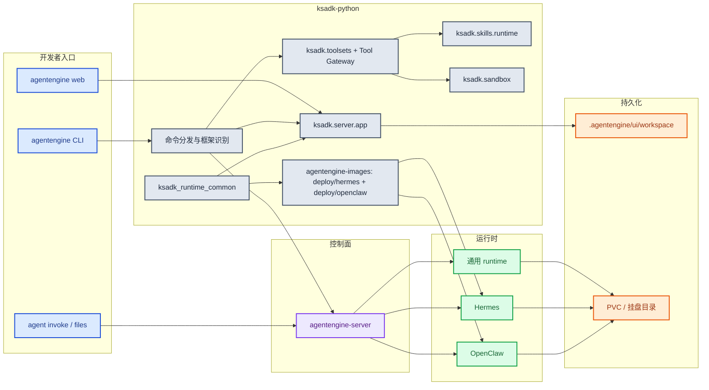
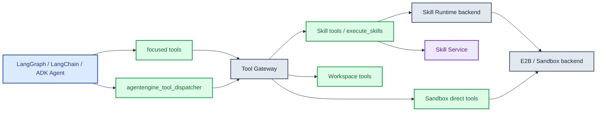
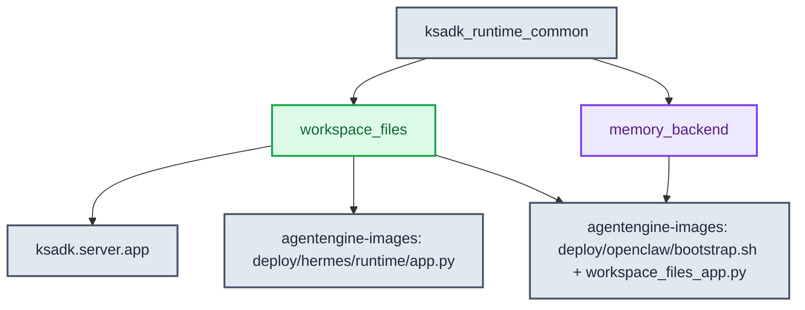
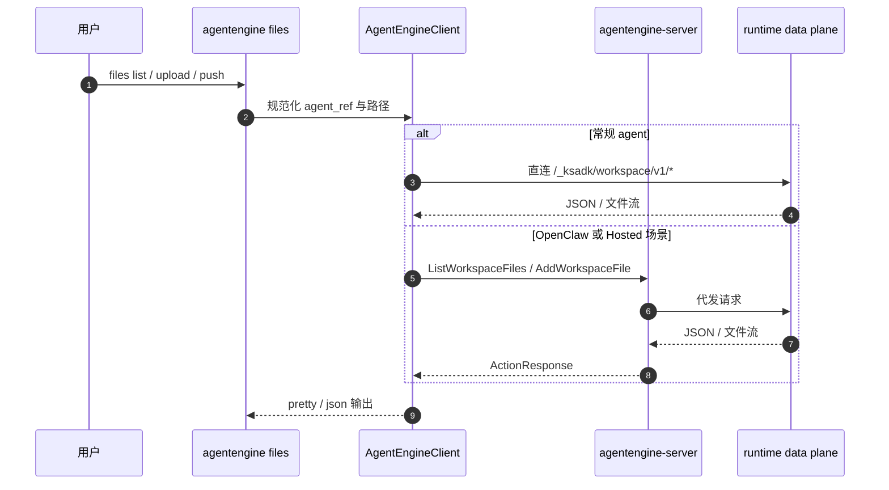
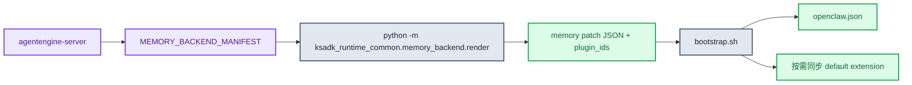

# ksadk技术设计

本文档描述 `ksadk-python` 当前主线的正式技术设计。写法采用技术设计文档结构，但内容只记录已经体现在代码、测试、CLI 帮助、Dockerfile 与默认常量中的行为。

## 1. 目标与边界

`ksadk-python` 负责三类职责：

1. 开发者入口
   提供 `agentengine` / `ksadk` CLI，本地开发、调试、构建和部署都从这里进入。
2. 本地运行时
   提供本地 Web UI、会话存储、本地 workspace 数据面以及开发态调用能力。
3. 托管运行时资产
   提供 Hermes / OpenClaw 共享镜像、bootstrap 脚本、共享 workspace_files 与 memory_backend 源码。
4. Skill Runtime 与内置工具消费
   提供 Skill Space 运行时消费、Skill 包校验与加载、sandbox backend 编排、内置 toolset 绑定、Tool Gateway 审批 envelope。

不在本仓承担最终事实源的能力：

- Agent 生命周期持久化
- endpoint / api_key 写回
- Hosted UI bootstrap
- Workspace Files Hosted Action
- OpenClaw `MEMORY_BACKEND_MANIFEST` 生成
- Skill 注册、CRUD、版本治理和 marketplace
- Sandbox template、instance、token 与网络生命周期

这些分别由 `agentengine-server`、Skill Service、Sandbox Service 或平台控制面负责。

## 2. 总体架构



## 3. 代码分层

### 3.1 CLI 层

入口在 `pyproject.toml`：

```toml
agentengine = "ksadk.cli:main"
```

CLI 层负责：

- framework 检测
- 本地运行与调试
- 构建产物准备
- 调用 `agentengine-server`
- `files` 与 `agent invoke` 的传输选择
- framework 级默认存储参数

### 3.2 本地运行时

本地运行时的核心是 `ksadk.server.app`，负责：

- 本地会话
- 本地统一 Web UI
- 本地附件上传
- 本地 workspace files 路由

当前本地目录约定：

- UI 根目录：`<project>/.agentengine/ui`
- 本地会话：`<project>/.agentengine/ui/sessions.sqlite`
- 本地 workspace：`<project>/.agentengine/ui/workspace`

### 3.3 托管运行时资产

Hermes / OpenClaw 运行时镜像资产曾在本仓库 `deploy/hermes/`、`deploy/openclaw/`、`deploy/openclaw-user-template/` 下维护，现已迁出至 `agentengine-images` 仓库。这些目录不仅是模板，还包含线上运行时镜像的事实约定，例如：

- Hermes 的 `entrypoint.sh`
- OpenClaw 的 `bootstrap.sh`
- 共享 workspace sidecar 与 memory backend 渲染入口

### 3.4 Skill Runtime、Sandbox 与 Toolsets

`0.6.2` 起，SDK 侧新增三层运行时消费抽象：

- `ksadk.skills.runtime`：负责 workflow 请求解析、Skill 选择、远端 Skill 包下载、`sha256` 校验、安全解压、runtime agent 执行和 artifacts 汇总。
- `ksadk.sandbox`：通用 Sandbox Runtime 底座，当前首个 backend 是 E2B-compatible sandbox；Skill Runtime 和 sandbox direct tools 共用这层，不把 sandbox 语义写死为 Skill 专用。
- `ksadk.toolsets`：给 LangGraph、LangChain、DeepAgents、ADK 或自定义 runner 暴露内置工具，包括 Skill、Workspace、Platform、Sandbox 四组工具，以及聚合入口 `get_agentengine_tools()`。

推荐绑定方式是显式渐进式披露：

```python
from ksadk.toolsets import get_agentengine_tools

tools = get_agentengine_tools(include=["focused", "agentengine_tool_dispatcher"])
```

`get_agentengine_tools()` 无参保持全量工具兼容。`focused/core` profile 只直接暴露 Skill 发现/加载、Workspace 状态/搜索/片段编辑/lint、组件状态和 sandbox 状态；`execute_skills`、`run_command`、`run_code`、Workspace 写入/删除等低频或高风险工具通过 `agentengine_tool_dispatcher` 按需 `list` / `describe` / `call`。

Tool Gateway 位于实际工具执行前，负责风险策略和人工确认 envelope。strict 模式下，中高风险工具返回 `approval_required`，由 Hosted/local UI 或调用方回传批准后继续；dispatcher 调用真实工具对象，不绕过 Tool Gateway。



## 4. `ksadk_runtime_common` 同仓共享源码

这是当前主线的核心去重点。



当前共享源码包含两块：

### 4.1 `workspace_files`

职责：

- 统一 runtime 路由前缀
- 统一 Hosted bootstrap payload
- 统一路径逃逸拦截
- 统一上传大小上限和动作常量

关键常量：

- `WORKSPACE_ENTRY_ACTION = "ListWorkspaceFiles"`
- `WORKSPACE_UPLOAD_ACTION = "AddWorkspaceFile"`
- `WORKSPACE_CONTENT_PATH = "/agentengine/api/v1/GetWorkspaceFileContent"`
- `DEFAULT_WORKSPACE_MAX_UPLOAD_BYTES = 100MB`

### 4.2 `memory_backend`

职责：

- 解析并校验 `MEMORY_BACKEND_MANIFEST`
- 基于 provider 渲染 OpenClaw 需要的配置 patch
- 返回需要同步的插件 ID 列表

当前 provider：

- `openclaw_default`
- `mem0`

当前 `mem0` 渲染所要求的环境变量：

- `MEM0_API_KEY`
- `MEM0_USER_ID`
- `MEM0_BASE_URL`

## 5. 存储与 workspace 设计

`ksadk/cli/storage.py` 统一定义了 framework 级默认值。

### 5.1 容量约束

- 默认：`20Gi`
- 最小：`20Gi`
- 最大：`500Gi`

### 5.2 默认挂载目录

| Framework | 默认挂载目录 |
| --- | --- |
| `adk` | `/home/node/.agentengine` |
| `langchain` | `/home/node/.agentengine` |
| `langgraph` | `/home/node/.agentengine` |
| `deepagents` | `/home/node/.agentengine` |
| `hermes` | `/home/node/.hermes` |
| `openclaw` | `/home/node/.openclaw` |

### 5.3 workspace 对外语义

- CLI 和 Hosted UI 统一把根目录表示为 `workspace:/`
- Hermes 明确把 `KSADK_WORKSPACE_ROOT` 绑定到 `HERMES_WORKDIR`
- OpenClaw 明确把 `KSADK_WORKSPACE_ROOT` 绑定到 `${OPENCLAW_STATE_DIR}/workspace`

## 6. 文件访问与传输选择



当前策略重点：

- 常规 agent 有 endpoint + api_key 时，优先 `runtime_direct`
- OpenClaw 默认优先 `action_proxy`
- CLI 会把逻辑路径和真实路径同时渲染到输出中

## 7. `agentengine agent invoke` 与本地目录同步

`agentengine agent invoke` 是远端交互入口；其中 Hermes native 模式额外接通了本地目录同步。

同步前会做四件事：

1. 递归扫描本地目录
2. 校验目录非空
3. 校验任一单文件不超过 `MaxUploadBytes`
4. 校验目录总大小不超过同一个上限

如果不传 `--remote-workspace-path`，会默认使用本地目录名作为远端子目录名。

## 8. Hermes 运行时设计要点

Hermes runtime 的关键事实：

- Docker 构建时从仓根复制 `ksadk_runtime_common`
- `PYTHONPATH=/opt`
- `HERMES_HOME=/home/node/.hermes`
- `HERMES_WORKDIR=/home/node/.hermes/workspace`
- `KSADK_WORKSPACE_ROOT` 默认跟随 `HERMES_WORKDIR`

Hermes 既承载 dashboard，又承载：

- `/v1/*`
- `/_ksadk/terminal/ws`
- `/_ksadk/workspace/v1/*`

## 9. OpenClaw 运行时设计要点

OpenClaw runtime 的关键事实：

- Docker 构建时从仓根复制 `ksadk_runtime_common`
- `PYTHONPATH=/opt`
- bootstrap 会启动 workspace files sidecar
- sidecar 默认监听 `127.0.0.1:8091`
- gateway 内部通过 `OPENCLAW_WORKSPACE_FILES_PROXY_URL` 转发到 sidecar

### 9.1 memory backend 主链路



当前链路特征：

- manifest 由控制面生成
- 渲染在 runtime 内完成
- `mem0` 需要环境变量齐全，否则 bootstrap 直接失败
- 插件不是无条件落盘，而是由渲染结果驱动按需同步
- `lancedb`（`backend_type=lancedb`）走同一 manifest→render 链路，但不依赖 mem0 环境变量；渲染产出 `memory-lancedb` 插件 entry，同时把 `openclaw-mem0` 加入 `disabled_plugin_ids`，避免两个 memory 插件同时生效。manifest 可选 `config.dbPath` / `config.embedding` / `config.storageOptions` 三个 LanceDB 专属字段，由 schema 校验，缺省时插件使用内置默认。

!!! info "0.6.7 新增 backend"
    LanceDB 作为进程内向量存储 backend，给 OpenClaw 提供无需外部 mem0 实例的长期记忆能力；当 `backend_type=lancedb` 时，`secrets_env` 可留空。

## 10. Docker 构建与根上下文

当前 Hermes / OpenClaw 镜像都采用同仓共享源码 + 根上下文构建：

- `COPY ksadk_runtime_common /opt/ksadk_runtime_common`
- `PYTHONPATH=/opt`
- 根目录 `.dockerignore` 负责排除 `.git`、`dist`、`build`、缓存目录和本地产物

收益：

- 不依赖额外 wheel 仓发布
- 共享源码与 runtime 资产同仓演进
- Docker 构建可直接消费最新共享模块

## 11. 与服务端的协作边界

| 能力 | `ksadk-python` | `agentengine-server` |
| --- | --- | --- |
| CLI / 本地开发 | 负责 | 不负责 |
| Agent 生命周期 | 调用方 | 真相源 |
| Hosted UI bootstrap | 消费方 | 负责 |
| Workspace Files runtime data plane | 负责 | 不负责 |
| Workspace Files Hosted Action | 消费方 | 负责 |
| Memory manifest 渲染 | 负责（含 `openclaw_default` / `mem0` / `lancedb` 三种 backend_type） | 不负责 |
| Memory manifest 生成 | 不负责 | 负责 |
| endpoint / api_key 写回 | 不负责 | 负责 |

## 12. 平台上下文与 invocation_id

!!! new "0.6.5 新增"
    平台调用上下文（`PlatformInvocationContext`）与 `invocation_id` 贯穿 runner payload 与 OpenAI 兼容接口，为 Skill / Workspace / Sandbox / Memory 工具提供统一的账号边界读取入口。

### 12.1 PlatformInvocationContext

`ksadk.runtime_context.PlatformInvocationContext` 在 runner 执行前由 conversation runtime 注入到 `ContextVar`，携带 `agent_id` / `user_id` / `session_id` / `account_id` 等字段。工具实现优先读取当前调用上下文，而不是裸环境变量。

```python
from ksadk.runtime_context import (
    get_current_invocation_context_or_default,
    get_current_user_id,
    get_current_account_id,
)

ctx = get_current_invocation_context_or_default()
user_id = get_current_user_id()        # ctx.user_id
account_id = get_current_account_id()  # ctx.account_id，未注入时为空串
```

`PlatformInvocationContext.account_id` 是 0.6.5 新增字段，用于把控制面透传的账号边界下沉到工具层。

### 12.2 invocation_id 与 account_id 透传

`invocation_id` 作为单次调用的稳定标识，由 runner payload 与 OpenAI 兼容接口共同透传：

- runner payload 携带 `invocation_id`，由 conversation runtime 进入 `platform_invocation_scope` / `tool_execution_scope`。
- `/v1/responses`、`/v1/chat/completions` 与 `RunAgent` action 都接收并透传 `account_id`，进入 `PlatformInvocationContext`。
- 后台 stream（`Background=true`）使用 `invocation_id` 作为 detached stream 的索引键，供 `SubscribeRunEvents` 拉起始态。

```python hl_lines="3"
# RunAgent action 透传示例（伪代码）
result = await conversation.invoke_conversation_once(
    runner=active_runner,
    agent_id=agent_id,
    user_id=run_user_id,
    account_id=account_id,        # 控制面透传的账号边界
    invocation_id=invocation_id,  # 单次调用稳定标识
    session_id=resolved_session_id,
)
```

### 12.3 工具按账号边界读取当前调用上下文

Skill / Workspace / Sandbox / Memory 工具在执行时通过 `get_current_invocation_context_or_default()` 读取当前 `account_id` / `user_id` / `session_id`，使同一 runner 进程内的多账号调用互不串扰：

- Memory 工具使用 `context.user_id` / `context.session_id` 限定长期记忆的读写范围。
- Skill 工具通过 `KSYUN_ACCOUNT_ID` / `KSADK_SKILL_SERVICE_ACCOUNT_ID` 把账号写入 Skill Service 请求头 `X-Ksc-Account-Id`。
- Workspace / Sandbox 工具通过 `tool_execution_scope` 读取 `session_id` / `run_id` / `invocation_id`，把执行范围绑定到当前调用。

!!! tip "工具实现建议"
    自定义工具优先调用 `get_current_invocation_context_or_default()`，不要直接读 `os.environ` 里的账号信息；前者反映当前调用边界，后者只反映进程启动环境。

## 13. Hosted/本地附件统一解析

!!! new "0.6.6 新增"
    附件 URI 统一为两种 scheme：本地 `ksadk-upload://` 与 Hosted `ae-upload://`。runtime 侧统一解析、按需下载并恢复本地 cache。

### 13.1 双 scheme 解析

`ksadk.conversations.attachment_storage` 同时识别两种 scheme：

| Scheme | 来源 | 解析动作 |
| --- | --- | --- |
| `ksadk-upload://` | 本地上传或 KS3 回填 | 直接读本地 cache 或 KS3 object |
| `ae-upload://` | Hosted 控制面下发 | 走 KOP Action `AttachmentContent` 下载 |

`parse_file_id()` 对两种 scheme 都返回去掉前缀后的 `file_id`；`is_runtime_upload_uri()` / `is_hosted_upload_uri()` 用于分支判断。

### 13.2 KOP Action 下载

Hosted 附件通过 `AgentEngineClient.download_attachment_content(file_uri)` 走签名后的 KOP Action API 拉取字节流，返回 `AttachmentContent`（`data` / `content_type` / `display_name`）。下载失败时返回 `None`，由上层决定是否降级。

### 13.3 本地 cache 恢复链路

`AttachmentStorageService.read()` 按以下顺序恢复附件字节：

1. `ae-upload://` → 调用 KOP Action 下载，写入本地 cache 并落 `.meta.json`。
2. `ksadk-upload://` 且 metadata 标记 `backend=ks3` → 读 KS3 object，失败时回退本地 cache。
3. metadata 里有 `local_path` → 直接读本地文件。
4. 上述都缺失 → 尝试 legacy 本地路径兜底。

`_restore_local_cache()` 负责把下载字节落盘到 session files 目录并回填 `local_path`，保证同一 `invocation_id` 内的重复读取不反复走网络。

## 14. 会话与事件分页

!!! new "0.6.6 新增"
    `ListSessions` / `ListSessionEvents` 增加 `count_sessions` / `count_events`，返回 `Total` 供 UI 分页。

会话与事件查询在原有 `offset` / `limit` 基础上新增总数统计：

| Action | 入参 | 出参新增 |
| --- | --- | --- |
| `ListSessions` | `Page` / `PageSize`（agent_id + user_id） | `Total`（`count_sessions`） |
| `ListSessionEvents` | `Offset` / `Limit`（session_id） | `Total`（`count_events`） |

`SessionService` 基类与 `LocalSessionService` / `PostgresSessionService` 实现统一提供 `count_sessions` / `count_events`，保证本地 SQLite 与托管 PG 行为一致。

## 15. Workspace 导出 facade

!!! new "0.6.6 新增"
    `ExportWorkspaceZip` 作为统一 facade，把 workspace 目录打包成 zip 流式下载。

`GET /agentengine/api/v1/ExportWorkspaceZip?path=<dir>` 由 `ksadk_runtime_common.workspace_files.router` 提供，本地 `ksadk.server.app` 与 OpenClaw sidecar 共用同一 handler。`path` 默认为 `.`（workspace 根），导出前做路径逃逸拦截，符号链接逃逸会被拒绝。

## 16. Custom UI 配置体系与 checkpoint/resume

!!! new "0.6.7 新增"
    Custom UI profile 与 LangGraph checkpoint/resume 能力层在 0.6.7 稳定。

### 16.1 Custom UI 配置体系

`ksadk.ui_config.resolve_ui_config()` 按「CLI 参数 → `.agentengine.state` → framework 默认 → 全局默认」优先级合并出最终 `UIConfig`（`profile` / `path` / `url`）。`ui_profile=custom` 时：

- `path` 默认 `/`（不复用 `/chat`）。
- 本地 `agentengine web` / `agentengine dashboard` 通过 `_configure_custom_ui_env()` 解析 custom bundle 目录并挂载静态资源。
- Hosted 侧由控制面把 `ui_profile` / `ui_path` / `ui_url` 写入 state，runtime 读取后路由到 custom bundle。

支持 profile 列表：`auto` / `adk` / `langchain` / `openclaw` / `hermes` / `custom`。

### 16.2 LangGraph checkpoint/resume 能力层

`LangGraphRunner` 暴露 checkpoint 描述与恢复能力：

- `describe_checkpoint_capability()` 返回 `Supported` / `Backend` / `Scope` / `Durable` / `Reason`，供 UI 判断是否可 resume。
- `_latest_checkpoint_metadata()` 从 `aget_state(config)` 提取 `thread_id` / `checkpoint_ns` / `checkpoint_id` / `next_node`，标注 `is_terminal` / `is_resumable`。
- resume 时 `_apply_checkpoint_resume_config()` 把 `thread_id` / `checkpoint_ns` / `checkpoint_id` 写入 `configurable`，保留 `checkpoint_ns` 以命中正确的子图状态。

!!! warning "checkpoint_ns 必须保留"
    LangGraph 的 checkpoint 在子图（subgraph）场景下按 `thread_id` + `checkpoint_ns` + `checkpoint_id` 定位；丢掉 `checkpoint_ns` 会错误恢复到父图状态。`_checkpoint_ref_from_state()` 只在 `checkpoint_ns` 非空时写入 `framework_ref.langgraph.checkpoint_ns`。

## 17. 文档索引

- [ksadk使用文档](../guides/ksadk使用文档.md)
- [工作区文件技术设计](../internal/工作区文件技术设计.md)
- [记忆使用指南](../guides/记忆使用指南.md)
- [OpenClaw一键部署指南](./openclaw一键部署指南.md)
