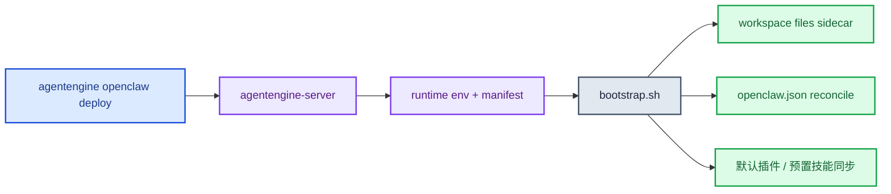
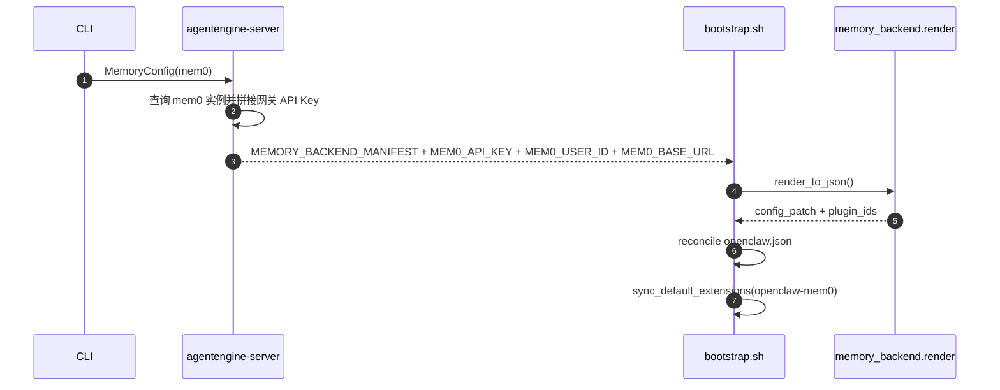

# OpenClaw一键部署指南

本文档对应当前 `agentengine openclaw` CLI 与 `agentengine-images` 仓库内 `deploy/openclaw/*` 运行时资产。

## 1. 一条命令部署

```bash
agentengine openclaw deploy
```

常见扩展：

```bash
agentengine openclaw deploy --name my-openclaw
agentengine openclaw deploy --image hub.kce.ksyun.com/your-ns/openclaw:v1
agentengine openclaw deploy --security-profile strict
agentengine openclaw deploy --storage-size-gi 50
```

## 2. 当前支持的关键参数

### 2.1 安全预设

- `--security-profile relaxed`
- `--security-profile strict`
- `--security-profile strictest`

兼容参数：

- `--strict-mode`
- `--strictest`

### 2.2 记忆系统

```bash
agentengine openclaw deploy --memory-system openclaw_default
agentengine openclaw deploy \
  --memory-system mem0 \
  --mem0-instance-id e52b7fac-e641-4b34-b9f7-6b0b9f190cd4 \
  --mem0-instance-name wangxu_m0_1011 \
  --mem0-region cn-beijing-6
```

约束：

- `mem0` 必须传 `--mem0-instance-id`
- `openclaw_default` 不能再传 mem0 细节参数
- 不传 `--memory-system` 时，CLI 不会强制覆盖已有 memory 配置

### 2.3 存储参数

- `--storage-size-gi`：默认 `20`
- `--storage-mount-path`：默认 `/home/node/.openclaw`
- `--no-storage`

## 3. 当前 runtime 行为



### 3.1 gateway 鉴权

当前默认值仍然是：

- `OPENCLAW_GATEWAY_AUTH_MODE=trusted-proxy`

但现在可以显式切到 token 模式：

```bash
agentengine openclaw deploy \
  --env OPENCLAW_GATEWAY_AUTH_MODE=token \
  --env OPENCLAW_GATEWAY_TOKEN=gateway-token-demo
```

兼容别名：

- `OPENCLAW_GATEWAY_PASSWORD`

行为说明：

- 托管 Dashboard/短链刷新仍走 cookie session，不要求浏览器持有 token。
- Router 会在服务端向 upstream runtime 注入 `Authorization: Bearer <OPENCLAW_GATEWAY_TOKEN>`。
- 如果直接访问实例公网入口，则客户端需要自己带 Bearer token。

### 3.2 workspace files

bootstrap 会：

- 默认导出 `OPENCLAW_WORKSPACE_FILES_ENABLED`
- 启动 `workspace_files_app.py`
- 让 gateway 内部反向代理到 `127.0.0.1:8091`

### 3.3 mem0 插件策略

当前镜像采用“镜像内置、按需同步”的方式：

- 镜像内已打包 `openclaw-mem0`
- 默认把它列入 `DEFERRED_DEFAULT_EXTENSIONS`
- 不使用 mem0 时，不会把该插件种到实例的持久化目录
- 使用 mem0 时，渲染出的 `plugin_ids` 会触发同步

## 4. mem0 链路



当前 server 注入到 runtime 的关键变量包括：

- `MEM0_API_KEY`
- `MEM0_MEMORY_ID`
- `MEM0_USER_ID`
- `MEM0_BASE_URL`
- `MEMORY_BACKEND_MANIFEST`

## 5. 渠道与诊断

当前平台版 OpenClaw runtime 镜像已内置 WPS 协作插件，插件 ID 固定为 `wps-xiezuo`。插件内置和 pod bootstrap 不依赖 WPS 凭证；只有当你希望 WPS 协作 channel 可连接可用时，才需要提供 WPS 开放平台应用的 `appId` 和 `appSecret`。其他字段都有 runtime 默认值：

- `baseUrl`: `https://openapi.wps.cn`
- `sdk.enabled`: `true`
- `sdk.logLevel`: `info`
- `dmPolicy`: `open`
- `allowFrom`: `["*"]`
- `groupPolicy`: `open`
- `instantAck.text`: `内容处理中，请稍候...`
- `mcp.mode`: `app`
- `bindings`: 默认路由到 `agentId=main`

创建 runtime 时可以直接通过环境变量一次性写入凭证配置：

```bash
agentengine openclaw deploy \
  --env OPENCLAW_CHANNEL_BOOTSTRAP_JSON='{"wps-xiezuo":{"appId":"<appId>","appSecret":"<appSecret>"}}'
```

也兼容 snake_case：

```bash
agentengine openclaw deploy \
  --env OPENCLAW_CHANNEL_BOOTSTRAP_JSON='{"wps-xiezuo":{"app_id":"<appId>","app_secret":"<appSecret>"}}'
```

如果实例已经创建，也可以后续用 CLI 修改运行中的 `openclaw.json`，补齐凭证并启用连接：

```bash
agentengine openclaw channel connect <agent_id_or_name> \
  --channel wps-xiezuo \
  --app-id <appId> \
  --app-secret <appSecret>
```

不传 `OPENCLAW_CHANNEL_BOOTSTRAP_JSON` 或不传其中的 `appId/appSecret` 不会影响 pod 启动，只是 `wps-xiezuo` 还不能完成认证。`channel connect` 是“写入凭证并配置成可用”的入口；`channel enable` 只适合重新启用已经存在 `appId/appSecret` 的配置，不会替你补齐凭证。

注意：`wps-xiezuo` 使用扁平配置，正确落点是 `channels["wps-xiezuo"].appId/appSecret`，不要写成老的 `accounts.default` 嵌套结构。bootstrap 会启用 `plugins.entries.wps-xiezuo.enabled=true`，并确保 `plugins.allow` 包含 `wps-xiezuo`。

如果需要裁剪平台版镜像的内置 channel 插件，可以在构建镜像时传 `OPENCLAW_PRESET_PLUGINS_ALLOWLIST`。例如只内置 WPS 协作，不内置微信、飞书、mem0：

```bash
docker buildx build \
  --build-arg OPENCLAW_PRESET_PLUGINS_ALLOWLIST=wps-xiezuo \
  -t hub.kce.ksyun.com/agentengine-public/openclaw:2026.5.4 \
  deploy/openclaw
```

> 注：`deploy/openclaw` 构建上下文已迁至 `agentengine-images` 仓库，需先 clone 该仓库并以其中 `deploy/openclaw` 为构建上下文。

该变量也会写入镜像运行时环境；bootstrap 会按同一白名单同步和自动启用插件。未设置时保持当前默认行为。

常用命令：

```bash
agentengine openclaw status
agentengine openclaw gateway doctor
agentengine openclaw gateway doctor --fix
agentengine openclaw gateway logs
agentengine openclaw channel status --probe
agentengine openclaw channel connect --channel weixin
agentengine openclaw channel connect --channel feishu
agentengine openclaw channel connect <agent_id_or_name> --channel wps-xiezuo --app-id <appId> --app-secret <appSecret>
```

## 6. 最小验证路径

### 6.1 默认记忆模式

```bash
agentengine openclaw deploy
agentengine openclaw status --output json
agentengine files list
```

### 6.2 mem0 模式

```bash
agentengine openclaw deploy \
  --memory-system mem0 \
  --mem0-instance-id e52b7fac-e641-4b34-b9f7-6b0b9f190cd4
```

然后检查：

- agent 状态进入 `RUNNING`
- runtime 日志中出现 memory backend render
- `openclaw-mem0` 被按需同步

## 7. 运行时目录

默认状态目录：

- 状态根：`/home/node/.openclaw`
- workspace：`/home/node/.openclaw/workspace`
- 配置文件：`/home/node/.openclaw/openclaw.json`

## 8. 相关文档

- [ksadk使用文档](../guides/ksadk使用文档.md)
- [ksadk技术设计](./ksadk技术设计.md)
- [工作区文件技术设计](../internal/工作区文件技术设计.md)
