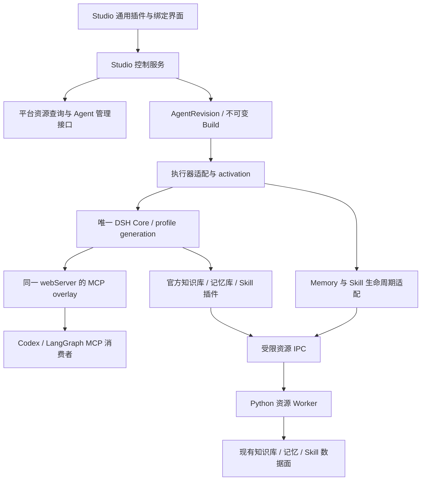

# KsADK Studio 平台资源插件研发设计：知识库、记忆库与 Skill 中心

> 日期：2026-09-07
>
> 状态：研发设计草案，待代码评审；不代表功能已经实现或已通过联调。
>
> 目标：以官方 DSH 插件提供平台资源能力，复用现有高代码接口，在 Studio 完成资源绑定，并由 Codex、LangGraph、DSH 消费。
>
> 交付范围：本文档。当前未修改业务代码、未变更版本、未发布或操作线上资源。

## 1. 核心决策

1. **能力插件化。** 知识库、记忆库、Skill 中心分别作为官方 DSH 插件，使用现有 npm Bundle/Profile 和 Cordis 服务机制，不增加第三种插件格式。
2. **内置即预装。** 官方插件可以随发行物提供，但安装、依赖解析、启用、配置、绑定、版本锁定、停用和卸载遵守统一插件生命周期。
3. **单 Core。** 一个 profile generation 只有一个完整官方 DSH Core；工具通过同一 Core 的 `/mcp` 投影。不得为本方案另起 MCP HTTP server、Cordis 容器或浏览器 mini runtime。
4. **绑定属于 Agent。** 插件安装是工作区/profile 状态；资源选择是 AgentRevision 的声明。共享插件不能把某个 Agent 的资源 ID、用户身份或凭证设成全局默认值。
5. **复用业务客户端。** 官方插件调用现有平台管理接口和 Python SDK 数据面。先用受限 IPC 桥复用 Python，不复制三套业务逻辑，不要求全量改写成 JavaScript。
6. **工具、MCP、Skill、Provider 是插件的不同贡献。** MCP 覆盖模型主动调用；自动记忆和原生 Skill 文件准备通过执行器适配。MCP 连接成功不等于自动记忆已接通。
7. **可信 Kernel 保持稳定。** 身份、授权、Secret、审批、审计和 activation fencing 仍由宿主控制；插件提供业务能力，不能自授权限。
8. **云端共用交付底座。** 资源插件使用统一 Build 制品、控制面引用、启动恢复和授权机制；`ComponentConfig` 只保留既有资源引用语义，不能代替插件字节、锁定策略和运行身份。

本方案是以下设计的专题细化；发生冲突时，UI 和单宿主约束以 2026-09-07 的完整 Core 方案为准：

- [插件生态复用与完整 DSH Core 架构](plugin-ecosystem-reuse-proposal.md)
- [Agent Runtime V2 架构设计](superpowers/specs/2026-08-17-agent-runtime-v2-plugin-architecture-design.md)
- [Studio 云端插件交付实施计划](cloud-plugin-delivery-plan.md)

文档分工：云端计划负责公共制品协议、AgentVersion 引用、启动恢复、上游授权和 C1–C5 交付；本文负责三类资源语义、Worker/IPC、scope v2 和 T0–T7 适配。两份文档共享同一 Build 与授权引用，不另建资源插件上传服务、授权库或宿主。云端字段和状态仍是待实现合同，不能因为设计对齐就视为已上线。

## 2. 源码基线与真实缺口

### 2.1 核对范围

| 仓库 | 本地 HEAD | 本文使用方式 |
| --- | --- | --- |
| ksadk-python | `6bf6364e40e3624dcdc78bc9f54e4ce1ee2697dd` | Studio、插件宿主、工具、记忆、Skill 客户端与适配 |
| agentengine-server | `71f327b9e0bb58d13730778250abcc5bad2a5a7a` | 资源选择接口、ComponentConfig 与运行时配置投影 |
| ksadk-web | `1748067` | 记录消费仓基线；本轮未审计其完整实现 |
| agentengine-images | `f7fd23c` | 记录镜像仓基线；云端插件交付仍需单独验证 |

以上为开始核对时的 checkout，不宣称远端最新。工作区当时已有他人的未提交修改，包括 Codex client、runtime factory、Studio cloud 和 AgentEditor 等；实现前重新记录状态，禁止覆盖这些改动。本文源码观察包含当时工作树，不能将其全部归因于 HEAD 提交。

文档校验时，其他协作者已将本地 HEAD 推进至 `acdf2f9a543ad9894dd1402c62fac79f19b6148b`，期间包含 native plugin 交付快照校验和编辑器修复。另观察到尚未跟踪的 `NativePluginBindings.tsx`，其当前选项来源为 Codex 插件目录。本文未对这些并行修改做完整评审；T0 必须重新核对它们，复用可用组件，不把该组件视为已经完成 DSH 平台资源选择。

2026-09-07 本次与云交付计划对齐时，补充核对的本地提交为 `beea4ed5b76f65b675c8808c219737e54b954c3f`；上述 refs 和未跟踪文件描述保留为初稿历史观察，不代表当前状态。此次确认 `studio/cloud.py` 已阻止启用原生插件绑定的 Codex YAML 部署，`studio/codex_credentials.py` 已提供同 Agent/相同绑定 MCP 的本地 grant 复用；均不代表云端制品交付或完整授权服务已实现。其余仓库未重新完整审计，实施前仍需更新基线。

### 2.2 已有能力与待补项

| 能力 | 已核对的代码事实 | 本次需补齐 |
| --- | --- | --- |
| 资源选择 | Server 已有 `ListKnowledgeBases`、`ListMemoryInstances`、`ListSkillWorkspaces` | Studio 平台连接、选择器、权限结果与分页适配 |
| 云端绑定 | `ComponentConfigSchema` 含 KnowledgeBase、Memory、SkillWorkspace；各为单引用 | 插件绑定与高代码字段的显式映射、冲突检查 |
| 配置投影 | `build_component_runtime_env()` 已生成 KB dataset、LTM namespace、Skill Space 配置 | 本地运行实例化、构建快照、云目标能力校验 |
| Studio 声明 | `AgentBindings` 有 tools/mcpServers/skills/plugins；`NativePluginBinding` 有精确版本、摘要、组件选择与 config | 在插件 config 内增加受校验的资源绑定契约 |
| 资源目录 | `ResourceDescriptor.kind` 目前限 model/tool/mcp/skill | 云资源作为插件配置选项提供，不直接改成工具资源或无条件扩展该枚举 |
| Codex MCP | `codex_run.py` 已投影 MCP 参数并解析凭证引用 | 插件资源的受限 lease、失效处理和 Skill 快照消费 |
| DSH MCP | 有同 Core 工具发现、调用、别名 scope、取消与撤销 | 绑定、用户、Agent、activation 的授权上下文 |
| 知识库 | 有结构化检索 client/service，也有文本工具包装 | 显式配置实例、结构化错误、引用投影 |
| 记忆库 | SDK backend 有 search/add/flush/structured search/update/delete/session status | 专用 MemoryProvider 适配、真实异步写入状态、scope 映射 |
| 通用记忆适配 | LegacyMemoryAdapter 会丢失部分结构化语义，使用临时 ID 和兼容能力声明 | 不能直接将其作为云记忆完整语义的验收实现 |
| Skill | 已有搜索、下载、包校验、缓存、load/execute 两类工具 | 完整分页、作用域限制、锁定、各执行器文件与执行适配 |
| Python 工具 | KB/Memory 有 env 初始化和模块级 `_service` 单例 | 新插件路径必须使用显式实例，避免多个 Agent 串资源 |

现有 `compiler.py` 还会拒绝直接编译 native plugin bindings；不能只给 AgentBindings 加 config 就认为构建链路已通。应沿现有原生插件 authoring、composition、build 路径扩展，兼容编译器保留清晰诊断。

### 2.3 接口复用的边界

复用服务端协议、客户端、包校验和运行时逻辑；不把 Server Python 模块直接 import 到公开 SDK，不把资源 CRUD、权限治理或 Skill 发布功能迁入 SDK。公开文档、示例和包只能使用占位资源、公开来源与凭证引用。

## 3. 用户体验与交付范围

### 3.1 标准操作流程

1. 用户在 Studio 连接平台账号，凭证由已有 Secret/credential 机制管理。
2. 在插件目录启用官方知识库、记忆库或 Skill 中心插件；已预装的插件无需重复下载。
3. 打开 Agent 编辑页，在插件贡献的资源配置区选择资源，查看可用区域和能力。
4. 保存产生新的 AgentRevision；显示尚未构建或等待应用，不能立即显示运行时已生效。
5. 执行只读连接检查与 Build；Build 锁定插件版本、绑定和 Skill 包。
6. 本地 Run 激活具体 Build；云部署先完成制品交付和运行时恢复，再检查目标环境授权。缺少授权时显示待授权及原因，必需资源验证通过后才进入运行。
7. 对话中展示知识来源、记忆写入进度、Skill 来源/版本与执行产物。
8. 查看实际运行版本的绑定状态；修改草稿不改变当前运行中的资源。

### 3.2 UI 所有权

- Studio 保留通用插件目录、Agent 绑定壳、构建/运行状态和官方 Core 打开入口。
- 官方插件贡献纯数据的配置 schema、资源选择器元数据和能力说明。Studio 可以渲染通用表单，但不能执行插件客户端代码。
- 复杂的知识检索调试、记忆浏览、Skill 详情界面在官方 DSH Core 页面运行，使用官方 UI 服务。
- 新增配置贡献 seam 是本次拟新增能力，不假定现有 Studio 已能动态渲染任意插件 schema。
- 不恢复 Studio extension 路由、iframe relay、React externals 或自行实现 Cordis client。
- 用户界面用“知识库”“记忆库”“Skill 空间”；协议、PID、scope token 等实现细节仅进入诊断视图。

### 3.3 首版范围

首版每个 Agent 最多绑定一个知识库、一个 AICP 记忆实例、一个用户 Skill 空间，与高代码控制面保持一致。公共 Skill 集合必须显式启用，默认关闭。多知识库聚合、多用户空间与跨账号共享不在首版。

完整项目包含三引擎的工具接入、自动记忆适配、Skill 加载与执行、构建锁定和生命周期验证。阶段交付可以先开放工具能力，但必须显示未完成的自动能力，不能据此关闭整个项目。

## 4. 架构与组件职责



MCP 图中的箭头表示能力提供关系；实际 tools/call 请求由消费者发往 Core，再由插件调用 Worker。自动记忆适配调用同一实例服务，但不触发第二个模型工具执行循环。

### 4.1 跨仓归属

| 归属 | 研发职责 |
| --- | --- |
| ksadk-python / 官方 DSH Bundle | 三个业务插件、公共 IPC 桥、配置贡献、工具声明、DSH 消费适配 |
| ksadk-python / Studio | 平台连接、绑定声明、资源选项代理、Build 锁定、激活与撤销、状态 API；复用 C1 的制品索引与上传路径 |
| ksadk-python / SDK runtime | 显式资源客户端、Worker、MemoryProvider、Skill package materializer、框架适配 |
| agentengine-server | 复用资源列表与 Agent API；补足必要的权限校验/详情解析；复用 C2/C4 的 AgentVersion 制品引用、授权生命周期、云端 admission 和绑定映射 |
| Skill Service | Skill Space、Skill、Version、下载和权限治理；只在现有接口缺少必要信息时协同扩展 |
| agentengine-images | 锁定基础运行时/依赖与 Worker 协议、交付 supervisor；声明 C3 支持的恢复矩阵，插件版本由 Build 制品决定 |
| ksadk-web | 工具状态、结构化引用、记忆 pending 与 Skill 产物的通用消息呈现 |
| Hosted UI | 复用共享展示与已有入口，不承接插件宿主 |

### 4.2 官方插件包

拟议包名，未发布，不可在实现前当作可安装包使用：

| Bundle | 职责 | 依赖 |
| --- | --- | --- |
| `@kingsoftcloud/dsh-platform-resources` | 注册 IPC client、配置元数据与受限资源服务接口 | 官方 Core 服务、可信 supervisor IPC |
| `@kingsoftcloud/dsh-knowledge` | 知识库选项、绑定 schema、检索工具、检索调试 UI | platform-resources、tools、官方 UI 服务 |
| `@kingsoftcloud/dsh-memory` | 记忆绑定、工具、Memory capability 与状态 UI | platform-resources、tools、Memory 适配 seam |
| `@kingsoftcloud/dsh-skill-center` | 空间绑定、目录工具、包锁定/加载/执行与 UI | platform-resources、tools、Skill 适配 seam |

复用 `ksadk/plugins/providers/bundles/` 作为官方包源码候选位置，分别构建 npm 产物。插件身份、版本、integrity 进入现有 receipt/lock；不引入独立插件 manifest 格式。Python Worker 是这些官方插件的执行支撑，不作为绕过插件注册的另一套业务入口。

### 4.3 Python 复用与进程模型

首版采用可信 supervisor 管理的受限 IPC broker，Node 通过本地 Unix domain socket 与其通信；部署到不支持该通道的平台时先报不支持，不静默开放 TCP。

- broker 属于现有 Python Studio/runtime 宿主，只有固定资源操作表，无任意 Python 调用、shell 或反射入口。
- 一个 activation 懒启动一个 ResourceWorker，承载该 activation 已绑定的三类显式服务实例。空闲回收；结束时关闭 client/session。首版不做跨 activation 实例池。
- broker 到 Worker 使用受控管道，Worker 不是 HTTP/MCP/Cordis 宿主；因此仍满足单 DSH Core 约束。
- Worker 构造参数包含解析后的资源引用与凭证，不修改 Studio 或共享 Node 的 `os.environ`。
- 私有 socket/目录使用当前用户专属权限；请求只携带短期句柄，凭证不放在 Node profile、工具参数或日志中。
- JSON 消息有版本、长度、requestId、deadline、operation、handle 和 arguments。原始业务凭证只在可信 Python 边界内传递。
- 暂定最大控制消息 1 MiB、最多 8 个在途请求/activation；大 Skill 包走受控文件 materializer，不经 JSON base64 搬运。
- 阻塞 SDK 调用在 Worker 中执行；不能取消的上游写请求返回状态未知，不能将杀进程等同于事务回滚。

这解决配置隔离和凭证暴露面，不构成恶意插件的 OS 沙箱。共享 Core 的第三方代码与同用户进程仍有信任边界限制；需要敌对插件隔离时使用独立执行环境/profile，不能宣称 Cordis scope 是安全沙箱。

## 5. 绑定声明与唯一数据源

### 5.1 使用现有插件绑定

继续以 `AgentSpec.bindings.plugins[]` 的 `NativePluginBinding` 保存选中的插件和组件；资源引用放在该 binding 的受校验 config 中。暂不另增一套顶层 knowledge/memory/skill 资源绑定数组。

以下为拟议 config v1 示例；外层 pluginRef、snapshotDigest、components 必须来自真实安装快照，此处不伪造可用版本或摘要：

```json
{
  "schemaVersion": 1,
  "binding": {
    "id": "br-knowledge",
    "connectionRef": "platform-default",
    "resource": {
      "kind": "knowledge-base",
      "id": "kb-example",
      "region": "region-example"
    },
    "required": true
  },
  "retrieval": {
    "mode": "tool",
    "topK": 5,
    "maxChars": 16000
  }
}
```

| 字段 | 约束 |
| --- | --- |
| schemaVersion | 插件配置合同版本；未知主版本在 Build 拒绝 |
| binding.id | Agent 内稳定唯一，解绑后不复用为不同资源；用于错误、审计和 providerRef |
| connectionRef | 引用工作区平台连接；连接可引用已有 Secret，模型不能指定 |
| resource.kind | `knowledge-base` / `memory-instance` / `skill-space`，由插件 schema 限定 |
| resource.id/region | 资源身份；展示名称是查询投影，不能作为查询或授权依据 |
| required | 本次运行是否必须可用，首版默认 true |
| retrieval | 知识库策略；首版仅 tool，不自动塞入每轮上下文 |

Build 锁定资源 ID、地域、解析的账号/主体边界、连接目标、配置版本、插件版本与摘要；运行时只重新解析凭证值。连接切换账号或 endpoint 必须使旧 Build 不可激活，凭证轮换且主体不变可以续租。

声明与交付分开：binding config 保留资源身份和策略，Build 将其冻结为 binding snapshot，并关联 plugin lock、skill lock 和统一制品索引。云端使用云计划拟议的 `pluginArtifacts` 关联 AgentVersion，不在 config 中放插件归档、临时下载地址或另一套发布版本。该字段需 C2 完成 schema/能力协商后使用，当前不能直接调用。

### 5.2 记忆策略只保留一份

记忆插件 config 保存实例引用；召回、写入策略继续使用既有 `AgentSpec.memory`：

```yaml
memory:
  enabled: true
  providerRef: binding://br-memory
  recall:
    enabled: true
    topK: 8
    maxTokens: 1600
    minScore: 0.45
  write:
    mode: explicit_only
    flushBeforeCompaction: true
  scopes: [user]
```

`binding://` 是拟新增的 providerRef 解析分支。编译期解析到已锁定、启用的记忆插件绑定；未知 binding 或插件缺失必须报错。保留旧 `local-default` 等合法配置，不让新的错误绑定落入现有未知 ref → SQLite fallback。

`scopes: [user]` 对应宿主计算的 Agent-user 隔离分区，不等同于同一自然人跨所有 Agent 共享。首版不开放 tenant/workspace 聚合查询；旧配置需要显式迁移预览。Score 缺失时不得伪造分数或套用未知量纲，能力不支持 minScore 时明确提示并要求策略调整。

### 5.3 Skill 策略

Skill 插件 config 额外保存 `selectionMode=pinned|discovery`、`selectedSkills`、`includePublic=false`、`executionMode=outer-agent|isolated`。首版默认 pinned，选中的包在 Build 下载校验并锁定。两种选择模式与两种执行模式的组合必须在能力矩阵中验证。

- pinned：精确锁定 skillId/versionId/contentHash；版本变化由新 Build 接受。
- discovery：只在允许空间内动态检索；每次选中后的实际版本和摘要进入 run receipt。此模式不承诺 Build 时已锁定所有未来可发现包。
- `outer-agent`：加载指令，由当前 Agent 执行；需要声明所需文件、工具和依赖。
- `isolated`：调用已有 Skill Runtime；产物、取消和审批按已有工具/运行时合同接入。

pinned 包必须能从统一 Build 制品索引恢复完整 SKILL.md、脚本、引用资源与声明的依赖，不能只保留 description。必要依赖由制品或锁定基础镜像提供，并验证目标 OS/架构；未声明的执行环境依赖不能到运行时临时猜测安装。复制到云端前校验包权限。discovery 按运行时权限下载、校验并记录 receipt，不保证离线可用，也不随 Build 回滚远端动态内容。

### 5.4 高代码映射与冲突

| 插件资源 | 现有云端字段 | 现有 runtime 配置语义 |
| --- | --- | --- |
| knowledge-base | ComponentConfig.KnowledgeBase.Id | KSADK_KB_DATASET_ID / REGION |
| memory-instance | ComponentConfig.Memory.Id | KSADK_LTM_BACKEND=sdk / NAMESPACE / REGION |
| skill-space | ComponentConfig.SkillWorkspace.Id | SKILL_SPACE_ID；现有转换还默认 local_process |

`ComponentConfig` 单独不足以表达插件版本、Skill 锁定或全部记忆策略，完整语义来自 Build。当前 Skill 默认 local_process 与用户选择 isolated 的组合必须经适配校验，不能在导出中丢失。

导入高代码 Agent 时，将三类引用转换成插件 config，并显示新旧策略差异；保存后只保留一个权威声明，云 payload 是生成投影。如果插件绑定、手工 ComponentConfig 或用户 env 为同一资源指定不同值，Build/Deploy 返回 `RESOURCE_BINDING_CONFLICT`，禁止隐式优先级覆盖。

省略更新字段表示保留；显式 null 表示解绑，复用 Server 当前更新语义。首版不允许多引用强行导出为第一个资源。Memory 的服务端 scene 元数据仍经现有解析逻辑处理，不在前端猜测。

## 6. 管理接口与数据面复用

### 6.1 现有控制面

| 现有接口 | 结果 | 接入要求 |
| --- | --- | --- |
| POST ListKnowledgeBases | KnowledgeBases / TotalCount | 账号、地域和子账号按现有平台鉴权生成 |
| POST ListMemoryInstances | MemoryInstances / TotalCount | 用户身份来自认证上下文，不能由浏览器自报头部决定权限 |
| POST ListSkillWorkspaces | SkillWorkspaces / TotalCount | 保留 Disabled / DisableReason；不可用项不可提交 |
| CreateAgent / UpdateAgent | ComponentConfig | 复用权威写入、更新和解绑语义 |

实际外部调用经现有签名客户端/网关，路由前缀和 Action envelope 按部署配置解析；以上不是建议浏览器直连服务内部 POST 路由。现有列表实现部分返回全集，不能把它们假装成有 upstream cursor 的分页接口。

### 6.2 拟新增 Studio 接口

下表是待实现合同，不是当前可调用 API；最终应挂到现有 API router、鉴权、CSRF 和错误 envelope 上：

| 接口 | 用途 | 主要输入/输出 |
| --- | --- | --- |
| GET /api/v1/plugins/{pluginId}/resource-options | 获取插件允许的资源选项 | connectionRef、region、query、page；items、totalCount、observedAt、cacheState |
| POST /api/v1/agents/{agentId}/resource-bindings/validate | 只读校验草稿绑定 | expectedRevision、插件 config；问题列表、能力矩阵、规范化引用 |
| GET /api/v1/agents/{agentId}/resource-bindings/status | 读取实际激活状态 | buildId/activationId；各 binding 的状态和诊断 |

资源写入复用现有 Draft 更新接口，不新增第二个独立保存库。配置贡献描述插件支持的选择器和 schema，不允许描述任意代理 URL。插件自定义业务 UI 通过官方 Core 调用受限管理服务；管理权限不得进入模型工具目录。

Studio 对全集列表做本地分页时，响应明确 `paginationSource=local`；缓存键包含认证主体、账号、地域、插件和连接版本。列表缓存建议 30 秒，保存/Build/Run 的权限判断不能依赖过期 UI 缓存。

若资源列表无法提供可靠详情/可访问性验证，优先复用对应服务的详情接口；确实没有时在 Server 增补最小只读解析合同。实现前确认真实上游接口，不虚构 `Get*` 已存在。禁止把“列表出现过”当作永久授权。

### 6.3 插件数据面

| 插件操作 | 优先复用 |
| --- | --- |
| knowledge.search | KnowledgeBaseClient.search / KnowledgeBaseService.search |
| memory.search/add/status/update/delete | SdkLTMBackend 的结构化方法与 service |
| skills.list/search | SkillServiceClient + 匹配 registry |
| skills.load/materialize | PackageStore、loader、安全解压与 hash 校验 |
| skills.execute | Skill Runtime factory / executor / ToolGateway |

所有 client 由显式配置构造。对于尚有 env fallback 的构造器，新工厂先校验必填字段，再验证不会跨用其他账号的默认值。保留旧 `from_env()` 用于单 Agent 高代码兼容路径。

## 7. 运行时身份、权限与 IPC

### 7.1 Scope v2

当前 `ks1` token 主要包含 profileDigest、工具 aliases、过期时间和 jti。新资源调用需要扩展授权模型，但不能改变旧 token 的含义。拟新增独立 scope v2：

```text
scope = {
  profileDigest, generationId, activationId, buildDigest,
  principalRef, agentId, sessionRef, bindingSnapshotDigest,
  toolAliases, allowedBindingIds, allowedOperations,
  issuedAt, expiresAt, jti
}
```

令牌不需要包含敏感业务 ID 全文，可使用随机句柄关联 broker 的内存记录；具体编码在实现前固定 schema。权威映射必须由可信宿主生成，不能直接信任 MCP arguments、request metadata、browser cookie 或 DSH profile 全局变量中的身份。

- `ks1` 保留旧社区工具兼容；三类平台资源工具必须要求 v2，root inventory token 也不能直接作为用户资源调用凭证。
- broker 独立校验 handle、activation、操作、binding digest、expiry 和撤销状态，防止只在 UI/工具列表做过滤。
- tools/list 仅显示该 activation 可用的操作；未绑定资源默认不展示，不能在工具内部临时全账号搜索。
- 模型只提供 query/content/skill selector；首版无需给模型 datasetId、namespace、账号或 userId 参数。
- 需要多资源时，未来可增加经过过滤的逻辑 binding alias；资源 ID 仍由宿主解析。

### 7.2 请求上下文与异步隔离

MCP overlay 完成认证后，将只读 ResourceInvocationContext 放入该调用的 async-local 上下文；由工具处理器取得。实现前验证当前 DSH `ctx.tools.execute()` 的异步传播行为，禁止用模块级 currentUser 替代。

上下文至少包含 tenant/principal、agent、session、activation、build、binding、toolCallId、deadline 和 approval receipt 引用。Node 到 Python 的每个请求都必须重新携带并校验句柄；Python ContextVar 不会自动跨进程传播。

同 Core 原生 DSH 调用也必须由执行器从可信会话建立相同上下文；缺少上下文时返回 `RESOURCE_CONTEXT_REQUIRED`。普通插件 UI 的管理访问不能借用模型运行身份。

### 7.3 续租、撤销与权限变化

- 短期租约建议沿用 10 分钟级别；到期前由宿主续租，不由模型执行登录。只有相同 principal/build/binding 且 activation 仍有效才能续租。
- 原生 MCP client 不支持热换 token 时，在安全回合边界重建连接；过期后必须拒绝，不能延长旧 token。
- generation 更新、activation 结束或主动禁用立即撤销相关 handle；重启后不恢复旧 handle。
- binding 草稿修改只影响新 Build；若用户选择“立即撤销当前访问”，先撤销当前 activation，再停止/重启相关运行。
- 上游 401/403 使该 binding 进入鉴权失败，停止新调用；不使用其他账号或公共资源兜底。
- 撤销可阻止后续调用，不能收回已返回到模型上下文的文本或已复制的 Skill 文件。高敏撤销需终止会话并清理对应工作目录。

上游授权失效需经 C4 的控制面通知/有界重验传播到 broker，撤销关联 scope、更新工具集合；不能仅依赖下一次 tools/list 或上游 401。T0/C4 固定传播时限和控制面失联时的拒绝策略，验收时记录实际延迟。

### 7.4 审批、幂等与审计

模型记忆写入和 Skill 执行继续经过宿主 ToolGateway/approval；MCP overlay、插件和 Worker 传递同一 receipt，避免重复弹窗。`approval=never` 不能越过宿主最低权限。

写请求以 activation/toolCallId/operation/bindingDigest 形成幂等键；宿主持久化最小操作状态。若上游没有幂等 API，超时后标为 `unknown` 并核查，禁止自动重复写入。只读检索最多做有限退避重试；写请求仅在确认未发送时自动重试。

审计记录插件版本、binding ID、Build、activation、操作、耗时、结果状态和上游 requestId。凭证、临时下载 URL、知识正文、记忆全文不进入普通日志；会话证据的保存遵守现有 transcript 策略。

### 7.5 与云端授权合同的分层

| 层次 | 归属与约束 | 变更行为 |
| --- | --- | --- |
| 上游授权/凭证引用 | 复用云计划 C4；至少约束用户/工作区、Agent、服务身份与权限范围；MCP 还需服务名和规范化地址 | 可刷新/撤销，独立于插件制品；不自动跨 Agent、主体或服务继承 |
| scope v2 / broker handle | 可信 runtime 基于当前授权签发，约束 Build、activation、session、binding 与操作 | 每次激活重新签发，重启/回滚不恢复旧 token |
| 工具审批 receipt | 宿主 ToolGateway 管理具体写入/执行许可 | 上游授权成功不等于允许任意记忆写入或 Skill 执行 |

同 Agent 新 Build 可以在主体、服务和权限仍匹配时复用有效上游 grant，但必须重验绑定并创建新 scope；不得复用旧 activation 的能力租约。权限需求扩大时重新校验或授权。相同主体的凭证轮换可重建 client，账号或连接目标改变仍需新 Build。

知识库/记忆的托管凭证、STS 与 MCP OAuth 共用授权归属和撤销合同，不强制统一为 OAuth。`connectionRef` 是解析入口，不是工作区全局授权；所有资源调用仍校验当前主体和 binding。云端凭证经 Secret/受限代理解析，桌面 OAuth refresh token 不随镜像或归档复制。ChatGPT Apps 和直接 MCP OAuth 分别检测，不能互相推断可用性。

## 8. 三类插件的功能设计

### 8.1 知识库插件

模型工具保留熟悉的 `search_knowledge_base(query, top_k?)`；工具归属和绑定由 lock 与 scope 明确。若现有别名冲突，编译器确定性生成别名，不能运行时随机重命名。

结构化返回建议：

```json
{
  "status": "ok",
  "bindingId": "br-knowledge",
  "items": [{
    "documentId": "doc-example",
    "documentName": "示例说明",
    "segmentId": "segment-example",
    "content": "检索片段示例",
    "score": 0.86
  }],
  "truncated": false,
  "requestId": "request-example"
}
```

- 复用 `KnowledgeBaseResult` 的 document/segment/content/score 字段；无真实来源 URL 时只展示文档名和片段，不拼接虚构 URL。
- MCP 同时提供结构化数据与简洁文本兼容视图，不丢失可追踪来源。
- `top_k` 和返回正文受 binding 策略上限限制，模型不能放大权限或取消截断。
- 无命中为 `empty`，上游失败为 `failed`；检查 client.last_error，不能将解析错误解释成空检索。
- 默认按需检索。后续需要自动 RAG 时通过独立 context contribution 开关实现，并明确预算及去重；不能与主动工具默认重复检索。
- 知识正文作为外部数据进入上下文，不能改变宿主身份、工具权限和运行策略。

### 8.2 记忆库插件

首版基础工具为 `load_memory(query)`、`save_memory(content)`；结构化管理面可提供查询、更新、删除，是否进入模型工具目录由实际能力与授权决定。

**专用 Provider：** 新增 AICP MemoryProvider，复用 `SdkLTMBackend.search_records/update_memory/delete_memory/get_extraction_status` 等实际方法。保留后端真实 memory ID；更新返回新 ID 时更新关联，不能继续用旧 ID 作为已成功记录。工具路径和自动流程必须解析到同一个 binding 和同一种 scope 编码。

**默认隔离：** `tenant/account + resource instance + agent + authenticated user` 共同确定记忆分区。使用稳定、版本化编码映射到后端 AgentUserId，并保留映射版本；禁止使用随机 sessionId 作为长期用户 ID。Session 仅用于本次抽取和追踪。首版不支持跨 Agent 自动共享；导入旧高代码分区时必须显式选择兼容旧 scope 或新隔离 scope，不能默默改变查询范围或批量搬数据。

**异步写入：** 后端受理与检索可见分开返回：

```text
submitted -> accepted_pending -> searchable
          -> failed
          -> unknown
```

保留现有 `accepted_not_extracted` 的兼容映射。UI 对 pending 显示“已受理，正在生成记忆”，只有核对后端状态/真实检索结果后显示可检索。状态查询有预算，超时保留 pending；客户端重连后按 operation receipt 恢复，不能重新提交原写入。

**自动生命周期：**

1. turn 开始：执行器按 MemorySpec 发起召回；Provider 返回结构化记录；宿主按 token 预算投影为带来源的 context item。
2. turn 完成：write=off 不收集，explicit_only 仅执行用户授权的显式写入，candidate 按已有候选与审批流程处理。
3. compaction 前：仅由已有上下文所有者触发 flush；没有原生 hook 的执行器必须声明不支持，不能模拟成另一个模型回合。
4. 审批通过后，由唯一写入者提交；已有 MemoryCoordinator、runner 自动写回和新插件不能同时写同一事件。
5. session 结束：保存最小操作状态、撤销 lease、结束 Worker；不强制把整段对话写入长期记忆。

读取/写入策略独立：read 失败时 required=true 的绑定按激活/运行策略返回明确错误；optional 可继续本轮并发出一次降级事件。不得退回另一个记忆库。具体 native context ownership 以执行器能力为准。

**能力不能伪造：** 底层 SDK 有 update/delete 不等于满足 versioned CAS、TTL、跨 scope filter。Provider 的 capabilities 必须按真实语义声明。若 MemoryCoordinator 操作需要 CAS 而上游不支持，要么禁用该操作，要么经过专项设计提供受限一致性；不能在结果中伪造版本成功。

### 8.3 Skill 中心插件

复用 `list_skills/search_skills/load_skill/execute_skills` 语义，`list_skill_spaces` 对模型只返回本 activation 允许的空间；完整账号空间列表仅供管理 UI。

- 客户端必须读取真实全部分页或明确返回 continuation/truncated。当前 `list_skills_by_space_id()` 在部分路径只请求第一页 100 条，首版验收覆盖第 101 条以后的 Skill。
- `space_id`、skillId 或版本参数即使由模型传入，也只能落在已绑定集合和策略内；现有 helper 的任意 space_id 路径不能未经校验直接暴露。
- pinned 的目录和 load 只使用 Build 锁定列表，远端新版本不能自动替换。
- discovery 允许发现授权空间中的新包，但下载后仍必须校验来源、摘要、依赖和 execution policy，再锁入本次运行。
- 下载 URL 由后端临时取得，不进入 Build、工具文本或持久日志。网络策略允许必要平台/对象存储目标，但不能变成任意 URL 下载器。
- 复用安全解压，拒绝路径穿越、越界链接、过大包和解压膨胀。候选默认上限：压缩包 20 MiB、展开 100 MiB、文件 2000 个，实际限额经真实包测量后固定。
- 新插件正式路径强制 hash 校验；旧调试开关或 unverified cache 不可绕过正式 Build 验证。
- 缓存按租户/连接主体/skillId/versionId/hash 隔离。可共用内容存储时仍需独立授权索引，不向其他用户泄露包名或内容。

`load_skill` 返回指令和资源描述，不能把 Worker 的本地绝对路径当作其他进程或云客户端可读的路径。支持以下两种落地方式：

| 方式 | 适用 | 实现 |
| --- | --- | --- |
| 工作目录 materialize | Codex 原生 Skill、拥有本地工作目录的执行器 | 宿主验证包后复制/只读挂载到该 activation 可见目录，返回消费者可见路径 |
| 受限内容读取/隔离执行 | MCP 远程客户端、无法挂载目录的 graph | 增加 `read_skill_resource` 受限操作，或直接使用 execute_skills；不声称具备原生 Skill 发现 |

`read_skill_resource` 是拟新增工具，限定 package receipt 与包内相对路径，复用 size/path 校验。脚本执行仍由用户选定的 outer-agent 或 isolated 模式负责。加载指令成功不等于脚本依赖已安装或任务已经完成。

## 9. 执行器适配与能力矩阵

### 9.1 Codex

- 现有 `CodexAgentManifest` 和 `_mcp_overrides()` 继续负责连接配置；新绑定经现有 DSH MCP materializer 生成一个受限 connector，不能绕过工具别名/lock。
- 不将普通 KsADK Python tool 塞进 Codex tools；MCP 服务从同一 Core 提供。
- 启动时按具体 Codex runtime 版本验证 token 更新、断线、取消和审批行为。现有启动参数只是接入点，不是兼容性证明。
- pinned Skill 在 activation 工作目录中 materialize 到该版本 Codex 识别的位置；通常为仓库 `.agents/skills`，不得写用户全局目录或覆盖已有用户 Skill。同名包冲突在 Build 处理。
- 为运行目录建立白名单，禁止继承其他 Agent 的 Skill 目录；清理仅删除本 activation 拥有的文件。
- discovery 的动态加载需区分 MCP 指令读取与 Codex 原生重新发现。未通过热加载验证时，使用显式 load/read 工具，或在下一次 activation 前 materialize，不伪称即时原生注册。
- 自动召回沿当前 Studio/runtime context 投影接入，不修改 Codex 原生会话历史。用户配置 native prompt ownership 时只使用该 Provider 公开支持的注入 seam。
- compaction flush 仅在锁定 Codex 版本有可验证 hook 时开放；否则返回能力不支持，其他记忆功能可独立使用。

本方案的资源插件属于 DSH 生态，即使执行器选 Codex，云端仍需单 DSH Core、Python Worker/IPC 和上述 MCP 适配。云计划首先验证一个 Codex 原生插件，只能证明对应公共交付路径；本方案必须另通过 C3 的 DSH 恢复及资源业务验收。

### 9.2 LangGraph

- 首版跨引擎统一用 DSH MCP 工具；通过 `langchain-mcp-adapters` 加载后，交给用户的 graph factory/ToolNode/model.bind_tools。
- 提供拟议 helper：`create_bound_resource_tools(runtime_context)`，返回工具列表及必须关闭的 session owner。名称待实现确认，不把它写成当前已存在 API。
- graph 在构建阶段显式接入；任意已编译 graph 不承诺热加工具。只保存 Studio 绑定却无接入点时，Build 返回 `ENGINE_INTEGRATION_REQUIRED`。
- 自动召回通过显式 pre-model 节点/执行器 hook；写回通过受控结束节点/外层 hook。恢复 checkpoint 时用 run/turn 幂等记录避免重复召回注入和写入。
- graph checkpointer 继续管理消息、状态和恢复；平台记忆库不替代 checkpoint database。
- 已有高代码 Python tools 继续可用；新插件路径禁止同时注入同名旧工具，以免出现调用和权限双路径。
- 如果后续需要消除 MCP 开销，可增加同合同的原生 Python transport；属于后续优化，不在首版并行建设第二套业务实现。

### 9.3 DSH

- 同 Core 原生执行器通过 `ctx.tools` 和插件服务消费资源，保留 DSH 的工具策略与取消机制。
- 原生调用和 MCP 调用必须经过同一 resource scope 校验。不能给原生 DSH 路径留下无身份的直接 Worker 调用。
- 记忆通过 DSH Provider 支持的 context/turn lifecycle 适配；接口名称与 hook 可用性在锁定版本源码中确认。
- Skill 原生消费通过官方 runtime 的实际 Skill seam；不确认其目录发现规则等同于 Codex。没有稳定 seam 时采用 load/read/execute 工具，并标注原生加载未支持。
- 如果选择独立 DSH AgentProvider，资源插件应装配到它实际拥有的 profile/Core；不能再让 Studio 共享 Core 管同一会话或重复写历史。一个 provider-owned profile 可以有自己的 Core，这不等于同一 profile 双宿主。

### 9.4 能力发布矩阵

下表是目标与阻断条件，不是已支持声明：

| 能力 | Codex | LangGraph | DSH |
| --- | --- | --- | --- |
| 知识库检索 | MCP | 显式接入 MCP tools | 原生工具或 MCP |
| 记忆显式读写 | MCP | 显式接入 MCP tools | 原生工具或 MCP |
| 自动召回 | context 适配通过后开放 | 显式节点/hook 通过后开放 | Provider hook 通过后开放 |
| 自动候选写回 | 唯一 writer + 审批验证 | checkpoint 恢复幂等验证 | turn ownership 验证 |
| compaction 前 flush | 依赖 native hook | 依赖 graph 集成 | 依赖 Provider hook |
| Skill 指令加载 | MCP + 原生目录适配 | load/read 工具 | load/read 工具 + 原生 seam |
| 隔离执行 Skill | execute_skills | execute_skills | execute_skills |

配置 UI 根据该执行器实际能力禁用不支持选项，后台同样校验。切换引擎保留可表达的绑定，列出不兼容策略，要求先修正再 Build。

## 10. Build、运行与生命周期

### 10.1 Build 流程

```text
Draft revision 校验
 -> 插件存在且版本/摘要匹配
 -> config schema 与资源引用解析
 -> 权限和执行器能力预检
 -> pinned Skill 下载、校验、依赖检查
 -> 生成 binding snapshot、plugin lock、skill lock
 -> 通过 C1 公共制品路径生成不可变索引与产物
 -> 写入 Build receipt
```

采用现有原生插件组合路径，并同时核对 Codex authoring/build 与 Python framework 构建入口；不强迫旧 compiler 接受它不能运行的插件。

Build 保存：绑定配置、主体/连接约束、插件及 Worker 协议版本、Skill 包身份、工具 schema/alias 摘要、执行器能力要求。Build 不保存：实际 token、签名下载 URL、临时 socket、localhost 端口、当前 Core PID 或 Worker 绝对路径。

资源内容的可变性要分别说明：KB 和记忆保持实时数据，Build 锁定的是资源身份/策略；pinned Skill 锁定包字节，discovery Skill 在运行时形成 receipt。

制品封装复用现有 snapshot 校验/安装机制，按组件和必要依赖白名单收集；不递归打包工作区或整个 DSH profile。binding snapshot、plugin lock、skill lock 进入同一 Build 索引，pinned Skill 可通过该索引引用独立内容制品，不另建上传或版本服务。

Build 内容摘要基于规范化声明和内容摘要，排除上传后 artifactId；Server 通过 C2 将 Build 和制品引用绑定 AgentVersion，内容摘要参与版本身份，短期下载 URL 不参与。稳定 artifactId 用于授权和取件，不作为插件内容身份。摘要算法、索引格式和幂等响应在 T0/C1/C2 一次固定。

云部署在上传前协商 Server 格式、生态和目标运行时能力；不支持时拒绝。通过后上传制品、提交版本化引用，由 Server 再做权威校验。下载权限与业务资源授权分别建立，不因获准下载插件就允许读取知识库。

### 10.2 激活流程

1. 云端先经 C3 下载、校验、原子恢复制品，生成当前实例交付 receipt；本地校验对应冻结快照。验证 Build/插件/Worker 兼容性与当前账号主体，实际权限重新校验。
2. 获取或启动正确的 Core generation，确认没有第二个 Core 接管同一 profile。
3. 解析进程内凭证，创建 Worker 及绑定实例。
4. 准备 Skill 文件，验证消费者能够读取且无越界依赖。
5. 创建 scope v2 与 broker handle，投影到执行器 MCP/原生上下文。
6. required 资源预检成功后进入可调用状态；optional 资源失败时从工具集合剔除、停用相关 hook 并记录降级。插件制品/依赖恢复失败不属于 optional 资源降级，必须阻止激活。
7. 启动回合；自动 hook 与模型调用共享同一 binding snapshot。

预检默认只读：验证身份/资源/检索能力和必要依赖，不以测试名义向用户记忆库写入，也不默认执行 Skill。写入验收使用专门授权测试数据。

已交付只表示组件恢复成功；缺凭证时显示待授权，不能报告资源 ready。云端必须记录当前实例、AgentVersion、Build 和 activation，避免旧实例状态掩盖新 Pod 恢复失败。

### 10.3 变更与解绑

| 操作 | 行为 |
| --- | --- |
| 编辑 Draft | 当前 activation 保持其 Build，显示待应用 |
| 应用新 Build | 先 preflight，回合边界 drain，撤销旧 scope，切换新 activation |
| 插件配置改变但无版本改变 | 若涉及 Core profile 变更仍遵守 generation 事务；资源实例参数不写成共享全局值 |
| 解绑并应用 | 新运行不再提供对应能力，旧句柄撤销，自动 hook 停止 |
| 禁用/卸载正在使用的插件 | 展示受影响运行；不允许静默卸载。显式停止后执行事务 |
| 插件升级失败 | 恢复 profile/lock；如旧进程已退出，重新激活旧 Build 并签发新 scope，不复活旧 token |
| 凭证轮换 | 相同主体可重建 client/续租；账号变化需新 Build |
| Core/Worker 崩溃 | 资源 unavailable，撤销租约；只读可按策略重试，写入先核查状态 |

常规 Build 切换不承诺长工具调用跨进程无损迁移；需要 drain timeout 和取消结果。跨会话记忆依靠稳定分区恢复，不依靠旧进程状态。

## 11. 错误、状态与可观测性

### 11.1 状态按对象分开

- 工作区插件：installed / enabled / failed；插件运行状态归属具体 activation。
- 云交付：pending-delivery / restoring / delivered / delivery-failed，关联当前实例与制品摘要。
- 上游授权：pending-authorization / authorized / expired / revoked / forbidden；authorized 不替代资源验证。
- binding 验证：unbound / configured / validating / ready / missing-credential / forbidden / unavailable / unsupported。
- deployment/run：pending-build / pending-apply / starting / active / degraded / failed / revoked / stopped。
- 写操作：submitted / accepted_pending / searchable / failed / unknown。

这些是拟新增的领域状态，不直接塞入现有 ResourceDescriptor.status 枚举。与 C2/C4 共用状态合同，不另建资源专用交付状态机。状态 API 指明 AgentRevision、Build、AgentVersion（云端）、实例、activation 和 observedAt，避免用当前草稿的 ready 覆盖旧运行状态。UI 分别表达已安装、已绑定、已交付、待授权和可调用；可调用要求组件恢复、当前授权、资源/执行器能力验证同时通过。

### 11.2 统一错误语义

| 错误码（拟议） | 含义 | 默认处理 |
| --- | --- | --- |
| RESOURCE_BINDING_CONFLICT | 多来源配置冲突 | Build 拒绝，列出冲突字段 |
| RESOURCE_BINDING_NOT_FOUND | 引用不存在或已解绑 | 拒绝调用，不 fallback |
| RESOURCE_CONTEXT_REQUIRED | 缺可信调用身份 | 拒绝调用 |
| RESOURCE_SCOPE_DENIED | 不在允许资源/操作范围 | 拒绝，记录审计 |
| RESOURCE_AUTH_EXPIRED | 凭证过期 | 宿主续租或提示重新连接 |
| RESOURCE_FORBIDDEN | 上游撤权 | 停止该 binding 新调用 |
| RESOURCE_GENERATION_STALE | profile/build/activation 不匹配 | 获取新 activation，旧写请求不自动重放 |
| RESOURCE_UPSTREAM_TIMEOUT | 上游超时 | 只读有限重试；写入 unknown |
| MEMORY_WRITE_PENDING | 已受理但未检索可见 | 继续状态查询，不重复提交 |
| SKILL_HASH_MISMATCH | 包内容不符 | 隔离缓存，Build/Load 失败 |
| SKILL_RESOURCE_UNAVAILABLE | 消费者无法读取包文件 | 阻止原生加载，提供可操作诊断 |
| ENGINE_INTEGRATION_REQUIRED | graph/hook 未接入 | Build 拒绝对应能力 |
| CLOUD_RESOURCE_CAPABILITY_UNSUPPORTED | 云目标无法保留语义 | Deploy preflight 拒绝 |

MCP 协议级错误与业务结果分开：无效请求/认证走协议错误；业务失败用 `isError` 和结构化 code/status，pending 是已受理状态而非伪造成功。未知异常转换为脱敏诊断，不把堆栈当作工具正文返回模型。

### 11.3 指标与时延预算

记录 list/search/download/execute/recall/write 的延迟、失败率、cache hit、超时、撤销拒绝数、Worker 数量和资源消耗。只使用低基数字段做指标标签，真实 Agent/user/resource ID 进入受控 trace。

建议初始超时：资源列表 10 秒、检索 15 秒、包下载 60 秒；执行沿用 Skill Runtime 配置。宿主总 deadline 必须大于内部步骤预算或主动收缩，不能每层各重试 3 次。

性能门槛为待测目标：暖路径插件/IPC/MCP 桥额外 p95 小于 100 ms（stub 上游、排除模型与网络），8 个并发 activation 不串上下文，结束后 30 秒内回收对应 Worker/handle。冷启动和真实后端 p95 单独记录，不能用 stub 结果代表线上。

## 12. 云端与高代码兼容

### 12.1 两种交付模式

| 模式 | 支持范围 | 准入条件 |
| --- | --- | --- |
| 现有高代码兼容部署 | 已支持的单资源引用和旧 SDK 行为 | ComponentConfig 映射、env 冲突检查、框架已有消费路径 |
| 插件完整部署 | 插件 lock、MCP、资源 scope、Skill lock 和自动 hook | C1/C2 制品与引用、C3 DSH 恢复、C4 授权；兼容镜像、supervisor/Worker 和资源准入 |

第一种模式适用于已有高代码配置，不能承诺与本地插件完整模式完全一致。若绑定使用目标无法表达的 Skill pinning、execution policy 或记忆策略，应阻止部署并说明具体差异，不能自动降级。带原生插件绑定的 Build 不得通过删去 binding、只保留资源引用来绕过交付门禁。若提供兼容转换，必须显式生成新的 revision/Build，展示差异并重新校验目标消费语义；禁止以同一 Build 身份原地降级。

当前 Codex ManagedRuntime YAML 路径对启用的原生插件绑定返回 `NATIVE_PLUGIN_DELIVERY_UNAVAILABLE`。在完整交付能力验收前保留此门禁，不能把兼容导出作为自动绕过路径。

### 12.2 云端必须补齐

1. 不将本地 loopback MCP 地址上传为云连接；云 runtime 自己启动/获取正确 Core 并在运行时解析 endpoint。
2. 云 runtime 不依赖本地 Studio 常驻。IPC broker 由 runtime supervisor 拥有。
3. 基础镜像锁定 Python SDK、Node、DSH Core、所需执行器和 Worker 协议；Build 制品锁定插件版本、组件及必要资产。镜像预装插件只作为摘要匹配的缓存，不覆盖 Build；必要依赖由制品或锁定镜像提供，Pod 启动不解析浮动 npm latest。
4. 平台身份经 runtime auth 建立，不能把管理接口所需的账号头当作客户端可信凭证。
5. Server 比较 Build 中资源引用与 ComponentConfig，冲突拒绝；凭证由云端 Secret/既有托管注入解析。
6. Skill 工作目录/缓存卷按 runtime 隔离；临时下载 URL 不作为持久发布产物。
7. 发布证据关联提交、Build/AgentVersion、插件/制品摘要、实例恢复 receipt、不可变镜像 tag/digest、Deployment image/imageID、Pod readiness、授权状态和真实回合。
8. 共用 C1/C2 制品协议和 Server 能力协商，旧 Server 在上传前拒绝；共用 C3 的原子恢复和错误投影、C4 的凭证引用与撤销。SDK 不新增平行制品服务或完整授权治理后台。
9. 空盘启动、重启、扩容和回滚均恢复声明的绑定和插件集合；回滚不回退 KB/记忆数据，不恢复已撤销 grant 或旧 scope。保留可回滚 AgentVersion 引用的制品，避免被清理。

本项目不扩大为完整云 Bundle v2 平台重构。若完整部署依赖尚未完成的云能力，则该里程碑保持未完成，本地可单独验收并明确适用范围。

### 12.3 云端验收组合

| Agent 执行器 | 平台资源实际宿主 | 云端必需证据 |
| --- | --- | --- |
| Codex | 单 DSH Core + 资源 Worker，经 MCP 消费 | C3 DSH 恢复、Codex 连接、资源 scope、真实 KB/记忆/Skill 回合 |
| LangGraph | 单 DSH Core + 资源 Worker，经显式 graph 接入 | 上述恢复和身份路径、graph 接入与 checkpoint/取消语义 |
| DSH | 执行器拥有的单 Core/profile + 资源 Worker | 原生调用上下文、对应 Provider hook、撤销和真实回合 |

云计划的 Codex 原生插件首个纵切不是上述任一资源组合的完成证明。每个组合单列 C3/C4/C5 通过状态，未支持的自动 hook/原生 Skill 能力仍受第 9 节能力门禁约束。

## 13. 实施任务与依赖顺序

工作量是规划估算，含开发与模块测试，不是交付承诺；默认 2 名后端/运行时、1 名前端，兼有测试支持。串行依赖和现有主线变动可能改变周期。

| 阶段 | 任务与建议负责人 | 主要产物 | 依赖 | 估算人日 | 完成标准 |
| --- | --- | --- | --- | --- | --- |
| T0 合同与探针 | 运行时/架构：固定资源配置、scope v2、IPC、能力矩阵；与 C1/C2/C4 对齐制品索引和授权引用 | schema、fixture、兼容探针、锁定 refs | 与 C1/C2/C4 合同设计协同，不等待云实现 | 2–3 | 无重复身份/制品/状态协议；确认 async context、hook 和三引擎具体版本 |
| T1 公共桥与身份 | 后端：显式 client factory、broker、Worker、scope v2/撤销、配置贡献 | 公共官方 Bundle、单 Core E2E | T0 | 4–6 | 2 Agent/2 user 并发隔离、旧 scope 拒绝、无凭证落盘 |
| T2 知识库纵切 | 后端+前端：选择/绑定/Build/检索/引用，先完成 Codex 回合 | 知识库插件与可用 UI | T1 | 3–4 | 使用真实绑定 KB 回答并展示来源；解绑生效 |
| T3 记忆库纵切 | 运行时：专用 Provider、稳定 scope、pending、显式读写、自动 hook | 记忆插件、策略与真实状态 UI | T1/T2 | 5–7 | 新会话可召回、不同用户隔离、pending 不误报、单 writer |
| T4 Skill 中心 | 后端+前端：分页/目录、锁定/下载、load/read/execute、消费者文件路径 | Skill 插件、package receipts | T1/T2 | 4–6 | >100 条目录、真实包使用、路径与 hash 校验通过 |
| T5 三引擎收口 | 运行时：LangGraph factory、DSH native context、Codex hook/cancel | 版本化兼容矩阵与端到端证据 | T2/T3/T4 | 4–6 | 所有声称支持的矩阵项有真实回合证据 |
| T6 迁移和云准入 | 平台+资源运行时：旧配置导入、显式兼容转换、资源制品/授权适配、完整部署预检 | 映射测试、A21–A26、隔离云资源回合及 C5 证据输入 | T5；完整云验收还需 C1/C2、C3 DSH 路径、C4 | 3–5，公共云能力就绪后 | 不丢配置、不绕过门禁；完成声明组合的资源云验收，未满足依赖时云里程碑保持未完成 |
| T7 发布验收 | 全体：生命周期、外部插件回归、UI、产物与 CLI | evidence report、release checklist | T5/T6；云端在范围内时 C5 对应组合通过 | 2–3 | 所有发布范围 gate 通过，再进入既有 release 流程 |

资源能力工作合计约 27–40 人日，按上述配置规划约 4–6 周；该估算以共同合同及时稳定、T6 前公共云能力就绪为前提，不包含 C1–C5 公共制品平台、授权生命周期和 DSH 云恢复的完整建设成本，不能承诺完整云交付周期。T6 的 3–5 人日仅为资源迁移、适配和准入联调。完成 C1/C2 并确认预发镜像/存储/Server 能力后，重新评估集成周期，公共工作不重复计入两份排期。

T1–T5 本地开发可以与云交付并行；T0 就对齐合同，不等 T5 后再启动 C1/C2。C1–C4 公共机制由云交付任务负责，T6 提供资源专属适配和 C5 验收证据，C5 负责真实部署与旧版本升级验收，避免循环依赖。T2 形成首个可试用纵切，不等于三资源/三引擎项目完成。T3/T4 可在公共合同稳定后并行，不能各自另建鉴权或 MCP host。

### 13.1 具体代码入口

路径均相对 `ksadk-python`，其他仓另标：

| 范围 | 现有入口 | 建议新增或扩展 |
| --- | --- | --- |
| 原生插件绑定 | `ksadk/studio/contracts.py`、`authoring_coordinator.py`、`plugin_composition.py` | 插件 config schema 校验、资源快照 materializer；避免增加平行 Draft 真相 |
| Codex authoring/build | `codex_authoring.py`、`codex_agent_service.py`、`codex_builder.py`、`codex_manifest.py`、`codex_run.py`（均在 studio） | MCP scope/Skill lock 从 Build 到 Run 的投影 |
| DSH 生命周期 | `ksadk/studio/dsh_capability_service.py`、`ksadk/plugins/providers/dsh_capabilities.py` | scope v2、上下文、broker lifecycle、续租与撤销 |
| DSH MCP | `ksadk/plugins/providers/bundles/ksadk-dsh-capability-host/index.mjs` | 认证后 async context、资源操作拒绝规则、审批与取消追踪 |
| 官方插件 | `ksadk/plugins/providers/bundles/` | platform-resources / knowledge / memory / skill-center 四个 Bundle，名称见第 4 节 |
| Python 公共服务 | `ksadk/knowledge_base/`、`ksadk/memory/`、`ksadk/skills/` | 拟新增 `ksadk/resource_runtime/`：contracts、broker、worker、factory、receipts；无业务重复实现 |
| Memory | `provider_resolver.py`、`provider_adapter.py`、`coordinator.py`（memory）；`studio/pcm_memory.py` | binding provider 解析、专用结构化 Provider、唯一 hook owner |
| Skill | `ksadk/skills/service_client.py`、`package_store.py`、`loader.py`、`runtime/` | 完整分页、授权空间、包快照、consumer materializer |
| Studio API/UI | `ksadk/studio/api_plugin_routes.py`、`api_contracts.py`、`resource_catalog.py`、`model_client.py`、`react-ui/src/pages/AgentEditor.tsx` | 通用配置/选择器、连接引用、实际绑定状态 |
| 云部署 | `ksadk/studio/cloud.py`；Server `app/services/component_config.py`、`agent_service.py`、`api/v1/actions/agent_actions.py` | 映射/冲突/目标能力预检；联动 images 的具体 runtime 启动路径 |

新增目录和接口名称属于本方案建议；实现时以当前仓库同类模块组织方式为准。禁止因目录规划而搬动无关已有模块。

### 13.2 每个阶段的 review handoff

每次交付提供：实现提交与工作树状态、对应需求编号、修改入口、契约变动、实际测试命令/结果、真实资源测试证据、已知失败和下一阶段阻塞。设计涉及但尚未实现的能力单列，不能只提交绿色测试总数。

## 14. 验收矩阵与测试方案

### 14.1 必须通过的合同/集成用例

| 编号 | 场景 | 通过条件 |
| --- | --- | --- |
| A01 | 配置保存/重开/Build | 插件/资源引用一致，Build 不回读可变目录 |
| A02 | 旧 ComponentConfig 导入再导出 | 单资源 ID 保持，null 解绑语义保持，策略差异明确 |
| A03 | 同 Core 下 A/B Agent 并发检索 | 各自只访问绑定库，无 env/单例串用 |
| A04 | 同 Agent 两用户并发记忆 | 不互相召回；恢复会话仍使用稳定正确分区 |
| A05 | 模型伪造 resource/user/space 参数 | 拒绝越权，后端未接收到越界操作 |
| A06 | ks1/root 令牌调用平台资源 | 无有效 v2 上下文则拒绝，旧普通工具兼容保留 |
| A07 | scope 到期/撤销/generation 切换 | 旧请求和取消不能影响新 activation；续租不扩大授权 |
| A08 | client 初始化缺凭证 | 不借用进程中另一账号 env，不 fallback 到本地记忆 |
| A09 | KB 空结果与失败 | empty 与 failed 可区分，来源字段保留 |
| A10 | 记忆 pending/unknown | 不误报可检索，不因重试产生重复写入 |
| A11 | 结构化记忆 update/delete | 使用真实 ID；新 ID 替换、无 CAS 能力明确 |
| A12 | 自动写回/恢复/compaction | 已支持 hook 只执行一次；不支持项在 Build/UI 阻止 |
| A13 | Skill 目录超过 100 条 | 可检索/加载后续页面，public 默认关闭 |
| A14 | Skill pinning 与远端升级 | 旧 Build 仍用锁定包，新版本需显式新 Build |
| A15 | Skill hash/path/包膨胀攻击 | 拒绝并隔离缓存，无越界写入 |
| A16 | Skill 远程文件读取 | 消费者真实可读；服务器绝对路径不当作交付 |
| A17 | graph 未显式集成 | 显示接入要求，不宣称自动绑定成功 |
| A18 | Core/Worker 崩溃与卸载失败 | 句柄撤销、进程回收、事务回滚，写结果不误报 |
| A19 | 云目标能力不足 | Deploy 前拒绝，不静默丢弃插件/Skill/记忆策略 |
| A20 | Secret/日志/制品扫描 | 无真实 key/token、下载签名 URL、临时本机连接 |
| A21 | 统一制品与离线恢复（C1/C2） | 同一 Build 绑定/组件/摘要一致；锁定镜像加制品可离线恢复 pinned Skill 全包和依赖；修改源目录不影响结果 |
| A22 | 旧 Server/缺失交付能力（C2） | 上传前明确拒绝；不能删 binding 走 YAML；兼容转换产生新 revision/Build 并显示差异 |
| A23 | 云端空盘/重启/扩容/回滚（C3/C5） | 每个实例恢复声明摘要；单 Core、Worker/IPC 正确；不兼容拒绝；回滚不复活旧 scope/撤销授权 |
| A24 | 上游授权与 scope 生命周期（C4） | 同 Agent 合法 grant 可复用，新 activation 必须新 scope；跨主体/Agent/服务不继承；撤销在约定时限内停止调用 |
| A25 | 状态与失败分层（C3/C4） | 已交付不冒充可调用；制品失败阻止激活；required 资源失败阻断，optional 资源失败移除工具/hook 并显式降级 |
| A26 | Codex 消费 DSH 资源插件（C3/C5） | 全新云实例真实启动 DSH Core + Worker，经 Codex MCP 使用绑定资源；Codex 原生插件通过不替代此证据 |

### 14.2 真实回合与浏览器验收

三引擎各使用一个真实知识库、一套专用测试记忆数据和一个真实 Skill 包：

1. 提问仅能由测试知识库回答的问题，核对实际检索调用、资源 ID（脱敏证据）和文档来源。
2. 授权保存测试偏好，等待可检索，新建会话并召回；切换用户后不可召回；清理测试数据并记录删除结果。
3. 从 Skill 空间选择真实 Skill，加载并完成包含引用文件或脚本的任务，核对产物内容；只有返回 SKILL.md 不算通过。
4. 修改绑定并应用后，旧资源不再可调用；旧会话/已下载内容的限制按第 7 节说明。
5. Chrome 实际查看插件目录、Agent 资源选择、绑定状态、引用、记忆 pending、Skill 产物及错误恢复；DSH 插件页面在官方 Core 中可见且可交互。
6. 同时安装一个未经修改的外部 DSH 插件，确认平台资源插件未破坏原工具发现/UI；按实际支持等级报告，第三方源码仍保持外部安装。
7. 云端在发布范围内时，在声明组合的空盘实例重复资源回合与授权/撤销验证，关联 C1–C5 证据；记忆写入和 Skill 执行使用专门授权测试数据，普通部署预检仍只读。

### 14.3 测试组织

新增测试建议按 resource_runtime、studio resource bindings、plugins resource scopes、各引擎 E2E 拆分。合同 fixture 使用假 ID/假 token；外部插件通过 npm 安装，测试自建插件只能放 `tests/fixtures/`。

下面是已核对存在的回归入口，可在完成对应修改后从 `ksadk-python` 运行；**本次仅写设计，没有执行这些测试**：

```bash
uv run pytest tests/studio/test_native_plugin_binding.py tests/studio/test_dsh_capability_service.py tests/studio/test_dsh_agent_binding.py
uv run pytest tests/plugins/test_dsh_capability_host.py tests/plugins/test_composition_compiler.py
uv run pytest tests/unit/knowledge_base/test_client_env.py tests/unit/knowledge_base/test_kb_recall_failure.py
uv run pytest tests/test_platform_memory_tools.py tests/unit/memory/test_long_term_memory_structured.py tests/unit/memory/test_recall_failure_semantics.py
uv run pytest tests/test_langgraph_runner_skill_runtime.py tests/skills/test_adk_runner_skill_runtime.py
```

真实 DSH/Codex/云端测试按各测试文件的开关和环境运行，保存 skipped 的原因；不得把 skip 算通过。UI 修改运行当前项目自己的 typecheck/build/相关测试并做浏览器检查。跨仓合同修改再运行 Server 对应 action/component 测试，范围明确后才扩大完整回归。

### 14.4 证据格式

建议在内部证据目录保存：源码 refs、工作树摘要、插件 npm integrity、DSH receipt、Build digest、AgentVersion、snapshotDigest/artifactDigest、实例恢复 receipt、脱敏绑定、各引擎/runtime 版本、授权与撤销状态、测试命令/退出码、实际工具调用/结果、浏览器截图、云镜像/Pod 证据及未通过项。公共 C1–C5 证据直接引用同一记录，资源 A21–A26 追加业务验证，不重复造一份成功状态。公开文档只保留脱敏结果和可公开链接。

fixture、installed、MCP、rendered UI、real Agent turn、cloud deployment 分别标记通过层级。只有后一个层级的真实证据才能支撑相应产品声明。

## 15. 迁移、开关与回滚

- 原有高代码 import 和环境变量配置保持兼容，不在本次移除旧工具函数。
- 新创建的 Studio Agent 通过插件绑定提供这三类能力；旧 Agent 导入后经迁移预览形成新 revision。
- 迁移配置由用户确认应用新 Build；导入/预览不修改旧部署和记忆内容。此确认是产品运行变更交互，不影响开发人员完成实现与测试。
- 同一 activation 只保留一组同义工具和一个自动记忆 writer；检测到旧 toolset 与新插件重复时编译拒绝并提供迁移指引。
- 增加可回滚的发布开关控制“是否向新 Agent 展示平台资源插件”；关闭开关不撤销旧 Build 的安全校验，也不强制删除已有配置。
- 回滚代码必须能识别配置 schema 版本；老版本无法消费时明确拒绝激活，而不是忽略资源配置继续运行。
- npm/Python/镜像以兼容矩阵共同锁定；不为中间修复连续发布多个正式版本。

## 16. 风险、决策门与停止条件

| 风险/未决事实 | 默认决策 | 何时阻止继续 |
| --- | --- | --- |
| DSH async context 无法可靠到达工具 | T0 用并发探针确认，必要时使用显式调用上下文 seam | 不能区分调用身份时停止资源工具接入，禁止全局变量补丁 |
| 原生 Provider 缺记忆/Skill hook | 公布精确能力矩阵，优先工具纵切 | 不支持的自动能力不能宣布完成 |
| 云资源权限详情不足 | 服务端补最小只读解析或使用真实受限数据面校验 | 无法建立权威主体/资源权限时停止多用户发布 |
| AICP scope 或 CAS 与预期不同 | 专用适配，保留实际能力 | 不能以 LegacyMemoryAdapter 的伪 ID/版本代替真实语义 |
| Skill 包依赖仅适用于某引擎 | Build 检查并显示不兼容 | 未满足脚本/工具/沙箱依赖时不宣称可执行 |
| Shared Core 中第三方代码可信度不同 | 保留安装风险边界；本方案不宣称 OS 隔离 | 若产品要求敌对租户同进程隔离，先改部署隔离设计 |
| 云端 Bundle admission 尚未到位 | 本地完成可单独交付，云端维持未支持 | 不将本地成功转换为云端完成声明 |
| 主线已有未提交并行改动 | 每阶段记录和协调写入范围 | 不覆盖、不 reset；冲突点先明确处理方式 |

以下不属于停止开发的理由：需要补单测、需要调整内部接口、模块路径与建议不同、已有可兼容 schema 的小幅扩展。开发人员应在已定边界内完成这些工作。

## 17. 发布条件与最终完成定义

发布仍遵守仓库 AGENTS 与既有 release 流程；本设计不授权发布、版本号修改、生产写入或资源迁移。

完整项目的完成条件：

1. 三个官方 DSH 业务插件实际安装/启用，复用现有 Python/平台能力，无平行 HTTP/MCP/Cordis 宿主。
2. Studio 可选择、保存、构建、应用和解绑真实资源，并显示实际运行绑定；复杂插件 UI 在官方 Core 可操作。
3. 三个引擎的能力矩阵逐项具有测试证据，不支持能力明确阻止配置；自动记忆的计划范围完成或以正式范围调整记录。
4. 双 Agent/双用户隔离、scope 撤销、Skill 文件边界、幂等与唯一 writer 全部通过。
5. 高代码兼容导入/导出不会丢失语义或绕过原生插件门禁；完整云部署若在发布范围内，必须有 C1–C5 对应组合、A21–A26、预发资源回合和镜像证据，不能仅引用 Codex 原生插件交付结果。
6. 真实外部插件回归、`ksadk plugin` CLI、干净依赖安装、wheel/npm/静态 UI 产物检查通过。
7. 当前发布流程所需 preflight、测试与 fresh review 通过；失败和 skip 未被转换成成功。

只实现“资源选择框”“插件注册成功”“MCP tools/list 可见”均不满足项目完成定义。

## 18. 源码与外部参考

以下链接用于实现定位，不代表已通过端到端测试。

### 18.1 Studio 与插件运行时

- [Studio 绑定、MemorySpec 与资源合同](../ksadk/studio/contracts.py)
- [原生插件 authoring 协调](../ksadk/studio/authoring_coordinator.py)
- [插件组合](../ksadk/studio/plugin_composition.py)
- [兼容编译器](../ksadk/studio/compiler.py)
- [Codex 构建](../ksadk/studio/codex_builder.py)、[Codex Run MCP 投影](../ksadk/studio/codex_run.py)
- [DSH capability lifecycle](../ksadk/studio/dsh_capability_service.py)
- [DSH lease/scope 与进程监督](../ksadk/plugins/providers/dsh_capabilities.py)
- [同 Core MCP overlay](../ksadk/plugins/providers/bundles/ksadk-dsh-capability-host/index.mjs)
- [Studio credential resolver](../ksadk/studio/model_client.py)
- [Studio 云端交付](../ksadk/studio/cloud.py)

### 18.2 资源消费

- [知识库 client](../ksadk/knowledge_base/client.py)、[service](../ksadk/knowledge_base/service.py)、[旧工具单例](../ksadk/knowledge_base/tool.py)
- [记忆工具](../ksadk/memory/tool.py)、[SDK backend](../ksadk/memory/adk/backends/sdk_ltm_backend.py)
- [Memory resolver](../ksadk/memory/provider_resolver.py)、[Legacy adapter](../ksadk/memory/provider_adapter.py)、[Coordinator](../ksadk/memory/coordinator.py)
- [现有 Studio 召回](../ksadk/studio/pcm_memory.py)
- [Skill Service client](../ksadk/skills/service_client.py)、[Skill 工具](../ksadk/toolsets/skills.py)、[PackageStore](../ksadk/skills/package_store.py)

### 18.3 控制面跨仓入口

以下为内部相邻仓库链接，发布公开文档前应替换为公开合同说明或删除内部定位；不要将内部服务地址/源码一起导出：

- [资源绑定 schema](../../agentengine-server/app/api/v1/actions/agent_actions.py)
- [知识库列表](../../agentengine-server/app/api/v1/actions/knowledge_actions.py)、[记忆列表](../../agentengine-server/app/api/v1/actions/memory_actions.py)、[Skill 空间列表](../../agentengine-server/app/api/v1/actions/skill_workspace_actions.py)
- [ComponentConfig 转换](../../agentengine-server/app/services/component_config.py)、[Agent 服务与记忆 scene 解析](../../agentengine-server/app/services/agent_service.py)

### 18.4 官方外部文档

本会话在 2026-09-07 已读取以下官方页面，用于确认协议能力。实际产品支持仍以锁定运行时的实测为准：

- [Codex MCP：stdio、Streamable HTTP 与凭证配置](https://learn.chatgpt.com/docs/extend/mcp?surface=cli)
- [Codex Skills：目录结构、渐进加载与插件分发](https://learn.chatgpt.com/docs/build-skills)
- [LangChain MCP adapters：工具加载与运行时上下文](https://docs.langchain.com/oss/python/langchain/mcp)

实施前重点重核 token 轮换、原生 Skill 热发现、Provider hook 和 DSH 精确版本；不能用上游文档的最新能力推断当前打包版本已具备。
