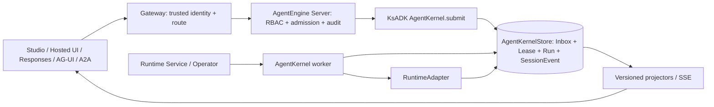

# Agent Runtime v2 Phase 1 Agent Kernel Implementation Plan

> **For agentic workers:** REQUIRED SUB-SKILL: Use superpowers:subagent-driven-development (recommended) or superpowers:executing-plans to implement this plan task-by-task. Steps use checkbox (`- [ ]`) syntax for tracking.

**Goal:** 在不改变现有 RuntimeAdapter 执行边界的前提下，冻结可长期演进的 AgentControlChannel、SessionEventEnvelope、ActivationLease 和 RuntimeCapabilityMatrix v1 合同，并在真实预发环境跑通“统一入口 → durable Inbox → fenced Runtime → 单一事件流 → 断线重放/恢复”的完整闭环。

**Architecture:** Phase 1 在 KsADK 内建立一个深模块 `AgentKernel`，对上只暴露 submit/status/subscribe，对下通过 `AgentKernelStore` 和既有 `RuntimeAdapter` 完成持久命令、激活租约、执行与事件追加。AgentEngine Server 负责稳定 AgentInstance、租户/RBAC/admission/audit，Runtime Service/Operator 负责把实例和协议配置投射到 Pod，Gateway 负责可信身份、路由和无缓冲流，ksadk-web/Studio 只消费统一 receipt/capability/cursor；所有事实只写一次 canonical SessionEvent Log。PostgreSQL 是预发所选的共享 Store Adapter，SQLite 是本地 Adapter，任何数据库都不是 wire protocol 的组成部分。

**Tech Stack:** Python 3.10+、Pydantic、asyncio、SQLite、PostgreSQL/asyncpg、FastAPI、SQLAlchemy 2、Go、Kubernetes CRD/Controller、React 19、TypeScript、Vitest、Playwright、Helm。

## Global Constraints

- Phase 0 必须先形成已验收 release manifest；Phase 1 不在未通过 RuntimeEvent v2、真实云部署、流式对话、Session Tags 和回滚门禁的基线上开发。
- `AgentControlChannel/v1`、`SessionEventEnvelope/v1`、`ActivationLease/v1`、`RuntimeCapabilityMatrix/v1` 在 Phase 1 首次预发部署前冻结；v1 只允许新增 optional 字段或新的 discriminated variant，禁止删字段、改名、复用旧字段含义或把 optional 改成 required。
- 收到未知 optional 字段时必须保留并透传；收到未知 command、event family 或 capability 时必须返回 typed `unsupported` 或保留 opaque envelope，禁止猜测降级。
- 一个 Session 只有一个 canonical append-only SessionEvent Log；ControlEvent 和 RuntimeEvent 是同一 Store 的 typed family，Server 的 ConversationEvent 只能是兼容读模型，不能成为第二份 canonical writer。
- durable command 必须 persist-before-ack；event 必须 persist-before-publish；`accepted` 只表示已经持久化，不表示已经执行。
- 同一 Session 普通输入 FIFO；不同 Session 可以并发；`steer`、`inject`、`pause` 等运行时不支持的能力必须 fail loud。
- Activation claim、worker 侧 Inbox claim、Run 状态和 RuntimeEvent append 必须在同一个 `AgentKernelStore` 一致性域内执行；旧 fencing token 的所有 owner 写入必须被拒绝。activation 建立前的 `control.command_accepted` 只能由 admission-authorized transaction 写入，不能借 `expected_fence=None` 绕过写权限。
- source 只用于归因，不能用于授权；授权结论在 Server admission 阶段生成不可伪造的 `authorization_ref`，Runtime 不信任公网 caller 自带的 tenant/account/instance header。
- 外部 API Key、用户登录态、内部 workload-signed AgentControl permit 和 Runtime 调第三方的 Secret 必须分离；禁止用一个长期 API Key 同时承担公网认证、Server→Runtime 信任和第三方凭据。
- `RuntimeAdapter` 继续负责命令已经送达后的框架执行；Phase 1 不引入 Phase 5 的 edge `ExecutionChannel`、register/reconnect/permit 协议。
- Phase 1 不引入完整 Plugin Host、Workflow、Scheduler、Job 或 Channel 产品；可以为这些 family 预留版本化 envelope，但不实现其业务状态机。
- 本地必须通过 InMemory/SQLite；预发必须使用现有共享 PostgreSQL；新增其他云存储只能实现同一 `AgentKernelStore` 合同和 conformance suite。
- 对公网的 Responses、AG-UI/A2A、Session history 和 Studio schema 继续独立版本化投影，canonical envelope 不直接暴露内部 metadata、authorization_ref、fencing token 或 Secret。
- 所有跨仓变更从 freshly fetched remote ref 建隔离 worktree：KsADK 基于已验收 Phase 0 commit，Server 基于 `origin/test`，Runtime Service 与 Operator 基于 `origin/master`，Gateway 与 ksadk-web 基于 `origin/main`；不得在现有 dirty checkout 上实施。
- 每个任务必须同时交付实现、合同/单元测试和可复核证据；每个仓库单独提交，跨仓 merge 顺序按本计划的依赖波次执行。

---

## 1. Phase 1 完成定义

Phase 1 只有在以下 12 条同时满足后才能标记完成：

1. AgentControlChannel、SessionEventEnvelope、ActivationLease、RuntimeCapabilityMatrix 四个 v1 合同存在 JSON Schema、Python 源类型、消费侧所需的 Go/TypeScript projection、golden fixtures 和稳定 SHA-256 digest。
2. 同一个 `command_id + idempotency_key` 重试只产生一个 Inbox 事实和一个执行结果。
3. 同 Session 的 100 条 `enqueue` 在多 worker 竞争下按 accepted seq 顺序 claim；不同 Session 能并发。
4. queue 达到配置上限返回 `queue_full`，不丢旧消息、不无限增长、不返回模糊 500。
5. Runtime 不支持 steer/inject/pause 时返回 `unsupported`，且不偷偷转换成 enqueue/cancel。
6. RuntimeEvent 与 ControlEvent 使用同一个 Session seq；live fold、replay fold、断线续传结果一致。
7. worker/Pod 重启后可以从 durable Inbox/Run/SessionEvent 恢复；有真实 continuation 时执行 attach/resume，没有时确定性收口为 interrupted/failed。
8. 两个 owner 竞争同一个 AgentInstance 时只有当前 lease/fencing token 能 claim 和 append；旧 owner 写入返回 `stale_fence` 并留下审计指标。
9. Studio/Hosted UI、Responses、AG-UI/A2A 和既有 RunAgent/ResumeRun/CancelRun 入口最终进入同一 AgentControl facade。
10. Server、Runtime Service、Operator、Gateway、KsADK 和 ksadk-web 的合同 digest 一致，readiness 能暴露不一致并阻断新流量。
11. 真实预发完成创建/部署、enqueue、流式结果、断线续传、pause/resume 或 typed unsupported、Pod kill 冷恢复、双 owner 拒写和版本回滚。
12. 预发证据包包含镜像 digest、Helm revision、跨仓 commit、contract digest、E2E 报告、关键 trace/event_id、回滚结果和已知非目标。

## 2. 协议冻结面

### 2.1 `AgentControlChannel/v1`

`AgentControlChannel/v1` 是 transport-neutral service contract，只冻结三个逻辑 operation：

```text
SubmitAgentControl(AgentControlCommand/v1) -> AgentControlReceipt/v1
GetAgentStatus(AgentStatusQuery/v1) -> AgentStatusSnapshot/v1
SubscribeSessionEvents(SessionEventSubscription/v1) -> stream SessionEventEnvelope/v1
```

每个 operation 都必须在 transport metadata 携带与 request `authorization_ref` 匹配的 AgentControlPermit。HTTP action、内部 client 或未来其他 transport 都只能映射这三个 operation，不能改变 permit、persist-before-ack、idempotency、cursor 和 typed error 语义。Phase 5 的 Runtime register/heartbeat/delivery 属于 `ExecutionChannel/v1`，不塞入 AgentControlChannel/v1。

```python
JsonValue = None | bool | int | float | str | list["JsonValue"] | dict[str, "JsonValue"]

class ControlSource(BaseModel):
    kind: Literal[
        "studio", "responses", "agui", "a2a", "parent_agent",
        "scheduler", "workflow", "channel", "system",
    ]
    ref: str

class AgentControlCommand(BaseModel):
    schema_version: Literal[1] = 1
    command_id: UUID
    idempotency_key: str
    tenant_id: str
    agent_instance_id: str
    session_id: str
    command_type: Literal[
        "enqueue", "steer", "inject", "interrupt",
        "pause", "resume", "submit_interaction",
    ]
    payload: dict[str, JsonValue]
    source: ControlSource
    authorization_ref: str
    submitted_at: datetime
    causation_id: str | None = None
    correlation_id: str | None = None

class AgentControlPermit(BaseModel):
    schema_version: Literal[1] = 1
    permit_id: str
    subject_ref: str
    tenant_id: str
    agent_instance_id: str
    session_id: str | None
    allowed_operations: list[Literal[
        "enqueue", "steer", "inject", "interrupt", "pause", "resume",
        "submit_interaction", "get_status", "subscribe_events",
    ]]
    issued_at: datetime
    expires_at: datetime
    nonce: str
    key_id: str
    alg: Literal["Ed25519"] = "Ed25519"
    claims_digest: str
    signature: str
```

`payload` 由 `command_type` 判别，v1 具体 shape 固定如下：

| command_type | required payload | optional payload |
| --- | --- | --- |
| `enqueue` | `content: JsonValue` | `reply_to: str` |
| `steer` | `content: JsonValue` | `run_id: str` |
| `inject` | `context: JsonValue` | `run_id: str` |
| `interrupt` | 无 | `run_id: str`、`reason: str` |
| `pause` | 无 | `run_id: str`、`reason: str` |
| `resume` | `target: {kind: "checkpoint"|"continuation"|"run", id: str}` | `input: JsonValue` |
| `submit_interaction` | `run_id: str`、`interaction_id: str`、`token_ref: str`、`response: JsonValue` | 无 |

content/context/response 必须满足对应 projector 的尺寸限制；`token_ref` 是一次性 interaction 授权引用，不是可持久化的原始 token。`command_id` 由入口生成并在网络重试时复用，`message_id` 由 Store 首次 acceptance 生成。

`authorization_ref` 必须等于同一次 internal request 携带的 `AgentControlPermit.permit_id`。permit 由 Server 使用 workload Ed25519 signing key 在 admission 后签发，有效期不超过 5 分钟；签名输入是除 signature 外字段的 key-sort、无多余空白 UTF-8 JSON，时间统一为 UTC RFC3339 秒精度，signature 使用无 padding base64url。Gateway 删除公网同名 header 后才转发；Runtime 在 operation 开始前按 JWKS/key_id 验证签名、时间、tenant/instance/session/operation/nonce。mutation acceptance 只持久化 permit_id 和 claims_digest，不持久化完整 bearer permit。命令一旦 accepted，worker 延迟执行依赖 durable admission decision，不在执行时因为 permit 已过期而丢弃合法命令。

`status` 和 `subscribe` 是只读 query，不进入 Inbox；它们分别使用 `AgentStatusQuery/v1` 和 `SessionEventSubscription/v1`。mutation 统一由 `submit(command)` 进入，避免七套浅 handler 演化成七种幂等和审计语义。

```python
class ControlError(BaseModel):
    code: str
    message: str
    retryable: bool
    details: dict[str, JsonValue] = Field(default_factory=dict)

class AgentControlReceipt(BaseModel):
    schema_version: Literal[1] = 1
    command_id: UUID
    status: Literal[
        "accepted", "duplicate", "rejected", "unsupported",
        "queue_full", "persistence_uncertain",
    ]
    message_id: UUID | None = None
    run_id: str | None = None
    accepted_seq: int | None = None
    error: ControlError | None = None

class AgentStatusQuery(BaseModel):
    schema_version: Literal[1] = 1
    tenant_id: str
    agent_instance_id: str
    authorization_ref: str
    session_id: str | None = None

class SessionEventSubscription(BaseModel):
    schema_version: Literal[1] = 1
    tenant_id: str
    agent_instance_id: str
    session_id: str
    authorization_ref: str
    after_seq: int = 0

class AgentStatusSnapshot(BaseModel):
    schema_version: Literal[1] = 1
    agent_instance_id: str
    instance_state: Literal["ready", "degraded", "unavailable"]
    session_id: str | None
    active_run_id: str | None
    active_run_state: Literal["pending", "running", "paused", "waiting"] | None
    inbox_depth: int
    activation_id: str | None
    lease_expires_at: datetime | None
    capability: "RuntimeCapabilityMatrix"
```

Receipt 约束：`accepted|duplicate` 必须包含同一个 message_id；`accepted_seq` 是 command acceptance 对应的 Session seq；`rejected|unsupported|queue_full|persistence_uncertain` 必须包含 error。`persistence_uncertain` 只用于调用方无法确认 commit 结果的网络/存储故障，重试必须复用原 command_id 和 idempotency_key。

### 2.2 `SessionEventEnvelope/v1`

```python
class SessionEventEnvelope(BaseModel):
    schema_version: Literal[1] = 1
    event_id: UUID
    session_id: str
    seq: int
    timestamp: datetime
    family: Literal[
        "control", "runtime", "workflow", "schedule", "job", "relationship",
    ]
    family_version: int
    event_type: str
    payload: dict[str, JsonValue]
    run_id: str | None = None
    causation_id: str | None = None
    correlation_id: str | None = None
    actor_ref: str | None = None
```

Phase 1 只产生 `control/v1` 和 `runtime/v2`。当 family=`runtime` 时，payload 必须通过现有 RuntimeEvent/v2 校验，且 RuntimeEvent 的 `seq` 与 envelope `seq` 相等。读取未知 family/event_type 时返回 opaque envelope；projector 可以忽略展示，但不得删除或改写事实。

`control/v1` 初始 event_type 固定为 `control.command_accepted`、`control.command_rejected`、`control.command_claimed`、`control.command_completed`、`control.command_discarded`、`control.activation_acquired`、`control.activation_renewed`、`control.activation_taken_over`、`control.activation_released` 和 `control.recovery_decided`。新增 event_type 是 additive 变更；既有 event_type 的 payload required 字段和语义不得改变。

Store 内部写入权限不是公网 wire，但必须是 typed guard，禁止使用裸布尔值或 nullable fence：

```python
class AdmissionWriteGuard(BaseModel):
    authorization_ref: str
    command_id: UUID

class ActivationWriteGuard(BaseModel):
    activation_id: str
    fencing_token: int

SessionEventWriteGuard = AdmissionWriteGuard | ActivationWriteGuard
WriteContext = ActivationWriteGuard
```

### 2.3 `ActivationLease/v1`

```python
class ActivationLease(BaseModel):
    schema_version: Literal[1] = 1
    agent_instance_id: str
    activation_id: str
    fencing_token: int
    lease_expires_at: datetime
    bundle_digest: str
    runtime_type: str
    capability_digest: str
```

`fencing_token` 对每个 AgentInstance 单调递增；renew 不换 token，lease 过期后的 takeover 必须换 activation_id 并增加 token。Inbox claim、Run transition、checkpoint/continuation 和 SessionEvent append 都带 token 并在事务内比较。

### 2.4 `RuntimeCapabilityMatrix/v1`

```python
class RuntimeCapability(BaseModel):
    supported: bool
    mode: Literal["native", "emulated", "unavailable"]
    reason: str | None = None

class RuntimeCapabilityMatrix(BaseModel):
    schema_version: Literal[1] = 1
    cancel: RuntimeCapability
    pause: RuntimeCapability
    resume: RuntimeCapability
    submit_interaction: RuntimeCapability
    attach: RuntimeCapability
    steer: RuntimeCapability
    inject: RuntimeCapability
    checkpoint: RuntimeCapability
    durable_restore: RuntimeCapability
    goal: RuntimeCapability | None = None
    loop: RuntimeCapability | None = None
    plan: RuntimeCapability | None = None
```

`supported=False` 必须配 `mode="unavailable"` 和稳定 reason code；`emulated` 只能用于语义完全等价且通过 conformance 的实现。Phase 1 禁止用 `emulated` 掩盖 enqueue 与 steer、cancel 与 pause 的语义差异。

`goal`、`loop`、`plan` 是 v1 的 additive optional 扩展，逐项使用 `RuntimeCapability` 表达：旧 runtime 可全部省略；Codex Runtime v2 三项均为原生能力；其他 runtime 不得仅因 UI 提供入口就推断支持。三项保持为顶层 capability，兼容既有 Server/Operator 对 matrix 的通用 key-value 投影。

## 3. 责任边界与数据流

| 组件 | Phase 1 直接责任 | 明确不负责 |
| --- | --- | --- |
| `ksadk-python` | 合同源、AgentKernel、Inbox/lease/event store adapters、RuntimeAdapter capability、worker/recovery、public projector | 租户 RBAC、Kubernetes 调度、外网可信身份 |
| `agentengine-server` | 稳定 AgentInstance、admission/RBAC、authorization_ref、命令审计、runtime endpoint/digest 目录 | canonical SessionEvent 双写、框架执行、lease CAS |
| `agent-runtime-service` | 把 AgentInstance、bundle/contract/capability 配置投射到 AgentRuntime CR，汇总 readiness | Session/Run 业务语义、Inbox 消费 |
| `agent-platform-operator` | 将配置注入 Pod，使用 Pod UID 形成 activation_id，投射 condition | AgentControl 语义、canonical store |
| `agentengine-gateway` | 可信 header、action allowlist、runtime route、SSE no-buffer/heartbeat/cursor | 身份来源自报、事件 reducer、持久化 |
| `ksadk-web` / Studio | receipt/capability/cursor 消费、连接恢复、明确 unsupported/queue_full 展示 | 生成 canonical event、推断后台是否成功 |



关键顺序是：Server admission 成功 → Runtime `submit` 在 Store 内追加 Inbox + ControlEvent → 返回 accepted receipt → 当前 fenced worker claim → RuntimeAdapter 执行 → RuntimeEvent 追加到同一 SessionEvent seq → projector/SSE 发布。任一网络重试都依赖 idempotency key，不依赖进程内 `_runs` 字典猜测状态。

## 4. 文件地图

计划中的路径均为对应仓库根目录相对路径。

| 仓库 | 新建/核心修改文件 | 单一责任 |
| --- | --- | --- |
| `ksadk-python` | `contracts/agent-kernel/v1/*.schema.json`、`ksadk/kernel/contracts.py` | wire contract 唯一源和 Python 类型 |
| `ksadk-python` | `ksadk/events/session_event.py`、`ksadk/events/canonical_store.py` | generic envelope 与 RuntimeEvent typed view |
| `ksadk-python` | `ksadk/kernel/store.py`、`memory_store.py`、`sqlite_store.py`、`postgres_store.py` | Store port 与本地/预发 adapters |
| `ksadk-python` | `ksadk/kernel/control.py`、`worker.py`、`recovery.py` | 小控制面、FIFO worker、fenced recovery |
| `ksadk-python` | `ksadk/runtime/adapter.py`、各 Runner/Adapter | typed capability 和真实执行映射 |
| `agentengine-server` | `app/models/agent_instance.py`、`app/services/agent_control_service.py`、`docs/migrations/20260817_agent_instance.sql` | stable instance、admission/audit、runtime client |
| `agent-runtime-service` | `api/datas/agents/agent_running.go`、`api/models/agent_runtime.go`、`controller/agentctl/agent_runtime.go` | control-plane 字段和 CR projection |
| `agent-platform-operator` | `api/v1/agentruntime_types.go`、`internal/controller/agentruntime_controller.go`、CRD YAML | Pod identity/env/readiness condition |
| `agentengine-gateway` | `app/api/endpoints.py`、`app/router_service.py`、`app/lifecycle.py` | action allowlist、trusted route、stream lifecycle |
| `ksadk-web` | `src/types/agent-control.ts`、`src/types/session-events.ts`、`src/core/run/engine.ts` | typed receipt/capability/event cursor |
| 跨仓验收 | `ksadk-python/tests/phase1/`、各仓合同测试、`docs/superpowers/evidence/phase1/` | contract digest、preprod E2E、回滚证据 |

## 5. 实施波次

| 波次 | 任务 | 可并行条件 | 合并门槛 |
| --- | --- | --- | --- |
| Gate | Task 0 | 不并行 | Phase 0 manifest 验证通过；隔离 worktree 和 commit 基线已记录 |
| A 合同冻结 | Task 1-2 | Task 2 等 Task 1 类型名冻结后开始 | golden fixtures、generic SessionEvent conformance 全绿 |
| B Kernel | Task 3-7 | Task 3/4 adapter 可并行；Task 5 可与之并行 | local+PG store、capability、worker、fencing/recovery 全绿 |
| C 入口与平台 | Task 8-12 | KsADK facade 稳定后跨仓并行 | 六仓 digest 一致；旧 API 兼容；readiness/gateway/UI 合同全绿 |
| D 预发 | Task 13 | 所有前置合并到各自预发基线 | 完成定义 12 条全部有证据并成功回滚演练 |

建议由 3 名直接 Owner（KsADK Kernel、Server/Runtime、Gateway/Web）加 SRE/安全兼职投入，关键路径约 6 周、总量约 38-55 人日：第 1 周完成 Gate/合同，第 2 周完成单日志与 Store，第 3 周完成 worker/fencing/recovery，第 4 周完成 KsADK ingress 和 Server/Runtime/Operator，第 5 周完成 Gateway/Web 与跨仓联调，第 6 周完成预发故障演练和回滚。如果只有 1 名主力工程师，按依赖串行执行应预留 8-10 周；不得通过删掉 PostgreSQL conformance、split-brain 或 rollback 验收来压缩时间。

---

### Task 0: 锁定 Phase 0 基线和跨仓实施工作区

**Files:**
- Create: `ksadk-python/scripts/build_phase1_baseline.py`
- Create: `ksadk-python/scripts/verify_phase1_baseline.py`
- Create: `ksadk-python/tests/release/test_phase1_baseline.py`
- Create: `ksadk-python/docs/superpowers/evidence/phase1/baseline.json`

**Interfaces:**
- Consumes: Phase 0 release manifest、六个仓库当前 remote refs、每仓干净 worktree 状态。
- Produces: `build_manifest(repo_roots: Mapping[str, Path]) -> Phase1Baseline` 和 `verify_manifest(path: Path) -> None`；输出包含 repo、remote、branch_base、commit_sha、dirty、contract_digest、phase0_gate_status、captured_at。

- [ ] **Step 1: 写 baseline 失败测试**

```python
def test_phase1_baseline_rejects_dirty_or_unaccepted_repo(tmp_path):
    manifest = make_manifest(phase0_gate_status="failed", dirty=True)
    path = write_manifest(tmp_path, manifest)
    with pytest.raises(BaselineError, match="phase0_not_accepted|dirty_worktree"):
        verify_manifest(path)
```

- [ ] **Step 2: 运行测试并确认失败**

Run: `uv run pytest tests/release/test_phase1_baseline.py -q`

Expected: FAIL，错误显示 `verify_manifest` 尚不存在。

- [ ] **Step 3: 实现 baseline 生成与校验**

`build_phase1_baseline.py` 对映射中的每个 `repo_root` 执行 `git -C "$repo_root" rev-parse HEAD`、`status --porcelain=v1`、`remote get-url` 读取事实；KsADK 的 `phase0_gate_status` 必须来自 Phase 0 release manifest 的 `accepted=true`，不能由命令行布尔参数伪造。`verify_phase1_baseline.py` 拒绝 dirty、缺 commit、缺 remote、未验收 Phase 0 和重复 repo key。

```python
@dataclass(frozen=True)
class RepoBaseline:
    repo: str
    remote: str
    branch_base: str
    commit_sha: str
    dirty: bool

def verify_manifest(path: Path) -> None:
    baseline = Phase1Baseline.model_validate_json(path.read_text())
    if not baseline.phase0.accepted:
        raise BaselineError("phase0_not_accepted")
    if any(repo.dirty for repo in baseline.repositories):
        raise BaselineError("dirty_worktree")
```

- [ ] **Step 4: 从实际 worktree 生成 manifest 并校验**

Run: `uv run python scripts/build_phase1_baseline.py --workspace /Users/xiayu/kingsoft/code/agent-sdk --output docs/superpowers/evidence/phase1/baseline.json`

Expected: 在 Phase 0 尚未验收时明确退出 `phase0_not_accepted`；Phase 0 验收后生成全是 40 位 commit SHA 的 JSON。

- [ ] **Step 5: 建立各仓隔离 worktree**

执行前先对每仓 `git fetch --all --prune`，再从 baseline 中记录的 commit 建 `feat/agent-kernel-phase1` 工作树；如果分支名已存在，先检查它是否指向同一 baseline，禁止强制覆盖。生成后的每仓 `git status --short` 必须为空。

- [ ] **Step 6: 运行通过并提交**

Run: `uv run pytest tests/release/test_phase1_baseline.py -q && uv run python scripts/verify_phase1_baseline.py docs/superpowers/evidence/phase1/baseline.json`

Expected: PASS，输出六仓 commit、Phase 0 manifest digest 和 `baseline_verified`。

```bash
git add scripts/build_phase1_baseline.py scripts/verify_phase1_baseline.py tests/release/test_phase1_baseline.py docs/superpowers/evidence/phase1/baseline.json
git commit -m "chore: lock phase1 cross-repo baseline"
```

### Task 1: 冻结 Agent Kernel v1 合同和 golden fixtures

**Files:**
- Create: `ksadk-python/contracts/agent-kernel/v1/agent-control.schema.json`
- Create: `ksadk-python/contracts/agent-kernel/v1/session-event.schema.json`
- Create: `ksadk-python/contracts/agent-kernel/v1/activation-lease.schema.json`
- Create: `ksadk-python/contracts/agent-kernel/v1/runtime-capability.schema.json`
- Create: `ksadk-python/contracts/agent-kernel/v1/fixtures/agent-control.json`
- Create: `ksadk-python/contracts/agent-kernel/v1/fixtures/session-event-control.json`
- Create: `ksadk-python/contracts/agent-kernel/v1/fixtures/session-event-runtime.json`
- Create: `ksadk-python/contracts/agent-kernel/v1/fixtures/activation-lease.json`
- Create: `ksadk-python/contracts/agent-kernel/v1/fixtures/runtime-capability.json`
- Create: `ksadk-python/contracts/agent-kernel/v1/fixtures/agent-control-permit.json`
- Create: `ksadk-python/ksadk/kernel/contracts.py`
- Create: `ksadk-python/ksadk/kernel/errors.py`
- Create: `ksadk-python/ksadk/kernel/__init__.py`
- Create: `ksadk-python/scripts/export_agent_kernel_contracts.py`
- Test: `ksadk-python/tests/kernel/test_contracts.py`
- Test: `ksadk-python/tests/contracts/test_agent_kernel_schema_compatibility.py`

**Interfaces:**
- Consumes: 本计划第 2 节的四个冻结合同。
- Produces: `AgentControlChannel/v1` 的三个 operation 及 `AgentControlCommand`、`AgentControlPermit`、`AgentControlReceipt`、`AgentStatusQuery`、`AgentStatusSnapshot`、`SessionEventSubscription`，以及 `SessionEventEnvelope`、`ActivationLease`、`RuntimeCapabilityMatrix`；`contract_digest(contract_dir: Path) -> str`；稳定错误码 `invalid_command`、`invalid_permit`、`unsupported`、`queue_full`、`stale_fence`、`persistence_uncertain`、`contract_mismatch`。

- [ ] **Step 1: 写 round-trip、未知字段和非法 breaking shape 的失败测试**

```python
def test_unknown_optional_fields_round_trip_without_loss():
    raw = load_fixture("agent-control-enqueue.json") | {"future_hint": {"x": 1}}
    parsed = AgentControlCommand.model_validate(raw)
    assert parsed.model_dump(mode="json")["future_hint"] == {"x": 1}

def test_runtime_event_envelope_requires_family_version_two():
    raw = load_fixture("session-event-runtime.json") | {"family_version": 1}
    with pytest.raises(ValidationError):
        SessionEventEnvelope.model_validate(raw)
```

- [ ] **Step 2: 运行测试并确认失败**

Run: `uv run pytest tests/kernel/test_contracts.py tests/contracts/test_agent_kernel_schema_compatibility.py -q`

Expected: FAIL，缺少 `ksadk.kernel.contracts` 和 schema files。

- [ ] **Step 3: 实现 Pydantic discriminated contracts**

所有 envelope 使用 `extra="allow"` 保存未知 optional 字段；payload 按 command_type 做独立模型；`enqueue/steer/inject` 必须有非空 content，`interrupt/pause` 可选 run_id，`resume` 必须有 target，`submit_interaction` 必须有 interaction_id 和一次性 token reference。错误对象仅有 `code`、`message`、`retryable`、`details`，details 禁止包含 Secret 和 authorization token。

```python
class WireModel(BaseModel):
    model_config = ConfigDict(extra="allow", frozen=True)

class EnqueuePayload(WireModel):
    content: JsonValue
    reply_to: str | None = None

class SteerPayload(WireModel):
    content: JsonValue
    run_id: str | None = None

class InjectPayload(WireModel):
    context: JsonValue
    run_id: str | None = None

class InterruptPayload(WireModel):
    run_id: str | None = None
    reason: str | None = None

class PausePayload(WireModel):
    run_id: str | None = None
    reason: str | None = None

class ResumeTarget(WireModel):
    kind: Literal["checkpoint", "continuation", "run"]
    id: str

class ResumePayload(WireModel):
    target: ResumeTarget
    input: JsonValue = None

class SubmitInteractionPayload(WireModel):
    run_id: str
    interaction_id: str
    token_ref: str
    response: JsonValue
```

- [ ] **Step 4: 写四份 Draft 2020-12 JSON Schema 和 golden fixtures**

fixtures 至少包含七种 command、合法/过期/篡改 permit、六种 receipt、control/runtime 两种 event、lease acquire/renew/takeover、native/unavailable capability；每个 fixture 都要被 Pydantic 与 JSON Schema 双重校验。

```json
{
  "schema_version": 1,
  "command_id": "4bf84e1b-f4cd-4c55-907f-2dc5e676b119",
  "idempotency_key": "studio:s1:message-1",
  "tenant_id": "tenant-1",
  "agent_instance_id": "agent-instance-1",
  "session_id": "session-1",
  "command_type": "enqueue",
  "payload": {"content": {"text": "hello"}},
  "source": {"kind": "studio", "ref": "local-studio"},
  "authorization_ref": "permit-1",
  "submitted_at": "2026-08-17T00:00:00Z"
}
```

- [ ] **Step 5: 实现 canonical export 与 digest**

`export_agent_kernel_contracts.py` 对 schema 和 fixtures 做 UTF-8、key sort、LF 规范化，再按相对路径排序计算 SHA-256；输出 `manifest.json`，包含 `contract_set="agent-kernel/v1"`、每文件 digest 和 aggregate digest。

```python
def contract_digest(contract_dir: Path) -> str:
    aggregate = hashlib.sha256()
    for path in sorted(p for p in contract_dir.rglob("*") if p.is_file() and p.name != "manifest.json"):
        canonical = json.dumps(json.loads(path.read_text()), sort_keys=True, separators=(",", ":")).encode()
        aggregate.update(path.relative_to(contract_dir).as_posix().encode() + b"\0" + canonical)
    return aggregate.hexdigest()
```

- [ ] **Step 6: 添加 breaking-change gate**

兼容性测试把当前 schema 与 `contracts/agent-kernel/v1/manifest.json` 比较：删除 property、收窄 enum、增加 required、改变 type 或改变已有 fixture 结果均失败；新增 optional property 或新 variant 允许但必须更新 manifest 并由架构 Owner review。

```python
def assert_additive_only(old: dict, new: dict) -> None:
    assert set(old.get("required", [])) == set(new.get("required", []))
    assert set(old.get("properties", {})) <= set(new.get("properties", {}))
    for name, schema in old.get("properties", {}).items():
        assert new["properties"][name].get("type") == schema.get("type")
```

- [ ] **Step 7: 运行合同门禁并提交**

Run: `uv run pytest tests/kernel/test_contracts.py tests/contracts/test_agent_kernel_schema_compatibility.py -q && uv run python scripts/export_agent_kernel_contracts.py --check`

Expected: PASS，输出一个 64 位 aggregate digest。

```bash
git add contracts/agent-kernel ksadk/kernel scripts/export_agent_kernel_contracts.py tests/kernel tests/contracts/test_agent_kernel_schema_compatibility.py
git commit -m "feat: freeze agent kernel v1 contracts"
```

### Task 2: 把 RuntimeEventStore 收敛为单一 SessionEvent Store 的 typed view

**Files:**
- Create: `ksadk-python/ksadk/events/session_event.py`
- Modify: `ksadk-python/ksadk/events/canonical_store.py`
- Modify: `ksadk-python/ksadk/sessions/base.py`
- Test: `ksadk-python/tests/events/test_session_event_store.py`
- Modify: `ksadk-python/tests/events/test_runtime_event_store.py`
- Modify: `ksadk-python/tests/events/test_canonical_runtime_event.py`

**Interfaces:**
- Consumes: `SessionEventEnvelope`、现有 `RuntimeEvent`/`RuntimeEventStore`、Session backend 的原子 seq 能力。
- Produces: `SessionEventStore.append(envelope, *, guard: SessionEventWriteGuard) -> SessionEventEnvelope`、`read(session_id, after_seq, limit) -> list[SessionEventEnvelope]`、`subscribe(session_id, after_seq) -> AsyncIterator[SessionEventEnvelope]`；`SessionEventWriteGuard = AdmissionWriteGuard | ActivationWriteGuard`；`RuntimeEventStore` 只包装 family=`runtime`, family_version=2 且只接受 ActivationWriteGuard。

- [ ] **Step 1: 写单日志和 seq 失败测试**

```python
async def test_control_and_runtime_share_one_monotonic_cursor(store):
    accepted = await store.append(control_event(), guard=admission_guard())
    runtime = await RuntimeEventStore(store).append(runtime_event(), guard=activation_guard(fence=7))
    assert (accepted.seq, runtime.seq) == (1, 2)
    assert [e.family for e in await store.read("s1", 0, 10)] == ["control", "runtime"]
```

- [ ] **Step 2: 运行测试并确认失败**

Run: `uv run pytest tests/events/test_session_event_store.py tests/events/test_runtime_event_store.py -q`

Expected: FAIL，当前 store 只接受 RuntimeEvent 且没有 generic envelope。

- [ ] **Step 3: 实现 generic append/read/subscribe port**

复用 Session backend 的原子 per-session seq；`event_id` 全局唯一、`(session_id, seq)` 唯一；append 以 Store 分配的 seq 覆盖调用方未持久化 seq。AdmissionWriteGuard 只允许 admission 产生的 control accepted/rejected，ActivationWriteGuard 比较 activation_id/fence 后允许 worker/control/runtime facts；禁止无 guard append。publish 只能在 transaction commit 后发生；订阅先 replay `seq > after_seq`，再切 live，切换窗口用同一 cursor 去重。

```python
class SessionEventStore(Protocol):
    async def append(
        self, envelope: SessionEventEnvelope, *, guard: SessionEventWriteGuard
    ) -> SessionEventEnvelope:
        raise NotImplementedError
    async def read(self, session_id: str, after_seq: int, limit: int) -> list[SessionEventEnvelope]:
        raise NotImplementedError
    def subscribe(self, session_id: str, after_seq: int) -> AsyncIterator[SessionEventEnvelope]:
        raise NotImplementedError
```

- [ ] **Step 4: 将 RuntimeEventStore 改成 typed view**

包装时校验 family/version/RuntimeEvent payload；RuntimeEvent payload 的 seq 与 envelope seq 一起在持久化后确定。保留现有 public method 的兼容 wrapper，调用方无需同时写旧 SessionEvent carrier 和新 envelope。

```python
class RuntimeEventStore:
    def __init__(self, store: SessionEventStore) -> None:
        self._store = store

    async def append(self, event: RuntimeEvent, *, guard: ActivationWriteGuard) -> RuntimeEvent:
        persisted = await self._store.append(runtime_envelope(event), guard=guard)
        return RuntimeEvent.model_validate(persisted.payload | {"seq": persisted.seq})
```

- [ ] **Step 5: 为 InMemory、SQLite、PostgreSQL Session backend 跑 conformance**

Run: `uv run pytest tests/events/test_session_event_store.py tests/events/test_runtime_event_store.py tests/test_postgres_session_service.py -q`

Expected: PASS；PostgreSQL 测试无连接时按项目惯例 skip，有测试 DSN 时必须执行并验证并发 seq 无重复。

- [ ] **Step 6: 扫描并禁止 canonical 双写**

在 `tests/architecture/test_runtime_boundaries.py` 加静态约束：Runtime pipeline 只能依赖 `RuntimeEventStore(SessionEventStore)`；禁止直接同时调用 Session service event append 和 canonical store append。

```python
def test_runtime_pipeline_has_one_canonical_writer():
    source = Path("ksadk/events/pipeline.py").read_text()
    assert "RuntimeEventStore" in source
    assert "session_service.append_event" not in source
```

- [ ] **Step 7: 提交**

```bash
git add ksadk/events/session_event.py ksadk/events/canonical_store.py ksadk/sessions/base.py tests/events tests/architecture/test_runtime_boundaries.py
git commit -m "refactor: unify runtime facts in session event store"
```

### Task 3: 实现 AgentKernelStore 与 InMemory/SQLite durable Inbox

**Files:**
- Create: `ksadk-python/ksadk/kernel/store.py`
- Create: `ksadk-python/ksadk/kernel/memory_store.py`
- Create: `ksadk-python/ksadk/kernel/sqlite_store.py`
- Create: `ksadk-python/ksadk/kernel/state.py`
- Test: `ksadk-python/tests/kernel/store_conformance.py`
- Test: `ksadk-python/tests/kernel/test_memory_store.py`
- Test: `ksadk-python/tests/kernel/test_sqlite_store.py`

**Interfaces:**
- Consumes: Task 1 contracts、Task 2 `SessionEventStore`。
- Produces: `AgentKernelStore.accept_command`、`claim_next`、`complete_claim`、`acquire_activation`、`renew_activation`、`release_activation`、`append_event`、`load_run`、`save_run_transition`；所有 mutation 接受 `expected_fence: int`。

- [ ] **Step 1: 写 Store conformance 失败测试**

```python
async def assert_fifo_and_idempotency(store):
    r1 = await store.accept_command(command("k1", "first"), queue_limit=2)
    r1_retry = await store.accept_command(command("k1", "first"), queue_limit=2)
    r2 = await store.accept_command(command("k2", "second"), queue_limit=2)
    assert r1_retry.status == "duplicate"
    lease = await store.acquire_activation(lease_request("a1"))
    assert (await store.claim_next("agent-1", "s1", lease.fencing_token)).message_id == r1.message_id
    assert (await store.claim_next("agent-1", "s1", lease.fencing_token)).message_id == r2.message_id
```

- [ ] **Step 2: 运行并确认失败**

Run: `uv run pytest tests/kernel/test_memory_store.py tests/kernel/test_sqlite_store.py -q`

Expected: FAIL，缺少 AgentKernelStore implementations。

- [ ] **Step 3: 定义状态和事务不变量**

Inbox 状态固定为 `accepted -> claimed -> completed|discarded`；Run 状态固定为 `pending -> running -> paused|waiting|completed|failed|cancelled|interrupted`，终态 first-wins。一个 Session 同时最多一个 running/paused/waiting Run；同一 idempotency key 的 request digest 不同返回 `rejected/idempotency_conflict`。

```python
class InboxState(StrEnum):
    ACCEPTED = "accepted"
    CLAIMED = "claimed"
    COMPLETED = "completed"
    DISCARDED = "discarded"

TERMINAL_RUN_STATES = frozenset({"completed", "failed", "cancelled", "interrupted"})
```

- [ ] **Step 4: 实现 InMemory adapter**

以 per-agent/per-session asyncio locks 保证测试语义；它只用于单进程开发和 conformance，不宣称跨进程 durable。所有 accept/claim/transition 同步追加对应 `ControlEvent/v1`。

```python
async def accept_command(self, command, admission, queue_limit):
    async with self._session_lock(command.session_id):
        duplicate = self._find_idempotent(command)
        if duplicate:
            return duplicate.receipt(status="duplicate")
        return self._accept_with_control_event(command, admission, queue_limit)
```

- [ ] **Step 5: 实现 SQLite schema 与 adapter**

新增 `kernel_inbox`、`kernel_runs`、`kernel_activations` 表；使用 WAL 和 `BEGIN IMMEDIATE` 实现 CAS。索引至少覆盖 `(agent_instance_id, session_id, status, accepted_seq)`、`(session_id, idempotency_key)` 和 lease expiry。schema migration 有整数版本，重复启动幂等。

```sql
CREATE TABLE kernel_inbox (
  message_id TEXT PRIMARY KEY,
  agent_instance_id TEXT NOT NULL,
  session_id TEXT NOT NULL,
  idempotency_key TEXT NOT NULL,
  request_digest TEXT NOT NULL,
  accepted_seq INTEGER NOT NULL,
  status TEXT NOT NULL CHECK (status IN ('accepted','claimed','completed','discarded')),
  claimed_fence INTEGER,
  payload_json TEXT NOT NULL,
  UNIQUE(session_id, idempotency_key)
);
```

- [ ] **Step 6: 验证 queue_full、并发 FIFO 和 crash reclaim**

Run: `uv run pytest tests/kernel/test_memory_store.py tests/kernel/test_sqlite_store.py -q -k 'fifo or idempotency or queue_full or reclaim or terminal'`

Expected: PASS；并发 100 条无丢失/重复，过期 claim 只能由更高 fence 的 owner reclaim。

- [ ] **Step 7: 提交**

```bash
git add ksadk/kernel/store.py ksadk/kernel/memory_store.py ksadk/kernel/sqlite_store.py ksadk/kernel/state.py tests/kernel
git commit -m "feat: add durable local agent kernel store"
```

### Task 4: 实现预发 PostgreSQL AgentKernelStore 和事务 fencing

**Files:**
- Create: `ksadk-python/ksadk/kernel/postgres_store.py`
- Create: `ksadk-python/ksadk/kernel/sql/001_agent_kernel.sql`
- Create: `ksadk-python/tests/kernel/test_postgres_store.py`
- Modify: `ksadk-python/tests/kernel/store_conformance.py`
- Modify: `ksadk-python/pyproject.toml`

**Interfaces:**
- Consumes: Task 3 `AgentKernelStore` port/conformance；现有 asyncpg 可选依赖和 Postgres Session backend 配置。
- Produces: `PostgresAgentKernelStore(pool, session_event_store)`；同一事务完成 lease CAS、Inbox claim/Run transition 和 SessionEvent append。

- [ ] **Step 1: 写双 owner 和旧 writer 失败测试**

```python
async def test_takeover_fences_old_owner(pg_store):
    old = await pg_store.acquire_activation(lease_request("pod-a"))
    await expire_lease(pg_store, old)
    new = await pg_store.acquire_activation(lease_request("pod-b"))
    assert new.fencing_token == old.fencing_token + 1
    with pytest.raises(StaleFenceError):
        await pg_store.append_event(runtime_envelope(), expected_fence=old.fencing_token)
```

- [ ] **Step 2: 运行并确认失败**

Run: `KSADK_TEST_POSTGRES_DSN="$KSADK_TEST_POSTGRES_DSN" uv run pytest tests/kernel/test_postgres_store.py -q`

Expected: FAIL，缺少 Postgres adapter；没有 DSN 时测试明确 skip，CI/预发门禁必须提供 DSN，不能以 skip 判定通过。

- [ ] **Step 3: 建表和约束**

SQL 使用 `BIGINT fencing_token`、`TIMESTAMPTZ lease_expires_at`、`JSONB payload`；`kernel_inbox` 唯一 `(tenant_id, session_id, idempotency_key)`；claim 用 `FOR UPDATE SKIP LOCKED` 但仍以 accepted_seq 排序；activation takeover 用 `INSERT ... ON CONFLICT ... DO UPDATE ... WHERE lease_expires_at <= now()` 并原子 `fencing_token + 1`。

```sql
SELECT message_id
FROM kernel_inbox
WHERE agent_instance_id = $1 AND session_id = $2 AND status = 'accepted'
ORDER BY accepted_seq
FOR UPDATE SKIP LOCKED
LIMIT 1;
```

- [ ] **Step 4: 实现 compare-fence transaction helper**

每个 writer 事务第一步 `SELECT fencing_token, lease_expires_at ... FOR SHARE`，同时比较 activation_id、token 和 expiry；不匹配抛 `StaleFenceError`，事务回滚，不能先写 event 再报错。

```python
async def _assert_fence(conn, guard: ActivationWriteGuard) -> None:
    row = await conn.fetchrow(ACTIVATION_FOR_SHARE_SQL, guard.activation_id)
    if row is None or row["fencing_token"] != guard.fencing_token or row["lease_expires_at"] <= datetime.now(UTC):
        raise StaleFenceError("stale_fence")
```

- [ ] **Step 5: 跑进程级并发和故障注入**

启动两个独立 Python process 争抢同一 AgentInstance；在 accept commit 后、ack 前断连接，重试必须返回 duplicate；在 append commit 前 kill writer，不得出现 Inbox claimed 但 ControlEvent 缺失的半状态。

- [ ] **Step 6: 跑完整 conformance 和提交**

Run: `KSADK_TEST_POSTGRES_DSN="$KSADK_TEST_POSTGRES_DSN" uv run pytest tests/kernel/test_postgres_store.py tests/kernel/test_sqlite_store.py tests/events/test_session_event_store.py -q`

Expected: PASS，Postgres 测试实际执行数大于 0。

```bash
git add ksadk/kernel/postgres_store.py ksadk/kernel/sql/001_agent_kernel.sql tests/kernel/test_postgres_store.py tests/kernel/store_conformance.py pyproject.toml
git commit -m "feat: add fenced postgres agent kernel store"
```

### Task 5: 把 Runtime capability 改为 typed/versioned matrix

**Files:**
- Modify: `ksadk-python/ksadk/runtime/adapter.py`
- Modify: `ksadk-python/ksadk/runtime/executor.py`
- Modify: `ksadk-python/ksadk/runtime/framework_adapters.py`
- Modify: `ksadk-python/ksadk/runtime/runner_adapter.py`
- Modify: `ksadk-python/ksadk/codex/runtime.py`
- Modify: `ksadk-python/ksadk/a2a/executor.py`
- Create: `ksadk-python/tests/runtime/test_capability_matrix.py`
- Modify: `ksadk-python/tests/agui/test_runtime_adapter.py`
- Modify: `ksadk-python/tests/a2a/test_executor_resume_runtime_adapter.py`

**Interfaces:**
- Consumes: `RuntimeCapabilityMatrix` contract、现有 `RuntimeAdapter.native_capabilities()`。
- Produces: `RuntimeAdapter.capabilities() -> RuntimeCapabilityMatrix`；旧 `native_capabilities() -> dict[str, object]` 保留一个发布周期并由 typed matrix 单向投影。

- [ ] **Step 1: 写诚实 capability 失败测试**

```python
def test_steer_is_not_inferred_from_start(adapter):
    matrix = adapter.capabilities()
    assert matrix.steer.supported is False
    assert matrix.steer.mode == "unavailable"
    assert matrix.steer.reason == "runtime_no_native_steer"
```

- [ ] **Step 2: 运行并确认失败**

Run: `uv run pytest tests/runtime/test_capability_matrix.py tests/agui/test_runtime_adapter.py tests/a2a/test_executor_resume_runtime_adapter.py -q`

Expected: FAIL，当前 capability 是无版本 dict。

- [ ] **Step 3: 给 base adapter 增加 typed matrix**

默认全部 unavailable；cancel/pause/resume/submit/attach/checkpoint 只有实现覆写且 conformance 通过时标 supported。`durable_restore` 需要 checkpoint/continuation 真正跨进程可用，不能只因内存 `_runs` 中有 handle 就为 true。

```python
class RuntimeAdapter(ABC):
    def capabilities(self) -> RuntimeCapabilityMatrix:
        unavailable = RuntimeCapability(supported=False, mode="unavailable", reason="not_implemented")
        return RuntimeCapabilityMatrix(
            cancel=unavailable, pause=unavailable, resume=unavailable,
            submit_interaction=unavailable, attach=unavailable, steer=unavailable,
            inject=unavailable, checkpoint=unavailable, durable_restore=unavailable,
        )
```

- [ ] **Step 4: 逐个校准 ADK/LangGraph/Codex/A2A**

每个 adapter 增加一张明确矩阵和 reason code；测试调用真实 method 路径验证 supported 声明，未实现的方法必须抛 `UnsupportedControlError`，禁止返回空成功。

```python
def assert_capability_matches_method(adapter: RuntimeAdapter, name: str) -> None:
    capability = getattr(adapter.capabilities(), name)
    method = getattr(adapter, name)
    if capability.supported:
        assert method.__func__ is not getattr(RuntimeAdapter, name)
    else:
        with pytest.raises(UnsupportedControlError):
            invoke_with_fixture(method, name)
```

- [ ] **Step 5: 保持旧 API 单向兼容**

`native_capabilities()` 从 matrix 生成旧 key，不允许旧 dict 反向覆盖 matrix；Server/Studio 新代码只读 v1 matrix。

```python
def native_capabilities(self) -> dict[str, object]:
    matrix = self.capabilities()
    names = ("cancel", "pause", "resume", "submit_interaction", "attach", "steer", "inject", "checkpoint", "durable_restore")
    return {name: getattr(matrix, name).supported for name in names}
```

- [ ] **Step 6: 运行并提交**

Run: `uv run pytest tests/runtime/test_capability_matrix.py tests/runners/test_runtime_resume_cancel_e2e.py tests/agui/test_runtime_adapter.py tests/a2a/test_executor_resume_runtime_adapter.py -q`

Expected: PASS，每个 runtime 的 unsupported 项都有稳定 reason。

```bash
git add ksadk/runtime ksadk/runners ksadk/a2a tests/runtime tests/runners tests/agui tests/a2a
git commit -m "feat: publish typed runtime capability matrix"
```

### Task 6: 实现深模块 AgentKernel control facade 和 FIFO worker

**Files:**
- Create: `ksadk-python/ksadk/kernel/control.py`
- Create: `ksadk-python/ksadk/kernel/worker.py`
- Create: `ksadk-python/ksadk/kernel/mapping.py`
- Create: `ksadk-python/ksadk/kernel/authorization.py`
- Modify: `ksadk-python/ksadk/kernel/__init__.py`
- Modify: `ksadk-python/ksadk/runtime/executor.py`
- Test: `ksadk-python/tests/kernel/test_control.py`
- Test: `ksadk-python/tests/kernel/test_worker.py`
- Test: `ksadk-python/tests/kernel/test_control_audit.py`
- Test: `ksadk-python/tests/kernel/test_authorization.py`

**Interfaces:**
- Consumes: `AgentKernelStore`、`RuntimeAdapter.capabilities()`、Task 1 contracts、Server workload JWKS。
- Produces: `AgentKernel.submit(command, *, permit) -> AgentControlReceipt`、`status(query, *, permit) -> AgentStatusSnapshot`、`subscribe(subscription, *, permit) -> AsyncIterator[SessionEventEnvelope]`；`AgentKernelWorker.run_once(agent_instance_id, activation) -> WorkResult`。

`WorkResult` 固定包含 `outcome: idle|claimed|completed|retryable_failure|terminal_failure`、`message_id`、`run_id` 和 `last_seq`；idle 时后三项可为空。它是进程内调度结果，不作为公网协议。

- [ ] **Step 1: 写 persist-before-ack 和 unsupported 失败测试**

```python
async def test_submit_acks_only_after_inbox_and_event_commit(kernel, store):
    receipt = await kernel.submit(enqueue_command(), permit=valid_permit("enqueue"))
    assert receipt.status == "accepted"
    assert await store.has_inbox(receipt.message_id)
    assert (await store.read("s1", 0, 1))[0].event_type == "control.command_accepted"

async def test_steer_does_not_fall_back_to_enqueue(kernel):
    receipt = await kernel.submit(steer_command(), permit=valid_permit("steer"))
    assert (receipt.status, receipt.error.code) == ("unsupported", "runtime_no_native_steer")
```

- [ ] **Step 2: 运行并确认失败**

Run: `uv run pytest tests/kernel/test_control.py tests/kernel/test_worker.py tests/kernel/test_control_audit.py tests/kernel/test_authorization.py -q`

Expected: FAIL，AgentKernel facade 尚不存在。

- [ ] **Step 3: 实现 submit/status/subscribe 小接口**

`submit` 校验 capability、queue limit、authorization_ref 和 idempotency，再调用单个 Store transaction；`status` 只读 Agent/Session/active Run/Inbox depth/current lease/capability digest，不创建 Run；`subscribe` 直接委托 SessionEventStore cursor。

```python
class AgentKernel:
    async def submit(self, command: AgentControlCommand, *, permit: AgentControlPermit) -> AgentControlReceipt:
        admission = await self._permit_verifier.verify(permit, command, command.command_type, self._clock.now())
        return await self._store.accept_command(command, admission, self._queue_limit)

    async def status(self, query: AgentStatusQuery, *, permit: AgentControlPermit) -> AgentStatusSnapshot:
        await self._permit_verifier.verify(permit, query, "get_status", self._clock.now())
        return await self._store.status(query)
```

- [ ] **Step 4: 实现 permit verifier**

`AgentControlPermitVerifier.verify(permit, request, operation, now) -> VerifiedAdmission` 使用缓存 JWKS/key_id 验证 Ed25519 签名和 claims；缓存有明确 max-age，未知 key 刷新一次，刷新失败 fail closed。验证成功只将 permit_id、subject_ref 和 claims_digest 交给 Store。mutation 的相同 nonce 只允许同一 command_id/idempotency_key 的网络重试；被另一 request 复用、operation 越权、tenant/session 不符返回 `rejected/invalid_permit`，只写脱敏 audit metric，不能进入 Inbox。permit 已过期时，只有 Store 已存在完全相同 command/request/claims digest 才能返回 duplicate；任何新 mutation 和 query 都拒绝。

```python
public_key.verify(base64url_decode(permit.signature), canonical_permit_bytes(permit))
if operation not in permit.allowed_operations:
    raise InvalidPermitError("operation_not_allowed")
if (permit.tenant_id, permit.agent_instance_id) != (request.tenant_id, request.agent_instance_id):
    raise InvalidPermitError("resource_binding_mismatch")
```

- [ ] **Step 5: 实现 command-to-RuntimeAdapter 映射**

`enqueue -> start` 仅在没有 active Run 时执行；`steer/inject` 传给明确的 native adapter method；`interrupt -> cancel`；`pause -> pause`；`resume -> resume/attach`；`submit_interaction -> submit`。每条命令写 claimed、completed/rejected/discarded ControlEvent，并使用 causation_id=command_id。

```python
COMMAND_HANDLERS = {
    "enqueue": "start",
    "steer": "steer",
    "inject": "inject",
    "interrupt": "cancel",
    "pause": "pause",
    "resume": "resume",
    "submit_interaction": "submit",
}
```

- [ ] **Step 6: 实现 per-session FIFO worker**

worker 持有 activation lease 才能 claim；按 accepted_seq claim，active Run 存在时只执行允许作用于该 Run 的控制命令，普通 enqueue 保持队列。异常分为 retryable transport、typed runtime rejection 和 terminal failure，不把未知异常 ack 为成功。

```python
async def run_once(self, agent_instance_id: str, activation: ActivationLease) -> WorkResult:
    command = await self._store.claim_next(agent_instance_id, activation.fencing_token)
    if command is None:
        return WorkResult(outcome="idle")
    return await self._execute_claim(command, activation)
```

- [ ] **Step 7: 从 RuntimeExecutor 移除进程内 owner 真相**

`_runs` 可保留为当前进程 handle cache，但 status、幂等、恢复资格和 owner 判断全部读取 Store；cache miss 不能等价于 Run 不存在。

```python
async def resolve_run(self, run_id: str) -> DurableRun:
    durable = await self._store.load_run(run_id)
    if durable is None:
        raise RunNotFoundError(run_id)
    durable.live_handle = self._runs.get(run_id)
    return durable
```

- [ ] **Step 8: 跑多 Session 并发、permit 和审计测试**

Run: `uv run pytest tests/kernel/test_control.py tests/kernel/test_worker.py tests/kernel/test_control_audit.py tests/kernel/test_authorization.py -q -k 'fifo or concurrent or permit or audit or unsupported or queue_full'`

Expected: PASS；同 Session 顺序稳定，不同 Session 至少两个 adapter call overlap。

- [ ] **Step 9: 提交**

```bash
git add ksadk/kernel ksadk/runtime/executor.py tests/kernel
git commit -m "feat: add durable agent control kernel"
```

### Task 7: 接通 fenced RuntimeEvent、冷 attach/resume 和确定性收口

**Files:**
- Modify: `ksadk-python/ksadk/events/cold_recovery.py`
- Modify: `ksadk-python/ksadk/events/pipeline.py`
- Modify: `ksadk-python/ksadk/runtime/executor.py`
- Create: `ksadk-python/ksadk/kernel/recovery.py`
- Create: `ksadk-python/tests/kernel/test_recovery.py`
- Modify: `ksadk-python/tests/events/test_cold_recovery.py`
- Modify: `ksadk-python/tests/events/test_runtime_event_recovery.py`
- Modify: `ksadk-python/tests/runners/test_runtime_resume_cancel_e2e.py`

**Interfaces:**
- Consumes: current ActivationLease、RunHandle/continuation facts、typed capability、SessionEventStore。
- Produces: `RecoveryCoordinator.recover(agent_instance_id, activation) -> RecoveryReport`；所有 RuntimeEvent append 都要求 `WriteContext(activation_id, fencing_token)`。

`RecoveryReport` 固定包含 `agent_instance_id`、`activation_id`、`run_id`、`outcome: no_op|attached|resumed|interrupted|failed`、`reason` 和 `last_seq`，用于审计和测试，不直接暴露给 public projector。

- [ ] **Step 1: 写旧 owner 和真实恢复资格失败测试**

```python
async def test_old_pipeline_cannot_append_after_takeover(harness):
    old, new = await harness.takeover()
    with pytest.raises(StaleFenceError):
        await harness.old_pipeline.emit(token_delta(), write_context=old)
    await harness.new_pipeline.emit(run_resumed(), write_context=new)

async def test_handle_without_durable_attach_closes_interrupted(harness):
    report = await harness.recover_open_run(capability="unavailable")
    assert report.outcome == "interrupted"
    assert report.reason == "runtime_not_durably_attachable"
```

- [ ] **Step 2: 运行并确认失败**

Run: `uv run pytest tests/kernel/test_recovery.py tests/events/test_cold_recovery.py tests/events/test_runtime_event_recovery.py -q`

Expected: FAIL，现有 cold recovery 由 caller 传 liveness verdict 且 pipeline 没有 fence context。

- [ ] **Step 3: 将 fence context 贯穿 RuntimeEvent pipeline**

start/resume/attach/submit/cancel 产生的所有 event 都携带内部 WriteContext；Store transaction 比较 fence 后分配 seq。WriteContext 不进入公网 projection，也不进入 RuntimeEvent payload。

```python
async def emit(self, event: RuntimeEvent, *, write_context: WriteContext) -> RuntimeEvent:
    persisted = await self._runtime_store.append(event, guard=write_context)
    await self._publisher.publish(persisted)
    return persisted
```

- [ ] **Step 4: 实现恢复决策表**

有 `attach.supported && durable_restore.supported` 且 handle/continuation digest 有效时 attach；只有 resume/checkpoint 时从最后 continuation resume；两者都没有时追加唯一 `run.interrupted` 和 open item close；发现 terminal event 时 no-op。每个决定追加 `control.recovery_decided`。

```python
if run.is_terminal:
    outcome = "no_op"
elif capabilities.attach.supported and capabilities.durable_restore.supported and run.handle_digest:
    outcome = await self._attach(run, activation)
elif capabilities.resume.supported and run.continuation_ref:
    outcome = await self._resume(run, activation)
else:
    outcome = await self._interrupt_deterministically(run, activation, "runtime_not_durably_attachable")
```

- [ ] **Step 5: 处理崩溃窗口**

覆盖 claim 后未 start、start 后未写 run.started、terminal commit 后 ack 丢失、takeover 时旧 stream 仍吐 token 四个窗口；依靠 command/event idempotency 和 fence 保证不重复执行/终态 first-wins。

```python
@pytest.mark.parametrize("crash_point", [
    "after_claim", "after_runtime_start", "after_terminal_commit", "after_takeover",
])
async def test_recovery_crash_windows(crash_point, recovery_harness):
    result = await recovery_harness.crash_and_recover(crash_point)
    assert result.execution_count == 1
    assert result.terminal_event_count <= 1
```

- [ ] **Step 6: 跑跨进程恢复 E2E**

Run: `uv run pytest tests/kernel/test_recovery.py tests/events/test_cold_recovery.py tests/events/test_runtime_event_recovery.py tests/runners/test_runtime_resume_cancel_e2e.py -q`

Expected: PASS；测试真正关闭旧 executor 并创建新 executor，不复用 `_runs`。

- [ ] **Step 7: 提交**

```bash
git add ksadk/kernel/recovery.py ksadk/events ksadk/runtime/executor.py tests/kernel/test_recovery.py tests/events tests/runners/test_runtime_resume_cancel_e2e.py
git commit -m "feat: fence runtime writes and recover activations"
```

### Task 8: 将 KsADK 所有现有入口收敛到 AgentControl facade

**Files:**
- Modify: `ksadk-python/ksadk/server/routes/run.py`
- Modify: `ksadk-python/ksadk/server/routes/control.py`
- Modify: `ksadk-python/ksadk/server/routes/sessions.py`
- Modify: `ksadk-python/ksadk/server/routes/openai_compat.py`
- Modify: `ksadk-python/ksadk/studio/run_service.py`
- Modify: `ksadk-python/ksadk/studio/api.py`
- Modify: `ksadk-python/ksadk/agui/agent.py`
- Modify: `ksadk-python/ksadk/agui/routes.py`
- Modify: `ksadk-python/ksadk/a2a/executor.py`
- Modify: `ksadk-python/tests/server/test_runtime_executor_routes.py`
- Modify: `ksadk-python/tests/runtime/test_responses_streaming.py`
- Create: `ksadk-python/tests/kernel/test_ingress_convergence.py`

**Interfaces:**
- Consumes: `AgentKernel.submit/status/subscribe` 和 public projectors。
- Produces: 旧 RunAgent/ResumeRun/CancelRun、Responses、AG-UI、A2A、Studio request 到 `AgentControlCommand` 的 deterministic mapper；旧响应保持兼容，新 header 返回 contract/capability digest。

- [ ] **Step 1: 写入口收敛失败测试**

```python
@pytest.mark.parametrize("surface", ["run", "responses", "agui", "a2a", "studio"])
async def test_every_surface_submits_one_agent_control_command(surface, harness):
    await harness.invoke(surface, session_id="s1", idempotency_key="same")
    assert harness.kernel.submit_count == 1
    assert harness.direct_executor_calls == 0
```

- [ ] **Step 2: 运行并确认失败**

Run: `uv run pytest tests/kernel/test_ingress_convergence.py tests/server/test_runtime_executor_routes.py tests/runtime/test_responses_streaming.py -q`

Expected: FAIL，现有入口存在直接 executor/runner 调用。

- [ ] **Step 3: 为每个入口实现 mapper**

mapper 只负责 public request → canonical command 和 canonical event → public projection；tenant/agent_instance/authorization_ref 由 trusted runtime context 注入。Responses 的 request id、A2A task id、AG-UI run id 保存为 correlation/source ref，不改变 Session/Run canonical identity。

```python
def map_run_request(request: RunRequest, trusted: TrustedRuntimeContext) -> AgentControlCommand:
    return AgentControlCommand(
        command_id=request.request_id,
        idempotency_key=request.idempotency_key,
        tenant_id=trusted.tenant_id,
        agent_instance_id=trusted.agent_instance_id,
        session_id=request.session_id,
        command_type="enqueue",
        payload={"content": request.input},
        source={"kind": trusted.source_kind, "ref": trusted.source_ref},
        authorization_ref=trusted.permit.permit_id,
        submitted_at=trusted.received_at,
    )
```

- [ ] **Step 4: 保持旧 HTTP 行为兼容**

旧 RunAgent 返回既有 shape，但内部只有 receipt accepted 后开始 stream；Cancel/Resume 返回真实 typed 结果；status/list/history 不创建 Run。`queue_full` 映射 429，`unsupported` 映射 409/既有业务错误 envelope，`persistence_uncertain` 映射 503 且允许相同 idempotency key 重试。

```python
RECEIPT_HTTP_STATUS = {
    "accepted": 202, "duplicate": 200, "rejected": 400,
    "unsupported": 409, "queue_full": 429, "persistence_uncertain": 503,
}
```

- [ ] **Step 5: 统一 cursor 和 reconnect**

所有 SSE 从 `SessionEventSubscription(after_seq)` 读取；public projector 保留各协议自己的 event shape，但 reconnect cursor 都源自同一 Session seq。禁止每个 surface 自己维护第二个自增序列。

```python
async for envelope in kernel.subscribe(subscription, permit=permit):
    projected = projector.project(envelope)
    if projected is not None:
        yield sse(data=projected, event_id=str(envelope.seq))
```

- [ ] **Step 6: 跑兼容和收敛测试**

Run: `uv run pytest tests/kernel/test_ingress_convergence.py tests/server/test_runtime_executor_routes.py tests/runtime/test_responses_streaming.py tests/agui tests/a2a -q`

Expected: PASS；断言所有 mutation 经过 kernel，既有 public fixtures 不发生未版本化 breaking change。

- [ ] **Step 7: 提交**

```bash
git add ksadk/server/routes ksadk/studio ksadk/agui ksadk/a2a tests/kernel/test_ingress_convergence.py tests/server tests/runtime tests/agui tests/a2a
git commit -m "refactor: route all runtime ingress through agent control"
```

### Task 9: AgentEngine Server 建立稳定 AgentInstance、admission 和控制审计

**Files:**
- Create: `agentengine-server/app/models/agent_instance.py`
- Modify: `agentengine-server/app/models/conversation.py`
- Create: `agentengine-server/app/schemas/agent_control.py`
- Create: `agentengine-server/app/services/agent_control_service.py`
- Create: `agentengine-server/app/services/agent_control_authorization.py`
- Create: `agentengine-server/app/services/agent_instance_service.py`
- Create: `agentengine-server/docs/migrations/20260817_agent_instance.sql`
- Modify: `agentengine-server/app/api/v1/actions/chat_actions.py`
- Modify: `agentengine-server/app/services/active_run_reconcile.py`
- Modify: `agentengine-server/app/services/session_message_projection_service.py`
- Modify: `agentengine-server/app/models/__init__.py`
- Create: `agentengine-server/tests/contracts/fixtures/agent-kernel-v1.json`
- Create: `agentengine-server/tests/test_agent_control_service.py`
- Create: `agentengine-server/tests/test_agent_instance_service.py`
- Modify: `agentengine-server/tests/test_chat_actions.py`
- Modify: `agentengine-server/tests/test_session_message_projection_service.py`

**Interfaces:**
- Consumes: KsADK Task 1 exported schema/fixture/digest；现有 Agent/AgentVersion/runtime endpoint、tenant RBAC、RunAgent actions。
- Produces: `AgentInstance(id, tenant_id, agent_id, version_id, runtime_id, bundle_digest, contract_digest, desired_state)`；`AgentControlAuthorization.issue(principal, instance, session_id, operation) -> AgentControlPermit`；`AgentControlService.submit(principal, instance, request) -> AgentControlReceipt`；不可伪造的 `authorization_ref` 和 immutable audit row。

- [ ] **Step 1: 导入 fixture 并写 digest 失败测试**

```python
def test_server_contract_digest_matches_ksadk(exported_contracts):
    assert server_contract_digest() == exported_contracts.aggregate_digest
```

Run: `uv run --extra dev pytest tests/test_agent_control_service.py tests/test_agent_instance_service.py -q`

Expected: FAIL，Server 尚无合同副本和 service。

- [ ] **Step 2: 建 stable AgentInstance 和 audit 表**

SQL 创建 `agent_instances` 和 `agent_control_audits`，并给 ConversationEvent 增加 nullable `source_session_seq` 与唯一 `(session_id, source_session_seq)` 索引；instance 对 `(tenant_id, agent_id, version_id, runtime_id)` 唯一，更新 deployment 不改 instance id；audit 保存 command_id、command_type、principal_ref、authorization_ref digest、receipt status、runtime request id、时间和脱敏 error code，不保存原始 Secret/token。历史行保持 source_session_seq=null，由新 projector 首次对账时按 event_id 补齐。

```sql
CREATE TABLE agent_instances (
  id VARCHAR(64) PRIMARY KEY,
  tenant_id VARCHAR(64) NOT NULL,
  agent_id VARCHAR(64) NOT NULL,
  version_id VARCHAR(64) NOT NULL,
  runtime_id VARCHAR(64) NOT NULL,
  bundle_digest VARCHAR(64) NOT NULL,
  contract_digest VARCHAR(64) NOT NULL,
  desired_state VARCHAR(16) NOT NULL,
  UNIQUE (tenant_id, agent_id, version_id, runtime_id)
);
ALTER TABLE conversation_events ADD COLUMN source_session_seq BIGINT NULL;
CREATE UNIQUE INDEX uq_conversation_event_source_seq
  ON conversation_events(session_id, source_session_seq);
```

- [ ] **Step 3: 实现 admission**

从登录 principal 和 DB 资源绑定得到 tenant/account/workspace，忽略公网同名 header；校验 instance desired_state=active、runtime ready、bundle digest 和 contract digest；通过后以 workload signing key 签发有效期不超过 5 分钟的 AgentControlPermit，包含 subject/tenant/instance/session/allowed operation/nonce/claims digest。公开 JWKS 只含当前和轮换期验证公钥；私钥来自专用 Secret/workload identity，不复用外部 API Key。

```python
def issue(self, principal, instance, session_id, operation) -> AgentControlPermit:
    claims = permit_claims(principal, instance, session_id, operation, ttl=timedelta(minutes=5))
    return AgentControlPermit(**claims, signature=self._signer.sign(canonical_json(claims)))
```

- [ ] **Step 4: 实现 runtime client 与幂等**

Server 使用 command_id/idempotency_key 调 KsADK AgentControl endpoint；timeout 后返回 `persistence_uncertain`，不自动换 key；重试同 key。收到 receipt 后落 audit，Server 不追加 canonical ControlEvent/RuntimeEvent。

```python
permit = authorization.issue(principal, instance, request.session_id, request.command_type)
receipt = await runtime_client.submit_agent_control(
    command=request.to_command(instance, permit.permit_id),
    permit=permit,
)
await audit_repository.record(command_id=request.command_id, receipt=receipt, permit_id=permit.permit_id)
```

- [ ] **Step 5: 迁移现有 chat actions**

RunAgent/CancelRun/ResumeRun/SubscribeRunEvents 保持当前 API，内部改用 AgentControlService；`active_run_reconcile` 不再仅凭 Server stale timestamp 宣告 runtime 死亡，而是先查 AgentKernel status/current lease，再决定等待或投影 interrupted。

```python
@router.post("/RunAgent", response_model=RunAgentActionResponse)
async def run_agent(request: RunAgentSchema, principal=Depends(current_principal)):
    receipt = await agent_control_service.enqueue(principal, request)
    return RunAgentActionResponse.from_receipt(receipt)
```

- [ ] **Step 6: 将 ConversationEvent 明确收口为兼容 read model**

`session_message_projection_service` 只消费 Runtime `SubscribeSessionEvents` 的 public message projection，并以 `(session_id, source_session_seq)` 幂等更新 ConversationEvent；它不生成 ControlEvent/RuntimeEvent、不分配 canonical seq、不反向写 Runtime。现有直接 mirror 若没有 source seq，先以 event_id 建唯一映射并在 Phase 1 canary 期间补齐，不能继续维护独立 cursor 真相。

```python
await conversation_event_repository.upsert_projection(
    session_id=projection.session_id,
    source_session_seq=projection.session_seq,
    source_event_id=projection.event_id,
    payload=projection.public_payload,
)
```

- [ ] **Step 7: 验证租户、安全和无双写**

Run: `uv run --extra dev pytest tests/test_agent_control_service.py tests/test_agent_instance_service.py tests/test_chat_actions.py tests/test_active_run_reconcile.py tests/test_session_message_projection_service.py -q`

Expected: PASS；覆盖 caller 伪造 tenant/instance header、越权 session、runtime digest mismatch、retry duplicate、audit 脱敏和 Server canonical append count=0。

- [ ] **Step 8: lint 和提交**

Run: `uv run ruff check app tests/test_agent_control_service.py tests/test_agent_instance_service.py`

```bash
git add app/models app/schemas/agent_control.py app/services/agent_control_service.py app/services/agent_control_authorization.py app/services/agent_instance_service.py app/services/active_run_reconcile.py app/services/session_message_projection_service.py app/api/v1/actions/chat_actions.py docs/migrations/20260817_agent_instance.sql tests
git commit -m "feat: add stable agent instance control admission"
```

### Task 10: Runtime Service 与 Operator 投射 AgentInstance 和协议 readiness

**Files:**
- Modify: `agent-runtime-service/api/datas/agents/agent_running.go`
- Modify: `agent-runtime-service/api/models/agent_runtime.go`
- Modify: `agent-runtime-service/api/service/agents/create_agent_runtime.go`
- Modify: `agent-runtime-service/api/service/agents/update_agent_runtime.go`
- Modify: `agent-runtime-service/controller/agentctl/agent_runtime.go`
- Modify: `agent-runtime-service/infra/projection.go`
- Create: `agent-runtime-service/docs/migrations/20260817_agent_kernel_contract.sql`
- Create: `agent-runtime-service/controller/agentctl/agent_kernel_projection_test.go`
- Modify: `agent-platform-operator/api/v1/agentruntime_types.go`
- Modify: `agent-platform-operator/internal/controller/agentruntime_controller.go`
- Modify: `agent-platform-operator/config/crd/bases/agentplatform.ksyun.com_agentruntimes.yaml`
- Create: `agent-platform-operator/internal/controller/agentruntime_controller_agent_kernel_test.go`

**Interfaces:**
- Consumes: `agentInstanceId`、`bundleDigest`、`agentKernelContractDigest`、`capabilityDigest`、Store reference、AgentControl permit issuer/JWKS URL 和 lease TTL policy。
- Produces: AgentRuntime CR `spec.agentKernel`；Pod env `AGENT_INSTANCE_ID`、`AGENT_KERNEL_CONTRACT_DIGEST`、`AGENT_BUNDLE_DIGEST`、`AGENT_KERNEL_STORE_DRIVER`、`AGENT_KERNEL_STORE_SECRET_REF`、`AGENT_CONTROL_PERMIT_ISSUER`、`AGENT_CONTROL_JWKS_URL`、`AGENT_ACTIVATION_ID`；status condition `AgentKernelReady`。

- [ ] **Step 1: 写 projection 失败测试**

```go
func TestAgentKernelProjectionPreservesStableIdentityAndDigests(t *testing.T) {
    cr := buildAgentRuntime(inputWithAgentKernel("ai-1", "contract-sha", "cap-sha"))
    require.Equal(t, "ai-1", cr.Spec.AgentKernel.AgentInstanceID)
    require.Equal(t, "contract-sha", cr.Spec.AgentKernel.ContractDigest)
    require.Equal(t, "cap-sha", cr.Spec.AgentKernel.CapabilityDigest)
}
```

Run: `go test ./controller/agentctl ./infra ./api/service/agents`

Expected: FAIL，AgentKernel fields 尚不存在。

- [ ] **Step 2: Runtime Service 增加字段、持久化和 CR projection**

Create/Update 必须保持 agentInstanceId 稳定；bundle/contract/capability digest 改变触发新 revision；Store 只传 driver 和 Kubernetes Secret ref，不把 DSN 明文存 API response/log。旧 runtime 未传 agentKernel 时维持兼容，但 status 标记 `legacy_contract`，不接 Phase 1 新流量。

```go
type AgentKernelInput struct {
    AgentInstanceID string               `json:"agentInstanceId" binding:"required"`
    BundleDigest    string               `json:"bundleDigest" binding:"required,len=64"`
    ContractDigest  string               `json:"contractDigest" binding:"required,len=64"`
    CapabilityDigest string              `json:"capabilityDigest" binding:"required,len=64"`
    StoreSecretRef  SecretReferenceInput `json:"storeSecretRef" binding:"required"`
    PermitIssuer    string               `json:"permitIssuer" binding:"required"`
    JWKSURL         string               `json:"jwksUrl" binding:"required,url"`
}
```

- [ ] **Step 3: Operator 扩展 CRD 和 generated code**

`spec.agentKernel` 定义 required instance/digest、driver enum `postgres|sqlite|memory`、leaseTTLSeconds 范围 15-300、secretRef、permitIssuer 和 https JWKS URL；运行 `make manifests generate` 更新 CRD/deepcopy。预发只允许 postgres，sqlite/memory 仅本地/测试 policy；JWKS URL 必须落在内部 allowlist 域名，禁止跟随跨域 redirect。

```go
type AgentKernelSpec struct {
    AgentInstanceID string                  `json:"agentInstanceId"`
    ContractDigest  string                  `json:"contractDigest"`
    CapabilityDigest string                 `json:"capabilityDigest"`
    StoreDriver     AgentKernelStoreDriver  `json:"storeDriver"`
    StoreSecretRef  corev1.SecretKeySelector `json:"storeSecretRef"`
    PermitIssuer    string                  `json:"permitIssuer"`
    JWKSURL         string                  `json:"jwksUrl"`
    LeaseTTLSeconds int32                   `json:"leaseTTLSeconds"`
}
```

- [ ] **Step 4: 使用 Pod UID 形成 activation_id**

Operator 通过 Downward API 注入 Pod UID，并令启动脚本以 `AGENT_INSTANCE_ID + ":" + POD_UID` 形成 activation_id；Replica name、IP 或 restart count 不能作为稳定 owner identity。每次新 Pod 都必须以新 activation_id 向 Store acquire lease。

```go
corev1.EnvVar{Name: "POD_UID", ValueFrom: &corev1.EnvVarSource{
    FieldRef: &corev1.ObjectFieldSelector{FieldPath: "metadata.uid"},
}},
corev1.EnvVar{Name: "AGENT_INSTANCE_ID", Value: spec.AgentKernel.AgentInstanceID},
```

- [ ] **Step 5: 投射 readiness condition**

Runtime `/health/agent-kernel` 返回 instance/bundle/contract/capability digest 和 store connectivity，不返回 DSN；Operator/Runtime Service 将完全匹配投射为 `AgentKernelReady=True`，mismatch/store unavailable/lease unavailable 分别给稳定 reason，Gateway 仅路由 Ready instance。

```go
condition := metav1.Condition{
    Type: "AgentKernelReady", Status: metav1.ConditionTrue,
    Reason: "ContractAndStoreReady", ObservedGeneration: runtime.Generation,
}
```

- [ ] **Step 6: 跑两仓测试**

Runtime Service Run: `go test ./controller/agentctl ./infra ./api/service/agents`

Operator Run: `make manifests generate && go test ./internal/controller -run AgentKernel -v`

Expected: PASS；生成文件无未提交漂移，Secret 未出现在 snapshot。

- [ ] **Step 7: 分仓提交**

Runtime Service:

```bash
git add api controller infra docs/migrations/20260817_agent_kernel_contract.sql
git commit -m "feat: project agent kernel identity to runtimes"
```

Operator:

```bash
git add api/v1 internal/controller config/crd/bases/agentplatform.ksyun.com_agentruntimes.yaml
git commit -m "feat: inject fenced agent kernel activation"
```

### Task 11: Gateway 增加可信 AgentControl 路由和统一 SSE cursor

**Files:**
- Modify: `agentengine-gateway/app/api/endpoints.py`
- Modify: `agentengine-gateway/app/router_service.py`
- Modify: `agentengine-gateway/app/lifecycle.py`
- Modify: `agentengine-gateway/app/metrics/definitions.py`
- Create: `agentengine-gateway/tests/contracts/fixtures/agent-kernel-v1.json`
- Create: `agentengine-gateway/tests/test_agent_control_proxy.py`
- Modify: `agentengine-gateway/tests/test_responses_mirror_proxy.py`
- Modify: `agentengine-gateway/tests/test_session_affinity.py`
- Modify: `agentengine-gateway/tests/test_lifecycle.py`

**Interfaces:**
- Consumes: Server trusted identity/AgentInstance directory、Runtime `AgentControl`/`SubscribeSessionEvents` actions、contract digest。
- Produces: allowlisted internal routes、`Last-Event-ID`/`after_seq` 统一 cursor、SSE no-buffer/heartbeat、`stale_fence`/`contract_mismatch` metrics。

- [ ] **Step 1: 写伪造 header 和 SSE reconnect 失败测试**

```python
async def test_public_identity_headers_are_replaced_by_trusted_context(client, upstream):
    await client.post("/RunAgent", headers={"X-Agent-Instance-Id": "forged"}, json=request())
    assert upstream.last_headers["X-Agent-Instance-Id"] == "resolved-instance"

async def test_reconnect_uses_session_event_seq(client):
    response = await client.get("/SubscribeRunEvents?after_seq=41")
    assert response.headers["X-Accel-Buffering"] == "no"
    assert upstream.last_query["after_seq"] == "41"
```

- [ ] **Step 2: 运行并确认失败**

Run: `uv run pytest tests/test_agent_control_proxy.py tests/test_responses_mirror_proxy.py tests/test_session_affinity.py -q`

Expected: FAIL，缺新 action/digest/trusted instance behavior。

- [ ] **Step 3: 扩展 action allowlist 和 directory resolution**

仅允许 `SubmitAgentControl`、`GetAgentStatus`、`SubscribeSessionEvents` 三个 Kernel action；旧 action 在 Gateway 兼容层映射。每次请求通过 Server/缓存目录解析 AgentInstance endpoint 和 Ready condition，缓存 key 包含 tenant+instance+contract digest。

```python
AGENT_KERNEL_ACTIONS = frozenset({
    "SubmitAgentControl", "GetAgentStatus", "SubscribeSessionEvents",
})
if action not in AGENT_KERNEL_ACTIONS and action not in LEGACY_ACTIONS:
    raise HTTPException(status_code=404, detail="action_not_allowed")
```

- [ ] **Step 4: 强化 trusted headers**

删除外部传入的 account/tenant/workspace/instance/authorization/permit header，再从已认证 context 写入；AgentControlPermit 只允许 Server 内网签发和转发。日志使用 permit_id/claims digest，禁止记录签名串或原 token。

```python
for name in TRUSTED_IDENTITY_HEADERS | {"X-Agent-Control-Permit"}:
    outbound_headers.pop(name, None)
outbound_headers.update(trusted_context.internal_headers())
```

- [ ] **Step 5: 统一 SSE 生命周期**

禁用代理 buffering/compression accumulation；heartbeat 不占 Session seq；客户端 reconnect 的 after_seq 透传 Store cursor；上游 409 stale_fence 不重试旧 endpoint，而是刷新 directory 后用同 command/idempotency key 重试一次。

```python
headers = {"Cache-Control": "no-cache", "X-Accel-Buffering": "no"}
async for chunk in upstream.stream(after_seq=request.after_seq):
    yield chunk
```

- [ ] **Step 6: 指标和测试**

新增 `agent_control_requests_total{command,status}`、`session_event_reconnect_total`、`agent_kernel_contract_mismatch_total`、`stale_fence_total`，不以 session/agent id 作 label。

```python
AGENT_CONTROL_REQUESTS = Counter(
    "agent_control_requests_total", "Agent control outcomes", ("command", "status")
)
```

Run: `uv run pytest tests/test_agent_control_proxy.py tests/test_responses_mirror_proxy.py tests/test_session_affinity.py tests/test_lifecycle.py -q && uv run ruff check app tests`

Expected: PASS。

- [ ] **Step 7: 提交**

```bash
git add app tests
git commit -m "feat: proxy trusted agent control and session events"
```

### Task 12: ksadk-web 与 Studio 消费 receipt、capability 和统一 cursor

**Files:**
- Create: `ksadk-web/src/types/agent-control.ts`
- Modify: `ksadk-web/src/types/capabilities.ts`
- Modify: `ksadk-web/src/types/session-events.ts`
- Modify: `ksadk-web/src/api/run.ts`
- Modify: `ksadk-web/src/api/events.ts`
- Modify: `ksadk-web/src/api/checkpoints.ts`
- Modify: `ksadk-web/src/core/api/facade.ts`
- Modify: `ksadk-web/src/core/run/engine.ts`
- Modify: `ksadk-web/src/core/run/types.ts`
- Modify: `ksadk-web/src/utils/session-event-history.ts`
- Modify: `ksadk-web/src/hooks/useSessionLifecycle.ts`
- Modify: `ksadk-web/src/__tests__/api-facade.test.ts`
- Modify: `ksadk-web/src/__tests__/run-engine.test.ts`
- Modify: `ksadk-web/src/__tests__/capabilities.test.ts`
- Modify: `ksadk-web/src/__tests__/session-event-history.test.ts`
- Create: `ksadk-web/src/__tests__/agent-control.test.ts`
- Modify: `ksadk-python/ksadk/studio/react-ui/src/chatProtocol.ts`
- Modify: `ksadk-python/ksadk/studio/react-ui/src/api.ts`

**Interfaces:**
- Consumes: AgentControlReceipt/v1、RuntimeCapabilityMatrix/v1、public SessionEvent projection 和 `after_seq`。
- Produces: `submitControl(command): Promise<AgentControlReceipt>`、`subscribeSessionEvents(sessionId, afterSeq)`；UI 状态区分 queued/running/waiting/terminal/unsupported/queue_full/reconnecting。

- [ ] **Step 1: 写 TypeScript contract 和 cursor 失败测试**

```typescript
it('does not show accepted as completed', async () => {
  api.submitControl.mockResolvedValue({schema_version: 1, command_id: 'c1', status: 'accepted'});
  await engine.enqueue(message);
  expect(engine.state.phase).toBe('queued');
});

it('reconnects from the last session seq', async () => {
  history.accept({seq: 42, family: 'runtime', event_type: 'run.progress'});
  await lifecycle.reconnect();
  expect(api.subscribeSessionEvents).toHaveBeenCalledWith('s1', 42);
});
```

- [ ] **Step 2: 运行并确认失败**

Run: `npm test -- --run src/__tests__/agent-control.test.ts src/__tests__/run-engine.test.ts src/__tests__/session-event-history.test.ts`

Expected: FAIL，缺 AgentControl types/methods。

- [ ] **Step 3: 实现 strict decoders**

已知 required/type 不合法时显示 `contract_mismatch` 并停止 mutation；未知 optional 字段保留在 `extensions`；未知 event family 保存 cursor 并忽略展示，不能导致 reconnect loop。

```typescript
export function decodeReceipt(raw: unknown): AgentControlReceipt {
  const parsed = agentControlReceiptSchema.safeParse(raw);
  if (!parsed.success) throw new ContractMismatchError(parsed.error.message);
  return parsed.data;
}
```

- [ ] **Step 4: 改 RunEngine 状态语义**

receipt accepted/duplicate 进入 queued，不宣告运行完成；queue_full 显示可重试且复用同 idempotency key；unsupported 禁用相应按钮并显示 capability reason；persistence_uncertain 提示“状态待确认”并先 query status 再决定重试。

```typescript
switch (receipt.status) {
  case 'accepted': case 'duplicate': return {...state, phase: 'queued'};
  case 'queue_full': return {...state, phase: 'retryable', retryKey: command.idempotency_key};
  case 'unsupported': return {...state, phase: 'unsupported', error: receipt.error};
  case 'persistence_uncertain': return {...state, phase: 'confirming'};
}
```

- [ ] **Step 5: 统一 history/reconnect cursor**

`session-event-history` 只以 Session seq 去重和排序；Responses/AG-UI/A2A 的内部 event id 不作为 reconnect cursor。refresh 后先 replay 再 live，重复 seq 内容不同视为 protocol error。

```typescript
if (existing && stableHash(existing) !== stableHash(incoming)) {
  throw new SessionEventConflictError(incoming.seq);
}
eventsBySeq.set(incoming.seq, incoming);
lastSeq = Math.max(lastSeq, incoming.seq);
```

- [ ] **Step 6: Studio 集成同一包**

KsADK Studio React UI 更新 `chatProtocol.ts`/`api.ts` 的 bundle 或依赖版本，禁止复制另一份 reducer；本地 Studio 和 Hosted UI 使用相同 @kingsoftcloud/ksadk-web contract decoder。

```typescript
export {decodeReceipt, subscribeSessionEvents} from '@kingsoftcloud/ksadk-web/runtime';
```

- [ ] **Step 7: 运行全量前端门禁**

Run: `npm test && npm run build:all && npm run lint`

Expected: PASS；build 生成的 public `.d.ts` 包含 v1 类型，无 `any` 代替 canonical contracts。

- [ ] **Step 8: 提交**

ksadk-web:

```bash
git add src package-lock.json
git commit -m "feat: consume agent control receipts and session cursor"
```

ksadk-python Studio:

```bash
git add ksadk/studio/react-ui/src/chatProtocol.ts ksadk/studio/react-ui/src/api.ts
git commit -m "feat: align studio with agent control contracts"
```

### Task 13: 预发部署、故障演练、回滚和 Phase 1 release gate

**Files:**
- Modify: `agentengine-server/deploy/helm/agentengine/values-pre.yaml`
- Modify: `agent-runtime-service/deploy/helm/agent-runtime-service/values-pre.yaml`
- Modify: `agentengine-gateway/deploy/helm/agentengine-gateway/values-pre.yaml`
- Create: `ksadk-python/tests/phase1/test_agent_kernel_preprod_e2e.py`
- Create: `ksadk-python/tests/phase1/test_agent_kernel_split_brain.py`
- Create: `ksadk-python/tests/phase1/test_contract_digest_preprod.py`
- Create: `ksadk-python/tests/phase1/conftest.py`
- Create: `ksadk-python/scripts/phase1_preprod_gate.py`
- Create: `ksadk-python/docs/superpowers/evidence/phase1/preprod-report.json`
- Create: `ksadk-python/docs/superpowers/evidence/phase1/rollback-report.json`

**Interfaces:**
- Consumes: Tasks 0-12 的六仓 commits/images、预发 shared PostgreSQL Secret ref、Helm releases、真实测试 Agent。
- Produces: `phase1_preprod_gate.py --environment pre` 的机器可读 pass/fail report；可追溯到 command_id/event_id/trace_id/contract digest/Helm revision。

- [ ] **Step 1: 先写 gate 的失败验收**

```python
def test_gate_requires_every_closed_loop_evidence(report):
    required = {
        "contract_digest", "fifo", "idempotency", "queue_full", "reconnect",
        "cold_recovery", "stale_fence", "audit", "cross_repo_versions", "rollback",
    }
    assert required <= report.passed_checks
    assert report.skipped_checks.isdisjoint(required)
```

`tests/phase1/conftest.py` 增加显式 `--preprod` 开关；未传开关时整组测试 skip，Phase 1 release gate 反向检查 required check 不能 skip。endpoint、测试租户和凭据从既有预发 Secret/env fixture 读取，报告只保存 resource ref/digest。

```python
@dataclass(frozen=True)
class PreprodConfig:
    server_url: str
    gateway_url: str
    agent_instance_id: str

    @classmethod
    def from_environment(cls) -> "PreprodConfig":
        return cls(
            server_url=os.environ["KSADK_PHASE1_SERVER_URL"],
            gateway_url=os.environ["KSADK_PHASE1_GATEWAY_URL"],
            agent_instance_id=os.environ["KSADK_PHASE1_AGENT_INSTANCE_ID"],
        )

def pytest_addoption(parser):
    parser.addoption("--preprod", action="store_true", default=False)

@pytest.fixture(scope="session")
def preprod_config(pytestconfig):
    if not pytestconfig.getoption("--preprod"):
        pytest.skip("preprod opt-in required")
    return PreprodConfig.from_environment()
```

Run: `uv run pytest tests/phase1 -q`

Expected: FAIL；部署前无 report/endpoint evidence。

- [ ] **Step 2: 固定预发配置但不固化数据库实现到协议**

pre values 设置 `AGENT_KERNEL_STORE_DRIVER=postgres`、Secret ref、lease TTL=45s、renew interval=15s、Inbox per-session limit=100、AgentControl permit issuer/JWKS URL、contract digest 和 image digest；SQLite/memory 不进入预发。配置项是 deployment adapter selection，public schema/AgentControl payload 不出现 DSN/表名/driver-specific 字段。

```yaml
agentKernel:
  storeDriver: postgres
  storeSecretRef:
    name: agent-kernel-postgres
    key: dsn
  leaseTTLSeconds: 45
  renewIntervalSeconds: 15
  inboxPerSessionLimit: 100
  permitIssuer: agentengine-server-pre
  jwksUrl: https://agentengine-server-internal/.well-known/agent-control-jwks.json
```

- [ ] **Step 3: 按依赖顺序构建并部署**

顺序：Operator CRD/controller → Runtime Service → KsADK runtime image → AgentEngine Server → Gateway → ksadk-web/Studio artifact。每步先 Helm diff/lint，再 deploy 到 pre；记录 release、revision、image digest、commit SHA。新 CRD 和 Server DB migration 必须先向后兼容，旧 runtime 在滚动期间继续处理旧流量。

```bash
make -C agentengine/agent-platform-operator manifests test
make -C agentengine/agent-runtime-service deploy-all ENV=pre CI_VERSION="$(git -C agentengine/agent-runtime-service rev-parse --short=12 HEAD)"
make -C agentengine/agentengine-server deploy-all ENV=pre VERSION="$(git -C agentengine/agentengine-server rev-parse --short=12 HEAD)"
make -C agentengine/agentengine-gateway deploy-all ENV=pre VERSION="$(git -C agentengine/agentengine-gateway rev-parse --short=12 HEAD)"
```

Operator 和 ksadk-web 使用各仓已有 CI 发布流程；Release Owner 只接受 digest-pinned image/artifact，不能用 mutable `latest`。每个部署命令实际执行前先运行对应 chart 的 `helm lint` 和平台已有 diff/preflight target。

- [ ] **Step 4: 跑合同与健康预检**

`test_contract_digest_preprod.py` 查询 Server、Gateway、Runtime Service、Operator condition、Runtime health、Web build metadata，六者 aggregate digest 必须完全相同；Postgres schema version、connectivity、lease clock skew 小于 2s；任一 mismatch 停止流量切换。

```bash
uv run pytest tests/phase1/test_contract_digest_preprod.py -q --preprod
```

- [ ] **Step 5: 跑真实闭环 happy path**

通过 Studio 创建/选择真实预发 AgentInstance，发送三条 enqueue，验证 receipt accepted、ControlEvent accepted/claimed、RuntimeEvent progress/final、Session history replay；断开 SSE 后从最后 seq 续连，无丢失/重复，最终输出与 replay fold 一致。

```bash
uv run pytest tests/phase1/test_agent_kernel_preprod_e2e.py -q --preprod -k happy_path
```

- [ ] **Step 6: 跑并发、幂等、背压和 capability**

同 Session 100 条命令 FIFO；10 个 Session 并发；ack 前断网后同 key 重试只执行一次；队列 101 条返回 queue_full；对不支持 steer/pause 的 runtime 返回 typed unsupported，对支持项执行真实调用并观察审计事件。

```bash
uv run pytest tests/phase1/test_agent_kernel_preprod_e2e.py -q --preprod -k 'fifo or concurrent or idempotency or queue_full or capability'
```

- [ ] **Step 7: 跑 Pod kill 冷恢复**

在 running/waiting 两种状态分别 delete 当前 Pod；等待 lease 过期和新 Pod takeover。支持 durable attach/resume 的 runtime 继续并只有一个 terminal；不支持的 runtime 产生确定性 interrupted，Studio 状态和 Server read model 一致。

```bash
uv run pytest tests/phase1/test_agent_kernel_preprod_e2e.py -q --preprod -k 'cold_attach or cold_non_attach'
```

- [ ] **Step 8: 跑 split-brain 旧 writer 拒绝**

保留旧 Pod 网络到 Store、强制创建新 activation 并 takeover；让旧 stream 尝试写 token/terminal，数据库拒绝 stale fence，canonical log 只含新 owner 事实，指标 `stale_fence_total` 增加，审计记录 old/new activation refs。

```bash
uv run pytest tests/phase1/test_agent_kernel_split_brain.py -q --preprod
```

- [ ] **Step 9: 做滚动兼容和回滚**

先让新 Gateway/Server 面向一组新 runtime canary，再扩大；随后回滚应用镜像到 Phase 0 版本但不回滚 append-only DB/CRD migration，确认旧 API/历史读取仍工作；再前滚 Phase 1 并确认 pending Inbox 恢复。rollback report 记录耗时、数据差异和残留资源。

```bash
uv run python scripts/phase1_preprod_gate.py --environment pre --scenario rollback --output docs/superpowers/evidence/phase1/rollback-report.json
```

- [ ] **Step 10: 生成 release evidence 和 gate 结果**

Run: `uv run python scripts/phase1_preprod_gate.py --environment pre --output docs/superpowers/evidence/phase1/preprod-report.json && uv run pytest tests/phase1 -q`

Expected: PASS；required checks 无 skip，报告不含 DSN、Secret、authorization token 或用户 prompt 原文。

- [ ] **Step 11: 跑各仓最终门禁**

KsADK: `uv run ruff check ksadk tests && uv run --extra all pytest tests/ -q`

Server: `uv run ruff check app tests && uv run --extra dev pytest tests/ -q`

Runtime Service: `go test ./...`

Operator: `make test`

Gateway: `uv run ruff check app tests && uv run pytest -q`

ksadk-web: `npm test && npm run build:all && npm run lint`

Expected: 全部 PASS；任何 required preprod check 或合同测试 skip 都阻断 Phase 1 完成。

- [ ] **Step 12: 分仓提交 evidence/config**

KsADK:

```bash
git add tests/phase1 scripts/phase1_preprod_gate.py docs/superpowers/evidence/phase1
git commit -m "test: gate agent kernel phase1 preprod closure"
```

其余仓库分别只提交自己的 pre values 和测试，commit message 使用 `chore: deploy agent kernel phase1 to preprod`。

## 6. 预发验收矩阵

| 场景 | 操作 | 必查事实 | 通过标准 |
| --- | --- | --- | --- |
| Persist-before-ack | 在 DB commit 后、HTTP ack 前断链并重试 | Inbox row、ControlEvent、receipt | 只一条 accepted fact、只执行一次、重试 duplicate |
| FIFO | 同 Session 并发提交 100 条 | accepted_seq、claimed_seq、Run causation | claim 顺序与 accepted_seq 相同 |
| 多 Session | 10 Session 同时提交 | worker overlap、每 Session seq | 有并发且各 Session 内严格有序 |
| Backpressure | limit=100 后提交第 101 条 | receipt、queue depth | typed queue_full，旧消息不丢 |
| Unsupported | 对不支持的 runtime steer/pause | capability、receipt、adapter calls | typed unsupported，adapter 未调用错误方法 |
| SSE reconnect | 收到 seq 42 后断链 | replay/live 边界 | 从 43 开始，无 gap/duplicate |
| Cold attach | kill 有 durable handle 的 Pod | lease、recovery_decided、Run terminal | takeover 后继续，唯一终态 |
| Cold non-attach | kill 无 durable restore 的 Pod | capability、interrupted event | 确定性 interrupted，不伪装恢复 |
| Split brain | 旧新 Pod 同时写 | fencing token、stale_fence metric | 旧写全部拒绝，新 owner 正常 |
| Contract mismatch | 让 canary runtime 使用错误 digest | readiness、Gateway route | AgentKernelReady=False，新流量不进入 |
| Tenant/permit forgery | 公网伪造 tenant/instance/permit header 或篡改签名 | Server audit、Runtime permit verifier、upstream header | 使用 trusted resolved identity，伪造 permit 不入 Inbox |
| Rollback | 回滚应用再前滚 | 历史读取、pending Inbox、schema | 无数据丢失，旧 API 可用，前滚恢复 |

## 7. 发布与协议治理

- 合同 manifest 的 aggregate digest 同时进入 Python package、Go binary build info、Web build metadata、Helm values 和 AgentRuntime status。
- v1 变更 PR 必须附 compatibility diff；任何 required/type/语义变化创建 v2，不在 v1 上“修正解释”。
- Schema 只是结构门禁；幂等、FIFO、persist-before-ack、fencing、unknown preservation 和 public redaction 由行为 conformance 固化。
- pre/online promotion 只提升已经通过 gate 的镜像 digest 和 contract digest，不在目标环境重新构建。
- ConversationEvent、Responses event、AG-UI event、A2A Task 和 Studio timeline 都是 canonical SessionEvent 的 projector/read model；发现双写时停止发布并先删除第二 writer。
- Phase 2 只能在这些 v1 合同之上 additive 扩展 Plugin Host；Phase 4 Workflow/Scheduler 和 Phase 5 ExecutionChannel 复用 AgentControl/SessionEvent，不反向改写 Phase 1 核心语义。

## 8. 明确非目标

- 不把 PostgreSQL 声明为产品必选依赖；它只是预发当前满足共享一致性和 CAS 的 adapter。
- 不实现 PluginManifest/Host/Inventory、Workflow DAG、Scheduler、WPS Channel 或 edge ExecutionChannel。
- 不把所有 Runtime 强行声明支持 steer/pause/attach；诚实的 typed unsupported 是正确结果。
- 不把 canonical SessionEvent 直接暴露公网，也不要求所有 public protocol 使用同一 wire event shape。
- 不在 Phase 1 同时重写 Studio 产品界面；只完成 receipt/capability/reconnect 所需最小交互。
- 不以 mock、单仓单测、单 Pod happy path 或“能部署”替代真实预发闭环。

## 9. 执行责任建议

| 工作流 | 直接 Owner | 必须共同 review |
| --- | --- | --- |
| 合同与 KsADK Kernel | KsADK Runtime Owner | AgentEngine Server、Gateway、Web Owner |
| Stable AgentInstance/admission/audit | AgentEngine Server Owner | 安全 Owner、KsADK Runtime Owner |
| Runtime/CRD/Pod identity | Runtime Service Owner | Operator Owner、SRE |
| Gateway trusted route/SSE | Gateway Owner | Server Owner、安全 Owner |
| Web/Studio contract consumption | ksadk-web Owner | KsADK Studio Owner |
| Preprod gate/故障演练 | Phase 1 Release Owner | 六仓 Owner、SRE、安全 Owner |

Release Owner 负责依赖排序和证据完整性，但不能代替各仓直接 Owner 的代码与运行责任。每个任务独立 review/commit，跨仓联调从 Task 8 后开始，Task 13 前必须完成一次合同 digest 联合检查。
