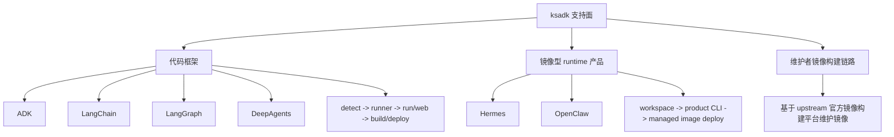

# ksadk 支持模型重构设计

## 1. 摘要

当前 `ksadk` 在文案层常被描述为“并列支持 ADK、LangChain、LangGraph、DeepAgents、OpenClaw、Hermes 六个 framework”，但最新代码并不是按这一模型实现的。

最新代码已经呈现出两条主路径：

- 代码型框架路径：`ADK`、`LangChain`、`LangGraph`、`DeepAgents`
- 镜像型 runtime 产品路径：`Hermes`、`OpenClaw`

本设计建议将 `ksadk` 的支持模型正式重构为：

- `代码框架支持`
- `runtime 产品接入支持`
- `维护者镜像构建链路`

其中第三项不是用户心智模型的一部分，而是平台维护路径，用于说明 `Hermes/OpenClaw` 的运行时镜像虽然基于 upstream 官方镜像构建，但其能力接入方式仍然属于“产品接入”，而不是“普通代码框架”。

推荐方案是先在文档、CLI 帮助和命令边界上完成口径收敛，再逐步把内部抽象从单一 `framework` 概念演进为“支持面 + 具体类型”的模型。

## 2. 范围

本设计覆盖：

- `ksadk` 对多类 agent 运行时的支持模型
- CLI 与配置文件的外部心智模型
- 本地运行、构建、部署、调用的命令边界
- 后续新增 agent runtime 的接入分类方式

本设计不覆盖：

- control plane API 重构
- Hermes/OpenClaw 运行时镜像内部实现细节
- 文件上传下载服务的具体协议设计
- 对现有服务端字段做破坏性变更

## 3. 背景与问题

### 3.1 现状事实

当前仓库中的关键实现已经说明，这六类对象并不处在同一抽象层：

- `FrameworkDetector` 当前主要服务于本地项目检测，核心检测链路围绕 `ADK`、`LangChain`、`LangGraph`、`DeepAgents` 展开；`Hermes` 被部分纳入，但 `OpenClaw` 不在同一条 runner 链路内。
- `Runner Factory` / `UnifiedRunner` 只为代码型框架创建本地 runner。
- `agentengine run` 与 `agentengine web` 本质依赖 `FrameworkDetector + UnifiedRunner`。
- `agentengine hermes ...` 与 `agentengine openclaw ...` 已经是独立资源组，拥有自己的 `deploy/list/status/open/exec/connect/channel/repair` 等生命周期命令。
- `agentengine invoke` 已对 `Hermes` 做了专门的 native TUI transport 分流，而不是简单复用通用 chat TUI。
- `Hermes/OpenClaw` 的云端部署物是镜像，且镜像来源是平台维护的 runtime 镜像，通常基于 upstream 官方镜像叠加平台所需 overlay 构建，而不是普通用户代码包。

### 3.2 主要问题

如果继续维持“六个并列 framework”这一口径，会持续引入以下问题：

1. 文档与代码模型不一致。
2. 用户无法从帮助文案中判断哪些命令组合是有效的。
3. `Hermes/OpenClaw` 的产品型生命周期与 `ADK/LangChain` 的代码型生命周期被混写在同一概念下。
4. 新增 runtime 接入时，团队容易误以为必须先加入 `FrameworkDetector` 和本地 runner。
5. 未来像“pod 工作区文件服务”“pairing”“channel bootstrap”“native TUI”这类能力没有稳定挂载点，只能零散特判。

## 4. 设计目标

本设计的目标是：

- 让用户能一眼区分“代码框架”和“runtime 产品”
- 让 CLI 帮助与实际代码路径一致
- 让 `Hermes/OpenClaw` 的镜像型接入路径有明确归属
- 给未来新增 runtime 提供可复用的接入标准
- 为后续跨 runtime 的共享能力预留统一能力位

## 5. 非目标

本设计不追求：

- 在第一阶段统一所有命令实现
- 在第一阶段删除所有旧字段
- 在第一阶段改变服务端当前使用的 `framework` 字段语义
- 在第一阶段把 `Hermes/OpenClaw` 的所有构建资产对外暴露为用户能力

## 6. 方案比较

### 方案 A：继续维持“六个并列 framework”

做法：

- 保持所有文案继续强调六个 framework 并列支持
- 继续在局部命令中使用特判收敛差异

优点：

- 短期改动最少
- 不需要重新定义对外术语

缺点：

- 与当前代码结构不一致
- 新同学很难理解为什么 `Hermes/OpenClaw` 不是普通本地 runner
- 后续新增 runtime 还会继续复制特判

结论：

不推荐。

### 方案 B：拆分为“代码框架”与“镜像型 runtime 产品”

做法：

- 把 `ADK/LangChain/LangGraph/DeepAgents` 统一定义为代码框架
- 把 `Hermes/OpenClaw` 统一定义为镜像型 runtime 产品
- 保留当前产品命令组，但修正文档与命令边界

优点：

- 与当前代码现状最接近
- 迁移成本最低
- 用户心智模型显著更清晰

缺点：

- 内部仍然需要兼容旧的 `framework` 字段
- `Hermes` 当前部分历史实现仍会显得“半框架、半产品”

结论：

推荐作为本次重构的目标方案。

### 方案 C：直接引入完整能力矩阵模型

做法：

- 在外部立即引入“支持面 + 传输协议 + UI profile + 能力位”的完整模型
- 对每个 runtime 都建立显式 capability registry

优点：

- 长期扩展性最好
- 对 future runtime、文件服务、native TUI 等能力建模最完整

缺点：

- 当前阶段会显得过重
- 会把“先把概念讲清楚”这件事拖入一次较大抽象升级

结论：

不适合作为第一阶段对外方案，但可以作为第二阶段内部演进方向。

## 7. 推荐方案

推荐采用方案 B，并为方案 C 预留内部演进空间。

对外口径统一为：

- `ksadk` 支持四类代码框架：`ADK`、`LangChain`、`LangGraph`、`DeepAgents`
- `ksadk` 接入两类镜像型 runtime 产品：`Hermes`、`OpenClaw`
- `Hermes/OpenClaw` 默认通过平台维护的 runtime 镜像部署，这些镜像通常基于 upstream 官方镜像叠加平台所需 overlay 构建

对内实现允许逐步演进到：

- `SupportKind = code_framework | runtime_product`
- `CodeFramework = adk | langchain | langgraph | deepagents`
- `RuntimeProduct = hermes | openclaw`
- `RuntimeCapabilities = native_tui | hosted_root_ui | pairing | channel_bootstrap | workspace_files | ...`

## 8. 目标模型



### 8.1 代码框架

定义：

- 本地工作目录的真相源是用户代码
- 支持通过 `FrameworkDetector` 或等价机制识别入口文件
- 支持本地 runner、`run`、`web`
- 支持通用 `build/deploy/launch`

包含：

- `ADK`
- `LangChain`
- `LangGraph`
- `DeepAgents`

### 8.2 镜像型 runtime 产品

定义：

- 本地工作目录的真相源不是用户 agent 代码，而是部署工作区
- 云端运行时主要以镜像为部署物
- 生命周期由专门资源组负责，而不是普通本地 runner
- 可以拥有自己专属的 transport、UI path、pairing、channel 或 repair 语义

包含：

- `Hermes`
- `OpenClaw`

### 8.3 维护者镜像构建链路

定义：

- 面向平台维护者，而不是终端用户
- 负责把 upstream 官方镜像加上 ksadk 所需 overlay 后产出平台维护镜像
- 不应被表述成“普通 framework 支持能力”

说明：

- 这一层用于解释当前仓库中 `deploy/hermes/*`、`deploy/openclaw*` 等模板资产的工程来源
- 它是 runtime 产品的维护路径，不是用户日常开发路径

## 9. 外部产品模型

### 9.1 用户可见心智模型

用户看到的应当是下面这组区别，而不是“六个并列 framework”：

| 类型 | 代表对象 | 本地目录主要内容 | 本地 run/web | 默认部署路径 |
| --- | --- | --- | --- | --- |
| 代码框架 | ADK / LangChain / LangGraph / DeepAgents | 用户代码 + `agentengine.yaml` | 支持 | 通用 `build/deploy/launch` |
| runtime 产品 | Hermes / OpenClaw | `.env`、`.agentengine.state`、可选运行时配置 | 不作为主路径 | 专用 `agentengine hermes/openclaw ...` |

### 9.2 `init` 的目标语义

目标语义应当调整为：

- `init -f adk/langchain/langgraph/deepagents`
  - 创建代码型项目
- `init -f hermes/openclaw`
  - 创建部署工作区，而不是暗示“本地 runner 工程”

其中 `Hermes/OpenClaw` 的工作区应强调：

- 保存部署参数
- 保存本地状态
- 保存可选 overlay 配置
- 不默认承诺本地 `run/web` 能力

如果未来需要公开“自定义 runtime 镜像”的能力，应显式暴露为新的维护者/高级用户命令，而不是继续复用普通 `init` 的 framework 心智。

## 10. 内部架构建议

### 10.1 抽象分层

建议在内部逐步引入以下抽象：

1. `SupportKind`
   - `code_framework`
   - `runtime_product`

2. `CodeFramework`
   - `adk`
   - `langchain`
   - `langgraph`
   - `deepagents`

3. `RuntimeProduct`
   - `hermes`
   - `openclaw`

4. `RuntimeCapabilities`
   - `native_tui`
   - `hosted_root_ui`
   - `pairing`
   - `channel_bootstrap`
   - `repair`
   - `workspace_files`

### 10.2 检测职责

建议把“本地代码检测”和“工作区解析”分离：

- `FrameworkDetector`
  - 只负责代码框架检测
- `WorkspaceResolver` 或等价层
  - 负责解析 runtime 产品工作区中的配置和状态

这样可以避免未来继续把 `Hermes/OpenClaw` 强行塞入代码检测器。

### 10.3 命令分工

建议明确三类命令边界：

1. 通用代码框架命令
   - `run`
   - `web`
   - `build`
   - `deploy`
   - `launch`

2. runtime 产品生命周期命令
   - `hermes ...`
   - `openclaw ...`

3. 通用远端资源命令
   - `agent list`
   - `agent status`
   - `agent invoke`

其中 `agent invoke` 可以保留作为统一远端入口，但 transport 选择应由 runtime capability 决定，而不是默认假设所有对象都使用通用 chat TUI。

## 11. 配置模型建议

### 11.1 第一阶段：兼容当前字段

为了兼容已有项目，第一阶段可以继续接受：

```yaml
framework: hermes
```

或：

```yaml
framework: openclaw
```

但文档上不再把它们称为“普通代码框架”。

### 11.2 第二阶段：引入显式支持面

建议逐步引入更清晰的配置模型：

代码框架项目：

```yaml
support_kind: code_framework
framework: langgraph
entry_point: my_agent/agent.py
agent_variable: root_agent
```

runtime 产品工作区：

```yaml
support_kind: runtime_product
product: hermes
deployment_mode: managed_image
ui_profile: hermes
```

兼容策略：

- 旧字段继续可读
- 新字段作为文档推荐写法
- 对服务端请求仍可在适配层映射到当前兼容字段

## 12. 命令矩阵

建议最终对外文档明确写出以下矩阵：

| 命令 | 代码框架 | Hermes | OpenClaw |
| --- | --- | --- | --- |
| `agentengine run` | 支持 | 不作为主路径 | 不作为主路径 |
| `agentengine web` | 支持 | 不作为主路径 | 不作为主路径 |
| `agentengine build` | 支持 | 仅维护者镜像链路使用，不作为普通用户主路径 | 仅维护者镜像链路或高级镜像定制使用 |
| `agentengine deploy` | 支持 | 不推荐作为主入口，使用 `agentengine hermes deploy` | 不推荐作为主入口，使用 `agentengine openclaw deploy` |
| `agentengine agent invoke` | 支持 | 支持，但 transport 默认按 Hermes native TUI 能力路由 | 仅在产品明确暴露通用远端调用能力时使用 |
| `agentengine hermes/openclaw ...` | 不适用 | 主路径 | 主路径 |

## 13. 对当前实现的具体调整建议

### 13.1 P0：口径与边界收敛

应优先完成：

- CLI 根帮助文案不再描述为“六个并列 framework”
- `run/web` 遇到 `Hermes/OpenClaw` 工作区时给出明确错误和跳转提示
- `init -f hermes/openclaw` 的说明文案改为“部署工作区”
- 技术文档不再把 `Hermes/OpenClaw` 放进代码框架章节

### 13.2 P1：内部抽象收敛

建议随后完成：

- 引入 `SupportKind`
- 收敛 `FrameworkDetector` 职责
- 增加 runtime product descriptor / capability descriptor
- 将 transport 决策切换到 capability 驱动

### 13.3 P2：能力矩阵化

在后续 runtime 增加时，引入统一 capability registry：

- `native_tui`
- `hosted_root_ui`
- `workspace_files`
- `pairing`
- `channel_bootstrap`
- `repair`

这能为未来的文件服务、工作区同步、远端终端和渠道接入提供稳定挂载点。

## 14. 与文件服务设计的关系

本设计对未来“agent 生成文件的上传下载能力”有一个直接结论：

- 这类能力不应绑定在 `ADK/LangChain` 这类代码框架抽象上
- 更适合挂在 `runtime capability` 层

原因是：

- `Hermes/OpenClaw` 已经明显绕开了通用本地 runner
- 文件上传下载最终依赖的是 pod 工作区、runtime 路由、鉴权和能力暴露
- 这些都更接近 runtime contract，而不是代码框架 contract

因此，未来如果要做跨 runtime 统一的文件服务，推荐以 `workspace_files` 之类的 runtime capability 为中心建模。

## 15. 风险与兼容性

### 风险 1：历史代码中仍存在 `framework=hermes`

影响：

- 第一阶段无法直接移除旧字段

应对：

- 先改文档与命令边界
- 通过兼容层逐步引入新抽象

### 风险 2：`init -f hermes` 当前模板会误导用户理解

影响：

- 用户容易以为 Hermes 是本地代码工程，而不是镜像型 runtime 产品

应对：

- 将模板说明改成“部署工作区”
- 如果需要保留镜像模板，显式标注为维护者路径

### 风险 3：未来新增 runtime 时又回到“加一个 framework”

影响：

- 再次复制概念漂移

应对：

- 明确规定新增 runtime 先判断属于 `code_framework` 还是 `runtime_product`
- 只有代码型项目才进入 detector/runner 链路

## 16. 成功标准

本设计落地后，应满足以下标准：

- 新同学可以在不读实现细节的情况下判断命令边界
- 文档、CLI 帮助、代码路径三者不再相互矛盾
- `Hermes/OpenClaw` 被稳定表述为镜像型 runtime 产品
- 新 runtime 的接入评审可以先回答“属于哪种支持面”，而不是先决定是否加入 `FrameworkDetector`
- 未来共享能力可以稳定挂在 runtime capability 上

## 17. 开放问题

当前仍有三个值得后续决策的问题：

1. 是否要在第二阶段对外公开 `support_kind` / `product` 新字段，还是仅作为内部抽象。
2. `init -f hermes` 是否要直接改成轻量部署工作区，还是保留现有模板并加维护者说明。
3. `agentengine build` 是否要在 runtime 产品工作区中直接报错并引导到专用命令，还是保留维护者高级路径。

## 18. 结论

`ksadk` 当前更准确的设计描述不是“支持六个并列 framework”，而是：

- 支持四类代码框架
- 接入两类镜像型 runtime 产品
- 内部存在一条仅面向维护者的镜像构建链路

围绕这一结论收敛术语、命令边界和内部抽象，是当前多框架支持模型最优先的设计整理工作。
