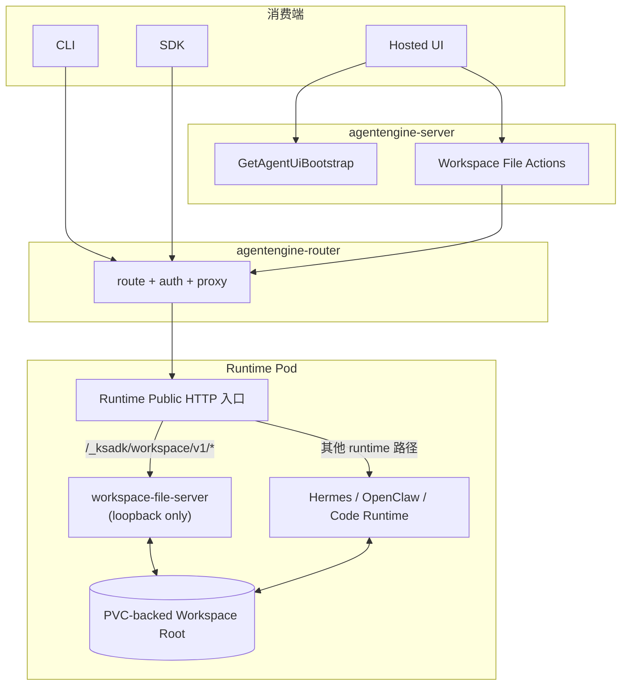

# Agent 通用 Workspace 文件服务设计

> 日期：2026-04-19  
> 状态：评审版  
> 范围：`ksadk-python` + `agentengine-server` + `agentengine-router` + 云上 runtime pod

## 1. 结论摘要

本文档的结论可以先压缩成 6 条：

1. `agent` 通用文件上传/下载能力应建模为 runtime capability：`workspace_files`，而不是继续挂在现有聊天附件链路上。
2. 文件真相源是 runtime pod 挂载出来的 PVC-backed workspace root，而不是 `agentengine-server` 临时目录，也不是对象存储。
3. 对外统一 contract 是 runtime public HTTP 入口下的 `/_ksadk/workspace/v1/*`。
4. `CLI/SDK` 直接走 `agentengine-router` 数据面；Hosted UI 通过 `agentengine-server` action proxy 访问。
5. 对外暴露的根目录固定为 `<state_dir>/workspace`，不直接暴露整个 `~/.openclaw` 或 `~/.hermes`。
6. 默认按单 `active writer` 设计；分享链接默认不暴露 `workspace_files`。

这意味着该方案是“深度复用 router 作为统一数据面入口”，但不是“把文件业务逻辑塞进 router”。

## 2. 问题定义

当前仓库里已有两条文件相关链路，但都不等价于“agent 通用 workspace 文件服务”：

1. `ksadk-python` 本地附件链路  
   文件落在本地 `.agentengine/ui/files/`，主要服务本地 UI 和 conversation runtime。

2. `agentengine-server` Hosted UI 附件链路  
   `UploadFile` 把文件写到 server 临时目录 `/tmp/agentengine_uploads`，再通过 `ae-upload://...` 这类引用交给 conversation runtime 消费。

它们的共同特点是：

- 目标是“把文件作为本轮聊天输入”
- 存储位置不等于云上 agent workspace
- 用户不能把它当作稳定的远端文件树浏览和下载

本文档要解决的是另一类能力：

- 用户把文件直接上传到云上 agent workspace
- agent 在 workspace 中生成的文件可被列出和下载
- 这套能力对 `Hermes`、`OpenClaw`、`ADK`、`LangChain`、`LangGraph`、`DeepAgents` 以及未来 custom runtime 都成立
- 不依赖 `KS3`
- 复用现有 PVC / 云盘，不引入新的中心化文件存储系统

## 3. 范围

### 3.1 目标

在 workspace 已经由 PVC / 云盘持久化的前提下，提供统一的：

- 上传
- 列目录
- 下载
- 删除
- Hosted UI / CLI / SDK 共用语义
- pod 重建后重新挂载同一 PVC 时文件继续可访问

### 3.2 非目标

v1 明确不做：

- 不做对象存储中转或 `KS3` 预签名上传
- 不做 workspace 文件版本管理
- 不做 >100MB 大文件、断点续传、多分片上传
- 不做目录打包下载
- 不自动把 agent 新生成文件回填成聊天消息附件
- 不把整个 `$HOME` 或 runtime state root 暴露给用户浏览
- 不新增平台级中心化文件微服务

## 4. 已确认决策

| 主题 | 决策 |
| --- | --- |
| 能力归属 | `workspace_files` 是 runtime capability，不是 framework capability |
| 真相源 | PVC-backed workspace root |
| 对外路径 | `/_ksadk/workspace/v1/*` |
| 入口复用 | 复用各 runtime 现有 public HTTP 入口，不要求统一端口 |
| 根目录暴露 | 固定为 `<state_dir>/workspace` |
| 多副本语义 | 默认单 `active writer`，多 writer 不承诺强一致 |
| 分享策略 | 分享链接默认不暴露 `workspace_files` |
| Hosted 访问 | 走 `agentengine-server` action proxy |
| CLI/SDK 访问 | 直接走 `agentengine-router` 数据面 |
| 平台微服务 | 不新增中心化文件微服务 |

## 5. 架构



核心分层：

- `agentengine-router`
  负责现有 agent 数据面入口、鉴权上下文与路由转发。
- `agentengine-server`
  负责 Hosted UI bootstrap、权限判定和 action proxy。
- `runtime pod`
  负责真正的文件能力与 workspace 根目录。
- `workspace-file-server`
  只负责 pod 内文件 API，不直接对公网暴露。

## 6. 为什么不是中心化文件微服务

不推荐新增平台级 `workspace-file-service` 微服务，原因是：

- 文件真相源已经是 PVC-backed workspace root，不在 control plane。
- 即使新增微服务，它最终仍然要路由到具体 runtime pod 才能读写文件。
- 这样只会多出一个中心化流量与故障点，而不会减少系统复杂度。

因此本方案采用：

- 存储由 PVC 负责
- 文件协议由 pod 内 `workspace-file-server` 负责
- 路由与鉴权由 `router/server` 负责

## 7. 对外契约

### 7.1 Runtime Data Plane 契约

统一挂在：

- `/_ksadk/workspace/v1/*`

推荐 API：

| 方法 | 路径 | 用途 |
| --- | --- | --- |
| `GET` | `/_ksadk/workspace/v1/entries?path=.&recursive=false` | 列目录 |
| `GET` | `/_ksadk/workspace/v1/files/{path:path}` | 下载文件 |
| `POST` | `/_ksadk/workspace/v1/files/{path:path}` | 上传文件 |
| `DELETE` | `/_ksadk/workspace/v1/files/{path:path}` | 删除文件 |
| `HEAD` | `/_ksadk/workspace/v1/files/{path:path}` | 文件元数据 |
| `GET` | `/_ksadk/workspace/v1/healthz` | 健康检查 |

约束：

- `POST` 使用 `multipart/form-data`
- 父目录不存在时允许自动 `mkdir -p`
- `GET /entries` 默认只列单层

### 7.2 Bootstrap 契约

`GetAgentUiBootstrap` 增加：

```json
{
  "Capabilities": {
    "Attachments": true,
    "WorkspaceFiles": true
  },
  "WorkspaceFiles": {
    "Enabled": true,
    "MaxUploadBytes": 104857600,
    "SupportsDelete": true,
    "RootLabel": "workspace"
  }
}
```

语义：

- `Capabilities.WorkspaceFiles` 决定 UI 是否展示 Workspace 面板
- `WorkspaceFiles` 描述能力细节和限制
- 如果 runtime 不支持该能力，则返回 `false` / `null`

### 7.3 Hosted KOP 契约

为 Hosted UI 增加：

- `ListWorkspaceFiles`
- `UploadWorkspaceFile`
- `DeleteWorkspaceFile`
- `DownloadWorkspaceFile`

行为：

- UI 只访问 `agentengine-server`
- server 校验 owner / share 权限后代理到 runtime
- 下载使用 streaming proxy，不落地到 server 临时目录

### 7.4 KOP 接口细化

最小 KOP / Hosted 接口集合建议是 `4 + 1`：

1. 扩展 `GetAgentUiBootstrap`
2. `ListWorkspaceFiles`
3. `UploadWorkspaceFile`
4. `DeleteWorkspaceFile`
5. `DownloadWorkspaceFile`

其中第 `1` 项不是新接口，而是已有 bootstrap action 的字段扩展。

#### 7.4.1 `GetAgentUiBootstrap` 字段扩展

```json
{
  "Capabilities": {
    "WorkspaceFiles": true
  },
  "WorkspaceFiles": {
    "Enabled": true,
    "MaxUploadBytes": 104857600,
    "SupportsDelete": true,
    "RootLabel": "workspace"
  }
}
```

作用：

- 告诉 Hosted UI 当前 agent 是否支持 `workspace_files`
- 告诉 UI 上传上限、是否允许删除、根节点展示名称

#### 7.4.2 `ListWorkspaceFiles`

用途：

- 列目录
- 展开目录节点
- 刷新当前目录

建议请求：

```json
{
  "AgentId": "ar-xxx",
  "Path": ".",
  "Recursive": false
}
```

建议响应：

```json
{
  "Root": "workspace",
  "Path": ".",
  "Entries": [
    {
      "Name": "inputs",
      "Path": "inputs",
      "Type": "directory",
      "SizeBytes": null,
      "MimeType": null,
      "ModifiedAt": "2026-04-19T10:00:00Z"
    },
    {
      "Name": "report.pdf",
      "Path": "report.pdf",
      "Type": "file",
      "SizeBytes": 128456,
      "MimeType": "application/pdf",
      "ModifiedAt": "2026-04-19T10:01:00Z"
    }
  ]
}
```

#### 7.4.3 `UploadWorkspaceFile`

用途：

- 把本地文件上传到 workspace 指定路径

建议请求形态：

- `multipart/form-data`
- 字段：
  - `AgentId`
  - `Path`
  - `File`

建议响应：

```json
{
  "Path": "inputs/report.pdf",
  "SizeBytes": 128456,
  "MimeType": "application/pdf",
  "ModifiedAt": "2026-04-19T10:01:00Z"
}
```

说明：

- 这里不要复用现有 `UploadFile -> ae-upload://...` 的附件链路
- server 应直接 streaming proxy 到 runtime 的 `/_ksadk/workspace/v1/files/{path}`

#### 7.4.4 `DeleteWorkspaceFile`

用途：

- 删除用户指定的 workspace 文件

建议请求：

```json
{
  "AgentId": "ar-xxx",
  "Path": "outputs/result.csv"
}
```

建议响应：

```json
{
  "Deleted": true,
  "Path": "outputs/result.csv"
}
```

#### 7.4.5 `DownloadWorkspaceFile`

逻辑上，KOP 需要有一个“下载 workspace 文件”的能力项。

但在 Hosted UI 实现上，纯 action envelope 不适合承载二进制文件流。因此建议分成两层：

1. 逻辑动作名保留为 `DownloadWorkspaceFile`
2. 实际文件流入口使用一个 companion binary endpoint，例如：

`GET /agentengine/api/v1/WorkspaceFileContent?AgentId=ar-xxx&Path=outputs/result.csv`

原因：

- 浏览器文件下载天然更适合直接消费 binary response
- 这和现有 `AttachmentContent` 模式一致
- server 仍然可以在进入该 endpoint 前完成 owner / share 权限校验

如果你们后续坚持“所有能力必须都是 action”，也可以把 `DownloadWorkspaceFile` 落成 `POST + streaming response`，但对前端体验和实现都没有明显收益。

### 7.5 Hosted UI 文件区交互模型

用户文件展示建议采用：

- 工作树语义
- 按目录懒加载

而不是：

- 一次性递归拉整棵文件树

推荐交互：

- 根节点固定显示为 `workspace`
- 默认先请求 `ListWorkspaceFiles(Path='.', Recursive=false)`
- 用户展开某个目录时，再请求该目录的 `ListWorkspaceFiles`
- UI 显示 breadcrumb、当前目录列表、上传/下载/删除/刷新操作

这意味着 v1 的产品形态更接近：

- “带工作树语义的目录浏览器”

而不是：

- “IDE 那种一次性全量加载的完整文件树”

推荐原因：

- workspace 可能很大，全量递归成本高
- 用户通常只关心当前目录及少量上级/下级目录
- 这和 runtime data plane 默认 `Recursive=false` 的契约更一致

v1 前端实现可以有两种外观，但数据模型应一致：

1. 左侧树 + 右侧当前目录列表
2. breadcrumb + 当前目录列表

无论选哪种外观，后端都不应默认返回整棵递归树。

### 7.6 CLI 契约

推荐 CLI 入口：

```bash
agentengine agent files list --agent ar-xxx --path .
agentengine agent files upload ./report.pdf --agent ar-xxx --to inputs/report.pdf
agentengine agent files download --agent ar-xxx --path outputs/result.csv --output ./result.csv
agentengine agent files delete --agent ar-xxx --path outputs/result.csv
```

原因：

- 它是“远端 Agent 资源”的子能力
- 可以复用现有 agent endpoint / API key / region 解析逻辑

## 8. Pod 内实现

### 8.1 共享 `workspace-file-server`

推荐新增：

- `deploy/shared/workspace_file_server.py`

运行方式：

- 监听 `127.0.0.1`
- 默认端口 `8765`

职责仅限于：

- 路径校验
- 文件读写
- 目录列举
- HTTP 响应序列化

不负责：

- 对外鉴权
- 权限判断
- session 管理

### 8.2 Workspace Root

统一环境变量：

- `AGENT_WORKSPACE_ROOT`

建议映射：

| runtime | 对外暴露 root |
| --- | --- |
| `Hermes` | `${HERMES_HOME}/workspace` |
| `OpenClaw` | `${OPENCLAW_STATE_DIR}/workspace` |
| 通用 code runtime | 显式注入 `AGENT_WORKSPACE_ROOT` |
| custom container | capability opt-in |

关键原则：

- root 必须是 dedicated workspace directory
- 可以位于 PVC 挂载出来的 state dir 下
- 但不应直接等于整个 state dir

因此即使 PVC 实际挂在：

- `/home/node/.hermes`
- `/home/node/.openclaw`

对外仍只暴露：

- `/home/node/.hermes/workspace`
- `/home/node/.openclaw/workspace`

这样可以避免把：

- sessions
- run metadata
- cache
- skills
- config

混进用户可见文件树。

### 8.3 路径与上传规则

所有路径操作必须满足：

- 禁止 `..`
- 禁止解析后逃逸出 `AGENT_WORKSPACE_ROOT`
- 禁止通过 symlink 跳出 root
- 只允许普通文件和目录
- 不跟随设备文件、socket、FIFO

上传建议采用原子写入：

1. 先写 `.<filename>.part`
2. 完成后 `rename` 为最终文件名

## 9. Runtime 接入策略

### 9.1 Hermes

接入点：

- `deploy/hermes/entrypoint.sh`
- `deploy/hermes/runtime/app.py`

建议：

1. `entrypoint.sh` 启动 `workspace-file-server`
2. `runtime/app.py` 把 `/_ksadk/workspace/v1/*` 代理到 `127.0.0.1:8765`

### 9.2 OpenClaw

接入点：

- `deploy/openclaw/bootstrap.sh`

建议：

1. `bootstrap.sh` 启动 `workspace-file-server`
2. 在 OpenClaw gateway 前增加极薄的入口层
3. `/_ksadk/workspace/v1/*` 转发到 `127.0.0.1:8765`
4. 其余路径继续转发给 OpenClaw gateway

这样比直接侵入 upstream gateway 更稳，且更利于后续升级。

### 9.3 通用 Code Runtime / Custom Container

采用 capability opt-in：

- 带 `workspace-file-server`
- 配置 `AGENT_WORKSPACE_ROOT`
- public HTTP 入口能转发 `/_ksadk/workspace/v1/*`

满足这三条时，bootstrap 返回 `WorkspaceFiles=true`；否则该能力关闭，但 runtime 仍可正常运行。

## 10. 可用性与错误语义

### 10.1 PVC 语义

在本方案下：

- pod 重建不等于文件丢失
- 只要新 pod 重新挂载同一 workspace PVC，文件应继续存在
- runtime 短暂不可达时，更准确的语义是“暂时不可访问”，不是“已删除”

因此必须区分：

- `file_not_found`
- `runtime_unavailable`

### 10.2 多副本语义

v1 默认：

- 单 `active writer`
- 多副本读可以接受
- 多 writer 不承诺强一致
- 如果未来必须支持多 writer，默认按 `last-write-wins`，后续再讨论是否引入更强协调

### 10.3 建议错误码

| 场景 | 建议错误 |
| --- | --- |
| 路径逃逸 workspace root | `400 invalid_path` |
| 文件不存在 | `404 file_not_found` |
| runtime 未开启 capability | `404 workspace_files_not_supported` |
| 文件过大 | `413 file_too_large` |
| pod 暂不可达 / 无路由 | `503 runtime_unavailable` |
| PVC 未挂载或 workspace 不可用 | `503 workspace_not_ready` |

## 11. 权限策略

当前默认值：

- Owner 模式允许上传、下载、删除
- 分享链接默认不暴露 `workspace_files`

原因：

- 最小权限默认值更安全
- 避免分享链接变成远端工作区浏览器
- 后续如果确有产品需求，可以单独增加 read-only download 能力

## 12. 与现有附件链路的关系

现有附件链路继续保留：

- 本地 `ksadk` 附件继续服务本地 UI / 本地 session
- Hosted `UploadFile` 继续服务聊天附件上传

`workspace_files` 是新能力，它服务的是：

- pod 工作区文件浏览
- 远端文件上传
- 远端文件下载

它不替代现有 conversation attachment pipeline。

如果后续要做体验桥接，可以再增加：

- “上传到 workspace 并作为本轮附件发送”
- “把当前附件另存到 workspace”
- `workspace_file_ref` 的会话渲染

但这些都不属于 v1 最小闭环。

## 13. 跨仓职责

| 层 | 负责什么 | 不负责什么 |
| --- | --- | --- |
| `ksadk-python` | CLI、runtime image 内共享 `workspace-file-server`、Hermes/OpenClaw 接入 | Hosted 权限校验、分享链接控制 |
| `agentengine-server` | Bootstrap 暴露能力、Hosted action proxy、owner/share 权限判断 | 持有文件真相源、中心化文件存储 |
| `agentengine-router` | 复用现有 route/auth/proxy，把数据面请求转发到正确 runtime | 解释 workspace 文件业务语义 |
| `runtime image` | 提供 dedicated workspace root、启动 `workspace-file-server`、挂出 `/_ksadk/workspace/v1/*` | 承担 Hosted UI 权限策略 |

## 14. 建议实现触点

### 14.1 `ksadk-python`

- `/Users/xiayu/kingsoft/code/agent-sdk/ksadk-python/deploy/shared/workspace_file_server.py`
- `/Users/xiayu/kingsoft/code/agent-sdk/ksadk-python/ksadk/cli/cmd_agent_files.py`
- `/Users/xiayu/kingsoft/code/agent-sdk/ksadk-python/ksadk/cli/cmd_agent.py`
- `/Users/xiayu/kingsoft/code/agent-sdk/ksadk-python/deploy/hermes/entrypoint.sh`
- `/Users/xiayu/kingsoft/code/agent-sdk/ksadk-python/deploy/hermes/runtime/app.py`
- `/Users/xiayu/kingsoft/code/agent-sdk/ksadk-python/deploy/openclaw/bootstrap.sh`

### 14.2 `agentengine-server`

- `/Users/xiayu/kingsoft/code/agent-sdk/agentengine-server/app/api/v1/actions/workspace_file_actions.py`
- `/Users/xiayu/kingsoft/code/agent-sdk/agentengine-server/app/api/v1/actions/__init__.py`
- `/Users/xiayu/kingsoft/code/agent-sdk/agentengine-server/app/api/v1/actions/chat_actions.py`

## 15. 分阶段推进

### Phase 1：Runtime + CLI 最小闭环

- runtime `/_ksadk/workspace/v1/*`
- `agentengine agent files list/upload/download/delete`
- `Hermes/OpenClaw` 默认支持

### Phase 2：Hosted UI 接入

- bootstrap 暴露 `WorkspaceFiles`
- Hosted UI workspace 面板
- server action proxy

### Phase 3：聊天体验桥接

- `workspace_file_ref` 渲染
- workspace 和聊天附件之间的桥接操作

## 16. 建议 Claude 重点 Review 的点

请优先 review 下面 5 个点：

1. `workspace_files` 作为 runtime capability 的边界是否合理。
2. `agentengine-router` 只承担 route/auth/proxy，而不承担文件业务逻辑，这个分层是否干净。
3. `OpenClaw` 通过外层薄入口挂 `/_ksadk/workspace/v1/*`，是否比直接侵入 upstream gateway 更稳。
4. `<state_dir>/workspace` 作为唯一对外暴露根目录，是否足够严格且不影响产品可用性。
5. PVC-backed workspace 下的错误语义区分：`runtime_unavailable` vs `file_not_found` 是否定义清楚。

## 17. 最终结论

v1 的最佳设计是：

- 以 PVC-backed workspace root 为真相源
- 以 runtime public HTTP 入口下的 `/_ksadk/workspace/v1/*` 为统一对外 contract
- 以 `agentengine-router` 复用现有 route/auth
- 以 `agentengine-server` action proxy 服务 Hosted UI
- 以 `CLI/SDK` 直接访问数据面

这条路径既符合“workspace 已经挂 PVC / 云盘、不依赖 KS3”的现实约束，也最容易同时覆盖 `Hermes`、`OpenClaw` 和未来其他 agent runtime。
