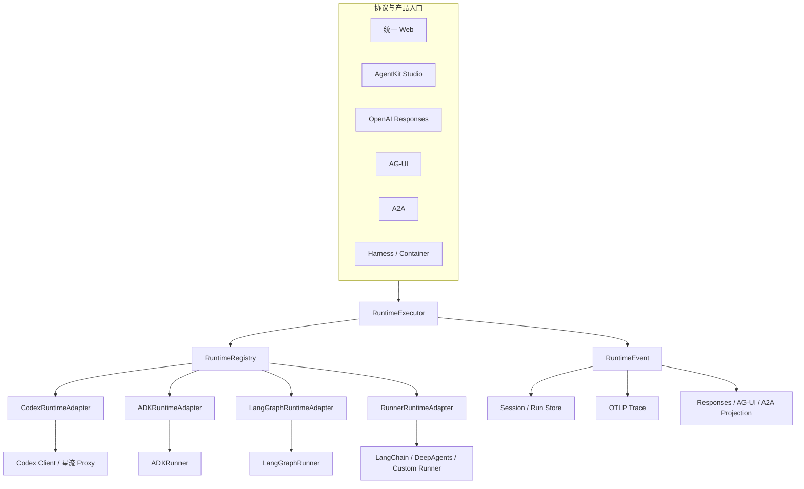

# AgentKit Studio 与统一 Web RuntimeAdapter 收敛设计

> 日期：2026-08-04  
> 状态：已确认，进入实施规划  
> 代码库：`ksadk-python`  
> 开发分支：`agentkit-studio-codex-ld1`  
> 内部 eZone：`ssh://ezone.ksyun.com:23/ezone/bigdata-platform/ksadk-python.git`

## 1. 背景

AgentKit Studio 已经能够在本地创建 Codex Agent、构建 ManagedRuntime Bundle、运行会话并展示 OTEL Trace，但当前实现仍存在以下结构性问题：

1. Codex 同时存在 `CodexRuntime`、`CodexRunner`、`StudioCodexRuntimeAdapter` 和 `CodexStudioRuntime`，形成 `RuntimeAdapter → Runner → RuntimeAdapter` 的重复包装。
2. Studio 又维护 `StudioRuntimeAdapterRegistry` 和 `StudioRuntimeOrchestrator`，与核心 `RuntimeRegistry`、`RuntimeAdapter` 重复。
3. `ksadk web`、Studio、Responses、AG-UI、A2A、Harness 对 Runner 和 RuntimeAdapter 的依赖方向不一致。
4. Studio 虽能管理多个 Agent，但会话、构建、部署和 Trace 没有共享同一个全局 Agent/目标上下文。
5. 创建 Agent 仍以 Codex 专用快速表单为主，不能自然扩展到 ADK、LangGraph、导入、项目识别和多轮对话构建。
6. Tool 已有内置目录，但兼容性和权限信息尚未成为完整产品能力；Skill 仅能导入或读取 canonical 目录，缺少候选发现、风险校验和确认流程。

本设计在保留“YAML 即 Agent”、标准 RuntimeEvent、OpenAI Responses 和 OTLP 合同的前提下，统一运行架构和 Studio 产品模型。

## 2. 目标

交付一个可以发布、可以在应用内浏览器完整演示的本地 AgentKit Studio/统一 Web 版本：

- Codex、ADK、LangGraph 都能真实创建、检测依赖、构建、流式对话、取消、恢复会话并产生 OTEL Trace。
- Web、Studio、Responses、AG-UI、A2A、Harness 只依赖 `RuntimeAdapter`，不直接依赖 Runner。
- Codex 只保留公开的 `CodexRuntimeAdapter`，删除 Codex 和 Studio 的重复执行层。
- 多 Agent、运行目标、创建方式、Tool、Skill、Session、Build 和 Trace 形成一致闭环。
- 为后续真实金山云凭证和云 Agent 接入保留目标模型，但本地版本绝不返回 Mock 云成功状态。

## 3. 非目标

本 Goal 不实现以下内容：

- 金山云 Ding 订单、KOP 注册、Artifact Admission 和真实云部署。
- Skill Center 远程市场的完整管理面。
- 将所有第三方框架 SDK 改写为同一种内部对象模型。
- 在未安装依赖或未配置凭证时伪造运行成功。

真实云部署由后续独立 Goal 接续；本设计只冻结其所需的 `ExecutionTarget` 扩展点和未连接状态。

## 4. 核心原则

1. `RuntimeAdapter` 是唯一上层执行合同。
2. `RuntimeRegistry` 是唯一 Runtime 注册表。
3. Runner 只是部分框架内部的 SDK 兼容层，不是 Web/API 合同。
4. RuntimeEvent 是唯一实时事件合同，Responses、AG-UI、A2A 和 OTLP 都从它投影。
5. YAML 是 Agent 的可审计配置源；内部归一化不抹平 Runtime 专属字段。
6. 所有创建方式汇聚到同一种 Agent Draft/Revision 流程。
7. 自动发现只产生候选，不静默安装、不静默绑定。
8. UI 不展示假按钮、假状态、猜测的 Token 或猜测的 Runtime 能力。

## 5. 目标架构



### 5.1 `RuntimeExecutor`

通用执行编排从 `ksadk/studio` 移入核心 `ksadk/runtime`，命名为 `RuntimeExecutor`。它只处理：

- 用 `RuntimeRegistry` 创建 Adapter。
- 生成并传递 `StartRequest`。
- 驱动 `start / stream / cancel / resume / checkpoint / close`。
- 将 RuntimeEvent 发送给注入的 Observer/Sink。
- 保证终态和资源释放。

它不读取 Studio Build Repository，不解析 Codex Manifest，不保存 Studio UI 状态。Studio、Server 和协议层分别注入自己的事件存储与投影器。

### 5.2 `RuntimeRegistry`

核心 `RuntimeRegistry` 同时支持 Adapter 类型和 Adapter Factory，替代 Studio 私有注册表。Runtime Factory 接收核心 `RuntimeLaunchContext`，返回 `RuntimeAdapter`：

```python
class RuntimeLaunchContext:
    runtime_type: str
    project_dir: Path
    detection: DetectionResult | None
    config: dict[str, Any]
    services: RuntimeServices

RuntimeAdapterFactory = Callable[[RuntimeLaunchContext], RuntimeAdapter]
```

Registry 不感知 Agent Build、Studio Draft 或 HTTP Request。

### 5.3 Codex

`CodexRuntime` 重命名为 `CodexRuntimeAdapter`，作为 Codex 唯一公开执行类。它直接拥有 Codex Client、thread、turn、cancel、resume、checkpoint 和 RuntimeEvent 翻译。

删除：

- `CodexRunner`
- `CodexStudioRuntime`
- `StudioCodexRuntimeAdapter`
- Codex 专用 Runner chunk 往返转换

Codex Runner 中仍有价值的逻辑迁移如下：

| 逻辑 | 新归属 |
|---|---|
| 历史消息预处理 | `prepare_runtime_start` |
| model、prompt、cwd | `StartRequest` 和 Codex Factory |
| 星流 Responses/Chat 转换 | Codex Client/Proxy |
| Proxy 观测 | 直接生成 RuntimeEvent |
| Web SSE | 通用 RuntimeEvent Projection |
| cancel/resume/thread | `CodexRuntimeAdapter` |

### 5.4 ADK 与 LangGraph

ADK 和 LangGraph 继续复用其框架 Runner，但上层只能看到对应 RuntimeAdapter：

- `ADKRuntimeAdapter → ADKRunner → ADK SDK`
- `LangGraphRuntimeAdapter → LangGraphRunner → LangGraph SDK`

ADK 保留 forward-only resume 语义；LangGraph 保留 checkpoint/time-travel/fork 语义，不能为了统一界面虚报相同能力。

### 5.5 BaseRunner

`BaseRunner` 保留为内部框架 SDK 兼容层，但必须瘦身。

保留：

- 加载原生 Agent/Graph。
- 产生框架原生流。
- 释放框架资源。
- 声明原生 cancel/checkpoint 能力。
- 自定义 Runner 扩展点。

移除：

- `run_server()`。
- HTTP、Web、Responses、AG-UI 和 A2A 逻辑。
- Session/Trace 持久化。
- 进程级模型环境变量修改。
- 可由 RuntimeAdapter 收敛完成的 `invoke()`。

CI 增加架构测试，禁止 `ksadk/server`、`ksadk/studio`、`ksadk/agui`、`ksadk/a2a` 直接导入 `ksadk.runners`。

## 6. Agent 定义与 Revision

### 6.1 逻辑模型

四种创建方式都生成统一的逻辑 Draft：

```text
AgentDraft
├── Metadata
├── RuntimeRef
├── Instructions
├── ModelBindings
├── CapabilityBindings
├── SourceProvenance
├── ValidationReport
├── SourceYaml
└── Revision
```

### 6.2 YAML 序列化

YAML 仍是 Agent 的配置源。不同 Runtime 通过各自 Definition Codec 解析和生成 YAML：

- Codex 保留 `framework: codex`、`artifact_type: ManagedRuntime` 和 Runtime Catalog 引用。
- ADK/LangGraph 保留入口模块、变量名、依赖与框架配置。
- 导入时保留无法识别但合法的扩展字段。
- Studio 展示归一化投影，但构建读取已校验的原始 Revision。

### 6.3 Runtime 迁移

- 首次成功 Build 前允许修改 Runtime。
- 已有 Build 后更换 Runtime 必须进入迁移流程。
- 迁移产生新 Revision，不覆盖旧 Build、Session、Run 和 Trace。
- 迁移先执行字段映射和兼容性诊断，再由用户确认。

## 7. 创建 Agent 中心

创建入口不是固定表单，而是四种真实流程。

### 7.1 快速创建

用户选择 Runtime、模型、提示词和能力；依赖探测通过后生成 YAML Draft。Runtime 不可用时展示版本和安装命令，不允许继续构建。

### 7.2 对话构建

真实模型通过多轮对话收集职责、边界、Runtime、模型和能力需求。模型只生成结构化 Draft Patch：

1. Patch 经过 Schema 和策略 Validator。
2. UI 展示字段变化和 YAML diff。
3. 用户确认后才写入 Draft。
4. 模型不得直接写工作区文件。

### 7.3 导入 Agent

支持 `agentengine.yaml`、Agent ZIP 和可识别 Bundle。处理过程分为 inspect 和 commit：

- Inspect 只读解析格式、Runtime、能力、文件清单、摘要和风险。
- Commit 在用户确认后写入 canonical 工作区。
- Agent ID 冲突时要求选择覆盖 Revision、另存为或取消。

### 7.4 识别现有项目

复用 `FrameworkDetector`，扫描入口、依赖、YAML、Tool 和 Skill。结果包含证据和置信度；冲突时不能静默选择 Runtime。

## 8. Runtime Catalog

Studio 提供统一 Runtime Catalog，至少返回：

- `runtimeType`
- 显示名称与版本
- 安装状态和版本兼容性
- 安装/修复命令
- 支持的 Session、Cancel、Resume、Checkpoint、Tool、Skill、MCP 能力
- 本地依赖来源

Codex、ADK、LangGraph 卡片只展示真实探测结果。能力矩阵由 Adapter/Factory 声明，不由前端硬编码。

## 9. 全局工作上下文

全局顶栏固定为：

```text
[Workspace ▼] [Agent ▼] [Local / 金山云 ▼]
```

- 删除产品标识旁的 `Codex Local`。
- Runtime 作为当前 Agent 的只读徽标展示。
- 会话、构建、部署、资源绑定和 Trace 默认跟随当前 Agent。
- Agent 列表允许设为当前 Agent。
- URL 保存 `agentId`、`sessionId` 和 `target`；不保存凭证和 Secret。
- Agent 切换后清理不属于新 Agent 的 Session/Build 临时选择。
- Trace 默认筛选当前 Agent，可显式选择“全部 Agent”。

`ExecutionTarget` 支持：

```text
local
cloud:<account>/<region>/<agent-id>
```

未绑定云凭证时只显示诚实的“未连接”和绑定入口；云 API 不返回 Mock Agent、Mock Build 或 Mock Trace。

## 10. Tool 管理

Tool Catalog 合并以下来源：

- ksadk 内置 Tool。
- 工作区自定义 Tool。
- MCP Probe 发现的 Tool。

每个 Tool 展示：

- 来源和版本。
- Input/Output Schema。
- 读写/外部副作用。
- 权限和审批策略。
- 支持的 Runtime。
- 健康与解析状态。

绑定时做 Runtime 兼容性校验；Build 锁定版本和摘要；Runtime 调用前再次检查绑定和权限。

## 11. Skill 自动发现

### 11.1 发现范围

默认扫描：

- `capabilities/skills/`
- 当前工作区内常见 Skill 目录。
- 用户显式添加的扫描目录。

默认排除 `.git`、虚拟环境、`node_modules`、构建产物和工作区外路径；不自动递归扫描用户主目录。

### 11.2 流程

```text
扫描候选
→ 解析 SKILL.md/frontmatter
→ 校验文件、路径、依赖和风险
→ 展示候选及差异
→ 用户确认导入
→ 复制到 capabilities/skills/<slug>
→ 计算 SHA-256
→ 加入 Catalog
→ 用户绑定 Agent
```

发现不等于安装，安装不等于绑定。

### 11.3 校验

- `SKILL.md` 必须唯一且 frontmatter 闭合。
- 必须包含 name 和 description。
- 拒绝路径穿越、外部软链接、设备文件、超限文件和压缩炸弹。
- 识别脚本、执行命令、网络需求和 Runtime 兼容性。
- 名称或版本冲突必须展示差异并由用户选择。

## 12. 统一 Web、Session 与 Responses

以下入口全部接收已经创建的 RuntimeAdapter：

- `ksadk web`
- `ksadk run --server`
- `/v1/responses`
- AG-UI
- A2A
- Studio 会话
- Harness 和容器启动入口

### 12.1 Responses

- 非流式和 SSE 流式都从 RuntimeEvent 投影。
- 模型选择必须属于 Agent Build 的绑定模型。
- Local Studio 使用标准 Responses 请求体；Studio Session/CSRF 仅保护控制面写接口，不泄露到部署后的 Runtime 调用示例。

### 12.2 Session

- Session 真实创建、列出、切换和删除。
- 刷新页面不取消 Runtime Run。
- 活跃 Run 通过 handle/attach 能力恢复；不能恢复时明确标注中断原因，不伪装成用户取消。
- Session 删除同时清理其本地 Run/Trace，并通过确认弹窗说明不可恢复范围。

## 13. OTEL Trace Explorer

- RuntimeEvent 统一投影为 OTLP。
- Trace/Span ID、parentSpanId、时间戳、Status、Resource 和 Scope 符合 OTLP。
- Token 与耗时只展示 Runtime/Provider 上报值；缺失时显示“未上报”。
- Trace 详情保留概览、Attributes、Events、Resource 和 Raw OTLP。
- Raw OTLP 使用固定视口独立滚动，进入 Raw 时自动展开详情。
- Raw OTLP 增加复制按钮，复制当前 Trace 的完整标准 JSON，并提供成功/失败反馈。

## 14. UI 信息架构

- 保留现有 AgentKit Studio 高密度浅色工作台视觉体系。
- 产品标识只显示 `AgentKit Studio`，不显示 `Codex Local`。
- 创建 Agent 按钮进入创建中心，不直接打开 Codex 专用表单。
- Runtime 不可用、云未连接、模型缺少凭证等状态必须可见且可解释。
- 未接通的能力不显示可成功执行的主要按钮。
- 长消息、Markdown、代码块、Tool 事件和 Trace JSON 都必须在各自容器内正常滚动。

## 15. 错误处理

统一错误至少包含：

- `RUNTIME_NOT_INSTALLED`
- `RUNTIME_VERSION_INCOMPATIBLE`
- `RUNTIME_NOT_SUPPORTED`
- `AGENT_RUNTIME_MISMATCH`
- `BUILD_STALE`
- `MODEL_NOT_BOUND`
- `TOOL_RUNTIME_INCOMPATIBLE`
- `SKILL_DISCOVERY_INVALID`
- `SKILL_IMPORT_CONFLICT`
- `RUN_ATTACH_UNAVAILABLE`
- `CLOUD_TARGET_NOT_CONNECTED`

错误响应包含稳定 code、用户可读 message、field、details 和可执行 hint。前端不得把服务端错误改写成笼统“运行失败”。

## 16. 安全边界

- Secret 不写入 YAML、URL、Bundle、日志或 Trace。
- 对话构建模型不能直接写文件，只能提交可校验 Patch。
- 导入和 Skill 发现先 inspect，用户确认后 commit。
- Runtime 不执行未绑定或不兼容的 Tool/Skill。
- Local Studio 继续只监听 loopback。
- 云目标未连接时 fail closed。

## 17. 实施波次与依赖

### Wave 0：合同与架构门禁

- 冻结 RuntimeAdapter/RuntimeEvent 行为测试。
- 增加禁止上层依赖 Runner 的架构测试。
- 增加待删除符号零引用测试。

### Wave 1：执行内核

- `CodexRuntime` 重命名为 `CodexRuntimeAdapter` 并直连核心执行链。
- 核心 RuntimeRegistry Factory。
- 核心 RuntimeExecutor。
- 统一 Web/Server 接收 RuntimeAdapter。
- BaseRunner 瘦身。

Codex、ADK/LangGraph、Web Composition 可在合同冻结后并行。

### Wave 2：Authoring 与 Catalog

- Runtime Catalog 和依赖检测。
- 统一 Agent Draft/Revision/Codec。
- Tool 兼容矩阵。
- Skill Discovery/Inspect/Import。
- 全局上下文前端。

### Wave 3：创建与运行闭环

- 快速创建。
- 对话构建。
- 导入。
- 项目识别。
- Build、Session、Responses、取消和刷新恢复。

### Wave 4：可观测与验收

- OTLP 一致性。
- Raw OTLP 复制。
- 应用内浏览器全场景回归。
- 删除旧代码、文档和兼容提示。

## 18. 验收门禁

以下条件必须全部满足：

1. `CodexRunner`、`CodexStudioRuntime`、`StudioCodexRuntimeAdapter`、`StudioRuntimeAdapterRegistry` 零引用。
2. Codex 公开执行类只有 `CodexRuntimeAdapter`。
3. `server/`、`studio/`、`agui/`、`a2a/` 不直接导入 `ksadk.runners`。
4. Codex、ADK、LangGraph 分别通过创建、构建、流式对话、取消、刷新恢复和 Trace 验收。
5. 四种创建入口都产生同一种可构建 Draft，无纯 UI Mock。
6. 多 Agent 能真实切换、编辑和删除，所有 Tab 跟随全局上下文。
7. 内置 Tool 可见；自定义 Tool 可绑定和执行。
8. Skill 可发现、校验、确认导入、绑定并进入 Bundle。
9. Responses 非流式和 SSE 流式协议测试通过。
10. OTLP 结构测试通过，Raw OTLP 可以完整复制。
11. 相关全量测试、lint、类型/语法检查和 `git diff --check` 全绿。
12. 应用内浏览器完成并记录所有真实功能验收。

## 19. Goal 停止条件

不得因为时间、token、工作量、测试失败、改动文件较多或第一次方案不可行而停止。

只有以下情况可以暂停并请求用户：

- 需要改变已确认的产品合同。
- 需要不可恢复的破坏性迁移。
- 需要新的外部账号、凭证或系统权限。
- 同一个外部依赖连续三个 Goal 回合阻塞，且已经穷尽安全替代路径。
- 现有公开兼容合同与本设计存在无法自动解决的冲突。

Goal 只有在第 18 节全部得到当前代码、测试和浏览器证据证明后才能标记 complete。
